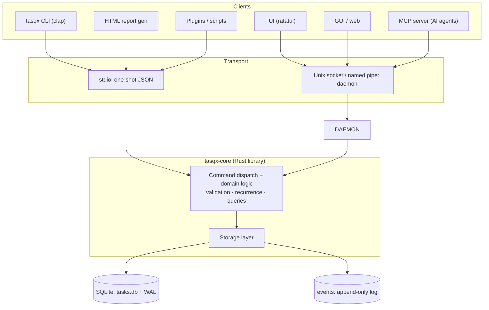
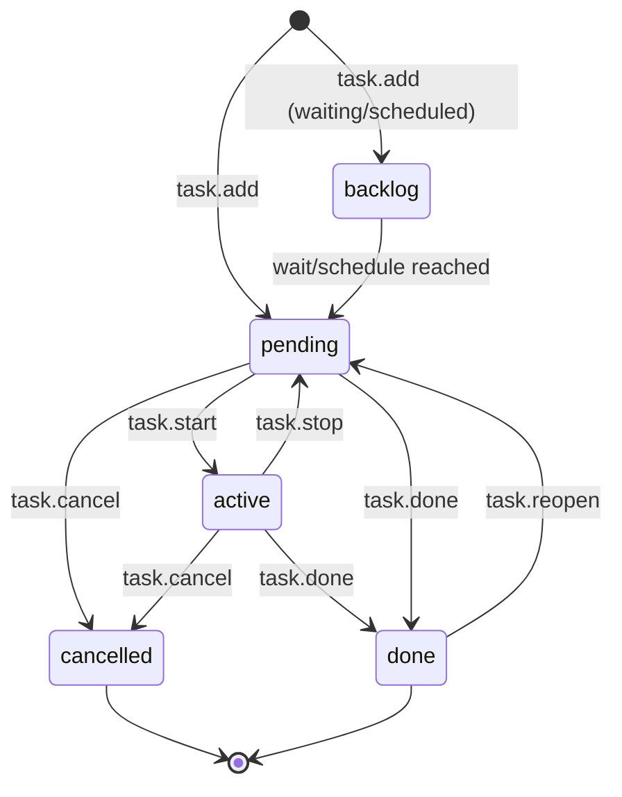
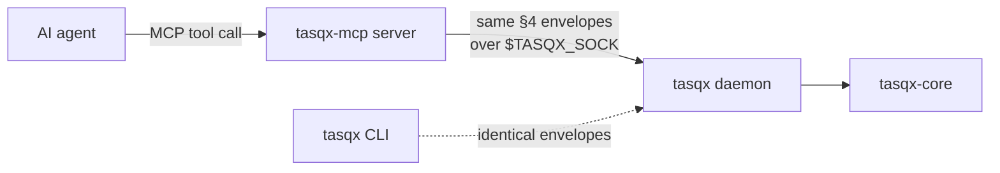

# Tasqx — Design Document

**Tasqx** is a hyper-modern, cross-platform task manager that lives entirely in the terminal: a Taskwarrior reimagined to be faster, better-looking, deeply extensible, and AI-native. It is built as a headless Rust core engine exposing one stable, versioned JSON API; every surface — CLI, TUI/GUI, MCP server, plugins, HTML reports — is a client of that single contract. The north star is not the most features, but a fast, elegant, terminal-first task manager with the best-chosen features and first-class AI support.

---

## 1. Vision & principles

Tasqx is a terminal-native task manager for developers, sysadmins, and power users who live in the shell and want Taskwarrior's power without its friction — faster, prettier, scriptable to the bone, and built so an AI agent is a first-class user, not a bolted-on afterthought.

| Principle | One-liner |
|---|---|
| **Fast** | Sub-10ms for the common path; a one-shot `tasqx add` returns before you lift your finger. |
| **Beautiful** | Considered typography, color, and layout — the default output is something you *want* to look at. |
| **Extensible** | Everything is a client of one stable JSON API; a plugin can do anything the CLI can. |
| **AI-native** | The same typed API that drives the CLI drives an MCP server — agents read and mutate tasks with zero glue. |
| **Local-first** | Your data is a plain file on your disk that works offline forever; no account, no cloud, no lock-in. |
| **Sync-ready, not sync-now** | Stable IDs and an append-only change log mean sync can be *added* later with no data migration and no breaking change. |
| **Scriptable & honest** | Every command speaks human-readable text *and* `--json`, except a short list of self-framing commands that declare why (D31); exit codes and errors are stable contract, not decoration. |

---

## 2. Architecture

Tasqx is a **headless core engine** with a stable, versioned JSON API. Every surface — the built-in CLI, a third-party TUI, a GUI, the MCP server, plugins, the HTML report generator — is just a **client** that speaks that API. The API is the load-bearing artifact; UIs are replaceable.



**Core = a library first.** `tasqx-core` is a plain Rust crate. The CLI links it directly and calls functions in-process — no IPC, no serialization tax on the hot path. The JSON API is a thin envelope *over the same dispatch layer*, so "call a function" and "send a JSON command" run identical code. There is exactly one dispatch table.

### Daemon vs. one-shot

| Mode | When | Why |
|---|---|---|
| **One-shot binary** | Default for `tasqx` CLI, scripts, HTML report, cron | No process to manage; open DB → run one command → exit. SQLite opens in <1ms. |
| **Daemon (opt-in)** | Long-lived clients: TUI, GUI, MCP server, watch mode | Holds the DB connection + warm caches, serves a socket, pushes change notifications so a TUI updates live. A socket-requiring client **lazily auto-spawns a shared daemon** (or start it explicitly with `tasqx daemon`); it **self-terminates after an idle timeout** — `[daemon] idle_timeout`, in minutes, and as shipped it is off (`0`) until configured, because a hand-started daemon must not walk out on its operator; the 15-minute default belongs to the auto-spawned one (§12-D5). The plain one-shot CLI **never** spawns one (§12-D5). |

The CLI **never requires** the daemon. If one is running it uses the socket (live-update semantics for free); otherwise it falls back to a direct in-process open. Same command surface either way.

### Keeping startup instant

- Single static binary, no runtime, no dynamic linking → no loader/interpreter warmup.
- **Lazy everything**: config parsed only if a command needs it; recurrence expansion is incremental, not a full-store scan.
- SQLite with prepared statements and indices; "list my active tasks" touches an index, not the whole table.
- Zero network, zero telemetry on the hot path.

### Concurrency & locking

- SQLite in **WAL mode**: concurrent readers never block; writers are serialized by SQLite's own locking. Two `tasqx add` racing from two shells are safe.
- `busy_timeout` (e.g. 3s) so a one-shot invocation waits briefly rather than erroring under contention.
- The daemon is the *only writer* when running, but one-shot writers stay safe because SQLite's file locking is authoritative across processes — no custom lockfile.
- The append-only event log is written **in the same transaction** as the mutation, so state and history can never diverge.

### Key crates

| Crate | Role | Why this one |
|---|---|---|
| `clap` (derive) | CLI parsing | De-facto standard; derive API, shell completions, help generation for free. |
| `ratatui` + `crossterm` | TUI + cross-platform terminal backend | `ratatui` is the maintained successor to tui-rs; `crossterm` gives identical behavior on Windows/Linux/macOS. |
| `serde` + `serde_json` | (De)serialization of the whole API surface | Zero-cost, ubiquitous; the API envelope *is* `serde` structs, so contract == types. |
| `rusqlite` (bundled SQLite) | Storage | Thin, synchronous, fast; `bundled` ships SQLite *inside* the binary → no system dependency, true single-file distribution. Sync fits the one-shot model (no async runtime for the CLI). |
| `uuid` (v7) | Stable entity IDs | Native UUIDv7 — time-ordered, index-friendly, globally unique (§3). |
| `jiff` | Dates, durations, recurrence, timezones | Modern, correct timezone-aware datetime; better than juggling `chrono` + `chrono-tz`. |
| `thiserror` | Typed error domain | Errors map 1:1 to the stable API error codes. |
| `interprocess` | Unix socket / Windows named pipe | One API for the daemon transport across all three OSes. |
| `directories` | XDG / platform config & data paths | Correct default store location per OS without hand-rolling. |
| `tokio` (daemon only, feature-gated) | Async socket server | Compiled only into the daemon build; the one-shot CLI stays runtime-free and tiny. |

---

## 3. Data model

### Entities

| Entity | Key fields | Notes |
|---|---|---|
| **Task** | `id` (UUIDv7), `short_id` (int, display), `title`, `status`, `priority`, `project?`, `due?`, `scheduled?`, `wait?`, `recurrence?`, `remind?`, `estimate?`, `created`, `modified`, `completed?`, `urgency` (derived), `_rev` | Core entity. `remind` is one canonical string — a `due`-anchored signed offset (`-1h`) kept symbolic so moving `due` moves the reminder, or an absolute instant resolved once at set time (§9a). `short_id` is a small stable integer for humans (`tasqx done 42`); `id` is the sync-safe key. |
| **Project** | `id`, `name` (e.g. `work.api`), `description?`, `archived` | Hierarchy via dotted name; flat table, cheap. |
| **Tag** | `id`, `name`; join `task_tags(task_id, tag_id)` | Many-to-many. |
| **Dependency** | `task_id`, `depends_on_id` | DAG; a task is *blocked* if any dependency is not *resolved* — where resolved means `done` **or** `cancelled` (D11). |
| **Annotation** | `id`, `task_id`, `body`, `created` | Timestamped plain-text notes. |
| **Doc** | `id`, `source?`, `title`, `body`, `created`, `modified` | D41 memory: standalone knowledge rows, FTS5-indexed together with annotation bodies. |
| **Recurrence** | `rule` (RRULE-subset or interval), `anchor`, `template_task_id` | A recurring task is a template that spawns concrete instances. |
| **Event (audit log)** | `id`, `entity`, `entity_id`, `op`, `payload` (JSON diff), `ts`, `actor` | Append-only. The spine of history *and* future sync. |

### Status / lifecycle



| Status | Meaning |
|---|---|
| `backlog` | Exists but not yet actionable (`wait` in future, or `scheduled` later). |
| `pending` | Actionable, not started. The default working set. |
| `active` | Currently being worked (has an open time interval). |
| `done` | Completed. |
| `cancelled` | Abandoned; retained for history, excluded from active reports. |

### On-disk storage: **SQLite** (decided)

| Option | Verdict |
|---|---|
| **SQLite (bundled)** | ✅ **Chosen.** Transactional (state + event log commit atomically), indexed filtering/sorting at scale, single file, inspectable via `sqlite3` / `tasqx export`. Concurrency handled for us (WAL). |
| Plain JSON/TOML files | ❌ Rejected as primary. "Human-readable" is real, but every query is a full parse+scan; no atomicity across a multi-entity change; concurrent writers need hand-rolled locking; O(n) rewrites on every edit. |
| Hybrid (JSON of record + SQLite cache) | ❌ Two sources of truth = sync bugs against yourself. |

**Human-readability without giving up the DB:** `tasqx export` emits canonical JSON (one object per task, sorted keys) and `tasqx import` round-trips it — the git-diffable, greppable, portable form. SQLite is the operational store; JSON export is the interchange format, and the seam future git-based sync plugs into.

### Staying sync-ready without building sync

1. **Stable IDs — UUIDv7.** A real IETF standard (RFC 9562), natively supported by the `uuid` crate, time-ordered (indexes well as a primary key, unlike UUIDv4), and universally recognized. ULID gives the same ordering but is a non-standard encoding — no upside, one more bespoke format. IDs are generated **client-side**, so two offline machines never collide.
2. **Monotonic append-only event log.** Every mutation writes an event in the same transaction — already a replication log. A sync engine ships events; it doesn't reverse-engineer state.
3. **Conflict-friendly shape.** Per-field `modified` + last-writer-wins-per-field is a clean default; the event log preserves enough to do better (3-way / CRDT-per-field) later. Tags and dependencies are add/remove events on a set, which merge commutatively — no conflicts on the common case.
4. **No auto-increment as identity.** `short_id` is display sugar, never a foreign key or sync key.

None of this ships sync now — but none of it has to change to add it.

### One task as stored (canonical `tasqx export` form)

```json
{
  "id": "018f9c2a-7b3e-7c41-a2d9-6f1b0e5c8a12",
  "short_id": 42,
  "title": "Ship the v1 JSON API freeze",
  "status": "active",
  "priority": "H",
  "project": "work.tasqx",
  "tags": ["release", "api"],
  "due": "2026-07-20T17:00:00+02:00",
  "scheduled": "2026-07-16T09:00:00+02:00",
  "wait": null,
  "estimate": "PT4H",
  "recurrence": null,
  "depends_on": ["018f9b81-4c2a-7f60-9d11-2a7e4c9b0d33"],
  "annotations": [
    { "id": "018f9c2b-0a11-7d02-8c55-9e1f3b2a7c40",
      "body": "Blocked on tag.add naming review",
      "created": "2026-07-15T11:04:22+02:00" }
  ],
  "urgency": 14.2,
  "created": "2026-07-10T08:12:00+02:00",
  "modified": "2026-07-15T11:06:10+02:00",
  "completed": null,
  "_rev": 7
}
```

`_rev` is the per-task event counter (last event id applied), giving cheap optimistic concurrency and a future sync watermark.

---

## 4. Core JSON API

The contract every surface depends on. Transport-agnostic: the **same envelope** flows over stdio (one-shot, one request → one response) and over the daemon socket (newline-delimited JSON, multiplexed by `id`, plus server-pushed `event` notifications). It is JSON-RPC-shaped but deliberately minimal.

### Envelope

**Request**
```json
{ "tasqx": "1", "id": "c1", "method": "task.add", "params": { } }
```
- `tasqx` — **API major version**. Breaking changes bump this (`"2"`); additive changes never do. The core refuses an unknown major cleanly rather than guessing.
- `id` — client-chosen correlation id (echoed back; required on socket, optional on stdio).
- `method` — `entity.verb`, stable and namespaced.

**Success**
```json
{ "tasqx": "1", "id": "c1", "ok": true, "result": { } }
```

**Error** — stable, machine-first:
```json
{ "tasqx": "1", "id": "c1", "ok": false,
  "error": { "code": "not_found", "message": "no task with short_id 999",
             "data": { "short_id": 999 } } }
```

| `code` | Meaning |
|---|---|
| `bad_request` | Malformed params / failed validation (`data` lists field errors); also permission denial (`data.reason="permission_denied"`). |
| `not_found` | Referenced entity doesn't exist. |
| `conflict` | Optimistic-concurrency / dependency-cycle / duplicate. |
| `unsupported_version` | Client major version not served. |
| `internal` | Bug; safe to retry-report. |

CLI exit codes map to these (`0` ok, `2` bad_request, `4` not_found, `5` conflict, …) so scripts branch without JSON parsing.

### Method catalogue

`entity.verb`, namespaced and stable. The full set the surfaces below rely on:

| Namespace | Methods |
|---|---|
| `task` | `add`, `get`, `list`, `modify`, `start`, `stop`, `done`, `cancel`, `reopen` |
| `tag` | `add`, `remove` |
| `project` | `create`, `list`, `use`, `archive` |
| `annotation` | `add` |
| `dependency` | `add`, `remove` |
| `memory` | `add`, `search`, `remove`, `import` (D41) |
| `report` | `summary` |
| `event` | `list`, `revert` |
| `store` | `export`, `import` |
| `core` | `capabilities` |

### `project.create`
```json
→ {"tasqx":"1","id":"p1","method":"project.create",
   "params":{"name":"work.tasqx","description":"Terminal task manager"}}
← {"tasqx":"1","id":"p1","ok":true,
   "result":{"id":"018f9a10-2c40-7b91-8e02-1d3f5a7c9b00","name":"work.tasqx",
             "default":true,"current_default":"work.tasqx"}}
```
`default` says whether **this** create claimed the default project — true only when the store had none (D21). `current_default` says what the default is either way, so a caller that did not claim it still learns where a bare `task.add` will go. An empty or whitespace-only `name` is a `bad_request` (D23: D18's rule where names are born), and the `create` event carries the same `default` boolean the result does, so the log can say which create claimed the key.

### `project.use` (D21)
Point the default project — the project a bare `task.add` inherits — at an existing, non-archived project. The **only** way to move it once set.
```json
→ {"tasqx":"1","id":"u1","method":"project.use","params":{"name":"work.tasqx"}}
← {"tasqx":"1","id":"u1","ok":true,
   "result":{"name":"work.tasqx","default":true,"previous":"prive.klussen"}}
```
`previous` is the default this replaced (`null` if there was none). Unknown name → `not_found`; archived project → `conflict` (D22); an empty `name` → `bad_request` (the envelope requires a non-empty string). A whitespace-only name simply names no project → `not_found` (D23: emptiness is checked at `project.create`, so `use` can target anything `init` can create). None of them write. The default lives in the store's `config` table, never in `config.toml` (D21).

### `task.add`
```json
→ {"tasqx":"1","id":"t1","method":"task.add",
   "params":{"title":"Ship the v1 JSON API freeze","project":"work.tasqx",
             "priority":"H","due":"2026-07-20T17:00:00+02:00",
             "tags":["release","api"],"estimate":"PT4H"}}
← {"tasqx":"1","id":"t1","ok":true,
   "result":{"id":"018f9c2a-7b3e-7c41-a2d9-6f1b0e5c8a12","short_id":42,
             "status":"pending","urgency":11.8,"project":"work.tasqx"}}
```
`project` is optional: omit it and the task inherits the default project (D21), and the result names where it landed either way. An **explicit** `project` must name a live project row — unknown → `not_found`, archived → `conflict` (D23), checked inside the same IMMEDIATE transaction as the insert. `task.modify`'s `project` arm applies the identical rule; `null` still clears the field.

### `task.start` / `task.stop`
```json
→ {"tasqx":"1","id":"t2","method":"task.start","params":{"ref":42}}
← {"tasqx":"1","id":"t2","ok":true,
   "result":{"id":"018f9c2a-...","status":"active",
             "interval_started":"2026-07-15T11:06:10+02:00"}}

→ {"tasqx":"1","id":"t3","method":"task.stop","params":{"ref":42}}
← {"tasqx":"1","id":"t3","ok":true,
   "result":{"status":"pending","tracked":"PT52M"}}
```
`ref` accepts either `short_id` (int) or full `id` (UUID) — ergonomic for humans, precise for agents.

### `task.done`
```json
→ {"tasqx":"1","id":"t4","method":"task.done","params":{"ref":42}}
← {"tasqx":"1","id":"t4","ok":true,
   "result":{"status":"done","completed":"2026-07-15T11:59:03+02:00",
             "unblocked":[43,44]}}
```
`unblocked` reports tasks whose last dependency just cleared — surfaces use this for "now actionable" hints.

### `task.list` (filtering)
The filter DSL is a small documented grammar; the same string works on CLI (`tasqx list "project:work.tasqx status:pending +api due.before:tomorrow"`) and API.
```json
→ {"tasqx":"1","id":"q1","method":"task.list",
   "params":{"filter":"project:work.tasqx status:pending +api due.before:2026-07-21",
             "sort":["-urgency","due"],"limit":20,"fields":["short_id","title","due","urgency"]}}
← {"tasqx":"1","id":"q1","ok":true,
   "result":{"count":2,"tasks":[
     {"short_id":42,"title":"Ship the v1 JSON API freeze","due":"2026-07-20T17:00:00+02:00","urgency":11.8},
     {"short_id":47,"title":"Write API conformance tests","due":"2026-07-20T12:00:00+02:00","urgency":9.4}]}}
```

### `task.modify`
```json
→ {"tasqx":"1","id":"t5","method":"task.modify",
   "params":{"ref":42,"set":{"priority":"M","due":"2026-07-22T17:00:00+02:00"},
             "expected_rev":7}}
← {"tasqx":"1","id":"t5","ok":true,"result":{"short_id":42,"_rev":8}}
```
`expected_rev` is optional optimistic concurrency: if the task moved on (rev ≠ 7) the core returns `conflict` instead of clobbering — critical for concurrent agents.

Modifiable fields: `title`, `project` (must name a live project — D23), `priority`, `due`, `scheduled`, `wait`, `estimate`, `recurrence`, `remind`, and `status` (cancellation only — every other transition must go through `task.start`/`stop`/`done` so the single-active (D6), completion-timestamp, and interval-closing invariants hold). **A `null` value clears the field** — this is the sanctioned way to stop a recurrence (D2) or a reminder (§9), and it is exactly what the CLI's `--clear <field>` emits (D13). `title` has no null form. Anything else in `set` is a `bad_request` naming the field.

### `tag.add`
```json
→ {"tasqx":"1","id":"g1","method":"tag.add","params":{"ref":42,"tags":["blocking"]}}
← {"tasqx":"1","id":"g1","ok":true,"result":{"short_id":42,"tags":["release","api","blocking"]}}
```

### `report.summary`
Aggregate call for report generators and dashboards; pure read, no side effects.
```json
→ {"tasqx":"1","id":"r1","method":"report.summary",
   "params":{"group_by":"project","filter":"status:pending","metrics":["count","est_total","overdue"]}}
← {"tasqx":"1","id":"r1","ok":true,
   "result":{"groups":[
     {"project":"work.tasqx","count":6,"est_total":"PT19H","overdue":1},
     {"project":"work.infra","count":3,"est_total":"PT7H","overdue":0}],
     "generated":"2026-07-15T12:03:00+02:00"}}
```

### `core.capabilities`
Clients feature-detect with a read call rather than a hard-coded version string:
```json
→ {"tasqx":"1","id":"h","method":"core.capabilities","params":{}}
← {"tasqx":"1","id":"h","ok":true,
   "result":{"api":"1","methods":["task.add","task.list","report.summary","..."],
             "features":["recurrence","daemon.events"]}}
```

### `store.export` / `store.import`
An export is a **self-contained document**: it never names an `id` it does not carry. With a `filter` that is a real constraint, since a dependency edge points out of the selected subset as happily as into it — so such edges are **dropped**, and the count is reported in `dropped_dependencies` (always present; `0` for an unfiltered export, which stays a byte-identical round trip). The CLI mirrors the count on **stderr**, leaving stdout pure JSON.
```json
→ {"tasqx":"1","id":"e1","method":"store.export","params":{"filter":"+api"}}
← {"tasqx":"1","id":"e1","ok":true,
   "result":{"tasks":[{"id":"018f…","short_id":2,"depends_on":[],"…":"…"}],
             "dropped_dependencies":1}}
```
`store.import` is **two-pass** — every task in the payload is upserted before any edge is wired — so a `depends_on` may point forward to a task later in the array, or to one already in the store (importing filtered slices on top of each other is a normal workflow). A target that is in neither is a dangling pointer and fails the whole import with `bad_request` naming the missing id; one transaction, so a reject writes nothing. See D12.

### One API, two transports

- **stdio (one-shot):** `tasqx api < req.json` writes one response and exits — perfect for scripts, the HTML report generator, and cheap plugin calls. No daemon needed.
- **socket / named pipe (daemon):** the *identical* request objects, newline-delimited and correlated by `id`, plus unsolicited `{"tasqx":"1","event":"task.changed","data":{…}}` notifications so TUIs/GUIs live-update. The MCP server is just a long-lived socket client mapping tool calls onto these methods 1:1.

The transport chooses framing; the contract is the same bytes.

---

## 5. CLI design

The CLI is the reference client of the core API — but it never *feels* like an RPC wrapper. Three rules:

1. **The common case is one word.** `tasqx` shows your working set. `tasqx add "…"` captures. `tasqx 42 done` finishes. Everything else is progressive disclosure.
2. **Forgiving by default.** Fuzzy verb matching, aliases, natural-language dates, short-id-or-UUID refs everywhere. A typo is a suggestion, not an error wall.
3. **Honest under the hood.** Every command is a thin translation to one API `method`. Add `--json` for the raw envelope `result` — except the self-framing commands listed in `JSON_CARVE_OUTS` (D31), each of which records why it has no result left to render; exit codes mirror the error model (§4).

### Command grammar

```
tasqx [GLOBAL-FLAGS] [VERB] [REF...] [ARGS / FILTER] [--flags]
```

- **`REF`** — a `short_id` (`42`), a UUID, a range (`40-45`), a comma list (`42,47`), or `@active` / `@last`.
- **`FILTER`** — the §4 filter DSL, positional and bare: `project:work +api due.before:friday`.
- **Bare invocation** — `tasqx` ≡ `tasqx list @working` (pending + active, sorted by urgency).
- **Ref-first sugar** — `tasqx 42 done` and `tasqx done 42` both work; the parser detects a leading ref.

### Core verbs and forgiveness

| Verb | Aliases | Forgiving behavior |
|---|---|---|
| `add` | `a`, `new` | NL dates (`due:friday`, `due:"in 3 days"`), inline `+tag` / `project:` / `!high` shorthand in the title. A `project:` names a project `init` created — a typo is exit 4, not a silent bucket (D23). |
| `list` | `ls`, `l`, *(bare)* | Saved filters (`tasqx ls @overdue`), fuzzy project prefix (`work.t` → `work.tasqx`). |
| `done` | `d`, `complete`, `x` | Accepts ranges; prints newly-unblocked tasks. |
| `start`/`stop` | `s` / `st` | `start` with no ref resumes `@last`. |
| `modify` | `mod`, `m`, `edit` | `tasqx modify 42 due:mon !high est:4h` — sugar compiles to a `set` map; same NL dates as `add`. Unset with `--clear <field>`; recurrence is just another field (D13). |
| `use` | — | `tasqx use work` — sets the default project a bare `add` inherits. Validated at the edge: unknown → exit 4, archived → exit 5 (D21/D22). |
| `archive` | — | `tasqx archive old` — takes a project out of rotation; the tasks are untouched and `projects --all` still lists it. Unknown → exit 4, already archived → exit 5. Archiving the *current default* clears the default, and the printed line says which of the two happened (D22). |
| `tag`/`untag` | — | `tasqx tag 42 blocking` / `tasqx untag 42 blocking`. A tag is written the same way as in `add`/`modify` sugar — `+api` and `api` name one tag — and untagging a tag the task does not have is exit 4 that removes nothing (D52). The bare-ref form `tasqx 42 +blocking` is **not** built: it needs the fuzzy-ref dispatch below, which is not built either. |
| `pick` | `p`, `fzf` | `tasqx pick [filter]` — a full-screen list of the working set that narrows as you type (fuzzy subsequence, per field), and one key with an effect: enter **starts** the highlighted task. Cancelling, and a filter matching nothing, exit 4 having started nothing. It needs a terminal on stdin *and* stdout, so it refuses in a pipe (exit 2) rather than being composable — see D55 for why that killed the "print the ref" form the mockup drew. |
| `agenda` | `ag`, `cal` | `tasqx agenda [filter] [--days N]` — `list` ordered by time and grouped by day. Each task sits on the EARLIER of its `due` and `scheduled`; overdue first, always; 14 days ahead by default. Tasks with neither date, and tasks past the horizon, are counted under the table rather than dropped (D53). |
| `undo` | `u` | Reverses the newest event by appending a compensating one — the log is never rewritten. Four operations are undoable (`stop`, `untag`, `undep`, `annotate`); every other one exits 5 naming itself and the verb that does take it back. No ref, and no redo (D54). |

**Fuzzy verb matching:** `tasqx stat` → *"did you mean `start`? [Y/n]"* on ambiguity, silent auto-correct on a unique prefix. A sub-millisecond Levenshtein pass over the clap subcommand table — no network.

### Command → core API mapping

| CLI | API `method` | Notes |
|---|---|---|
| `tasqx init <name>` | `project.create` | Claims the default project only when the store has none (D21). Empty/whitespace name → exit 2 (D23). |
| `tasqx use <project>` | `project.use` | Sets the default project — where a bare `add` lands. Must exist and not be archived (D21/D22). |
| `tasqx projects` | `project.list` | `*` marks the default project; `--all` is the only way to see an archived one. |
| `tasqx archive <project>` | `project.archive` | Retires a project. Tasks untouched; archiving the default clears the default and the line says so (D22). Already archived → `conflict` (exit 5), because a second archive changes nothing. No `unarchive` verb and no method behind one — `store.import` writes the flag, so restoring an export is the way back. |
| `tasqx add "…" +t project:p due:…` | `task.add` | Inline sugar parsed client-side into `params`. `project:` must be one `init` created: unknown → exit 4, archived → exit 5 (D23). |
| `tasqx` / `tasqx ls <filter>` | `task.list` | Bare = `filter:"@working" sort:-urgency`. |
| `tasqx 42 start` / `stop` | `task.start` / `task.stop` | `ref:42`. |
| `tasqx 42 done` | `task.done` | Renders `unblocked` hints. |
| `tasqx modify 42 due:mon !high` | `task.modify` | `set:{…}`, optional `--expected-rev`. Sugar + NL dates identical to `add`; `--clear <field>` unsets (D13). `project:` is validated exactly as on `add` (D23). `+tag` additionally issues `tag.add`. |
| `tasqx tag 42 blocking` | `tag.add` | `+blocking` is the same tag; duplicates collapse. Re-adding an existing tag is ok. |
| `tasqx untag 42 blocking` | `tag.remove` | All-or-nothing: a tag the task does not have is exit 4 (`not_found`) and removes none of them (D52). |
| `tasqx 42 annotate "…"` | `annotation.add` | — |
| `tasqx 42 dep 43` | `dependency.add` | Cycle → exit 5 (`conflict`). |
| `tasqx memory add/search/rm/import` | `memory.add` / `memory.search` / `memory.remove` / `memory.import` | D41. `import`: one doc per `.md` file, one transaction, same `source` replaces. |
| `tasqx pick [filter]` | `task.list` → `task.start` | Fetches candidates with the same default filter as `list` (`@working`), then starts the one the user selects. One follow-up verb, not a menu of them (D55). |
| `tasqx agenda [filter] [--days N]` | `task.list` | No `agenda` method: the grouping, the horizon and the earlier-of-two-dates ordering are all rendering over fields the row already carries (D53). The filter defaults to every OPEN status, not `@working` — a future `scheduled` parks a task in `backlog`, which `@working` excludes. |
| `tasqx report <name>` | `report.summary` | Feeds charts (§8) and HTML export. |
| `tasqx docs` | *(none — no store)* | Generates the §8a user guide and opens it. Pure static content; never touches the store (D15). |
| `tasqx undo` | `event.revert` | No params. Appends the inverse of the **newest** event, over a closed set of four ops; anything else is `conflict` (exit 5) naming the way back, and an empty log is exit 4 (D54). |
| `tasqx export` / `import` | `store.export` / `store.import` | Canonical JSON round-trip. |
| `tasqx api < req.json` | *(raw)* | Passthrough: one envelope in, one out. |

> **Color legend for the mockups below:** headers **bold cyan**, urgency-hot values **red/orange**, tags **magenta**, projects **dim blue**, active timer **green**, muted metadata **grey (dim)**. All truecolor, degrading gracefully (§8).

### Examples

**1 — Initialize a project**

```console
$ tasqx init work.tasqx --desc "Terminal task manager"
✓ Project work.tasqx created  ·  now your default project
  tasqx add "…"  drops straight into it.
```

**2 — Add a task (inline NL sugar)**

```console
$ tasqx add "Ship the v1 JSON API freeze +release +api project:work.tasqx due:monday 17:00 !high est:4h"
✓ Added #42  ·  urgency 11.8  ·  due Mon 20 Jul, 17:00  (in 5 days)
  Ship the v1 JSON API freeze   work.tasqx  +release +api  !H
```
`due:monday 17:00` and `est:4h` are parsed by `jiff` into `2026-07-20T17:00:00+02:00` / `PT4H` before the `task.add` call.

**3 — The working set (`tasqx list`, and bare `tasqx` off a terminal)**

```console
$ tasqx list
  ID   URG   P  TASK                                PROJECT      DUE          TAGS
──────────────────────────────────────────────────────────────────────────────────
  42  11.8   H  Ship the v1 JSON API freeze         work.tasqx    Mon 17:00    release api
  47   9.4   M  Write API conformance tests         work.tasqx    Mon 12:00    api test
  31   7.1   H  Fix WAL busy_timeout on Windows      work.infra   ⚠ overdue    bug
  55   4.2   L  Draft README quickstart             work.tasqx    —            docs
──────────────────────────────────────────────────────────────────────────────────
  4 tasks · 1 overdue · est 11h30m        ▸ tasqx agenda   ▸ tasqx pick
```
Row 31's `⚠ overdue` renders in red; the urgency column shades hot→cold. Maps to `task.list {filter:"@working", sort:["-urgency"]}`.

A **bare `tasqx`** produces exactly this whenever nobody is watching — piped, redirected, under `--json`, on `TERM=dumb`, in CI, or with `[dashboard] enabled = false`. On an interactive terminal it opens the dashboard instead (**D58**); `tasqx list` is the spelling that always means the table, and is what scripts should use.

**3b — The dashboard (bare `tasqx` on a terminal)**

```console
$ tasqx
┌ tasqx ─ work.tasqx · 17 open · 1 active · 2 overdue · 3 blocked · 8 done/week ─┐
├──1─ NOW ─────────────────┬──2─ NEXT UP ──────────────────┬──3─ DUE ──────────┤
│ ▶ #42 Ship the v1 freeze │ #17   9.8  H  Fix the pipeline│ OVERDUE  2        │
│   work.tasqx    01:23:07 │ #08   6.4  M  Write migration │  #17 Fix …    −2d │
│   est 4h · tracked 6h12  │ #23   3.9  M  Review the PR   │  #55 Renew    −6h │
├──4─ BLOCKED ─────────────┤ …12 more                      │ TODAY  1          │
│ #61 Deploy tap  → #57    │                               │  #42 Ship   17:00 │
├──6─ PROJECTS ────────────┼──5─ RECENT ───────────────────┼──7─ BURNDOWN ─────┤
│ * work.tasqx  12 ▇▇▇▇  2 │  4m  #42 API contract  active │ 24┤               │
├──8─ TOKENS ──────────────┤ 38m  #47 Conformance  pending │   │▇▇▆▆▅▅▄▄▃▃▂    │
│ work  ████████░░▒│ 13.6M │  2h  #12 README        done   │ 12┤        ▲17    │
└──────────────────────────┴───────────────────────────────┴───────────────────┘
 1-8 panel   tab cycle   j/k scroll   p pick   l list   r refresh   ? help   q quit
```
Eight panels over one shared `task.list` snapshot, one `report.summary` and one window-bounded `event.list` — no new API method (**D58**). Layout is responsive: on one column the three analysis panels share a single slot that `tab` or `6`/`7`/`8` fills. Below 56×14 the screen is never entered.

**4 — Backlog view (not-yet-actionable)**

```console
$ tasqx ls status:backlog
  ID   TASK                          WAIT / SCHEDULED        PROJECT
─────────────────────────────────────────────────────────────────────
  61  Quarterly deps audit          scheduled Aug 01        work.infra
  62  Renew signing certificate     waits until Jul 25      work.infra
─────────────────────────────────────────────────────────────────────
  2 tasks in backlog · will surface automatically when their date arrives
```

**5 — Start a timer**

```console
$ tasqx 42 start
▶ Started #42  Ship the v1 JSON API freeze
  timer running · 00:00:04 · press  tasqx stop  when done
```
The `▶` and elapsed clock are green. `task.start` returns `interval_started`; the CLI stores nothing — elapsed is derived on read.

**6 — Stop, with tracked time**

```console
$ tasqx stop
⏸ Stopped #42  ·  tracked 52m  ·  total on this task 3h41m
```
`task.stop` → `{tracked:"PT52M"}`, humanized client-side.

**7 — Complete, with unblock cascade**

```console
$ tasqx 42 done
✓ Done #42  Ship the v1 JSON API freeze   (3h41m tracked)
  ↳ now actionable:  #43 Publish API docs   #44 Tag v1.0 release
```
The `↳` line is driven verbatim by `task.done`'s `unblocked:[43,44]` — the CLI turns a data field into a nudge.

**8 — Filter / search**

```console
$ tasqx ls "project:work.tasqx +api status:pending due.before:friday" --sort -urgency
  ID   URG   TASK                          DUE          TAGS
──────────────────────────────────────────────────────────────
  47   9.4   Write API conformance tests   Mon 12:00    api test
  43   6.0   Publish API docs              Thu 17:00    api docs
──────────────────────────────────────────────────────────────
  2 matches · 12ms
```
The `12ms` is real: the filter hits an index, not a scan.

**9 — Tag / untag**

```console
$ tasqx tag 47 blocking
#47 tagged +blocking   ·   tags: +api +blocking +release +test

$ tasqx untag 47 test
#47 untagged +test   ·   tags: +api +blocking +release
```
One call each: `tag.add {tags:["blocking"]}` and `tag.remove {tags:["test"]}`. Both
lines name what changed *and* the resulting set, because "tags: +api +blocking
+release" on its own is the same line a removal that did nothing would print.

The single-line form the mockup used to show — `tasqx 47 +blocking -test`, two
calls in one command — is not built: it needs the bare-ref dispatch (`tasqx 47
<verb>`) that no verb has today.

**10 — Interactive chooser (shipped #51; captured from `tui::pick::render` on 2026-08-03)**

```console
$ tasqx pick project:work.tasqx        # then type: api
pick a task   3/4
> api▊
──────────────────────────────────────────────────────────────────────────────
▸ #42  11.8  H  Ship the v1 JSON API freeze  work.tasqx    release api
  #43  6.0   M  Publish API docs             work.tasqx    docs
  #47  9.4   M  Write API conformance tests  work.tasqx    api test

type to narrow   up/down move   enter start   esc clear/quit
```
The query narrows live — a fuzzy **subsequence** match, per field, so `wac` finds
"Write API conformance tests" — and whitespace splits it into terms that all
have to match. Built on `ratatui` in a one-shot alt-screen (no daemon) over a
single `task.list`. `⏎` **starts** the highlighted task; that is the only key
with an effect. The `^s`/`^d`/`^e` dispatch keys and the ref-printing `⏎` this
mockup used to draw are **not** built, and D55 says why: the screen refuses
unless stdin *and* stdout are terminals, so `tasqx pick | tasqx done` — the
whole point of printing a ref — never reaches it.

**11 — Agenda (shipped #54; captured from the binary on 2026-08-03)**

```console
$ tasqx agenda
  ID   URG  P  TASK                             PROJECT     WHEN            TAGS
---------------------------------------------------------------------------------------
Overdue
   3  18.0  H  Fix WAL busy_timeout on Windows  work.tasqx  due 2026-07-29  bug
Today · Mon 2026-08-03
   2  12.0  -  Write API conformance tests      work.tasqx  due 12:00       api
   1  18.0  H  Ship the v1 JSON API freeze      work.tasqx  due 17:00       api release
Tomorrow · Tue 2026-08-04
   4   0.0  -  Quarterly deps audit             work.tasqx  sched
Thu 2026-08-06
   5  10.1  -  Publish the API docs             work.tasqx  due
---------------------------------------------------------------------------------------
5 task(s) · through 2026-08-17 (+14d)
1 undated — no due or scheduled date, so nothing puts them on a day; `tasqx list` shows them
1 further out — `tasqx agenda --days 90` reaches the furthest
```
One `task.list`; the grouping is pure client rendering. What shipped is a
day-grouped list rather than the seven-row week grid this section sketched
originally: the grid spends a line on every empty day and still cannot hold two
tasks with their projects on one row, and "which week" is a worse question than
"what is coming up" for a tool whose every other view is task-per-row. The
columns are the D51 layout `list` uses, fitted once across every group so the
days line up with each other. `--days N` moves the horizon; overdue rows ignore
it. D53.

**12 — Undo (safety net)**

```console
$ tasqx untag 47 blocking
#47 untagged +blocking   ·   tags: +release +api

$ tasqx undo
↩ undid tag.remove  ·  #47 Ship the release
  tags back: +blocking
```
`event.revert` appends the inverse of the **newest** event — the reversed event stays in the log, so
`tasqx chart` reads "the tag came off, then that was undone". Four operations are undoable; every
other one exits 5 naming itself and what does take it back (`done` → `tasqx reopen`, `modify` →
`tasqx show` then a second `modify`). There is no redo, and no ref to aim it with: only the newest
event can be reversed exactly, because nothing has happened since to have overwritten what the
inverse puts back. D54.

---

## 6. Extensibility

Two mechanisms, split by *weight*. Full clients speak the JSON API (and, if native Rust, link the crate). Quick customizations drop an executable on `PATH`. Neither can corrupt the store — every write still goes through the same core dispatch, validation, and event log.

| Mechanism | For | Talks to core via | Language |
|---|---|---|---|
| **Plugin API** | Full clients: third-party TUI/GUI, Jira/Slack integrations, sync backends | JSON API over stdio *or* socket; native plugins link `tasqx-core` | Any (JSON) / Rust (crate) |
| **Hooks + subcommands** | Glue: fire-on-event side effects, custom verbs | `tasqx-<name>` on `PATH`; hook stdin/stdout JSON | Any executable |

### 6a. Plugin API — building a full client

A "plugin" that is really a *client* never imports anything: it opens the socket (or spawns `tasqx api`) and sends envelopes. There is exactly one contract — §4 — so a Python Slack bridge and a native Rust TUI use identical methods.

| Binding | How | When |
|---|---|---|
| **JSON client** (recommended default) | Connect to `$TASQX_SOCK`, or pipe to `tasqx api` one-shot | Any language; process-isolated; survives core upgrades within API major `"1"`. |
| **Native Rust** (`tasqx-core` crate) | `use tasqx_core::{Engine, Command};` — in-process, no serialization | Perf-critical clients (a TUI redrawing per keystroke); accepts semver coupling to the crate. |

The native boundary is a semver Rust crate; the JSON boundary is the API version (`"tasqx": "1"`). **Prefer JSON** unless you measure a reason not to — it carries the stability guarantee across releases. Additive methods/fields never bump the major; `unsupported_version` is only returned on a real major break. Feature-detect via `core.capabilities` (§4), not a hard-coded version string.

**Capability / permission model.** A plugin declares intent in a manifest; the core enforces it at the dispatch layer, so a "read-only" plugin *cannot* emit a write even if it tries.

```toml
# ~/.config/tasqx/plugins/slack-standup/plugin.toml
name        = "slack-standup"
api         = "1"
transport   = "stdio"                        # or "socket"
permissions = ["task.read", "report.read"]   # NO task.write → task.modify is rejected
events      = ["task.done"]                  # may subscribe to these notifications only
```

| Scope | Grants |
|---|---|
| `task.read` | `task.list`, `task.get`, `report.summary` |
| `task.write` | `task.add/modify/done/start/stop`, `tag.add` |
| `project.write` | `project.create`, `project.archive` |
| `events:<name>` | subscribe to that daemon push only |
| `exec` | may be launched as a hook (§6b) |

A call outside declared scope returns `bad_request` with `data.reason="permission_denied"` — the same stable error a malformed param gets, so clients handle it uniformly.

**Safety / sandboxing.**

- **Process isolation is the sandbox.** JSON plugins are separate processes; a crash or hang never touches the core or the DB. WAL locking keeps even a rogue one-shot writer safe.
- **No ambient DB access.** Plugins get *no* file handle to `tasks.db` — every mutation is an envelope that passes validation, recurrence rules, and dependency-cycle checks, and lands in the `events` log in one transaction. No back door around the invariants.
- **`expected_rev` guards concurrent agents.** Two plugins racing on task 42 don't clobber — the loser gets `conflict`.
- Native Rust plugins are *in-process and trusted* — documented as such. Untrusted third-party code ships as a JSON client, never a linked crate.

**Walk-through: a third party builds a TUI.**

1. On launch, look for `$TASQX_SOCK`; if absent, spawn `tasqx daemon` (or fall back to one-shot `tasqx api` per action).
2. Initial paint: one `task.list` with `fields` trimmed to what's visible — the core sorts/filters via SQLite indices, so the TUI never holds the whole store.
   ```json
   → {"tasqx":"1","id":"paint","method":"task.list",
      "params":{"filter":"status:pending","sort":["-urgency"],
                "fields":["short_id","title","due","urgency","tags"]}}
   ```
3. Subscribe for liveness — the daemon pushes unsolicited notifications, no polling:
   ```json
   ← {"tasqx":"1","event":"task.changed","data":{"short_id":42,"_rev":8,"op":"modify"}}
   ```
   On each `task.changed`/`task.done`, patch the one affected row. `task.done` results carry `unblocked:[43,44]` (§4) so the TUI can flash "now actionable".
4. Keystrokes map 1:1 to methods: `d`→`task.done`, `s`→`task.start`, `e`→`task.modify` with `expected_rev` from the row's cached `_rev`, `p`→`project.create`. The TUI implements *zero* task logic.
5. A native (ratatui) build swaps steps 2–4 for direct `Engine::dispatch(cmd)` calls — same command objects, no socket — when it wants sub-millisecond redraws.

The payoff: **the client is a view, the core is the truth.** A GUI is the same five steps with a different render layer.

### 6b. Hooks + custom subcommands

For the 80% case that doesn't need a whole client: run *my* executable when *this* happens.

**Custom subcommands (git-style).** `tasqx foo` with no built-in `foo` searches `PATH` for `tasqx-foo` and execs it, forwarding args and setting `TASQX_SOCK`/`TASQX_API`. `tasqx burndown` → `tasqx-burndown` calls back into `report.summary`. Discovery is listed in `tasqx --help` under "external commands". No registration, no rebuild.

**Event hooks.** Executables in `~/.config/tasqx/hooks/<event>/` are run by the core inside the mutation's transaction boundary. Naming decides the trigger:

| Hook dir | Fires after | Can veto? |
|---|---|---|
| `on-add/` | `task.add` | ✅ non-zero exit aborts the add |
| `on-modify/` | `task.modify`, `tag.add` | ✅ |
| `on-done/` | `task.done` | ❌ (post-commit; side-effect only) |
| `on-start/` `on-stop/` | time tracking | ❌ |

A hook receives one JSON object on **stdin** and, for veto-capable events, may return a modified task on **stdout** (exit 0 = accept, non-zero = reject with stderr as the message).

**Minimal hook — auto-tag imminent work, block project-less tasks:**

```bash
#!/usr/bin/env bash
# ~/.config/tasqx/hooks/on-add/10-triage.sh    (chmod +x)
task=$(cat)                                    # the task, as stdin JSON

if [ "$(jq -r '.project // "null"' <<<"$task")" = "null" ]; then
  echo "every task needs a project" >&2        # stderr → error message
  exit 1                                        # non-zero → task.add returns bad_request
fi

# add +urgent if due within 24h, else pass through unchanged
jq '
  if (.due != null) and ((.due|fromdateiso8601) - now < 86400)
  then .tags += ["urgent"] else . end
' <<<"$task"                                    # stdout → the task the core commits
```

**Input the hook receives** (the pre-commit task):
```json
{ "id":"018f9c2a-7b3e-7c41-a2d9-6f1b0e5c8a12","short_id":42,
  "title":"Ship the v1 JSON API freeze","project":"work.tasqx",
  "due":"2026-07-15T20:00:00+02:00","tags":["release"],"status":"pending" }
```
**Output it returns** (mutation applied by the core, logged as one event):
```json
{ "id":"018f9c2a-7b3e-7c41-a2d9-6f1b0e5c8a12","short_id":42,
  "title":"Ship the v1 JSON API freeze","project":"work.tasqx",
  "due":"2026-07-15T20:00:00+02:00","tags":["release","urgent"],"status":"pending" }
```

**Hook safety.** Hooks run only if `exec` is enabled in config; they run with the user's own privileges (like git hooks), are ordered by filename prefix, and have a kill deadline so a hung hook can't wedge a `tasqx add`. Post-commit hooks (`on-done`) run *after* the transaction so their failure can't roll back a completed task — they log a warning instead.

---

## 7. MCP integration

The MCP server is **a long-lived socket client of the core** (§4). It maps each MCP tool 1:1 onto a JSON method — it holds *no* task logic, no cache of truth, no second data model. Kill and restart it; the store is untouched. The AI surface is not a special path, it's `tasqx api` with a schema.

### Design principle: few, unambiguous tools

An agent must never dither over *which* tool. So: **one verb = one tool**, names are imperative, read and write are visibly separated, and the risky ones gate. We expose ~15 tools, not one `tasqx_do(method, params)` passthrough — a generic passthrough forces the model to author raw envelopes and invites malformed calls.

### Tool surface

| Tool | R/W | Input (key fields) | Output | Core call |
|---|---|---|---|---|
| `tasqx_list_tasks` | R | `filter` (DSL string), `sort?`, `limit?` | `{count, tasks[]}` | `task.list` |
| `tasqx_get_task` | R | `ref` (short_id or UUID) | full task incl. annotations, deps | `task.get` |
| `tasqx_summary` | R | `group_by`, `filter?`, `metrics[]` | grouped counts/estimates/overdue | `report.summary` |
| `tasqx_list_projects` | R | `include_archived?` | `projects[]` | `project.list` |
| `tasqx_add_task` | W | `title`, `project?`, `priority?`, `due?`, `tags?`, `estimate?` | `{short_id, urgency}` | `task.add` |
| `tasqx_modify_task` | W | `ref`, `set{}`, `expected_rev?` | `{short_id, _rev}` | `task.modify` |
| `tasqx_complete_task` | W | `ref` | `{status, unblocked[]}` | `task.done` |
| `tasqx_start_timer` / `tasqx_stop_timer` | W | `ref` | interval / `tracked` | `task.start` / `task.stop` |
| `tasqx_tag_task` | W | `ref`, `tags[]` | resulting tag set | `tag.add` |
| `tasqx_search_memory` | R | `query`, `limit?`, `scope?`, `raw?` | `{count, hits[]}` bm25-ranked (D41) | `memory.search` |
| `tasqx_annotate_task` | W | `ref`, `body` (verbatim text; markdown fine) | `{short_id, annotation{id, body, created}}` | `annotation.add` |
| `tasqx_add_dependency` | W | `ref`, `depends_on` (short_id or UUID) | `{short_id, depends_on[], blocked}`; cycle → `conflict` | `dependency.add` |
| `tasqx_add_memory` | W | `title`, `body`, `source?` | `{id, title, created}` (D41) | `memory.add` |
| `tasqx_create_project` | W | `name`, `description?` | `{id, name}` | `project.create` |

**Why these, not a `modify` overload:** completion, timing, and tagging get distinct imperative tools because the model picks better from distinct names than from a `set` blob — and because they map to distinct core methods with distinct side effects (`task.done` returns `unblocked`; `task.stop` returns `tracked`).

**Filter DSL is the single query language.** The same string the CLI takes (`"project:work.tasqx status:pending +api due.before:tomorrow"`) is the `filter` input — the model learns one grammar, and it's the one documented for humans. No parallel "MCP query object".

### Read vs write, and destructive-op safety

- **Reads are free.** `tasqx_list_*`, `tasqx_get_task`, `tasqx_summary` never mutate — the agent explores at will.
- **Writes are annotated** in the tool schema (`"destructive": true`) so the host applies its confirmation policy. `tasqx_complete_task`, `tasqx_modify_task`, and bulk changes are the sharp edges.
- **Optimistic concurrency by default.** For writes, the server reads `_rev` first and passes `expected_rev` to `task.modify`. If a human edited the task in another shell, the core returns `conflict`; the tool surfaces "task changed under me, re-read and retry" instead of silently overwriting.
- **No hidden bulk delete.** There is deliberately no `tasqx_delete_all` / raw-SQL tool. Cancellation goes through `task.modify status:cancelled` (reversible, logged); the event log makes every agent action auditable and later revertible.
- **Confirmation model:** the server labels writes destructive and defers the actual gate to the MCP host's human-in-the-loop UI — it does not invent its own prompt.

### Worked session

> **User (in a coding session):** "I just merged the API-freeze PR. Close that task, and what's left before the v1 release?"

```
1. Assistant → tasqx_list_tasks
   { "filter": "project:work.tasqx +release status:pending" }
   ← { "count": 3, "tasks": [
        {"short_id":42,"title":"Ship the v1 JSON API freeze","urgency":11.8},
        {"short_id":47,"title":"Write API conformance tests","urgency":9.4},
        {"short_id":51,"title":"Cross-platform release binaries","urgency":7.1}]}

2. Assistant → tasqx_complete_task        (destructive → host confirms)
   { "ref": 42 }
   ← { "status":"done", "completed":"2026-07-15T12:01:00+02:00", "unblocked":[47] }

3. Assistant → tasqx_summary
   { "group_by":"project", "filter":"project:work.tasqx +release status:pending",
     "metrics":["count","est_total","overdue"] }
   ← { "groups":[{"project":"work.tasqx","count":2,"est_total":"PT9H","overdue":0}] }
```

> **Assistant:** Done — marked **#42 "Ship the v1 JSON API freeze"** complete. Completing it unblocked **#47 "Write API conformance tests"**, now actionable. Two tasks remain before v1 (~9h est., none overdue):
> - **#47** Write API conformance tests *(just unblocked)*
> - **#51** Cross-platform release binaries
>
> Want me to start the timer on #47?

The agent never parsed a DB, never held stale state, and its completion respected the same lifecycle machine and event log a human `tasqx done 42` would. `unblocked:[47]` came straight from `task.done`.

### The server is just a client



`tasqx mcp serve` is a local stdio child process. The operator selects `--scope read|write`, with read as the default; the server then exposes only the corresponding tools. This is process configuration, not authentication. A future socket or network transport must add its own peer-authentication and credential boundary rather than trusting a caller-selected scope.

---

## 8. Presentation layer

### Theming model

Themes are **named, layered, and cascading**:

```
built-in theme  ←  ~/.config/tasqx/themes/*.toml  ←  [theme] in config.toml  ←  $TASQX_THEME / --theme
```

- **Built-ins:** `nord`, `gruvbox`, `dracula`, `solarized`, `mono` (ship in-binary, zero files needed).
- **Semantic, not literal:** you theme *roles* (`urgency.hot`, `tag`, `overdue`), never per-command colors. New commands inherit the palette automatically.
- **Overrides are partial:** a user file sets three keys; everything else falls through to the base theme.

```toml
# ~/.config/tasqx/themes/mytheme.toml
name    = "mytheme"
extends = "nord"                 # inherit, then override

[palette]                        # truecolor anchors
bg     = "#2e3440"
fg     = "#d8dee9"
accent = "#88c0d0"
warn   = "#ebcb8b"
danger = "#bf616a"
muted  = "#4c566a"

[roles]
header       = { fg = "accent", bold = true }
project      = { fg = "#81a1c1", dim  = true }
tag          = { fg = "#b48ead" }
priority.H   = { fg = "danger", bold = true }
priority.M   = { fg = "warn" }
priority.L   = { fg = "muted" }
overdue      = { fg = "danger", bold = true }
timer.active = { fg = "#a3be8c" }
urgency.ramp = ["#a3be8c", "#ebcb8b", "#bf616a"]   # cold → hot gradient
```

### Graceful degradation

Detection is automatic and layered; the same render pipeline emits different escapes.

| Environment | Detection | Behavior |
|---|---|---|
| **Truecolor** | `COLORTERM=truecolor` | Full 24-bit palette + gradients. |
| **256-color** | `TERM=*-256color` | Palette quantized to nearest xterm-256. |
| **16-color / basic** | `TERM=xterm`, `linux` | Roles map to the 8/16 ANSI set; gradients collapse to 3 buckets. |
| **`NO_COLOR` set** | env present | Zero SGR color; layout, box-drawing, and **bold/underline** carry meaning. |
| **Not a TTY (pipe)** | `!isatty(stdout)` | Plain space-padded columns, no ANSI — script-safe by default. A pipe has no width, so tables lay out for a fixed 100 cells rather than for the terminal, and two runs of one store stay diffable. |
| **Windows legacy console** | no VT support | `crossterm` enables VT via `SetConsoleMode`; if it can't, falls back to 16-color + ASCII box chars (`+--+`). |
| **Dumb terminal** | `TERM=dumb` | Pure ASCII, no cursor control, no alt-screen. |

Unicode box-drawing degrades to ASCII on the same signal, so tables never turn into mojibake in a legacy `cmd.exe`.

### Native terminal charts

All charts are pure clients of `report.summary` and `task.list` — the core returns numbers, the presentation layer draws. Rendered with Unicode block/braille glyphs; degrade to ASCII bars under dumb/piped/legacy console. Under `NO_COLOR` the glyphs are kept (it is still a Unicode-capable TTY, and per the table above box-drawing carries meaning there) but color is dropped, so the bars read in monochrome.

**Burndown** — `tasqx chart burndown project:work.tasqx --sprint`

```
 Remaining tasks · sprint 29                            ideal ·····  actual ───
 20 ┤●
    │ ●·····
 15 ┤   ╲    ·····
    │    ╲●        ·····
 10 ┤      ╲          ·····
    │       ●───●         ·····
  5 ┤            ╲──●          ·····
    │               ╲────●          ·····●
  0 ┼────┬────┬────┬────┬────┬────┬────┬────┬──
    Mon  Tue  Wed  Thu  Fri  Sat  Sun  Mon
    ▸ on track · 6 left · projected finish Sun (1d early)
```

**Activity heatmap** — `tasqx chart heatmap --year` (GitHub-style, completions per day)

```
 Completions · last 12 weeks                     ░ 0  ▒ 1–2  ▓ 3–4  █ 5+
       Mon ▓ ░ ▒ █ ▓ ░ ░ ▒ ▓ █ ▒ ░
       Wed ░ ▒ ▒ ▓ █ ▓ ▒ ░ ▒ ▓ █ ▒
       Fri ▒ ▓ █ ▓ ▒ ░ ░ ▒ ▓ █ ▓ ▒
           May      Jun      Jul
       ▸ 148 done · current streak 6 days · best 14
```

**Throughput** — `tasqx chart throughput` (weekly added vs. done, braille sparkbars; the window is `--weeks N`, and the inert `--weekly` flag this line once showed was removed)

```
 Weekly throughput                              added ▁▂▃  done ▁▂▃
 W25  added ▆▆▆▆▆▆  6   done ████  4    net +2
 W26  added ████    4   done ██████ 6   net −2  ✓ burning down
 W27  added ██████  6   done ██████ 6   net  0
 W28  added ███     3   done █████  5   net −2  ✓
 W29  added ████    4   done ███    3   net +1
      ▸ 4-wk velocity 4.5 done/wk · WIP trending down
```

### Self-contained HTML reports

`tasqx report weekly --html --out review.html` runs a series of `report.summary` / `task.list` calls over stdio, then templates a **single self-contained file** — inlined CSS, inlined web-safe font stack, charts as inline SVG, zero external requests. Mailable, committable, air-gapped-friendly.

| Aspect | Choice |
|---|---|
| **Typography** | System UI stack for prose (`ui-sans-serif, -apple-system, Segoe UI…`); a mono stack (`ui-monospace, "Cascadia Code"…`) for ids/durations. Generous line-height, one accent weight. |
| **Layout** | Single centered column, ~72ch measure; sticky summary header (counts, velocity, overdue); card sections per project. |
| **Charts** | The §8 burndown/heatmap/throughput re-rendered as crisp inline **SVG** (same numbers, same `urgency.ramp` as a `<linearGradient>`). |
| **Dark/light** | `prefers-color-scheme` media query with CSS custom properties; the report palette is generated from the *active tasqx theme*, so terminal and HTML match. |
| **Data shown** | Completed this period, carried-over/overdue, per-project est vs. tracked, throughput + burndown, "now actionable" list, top tags. |

**Generation flow (honest about the API):**

```bash
# each panel is a pure read of the core API — no privileged access, fully reproducible
tasqx api <<<'{"tasqx":"1","method":"report.summary","params":{"group_by":"project","filter":"completed.after:-7d","metrics":["count","est_total","tracked_total"]}}'
tasqx api <<<'{"tasqx":"1","method":"task.list","params":{"filter":"status:pending due.before:now","fields":["short_id","title","due"]}}'
```
The report generator is *just another client* — anything it shows, a plugin or the MCP server could compute the same way.

---

## 8a. The user guide (`tasqx docs`)

`tasqx docs` renders the English user guide as **one self-contained HTML file** and opens it in the default browser. It reuses the `report --html` idiom exactly: inline `<style>`, inline `<script>`, a system-font stack, one shared HTML escaper, light/dark over `prefers-color-scheme`. No CDN, no web fonts, no images, no server, no network — the file opens off a temp path, a USB stick, or an air-gapped box identically.

**Surface:**

| Invocation | Behaviour |
|---|---|
| `tasqx docs` | Write a temp file, open the default browser. |
| `tasqx docs --out <path>` | Write there; never opens a browser. |
| `tasqx docs --no-open` | Write the temp file, print the path. |
| `tasqx docs --stdout` | Write the HTML to stdout. |

**Eleven pages**, each a `<section id>` shown one at a time by the inline script: overview, install & quickstart, commands, filter grammar, scheduling & recurrence, reminders, daemon & watch, MCP, JSON API, export & import, themes & reports.

**Three properties the tests hold** (`docs.rs`):

- **Self-contained.** No `http://`/`https://`/`src=`/`<link>`/`@import`/`url(`; every `href` is an in-page anchor.
- **Hash-driven navigation, never the History API.** `history.pushState` throws a `SecurityError` on a `file://` document (origin `null`) — which is exactly how `tasqx docs` opens the guide. Navigation is driven by `location.hash` + `hashchange`, the only mechanism that works on that transport, which is what makes anchors genuinely cross-linkable and the back button real.
- **No doc drift.** The Commands and JSON API pages render *from* the `VERBS` / `METHODS` tables, and those tables are asserted equal to clap's own subcommand list (names *and* aliases), `core.capabilities`'s method list, and `main::CLEARABLE`. A verb or method cannot ship undocumented.

---

## 9. Notifications & reminders

Reminders are scheduled off a task's `due` / `scheduled` / `wait` fields plus explicit `remind:` offsets. Two delivery paths, chosen by whether the daemon is running:

- **Daemon present (TUI/GUI/watch users):** the daemon holds an in-memory min-heap of upcoming reminder timestamps (rebuilt from one `task.list due.after:now` on start, updated on every `event` notification) and fires native notifications directly. Survives sleep by re-checking on wake.
- **No daemon (pure one-shot users):** `tasqx` registers with the **OS scheduler** at reminder-set time (`tasqx remind sync` reconciles). The scheduler wakes a tiny `tasqx notify --due` one-shot that queries the store and emits any ripe notifications — keeping the "no background process" promise intact for CLI-only users.

Both paths call one internal `Notifier` abstraction; the OS backend is compile-time selected.

| OS | Native notification | Scheduling (no-daemon path) | Crate / mechanism |
|---|---|---|---|
| **Windows** | Toast (Action Center) via WinRT `ToastNotification`, `AppUserModelID`-registered | **Task Scheduler** (`schtasks` / COM) firing `tasqx notify --due` | `windows` crate; `notify-rust` (WinToast backend) |
| **macOS** | `UNUserNotificationCenter` banner (falls back to `NSUserNotification`) | **launchd** `StartCalendarInterval` agent, or daemon heap | `mac-notification-sys` / `notify-rust` |
| **Linux** | D-Bus `org.freedesktop.Notifications` (libnotify) | **systemd user timers** (`systemd-run --on-calendar`), else daemon heap; headless → no-op safe | `notify-rust` (D-Bus) |

**Cross-cutting details**

- **One abstraction, three backends:** a `Notifier` trait with `winrt` / `mac` / `dbus` impls behind `cfg(target_os)`. `notify-rust` covers the common path; native crates fill gaps (Windows toast actions, macOS categories).
- **Actionable toasts** where supported: *Done* / *Snooze 1h* buttons invoke `task.done` / a reschedule via `task.modify` — the notification is itself an API client.
- **Snooze & dedupe:** a fired reminder writes a `reminded` event so it never double-fires across the daemon *and* scheduler paths.
- **Quiet by default:** no notifications unless `remind:` or a global `[notify] enabled = true` is set — Tasqx never surprises you on first run.
- **Headless/CI safe:** with no notification transport, delivery degrades to a logged line and exit 0 — never an error.

### 9a. As built (daemon path)

The daemon-heap path ships; the resolved shape, and where it pins down §9's looser wording:

**The `remind` field.** One canonical string per task, in exactly one of two forms — the leading sign disambiguates them:

| Form | Example | Stored as | Why |
|---|---|---|---|
| `due`-anchored offset | `remind:-1h`, `remind:-30m`, `remind:-2d` | the offset, **symbolically** (`-1h`) | moving `due` must move the reminder; resolving at set time would freeze it |
| Absolute instant | `remind:"friday 9am"`, `remind:2026-07-20T17:00` | RFC3339, resolved **once** at set time | reuses the one `datetime` NL parser — `remind:` accepts everything `due:` does |

An unsigned value is always a date expression; `-`/`+` always means an offset. Without that rule `3d` is ambiguous ("3 days before due" vs. `datetime`'s "in 3 days"). Offsets normalize to the largest exact unit, so `-60m` and `-1h` converge on one stored form. A *relative* reminder on a task with no `due` is **unanchored, not an error**: it simply never schedules, so clearing `due` cannot retroactively break a task.

`remind` is settable via `task.add` / `task.modify` (null clears it), rides the `add` sugar as `remind:`, appears in `task.list`, and round-trips byte-identically through `store.export`/`import`. A **recurring** instance carries its reminder forward: an offset rides along unchanged (re-anchoring on the new `due` for free), while an absolute instant is shifted by the same delta as `scheduled`/`wait` — inheriting it verbatim would hand the fresh instance a past instant that fires on spawn.

**`reminder.fire` (new §4 method).** Params `{ref, at}` → `{fired, short_id, at}`. It appends the `reminded` event for `(task, at)` and nothing else. The event row is simultaneously the **dedupe key** and the **push surface**; the dedupe check runs *inside* the same IMMEDIATE transaction that writes the row, so two racing firers cannot both observe "not yet reminded". Additive, so the API major stays `"1"`.

- Dedupe is keyed on `(task, instant)`, not on the task alone — moving `due` moves a relative reminder to a genuinely new instant, which *should* fire again.
- `at` is normalized before comparison, so `…T16:00:00+00:00` and `…T16:00:00Z` are one reminder, not two.
- It does **not** bump `_rev`/`modified`. A reminder is a fact about time passing, not an edit; bumping `rev` would spuriously break a client holding `expected_rev`.

**The scheduler.** A min-heap on its own daemon thread, so a slow transport can never stall the accept loop. Maintenance is **rebuild-on-change**, keyed off the same append-only `events` rowid the push path watermarks against: when the max rowid moves, the heap is rebuilt (two queries). That satisfies "updated on every event notification" with exactly one code path that can construct the heap — incremental patching would be a second source of truth to drift, for no gain at this scale — and covers external one-shot writes for free. A reminder that ripened while the daemon was down **still fires, once, on the next start** (§9: "re-checking on wake"), which is what makes dedupe load-bearing rather than decorative. Ripeness (`pop_ripe`) takes `now` as an argument, exactly like `datetime`/`recur`, so no hidden clock read sits in testable logic.

**Verification is the event stream, not the toast.** A ripe reminder's `reminded` event is pushed to `tasqx watch` subscribers like any other event. That is the headless, assertable surface; the OS toast is strictly additive on top of it — which is why the log line is emitted by *every* backend, including the OS one.

**Quiet by default, precisely.** Two independent gates:
1. **Nothing without `remind:`.** A task with no reminder is never on the heap. This is structural, not a policy check — there is no due-date-derived auto-reminder.
2. **`[notify] enabled` gates the *OS* backend only.** A reminder always emits its event + log line (harmless, headless, already opt-in per task); a native toast additionally requires `[notify] enabled = true`. Absent/malformed config resolves to `false`.

**`notify-os` is an off-by-default cargo feature.** The `Notifier` trait and the log backend are always compiled; `notify-rust` is optional. It drags WinRT in on Windows (`tauri-winrt-notification`, ~20 `windows-*` crates) and zbus on Linux, and a visual toast is not headlessly verifiable — neither belongs in the default build's dependency graph or its test surface. `daemon::serve` defaults to the log backend so tests and CI can never grow a toast habit; `serve_with_notifier` is the opt-in seam the CLI uses.

### 9b. Deferred (explicitly not built)

| Deferred | Status / why |
|---|---|
| **The no-daemon OS-scheduler path** — `schtasks` / launchd / systemd user timers firing a `tasqx notify --due` one-shot (the second bullet at the top of §9, and the "Scheduling (no-daemon path)" column above) | **Not built.** The daemon-heap path covers TUI/GUI/`watch` users today. The seam exists and is deliberate: `reminder.fire` is an ordinary API method, and dedupe lives in the store rather than in daemon memory, so a one-shot `notify --due` can pop ripe reminders and fire them through the identical seam without the daemon knowing that path exists. Wiring three OS schedulers (and their install/uninstall/reconcile lifecycle via `tasqx remind sync`) is its own slice. |
| **Actionable toast buttons** — *Done* / *Snooze 1h* invoking `task.done` / a `task.modify` reschedule | **Not built.** Needs per-OS action APIs beyond `notify-rust`'s common path (Windows toast actions need an `AppUserModelID`-registered COM activator; macOS needs notification categories), plus a callback route back into the API from a process that may not be running. Non-actionable toasts deliver the same information today. Note "Snooze" in the "Snooze & dedupe" bullet refers only to this deferred UI — the dedupe half **is** built. |

---

## 10. Additional features

Every extra is a *client* of the same core methods — no new privileged surface, no AI or network dependency in the core, no second data model.

### Ship (high value, low surface)

| Feature | Why it earns its place | API basis |
|---|---|---|
| **Natural-language capture** | `tasqx add "call dentist tomorrow 9am !high +health"` — inline `+tag`, `project:`, `!prio`, and `jiff`-parsed dates; parsing is client-side, so the API stays typed. | `task.add` |
| **Time tracking** | `start`/`stop` intervals give real est-vs-actual data that powers burndown and throughput for free. | `task.start` / `task.stop` |
| **Recurring tasks** | RRULE-subset templates spawn instances incrementally — "water plants every 3 days" without a cron in your head. | `task.add {recurrence}` |
| **Undo / history** | The append-only event log makes `tasqx undo` and `tasqx history 42` deterministic — the safety net Taskwarrior lacks. | `event.revert` / `event.list` |
| **Shell completions** | clap generates bash/zsh/fish/PowerShell completions; dynamic completion of project/tag names via a fast `task.list` / `project.list`. Switching them on is its own problem and has its own ruling (**D57**): the binary says once that they exist, and packaging turns them on without saying anything. | clap + core reads |
| **Saved filters / virtual projects** | `@overdue`, `@today`, `@blocked` as named filters; define your own in config. Muscle-memory speed. | `task.list` (stored filter string) |
| **`tasqx next`** | Prints the single highest-urgency unblocked task — the "what do I do now" button. | `task.list {limit:1}` |
| **Urgency explainer** | `tasqx why 42` breaks down the score (due proximity + priority + age + tags) so ranking is never a black box. | derived from task fields |
| **Watch / live mode** | `tasqx watch` opens a ratatui dashboard that live-updates from daemon `event` pushes — a zero-config "situation room". | daemon `event` stream |
| **Sparklines in footers** | Per-project urgency/velocity sparkline — glanceable trend at zero screen cost. | `report.summary` |
| **Templates** | `tasqx template apply release-checklist --project work.tasqx` fans a canonical task set (with deps) out through `task.add`. Pure client sugar. | `task.add`, `dependency.add` |
| **AI triage / re-prioritize** | Agent reads `task.list`, proposes due/priority/project fixes, applies via `task.modify` with `expected_rev` — never clobbers a human edit. Opt-in. | `task.list` + `task.modify` |
| **Auto-tagging & auto-project** | An `on-add` hook (§6b) infers `+tags`/project from the title — opt-in and swappable, not baked into core. | `on-add` hook → `tag.add` |
| **Standup / weekly summary** | `report.summary` over `completed.after:yesterday` + `status:active`, rendered to Markdown by one `tasqx-standup` subcommand. | `report.summary`, `task.list` |
| **Importers: Taskwarrior / Todoist / GitHub Issues** | Each maps foreign records → canonical export JSON (§3) → `store.import`, via the same seam future git-sync uses. GitHub Issues keeps `#123`/labels/assignees as tags. | `store.import`, `task.add` |
| **Webhook / eventbus bridge** | A daemon client subscribes to `task.changed`/`task.done` and POSTs to Slack/Discord/CI — turns the existing event stream outward, zero core change. | daemon `event` stream |

### Consider later (real value, more surface)

| Feature | Note |
|---|---|
| **Semantic search** (`tasqx find "that auth bug"`) | Local embedding index as a *sidecar* plugin over `task.list`; vectors never go in core. |
| **AI estimate suggestion** | Model proposes `estimate` from title + history — only worthwhile once enough completed-task data exists to be non-random. |
| **Bi-directional GitHub sync** | Import first; two-way sync waits for the general sync engine so there's one conflict model, not a bespoke one. |

### Deliberately out of scope (for now)

| Not building | Why |
|---|---|
| **Full embedded WYSIWYG editor / rich-text notes** | Annotations stay plain text; heavy editing belongs in `$EDITOR`, not the hot path. Keeps startup instant. |
| **Sub-tasks as a separate entity type** | Dependencies + projects already model hierarchy; a parallel tree doubles the data model for marginal gain. |
| **Gantt charts / heavy PM ceremony** | Tasqx is a *task* manager, not Jira. Burndown/throughput cover the useful 90%. |
| **Fuzzy NL *querying* in the core CLI** ("show me stuff I forgot") | Ambiguous and slow; the filter DSL is precise and fast. Open-ended NL lives on the AI surface, not the core. |
| **NL as the *only* interface** | Tasqx is terminal-first and fast; NL is an accelerant on top of the typed API, never a replacement for `tasqx done 42`. |
| **Built-in cloud accounts / telemetry / phone-home** | Non-negotiable: violates local-first and kills trust for a shell tool. Sync arrives later as an opt-in, self-hostable event-log consumer. |
| **Cloud AI baked into core** | Core stays local-first, offline-forever, zero-network on the hot path. AI lives in *clients* (MCP, hooks) the user opts into and points at their own model. |
| **Auto-execute agent actions without a gate** | Destructive MCP writes stay behind the host's confirmation + `expected_rev`. No "AI silently reorganized your tasks." |
| **Plugin GUI toolkit / sandboxed WASM runtime / marketplace** | Plugins are `PATH` executables + JSON clients, full stop. A WASM sandbox is a large surface for little gain while the API is the real extension point. |

---

## 11. Roadmap

Phases are cut so **every one is fast and shippable end-to-end** — each ships a usable slice across the relevant surfaces, not just the core.

> **Build status (2026-08-04):** ✅ MVP + core API + **MCP server** + **presentation** + **scheduling** + **daemon/socket** + **notifications/reminders** + **the `tasqx docs` user guide** + **an adversarial-review hardening pass (D16–D20)** + **explicit default-project control (D21–D22)** + **a second adversarial-review pass on it (D23)** + **the remaining v1 CLI surfaces and the conformance suite (D52–D56)**. `tasqx-core` + `tasqx` CLI, **1112 tests green** across 22 binaries (394 cli-lib + 309 core-lib + the rest spread over the integration suites), 0 warnings from a true clean rebuild. Re-derive that figure from a run rather than trusting this line — it said 241 for the three weeks after it stopped being true, and a count nobody recomputes is a claim about the past wearing the present tense. `cargo test --workspace --all-targets` prints one `test result: ok. N passed` per binary; sum those. Shipped: project/task CRUD, lifecycle (start/stop/done/cancel/reopen), tags, dependencies + blocked/unblock logic (D11), annotations, `report.summary`, `store.export`/`import`, `event.list`, the D8 filter grammar (or/parens/instant dates), the `"tasqx":"1"` JSON API over stdio, **`tasqx mcp serve`** (11 §7 tools over stdio JSON-RPC, read/write scoping that fails closed, optimistic-concurrency-by-default), and the **presentation layer**: cascading semantic themes (5 built-ins) with full graceful degradation (truecolor→256→16→NO_COLOR→plain/piped→legacy-Windows), native terminal charts (throughput/heatmap/burndown), and self-contained themed HTML reports (`tasqx report --html`; inline CSS+SVG, light/dark, injection-escaped). Untrusted text (import/MCP) is sanitized for terminal control bytes and HTML-escaped. Plus **scheduling**: natural-language dates (`due:friday`, `due:"in 3 days"`, `eom`, weekdays, offsets) in `add`/`modify` sugar + flags, and **D2 recurrence** (interval + weekly-on-days + monthly-on-day + monthly-nth-weekday; missed occurrences collapse to one future instance; transactional spawn-on-completion). Plus the **daemon** (§2): `tasqx daemon` serves the JSON API over a Unix socket / Windows named pipe (runtime-free, thread-per-connection, no tokio); one-shot commands auto-route through it when a socket is present (fast fallback to in-process otherwise); live event push to subscribers from both daemon-applied and external writes (event-log rowid watermark + poll); `tasqx watch` live view. Bounded per-subscriber queues + panic isolation (a client can't crash the daemon). Plus **notifications/reminders** (§9, daemon path — see §9a): a `remind` field taking a `due`-anchored offset (`remind:-1h`, symbolic so it re-anchors when `due` moves) or an absolute NL date (resolved once), wired through `add` sugar + `--remind`, the JSON API, `task.list`, and a byte-identical `store.export`/`import` round trip; a daemon-thread min-heap rebuilt on start and on every event-log change (external writes included); the additive `reminder.fire` method whose `reminded` event is simultaneously the dedupe key and the `watch` push surface — idempotent inside one IMMEDIATE transaction, and across daemon restarts; ripeness driven by an injected `now` (no hidden clock in testable logic); a `Notifier` trait with an always-compiled log backend (headless/CI-safe: a logged line and exit 0, never an error) and an OS backend behind the **off-by-default `notify-os`** feature. Quiet by default: no `remind:` ⇒ never scheduled, and a native toast additionally needs `[notify] enabled = true`. Plus **export/import referential integrity** (D12): a filtered `store.export` trims edges leaving the exported set and reports `dropped_dependencies`; `store.import` is two-pass and rejects a dangling target by id; the `dependencies` table gained FOREIGN KEYs on both columns, with a rebuild migration that drops pre-existing dangling edges. Plus the **CLI editing surface** (D13/D14): a `modify` verb (`mod`/`m`/`edit`) mapping to `task.modify` — every steering field settable (`title`, `project`, `priority`, `due`, `scheduled`, `wait`, `remind`, `recurrence`, `estimate`) via the *same* sugar and NL-date parsers as `add`, unsettable via `--clear <field>` over a closed field set, with `--expected-rev` optimistic concurrency and `+tag` routed to a follow-up `tag.add`; recurrence set/clear is `modify`, not a separate verb. `est:`/`--estimate` now parse human durations (`4h`, `1h30m`) into ISO-8601 at the edge. Three bugs found by walking the binary, not by the suite: `--due -1d` was rejected by clap as an unknown flag (the hyphen trap, previously guarded only on `--remind`) *and* the date grammar rejected signed short offsets; sugar was parsed from a joined argv string, so `project:"my big project"` silently set project=`my` and renamed the task; `undep` reported the remaining dep set where the removed edge belonged. Plus the **user guide** (§8a, D15): `tasqx docs` renders eleven cross-linkable pages as ONE self-contained HTML file (inline CSS+JS, system fonts, light/dark, zero external requests — same idiom and same escaper as `report --html`) and opens it in the default browser on Windows/macOS/Linux; `--out` writes without opening, `--no-open` and `--stdout` keep the path headless/CI-safe, and a missing browser is a stderr note plus exit 0, never an error. Every command and every block of output on the page was executed against the real binary. Doc drift is a build failure, not a reader's problem: the Commands and JSON API pages render *from* the `VERBS`/`METHODS` tables, which tests assert equal to clap's subcommand **and alias** tables, `core.capabilities`, and `main::CLEARABLE` — each guard was verified to fail by injecting the drift it claims to catch. Two bugs the suite could not have found were caught by driving the real page: `history.pushState` throws a SecurityError on `file://` (the exact transport `docs` uses), silently breaking deep links and the back button while looking correct — navigation is hash-driven now; and `print!` panics on a closed pipe, which an 87 KB page hits on `tasqx docs --stdout | head`. Plus an **adversarial-review hardening pass** (D16–D20), five findings verified against the real binary before any code moved: `store.import` bypassed the self-dependency and cycle guards `dependency.add` enforces, so a payload could mint a task blocked by itself or a mutual cycle that emptied the working set — and re-exported it verbatim to every downstream store (D16); `util::duration_secs` did unchecked i64 arithmetic, so an estimate `parse_duration` **accepted** (`-e 1000000000000000000w`) panicked `report` with exit 101 in debug and silently wrapped the total — swallowing a real 4h — in release, the exact class D14 exists to prevent, with `html.rs` carrying a second, separately-unchecked copy of the reader that is now deleted (D17); `--project ""` wrote a nameless bucket `projects` and `report` disagreed about, the one nullable field with no parser at the edge (D18); `html::esc` escaped markup but passed terminal control bytes through, and `report --html` defaults to **stdout**, so a hostile title rewrote the reader's terminal title and cleared their screen (D19); and the quickstart's own output blocks were captured against a scratch store, shifting every short_id by one and showing a task no documented command creates, desynchronising a reader from their store at step three (D20). Every fix landed test-first — each new test was watched fail against the original code, including the two docs guards, which were re-run against the reverted page to prove they bite. Plus **explicit default-project control** (D21/D22), found by driving the binary by hand: `project.create` wrote the `default_project` key unconditionally, so the *most recently created* project silently stole the default (`init work`, `init prive.klussen`, then a bare `add` landed in `prive.klussen`) — and there was no way back, because no `use`/`switch` verb existed and `init work` a second time is `conflict`, leaving hand-editing the SQLite config row as the only exit. `create` now claims the default **only when the store has none**, the additive `project.use` method (CLI: `tasqx use <project>`) is the one explicit way to move it — validating existence (`not_found`) and archived state (`conflict`, D22) at the edge, and writing its `use` event in the same IMMEDIATE transaction as the config write — and archiving the current default clears it rather than leaving it aimed at a retired project. The default stays the store's own state; the `[core] default_project` config.toml key was weighed and **rejected** (D21: per-store data, not per-machine preference — a second home buys a precedence rule and a class of bug where config names a project the store never had). The fourth instance of this project's recurring invisible-field failure, and the worst, because it silently redirected *writes*: it is now on every read surface — `project.list` marks each row `default` (`projects` gained a `DEFAULT` column, `*` on the winner), `task.add` returns the `project` it landed in (`Added #N · work` names it), `project.create` returns `default` + `current_default`, and `core.capabilities.default_project` still reports it. The CLI copy was the tell: "now your default project" printed unconditionally and was therefore a lie on every `init` but the first; it is now driven by the field the core returns and, when it did not claim the default, names the verb that would. Plus a **second adversarial pass over that default-project work** (D23), four findings, each reproduced against the real binary before any code moved and three of them genuine at the same seam: D22 said an archived project is out of rotation and then enforced it on `project.use` alone, so `tasqx use prive.klussen` was a `conflict` while `tasqx add "x" --project prive.klussen` filed the task into that archived project with exit 0 and `tasqx projects` listing only `work` — and an unknown `--project` was worse, exiting 0 into a bucket no project surface has ever heard of, so a typo lost the task silently. Explicit `project` on `task.add` **and** `task.modify` is now validated through one shared reader inside the write transaction (unknown → exit 4 naming it, archived → exit 5), which retires the guide's "`project:` is free-form text" promise — a claim D18 had already started walking back — under a new drift guard that fails the build if any documented command files a task into a project no documented `init` creates. The `default_project` key is repaired on open, because "the default names a live project" was enforced only for *new* writes: a store written by older code (each `create` stole the key; `archive` did not clear it) could hold a default aimed at an archived project, where `tasqx projects` showed **no default at all**, `core.capabilities` reported the ghost, and every bare `add` landed in it — pinned by a test that seeds the legacy row directly, since no sequence of current calls can reach that state. `project.create` now rejects a whitespace-only name (D18's rule where names are *born*: `init " "` minted a project that claimed the default, printed as a blank row, and could never be re-selected, because `use " "` refused the exact name `init` accepted — D21's one-way door rebuilt at a narrower edge), and its event records whether it claimed the default, the one default-mutation that did not say so. The fourth finding — that `default_project()` should resolve the key against the table on every read — was **rejected as a fix**: it would leave the stale key in the file, so the next `create` would see a non-empty key, decline to claim, and strand the store with no default and no way to get one but `use`; repairing the file once at the edge is the fix, not teaching every reader to squint. Plus **completion onboarding** (D57): the feature was complete and undiscoverable, so an interactive run whose shell startup file does not mention `TASQX_COMPLETE` now gets one stderr note naming `tasqx completions --install` — once, recorded in a marker written *before* the note is printed so a note that cannot be stopped is never made, governed by `[completion] hint`, and silent under `--json`, off a terminal, on the error arm, on the Tab path and for the `completions` verb itself; the release archives gained a `completions/` directory holding the activation lines (not the registration scripts, which bake `current_exe()` and would name a CI runner's path); and `scripts/brew-formula.sh` renders a tap formula that generates the real registrations at install time, so `brew install` leaves a shell where Tab already works. **Not yet built:** the no-daemon OS-scheduler path and actionable toast buttons (both deferred — §9b), the browsing TUI beyond the dashboard (which shipped — D58), plugins/hooks (§6), the bare-ref command form (`tasqx 42 +blocking`, `tasqx 42 done`) plus the fuzzy verb matching beside it — the `tag`/`untag` verbs and the `tag.remove` method themselves shipped with #52 (D52), spelled `tasqx untag 42 blocking`, the CLI `archive` verb shipped with #53, the `agenda` verb with #54 (D53), `undo` with #55 (D54) and `pick` with #51 (D55) — the socket-client daemon auto-spawn half of D5 (its idle-timeout half shipped with #57), sync (D3).

### 11a. Explicitly deferred — decided, scoped, and consciously not built

These are **deferred, not skipped**. Each was specified, has a ruling in §12 or §9, and is recorded here so no future reader mistakes an absence for an oversight. None is a prerequisite for the v1 contract freeze; all are additive.

| Deferred | Ruling | Status & why it is safe to defer |
|---|---|---|
| **Git-first sync** | **D3** (§12) | **Not built.** Sync is a pure *consumer* of the append-only event log, which has shipped and is written transactionally with every mutation (the load-bearing invariant). Because the log is already the record of truth, the git backend (`store.export` → commit → merge, per-field LWW) can land later without a migration, and the CRDT-per-field upgrade after that is additive on top. Deferring costs nothing structural; building it now would freeze a conflict policy against zero real-world merge evidence. |
| **Full ratatui TUI** | §2 / D26 / **D58** | **Foundation built; `config edit` and `pick` (D55) ship on it; the dashboard is ruled (D58) and scheduled; a task *browser* stays deferred.** The `tui` module ships the part that is genuinely hard to get right — terminal lifecycle, capability gating, theme→ratatui style mapping — and its screens are pure state machines (key in, intent out) so they stay testable in a repo that fails the build on a warning. The dashboard is the third such screen: a read-only overview whose one write path is the `pick` that already exists. What remains deferred is a *browsing* TUI — navigate, edit and complete in place — and that too is more screens on this foundation, not a second foundation. The daemon, socket/named-pipe transport and live `task.changed` push are exercised by `tasqx watch`, and D58's refresh reuses that same data path. Nothing in the JSON API freeze depends on any of it. |
| **Plugins & hooks** | §6 (6a plugin API, 6b hooks + custom subcommands) | **Not built.** MCP proves read/write capability filtering but deliberately does not authenticate plugins: its scope is operator-selected configuration for a local stdio child (D7). A plugin loader therefore still needs a real trust and credential design. Shipping one now would freeze an ABI before there is a second consumer. |
| **No-daemon OS-scheduler notification path** | **§9b** | **Not built.** §9a (the daemon min-heap path) ships and covers every user who has a daemon, TUI, or `watch` running. §9b would add per-OS scheduler integration (launchd / Task Scheduler / systemd timers) for users who want reminders with *no* long-lived process — three OS-specific integrations, each with its own failure modes, for a strictly narrower audience. `reminder.fire` is already an additive public method with an idempotent `reminded` event, so the scheduler path can call the same API later with no core change. |
| **Actionable toast buttons** | **§9b** | **Not built.** Notifications fire (log backend always; OS backend behind the off-by-default `notify-os` feature, which stays absent from the default cargo tree). Buttons — "done" / "snooze" *on the toast* — require a live callback target, which means the daemon must own the toast lifecycle on all three OSes; `notify-rust`'s action support is the least portable part of its surface. Deferred until §9b's process-ownership question is answered, since both features hinge on it. |

### MVP — the spine stands up, and you can actually use it

| Surface | Ships |
|---|---|
| **Core** | `tasqx-core` + `rusqlite` (bundled, WAL); UUIDv7 + `short_id`; entities task/project/tag/dependency/annotation; full lifecycle state machine; append-only event log written transactionally from day one; JSON API **v1** over **stdio one-shot** (envelope, error model, §4 methods); `store.export`/`store.import` round-trip. |
| **CLI** | `add`/`list`/`done`/`start`/`stop`/`modify`/`tag`, bare `tasqx`, NL capture, `--json`, stable exit codes; filter DSL v1 (`project:`, `status:`, `+tag`, `due.before:`); `report.summary`. |
| **Presentation** | Default themed table output; `NO_COLOR` / non-TTY / Windows-console degradation. |

### v1 — freeze the contract, light up every surface

| Surface | Ships |
|---|---|
| **Core** | API v1 declared **stable**; the conformance suite (`crates/tasqx-core/tests/conformance.rs`) is the contract of record — the envelope, the error codes and every method's response shape, with its method floor derived from `dispatch::PARAMS` rather than listed. What it freezes is the **JSON API's shape**; what it does *not* freeze is the MCP **tool schema** — tool names, descriptions and input schemas stay free to move, and `tests/mcp.rs` covers them. The tool *results* are not exempt: `conformance.rs` drives the live `tools/list`, maps each tool to its method and asserts that same frozen result shape, so renaming a response field reddens the MCP half too. Read D56's "excludes MCP" as being about the schema, not the answers. Daemon + socket/named-pipe transport + `event` notification stream. Recurrence engine (RRULE-subset, incremental spawning), urgency model, optimistic concurrency (`expected_rev`), dependency-cycle detection. Single static binary for Windows/Linux/macOS. |
| **CLI** | `pick`, `agenda`, `undo`, `next`, `why`, `tag`/`untag`, `archive`, native charts, shell completions — and the onboarding that makes the last of those reachable without reading the README: one stderr note, said once, naming `tasqx completions --install` (**D57**). Plus `dashboard` (`dash`), and with it the conditional meaning of a bare `tasqx`: the screen when a human is watching, the working-set table everywhere else (**D58**). |
| **Distribution** | Prebuilt archives for four targets on a tag, plus a `completions/` directory inside each one and a generated Homebrew formula that switches completion on at install time (**D57**, `docs/homebrew-tap.md`). Creating the tap repository is the one step outside this repo. |
| **Presentation** | Cascading theme system + built-ins; burndown/heatmap/throughput; self-contained HTML report. The `tui` module (D26) carries the shared terminal lifecycle; `pick` and the dashboard (**D58**) are screens on it, not second foundations. The dashboard's panels use the existing semantic theme roles only, so every shipped `themes/*.toml` is complete for it on day one. |
| **MCP** | `tasqx mcp serve` with the §7 tools over stdio, scoped read/write per **D7**. |
| **Notifications** | ✅ Daemon-heap path (§9a), `Notifier` + log backend always, OS backend behind `notify-os`. ⏳ OS-scheduler (no-daemon) path across all three OSes — deferred, §9b. |

Three corrections were made to this table on 2026-08-04, after it was read as a
release checklist and disagreed with §11a and with §12-D7:

* **Extensibility left v1.** Hooks, git-style custom subcommands and the plugin
  capability model moved to *Later*. §11a already argued the case and called
  them "not a prerequisite for the v1 contract freeze"; this table said
  otherwise, so the two could not both be followed. The argument stands on its
  own: a plugin ABI frozen before a second consumer exists is frozen against no
  evidence. Hooks and custom subcommands are cheaper (process invocation, no
  ABI, no credentials) and could have landed alone, but they buy nothing the
  contract freeze depends on.
* **The MCP row described a design that was rejected.** It said "authenticating
  as a scoped plugin"; **D7** removed the forgeable token prefix, the minting
  command and the environment fallback precisely because scope is operator
  intent for a local stdio child, not an authentication credential. It also said
  "~15 tools" while the server exposes 18.
* **The CLI row was short.** `tag`/`untag` and `archive` were named as missing in
  §11's build status but appeared in no phase table, so a reader working from the
  tables would never schedule them. `tag` was in the *MVP* row and was still not
  built.

The general lesson, recorded because it has now cost time twice: a phase table
is read as a checklist, so a line in it that contradicts a §12 ruling or a §11a
deferral is not a stale note — it is a plan nobody can execute. When a decision
lands in §12, walk the phase tables.

### Later — additive only, never breaking v1

| Surface | Ships |
|---|---|
| **Sync** | As an *event-log consumer*: git-based backend first (export → commit → merge), then optional self-hostable server; per-field LWW → CRDT-per-field upgrade path. |
| **Core / API** | Additive growth (new methods/fields only; major stays `"1"`); attachments / larger annotations, saved-filter storage, richer query grammar. |
| **Extensibility** | Hooks + git-style custom subcommands (process invocation — no ABI, no credentials), then the plugin capability/permission model once a second consumer exists to design the trust boundary against. Moved here from v1 on 2026-08-04; see §6 and §11a. |
| **Ecosystem** | Importers (Taskwarrior/Todoist/GitHub), webhook bridge, templates, semantic-search sidecar, AI estimate suggestion, bi-directional GitHub sync. |

---

## 12. Resolved decisions

The open trade-offs are now decided. Each entry is the ruling + the one-line why; affected sections above have been updated to match. Referenced elsewhere as **§12-D<n>**.

### D1 — Urgency: opinionated default, weights deferred
**Decision:** Ship **one fixed, well-chosen urgency formula** in v1 (due-proximity + priority + age + tag boosts), with `tasqx why 42` always exposing the breakdown. `[urgency]` weight overrides arrive **Later** — additive, non-breaking.
**Why:** Transparency (`tasqx why`) buys most of what tunability would, without the Taskwarrior coefficient-soup bikeshed; a fixed default means everyone's urgency is comparable and supportable. Making weights config later never breaks the frozen formula.

### D2 — Recurrence: interval + weekday/monthly subset, missed collapse to one
**Decision:** v1 supports **`every N days|weeks|months`, `weekly on <days>` (e.g. Mon,Wed,Fri), `monthly on day D`, and `monthly on the Nth <weekday>`** — not full RRULE. Missed occurrences (machine was off) **collapse to a single catch-up instance** and the anchor advances to the next future slot; no backfill storm. A per-recurrence `on_missed = catchup|skip` field is reserved for Later.
**Why:** That subset covers ~90% of real reminders; collapsing avoids the "7 stale *water plants* tasks after a week away" failure that makes recurrence feel hostile. Deciding the shape now keeps it inside the v1 API freeze.

### D3 — Sync: git-based first, per-field LWW default, event-log consumer
**Decision:** First sync backend (**Later** phase) is **git-based** — `store.export` → commit → merge — with **per-field last-writer-wins** as the default conflict policy, driven entirely off the append-only event log. An optional self-hostable sync server comes after; **CRDT-per-field is an additive upgrade**, not a migration.
**Why:** Git-based sync needs zero infra we operate and honors local-first/self-hostable; building it as an event-log consumer means the harder CRDT path later is opt-in without a data migration. Set/2-way merges (tags, deps) already commute (§3), so LWW conflicts are rare in practice.

### D4 — `short_id`: stable forever, opt-in compaction only
**Decision:** `short_id` is **assigned once and never recycled**. Compaction/renumbering exists **only** as an explicit, user-invoked `tasqx gc --renumber` (loud, confirmed) — never automatic.
**Why:** Recycling is a safety bug: a stale terminal scrollback makes `tasqx done 42` hit the *wrong* task. Sparse climbing integers are a trivial cost next to that; users who truly want density opt in knowingly. (`id` UUIDv7 remains the real key regardless.)

### D5 — Daemon: socket-clients auto-spawn a shared daemon, idle-timeout shutdown; CLI never spawns
**Decision:** The **one-shot CLI never starts a daemon.** Socket-requiring clients (TUI, GUI, MCP, `watch`) **lazily auto-spawn one shared daemon**, which **self-terminates after an idle timeout** (default 15 min post-last-disconnect, `[daemon] idle_timeout`). Explicit `tasqx daemon` still available.
**Why:** Preserves the "no surprise background process for CLI users" promise while giving live clients their push stream for free; idle shutdown means it never becomes a lingering ghost. (Reflected in §2.)

**As shipped (idle shutdown, #57):** the timeout exists and is **off unless configured** — `[daemon] idle_timeout` is a number of minutes, `0` (the default) never exits. The 15 minutes above is the default for the *auto-spawned* daemon this entry describes, and nothing auto-spawns one yet: every daemon that runs today was started by a human typing `tasqx daemon`, and a process that walks out of a terminal its operator is watching is a surprise of exactly the kind this entry set out to prevent. When the auto-spawn half lands it passes the 15 minutes at the spawn site, which is the one place that knows the daemon was nobody's deliberate choice. "Idle" is stricter than "no client": no admitted connection, no subscriber, no reminder ripening inside the timeout window, and no OTLP export (#18) posted during the current quiet stretch — a subscriber or a telemetry client loses work *silently* when the daemon leaves, so neither may be inferred from the socket being quiet. That last term is **traffic, not configuration**, and the first cut got it wrong: it asked whether the receiver was *bound*, which is a constant for the life of the process, so `[otlp] enabled = true` disabled `[daemon] idle_timeout` outright — the daemon printed "will exit after N minute(s)" on stderr and then ran forever, with every unit test green because they all handed the predicate a literal. The receiver now stamps a clock on each accepted peer and the idle check reads that; the guard that would have caught it is an integration test built with **both** options set, since no test of the predicate alone can see what its call site feeds it. The exit goes through the same shutdown flag Ctrl-C sets, so a request that arrives in the race window is refused with `unavailable` rather than committed unanswered.

### D6 — Timers: single active by default, opt-in concurrent
**Decision:** Starting a task **auto-stops the currently active one** (at most one `active` task). Genuine multitasking is opt-in per call — `tasqx start 42 --keep` — and globally via `[tracking] single_active = false`.
**Why:** Single-active yields clean, unambiguous est-vs-actual data that powers burndown/throughput; the `--keep` escape hatch covers real interrupt-driven work without polluting the default. `task.start` gains an optional `keep: bool` param; the lifecycle machine (§3) is unchanged.

### D7 — MCP: bundled `tasqx mcp` subcommand, explicit stdio scope
**Decision:** Ship the server **inside the main binary as `tasqx mcp serve`** (no separate artifact). The host invokes `tasqx mcp serve [--scope read|write]`; omitted scope is read-only. Scope is operator intent for this local stdio process, not an authentication credential. The former forgeable token prefix, minting command, and environment fallback are removed. A future socket/network transport must define separate peer authentication and must not reuse caller-selected `Scope` as an auth boundary.
**Why:** One binary remains the simplest install. Explicit scope describes what the implementation actually enforces without false secret or plugin-authentication semantics, while retaining least privilege and avoiding YAGNI credential machinery for a child process whose operator controls its arguments.

### D8 — Filter DSL: predicates + booleans + grouping, and stop there
**Decision:** The grammar supports field predicates (`project:`, `status:`, `due.before:`…), `+tag`/`-tag`, comparison suffixes (`.before/.after/.is`), **implicit-AND (space), explicit `or`, and parentheses grouping** — e.g. `(+api or +infra) and due.before:friday`. **Saved-filter references expand as text** (`@overdue`). Explicitly **excluded**: arithmetic, computed expressions, subqueries.
**Why:** Booleans + grouping cover every real query while staying a fast, teachable, index-friendly grammar; drawing the line at expressions/subqueries stops it from creeping into a query language we'd regret maintaining. Open-ended natural-language querying stays on the AI surface, not the core (§10 out-of-scope).

### D9 — Config: split files, explicit precedence, platform data dirs
**Decision:** Three concerns, three locations: **`config.toml`** (behavior), **`themes/*.toml`** (appearance), **`plugins/*/plugin.toml`** (extensions). Precedence low→high: **built-in defaults → `config.toml` → `TASQX_*` env vars → CLI flags.** Paths via `directories` (Linux `~/.local/share/tasqx/`, macOS `~/Library/Application Support/tasqx/`, Windows `%APPDATA%\tasqx\`; config in each platform's config dir), overridable wholesale by `TASQX_DATA_DIR` / `TASQX_CONFIG_DIR`.
**Why:** Separation of concerns makes themes and plugins independently shareable without leaking personal behavior config; a single documented precedence chain removes "why did my flag not win" surprises; the env overrides enable portable/CI installs.

### D10 — Distribution: cargo + Homebrew + Scoop/winget + signed binaries, no self-update
**Decision:** v1 ships via **crates.io, Homebrew, Scoop + winget, and direct GitHub Release binaries** for all three OSes. **macOS binaries are notarized; Windows binaries are Authenticode-signed.** **No built-in self-update** — `tasqx` may passively note "a newer version exists," but updating is the package manager's job.
**Why:** Meeting users in their native package manager drives adoption; unsigned binaries are a hard trust-killer on macOS/Windows, so signing is non-negotiable for v1; staying out of self-update avoids a large security/permissions surface that package managers already own well.

### D11 — A cancelled dependency is *resolved*, not blocking
**Decision:** A task is blocked only while it has a dependency that is neither `done` **nor** `cancelled`. Cancelling a blocker **releases** its dependents (they become actionable), and `task.cancel` returns the same `unblocked:[…]` cascade that `task.done` does. (Refines the §3 dependency rule, which originally read "not `done`".)
**Why:** A cancelled task will never complete, so treating it as a permanent blocker traps dependents in a blocked state escapable only by manually removing the edge — a hostile dead-end. "Resolved = done or cancelled" matches user intent (cancelled = abandoned) and keeps the dependency graph honest. Surfaced during the core-complete build when the literal §3 wording produced a forever-blocked task in a live run.

### D12 — An export is self-contained; a dependency edge is a real reference
**Decision:** Three coupled rules. (1) **`store.export` drops edges leaving the exported set** and reports the trim as `dropped_dependencies` (additive result field; `0` unfiltered, so the API major stays `"1"` and the round trip stays byte-identical). (2) **`store.import` is two-pass** — all tasks upserted, then edges wired — and **rejects** an edge whose target is neither in the payload nor already in the store, with a `bad_request` naming the missing id. (3) The `dependencies` table carries **`FOREIGN KEY`s on both columns** (`foreign_keys=ON` was already set but nothing was declared); existing stores are rebuilt by migration, which drops any already-dangling edge. Correspondingly, `depends_on_ids` joins `tasks` like every other dependency reader.
**Why:** Found in a live run, not by the suite: `export "+api"` emitted a task whose `depends_on` named a task the export did not contain, and importing that produced an edge that *no reader could see* — `is_blocked`/`depends_on_short_ids` inner-join `tasks`, so a dangling edge contributes zero rows — leaving a task that showed `blocked:false`, appeared in `next`, could not be `undep`'d, and silently flipped to `blocked:true` when the target was imported later. Rejecting beats repairing: an edge to an unknown id means the operator exported the wrong slice, and inventing a placeholder or dropping it at import would hide that. The FK makes the corrupt state unreachable rather than merely unreached, and the export-side trim is what makes a filtered export importable at all. The path had **zero coverage** because the round-trip test never applied a filter.

### D13 — `modify` carries every field, including recurrence; `--clear` is the only way to unset
**Decision:** Four coupled rules for the CLI's editing surface. (1) **No `recur` verb.** Recurrence is set and cleared through `modify` like any other field (`modify 4 repeat:"every 3 days"`, `modify 4 --clear recurrence`), because §5's grammar already sanctions exactly one editing verb whose sugar "compiles to a `set` map", and `task.modify` is the single method that carries it. A dedicated verb would be a second spelling of one API call, with its own flags to keep in sync. (2) **Setting and clearing are different shapes.** A value is `due:friday` or `--due friday`; removal is *only* `--clear due`, a repeatable flag over a closed set of field names (`project priority due scheduled wait remind recurrence estimate`). There is deliberately no magic empty value: `--due ""` is a bad date, not an erasure, so a shell variable that expands to nothing can never silently wipe a field it meant to set. `--clear title` is rejected at parse time by omission from that set — a task without a title is not a task — and `--clear status` likewise, since lifecycle moves through `start`/`stop`/`done`/`cancel` so their invariants hold (D6). Naming a field in both a set and a `--clear` is a `bad_request`, not a precedence puzzle. (3) **`add` and `modify` share one sugar parser and one set of core parsers** (`datetime::parse_when`, `parse_duration`, `recur::parse_rule`, `remind::parse_remind`): the same token means the same thing in both verbs, and only the *absence* of a token differs — "no value" for `add`, "leave it alone" for `modify`. (4) **`+tag` on `modify` is the one exception to one-verb-one-method**: tags do not live in the tasks row and `task.modify` has no `tags` field, so they are applied by a follow-up `tag.add`, issued *after* the modify so a rejected modify (bad value, lost `expected_rev` race) leaves nothing behind. Silently dropping a `+tag` the user typed would be the worse trade.
**Why:** Without `modify` the CLI could not clear a field or stop a recurrence at all — both were reachable only from the JSON API or MCP, which is not a daily driver. The `--clear` shape is a direct answer to the ambiguity that an in-band sentinel creates: every candidate (`due:`, `due:none`, `--due ""`) overloads a value space that natural-language dates already occupy, and the failure mode is silent. Two real bugs surfaced while walking the verb end-to-end and are now regression-guarded: `--due -1d` was rejected by clap as an unknown `-1` flag (the §5 hyphen trap, previously fixed only on `--remind`, and the date grammar itself rejected signed short offsets), and — worse — sugar was parsed from a *joined* argv string, so `modify 1 project:"my big project"` set the project to `my` and renamed the task to `big project` with no error. Argv boundaries are information the shell already resolved; the parser now honors them.

### D14 — `estimate` is parsed at the edge, not stored as typed
**Decision:** `est:4h` / `--estimate 90m` resolve through a core `datetime::parse_duration` into the ISO-8601 form the column holds (`PT4H`, `PT1H30M`); an already-ISO value passes through validated, and junk is a `bad_request`.
**Why:** `estimate` is an opaque string to the API, so an unvalidated `4h` would be accepted and then silently ignored by every consumer that reads it back as a duration — `report.summary`'s `est_total` would quietly total it as zero. A value that looks stored but doesn't count is worse than a rejected one, so the parser lives next to `parse_when` (the other "what a human types → what the column holds" function) and its output is asserted to read back through the same duration reader the report uses.

### D15 — `tasqx docs` is headless-safe by construction, and its docs cannot drift
**Decision:** `tasqx docs` writes the guide first and opens a browser second, treating every launch failure as a note on stderr plus exit 0 — never an error. `--out <path>` implies "no browser" (naming an output file is asking for the file), `--no-open` skips the launch explicitly, and `--stdout` pipes the HTML. The command touches no store and no config, so it cannot fail for a reason the reader is trying to look up. Browser launch shells out per platform (`cmd /C start ""` / `open` / `xdg-open`→`gio`→`wslview`→`x-www-browser`→`www-browser`) rather than taking a dependency, fire-and-forget so `xdg-open` cannot block the prompt. Documentation accuracy is enforced by *generation*: the Commands and JSON API pages render from the `VERBS` / `METHODS` tables, which tests assert equal to clap's subcommand + alias tables, `core.capabilities`, and `main::CLEARABLE`.
**Why:** A docs command that exits non-zero on a headless box makes CI red over a courtesy, so the file — not the browser — has to be the deliverable, and the headless path has to be the *default* path with one fewer step rather than a separate mode. And prose drifts silently: a hand-maintained verb list is a second source of truth that is wrong the moment someone adds a subcommand, and nothing fails. Rendering the page from the same table the test compares against clap makes "the docs are stale" a build failure instead of a reader's problem. Two bugs were found this way that no structural test would have caught: `history.pushState` throws on `file://` (the exact transport `docs` uses), which silently broke deep links and the back button while *looking* correct; and `print!` panics on a closed pipe, which an 87 KB page reaches whenever `tasqx docs --stdout | head` runs.

### D16 — `store.import` enforces every graph invariant the API enforces
**Decision:** `store.import`'s edge pass applies the *same* two guards `dependency.add` does, on the transaction's own write-locked snapshot: an edge whose target is the dependent is a `conflict` ("a task cannot depend on itself"), and an edge whose target already reaches the dependent is a `conflict` naming the cycle. Both sit beside the existing dangling-target check, inside the one IMMEDIATE transaction, so a rejected payload writes nothing. The `reaches` DFS is shared, not reimplemented.
**Why:** Import was a back door around invariants the API calls conflicts. A payload could mint a task blocked *by itself* (`get 1` → `blocked true / depends_on #1`, unreachable through `dep 1 1`, which exits 5), or a mutual A↔B cycle that left both tasks permanently blocked and `tasqx list` printing `No tasks.` with no indication why — the entire working set gone, and the operator's first job is working out *why*. Worse, the corrupt graph **re-exported verbatim**, so one bad payload propagated to every downstream store and survived every future hop. The FOREIGN KEYs added in D12 constrain *existence*, not *acyclicity*: two layers, neither catching it. The path had zero coverage because the import tests only exercised dangling and forward-reference targets. Rejecting beats repairing, as in D12: a cycle in a payload means the producer is broken, and silently dropping the edge would hide that.

### D17 — duration arithmetic is total, and there is exactly one duration reader
**Decision:** `util::duration_secs` is **total**: every multiply and add is `checked_*`, returning the `None` its signature has always promised. `datetime::parse_duration` validates the **human** branch through `duration_secs` exactly as the ISO branch already did — what we store, the reader can read — and folds weeks→days with checked arithmetic. `report.summary` accumulates with `saturating_add`. The CLI's private copy of `duration_secs` in `html.rs` is **deleted**; `tasqx_core::util` is now `pub` and both surfaces call the one reader.
**Why:** This is the exact bug class D14 was created to prevent, reintroduced days later by the grammar D14 added. `tasqx add "x" -e "1000000000000000000w"` was **accepted** (exit 0), storing `P7000000000000000000D`; `tasqx report` then panicked at `util.rs:49` with exit 101 — permanently, until the operator found and deleted the row — while `tasqx list` still exited 0, so the store *looked* healthy. In release (`overflow-checks` off, no `[profile]` section) there was no panic at all: the total silently wrapped to `PT1402444266289092H17M4S` and **swallowed a real 4h estimate**. A silently wrong number is what ships to users. D14's claimed guard ("output reads back through the same duration reader the report uses") never covered the human branch, which accumulated into `i64` and formatted directly — so the property was asserted of the one branch that already held it. The project had already learned this for dates (`an_absurd_unit_count_is_rejected_rather_than_panicking`, added after `due:99999999d` exited 101); the duration grammar shipped with zero overflow coverage. Reachable from the JSON API and MCP, so an agent writing a bogus estimate could kill reporting for a human. The duplicate reader in `html.rs` is why `report --html` panicked *independently* of the core fix — it had also drifted (silently ignoring years/months). Two copies of a rule is one copy too many.

### D18 — `project` is rejected empty, like every other nullable field
**Decision:** `task.modify`'s `project` arm rejects an empty or whitespace-only string with a `bad_request` pointing at `--clear project`. `Value::Null` (what `--clear` sends) still clears it.
**Why:** `project` was the **only** nullable field with no parser in front of it — `--due/--scheduled/--wait ""` are already "empty date expression" and `--estimate ""` is "empty duration", all rejected at the edge, but `nullable_string` passed `""` straight through as a legitimate non-null value. That minted a nameless project bucket: the raw column held `''` rather than NULL, so `projects` never listed it while `report` showed a blank-named row containing the task — the task was in a project the project list said did not exist. Two different states for "no project", one of them invisible. It also directly contradicted D13's own rationale ("a shell variable expanding to nothing can never wipe a field it meant to set"): for `project`, `--project "$MAYBE_UNSET"` silently wrote a ghost value instead. Rejecting matches the siblings and keeps `--clear` the single sanctioned way to empty a field.

### D19 — one sanitizer standard for both output surfaces
**Decision:** `html::esc` strips C0/C1 control bytes (keeping tab and newline) *before* escaping `& < > " '` — the same rule `render::san` applies to the terminal path.
**Why:** `report --html` defaults to **stdout**, the same terminal `render.rs` carefully protects. Markup escaping was sound (injected `<script>`, `onerror=`, `<svg onload=` all came back inert), but control bytes passed through untouched, so a hostile title emitted raw `ESC ]0;HIJACKED BEL` (rewrites the terminal window title) and `ESC [2J` (clears the screen) straight into the user's terminal, which executed them. Titles are untrusted: they arrive via `store.import`, the JSON API, and MCP. The terminal path has asserted "raw escape reached the terminal" never happens since its first tests; the HTML path — with the same default sink — held no such standard. `esc` was already promoted to `pub(crate)` as "the one escaper both surfaces share"; it now enforces one rule for both.

### D20 — the worked example is guarded mechanically, not by the author's memory
**Decision:** The quickstart's blocks are captured from a store seeded by exactly the commands the page shows, in order. Two tests hold the page to it: the Nth `add` on the page must print `Added #N` (short_ids are handed out in creation order), and no row in a documented output block may name a task no documented command creates — with the row count asserted against the rows shown. Both parse the page a reader actually reads, so there is no parallel list to keep in sync.
**Why:** D15 made *structure* undriftable (verbs, methods, clear-fields render from the tables the tests compare against clap) and the page claims, twice, that "every command and every block of output on this page was executed against the real binary; nothing here is illustrative". Nothing checked the **output**. The blocks had been captured against a scratch store seeded with extra out-of-band tasks, so the 2nd `add` printed `Added #3` and the working-set table showed four rows including "Write the user guide" — a task no command on the page creates. That is not cosmetic: the next snippets say `why 1`, `done 4`, `dep 2 1`, so a reader following along desynchronises from their own store at step three and `done 4` targets nothing in their 3-task store. The row was *real* — it reproduces exactly (urgency 11.5, `+docs`, due friday) once `Write the user guide` exists as #2, and later pages depend on that id (`modify 2 due:monday` → 8.9 on the daemon page) — so the fix restores the missing `add`, it does not delete the row. A claim of "nothing here is illustrative" must be enforced by a test or it is decoration; both guards were verified to fail against the original page.

### D21 — the default project is claimed once and moved only by `project.use`
**Decision:** `project.create` writes the `default_project` config key **only when the store has none** — the first project you ever create becomes the default, and no later `create` ever moves it. `project.use` (CLI: `tasqx use <project>`) is the one explicit way to change it: it requires an existing, non-archived project, records a `project`/`use` event in the same IMMEDIATE transaction as the config write, and returns `{name, default, previous}`. An unknown name is `not_found` (exit 4) naming it; an empty/whitespace name is `bad_request` (exit 2, D18's rule at a new edge); neither writes. The default stays **in the store's `config` table** — there is deliberately **no `[core] default_project` key in config.toml**. And because it is state that drives behavior, it is now readable everywhere it is used: `project.list` marks every row with a boolean `default` (the CLI's `projects` table gained a leading `DEFAULT` column, `*` on the winner), `task.add` returns the `project` it landed in (the CLI's `Added #N` line names it), `project.create` returns both `default` (did *this* create claim it?) and `current_default` (what it is regardless), and `core.capabilities.default_project` continues to report it.
**Why:** Every `project.create` wrote the key unconditionally, so the most recently created project silently stole the default — `init work`, `init prive.klussen`, then a bare `add` landed in `prive.klussen` — and there was no way to set it back: no verb, and `init work` a second time is `conflict` (exit 5), so the store had a one-way door. The user's only exits were typing `project:work` forever or hand-editing the SQLite config row. Claiming-when-unset keeps the genuinely helpful behavior (your first project is obviously the one you mean) while making every subsequent move explicit, which is the whole difference between a default and an accident. The CLI copy was the tell: "now your default project" printed unconditionally, so it was **a lie on every `init` after the first** — it is now driven by the `default` field the core returns, and the not-claimed branch names the verb that would move it, because being left with no idea a control exists is the actual complaint. **On config.toml:** the default names a row in *this store's* `projects` table — it is validated against that table, cleared when that row is archived (D22), and meaningless against a different `TASQX_DB`. That makes it per-store data, not per-machine preference like `theme.name` or `notify.enabled`. A second home would buy nothing and cost a precedence rule to explain and keep straight, plus a class of bug where config names a project the store has never heard of; and `use` would have to either write config (making store-scoped state machine-scoped, and putting the daemon and the CLI on different sources of truth) or write the store and be silently overridden. One fact, one home. **On visibility:** this project's recurring failure is a field that is stored, drives behavior, and is shown on no read surface — `remind`, `estimate`, and the dependency reader that did not JOIN. The default project was the fourth instance and the worst, because it silently *redirected writes*: `task.add`'s result did not even contain `project`, so "it landed somewhere else" was unobservable from the API, the CLI, and MCP alike. A `tasqx use` with no argument was considered as the read surface and rejected: it would give one verb two meanings (and make a write method's name mode-dependent, which MCP's read/write scoping keys off), while `projects` already lists projects and the default *is a property of a project*. `project.use` is deliberately **not** exposed as an MCP tool (§7, "few, unambiguous tools"): an agent has `project` on `task.add` and should name it, not silently re-aim the human's workspace.

### D22 — archived projects are out of rotation, in both directions
**Decision:** `project.use` on an archived project is a `conflict` (exit 5) naming it, and so is `project.archive` on a project that is **already** archived — no verb may name an archived project, that one included (`store.import` restoring the flag from a document is the one write that still can). Symmetrically, `project.archive` on the project that **is** the current default clears the default in the same transaction and reports `default_cleared: true` (always present, `false` otherwise) in its result and its `archive` event. A store with no default is a valid, already-supported state: a bare `add` is projectless, exactly as on a fresh store, and the next `project.create` claims the default again (D21).
**Why:** The two halves are the same rule, and the alternative to each is invisible state. Allowing `use <archived>` would route every bare `add` into a project `tasqx projects` does not list — the default would point at something the user cannot see, which is the D18/D21 failure mode exactly. And leaving a default aimed at a project the user just archived is worse than clearing it: "archive" means retired, so continuing to file new work there is silently the wrong answer, and it is unobservable until someone goes looking for the tasks. Clearing returns the store to a state that already exists and is already handled, rather than inventing a fourth one. It cannot be silent, though — where a bare `add` lands is exactly the fact this decision exists to keep visible — so `default_cleared` is on the result and in the event log. The CLI `archive` verb landed with #53 and does render `default_cleared`, as this decision said the day it was written: `tasqx archive work` prints "it was your default project, so a bare `tasqx add` has no home until `tasqx use <project>`", and the non-clearing case states that the default is unchanged rather than saying nothing — silence is also what the cleared case would print if the field were dropped. The core test pins the field and the clearing itself; a CLI test pins both branches of the copy and the user-visible outcome (the following bare `add` lands in no project). Only the first of those can attribute the clearing to the archive: every CLI command opens the store afresh, so D23(b)'s stale-default repair produces the same observable end state, and deleting `clear_config` from `project_archive` leaves the CLI test green while reddening the core one. Written down because "the CLI test proves the store changed" is exactly the kind of claim this project keeps having to walk back. **On the already-archived refusal, added by the review of #53:** `project.archive` ran `UPDATE projects SET archived = 1` without reading the prior value and answered `{"archived": true, "default_cleared": false}` either way, so `tasqx archive old` printed "Project old archived · your default project is unchanged" on the first run and on the fourth, byte-identically — D34's unfalsifiable write ("an intent was stated, nothing happened, and the answer was indistinguishable from success") on the one surface D22 names as the place "where did the default go" is answered: three `archive` events landed in the log against one `create`. It was also the single counterexample to this decision's own sentence, which the CLI help and the user guide both repeat, that an archived project is out of rotation for writes. Refusing welds nothing shut: the project is already in the state the caller asked for, and `store.import` remains the documented way back. The existence read moved inside the IMMEDIATE transaction while fixing it, for the reason `project.use` already gives — two concurrent archives must serialize rather than both pass a check taken outside the write lock.

### D23 — a project you can be in is a project you can see
**Decision:** One rule, applied at every edge that names a project instead of at one of them. (a) **Explicit `project` on `task.add` and `task.modify` is validated** against the `projects` table, inside the same IMMEDIATE transaction as the write, through one shared reader (`engine::require_live_project`): unknown → `not_found` (exit 4) naming it and suggesting `tasqx init <name>`, archived → `conflict` (exit 5). `null` still clears the field on `modify`, and the *inherited* default needs no check because (b)–(d) keep the key pointing at a live project. (b) **The store repairs a stale default on open** (`storage::repair_stale_default_project`, a migration step beside the `remind` ALTER): a `default_project` key naming an archived or missing project is deleted. (c) **`project.create` rejects an empty or whitespace-only name** — D18's rule where a name is *born* — and `project.use` drops its own whitespace special-case, so a whitespace name is simply a name no project has (`not_found`) and `use` can target anything `init` can create. (d) **The `create` event records `default`**, the same boolean the result returns, matching `use` → `previous` and `archive` → `default_cleared`. The user guide's "a task's `project:` is free-form text — it does not have to be registered here" is deleted, because it is no longer true, and a new drift guard (`every_documented_project_is_one_a_documented_init_creates`) fails the build if any documented `add`/`modify` names a project no documented `init` creates.

**Why:** D22 wrote the rule down — "pointing the default at an archived project would route every bare `add` into a project the default project list does not even show" — and then enforced it at exactly one edge. `tasqx use prive.klussen` was a `conflict` naming the reason, while `tasqx add "x" --project prive.klussen` filed the task into that same archived project with **exit 0** and `tasqx projects` listing only `work`. A guard that holds on one path and not its sibling is not a guard; it is the dependency-reader bug (one reader did not JOIN while its siblings did) with different nouns, which is the third time this project has shipped a field that drives behavior and appears on no read surface. The unknown-project half is the same failure without the archive: `--project totally-not-a-project` exited 0 and put real work in a bucket no project surface has ever heard of, so a typo *loses the task* silently — the D18 rationale ("the task was in a project the project list said did not exist") generalized from the shape of a name to the existence of one. **On free-form projects:** the guide promised `project:` was free text, and that promise is what D18 had already started walking back. Keeping it would mean making `project.list` derive from `SELECT DISTINCT project FROM tasks`, which resurrects archived projects the moment a task names one and hands machine consumers rows with no `id` and no `description` — inventing a second kind of project to avoid rejecting a typo. Rejecting beats repairing (D12, D16): a name that no `init` created is a mistake, and the error costs one command (`tasqx init home`) while the silence costs a task. **On the migration (b):** the invariant "the default names a live project" is upheld by every *new* writer, so a reviewer can prove it from the code and still be wrong about the file on disk — the old `create` let each new project steal the key and the old `archive` did not clear it, so an upgraded store could hold a default aimed at an archived project. There, `tasqx projects` showed **no default at all** (the archived row is filtered out), `core.capabilities` reported the ghost, and every bare `add` landed in it: the exact invisible state D22 exists to kill, reachable by nobody's mistake but ours, and un-escapable because the user has no reason to run `use` when every read surface tells them there is no default. The repair is silent and writes no event on purpose: it is a consistency migration like the `remind` ALTER, not a user mutation, and it has no project id to log. It is pinned by a test that seeds the legacy row directly, since no sequence of current calls can reach that state. **On (c):** `req_str` only rejects `""`, so `init " "` minted a project that claimed the default, printed as a blank row, and could never be re-selected once the default moved — `use " "` refused the exact name `init` had accepted. That is D21's one-way door rebuilt at a narrower edge. Validating where names are born means every later edge is a lookup, and the two ends of the lifecycle agree on what a project name is. **On (d):** the log is where "where were bare adds landing on the 12th?" is answered, and `create` was the one default-mutation that did not say whether it moved the key. "The first create ever claimed it" is the wrong inference for a store whose default was cleared by an archive and re-claimed by a later create — a sequence D22 explicitly blesses. The engine already computed the boolean and returned it to callers; it just never wrote it down.

### D24 — report aggregations exclude cancelled by default
**Decision:** `report.summary` resolves its scope in a fixed order. (1) `all: true` (CLI `tasqx report --all`) → no default is applied and everything counts, cancelled included. (2) The caller's filter **already constrains status** → the filter is used literally, so `tasqx report status:cancelled` returns cancelled tasks and `@working` means exactly what it says. (3) Otherwise → rows whose status is `cancelled` are skipped. "Constrains status" is answered structurally by `Filter::constrains_status`, which walks the parsed `Expr` tree for any `Pred::Status(_)` or `Pred::Working` — including inside `or` branches — rather than testing the input string for the substring `status`. **Done work still counts**, in every metric. The rule lives in **core**, not the CLI, so `tasqx report`, `report --html`, and MCP agents inherit one answer. Two surfaces are folded into it: `report --html` drops its hardcoded `status:pending` filter, and `chart burndown` excludes cancelled from its membership scope at the CLI. `task.list` is untouched — "no filter = all rows" remains its contract — and `store.export` stays a complete dump.

**Why:** tasqx has no hard delete (§7: "no hidden bulk delete" — cancellation is reversible and logged, and D11 makes a cancelled dependency *resolved*), so cancelling *is* how you get rid of a task. That made every throwaway task a permanent contributor to `count`, `est_total` and `tracked_total` — the failure surfaced while capturing scratch tasks for the docs, where cancelling them left them in the report forever. On a mature store the headline count is dominated by work that is finished or abandoned, which is the same class of bug as D18/D21/D23: a number that drives a decision and does not mean what the label says. **On done vs cancelled:** these are not the same case and must not get the same treatment. Completed work is real work, and `tracked_total` is overwhelmingly time logged against tasks that are now `done` — excluding them would leave time tracking reading ~PT0S on any store older than a week, which is worse than the bug being fixed. Abandoned work is not work, and should inflate nothing. **On rule 2:** a default that silently narrows an explicitly-typed query is indistinguishable from a bug. Typing `status:cancelled` and getting an empty table back is not something documentation can rescue, so the default steps aside the moment the caller says anything about status. `@working` counts as saying so even though it contains no such substring, which is precisely why the check is structural rather than lexical — a substring test would also misread `+status-page` as a status constraint. **On the layer:** `tasqx list` applies its `@working` default at the CLI while core's `task.list` stays literal, and report deliberately breaks that pattern. A report is an *aggregation* — a claim about a set — whereas `task.list` is a raw query where "no filter = all rows" is an honest contract. Putting the rule in core is the whole point: it collapses three inconsistent hardcoded answers (`@working` in the CLI's `list`, `status:pending` in `html.rs`, nothing at all in `report`/`burndown`) into one. **On the `--html` fix:** its `status:pending` filter was a latent bug of its own, since `pending` excludes `active` — the task you were working on *right now* vanished from the project roll-up, and the page disagreed with its own Rust-side open/overdue derivation a few lines below. **On `chart throughput`:** untouched. It counts `done` events from the event log, and a cancelled task never emits one. **On configurability:** there is deliberately no config key for this. Making the default user-tunable belongs with a writable `config.toml` and a `tasqx config` verb; nothing writes that file today, and a preference with no way to set it is not a feature.

### D25 — one settings registry; `config` reads both homes and writes only the file one
**Decision:** A `SETTINGS` registry in `tasqx-cli` declares every setting's key, home, kind, default, `TASQX_*` variable and CLI flag, and one `config::resolve` implements D9's chain (flag → env → `config.toml` → default) for **every registered setting**. Scope, stated precisely because the first draft of this decision overstated it: the registry covers `theme.name`, `notify.enabled` and `default_project`. `socket` and the db path are deliberately **not** registered — giving them a config layer means a config file that previously did nothing starts winning over a platform default, which is a behaviour change that belongs in its own decision. `theme::resolve_name` also survives as a second implementation of the same fold, still used by `theme show` to resolve a name for preview; it is no longer on the `build_ctx` path. That matters for a claim this decision must not make: the four precedence tests in `theme.rs` exercise `resolve_name`, **not** `config::resolve`, so they are not evidence that the generic resolver preserved behaviour. The evidence is `config.rs`'s own resolver tests. `tasqx config list` reports **both** homes with the layer that supplied each value; `tasqx config set` writes **only** `Home::Toml` keys and rejects a `Home::Store` key naming the verb that owns it. Writes go through `toml_edit` and land atomically (temp file + rename). `tasqx theme set` is the same write path with the validation `theme list` already performs.

**Why:** D9 promised one documented precedence chain and the code had four: `theme::resolve_name` implemented all of it, while `socket`, the db path and `notify.enabled` each re-invented a shorter version at their own call site, so "why did my flag not win" had a different answer per setting. **On reading both homes:** a user asking what their settings are expects `default_project` in the list, and omitting it because it lives in SQLite rather than TOML is a lie by omission. **On writing only one:** D21 put `default_project` in the store because it names a row in *this* store and is meaningless against another `TASQX_DB`; routing a write through `config set` would mean one command writing to two stores whose guarantees differ — one transactional and evented, one a best-effort file — and the output would have to explain the difference anyway. Naming `tasqx use` costs the user one command and keeps one fact in one home. **On `toml_edit`:** a `toml::Table` round trip was measured dropping every comment and reordering sections; for a file whose whole premise is hand-editing, that is data loss, so the extra dependency buys correctness rather than convenience. **On refusing an unparseable file:** replacing it with a valid file that lost the user's content is worse than refusing, and the silent reader would never have told them either way. **On the injected directory:** the reader and writer take an explicit config directory, with thin wrappers resolving `$TASQX_CONFIG_DIR`, because the alternative — tests mutating that process-global variable — races under cargo's parallel test threads. Same move `datetime.rs` makes by taking an explicit `now`.

### D26 — a shared TUI foundation, and a settings screen that previews themes live

**Decision:** `tasqx-cli` gains one *direct* dependency, `ratatui` (crossterm comes with it, re-exported as `ratatui::crossterm`, so raw mode cannot drift from the backend that draws into it) — which is **54 new packages in `Cargo.lock`**, stated here because "one dependency" is true and misleading on its own. It is pulled with `default-features = false, features = ["crossterm", "layout-cache"]`, which keeps the termion/termwiz backends and the full widget set out of the build, and a `tui` module split in two. `tui.rs` owns the terminal: the TTY gate, the restore sequence, an RAII `Restore` guard, a panic hook, and the theme→ratatui style mapping. `tui/settings.rs` owns a pure `App` — selection, mode, pending value — whose `on_key(KeyEvent) -> Option<Action>` touches no terminal, no filesystem and no environment, plus a `render(&App, &Theme, &Caps, &mut Frame)` that decides nothing. The only thing that talks to a real console is `tui::with_terminal`, about twenty lines with no state and no decisions in them. `tasqx pick` (§10) sits on the same two halves and reuses `with_terminal`, `is_interactive` and `rt_style` unchanged — it added `tui/pick.rs` and not one line to the console-owning module, which is the evidence that the split was drawn in the right place (D55).

`tasqx config edit` is the first consumer. It shows all three registered settings, up/down to move, enter to act, esc or q to leave. A `Kind::Bool` toggles on enter. A setting whose registry row declares `Choices::Themes` opens an inline picker over the built-ins plus `themes/*.toml`. A `Home::Store` setting (`default_project`) is shown, dimmed, and on enter reports `config::store_home_message` — the same sentence `config set` gives — without attempting a write. Writes go through `config::write_value`, so comment preservation and the atomic temp-file-plus-rename come along unchanged, and the screen re-resolves afterwards through `config::resolve`, so a save that a `$TASQX_THEME` still outranks is reported as shadowed rather than as a change the user's next command will not show.

**Why the screen is deliberately tiny:** tasqx has three settings. Tabs, a search box and a scrollbar over three rows would be navigation machinery standing in for value. The value here is direct manipulation and live feedback, so that is all there is.

**Why it exists at all:** the live theme preview. While the picker moves, `App::preview_theme` reports the candidate under the cursor rather than the saved value, and the event loop reloads the theme and repaints on every frame — so the user sees nord, gruvbox and dracula on their own terminal, in their own colour depth, before committing to one. A config file cannot do that, and `theme show` can only do it one name at a time. The preview quantises through `Rgb::to_xterm256` / `Rgb::to_ansi16`, the same functions the SGR printer uses, so what the preview shows on a 256-colour terminal is what `tasqx list` will print; a second nearest-colour search would have made the preview quietly misleading.

**Why the state machine is separated from the terminal:** a TUI is normally a test-free zone, and this repo fails the build on a rustc warning. Splitting it means the selection clamp, the Windows key-release filter, the picker's opening cursor, the store-homed refusal, the shadowed-save report and the ASCII degradation are all plain unit tests, and what actually reaches the screen is asserted through ratatui's `TestBackend` — including that moving the picker changes the real foreground colour of the title cell, which is the feature itself rather than a proxy for it. Every one of those guards was checked by breaking the code it covers and watching it go red.

**On terminal safety:** a panic inside raw mode and the alt screen leaves a shell with no echo and no cursor, and nothing in a test suite can notice. Both halves of the fix are here because neither is sufficient: Rust runs the panic hook *before* unwinding, so a `Drop` guard alone would print the panic into the alt screen and then wipe it off the display, while a hook alone would miss every non-panic exit including the error paths. The hook restores first, the guard covers the rest, and an `AtomicBool` claimed by whichever runs first stops the second emitting a `[?1049l` at a terminal already back on the normal screen — which would eat the scrollback. The restore bytes are written through an explicit writer so they can be asserted; `set_hook` itself is process-global and stays untested, which is why its body lives in the tested `restore_once`.

**On the non-TTY refusal:** `config edit` gates on `tui::is_interactive`, which asks the STREAMS — `stdout().is_terminal() && stdin().is_terminal()` — and then additionally requires `Caps != PLAIN`. It was first written as `Caps::detect() != Caps::PLAIN` alone, on the reasoning that one detector beats two, and that was wrong in a way worth recording: `CLICOLOR_FORCE=1 tasqx config edit | cat` **hung forever and had to be killed**. `Caps` answers "may I emit colour"; `CLICOLOR_FORCE` exists to say "colour even when piped", which is the opposite of "a human is at the keyboard". Conflating the two let the event loop start against a stdin that never delivers a key — and a hang is worse than a crash, because a script waits on it instead of failing. Both streams are checked because stdout carries the alternate screen and stdin feeds the loop; either one redirected means nobody is driving. Piped, redirected or `TERM=dumb`, the command exits 2 with a message naming `config list` / `config set`. The rule is split into `is_interactive_with(caps, stdout_tty, stdin_tty)` so it is testable at all: the real function can only ever answer `false` under a test harness, since cargo pipes stdout.

**On the registry:** the screen hardcodes no setting name and no default. It reads `config::SETTINGS`, and a new `Choices` field tells it which settings have a closed value set and where that set comes from — the registry names the source, the CLI layer resolves it to values, because the theme list is a filesystem question the state machine must stay free of. Without that field the TUI would have tested `key == "theme.name"`, which is the parallel-list problem the registry exists to remove.

---

*Editor's reconciliation notes: (a) unified the export/import method names to `store.export` / `store.import` across CLI, roadmap, and API catalogue; (b) added a consolidated method catalogue to §4 so `task.get`, `project.list`, `event.list`, and `core.capabilities` — referenced by the MCP and plugin surfaces — are part of the stated contract rather than implied; (c) corrected the §10 NL-capture example from `#infra` to `+infra` to match the fixed `+tag` syntax used everywhere else; (d) merged the two authors' feature lists and their two "out of scope" lists into one deduped §10; (e) expanded the spine-only roadmap into a per-surface roadmap so every phase ships across CLI/MCP/presentation/extensibility, per the brief; (f) authored §12 fresh, since none of the drafts carried an open-questions section.*
### D27 — An unrecognised filter token is an error, not an always-true term
**Decision:** `Filter::parse` returns `Result`. A token the D8 grammar does not recognise is a `bad_request` naming the token and listing the shapes that would have worked; so are a dangling operator (`+api or`), an unclosed `(`, and a stray `)`. The empty filter is unchanged and still matches everything — no filter means no filtering. Unknown *values* were also left unchanged here: `status:pendign` parsed and simply matched no row. **Superseded by D34**, which splits that rule by whether the vocabulary is closed — `status:` now refuses, while an unknown project or tag still merely fails to match.
**Why:** The old rule mapped any unrecognised token to the always-true term "to keep the surface forgiving". A filter exists to narrow, so the one failure mode it must not have is silently widening — and that is precisely what this did. `tasqx list staus:pending` (missing a letter) returned *every* task, more than the correct filter would, with nothing said; `tasqx report onzin` silently grouped by project. The result is a wrong answer that looks exactly like a right one, which no amount of documentation fixes: the guide had been reduced to warning readers to "suspect a typo before you suspect your data", which is a footgun with a label on it rather than a fixed footgun. The JSON API already rejected the equivalent `group_by`, so one input got two different answers depending on the surface. D23 set the precedent when an unknown `--project` became an error: on a **read** path nothing is lost by refusing — no work is discarded, the user retypes — while a silent wrong answer is unfalsifiable. That asymmetry is also why this does not contradict the theme decision in the same family, where an unknown `--theme` is a *warning*: there, erroring would refuse to record a task over a misspelled colour scheme, so the write must survive. Reads may refuse; writes may not.

**Not a reversal of D8, which never decided this.** D8 fixes the grammar's *scope* — predicates, booleans, grouping, and no arithmetic or subqueries — and says nothing about unrecognised input. The always-true fallback lived only in a module comment and was never a recorded decision, which is why it read as locked and load-bearing for far longer than it deserved. Two further silent-widening paths were found in the parser while making this change and closed with it: a trailing `or` produced `Expr::Or([term, Always])`, i.e. every task, and a missing `)` was skipped without a word, so `(+api or +infra` evaluated as though the group had closed.

### D28 — The core validates its own inputs; a reader never refuses
**Decision:** Two coupled rules, one about the door and one about the window.

(1) **Validation lives at the core boundary, not in the CLI.** `task.add`, `task.modify` and `store.import` run `due`/`scheduled`/`wait` through `datetime::parse_when`, `estimate` through `parse_duration`, `status` through `Status::parse`, `priority` through `Priority::parse`, and `short_id` through a checked range (1 ..= `i64::MAX - 1`). The CLI keeps its early parse so it can still fail before a round trip, but it is no longer the only gate. Every rejection is a `bad_request` naming the offending value and the accepted set.

(2) **A reader never refuses.** A stored value the current code cannot parse is carried as data, not raised as an error: `Task` gains `status_raw`, populated only when `Status::parse` rejected the stored text, and every projection (`task.get`, `task.list`, `store.export`, the CLI's `show` and `list`) emits the stored text verbatim alongside `status_unrecognized: true`. `list` prints a footer naming the task, the value, and the rescue path.

**Why:** The CLI was the only validator, so the JSON API and MCP wrote data the CLI rejects — `tasqx add "x" due:whenever` was a `bad_request` while the same write over `tasqx api` succeeded and `show` then printed `due whenever`. `store.import` was worse: it accepted any `status` string, and `map_task_row` laundered it back through `unwrap_or(Status::Pending)`, so a task exported as `done`, edited to `"Done"`, and re-imported came back as **open work with `completed` still set** — an internally contradictory row, exit 0 throughout. `short_id + 1` on an untrusted `i64` panicked in debug and, worse, **wrapped silently in release**, corrupting the mint floor so the next `add` re-minted a low id and broke D4. That is the D17 class again, found in a second place.

**Why (2) is a rule and not an implementation detail:** the first fix for the laundering made an unparseable status a hard read error — and bricked the store. `list`, `show` **and `export` all failed**, and export is the only escape hatch, so a user who had hit the *old* import bug could no longer read or rescue their own data. The cure was worse than the disease. Hence the asymmetry: **refuse bad data at the door, never become unable to read data that is already inside.** A store is not a request; a caller who is refused a write retypes it, while a reader who is refused loses access to everything.

**Note the deliberate inversion of D27.** D27 says a read *request* may refuse — an unknown filter token is an error, because the cost is a retype. D28 says a read of *stored data* may not, because the cost is the data. The two are consistent once the distinction is the thing being refused: input the caller just typed, versus bytes already on disk.

**Rejected:** repair-on-open in D23's style — D23 works because the correct value is *knowable* (a `default_project` naming no live row can only be cleared), whereas nothing here knows whether `"Done"` meant `done`, another tool's state, or corruption, and guessing overwrites the user's bytes with no undo. Also rejected: a sixth `Status::Unknown` variant, because `Pred::Working` is `matches!(status, Pending | Active)`, so such a row would *vanish* from the default `tasqx list` — rebuilding the invisible-field failure this project keeps hitting. The in-memory placeholder is `Pending` chosen for **visibility, not meaning**: it keeps the row in the default view where the user is already looking, and `status_raw` carries the truth to every reader.

### D29 — `backlog → pending` is derived on read, from one rule
**Decision:** The edge `backlog --> pending: wait/schedule reached` is computed by one function, `types::effective_status(stored, wait, scheduled, now)`, applied in `storage::map_task_row` — the choke point every task load passes through. The same function produces the status `task.add` and the recurrence spawn *write*, so the read-side and write-side rules are literally one rule. Only `backlog -> pending` is in scope: `active`, `done` and `cancelled` are never moved by a clock, and there is no `pending -> backlog` edge.
**Why:** the transition was specified and implemented nowhere. A task added with a future `wait` became `backlog` and stayed there **after the wait passed** — absent from `list` forever, escapable only by `--clear wait` plus a lifecycle verb, since `modify` cannot set status. The worst instance yet of this project's recurring invisible-field failure, because it hides work the user explicitly scheduled. The rule was also already duplicated (`task_add` and the recurrence spawn each computed `is_future(wait) || is_future(scheduled)`), which is the "same rule in two places" shape waiting to drift.
**Why derived on read, not written:** the trigger is time, so no user action can fire it, and tasqx must work with no daemon running — which rules out a sweep as the only mechanism. Write-back-on-read was rejected: it turns `list` into a writer, fails on a read-only store or filesystem, contends with concurrent readers, and *still* needs the read-side derivation to be correct between writes.
**Consequence, recorded so it is not rediscovered:** the persisted `status` column is a **cache, not the truth**, for `backlog` rows — it still reads `backlog` until a verb next writes that row. This is the same bargain `urgency` already makes. Any future raw SQL filtering on the status text must account for it; the two such queries today are immune by construction (`task.start`'s sweep selects `active`, which this rule never produces; the reminder rebuild selects every open status, which contains both sides of the edge).

### D30 — One quoting rule, one scanner, and a dash count that is grammar
**Decision:** Three coupled rules for the path from shell to data.
(1) **A filter value may be double-quoted** — `project:"Home Renovation"`, `+"needs paint"` — with `\"` a literal quote and `\` a literal backslash, and an unterminated quote refused. (2) **There is exactly one scanner.** `filter::scan` backs both the read side's `tokenize` and the write side's `split_words`; they differ on one axis only (parens break tokens when grouping, and are ordinary text in a title). `cli/sugar.rs::tokenize` is a thin wrapper, so the escape `filter::quote` emits is one `add` can type. (3) **The dash count is load-bearing grammar:** one dash is a tag exclusion, two is a flag. Leading-hyphen filter tokens are made typable by an argv pre-pass (`cli/argv.rs`), never by clap's `allow_hyphen_values`.
**Why:** a value containing a space was not expressible at all, so `chart burndown --project "Home Renovation"` reported "0 left … cleared" at exit 0 with two open tasks, and `project:Home Renovation` had a *meaning* — `project:Home` plus a stray token. (**The read-side half of this is superseded by D38**: the re-quoting heuristic it introduced was ambiguous and silently mis-read grouped expressions, so the reader no longer guesses. The write side stands.) Fixing only the read side then exposed the write side: `add "painting job" +"needs paint"` stored the tag `needs` and silently renamed the task to `painting job paint`; on `modify` it rewrote the title to `job`, destroying it. That is D13's rule ("argv boundaries are information the shell already resolved") applied to `key:value` alone and forgotten for `+tag` — because D13 was implemented as a lookup against a hand-maintained table of prefixes rather than as a property of the token class.
**Why not `allow_hyphen_values`:** it is greedy and does not exempt clap's own declared flags, so it made `-tag` typable only by breaking every flag appearing *after* the filter (`list @working --json`, `report <filter> --html`). No clap setting provides both properties, so the pre-pass hides the leading dash of single-dash tokens for filter-taking subcommands and restores it after parse. A filter token beginning with `--` is unrepresentable by design.
**The invariant that keeps the escape safe:** a token is escaped **only if it will reach the filter tail**, because `unescape` runs there and nowhere else. Violating it leaked a raw `U+0001` into `--theme`'s value and printed it to the user. It is enforced by narrowing the escape at the source — the walk consults clap's own arg table to skip any token a declared flag will consume — and deliberately **not** by unescaping at every site a value can land, which is the hand-maintained-registry shape that has now leaked three times in this area. **The rule this cluster earned: when a fix can be spelled "derive it from clap" or "keep a list in sync", derive it.**

### D31 — Two output modes share the request object, and `--json` is unrepresentable to bypass
**Decision:** Three rules about a command's output.
(1) **A command with two output modes shares the REQUEST, not merely the intent.** `report`'s terminal and HTML paths now both take the single params object `report_params` builds; the HTML path no longer issues its own queries.
(2) **The `--json` bypass is structurally unrepresentable.** Every command returns an `Exit` describing how it leaves `execute`, so a command cannot reach a terminal without either rendering through the one `--json` site or declaring itself self-framing. The command list is derived from clap (`subcommand_names`), so a new command joins the contract guard the day it is added.
(3) **The carve-outs are a short, reasoned list, not an accident:** `api` (already speaks the response envelope; `--json` would double-wrap it), `mcp` (JSON-RPC framed by the protocol), `daemon` (a server — stdout is diagnostics, results travel over the socket), `watch` (a live stream with no final result), `manual` (a human reading surface with no machine-relevant facts).
**Why:** `report <filter> --html` **silently ignored its filter** — `report project:Nonexistent --html` produced a page byte-identical to `report --html`. Neither path looked wrong on its own; they shared the intent perfectly and still answered different questions, because each built its own query. The dispatch arm matched `Command::Report { html: true, .. }` and the `..` swallowed `args`. The missing filter was only the most visible symptom: `group_by` was dropped too, so `report status --html` would have rendered a column of `(none)` under a "By project" heading.
Meanwhile five commands silently accepted `--json` and printed prose, because `cli.json` was consulted exactly once — on the outcome of the big `match`, which every early `return` skipped. `tasqx --json report` emitted JSON while `tasqx --json report --html` did not: one command honouring the flag in one mode and ignoring it in the other. The early returns existed for real reasons (`docs` must not need a working theme; `theme` must not need a store), so those orderings are modelled rather than deleted.
**The generalisation, which is the point:** the fix for a divergence like this is not to thread the missing value through the second path — that leaves two paths that can diverge again. It is to make one path physically incapable of asking a different question than the other. Likewise, a contract kept by *remembering to check a flag* becomes a contract kept by *not being able to return without answering it*.

### D32 — A params value of the wrong JSON type is refused, not ignored
**Decision:** Every params value the engine reads goes through one typed extraction layer in `util.rs` (`req_str`, `opt_str`, `opt_i64`, `req_i64`, `opt_u64`, `opt_bool`, `opt_array`, `req_array`, `req_object`, `opt_str_array`). A **present** value of the **wrong type** is a `bad_request` naming the param, the type received and the type expected; an **absent** value keeps its existing default, so no optional param becomes required. `null` counts as absent — it is how a JS client spells "no value". Each method also declares the keys it accepts, and an unknown key is refused. A raw `.get("key")` chained into a `serde_json` accessor is **banned in `engine.rs`**, enforced by a test that reads the source.
**Why:** `p.get(key).and_then(Value::as_i64)` answers `None` for "not given" and "given as the wrong type" alike, so every caller's fallback silently swallowed a caller's stated intent. The worst instance was a **lost update**: with a task at rev 2, `expected_rev: 1` correctly returned `conflict`, while `expected_rev: "1"` — how a JavaScript client spells the same number — skipped the guard entirely and overwrote the task. A guard that fails open is worse than no guard, because the caller believes they are protected. Seventeen instances of the shape existed: `filter: ["+red"]` became the *empty* filter matching everything, `limit: "2"` returned every row, `include_archived: "true"` meant false, and on the write path `task.add {"prioritee":"H"}` returned `ok` with no priority, discarding the intent unfalsifiably.
**Why the ban is on the SYNTAX, not the keys:** this session closed six instances of "a caller-supplied value is silently ignored" one key at a time — filter tokens, priorities, sort keys, `fields`, `metrics`, a report filter eaten by a struct pattern — and each fix was correct and each left the generator intact. Banning the *shape* covers a param written tomorrow. The guard proved its worth immediately: on its first run it named **four holes in `store.import` that a careful review had missed**, and it was then verified to bite by reintroducing a banned pattern and watching it fail. A guard that has only ever passed is not known to catch anything.

### D33 — A filter date bound takes the grammar `due:` takes, and an unreadable bound is refused
**Decision:** `due.before:` / `due.after:` resolve their bound through `datetime::parse_when` — the same parser `due:` uses — so they accept every spelling the tool advertises. `Filter::parse` takes `now` as a parameter and resolves a relative bound **once per query**, never per row. An unreadable bound is a `bad_request` naming it. `Pred::DueBefore`/`DueAfter` hold a `Timestamp`, not a `String`, so an unparsed bound is unrepresentable rather than merely rejected.
**Why:** the bound accepted only strict RFC3339, so five of the six formats tasqx prints **in its own parse-error message** silently matched zero rows. `tasqx list due.before:tomorrow` answered "No tasks." with a task due tomorrow — "what is due soon", the primary query of a task manager, returning a wrong answer indistinguishable from a right one at exit 0. `instant_cmp` collapsed two different facts into one `return false`: "this task has no due date" (a legitimate no-match) and "the caller's bound is not a date" (a caller error) — the same collapse D27 ruled on for filter *tokens*, one layer down at the *value*.
**Why the type change rather than a validation call:** retyping the predicate makes the refusal structural. There is no longer a code path that must *remember* to validate, because the only way to construct the variant is through a parse that already succeeded — D31's "make the bypass unrepresentable" and D32's "ban the shape, not the instance" applied again. `now` is threaded rather than read from a clock for two reasons: this codebase's rule against hidden clocks in testable logic, and the per-row hazard where a re-resolved `tomorrow` could answer two identical rows differently across midnight.
**Note on strictness, deliberately unchanged:** `due.before:tomorrow` does not match a task due at exactly tomorrow's first instant. The bound is strict (`<`), which is what "before" means, and an existing guard pins it against an off-by-one already paid for.

### D34 — A closed vocabulary refuses a typo; an open one merely fails to match
**Decision (amends D27, does not reverse it):** the rule turns on whether the vocabulary is closed. A value from a **closed, compile-time** set is refused, naming it and the accepted set — `status:` (`Status::ALL`), a date bound (D33), `event.list {entity}` (`Entity::ALL`). A value from an **open, runtime** set — a project name, a tag — still simply does not match, because there the set genuinely *is* a runtime question and the write path already refuses an unknown project (D23), so a filter naming one is not hiding an answer the store had.
**Why:** D27 grandfathered unknown values on the ground that "values are data and the set of valid ones is a runtime question". Half of that is true. `Status::ALL` is five variants fixed at compile time — exactly as closed as the token grammar D27 already refuses for — and every other closed vocabulary in the tool already refused: `parse_sort` on a sort key, `Status::parse` on `task.modify` and `store.import`, `Priority::parse` beside it. So the **same string was a `bad_request` when written and a confident empty table when read**: one input, two answers, depending on direction. And the pair is worse than either alone, because "no tasks are pending" and "you misspelled pending" are different facts and the tool printed one sentence for both. `event.list {entity:"tsak"}` was the same shape on the API — `{count: 0, events: []}` at `ok:true`, and an empty audit log reads as an answer to "did anything happen?".
**Why type changes rather than validation calls:** `Pred::Status` now holds a `Status`, and `storage::insert_event` takes a typed `Entity` instead of `&str`. Both make the bad state unrepresentable rather than merely rejected. The `Entity` change is also D30's rule: the entity column was written only as bare literals at nineteen call sites, so the accepted set of `event.list` was a fact **nobody owned**. With the enum the writers cannot spell a third value and the reader's accepted set is `Entity::ALL` by construction. Both `accepted()` helpers build their message from `ALL`, so no error can list four of five.
**On `reminder.fire {at}`, the one date input deliberately NOT unified by D33:** it stays strict RFC3339, recorded here so it is not "fixed" later. `at` is not a moment the caller picks — `scheduler::fire` supplies the instant it already resolved, and `storage::already_reminded` matches it against the stored payload by exact string. A relative spelling would resolve to some *other* instant, write a `reminded` row that dedupes nothing, and leave the real reminder free to fire again: a silent double-notify plus a junk audit row. The message now says `at` is the dedupe key the scheduler supplies, instead of implying a spelling mistake and inviting a retry that cannot work.

### D35 — An empty string is a value the caller sent, not a value the caller omitted
**Decision:** `util::opt_str` hands back `""` as the **present** value it is, instead of answering `None`. Each caller then decides: a closed vocabulary refuses it (D34 — `entity:""` and `group_by:""` are simply not members of their sets), a parser refuses it (D13's "`--due \"\"` is a bad date, not an erasure"), and the one param for which empty is genuinely meaningful keeps it — `filter:""`, where D27 already ruled that no filter means no filtering. `opt_str_nonempty` exists for callers with no meaning for empty and no vocabulary to refuse it against, so the refusal names the param rather than pretending the value was absent.
**Why:** every optional string param in the engine could not tell "not supplied" from "supplied as empty". `event.list {entity:""}` returned the **entire** event log at `ok:true` while `{entity:"tsak"}` was correctly refused; `report.summary {group_by:""}` silently grouped by the default while `{group_by:"bogus"}` was refused; `store.import` with `status:""` silently stored `pending` while `status:"Dnoe"` was refused. In every pair **the malformed value was refused and the empty one silently became a default** — so the caller who supplied nothing meaningful got the least feedback of anyone.
**Why this is D32 finishing rather than a new rule:** D32 ruled that a *present* value of the *wrong type* is an error while an *absent* value keeps its default. `""` is present. Treating it as absent was exactly the conflation D32 removed for types, surviving one step over for emptiness. D13 had already decided this on the CLI surface for the same reason — "a shell variable that expands to nothing can never silently wipe a field it meant to set" — and the engine never got the rule.
**On layering, which is why the fix is small:** `opt_str` does not refuse `""` itself. It stops lying about it, and the existing closed-vocabulary gates (D34) then reject it with the message they already had. Pushing the refusal down into the extractor would have required an exception list of params for which empty is legal — the hand-maintained-registry shape D30 rules against. The tool previously gave **three** different answers for an empty string (the filter DSL refused it, `opt_str_array` skipped it, `opt_str` absented it); it now gives one, with `filter` as the single recorded exception.

### D36 — One rule for a required string, at every door
**Decision:** A required string is non-empty **after trimming**, enforced identically by `task.add`, `task.modify`, `store.import` and `project.create`. Accepted values are stored as given; the trim decides *validity*, not storage. The check lives in one helper so a new door cannot get its own answer. Reads are exempt: a store already holding a padded or empty value stays fully readable and exportable (D28), because the strictness belongs at the write door.
**Why:** the tool gave three different answers to the same input. `task.modify {set:{title:""}}` was accepted while `task.add` and `store.import` refused it — so the API could produce a store that **could not be re-imported**, breaking D12's round-trip contract from inside. That was a regression introduced by D35, which tightened the import gate without matching the modify gate. Separately, a whitespace-only title was accepted everywhere while a whitespace-only *project name* was refused, because `req_str` tested `is_empty()` and `project_create` tested `trim().is_empty()`. D23 had already ruled on the project side — `init " "` minted a project that "printed as a blank row and could never be re-selected" — and a blank task is that same failure one noun over.

### D37 — An export is a self-contained document, and a project is part of it
**Decision:** `store.export` emits a **document** — `tasks` plus `projects` plus `default_project` — not a bare array. `store.import` accepts either shape: a document, or a legacy bare array, in which case projects are inferred from the tasks exactly as before. Import validates a task's `project` against the projects it can resolve, refusing an unresolvable one the way it already refuses a dangling dependency (D12) and a bad status (D28). The `projects` section is additive and optional, so an export written by an older tasqx still imports.
**Why:** an export dropped the entire project record — archived state and `default_project` — so restoring a store gave back its tasks and lost the structure around them. D12 calls an export self-contained and D21/D22/D23 make a project a first-class record with real invariants (archived is out of rotation; the default must name a live project); an export that drops them is not self-contained. `store.import` also never validated `project`, the hole D23 closed for `task.add`/`task.modify` — "an unknown `--project` exits 4 naming it, because a typo lost the task silently" — and D28 left open when it validated status, priority and dates.

### D38 — The reader does not guess how the shell split a filter
**Decision (amends D30's read side; the write side is unchanged):** the CLI joins filter argv and hands it to the parser. It does **not** re-quote an element to guess that a space belongs inside a value. A value containing a space is named with quotes the shell passes through — `tasqx list 'project:"Home Renovation"'` — and the shell-stripped spelling `tasqx list project:Home Renovation` is **refused**, with a hint naming the quoted form. The write side keeps D30's rule intact: `add`/`modify` sugar still honours argv boundaries, because there the element *is* one value and there is nothing to disambiguate.
**Why:** D30 fixed the read side with a heuristic — re-quote an argv element that contains whitespace and begins with a value-taking prefix. The two readings it chooses between are **genuinely ambiguous**: `project:Work and (+bug or +review)` is a valid spelling of "the project named `Work and (+bug or +review)`" *and* of a grouped expression. It guessed the first, so the form the manual teaches answered **"No tasks." at exit 0**, and `+api or +web` was read as one tag literally named `api or +web`. The same heuristic had already produced one earlier bug. A guess that returns a silent wrong answer is precisely what D27 forbids, so the guess is gone: on a read path a refusal costs a retype, and D27's own reasoning applies to the CLI's own parsing decisions, not just to the user's tokens.
**What replaces it, and why this is not just a revert:** an ambiguity you cannot resolve is one you must not resolve silently. The refusal carries a hint that teaches the working spelling, and — the part that matters — a permanent invariant now pins that **one filter selects one set of rows in every spelling**: as a single quoted argv element, as several bare argv words, and as the same string sent to `task.list` over the JSON API, across a corpus covering tags, grouped expressions, status, date bounds, spaced names and exclusions. Cases that must *fail* are asserted as failures rather than omitted, since an omitted case is how the earlier `-tag` test passed against broken code.
**The lesson this cost:** three regressions shipped in one session, and all three had one cause — a test covered one spelling and not its sibling. The filter tests used separate argv words and never one quoted string; the `-h` tests never ran `-h`; the title tests covered `add` and `import` but never `modify`. One example per behaviour is not a guard. Hence also D30's `-h` fix: the argv pre-pass now consults **clap's own arg table** for declared short flags rather than hardcoding an exception, because `tasqx export -h` had been dumping the entire store to stdout instead of printing help.

### D39 — A computed effect that no human surface names has not been reported
**Decision:** when the core computes and returns a field, at least one human surface must render it, and **every verb returning the same field must render it the same way**, through one renderer rather than two copies.
**Why:** `task.cancel` returned `unblocked` and the CLI printed only `#1 -> cancelled`, while `task.done` returned the identical list from the identical helper and *did* render it. D11 makes cancelling a blocker release its dependents precisely so the dependency graph stays honest, and a surface that never mentions the release makes that decision unobservable. The pair is worse than either alone — a reader who learns "now actionable" from `done` reads its absence under `cancel` as "nothing was released", so the tool gave two different answers about one cascade. Separately, `completed` was stored, returned by `task.get`, and rendered only by `done` — the one surface that scrolls away — so the detail view, whose whole job is showing a task's fields, was the only place the moment could be looked up later and the only place it did not appear.
**The structural half:** both verbs now go through one `unblocked_line`. This applies D30's rule — a behaviour with two spellings is a behaviour that will drift — to the render layer, which had not been held to it. This is the sixth instance of the invisible-field failure on this project, after `remind`, `estimate`, dependency JOINs, `default_project`, `tracked_seconds` and `blocked`.

### D40 — `completed.before:`/`completed.after:`, and how a code/spec disagreement is resolved
**Decision:** the filter accepts `completed.before:` and `completed.after:`, taking the same `parse_when` grammar and the same D33 refusal as the `due.` pair, and sharing `instant_cmp` so the two date fields cannot answer a boundary differently. A task that was never completed falls outside every `completed.` bound — the rule an undated task already had for `due.`.
**Why, and the general rule worth recording:** §8 presented `filter:"completed.after:-7d"` as the query behind the weekly report while the parser answered `unknown filter token`. **When spec and code disagree, resolve in whichever direction is *reachable* from what already exists.** Here the field was stored, returned by the API, and had a sibling pair fixing its exact shape, so the spec described something one function short of working and the code was the error. Deleting the example would have removed the tool's only way to ask the one question the `completed` column exists to answer.
**Also recorded:** the refusal message's token list is now one `TOKEN_SHAPES` const pinned to `VALUE_PREFIXES`. It had been two hand-typed copies of one sentence — the parallel-list shape D30 rules against — and a filter that accepts a token its own error message does not list teaches the user that token does not exist.

### D41 — Memory: lexical retrieval over docs and annotations, retrieval-agnostic API
**Decision:** tasqx gains a memory subsystem: a `docs` table (id UUIDv7, source?, title, body, created, modified) plus **FTS5** full-text indexes over `docs` and `annotations.body`, exposed as four additive v1 methods — `memory.add {title, body, source?}`, `memory.search {query, limit?, scope?: all|docs|annotations, raw?}`, `memory.remove {id}`, and `memory.import {docs}` (one transaction, all-or-nothing, a doc whose `source` matches an existing one replaces it) — a `tasqx memory add|search|rm|import` CLI family, and two MCP tools: `tasqx_search_memory` (**read scope**, deliberately: a read-only agent may consult knowledge) and `tasqx_add_memory` (write). BM25 ranking with `snippet()` excerpts. Search hits carry `{id, kind: doc|annotation, title, snippet, rank, source}`; annotation hits name their task as `task:#<short_id>`.
**Why FTS5 and not embeddings:** the bundled SQLite already compiles with `SQLITE_ENABLE_FTS5` (verified in `libsqlite3-sys` build.rs and at runtime against the pinned rusqlite), so lexical search costs zero dependencies and zero binary bytes — while every embedding route fails a design principle: a local model (fastembed → `ort` + `hf-hub`) multiplies the binary, pulls ~600 tree entries against tasqx-core's 45, and downloads models at first use (breaks offline/no-signup); client-supplied embeddings shift the burden onto every MCP client with no standard mechanism to do so. The API is therefore **retrieval-agnostic**: `memory.search` promises ranked hits, not a ranking algorithm, so a semantic backend (e.g. sqlite-vec behind a feature flag) can slot in later without a wire change — the additive-v1 rule applied to retrieval.
**The sharp edge, handled at the door:** FTS5 query syntax treats `-`, `.`, and quotes as operators; a raw user query like `server-side` is a *syntax error* against the index (verified). `memory.search` therefore escapes the query into quoted phrase terms by default; callers who want operators pass `raw:true` and own the syntax. This is D28's inversion yet again — refuse or defuse hostile input at the boundary, never let it reach a parser that answers with `no such column`.
**Also recorded, from the adversarial review of this feature:** (1) **never `INSERT OR REPLACE` into a trigger-synced table** — REPLACE's implicit delete does not fire delete triggers (recursive_triggers is off), so `store.import`'s annotation REPLACE left dangling `annotations_fts` entries that later answered searches with an *unrelated* annotation; every upsert on `annotations`/`docs` is `ON CONFLICT DO UPDATE`, whose UPDATE path the triggers do see. (2) **A migration's gate must commit atomically with the work it vouches for** — `migrate_memory`'s create+rebuild runs in one transaction, else a crash between them left pre-upgrade annotations unsearchable forever with nothing red. (3) **The export document carries `docs`** — omitting them was D37's omission shape reintroduced: a backup that restores everything except your knowledge, silently.

### D42 — An export carries the timing columns, and status owns the open interval
**Decision:** `store.export` emits `tracked_seconds` (an i64 of seconds, the stored form) on any task whose total is non-zero, and `active_since` (RFC3339) on any task that is running. Both are **conditional**: a task that was never timed and is not running carries neither key, so the §3 shape of the common task is unchanged. Both join `IMPORT_TASK_KEYS`, so `store.import` reads them through the same gate as every other field — `tracked_seconds` is refused when negative, `active_since` through the same date parser as `created`/`modified`/`completed`. The import upsert reconciles both against the payload's **status**, not by writing them blindly: `tracked_seconds = COALESCE(?, tracked_seconds)` so an absent key preserves the stored total, and `active_since = CASE WHEN status='active' THEN COALESCE(payload, stored, now) ELSE NULL END` so an open interval exists on exactly the tasks that are running.

**Why:** the export emitted every §3 field except the two timing columns and the upsert hardcoded `active_since=NULL, tracked_seconds=0`, so a full `store.export` → `store.import` — the only backup/restore path tasqx has — returned `ok`, the correct `imported` count, and **every task's tracked time silently zeroed**. `report.summary --metrics tracked_total` then read `PT0S` for the whole store with nothing red. This is the omission shape D37 named and D41 hit again one noun over ("a backup that restores everything except your knowledge, silently"); it is the third instance, and `tracked_seconds` was already listed in D40 among this project's recurring invisible-field failures. D12 calls an export self-contained: a column that drives a published metric is part of that.

**On the second, coupled half:** the `ON CONFLICT DO UPDATE SET` list omitted `active_since`, so importing a payload with a terminal status over a task that was *currently running* wrote the terminal status and left the live anchor in place — a `done` task with an open interval. That state is unreachable through the API, `task.reopen` leaves it (`pending` + anchor), `task.stop` then refuses it as a conflict, and the active sweep never sees it because it selects `WHERE status='active'`. `tasqx show` printed both `status done` and `running since …`. The mirror hole was on the INSERT branch: a payload claiming `status:"active"` landed with a NULL anchor, and `seconds_between` reads a missing anchor as zero elapsed, so the next `stop` answered `PT0S` and the interval was lost. One `CASE` on status closes both, because the invariant was never about either column alone — it is that an open interval belongs to an `active` task and to no other.

**On exporting the anchor rather than rebuilding it:** reconstructing `active_since` at import from `created` was considered and rejected. It fabricates: restoring a month-old backup of a running task would bill a month to the next `stop`, which is the same class of wrong total this decision exists to prevent. Emitting the anchor makes the round trip exact to the nanosecond (verified against the binary) and is what D12 already asks for.

**On the conditional emission:** `IMPORT_TASK_KEYS` is a closed gate, so an always-present key would make every new export a `bad_request` in an older tasqx. Conditioning on non-zero/running keeps that true only for tasks that actually carry timing state, and leaves every other task byte-identical. The drift guard that asserts `IMPORT_TASK_KEYS` equals the keys an export really emits was extended with a store seeded through `import`, since wall-clock elapsed is 0s in a test and there is no public way to forge a total — which also makes that guard prove the round trip accepts what it emits.

### D43 — A user-supplied count is bounded where it is parsed, not where it is used
**Decision:** every count that reaches a fallible constructor is range-checked at its parse boundary and refused as `bad_request` there. `recur::parse_rule` bounds the interval in **both** `every` branches — the spaced form and the glued short form (`every 3d`), whose count is rebound by `split_glued` and therefore has to be checked *below* the split, not above it — and `advance_once` uses jiff's fallible `try_days`/`try_weeks`/`try_months` rather than the panicking `days`/`weeks`/`months`. The ceiling is derived by attempting the same constructor and quoting jiff's own message, so no per-unit literal can drift from the library. `Span::new().days/weeks/months` no longer appears anywhere in `recur.rs`, so the panicking spelling cannot be copied onto a line where the count is user-supplied. Separately, the filter parser carries `MAX_NESTING = 64` and a depth counter on `Parser`, refusing deeper input with "filter nests more than 64 '(' groups deep".

**Why:** both were the same shape — an unbounded number from the wire reaching a construct that aborts rather than errors — and both defeated a stated invariant one layer up. `parse_rule` bounded the interval only from below, so `every 99999999 days` was accepted and **durably stored**; the panic then fired at *completion* time, so the bad value was written first and every subsequent `tasqx done` on that task aborted the process with a jiff panic. `datetime::add_units` already carried a comment saying the plain builders "PANIC … would abort the process" and already used the `try_` forms: `recur.rs` was the copy that never got the treatment, which is D30's rule ("a behaviour with two spellings is a behaviour that will drift") landing on a panic instead of a render. The filter parser had no depth limit at all, and a stack overflow is an **abort, not an unwind**, so `daemon.rs`'s `catch_unwind` — whose comment reads "it must never take down the daemon" — could not contain it. The filter string arrives verbatim from `task.list`/`export`/`report`/`watch`, so any daemon client or MCP agent could abort the daemon for every other connected client with roughly 50 KB of input, well under `MAX_FRAME_BYTES`.

**On where the guards live:** both sit in `tasqx-core`, not in the daemon or the CLI, so `--no-daemon`, the daemon, MCP, and `argv.rs`'s error-message re-parse are all covered by one guard rather than four. **On the depth counter:** it is given back *before* the `?` on the inner `parse_or`, not after, so an error path unwinds it exactly as a success does — harmless today because every parse error aborts the whole parse, and a latent trap the moment anything above recovers.

### D44 — A dispatch surface contains its own failures, and a test fixture may not depend on the machine
**Decision:** `tasqx mcp serve` wraps dispatch in `catch_unwind`, mirroring the daemon: a panicking request answers JSON-RPC `-32603` when it carries an `id`, emits nothing for a notification, and the session survives. A failed stdin read is reported on stderr before the loop ends instead of being discarded. The TUI's `restore_terminal` puts the escape sequences **and** `disable_raw_mode()` behind one latch, so the panic hook and `Restore::drop` cannot each perform half a restore. All five CLI integration test files pass `--no-daemon` from their `bin()` fixture, and three of them now carry a `StubDaemon` RAII guard that makes "a daemon is listening" a property of the test rather than of the developer's machine.

**Why:** each was a surface that could fail invisibly. The MCP server is the primary agent-facing surface and the one that runs unsupervised inside another process, and it was the only dispatch loop with no panic isolation — a panicking request killed the process mid-session and the agent saw it vanish with no JSON-RPC error and no answer to the next request. In the TUI, Rust runs the panic hook *before* unwinding, so the hook always won the latch, wrote `\x1b[?1049l\x1b[?25h`, and returned; the guard then lost the latch and the `&&` short-circuited, so `disable_raw_mode()` never ran **on any path**. The escape codes made the terminal look restored while the console stayed in raw mode, which no escape sequence undoes. And `open_backend` prefers a reachable daemon over the in-process engine while the remote path never looks at `TASQX_DB`, so three test files silently drove the developer's **real store** whenever a daemon was up — the tool's own recommended mode. Verified: with a daemon listening, the pre-fix fixtures failed 5 tests and wrote three tasks into that daemon's store; after, 53 tests pass and the store is untouched.

**On the seams:** both fixes required extracting one. `run_mcp_serve` read process stdin and wrote process stdout directly, so neither the panic path nor the stderr diagnostic was reachable from a test without spawning the binary — and spawning it would have coupled the panic test to the recurrence bug D43 fixes, making the test vacuous the moment that landed. The loop is now `mcp_stdio_loop(reader, out, errs, dispatch)`, behaviour bit-for-bit unchanged, with the panic injected by the test. The TUI's console step is an injected `impl FnOnce()` rather than a `raw: bool`, because a bool is not observable from a test — the thing it gates is the real `disable_raw_mode()`, which does nothing meaningful under cargo. **On the stub daemon:** a defect that only reproduces when a daemon happens to be running has no RED state on a machine with none, so a bare `.arg("--no-daemon")` patch would have been untestable by construction. `try_connect` only connects — no handshake — so a socket that accepts and immediately hangs up is a sufficient fake.

### D45 — A value the caller supplies is refused at the parse boundary, in the caller's words
**Decision:** the CLI's own edges now refuse what they cannot honour, rather than accepting it and misbehaving later. `chart --weeks`/`--days` carry `MAX_CHART_WEEKS = 520` / `MAX_CHART_DAYS = 3650` through a clap `RangedU64ValueParser`, so an impossible window is a usage error naming the flag instead of a jiff abort, a multi-gigabyte allocation, or an eight-second hang — and the floor of 1 refuses the zero-wide window `weeks.max(1)` used to silently rewrite. `report --out` `requires = "html"` and `docs --out` `conflicts_with = "stdout"`, because both combinations were accepted and then wrote nothing. `event.list`'s `limit` goes through `i64::try_from` instead of `as i64`, where a value past `i64::MAX` wrapped negative and unbounded the page. The sugar parser stops claiming tokens it cannot use: a bare `+` is title text rather than a silently deleted character, and a value-key only matches on a single colon, so `recur::advance_once` in a title is prose and not a rejected recurrence rule.

**Why:** every one of these accepted input, returned success or a message about something the user never wrote, and did the wrong thing quietly. The sugar pair is the sharpest, because this project's own vocabulary is Rust paths: `tasqx add "fix recur::advance_once"` was refused with `unrecognized recurrence rule: ":advance_once"`, naming a rule nobody typed, and `project::foo` was *worse* — accepted, project silently set to `:foo`, the word gone from the title. Both were found by using the tool to file this very review, which is the D14/D23 pattern again: the defects a suite cannot see are the ones you meet by driving the binary. `Report::render` was safe only because `report` happens not to be a key, which is an accident and not a design.

**On the ceilings:** 520 weeks and 3650 days are a decade each, chosen so the two flags agree; DESIGN §8 states no maximum and the only documented windows are 12 and 52. They are pinned at both ends by a test, so moving them is a deliberate edit rather than a drift.

### D46 — Reads, and the failures inside them, are as honest as writes
**Decision:** several read and shutdown paths that degraded silently now report. `store.export` runs its eight statements inside one DEFERRED transaction, so a backup is a single point in time rather than a smear across concurrent writers. `store.import` names a `short_id` collision as a `bad_request` instead of surfacing it as `internal`. `report.summary` groups by the stored status text, so an unrecognized status is its own group rather than being relabelled `pending`. `ensure_tag_link` stops folding a SQLite read fault into "tag not found". A malformed user theme file produces a diagnostic instead of a silent fall-back, and `theme show` treats it as fatal. On shutdown the daemon answers every request it has already committed rather than dropping the queued responses, reports pushes it had to drop instead of leaving a subscriber silently behind, and keys its error throttling per task so two failing tasks cannot defeat the dedupe. `ApiError` implements `Display` and `std::error::Error`, so it composes with the ecosystem instead of being a bespoke shape every caller unwraps by hand. `task.list` loads only the snapshot side tables the caller actually asked for, and `events` gains indexes so background scans stop reading the whole append-only log. The generated guide is written to the user's cache directory rather than a predictable shared temp path.

**Why:** the common thread is a read that answered `ok` while knowing less than it claimed. D28's inversion — refuse or defuse at the boundary, never let a wrong answer look like a right one — had been applied thoroughly to writes and unevenly to reads; a backup smeared across a concurrent `done`, a status silently relabelled, and a tag lookup that could not distinguish "absent" from "the disk failed" are all the same defect wearing different nouns. The daemon half is the same rule for time rather than data: work that was already committed must not vanish because the process is stopping.

**Also recorded:** the rendered docs are a contract, and until now the only one with no drift guard — clippy never invokes rustdoc, so a broken intra-doc link stayed green for as long as the engine header pointed at a method that had been renamed. `missing_docs` is on and `RUSTDOCFLAGS: -D warnings` gates `cargo doc --workspace`. A private item is a fine thing to NAME in public prose and a broken thing to LINK to: the link resolves under `--document-private-items` and 404s for the readers who get the published page, so the fix is a code span, never an `allow`.

### D47 — The store a command writes to is a read surface
**Decision:** `tasqx config store` answers "which store does this command actually write to?". In-process it prints the resolved path and says the file IS the store. Through a daemon it prints the socket and states plainly that the daemon owns the store and `$TASQX_DB` is **not in effect**, naming `--no-daemon` as the way to work on your own file. It deliberately does **not** print the local path on the daemon branch: a client cannot know the daemon's file, and printing the inert one would restate the exact falsehood the surface exists to kill. `Backend::Remote` now carries the socket it connected to, rather than the answer re-resolving the flag and env later and possibly naming a different target than the one actually in use.

**Why:** the store path and the routing decision both drive every write and appeared on no read surface — the seventh instance of the invisible-field failure this document has now recorded (`remind`, `estimate`, the dependency JOINs, `default_project`, `tracked_seconds`, `blocked`, and now the store itself). `config path` answered for `config.toml`, and nothing answered for the data. The gap is not theoretical: on 2026-07-25 an automated session set a scratch `TASQX_DB`, a daemon was listening, `open_backend` preferred it, and every write landed in the user's real store with exit 0 — two live tasks completed and reopened, four scratch tasks and two projects created, and nothing anywhere said which store was being written. The recovery was possible only because the event log is append-only. `--no-daemon` was always the fix; there was simply no way to *notice* that it was needed.

**On not purging the residue:** the incident's leftovers — the events, the cancelled rows, the archived projects — were deliberately kept. tasqx has no hard delete by design, cancelled and archived are ordinary terminal states that no read surface shows, and reaching into SQLite to erase them would bypass the API, risk the FTS/trigger desync D41 already paid for once, and make the store lie about its own history. An audit log that is edited when the audit is embarrassing is not an audit log.

**Also recorded:** the top-level verb guard covered `VERBS` and nothing covered a verb's SUB-subcommands, which are enumerated by hand inside a `usage` string — so adding `config store` left the documented usage line silently wrong with every gate green. It is now derived from clap for every verb that has nested subcommands, which is D30's rule at the one nesting level it had not reached. That guard caught this very change before it shipped.

### D48 — The report page renders four token buckets, and earns one inline script to do it

**Decision:** Three parts, one rule. **(a) The four token buckets are never blended on any output surface.** `cache read`, `cache write`, `input` and `output` render as four separate stats adjacent to the bars that decompose them; the per-project chart is a four-segment stacked bar and the per-task table carries a four-segment micro-bar. The single blended `stat("AI tokens")` in `html.rs` and the single blended `TOKENS` column in the terminal report are deleted. Where a surface must say which bucket matters it renders a **weighted dominance ratio** from published relative weights — never a currency figure, because tasqx has no price list and a wrong one is worse than none. **(b) `report_is_self_contained` is replaced by the `docs.rs` guard shape**: every `href` an in-page `#anchor`, exactly one inline `<script>` with no network API, no History API and no `eval`, plus the three bans the old guard missed entirely — `<link>`, `@import`, and `url(` other than an in-document `url(#…)` — applied **structurally** over attribute values and `<style>`/`<script>` content, never as a substring scan over the whole document. **(c) The chart palette is derived from the theme, not taken from it**: four categorical steps per scheme, each role keeping its hue while lightness and chroma are re-stepped to pass an OKLCH lightness band, a chroma floor, an adjacent-pair CVD floor and 3:1 contrast against their own surface; stack order fixed cyan → amber → purple → green so the deutan- and protan-confusable pairs are never adjacent. `urgency.ramp` stays sequential and is used only for magnitude. **(d) Every panel states its window, and the windowed ones share one range** — backlog is a state, throughput and tokens are a window — and **the range is a generation-time parameter, not an in-page control.** No library is vendored; the interaction budget is ~4.7 KB of inline vanilla JS.

**Why (a):** `engine/reports.rs` already carries the comment "cache tokens cost a fraction, so a blended total would lie", and keeps the four counters apart through the entire aggregation, deriving `tokens_total` only at emit. Both presentation layers then took that derived field and made it **the** headline number, discarding the exact care the core took. Measured on this project's own store: `in 136 · out 83 479 · cacheR 13 630 240 · cacheW 186 965`. The blend is 13.9 M. Weighted by published relative prices, cache read is **98.1 % of that volume but 67.7 % of the cost**, while output is **0.6 % of the volume and 20.7 % of the cost**. One number cannot carry a 35× spread in price per token, and the blend is wrong in the flattering direction — the D18/D21/D23/D24 class: a number that drives a decision and does not mean what its label says. The blend survived on one surface: `--json` and the API kept emitting the derived `tokens_total` metric. D50 closed that exception — the field left the metric vocabulary outright, so "never blended on any output surface" now holds uniformly.

**Why (b):** the old guard was both too strict and too loose. Too strict, because a blanket `!contains("<script")` bans the one inline script that makes drill-down and cross-filtering possible on a `file://` page. Too loose, because a substring scan over the whole document cannot tell an attribute from prose, misses `<link>`, `@import` and CSS `url()` entirely, and is defeated by any document that merely mentions the banned string. Structural checking is what makes the invariant simultaneously stricter and less obstructive.

**Why (d) is not an in-page control:** every product surveyed ships one, and a static `file://` document cannot. Re-querying needs `fetch` — banned, and dead on `file://`. Re-aggregating in the browser needs a second implementation of core's roll-up beside the Rust one, the same objection that ruled out a charting library. Even reflecting the choice in the URL needs `replaceState`, which throws `SecurityError` there. What a static page *can* do is state its window unmissably, print the literal filter clause so a reader can paste it into `tasqx list` and reproduce the set, and make regenerating at another window one flag.

**Numbering:** the design document proposed this as "D27" — a number §12 had already assigned to "an unrecognised filter token is an error" long before that branch was cut. It was renumbered on merge. D48 was held open when D49 landed first, for exactly this entry.

**Where:** `docs/reporting-redesign.md` (research, widget spec, API delta, framework evaluation, drift guards), with a runnable prototype and a structural checker beside it.

### D49 — tasqx renders the task-detail view, so one task reads the same for every caller
**Decision:** `tasqx_get_task` answers with **two** content blocks: markdown rendered by `tasqx-core` first, the existing pretty-printed JSON second. The renderer is `markdown::task_detail(&Value, &DetailOpts) -> String`, **pure** — no store, no clock, no environment, no theme — with `now` passed in for the same reason `compute_attribution` takes it. Every other MCP tool's wire shape is untouched. `status`, `priority`, `project`, `created`, `modified` and `_rev` always render; the optional fields only when set, and `blocked` only when true, because "not blocked" is the silent norm. Annotation bodies are emitted verbatim under a horizontal rule and a bold timestamp line — **not** a markdown heading — since bodies in this project carry their own `##` headings and fenced code, and a blockquote would break their tables. An unrecognized status is flagged against `Status::ALL`, exactly as `render.rs` already does for the terminal. Presentation may not fail: no `unwrap` on shape, and a render that somehow comes back empty degrades to the JSON block alone. **That rule cost three rounds to actually keep.** The renderer shipped with a second, private, unchecked copy of `util::duration_secs`, which both knew less than the original (a stored `P2W` estimate leaked its raw ISO string through `TimeFormat::Relative`, the format whose whole promise is to replace it) and panicked on overflow. Removing it did not close the panic, only move it: `round_div`'s `secs + unit / 2` overflowed one call further down, and `parse_duration` puts no ceiling on an estimate, so `estimate:PT9223372036854775807S` was storable and then aborted `task_detail` in debug — `tasqx_get_task` answering `{"error":{"code":-32603}}` instead of the task, which is strictly worse than the JSON it replaced — while the shipped release profile, which sets no `overflow-checks`, wrapped silently and rendered `-106751991167300d`. `store.import` reaches the same value through `tracked_seconds`, a key no user types. `round_div` now divides first and decides on the remainder, which cannot overflow for any non-negative input rather than merely reporting when it does.

This is the third appearance of the bug class D14 exists to prevent, and the second by the same mechanism: a checked duration reader gets re-forked, and the fork is both narrower and unchecked. D14's own entry already says "two copies of a rule is one copy too many". Nothing structural stops a fourth fork — the guard here is a test on this one, not on the pattern.

**Why:** every tool returned pretty-printed JSON, so the detail screen a user saw was composed by whichever agent was asking, in that conversation. Two people asking about one task got two layouts; the same person got a different one tomorrow. There was no artifact tasqx owned and could hold still — and what a tool's own detail view looks like is not a thing to delegate to a model's mood. Owning the *text* is the achievable half: MCP carries content, not formatting, and Claude Code, Claude Desktop and Cursor all present it differently. **Rejected: reusing the CLI's `render::task_detail`** — it lives in the CLI crate and takes a `&Ctx` because it paints theme colours, and output that depends on a theme is by definition not identical between users; the missing `Ctx` is the design, not a simplification. **Rejected: replacing the JSON rather than leading with it** — the JSON is what keeps the tool usable for agents that act on fields instead of reading prose, and the roughly doubled payload is the price paid knowingly. Markdown leads because a client that surfaces only the first block prominently then surfaces the readable one, and a model reading in order takes its cue from what leads.

**On the one retreat:** `detail.time_format` (`iso | relative | both`, default `both`) governs timestamps **and** durations together, so `PT2H` versus `2h` is not a second decision. It makes output deterministic *per configuration* rather than globally — two colleagues with different settings see different text. That is deliberate and narrow: it is their choice rather than a model's whim, which was the actual problem. Named for the *screen*, not the transport, because `mcp.time_format` would be honest today and wrong the moment `tasqx show` shares the renderer, and a config key cannot be renamed without breaking every file that already holds it. The CLI, which owns config, resolves the value once per process and injects it; core stays config-agnostic.

**Also recorded:** the closed value set is enforced by the config **writer**, not merely offered to an editor. `Choices` gained `OneOf(&[…])` and `write_value_in` refuses anything outside it, naming the alternatives — a typo that persists and is then read as the default on every run is a write that answers `ok` and changes nothing, which is D34's rule reaching the one `Kind::Str` arm it had not. And the drift guard over the view is a **declared key→row mapping** across a live `task.get` result, never a substring search for the key name and never a hand-maintained list: `_rev` renders as `rev` and `urgency` folds into the priority cell, so a text search would miss both and match by accident on values, while a hand-written list falls behind within two commits and then reassures instead of warns. Today one key is on the `OMITTED` list — `id`, the UUID, because `short_id` is the handle users type.

### D50 — Ownership of a token spend is provenance, so the caller reports it and the fallback may only refuse
**Decision:** Self-report on `task.done` is the **primary** token-measurement channel; log-parse attribution is the documented fallback. Rank changes, not shape. The `tasqx_complete_task` contract now instructs callers to pass their turn's counts, and a completion without them answers with a `tokens_hint` response key — response only, never an event, and it asserts nothing about ownership or spend, because whether tokens were spent at all is exactly what nobody but the caller knows (16 zero-token lines exist across 10 real transcripts, and the parked attempt's daemon line claimed "spent tokens" over them). Self-report keeps `confidence: medium`: confidence describes verifiability, not preference — an unverified claim does not become more checkable by being preferred — and the trust hierarchy lives in `source`. A task with any self-report row, done-time or a later `token.add`, is skipped by log-parse entirely; one task never mixes channels. The fallback refuses contested samples by two composed rules. First, **window overlap**: a sample inside more than one task's window over a shared source (equal transcript path or session — attributed neighbours included, because a window that left the pending queue still contests) is banked for **no one**, at the log-parse and OTLP call sites alike, since overlapping windows over one session double-count identically. Second, **global identity claims**: a banked measurement records the sample ids it consumed in its `tokens.attributed` payload, and a claimed id is refused **store-wide** on every later tick regardless of what its current timestamp says — the claim set is deliberately global rather than joined through path or session equality, because source identity re-derived from a live filesystem dissolves the moment a path stops resolving. Samples without an id keep window-only semantics; their stamps were verified stable across re-reads, recorded as an assumption rather than a guarantee. A fully contested window stays **transient** on the existing #73 give-up deadline — no terminal marker of any kind, since mid-write transcript stamps are non-monotonic (38 of 192 real transcripts) and a sample can enter a window later. History is repaired by a one-shot `tokens.recompute` (dry-run by default) that re-runs **every** log-parse measurement in original attribution order while rebuilding the claim set as it goes: measurements banked before the identity fix carry no `sample_ids`, so a moved-stamp theft against a pre-upgrade bank is precisely *not* window-contested, and only the full ordered recompute closes that upgrade window — backfilling `sample_ids` on surviving rows, and downgrading to `confidence: low` where the transcript is gone rather than deleting blind. Finally, `tokens_total` leaves `--json` and the API: the four buckets remain, and the API exception D48(a) left standing is closed.

**Why:** measurement against a real daemon showed the attribution window is milliseconds wide (20 ms observed) while the paying agent turn lasts minutes, so the spend misses the window as a rule (#78); `UsageSample` carried no task identity and nothing deduped, so overlapping windows billed one spend to several tasks at `confidence: high` (#79) — ~1.5 M tokens double-counted in the live store. Every pure-window fix — grace period, close-at-next-event, terminal `unmeasured` marker — was refuted by measured transcript data on the parked attempt. The conclusion this entry rests on: **time correlation cannot establish ownership of a token spend.** Ownership is provenance, and only the caller has it. So the contract says so, and the window's remaining job is to refuse what it cannot prove rather than to guess confidently in two directions at once.

**Accepted limitation, documented rather than solved:** a self-reporting task and a log-parsing neighbour over the same turn can carry the same spend under two *sources* — a self-report does not identify which samples it covers, so cross-channel reconciliation is not attemptable. The same holds for a turn that genuinely advances three tasks: no partition of a time axis recovers the split, and this design stops pretending one exists.

**Where:** `docs/specs/2026-07-31-attribution-direction-design.md`, shipped as four slices — refusal, contract + nudge, recompute, `tokens_total` removal — each alone.

### D51 — A column is sized by what is in it, and a column with nothing in it is not drawn

**Decision:** `tasqx list` computes its column widths from the rows it is about to print and from the width of the terminal it is printing into, instead of from constants in a header format string. A column no visible row fills (`DUE` on a store with no due dates, `TAGS` on a store with no tags) is **dropped** — header, gap and all. What is left is sized to its own content, capped per column (`TASK` 72, `TAGS` 28, `PROJECT` 24) so no single column can eat the row, and floored (`TASK` 20, `DUE` 11, `PROJECT`/`TAGS` 8) so nothing shrinks past legibility. When the natural widths overrun the terminal, cells are taken **from whichever column is currently widest**, which converges on comparable columns rather than sacrificing one; when every column has reached its floor and the row still does not fit, columns are dropped from the RIGHT until it does, because a wrapped row loses the alignment of every column at once. The width itself comes from `$COLUMNS`, else the terminal, else a fixed 100 cells when the stream is a pipe — read ONCE per invocation, since a header drawn at one width and rows at another is the bug this entry is about. `$COLUMNS` is clamped to 40–160: past 160 an ultrawide terminal is not an invitation to draw a 300-cell row.

**Why:** the widths were `{:>4} {:>5} {:<1} {:<36} {:<14} {:<22}`, and every one of them was wrong for the store in front of the user at the same moment. `DUE` held 22 cells plus its gaps on a store where **no** task had a due date, so the widest gap in the table sat exactly where there was no data — which is what a reader sees as "the table isn't aligned", and the report that started this work. `TASK` held 36 on a 154-cell terminal, so titles were ellipsised with 40 cells of empty terminal to their right. And 22 was too NARROW for the one thing that column holds: a stored `due` is a full RFC3339 stamp, 20 to 27 cells, so a real due date rendered as `2026-08-05T17:00:00+0…`. A fixed width is a guess about data the renderer is holding in its hand.

**The same failure one surface over, fixed with it:** `chart throughput` drew each bar and then its number, with the bar only as long as its own magnitude, so every figure on a row landed wherever that row's bar happened to end. The numbers now sit LEFT of the bars and the bars are padded to a fixed cell budget. A bar is a magnitude; a magnitude belongs on a grid.

**On the piped path:** it deliberately does NOT size to content-plus-terminal, because there is no terminal. A fixed 100 keeps `tasqx list | diff` comparing two stores rather than two window sizes. Scripts that need columns still want `--json`, which this does not touch.

### D52 — `tag.remove` refuses a tag the task does not have, and takes none of them when it does
**Decision:** the additive v1 method `tag.remove {ref, tags}` mirrors `tag.add` — same params, one IMMEDIATE transaction, one `tag.remove` event, a response carrying the task's full remaining tag set — and adds two rules `tag.add` has no need for. (a) A tag the task does not carry is `not_found` (exit 4), naming the tags it does not have **and** the tags it does; (b) the check runs inside the write transaction before the first `DELETE`, so `tags:["api","blockign"]` removes **neither**. The response additionally carries `removed`, and both CLI verbs render what changed beside what remains. The `tags` row itself is left behind when its last task lets it go: nothing reads that table except through the `task_tags` join, and there is deliberately no `tag.list` (D50).

**Why (a), which is where this parts company with `dependency.remove`:** that method treats an absent edge as a no-op answering `ok`, and that is right there — an edge is named by two refs that both had to resolve, and the response returns `depends_on`, so "it was not there" is visible in the answer. A tag is a bare string the caller typed. `tasqx untag 42 blockign` has one plausible cause, and answering `ok` with a tag set that still contains `blocking` is D33's unfalsifiable write: an intent was stated, nothing happened, and the answer was byte-indistinguishable from success. The refusal carries the task's real tags precisely so the typo is one glance from its correction rather than one `tasqx show` away.

**Why (b) rather than a partial success with a report:** a partly-applied removal makes the caller ask which half landed, and the honest answer would have to be a per-tag result array that every client then has to branch on. All-or-nothing needs no such branch, and it is free: the set is already read inside the transaction to decide (a).

**On the CLI, and the reason `tag`/`untag` exist at all:** DESIGN's MVP table listed `tag`/`untag` as shipped for as long as the table has existed. Neither verb was built and neither was `tag.remove`, so the one documented way to attach a tag was `modify 42 +api` sugar and there was **no way to remove one at all** — `--clear` covers the steering fields and a tag is not one. A tag written by sugar and unremovable by any surface is the invisible-field failure with the direction reversed. Both verbs route their words through the same `tag_of` the sugar uses, so `tasqx tag 42 +api` and `tasqx modify 42 +api` cannot come to mean different tags; a bare `+` is refused rather than silently dropped, because unlike in `add` there is no title for it to fall through to.

### D53 — An agenda is `list` re-ordered, and a row it cannot place must say so

**Decision:** `tasqx agenda [filter…] [--days N]` (aliases `ag`, `cal`) is a **read with no method of its own**. It sends the same `task.list {filter, sort:["-urgency"]}` `list` sends and does the rest in the renderer, because everything that makes it an agenda — the day grouping, the horizon, the ordering key — is a function of fields the row already carries. Four rules:

1. **Which field orders it: both.** A task is placed on the **earlier** of its `due` and its `scheduled` — the first day it asks anything of you — and the `WHEN` column names which of the two that was (`due 17:00`, `sched`). `due` alone loses every planned-but-undeadlined task, which is most of what a week contains; `scheduled` alone loses every deadline. On a tie the label is `due`: a deadline is the more consequential reading of one instant. A time is printed only when there is one, because a date typed without a time is stored as midnight UTC and `due 00:00` on every row is a time nobody typed. The ordering is NOT a `sort` key: `min(due, scheduled)` is not in `SORT_KEYS` and adding it would grow the frozen v1 contract to express a presentation choice. The client stable-sorts by the instant, so two tasks at the same minute keep the engine's urgency ranking.
2. **A task with neither date is not on the agenda, and is counted.** There is no honest day to put it on, and a "Someday" bucket would sort the undated backlog into the same screen as this week — which is what `list`'s urgency order is already for. So it is omitted from the table and reported under it, naming `tasqx list` as the view that shows it. Same for rows past the horizon, which additionally report the **exact `--days` that reaches the furthest one**, so widening the window is a paste rather than a guess — *unless* that distance exceeds the `--days` ceiling (rule 3), in which case the line says the widest window does not reach it and names `tasqx list`. The reach is a raw distance, and a footer that pasted it unclamped handed out `tasqx agenda --days 12204` for a task due in 2060, a command the parser exits 2 on: the ceiling therefore lives in `render::AGENDA_MAX_DAYS` and `command::window_parser` reads it, so the recommender and the refuser cannot hold different numbers. The count is unconditional either way; only the advice changes.
3. **Fourteen days ahead by default, overridden by `--days N` (1–3650, bounded at parse time).** A week ends on a boundary the reader is standing on — on a Friday it shows two working days — so the question the view exists to answer is the one it cannot. A month puts thirty headings on the screen. **Overdue rows ignore the horizon entirely** and lead the table under one `Overdue` heading: a horizon is a question about the future, and one heading per past day would open the view with a hundred headings nobody can act on.
4. **Done and cancelled are out unless the filter names a status** — D24's resolution order, applied on the wire. The default filter is **every open status**, derived from `Status::ALL`/`is_open`, and deliberately NOT `list`'s `@working`: a future `scheduled` (or `wait`) parks a task in `backlog` until that instant arrives, and `@working` is pending|active, so `@working` excludes precisely what is scheduled for later. Measured, not reasoned: `add "Quarterly deps audit" scheduled:2026-08-04` then `agenda` on the 3rd showed no Tuesday at all. A caller's own filter is ANDed with the default in parentheses unless it already constrains status; a filter this build cannot parse is forwarded verbatim so the engine's refusal quotes the caller's words (D45). Blocked tasks are shown — the date arrives whether or not the dependency cleared.

**Days are UTC days.** Every instant in the store is UTC and a naive date resolves to midnight UTC (`datetime.rs`), so grouping by the local day would file `--due 2026-08-05` under the 4th for anyone west of Greenwich — one day before the date they typed. Matching the parser's zone is the only arrangement in which a date round-trips.

**One layout, not two.** The table is `list`'s: `render::TaskCols::fit` over `theme::detect_cols`, fitted **once across every group** so the days line up with each other, with the row builder shared so the two views cannot come to disagree about the same task. `fit` gained the date column's header as a parameter, since it sizes that column to its own label and a label chosen by one caller against a width computed from another is the misalignment D51 exists to end. **And one set of store-health notes, for the same reason:** both tables draw rows with no status column and a title cell that can come out empty, so both can hide an unreadable status or a blank title. `agenda` shipped without them — a `"Done"` status sat under a day heading looking like ordinary open work — so the two notes moved into `render::store_health_notes`, which both views call. Sharing the layout without sharing what the layout cannot show is how the second view becomes a place bad rows hide.

**`--days` is bounded once.** `render::AGENDA_MAX_DAYS` is the single copy: `command::window_parser` refuses anything larger and `Agenda::omissions` refuses to recommend anything larger. Two copies is precisely how the footer came to print a `--days` the parser rejects.

**`--json` is the agenda's own object, not the `task.list` answer.** Handing the raw result back would make `tasqx agenda --json | jq '.tasks|length'` report every matching task while the table beside it showed five. The array is the rows the table drew, in that order, and every count the footer prints is a field (`agenda.undated`, `agenda.beyond_horizon`, `agenda.reach_days`, `agenda.through`) — plus `agenda.max_days`, so a script can make the same call the footer does instead of piping `reach_days` into a `--days` the parser refuses.

**Rejected:** the `agenda week` / `agenda month` keyword form the §6 sketch used. A closed vocabulary has to be completed, documented and converted to a number anyway, and it cannot express "the next three days" — which is the window a Wednesday afternoon wants. One `--days` covers every case, and the footer already reports the exact value that reaches whatever was cut.

### D54 — Undo appends a compensating mutation over a closed set of four operations, and refuses everything else by name

**Decision:** `event.revert` (CLI `tasqx undo`, alias `u`) takes **no params** and undoes the **newest event in the log**, by appending a compensating mutation. Four operations are undoable and the list is closed: `stop`, `tag.remove`, `dependency.remove`, `annotation.add`. Every other op the engine can write refuses with `conflict` (exit 5), naming itself, saying why it cannot be reversed, and naming the verb that does take it back. An empty log is `not_found` (exit 4). The answer names what it undid — operation, `short_id`, title, and a per-op `restored` object — because "ok" is exactly the answer a caller of an argument-free verb cannot check.

**Never rewrite the log.** Undo does not delete or edit the event it reverses; it writes an `undo` event behind it carrying `{reverted, reverted_op, restored}`. The log's one guarantee is that it is append-only — D3 builds sync on it, the daemon derives every push from new rows, and `event.list` is the audit trail — so a history that quietly loses rows is a history no consumer can trust, and a peer that already replicated the removed row would never learn it was meant to be gone. `tasqx chart` and `tasqx history` therefore read "X happened, then it was undone", which is what happened.

**Why exactly one step, and the newest one.** Not a bounded walk to the newest *undoable* event, and not scoped to a task. This is not caution; it is the entire basis for the four inverses being exact rather than plausible: *nothing has happened since*, so the state each inverse writes back is the state that operation found. The moment undo reaches past the newest event, later events may have read or overwritten the fields it is about to restore. A task scope does not help either — a dependency edge spans two tasks, so "the last event on #42" can be undone by a change recorded against #7. The accepted cost is stated rather than hidden: `undo` twice in a row is a refusal, because the newest event is then the `undo` itself. There is no redo, and the refusal says so.

**The second accepted cost: the newest event is not always the last command.** A verb that changed nothing writes no event, so a command that answered ok while doing nothing is invisible to `undo`, which reverses the change *before* it. Two verbs reach that state on purpose — `dependency.remove` on an absent edge (a documented no-op) and `task.start` on a task already running (idempotent) — so `tasqx undep 1 2` against an edge that never existed, followed by `tasqx undo`, takes back whatever the user did before the `undep`. Undo cannot fix this from its side: it has no session and no way to know which command the caller meant. What it can do is refuse to be silent about it, and that is the second reason the answer names the operation, the task and what it restored rather than saying ok — the reader sees immediately that it hit something else, and for the one inverse that removes user text the removed body is in the answer as well as still in the log's payload. Stated in `tasqx help undo`, in the module header, and pinned by `undo_reaches_past_a_command_that_answered_ok_without_recording_anything`.

**Why these four and not more.** Membership is a proof obligation, not a preference — each of the four is exactly invertible from its own event payload plus the state undo finds:

* `stop` carries `tracked`, the seconds the closed interval contributed, so the interval reopens and those seconds come back off the total. What is *not* exact is stated in the code: the reconstructed `active_since` is the event instant minus `tracked` and can sit up to a second later than the original, because `task.stop` and `insert_event` read the clock separately and `seconds_between` truncates. `tracked_seconds` — the number every report reads — is exact.
* `tag.remove` is exact **because of D52**: the all-or-nothing pre-check makes the event proof that every tag it lists was attached and came off.
* `dependency.remove` writes its event only when a row was really deleted (`if removed > 0`), and names the blocker by UUID, which is what makes it replayable. Its inverse re-runs `dependency.add`'s acyclicity check rather than inheriting "nothing has happened since" — it is the only inverse that writes a graph edge, an external writer can have inserted the reverse edge while this one was gone, and a mutual cycle leaves both tasks `blocked` with no verb that unblocks them. D16 records that exact corruption shipping once, through `store.import` skipping the same guard.
* `annotation.add` names the row it created by `id`, and that row is the whole of what it created.

**And why the obvious candidates are refused.** `tag.add` and `dependency.add` are idempotent and log what was *asked for*, so undoing either could strip a tag or an edge that was already there. `modify` records the values that were **set**, never the ones they replaced. `done` is compound — it can spawn the next occurrence of a recurring rule and record a token measurement in the same transaction — and undoing a compound effect partially is a store nobody asked for; `tasqx reopen` is the sanctioned way back and writes its own event. `cancel` folds a running task's open interval into tracked time without recording where that interval started, so undo could restore the status or the clock, never both. `add` cannot be reversed without deleting a row the log still names and freeing a `short_id` D4 promises never to recycle — which is also, precisely, what a spawned recurring instance is.

**Task edits only.** Projects and memory docs are named things a user re-states in one word (`tasqx use work`, `tasqx memory rm <id>`), and both carry effects the log does not fully record: archiving may also have cleared the default project (D22), and a `memory.add` written by `memory.import` replaced a same-source doc whose text is already gone.

**The closed set is a guard, not a comment.** `UNDOABLE_OPS` and `NOT_UNDOABLE` live beside the handler, and a test reads every `insert_event` call out of the engine sources and fails unless each op appears in exactly one of them — so a mutation added tomorrow either gets a reason and a way back, or the suite goes red. Neither table may name an op nothing writes any more. Each inverse additionally verifies the effect it is about to reverse is still in place and refuses if it is not: nothing can have happened since, so a tag that is already back means an external writer changed the store, and reporting a restoration that did not happen is the silent-success shape this whole method exists to avoid.

### D55 — `tasqx pick` chooses and starts; it does not print a ref, because the gate it must pass makes a printed ref unreachable

**Decision:** `tasqx pick [filter…]` (aliases `p`, `fzf`) opens a full-screen list of the candidates a `task.list` returns for that filter — defaulting to `@working`, the same default and the same argv-preserving parse `tasqx list` uses — narrows it live as the user types, and on `⏎` **starts** the highlighted task through `task.start`. That is the only key with an effect. There is no new API method: the verb is `task.list` followed by `task.start`, both of which already exist and already append their own events.

**Why starting, and not printing the ref.** §10 sketched `⏎` printing the ref and `^s`/`^d`/`^e` dispatching three more verbs, with "Pipeable: `tasqx pick | tasqx done`" underneath. That last sentence is what settled it, by being impossible. A full-screen chooser must refuse when it has no terminal (D26) or it writes `\x1b[?1049h` into a pipe and then blocks on a key that never comes — and `tui::is_interactive` asks about **stdout as well as stdin**, because the alternate screen is written to stdout. So `tasqx pick | tasqx done` and `$(tasqx pick)`, the only two things a printed ref is *for*, are exactly the invocations that never reach the screen. A ref printed to a terminal the user then retypes by hand is a slower `tasqx list`. Starting the task is the one outcome that is complete on the surface where the screen can actually run: `pick` answers "which of these am I doing now", and beginning it is that answer.

**The way to keep the pipe, and why it is not built.** Draw the alt screen on **stderr** and leave stdout for the answer — what `fzf` does, and it would make `$(tasqx pick)` work. It is a real option and a bigger change than it looks: `with_terminal`, the `Restore` guard and the panic hook all write to `io::stdout()` by construction, and the restore path is the one piece of this subsystem whose failure mode (a shell left with no echo and no cursor) cannot be found by running the suite. Rebuilding it to be stream-generic for one verb, on the same commit that adds the verb, is how that guarantee gets quietly weakened. Recorded as the way forward rather than done in passing.

**One key, and no hints about the others.** `^s`/`^d`/`^e` are absent rather than deferred-and-advertised. A footer that offers `^d done` on a screen which ignores it is worse than a footer that does not mention it, and each of those keys is a second mutating path through a screen whose whole value is that a mis-aimed keystroke is cheap to understand.

**Producing nothing is exit 4, not exit 0.** Cancelling (`esc` on an empty query, or `^c`) and a filter that matches no task both exit `not_found` having started nothing, each with its own sentence — the empty-set one quotes the filter back, because "no pending tasks" and "this filter excludes everything" look identical from outside and want opposite responses. `config edit` exiting 0 after a session with no edits is deliberately **not** the precedent: that screen is a session where zero changes is a legitimate outcome, and this one is a selection whose entire output is the choice. A command that produced nothing may not report success.

**Refusing a pipe names the way through.** Non-interactive, `pick` exits 2 with a message naming `tasqx next` (which answers the same question without a screen) and `tasqx start <ref>` (which acts on it) — the shape `config edit`'s refusal established. The gate runs **before** the store is opened, so a piped `pick project:typo` reports the thing the caller can act on rather than a filter error they do not have, and the piped path touches no database at all.

**That last clause was false when #51 shipped, and the fix is where the gate sits.** The gate was the first line of `run_pick`, which `execute` reaches only *after* `open_backend` — a call every command in that arm makes, and one that creates and migrates a store when the path has none. So `TASQX_DB=<empty dir>/tasks.db tasqx pick | cat` printed the refusal, exited 2, and left a 208 KB SQLite file (and the directory to hold it) behind, on a machine that had never run tasqx. Three places asserted otherwise: this paragraph, the function's own doc comment, and a `help.rs` test whose comment said "No `TASQX_DB` is set, and that is an assertion in itself" while asserting nothing — so that test opened and migrated the *developer's* real default store on every `cargo test`. The gate now runs in `execute`, above `open_backend`, beside `watch`'s dispatch; `pick_refuses_a_piped_stdout_with_a_nonzero_exit` points `$TASQX_DB` at a path under a directory that does not exist and asserts neither the file nor the directory exists when four refusals are done. A prose claim about ordering is worth nothing until something fails when the order changes.

**The `-tag` escape is a PAIR, and `pick` shipped only half of it.** `argv::FILTER_COMMANDS` decides which commands get their single-dash filter tokens hidden from clap; a match in `run()` decided which get the dash back. `pick` was added to the first list and not the second, so `tasqx pick -api` — the documented one-dash exclusion grammar — built the filter string `"\u{1}api"` and the user got either a parse error for a token they never typed or the empty-set refusal quoting a control byte back at them, while `tasqx list -api` worked on the same store. C7's exact class, the third leak in this cluster, and the existing guard could not see it because it only ever read the `FILTER_COMMANDS` half. The restore side is now `Command::filter_tail_mut` plus `unescape_filter_tail`, and `every_filter_command_gets_its_dashes_back` drives *every* name in the registry through the real pre-pass, the real clap parse and the real restore, failing by name when a tail comes back with the sentinel still in it. The e2e guards in `regressions.rs` cannot cover this verb — they run the binary, and the binary refuses without a tty — which is precisely why the unit-level guard had to read out of the registry rather than list the commands again.

**Matching is a subsequence, per field.** A query term matches a row when it is a subsequence of the id, the title, the project *or* the tag list — one of them, not their concatenation. Whitespace splits the query into terms that must all match. The per-field rule is a correction, not a refinement: over a joined haystack a subsequence takes each letter from wherever it likes, so in a store where every task sits in `work.tasqx` the query `wac` matched "Publish API docs" — `w` from the project, `a` from `tasqx`, `c` from `docs` — and a user typing the initials of a title got back rows sharing no word with what they typed. Priority is deliberately not searchable: `!H` is one letter that also appears in half the titles in any store.

**Every printable key is text, which changes what the letters mean.** `j`/`k`/`q` navigate and quit the settings screen; here they are characters the user is typing, so movement is `↑`/`↓` and the readline `^p`/`^n`, and `esc` clears a non-empty query before it closes the screen — the same narrower-thing-first rule `esc` follows in the settings picker, for the same reason: a mistyped query is the commonest reason to reach for it, and making that cost the whole screen means retyping the filter on the command line.

**The cursor follows the task, not the index.** The cursor indexes the *match* list, so a refilter that left it alone would silently re-aim it at whichever task now sits at that position — one more character typed, and `⏎` starts a task that was never highlighted. Narrowing re-finds the anchored row and only then clamps.

**The window scrolls, and the rule is a pure function of three numbers.** The first version drew every match into one `Paragraph` starting at index 0 while `step` clamped the cursor to the number of *matches*, so on any terminal shorter than the candidate list — about 20 body rows on a standard 24-row terminal, and `@working` routinely exceeds that — pressing `↓` past the last visible row moved a cursor nobody could see, no row on screen was marked at all, and `⏎` started a task that had never been drawn. That is the same outcome the anchor argument above calls the worst this screen has, reached through the viewport instead of through the index. `first_visible(cursor, matches, height)` fixes it without giving `App` a scroll offset, which it could not hold without being told the terminal's height and thereby ceasing to be a state machine a test can drive with key presses alone. The window is **centred** rather than the minimal "scroll only when the cursor would fall off": the minimal rule pins the highlight to the bottom row for the whole rest of the list, so moving *up* scrolls the list under a cursor that never moves. The invariant — `start <= cursor` and `cursor - start < height` — is asserted exhaustively over every (length, height, cursor) in a range, and again through the real `render` at 100×6, where the fixture's four candidates do not fit. The match counter in the header is what says there is more below: it reports the true match count beside a screenful of rows.

**Two `Row` invariants are structural rather than remembered.** `tui::pick::Row` has a private field and one constructor, which is where every display string goes through `render::san` and where the match fields are derived *from* the sanitised text. A ratatui cell is written to the terminal verbatim, so an unsanitised title from `store.import` or an MCP write tool would retitle the reader's window from inside the alt screen — D19's hole, one surface over — and a hand-built row could otherwise carry a haystack that disagrees with what the screen draws.

**Testability, and what stayed untestable.** The screen is a pure `App` + `render` pair like `settings`, so navigation, the narrowing, the empty working set, the Windows key-release filter, the ASCII degradation and the sanitiser are unit tests, and the drawn buffer is asserted through ratatui's `TestBackend`. `pick_rows`, `picked_summary`, `pick_result` and the refusal text are extracted out of `run_pick` for the reason `settings_rows` was: everything left inside it needs a real terminal. What no test in this repo can reach is the interactive path itself — a real tty, a key press arriving through `event::read`, and the `task.start` behind it. `tests/help.rs` and `tests/json_contract.rs` drive the REFUSAL through the real binary, and the state machine and the drawn buffer are covered directly; the twenty-odd lines that join them — `pick_loop`, `with_terminal`, and the `be.call("task.start")` that follows a `Choose` — have been exercised by nothing, not a test and not a person. Stated because the same seam is where `config edit` shipped a `disable_raw_mode` that never ran (D26).

### D56 — The conformance suite freezes the JSON API's *shape*, derives its own floor, and excludes the MCP tool *schema* on purpose

**Decision:** `crates/tasqx-core/tests/conformance.rs` is the contract of record §11 names. It is a different kind of test from everything beside it: the rest of the suite asserts **behaviour** (a cycle is refused, a cancelled blocker releases its dependents), and this one asserts the **shape being frozen** — the envelope, `"tasqx":"1"`, the correlation id's presence rule, the error codes and their exit numbers, and per method which `result` keys exist, what JSON type each is pinned to, which may be `null` and which may be absent. Each method is exercised through `handle_envelope`, the real transport seam. Every shape is *closed*: a key the response carries and the shape does not declare fails, because that is the only half of the check that can tell an addition from a rename.

**Why behaviour tests were not already this.** Rename a response field and the behaviour is unchanged — the value is still computed, still correct, still in the response under a different name — so every behaviour test passes and every client written against v1 breaks silently. Demonstrated rather than asserted: renaming `store.import`'s `docs_imported` to `docs_added` left the entire workspace green (394 + 309 + 43 + … tests) and turned exactly one thing red, this file. A weaker version of the check already existed and says so in its own doc comment — `docs::tests::documented_return_shapes_match_the_real_response_where_checkable` covers the **eight bare-callable** methods, because a doc-drift test cannot invent fixture data. The write methods' return shapes, which is most of the API, were unguarded.

**The floor is derived, not counted.** Coverage is a **set equality** against `dispatch::PARAMS` — the same runtime table `core.capabilities` publishes and the params gate enforces — so a method added without a case turns the suite red, and a case naming a method that no longer exists does too. Set equality rather than a count, because a count is satisfied by a duplicate: that is precisely how three guards in this repo shipped green while covering less than they claimed. The error-code set is scanned out of `error.rs`'s own `as_str` arms for the same reason, and the MCP tool→method map out of `mcp.rs`, cross-checked against the live `tools/list` so the scan cannot quietly stop reading the registry.

**Two holes that a shape table would otherwise leave open, closed by their own guards.** An array whose row shape is declared but which the fixture leaves empty checks nothing below it — so an empty one fails, naming the fixture. And an `opt(…)` key that no case ever produces is documentation rather than a frozen shape: its type is never compared and a rename of it would pass. Every optional key must therefore be observed present by some case, or be listed in `OPTIONAL_KEYS_NO_FIXTURE_CAN_PRODUCE` with the reason (today: `status_unrecognized`, which needs a status column no writer of this engine can produce). `internal` is excused from the code coverage on the same terms, in `UNREACHABLE_WITHOUT_FAULT_INJECTION`. Both guards have the same edge, and a review found it: a conditional key that the shape does not declare *and* no fixture produces is invisible to both — nothing is missing, nothing is extra, nothing is unobserved. `store.export`'s `tokens` was that key, so renaming it in the engine left the suite green. The fixture now seeds a measurement, which is what makes the declaration load-bearing; the general lesson is that a conditional key must be found in the *engine* when a shape is written, not inferred from what a fixture happens to emit.

**Scope: the JSON API (§4), not the MCP tool layer (§7).** D7 separates the two deliberately and §11 lists them as different surfaces. MCP is a host integration versioned by the **MCP protocol revision** (`2025-06-18` today), scope-filtered per process, and free to rename a tool or reshape an `inputSchema` when the protocol or the host ecosystem moves. The JSON API is versioned by `tasqx: "1"` and may not. Freezing both in one file would hand MCP an immutability guarantee nobody promised and that the protocol's own cadence would break for us; MCP's behaviour stays in `tests/mcp.rs`.

**The exclusion is two tests, not a sentence — and one of them was not enough.** The exclusion is sound only while every MCP tool bottoms out in a method this file freezes: the wrapper may be renamed, but the *data* a host receives is `dispatch`'s result, and those are pinned. `every_mcp_tool_routes_through_a_frozen_json_api_method` asserts the routing table — every tool names a method in `PARAMS`, read out of `mcp.rs` and cross-checked against the live `tools/list`. That is where this decision first stopped, and a review showed the gap: a name map cannot see what happens to a result *after* `dispatch` returns it, and `tools_call` already post-processes one method (`task.get` gains a rendered view block). Renaming `count` to `total` in that success arm — precisely "a tool that grew a response shape of its own" — left all twelve conformance tests green. So `every_mcp_tool_hands_back_the_frozen_result_of_its_method` drives every tool the live `tools/list` advertises through the real `tools/call` path, using each case's own fixture and params (§7 maps tool arguments 1:1 onto method params, so no second argument table exists to drift), and checks the machine-readable content block against that method's frozen shape. The two halves are kept apart rather than merged because they fail at different distances from the cause: the routing test names a tool that points somewhere unfrozen, in one line, without running it — and it is what proves the `mcp.rs` scan still matches the live registry, which the shape test *reads* to find each tool's method. The shape test then covers the seam between `dispatch` and the wire, which no reading of the registry can see.

**What it does not freeze, stated so nobody reads more into it than is there.** Nested payloads whose keys are per-op rather than per-method are pinned as "an object" and no further: `event.list`'s `payload` (the event vocabulary has its own guard in `tests/engine.rs`), `event.revert`'s `restored`, and `task.done`'s `spawned`. `report.summary`'s group rows are caller-shaped — the key is named by `group_by` and the columns are the selected `metrics` — so the frozen row belongs to the case that asks for it, not to the method. And the daemon's server-pushed `event` notification frame is a §4 envelope this suite does not reach: it is covered behaviourally in `tests/daemon.rs` and remains unfrozen.

### D57 — A feature nobody knows about is a feature nobody has; the binary says so once, and the package manager says nothing because it has already done it

**Decision:** Tab completion gained three onboarding routes and no new capability. (a) On an interactive run where completion does not look switched on, tasqx writes **one note to stderr, once**, naming `tasqx completions --install`. (b) The release archives ship a `completions/` directory holding the five activation lines. (c) `scripts/brew-formula.sh` renders a Homebrew formula that generates the real registration files at install time, so `brew install tasqx` leaves a shell where Tab already works. The note is governed by `[completion] hint` (default `true`) and by a marker file beside `config.toml`.

**Why the binary has to be the one to speak.** The feature was complete and undiscoverable: `tasqx completions --install` resolves the shell, shows the block, asks, is idempotent and reverses byte for byte — and nothing in the running program had ever mentioned it. The README says it and `tasqx completions -h` says it, which are both places you look *after* you know. The two documented install routes are a release archive and `cargo install`, and cargo has no post-install hook at all, so for the from-source route the running binary is the only thing that can ever say it. Packaging closes the case where a package manager was involved and no other.

**Hint, never offer.** `--install` edits a startup file that is often years old, hand-edited and not in version control — `complete/install.rs` opens by saying every design decision in it falls out of that one fact. A first run that *asked* to do the editing would be a freshly installed binary proposing to touch that file on a run the user started to add a task. So the note names the command and stops. The consent machinery is not weakened for the convenience of the nudge; the nudge is the thing that gets weaker.

**tasqx will not say a thing it cannot promise to stop saying.** The marker recording that the note was made is written **before** the note is printed, and a marker that cannot be written means no note. Without that ordering a read-only or absent config directory turns "said once" into "said every run", which is the failure users are right to hate and which no amount of correct wording repairs. `TASQX_CONFIG_DIR=` — how the tests isolate themselves — therefore silences it too, which is the correct reading of "nowhere to record it" rather than a special case.

**The flag is state, so it is not in `config.toml`.** `[completion] hint` is a preference and lives in the registry with the other settings; "we have already said this" is state, and it lives in a sibling file `completion-hint-said`. Writing state into the preferences file would mean tasqx rewriting a file the user hand-maintains on a run that had nothing to do with configuration — and `config.toml` is edited through `toml_edit` precisely because comment and key order are the user's, not ours. A separate file costs one path. The setting's failure direction is also deliberately the opposite of `notify.enabled`'s: a broken or missing config leaves the *note* on, because the failure of a notification setting must be silence and the failure of a setting governing one line of help must be the help.

**The probe is honest about being one file.** `complete::hint::state` reads the single file `--install` would have edited for `$SHELL` and asks whether `TASQX_COMPLETE` appears in it — which catches the marked block and a line pasted out of the README equally. It cannot see `~/.zprofile`, an oh-my-zsh custom file, a system-wide snippet or a Homebrew-managed completions directory, and no process can ask the shell that spawned it whether a completer is registered. So it answers `Unknown` wherever it cannot see, and `Unknown` speaks: one line once is the cheap direction to be wrong in, and a user who is already set up and gets told once has lost nothing. It resolves the path by calling the *same* two functions the verb calls (`install::probe_target`), because a probe that looked in `~/.bashrc` while `--install` wrote elsewhere would appear for the wrong users and never for the right ones.

**Silence everywhere silence is already the contract.** Not on the Tab path (D33: there every failure is zero candidates and exit 0 — a note landing mid-line is the thing that module exists to prevent), not under `--json`, not when stderr is not a terminal, not on the error arm (an error is what the user is reading, and a nudge under it competes with it), and not for the `SelfFramed` commands, whose stdout carries a protocol or which never return. `completions` itself is excluded on different grounds: the user running that verb is already holding the answer, and after `--uninstall` the note would contradict what they just deliberately did. `init` is the one occasion that ignores the marker, because it is the setup moment and rare enough that repeating there costs nothing.

**The archive ships the activation line; the package manager ships the registration — and they are not interchangeable.** `TASQX_COMPLETE=<shell> tasqx` prints a registration script with `current_exe()` baked into it, so a copy generated on a CI runner names a path that exists on no other machine: shipping *that* in a tarball would produce five files that look right and complete nothing. The archive therefore carries `tasqx completions <shell>` output, which invokes `tasqx` off `$PATH` and survives being moved. A package manager is the case where the registration *is* correct, because it knows the final path and owns a directory the shell already reads — verified rather than assumed: a bash registration written to a file and sourced completes `tasqx co` to `config completions`, and a zsh registration dropped in as `_tasqx` is picked up by `compinit` for the `tasqx` command. The formula is generated per release rather than checked in, since it holds a version and three checksums and would be right for exactly one tag.

**Homebrew, not homebrew-core.** FSL-1.1-MIT is not OSI-approved, so core is not a route this project can ever take and a tap is the whole distribution story — a licensing consequence, recorded so nobody schedules the submission. See `docs/homebrew-tap.md`.

### D58 — The dashboard is a third screen on the D26 foundation, and bare `tasqx` stays the table the moment nobody is watching

**Decision:** A bare, interactive `tasqx` opens a full-screen dashboard — a status bar plus eight panels (`now`, `next`, `due`, `blocked`, `recent`, `projects`, `burndown`, `tokens`) laid out responsively, closed with `q`. It is a third screen on the `tui` foundation beside `settings` and `pick`, a pure state machine with a `render` that decides nothing, and it reaches its data through `Backend::call` only. The screen opens on `is_interactive && !json && dashboard.enabled` and on nothing else; every other bare invocation runs `run_list` unchanged. A `tasqx dashboard` verb (alias `dash`) is the explicit way in, and carries a real `--json` result document.

**The condition is three signals that all already existed, and that is the point.** Bare `tasqx` is a *documented, scriptable read* — §5's third example, `README.md`, both guides and the quickstart all promise the working-set table — so replacing it unconditionally would break every pipe, every redirect and every CI step in silence. `tui::is_interactive` already answers "is a human at the keyboard" for `config edit` and `pick`, asking about **stdout and stdin both** (D26/D55); `cli.json` already exists; the setting is one row in the registry. Nothing new decides this, which is why the proof that the old behaviour survives is that the existing regression tests stay green *without being touched* — `tests/bare_invocation.rs` pins the four guarantees (piped stdout, `--json`, `TASQX_DASHBOARD=false`, explicit `list`) and was watched fail by making the gate unconditional. A gate never seen red has an unknown failure mode.

**It returns as `SelfFramed`, and the alternative was a hint printed onto a screen that is gone.** `hint_occasion` classifies a bare invocation as `Occasion::Ordinary`, and `run()` prints the D57 completion note on the `Exit::Out(Ok)` arm — *after* `execute` returns. A dashboard handed back as an ordinary `CmdOutcome` would therefore leave the alternate screen and then write both a rendered table and a completion nudge into the scrollback of a user who had just pressed `q`, and would route around the `--json` terminal that exists so no command has to keep that promise by hand. The screen owns its output, so it is `SelfFramed` for the same reason `daemon` and `watch` are.

**One shared, unfiltered snapshot, because `task.list` has no cheap answer.** `Engine::task_list` loads every row with `load_task_snapshots_for(SnapshotParts::FILTERS_ONLY)` and filters in Rust, so five limited calls are five full scans and a per-panel query is a per-panel scan. One `task.list {}` feeds `now`, `next`, `due`, `blocked` and `recent`, each projecting it locally. It is deliberately **unfiltered**: the burndown reconstructs backwards from current state and needs the status of every task, including `done` and `cancelled`, so a working-set projection is the one shape it cannot use. `projects` and `tokens` share a single `report.summary`; two would double the heaviest read in the set.

**Blocked work earns a panel because no default surface has ever shown it.** `@working` is *status in {pending, active} AND not blocked* (`filter.rs`), so a task waiting on a dependency leaves the rotation without anything saying so — bare `tasqx`, `next` and `pick` all inherit that default. `task.list` already returns `blocked` per row, so the panel costs nothing beyond the shared snapshot; `depends_on` lives on `task.get` alone, so the *cause* is fetched lazily for the focused row only, rather than N calls ahead of time for a panel that is usually empty.

**`recent` sorts on `modified`, and the blind spot is documented rather than papered over.** `token.add` deliberately does not bump `modified` — a measurement is a fact about tokens already spent, not an edit — so a task whose only recent activity is attributed AI spend does not appear in this panel. The rows are *absent*, not approximate, which is why a disclaimer in the panel header would misrepresent it and the note belongs in `cmddoc`. An activity feed built from `event.list` was the alternative and is a cheap one — `event.entity_id` joins locally against the unfiltered snapshot's `id`, so no `task.get` per row is needed — but it spends a line per tag and per modify, and the panel that answers "where was I" is worth more calm than completeness. It stays in the registry as `activity`, off by default.

**There is no token-spend-over-time chart, and it is not an omission.** `report.summary` aggregates per task that passes the filter and has no time axis, so filtering it on `completed.after` would drop in-flight work — exactly the work tokens are burning on now. `event.list` does carry `ts`, but `tokens.recompute` deletes measurement rows while leaving the old events in the append-only log as provenance, so an event-derived daily series double-counts after any recompute. Totals per project, four buckets kept apart in the D48 order, no blended sum and no currency. A real axis waits for the `bucket_width` API `docs/reporting-redesign.md` already proposes.

**What those totals actually scope to, corrected during implementation.** This paragraph first said "all-time", which is wrong: `report.summary`'s scope is per *call*, not per metric, so D24's rule — a report excludes cancelled work unless the filter names a status — applies to the token buckets exactly as it applies to `count`. The figure is therefore spend attributed to tasks that count in reports, and passing `all: true` to widen it is not the fix: one call feeds both panels, so it would re-inflate PROJECTS with the cancelled work D24 exists to keep out. The panel says what it is rather than claiming a total it does not have.

**Configuration is four flat keys, because a nested panel list is a second path to the data.** `[dashboard]` gains `enabled`, `panels` (an ordered, validated comma list — membership is visibility and position is order), `refresh` and `window`, all in `config::SETTINGS`. A `[[dashboard.panel]]` table would be richer and would be invisible to `config list`, unreachable by `config set`, absent from `config edit` — which iterates `SETTINGS` (D26) — and silently missing from the docs page whose gate reads the same table. That is `CLAUDE.md`'s one-dispatch rule restated in the configuration layer. `panels` carries its default spelled out in `Setting.default` rather than as an empty string standing for "the built-in order", so the registry stays the place the default lives. `window` and `refresh` are closed `Choices` vocabularies rather than free numbers, because `Kind::Uint` is bound to the TCP port range by `is_valid_port` and a free interval invites a value that quietly means "the whole log".

**No new global flags, and the gate is why.** `docs::GLOBAL_FLAGS` is a typed array bound in *both* directions to clap's top-level argument list by `cmddoc.rs`, so three `--dashboard-*` flags are a build failure until that array grows — and they buy nothing `config.toml` plus one `TASQX_*` env does not already give. Colours stay the theme's, for the reason `rt_style` exists: a second colour home lets the dashboard and `tasqx list` disagree about the same store. Keybindings are fixed, because the whole value of the lazygit conventions is that `q` is `q` for everyone, and a rebind file is a third registry, a fourth doc gate and a help overlay that can no longer be a constant.

**Refusing a terminal that is too small splits on who asked.** Below the minimum the alternate screen is not entered at all. A *bare* `tasqx` falls back to `run_list` — the table, exit 0, no message, because whoever typed nothing did not ask for a dashboard. An explicit `tasqx dashboard` refuses loudly with exit 2 naming the alternatives, the shape D55's refusal established, and reports the measured and required size so a resize is an obvious next move. Both checks run **before `open_backend`**, which is not tidiness: that is exactly where D55's 208 KB bug lived, where a refused screen still created and migrated a store on a machine that had never run tasqx.

**The explicit verb, and the one place `--json` changes the rules.** `tasqx dashboard` (alias `dash`) opens the same screen, and exists because a bare invocation is unfindable in `--help` and unspellable in a script — D57's own lesson. It refuses on two grounds where the bare form falls back silently: no terminal, and a terminal smaller than 56x14, naming the size it measured and the size it needs. Both checks run before `open_backend`, so a refusal creates no store.

`--json` is excluded from those checks, not from the verb, and that makes `dashboard` the first command where `--json` decides whether the terminal gate applies — `tasqx --json pick` still refuses. The asymmetry is the point rather than an oversight: `pick` has a side effect that needs a human to choose it, and a dashboard is a read. Refusing `--json dashboard` in a pipe would also make "carries a real result document" false in every context a script runs in, and the document is what makes the whole data layer — every mapper, the projects join, the burndown reconstruction — reachable from a test with no terminal. It is deliberately not a `JSON_CARVE_OUTS` entry.

The verb also ignores `dashboard.enabled`. That setting is the escape hatch a breaking change owes its users, and what it protects is the meaning of a BARE `tasqx`; typing the verb is not a breaking change to anything.

**Read-only, with one write path that already existed.** `p` opens `pick` as a second `Screen` inside the *same* `with_terminal`, and `⏎` there starts a task through the `task.start` D55 already ships and tests. No `d`, no `s`, no edit. A viewer needs no confirmations, no `expected_rev` story and no undo conversation, and `q` is unconditionally safe — which is the property that makes a screen worth opening on a reflex. `pick` is not embedded as a panel: its query line consumes every printable key, so inside a dashboard `j` would be motion in one panel and a letter in another, the precise ambiguity `pick` cites as its reason for not binding `j`/`k` to navigation.

### D59 — A burndown a screen redraws must be bounded and must count `reopen`, so `event.list` gains `from` and `chart::burndown` loses its flagged simplification

**Decision:** `event.list` takes an optional `from` instant, additively, in `dispatch::PARAMS`. `chart::burndown` reconstructs over `add`, `done`, `cancel`, `reopen` and `import` instead of "first close wins". Both are core changes with user-visible consequences, so they are ruled on here rather than folded into D58 as implementation detail.

**Bounding is a requirement the dashboard creates and `chart` already wanted.** `run_chart` and `html.rs` both read `event.list {limit: 100000}` — a full log scan, acceptable for a command that runs once and exits, and not for a screen that reloads on every push. `from` bounds the read to the window actually drawn. It is a parameter on a general-purpose audit-log read rather than a `dashboard.summary` method, which keeps a presentation question out of core and out of the frozen surface: D56 freezes the response *shape*, and a new parameter changes none of it, whereas a composite method would freeze a second data shape that exists only because one screen wanted it. D53 answered the same question for `agenda` — an agenda is `list` re-ordered — and the answer has not changed.

**The bound is an id range, and the reason is correctness, not write cost.** This paragraph originally said `idx_events_ts` was the fallback and a second index the thing to avoid — a performance argument. That was the wrong reason for the right answer, and the implementation found it: **`WHERE ts >= ?` is outright wrong in this store.** `ts` is `TEXT` with no `COLLATE`, written as `Timestamp::to_string()`, and jiff prints a *variable-length* fractional second, omitted entirely when zero. Under BINARY collation `'.'` (0x2E) sorts below `'Z'` (0x5A), so SQLite answers `SELECT '2026-07-15T11:06:10.5Z' >= '2026-07-15T11:06:10Z'` with **0**. A `ts` bound therefore drops every event in the boundary second that carries a fraction — and the caller this parameter exists for passes a midnight instant, so that is not an unlucky edge, it is every event on the first day of the window, silently, at `ok: true`. An index on `ts` would only have made the wrong answer fast. `events.id` is UUIDv7, time-ordered and already the PRIMARY KEY, so the range is index-served (`SEARCH … USING INDEX sqlite_autoindex_events_1 (id>?)`, asserted) with nothing new to maintain.

**`from` is a lower bound, not an exact filter, and the margin is the contract.** `storage::insert_event` reads the clock **twice** — `Uuid::now_v7()` for `id`, then `now()` for `ts`, with a `payload.to_string()` between them — so a write that straddles a millisecond tick lands a row whose `ts` is ahead of the instant inside its own `id`. Flooring the range exactly would exclude a row whose `ts` is inside the window: an under-inclusion, the direction that loses data. The floor therefore leans one second the over-inclusive way, and `from` promises "no events older than roughly this instant" rather than exactness the store cannot deliver from two clock reads. Every consumer buckets by `ts` anyway, so over-inclusion costs nothing.

**Counting `reopen` changes `tasqx chart burndown`, which is why it is a ruling.** `chart::burndown` documents its own simplification — reopen events ignored, first close wins — and as a flagged approximation in a command run on demand that was a fair trade. A dashboard redraws the same series continuously, so a task closed, reopened and still open reads as permanently done on a screen the user checks to find out whether the pile is emptying. A documented approximation is being withdrawn and the command's output moves with it. **Its existing tests do not move, and that was the trap.** This paragraph used to claim they would; both were traced by hand and then run, and both keep their expected values, because no fixture in the suite contained a `reopen`, a `cancel` or an `import` — a wrong implementation would have landed green. The new fixtures were written first and watched fail. They cover reopen, several lifecycle cycles, import, status-neutral ops, replay order (which must come from the parsed instant, since the `ts` string has the same collation defect), the intra-day rule — **the last event of a calendar day decides that day**, previously resolved by `HashMap` iteration order, i.e. arbitrarily — and a task whose `add` fell outside the window.

**Bounding the read created a bug, and the reconstruction has to carry the fix.** Once `from` clips the window, a long-lived task's `add` is outside it and only its `done` survives, so a series that reads a missing `add` as "not yet created" draws a task materialising from nothing already completed. `Life::born_in_window` distinguishes the two: a first event that is a birth means genuinely not yet created, and a first event that is a close or a reopen means the history was truncated — it existed, and it was open. Without that clause the bound would have been a correctness loss dressed as a performance win.
