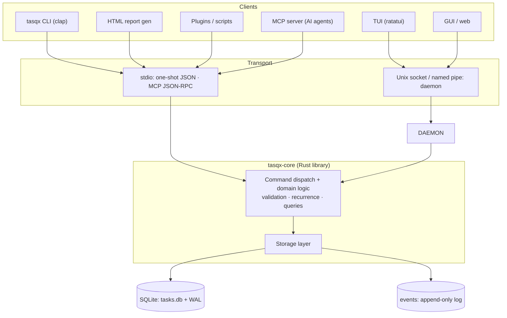
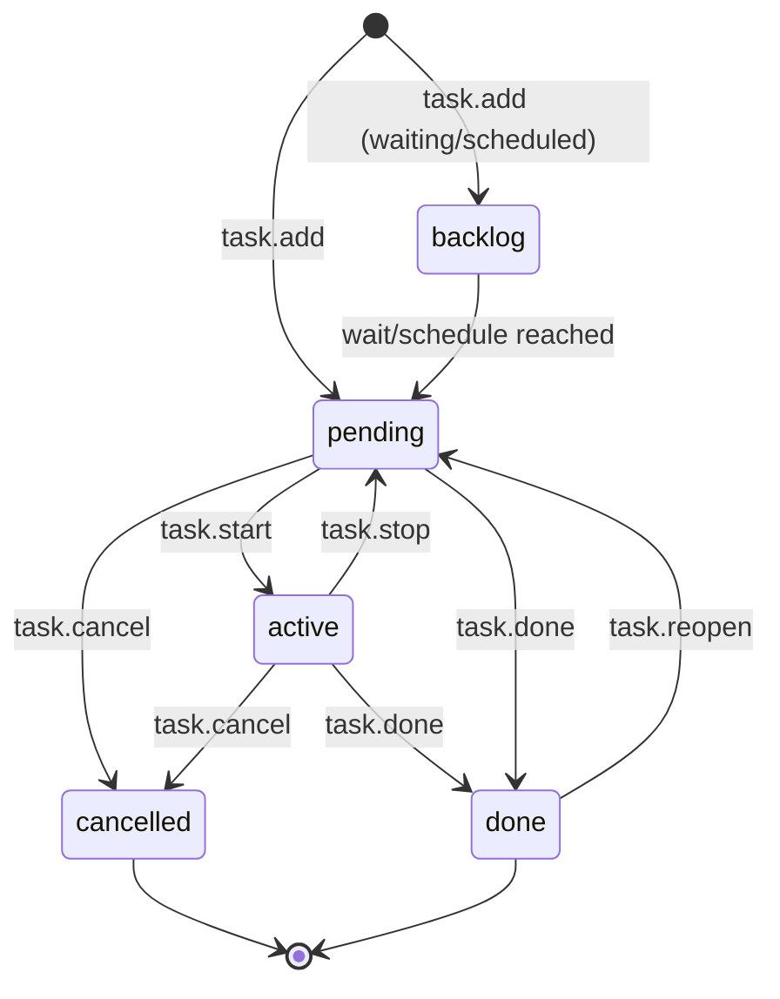
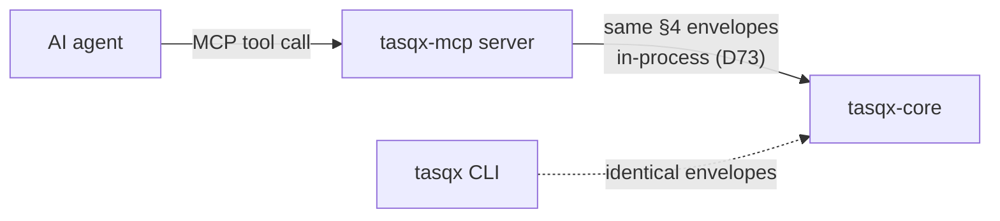

# Tasqx — Design Document

**Tasqx** is a hyper-modern, cross-platform task manager that lives entirely in the terminal: a Taskwarrior reimagined to be faster, better-looking, deeply extensible, and AI-native. It is built as a headless Rust core engine exposing one stable, versioned JSON API; every surface — CLI, TUI/GUI, MCP server, plugins, HTML reports — is a client of that single contract. The north star is not the most features, but a fast, elegant, terminal-first task manager with the best-chosen features and first-class AI support.

---

## 1. Vision & principles

Tasqx is a terminal-native task manager for developers, sysadmins, and power users who live in the shell and want Taskwarrior's power without its friction — faster, prettier, scriptable to the bone, and built so an AI agent is a first-class user, not a bolted-on afterthought.

| Principle | One-liner |
|---|---|
| **Fast** | Sub-10ms for the common path; a one-shot `tasqx add` returns before you lift your finger. |
| **Beautiful** | Considered typography, color, and layout — the default output is something you *want* to look at. |
| **Extensible** | Everything is a client of one stable JSON API; a plugin can do anything the CLI can. |
| **AI-native** | The same typed API that drives the CLI drives an MCP server — agents read and mutate tasks with zero glue. |
| **Local-first** | Your data is a plain file on your disk that works offline forever; no account, no cloud, no lock-in. |
| **Sync-ready, not sync-now** | Stable IDs and an append-only change log mean sync can be *added* later with no data migration and no breaking change. |
| **Scriptable & honest** | Every command speaks human-readable text *and* `--json`, except a short list of self-framing commands that declare why (D31); exit codes and errors are stable contract, not decoration. |

---

## 2. Architecture

Tasqx is a **headless core engine** with a stable, versioned JSON API. Every surface — the built-in CLI, a third-party TUI, a GUI, the MCP server, plugins, the HTML report generator — is just a **client** that speaks that API. The API is the load-bearing artifact; UIs are replaceable.



**Core = a library first.** `tasqx-core` is a plain Rust crate. The CLI links it directly and calls functions in-process — no IPC, no serialization tax on the hot path. The JSON API is a thin envelope *over the same dispatch layer*, so "call a function" and "send a JSON command" run identical code. There is exactly one dispatch table.

### Daemon vs. one-shot

| Mode | When | Why |
|---|---|---|
| **One-shot binary** | Default for `tasqx` CLI, scripts, HTML report, cron | No process to manage; open DB → run one command → exit. SQLite opens in <1ms. |
| **Daemon (opt-in)** | Long-lived clients: TUI, GUI, watch mode (not the MCP server, which is an in-process stdio host — §12-D73) | Holds the DB connection + warm caches, serves a socket, pushes change notifications so a TUI updates live. A socket-requiring client **lazily auto-spawns a shared daemon** (or start it explicitly with `tasqx daemon`); it **self-terminates after an idle timeout** — `[daemon] idle_timeout`, in minutes, and as shipped it is off (`0`) until configured, because a hand-started daemon must not walk out on its operator; the 15-minute default belongs to the auto-spawned one (§12-D5). The plain one-shot CLI **never** spawns one (§12-D5). |

The CLI **never requires** the daemon. If one is running it uses the socket (live-update semantics for free); otherwise it falls back to a direct in-process open. Same command surface either way.

### Keeping startup instant

- Single static binary, no runtime, no dynamic linking → no loader/interpreter warmup.
- **Lazy everything**: config parsed only if a command needs it; recurrence expansion is incremental, not a full-store scan.
- SQLite with prepared statements and indices; "list my active tasks" touches an index, not the whole table.
- Zero network, zero telemetry on the hot path.

### Concurrency & locking

- SQLite in **WAL mode**: concurrent readers never block; writers are serialized by SQLite's own locking. Two `tasqx add` racing from two shells are safe.
- `busy_timeout` (e.g. 3s) so a one-shot invocation waits briefly rather than erroring under contention.
- The daemon is the *only socket-served writer* when running, but in-process writers — one-shot commands, and `mcp serve` beside it (§12-D73) — stay safe because SQLite's file locking is authoritative across processes — no custom lockfile. Measured, not assumed: nine concurrent writers across a process boundary produced a dense `short_id` sequence and one event per mutation (the 2026-08-31 field test).
- The append-only event log is written **in the same transaction** as the mutation, so state and history can never diverge.

### Key crates

| Crate | Role | Why this one |
|---|---|---|
| `clap` (derive) | CLI parsing | De-facto standard; derive API, shell completions, help generation for free. |
| `ratatui` + `crossterm` | TUI + cross-platform terminal backend | `ratatui` is the maintained successor to tui-rs; `crossterm` gives identical behavior on Windows/Linux/macOS. |
| `serde` + `serde_json` | (De)serialization of the whole API surface | Zero-cost, ubiquitous; the API envelope *is* `serde` structs, so contract == types. |
| `rusqlite` (bundled SQLite) | Storage | Thin, synchronous, fast; `bundled` ships SQLite *inside* the binary → no system dependency, true single-file distribution. Sync fits the one-shot model (no async runtime for the CLI). |
| `uuid` (v7) | Stable entity IDs | Native UUIDv7 — time-ordered, index-friendly, globally unique (§3). |
| `jiff` | Dates, durations, recurrence, timezones | Modern, correct timezone-aware datetime; better than juggling `chrono` + `chrono-tz`. |
| `thiserror` | Typed error domain | Errors map 1:1 to the stable API error codes. |
| `interprocess` | Unix socket / Windows named pipe | One API for the daemon transport across all three OSes. |
| `directories` | XDG / platform config & data paths | Correct default store location per OS without hand-rolling. |
| `tokio` (daemon only, feature-gated) | Async socket server | Compiled only into the daemon build; the one-shot CLI stays runtime-free and tiny. |

---

## 3. Data model

### Entities

| Entity | Key fields | Notes |
|---|---|---|
| **Task** | `id` (UUIDv7), `short_id` (int, display), `title`, `status`, `priority`, `project?`, `due?`, `scheduled?`, `wait?`, `recurrence?`, `remind?`, `estimate?`, `created`, `modified`, `completed?`, `urgency` (derived), `_rev` | Core entity. `remind` is one canonical string — a `due`-anchored signed offset (`-1h`) kept symbolic so moving `due` moves the reminder, or an absolute instant resolved once at set time (§9a). `short_id` is a small stable integer for humans (`tasqx done 42`); `id` is the sync-safe key. |
| **Project** | `id`, `name` (e.g. `work.api`), `description?`, `archived` | Hierarchy via dotted name; flat table, cheap. |
| **Tag** | `id`, `name`; join `task_tags(task_id, tag_id)` | Many-to-many. |
| **Dependency** | `task_id`, `depends_on_id` | DAG; an *open* task is *blocked* if any dependency is not *resolved* — where resolved means `done` **or** `cancelled` (D11). A task that is itself `done` or `cancelled` is never blocked, and `blocked` is exactly "`unmet_blockers` is non-empty" (D145). |
| **Annotation** | `id`, `task_id`, `body`, `created` | Timestamped plain-text notes. |
| **Doc** | `id`, `source?`, `title`, `body`, `created`, `modified` | D41 memory: standalone knowledge rows, FTS5-indexed together with annotation bodies. |
| **Recurrence** | `rule` (RRULE-subset or interval), `anchor`, `template_task_id` | A recurring task is a template that spawns concrete instances. |
| **Event (audit log)** | `id`, `entity`, `entity_id`, `op`, `payload` (JSON diff), `ts`, `actor` | Append-only. The spine of history *and* future sync. |
| **Check** (**D138**) | `id`, `task_id`, `body`, `state` (`open`\|`passed`\|`failed`), `evidence?`, `position`, `created`, `modified` | An acceptance criterion with a state and a citation. `evidence` is stored verbatim and never interpreted; tasqx executes nothing. Carried by `store.export`/`store.import` like every other child row (D12, D37). |

The task row carries one nullable field under **D139**: `budget_tokens`, a size gauge compared against `input + output + cache_creation` and never against cache reads, with no counterpart for time because `estimate` is the time budget. It is carried by `store.export`/`store.import` like every other column; the canonical export form below predates it and is not re-listed here. **D138**'s `checks` table above shipped with it, in the same release.

### Status / lifecycle



| Status | Meaning |
|---|---|
| `backlog` | Exists but not yet actionable (`wait` in future, or `scheduled` later). |
| `pending` | Actionable, not started. The default working set. |
| `active` | Currently being worked (has an open time interval). |
| `done` | Completed. |
| `cancelled` | Abandoned; retained for history, excluded from active reports. |

### On-disk storage: **SQLite** (decided)

| Option | Verdict |
|---|---|
| **SQLite (bundled)** | ✅ **Chosen.** Transactional (state + event log commit atomically), indexed filtering/sorting at scale, single file, inspectable via `sqlite3` / `tasqx export`. Concurrency handled for us (WAL). |
| Plain JSON/TOML files | ❌ Rejected as primary. "Human-readable" is real, but every query is a full parse+scan; no atomicity across a multi-entity change; concurrent writers need hand-rolled locking; O(n) rewrites on every edit. |
| Hybrid (JSON of record + SQLite cache) | ❌ Two sources of truth = sync bugs against yourself. |

**Human-readability without giving up the DB:** `tasqx export` emits canonical JSON (one object per task, sorted keys) and `tasqx import` round-trips it — the git-diffable, greppable, portable form. SQLite is the operational store; JSON export is the interchange format, and the seam future git-based sync plugs into.

### Staying sync-ready without building sync

1. **Stable IDs — UUIDv7.** A real IETF standard (RFC 9562), natively supported by the `uuid` crate, time-ordered (indexes well as a primary key, unlike UUIDv4), and universally recognized. ULID gives the same ordering but is a non-standard encoding — no upside, one more bespoke format. IDs are generated **client-side**, so two offline machines never collide.
2. **Monotonic append-only event log.** Every mutation writes an event in the same transaction — already a replication log. A sync engine ships events; it doesn't reverse-engineer state.
3. **Conflict-friendly shape.** Per-field `modified` + last-writer-wins-per-field is a clean default; the event log preserves enough to do better (3-way / CRDT-per-field) later. Tags and dependencies are add/remove events on a set, which merge commutatively — no conflicts on the common case.
4. **No auto-increment as identity.** `short_id` is display sugar, never a foreign key or sync key.

None of this ships sync now — but none of it has to change to add it.

### One task as stored (canonical `tasqx export` form)

```json
{
  "id": "018f9c2a-7b3e-7c41-a2d9-6f1b0e5c8a12",
  "short_id": 42,
  "title": "Ship the v1 JSON API freeze",
  "status": "active",
  "priority": "H",
  "project": "work.tasqx",
  "tags": ["release", "api"],
  "due": "2026-07-20T17:00:00+02:00",
  "scheduled": "2026-07-16T09:00:00+02:00",
  "wait": null,
  "estimate": "PT4H",
  "recurrence": null,
  "depends_on": ["018f9b81-4c2a-7f60-9d11-2a7e4c9b0d33"],
  "annotations": [
    { "id": "018f9c2b-0a11-7d02-8c55-9e1f3b2a7c40",
      "body": "Blocked on tag.add naming review",
      "created": "2026-07-15T11:04:22+02:00" }
  ],
  "urgency": 14.2,
  "created": "2026-07-10T08:12:00+02:00",
  "modified": "2026-07-15T11:06:10+02:00",
  "completed": null,
  "_rev": 7
}
```

`_rev` is the per-task event counter (last event id applied), giving cheap optimistic concurrency and a future sync watermark.

---

## 4. Core JSON API

The contract every surface depends on. Transport-agnostic: the **same envelope** flows over stdio (one-shot, one request → one response) and over the daemon socket (newline-delimited JSON, multiplexed by `id`, plus server-pushed `event` notifications). It is JSON-RPC-shaped but deliberately minimal.

### Envelope

**Request**
```json
{ "tasqx": "1", "id": "c1", "method": "task.add", "params": { } }
```
- `tasqx` — **API major version**. Breaking changes bump this (`"2"`); additive changes never do. The core refuses an unknown major cleanly rather than guessing.
- `id` — client-chosen correlation id (echoed back; required on socket, optional on stdio).
- `method` — `entity.verb`, stable and namespaced.

**Success**
```json
{ "tasqx": "1", "id": "c1", "ok": true, "result": { } }
```

**Error** — stable, machine-first:
```json
{ "tasqx": "1", "id": "c1", "ok": false,
  "error": { "code": "not_found", "message": "no task with short_id 999",
             "data": { "short_id": 999 } } }
```

| `code` | Meaning |
|---|---|
| `bad_request` | Malformed params / failed validation (`data` lists field errors); also permission denial (`data.reason="permission_denied"`). |
| `not_found` | Referenced entity doesn't exist. |
| `conflict` | Optimistic-concurrency / dependency-cycle / duplicate. |
| `unsupported_version` | Client major version not served. |
| `internal` | Bug; safe to retry-report. |

CLI exit codes map to these (`0` ok, `2` bad_request, `4` not_found, `5` conflict, …) so scripts branch without JSON parsing.

### Method catalogue

`entity.verb`, namespaced and stable. The full set the surfaces below rely on:

| Namespace | Methods |
|---|---|
| `task` | `add`, `get`, `brief` (D136), `list`, `modify`, `start`, `stop`, `done`, `cancel`, `reopen` |
| `tag` | `add`, `remove` |
| `project` | `create`, `list`, `use`, `archive` |
| `annotation` | `add`, `remove` (D113) |
| `dependency` | `add`, `remove` |
| `memory` | `add`, `search`, `remove`, `import` (D41) |
| `report` | `summary`, `outcomes` (D137) |
| `event` | `list`, `revert` |
| `store` | `export`, `import` |
| `core` | `capabilities` |

`task.brief` (**D136**) and `report.outcomes` (**D137**) have shipped and are in the table above's namespace lists. So have `check.add` / `check.set` / `check.remove` (**D138**). All three rulings were additive under the frozen `"tasqx":"1"` API — new methods and new params on `task.done`, no existing response field renamed or removed (D56). D139 adds no method at all: `budget_tokens` is a field on `task.add` / `task.modify` and a pair of derived keys on `task.get`.

### `project.create`
```json
→ {"tasqx":"1","id":"p1","method":"project.create",
   "params":{"name":"work.tasqx","description":"Terminal task manager"}}
← {"tasqx":"1","id":"p1","ok":true,
   "result":{"id":"018f9a10-2c40-7b91-8e02-1d3f5a7c9b00","name":"work.tasqx",
             "default":true,"current_default":"work.tasqx"}}
```
`default` says whether **this** create claimed the default project — true only when the store had none (D21). `current_default` says what the default is either way, so a caller that did not claim it still learns where a bare `task.add` will go. An empty or whitespace-only `name` is a `bad_request` (D23: D18's rule where names are born), and the `create` event carries the same `default` boolean the result does, so the log can say which create claimed the key.

### `project.use` (D21)
Point the default project — the project a bare `task.add` inherits — at an existing, non-archived project. The **only** way to move it once set.
```json
→ {"tasqx":"1","id":"u1","method":"project.use","params":{"name":"work.tasqx"}}
← {"tasqx":"1","id":"u1","ok":true,
   "result":{"name":"work.tasqx","default":true,"previous":"prive.klussen"}}
```
`previous` is the default this replaced (`null` if there was none). Unknown name → `not_found`; archived project → `conflict` (D22); an empty `name` → `bad_request` (the envelope requires a non-empty string). A whitespace-only name simply names no project → `not_found` (D23: emptiness is checked at `project.create`, so `use` can target anything `init` can create). None of them write. The default lives in the store's `config` table, never in `config.toml` (D21).

### `task.add`
```json
→ {"tasqx":"1","id":"t1","method":"task.add",
   "params":{"title":"Ship the v1 JSON API freeze","project":"work.tasqx",
             "priority":"H","due":"2026-07-20T17:00:00+02:00",
             "tags":["release","api"],"estimate":"PT4H"}}
← {"tasqx":"1","id":"t1","ok":true,
   "result":{"id":"018f9c2a-7b3e-7c41-a2d9-6f1b0e5c8a12","short_id":42,
             "status":"pending","urgency":11.8,"project":"work.tasqx"}}
```
`project` is optional: omit it and the task inherits the default project (D21), and the result names where it landed either way. An **explicit** `project` must name a live project row — unknown → `not_found`, archived → `conflict` (D23), checked inside the same IMMEDIATE transaction as the insert. `task.modify`'s `project` arm applies the identical rule; `null` still clears the field.

### `task.start` / `task.stop`
```json
→ {"tasqx":"1","id":"t2","method":"task.start","params":{"ref":42}}
← {"tasqx":"1","id":"t2","ok":true,
   "result":{"id":"018f9c2a-...","status":"active",
             "interval_started":"2026-07-15T11:06:10+02:00"}}

→ {"tasqx":"1","id":"t3","method":"task.stop","params":{"ref":42}}
← {"tasqx":"1","id":"t3","ok":true,
   "result":{"status":"pending","tracked":"PT52M"}}
```
`ref` accepts either `short_id` (int) or full `id` (UUID) — ergonomic for humans, precise for agents.

### `task.done`
```json
→ {"tasqx":"1","id":"t4","method":"task.done","params":{"ref":42}}
← {"tasqx":"1","id":"t4","ok":true,
   "result":{"status":"done","completed":"2026-07-15T11:59:03+02:00",
             "unblocked":[43,44]}}
```
`unblocked` reports tasks whose last dependency just cleared — surfaces use this for "now actionable" hints.

### `task.list` (filtering)
The filter DSL is a small documented grammar; the same string works on CLI (`tasqx list "project:work.tasqx status:pending +api due.before:tomorrow"`) and API.
```json
→ {"tasqx":"1","id":"q1","method":"task.list",
   "params":{"filter":"project:work.tasqx status:pending +api due.before:2026-07-21",
             "sort":["-urgency","due"],"limit":20,"offset":0,
             "fields":["short_id","title","due","urgency"]}}
← {"tasqx":"1","id":"q1","ok":true,
   "result":{"count":2,"total":2,"next_offset":null,"tasks":[
     {"short_id":42,"title":"Ship the v1 JSON API freeze","due":"2026-07-20T17:00:00+02:00","urgency":11.8},
     {"short_id":47,"title":"Write API conformance tests","due":"2026-07-20T12:00:00+02:00","urgency":9.4}]}}
```

### `task.modify`
```json
→ {"tasqx":"1","id":"t5","method":"task.modify",
   "params":{"ref":42,"set":{"priority":"M","due":"2026-07-22T17:00:00+02:00"},
             "expected_rev":7}}
← {"tasqx":"1","id":"t5","ok":true,"result":{"short_id":42,"_rev":8}}
```
`expected_rev` is optional optimistic concurrency: if the task moved on (rev ≠ 7) the core returns `conflict` instead of clobbering — critical for concurrent agents.

Modifiable fields: `title`, `project` (must name a live project — D23), `priority`, `due`, `scheduled`, `wait`, `estimate`, `recurrence`, `remind`, and `status` (cancellation only — every other transition must go through `task.start`/`stop`/`done` so the single-active (D6), completion-timestamp, and interval-closing invariants hold). **A `null` value clears the field** — this is the sanctioned way to stop a recurrence (D2) or a reminder (§9), and it is exactly what the CLI's `--clear <field>` emits (D13). `title` has no null form. Anything else in `set` is a `bad_request` naming the field.

### `tag.add`
```json
→ {"tasqx":"1","id":"g1","method":"tag.add","params":{"ref":42,"tags":["blocking"]}}
← {"tasqx":"1","id":"g1","ok":true,"result":{"short_id":42,"tags":["release","api","blocking"]}}
```

### `report.summary`
Aggregate call for report generators and dashboards; pure read, no side effects.
```json
→ {"tasqx":"1","id":"r1","method":"report.summary",
   "params":{"group_by":"project","filter":"status:pending","metrics":["count","est_total","overdue"]}}
← {"tasqx":"1","id":"r1","ok":true,
   "result":{"groups":[
     {"project":"work.tasqx","count":6,"est_total":"PT19H","overdue":1},
     {"project":"work.infra","count":3,"est_total":"PT7H","overdue":0}],
     "generated":"2026-07-15T12:03:00+02:00","filter":"status:pending","all":false}}
```

### `core.capabilities`
Clients feature-detect with a read call rather than a hard-coded version string:
```json
→ {"tasqx":"1","id":"h","method":"core.capabilities","params":{}}
← {"tasqx":"1","id":"h","ok":true,
   "result":{"api":"1","methods":["task.add","task.list","report.summary","..."],
             "features":["recurrence","daemon.events"]}}
```

### `store.export` / `store.import`
An export is a **self-contained document**: it never names an `id` it does not carry. With a `filter` that is a real constraint, since a dependency edge points out of the selected subset as happily as into it — so such edges are **dropped**, and the count is reported in `dropped_dependencies` (always present; `0` for an unfiltered export, which stays a byte-identical round trip). The CLI mirrors the count on **stderr**, leaving stdout pure JSON.
```json
→ {"tasqx":"1","id":"e1","method":"store.export","params":{"filter":"+api"}}
← {"tasqx":"1","id":"e1","ok":true,
   "result":{"tasks":[{"id":"018f…","short_id":2,"depends_on":[],"…":"…"}],
             "dropped_dependencies":1}}
```
`store.import` is **two-pass** — every task in the payload is upserted before any edge is wired — so a `depends_on` may point forward to a task later in the array, or to one already in the store (importing filtered slices on top of each other is a normal workflow). A target that is in neither is a dangling pointer and fails the whole import with `bad_request` naming the missing id; one transaction, so a reject writes nothing. See D12.

### One API, two transports

- **stdio (one-shot):** `tasqx api < req.json` writes one response and exits — perfect for scripts, the HTML report generator, and cheap plugin calls. No daemon needed.
- **socket / named pipe (daemon):** the *identical* request objects, newline-delimited and correlated by `id`, plus unsolicited `{"tasqx":"1","event":"task.changed","data":{…}}` notifications so TUIs/GUIs live-update. The MCP server maps tool calls onto these same methods 1:1, but over stdio against an in-process engine, not over this socket (§7, D73).

The transport chooses framing; the contract is the same bytes.

---

## 5. CLI design

The CLI is the reference client of the core API — but it never *feels* like an RPC wrapper. Three rules:

1. **The common case is one word.** `tasqx` shows your working set. `tasqx add "…"` captures. `tasqx 42 done` finishes. Everything else is progressive disclosure.
2. **Forgiving by default.** Fuzzy verb matching, aliases, natural-language dates, short-id-or-UUID refs everywhere. A typo is a suggestion, not an error wall.
3. **Honest under the hood.** Every command is a thin translation to one API `method`. Add `--json` for the raw envelope `result` — except the self-framing commands listed in `JSON_CARVE_OUTS` (D31), each of which records why it has no result left to render; exit codes mirror the error model (§4).

### Command grammar

```
tasqx [GLOBAL-FLAGS] [VERB] [REF...] [ARGS / FILTER] [--flags]
```

- **`REF`** — a `short_id` (`42`) or a UUID. **Not yet built:** a range (`40-45`), a comma list (`42,47`), and `@active` / `@last` — the parser's own refusal for any of the three names only `short_id`/UUID (audit-2026-09 #155), which is the accurate list until the fuzzy-ref work below lands.
- **`FILTER`** — the §4 filter DSL, positional and bare: `project:work +api due.before:friday`.
- **Bare invocation** — `tasqx` ≡ `tasqx list @working` (pending + active, sorted by urgency).
- **Ref-first sugar** — `tasqx 42 done` and `tasqx done 42` both work; the parser detects a leading ref. **Not yet built** — see §11's build-status note; `tasqx 42 done` today is `error: unrecognized subcommand '42'`.

### Core verbs and forgiveness

| Verb | Aliases | Forgiving behavior |
|---|---|---|
| `add` | `a`, `new` | NL dates (`due:friday`, `due:"in 3 days"`), inline `+tag` / `project:` / `!high` shorthand in the title. A `project:` names a project `init` created — a typo is exit 4, not a silent bucket (D23). |
| `list` | `ls`, `l`, *(bare)* | `project:` in a filter matches an existing project name exactly (case-sensitive); an unknown or wrong-case name is `not_found`, not a fuzzy match (D109). **Not yet built:** saved filters (`tasqx ls @overdue`) — `list` refuses any `@` token but `@working`/`@blocked` today (audit-2026-09 #226.2). |
| `done` | `d`, `complete`, `x` | Prints newly-unblocked tasks. **Not yet built:** ranges — `tasqx done 40-45` is `bad_request` (audit-2026-09 #155). |
| `start`/`stop` | `s` / `st` | **Not yet built:** a bare `start`/`stop` resuming `@last`/`@active` — both require an explicit `<REF>` today (audit-2026-09 #155). |
| `modify` | `mod`, `m`, `edit` | `tasqx modify 42 due:mon !high est:4h` — sugar compiles to a `set` map; same NL dates as `add`. Unset with `--clear <field>`; recurrence is just another field (D13). |
| `use` | — | `tasqx use work` — sets the default project a bare `add` inherits. Validated at the edge: unknown → exit 4, archived → exit 5 (D21/D22). |
| `archive` | — | `tasqx archive old` — takes a project out of rotation; the tasks are untouched and `projects --all` still lists it. Unknown → exit 4, already archived → exit 5. Archiving the *current default* clears the default, and the printed line says which of the two happened (D22). |
| `tag`/`untag` | — | `tasqx tag 42 blocking` / `tasqx untag 42 blocking`. A tag is written the same way as in `add`/`modify` sugar — `+api` and `api` name one tag — and untagging a tag the task does not have is exit 4 that removes nothing (D52). The bare-ref form `tasqx 42 +blocking` is **not** built: it needs the fuzzy-ref dispatch below, which is not built either. |
| `pick` | `p`, `fzf` | `tasqx pick [filter]` — the task browser (**D124**): `list`'s rows on a full screen, `/` for a fuzzy search (subsequence, per field, a term found whole ranking first), enter to read a task's `show` card, and one key with an effect: `s` **starts** the task under the cursor. Leaving without starting one exits 0 — a browser you close is not a failed run (**D128**) — while a filter matching nothing still exits 4, having started nothing either way. It needs a terminal on stdin *and* stdout, so it refuses in a pipe (exit 2) rather than being composable — see D55 for why that killed the "print the ref" form the mockup drew. |
| `agenda` | `ag`, `cal` | `tasqx agenda [filter] [--days N]` — `list` ordered by time and grouped by day. Each task sits on the EARLIER of its `due` and `scheduled`; overdue first, always; 14 days ahead by default. Tasks with neither date, and tasks past the horizon, are counted under the table rather than dropped (D53). |
| `undo` | `u` | Reverses the newest event by appending a compensating one — the log is never rewritten. Five operations are undoable (`stop`, `untag`, `undep`, `annotate`, `annotate --edit`); every other one exits 5 naming itself and the verb that does take it back. No ref, and no redo (D54). |

**Fuzzy verb matching:** `tasqx stat` → *"did you mean `start`? [Y/n]"* on ambiguity, silent auto-correct on a unique prefix. A sub-millisecond Levenshtein pass over the clap subcommand table — no network.

### Command → core API mapping

| CLI | API `method` | Notes |
|---|---|---|
| `tasqx init <name>` | `project.create` | Claims the default project only when the store has none (D21). Empty/whitespace name → exit 2 (D23). |
| `tasqx use <project>` | `project.use` | Sets the default project — where a bare `add` lands. Must exist and not be archived (D21/D22). |
| `tasqx projects` | `project.list` | `*` marks the default project; `--all` is the only way to see an archived one. |
| `tasqx archive <project>` | `project.archive` | Retires a project. Tasks untouched; archiving the default clears the default and the line says so (D22). Already archived → `conflict` (exit 5), because a second archive changes nothing. No `unarchive` verb and no method behind one — `store.import` writes the flag, so restoring an export is the way back. |
| `tasqx add "…" +t project:p due:…` | `task.add` | Inline sugar parsed client-side into `params`. `project:` must be one `init` created: unknown → exit 4, archived → exit 5 (D23). |
| `tasqx` / `tasqx ls <filter>` | `task.list` | Bare = `filter:"@working" sort:-urgency`. |
| `tasqx 42 start` / `stop` | `task.start` / `task.stop` | `ref:42`. |
| `tasqx 42 done` | `task.done` | Renders `unblocked` hints. |
| `tasqx modify 42 due:mon !high` | `task.modify` | `set:{…}`, optional `--expected-rev`. Sugar + NL dates identical to `add`; `--clear <field>` unsets (D13). `project:` is validated exactly as on `add` (D23). `+tag` additionally issues `tag.add`. |
| `tasqx tag 42 blocking` | `tag.add` | `+blocking` is the same tag; duplicates collapse. Re-adding an existing tag is ok. |
| `tasqx untag 42 blocking` | `tag.remove` | All-or-nothing: a tag the task does not have is exit 4 (`not_found`) and removes none of them (D52). |
| `tasqx 42 annotate "…"` | `annotation.add` | — |
| `tasqx annotate 42 --edit <id> "…"` | `annotation.update` | Replaces one note's body in place — id, timestamp and position kept, search re-indexed; a removed note → exit 4, a stale `expected_rev` → exit 5. Undo-reversible (D165). |
| `tasqx unannotate 42 <id>` | `annotation.remove` | Hard-deletes the body, keeps a tombstone; unknown/already-removed id → exit 4. Not undo-reversible (D113). |
| `tasqx 42 dep 43` | `dependency.add` | Cycle → exit 5 (`conflict`). |
| `tasqx memory add/search/show/rm/import` | `memory.add` / `memory.search` / `memory.get` / `memory.remove` / `memory.import` | D41, `show` from D71. `import`: one doc per `.md` file, one transaction, same `source` replaces in place and bumps its rev (D143); a source names one doc, so a batch naming one twice is refused and `add`/`update` refuse a source another doc holds (D174). |
| `tasqx pick [filter]` | `task.list` → `task.get` → `task.start` | Fetches every candidate with the same default filter as `list` (`@working`), reads a task's card when the user opens it, then starts the one the user selects with `s`. One verb with an effect, not a menu of them (D55, D124). |
| `tasqx agenda [filter] [--days N]` | `task.list` | No `agenda` method: the grouping, the horizon and the earlier-of-two-dates ordering are all rendering over fields the row already carries (D53). The filter defaults to every OPEN status, not `@working` — a future `scheduled` parks a task in `backlog`, which `@working` excludes. |
| `tasqx report <name>` | `report.summary` | Feeds charts (§8) and HTML export. |
| `tasqx docs` | *(none — no store)* | Generates the §8a user guide and opens it. Pure static content; never touches the store (D15). |
| `tasqx undo` | `event.revert` | No params. Appends the inverse of the **newest** event, over a closed set of five ops (D54, D165); anything else is `conflict` (exit 5) naming the way back, and an empty log is exit 4 (D54). |
| `tasqx export` / `import` | `store.export` / `store.import` | Canonical JSON round-trip. |
| `tasqx api < req.json` | *(raw)* | Passthrough: one envelope in, one out. |

> **Color legend for the mockups below:** headers **bold cyan**, urgency-hot values **red/orange**, tags **magenta**, projects **dim blue**, active timer **green**, muted metadata **grey (dim)**. All truecolor, degrading gracefully (§8).

### Examples

**1 — Initialize a project**

```console
$ tasqx init work.tasqx --desc "Terminal task manager"
work.tasqx
created   now your default project
```

**2 — Add a task (inline NL sugar)**

```console
$ tasqx add "Ship the v1 JSON API freeze +release +api project:work.tasqx due:monday 17:00 !high est:4h"
▌ #42  Ship the v1 JSON API freeze
▌ added   H ▄▄▄▃ 11.8   work.tasqx   due Mon   +release +api   est 4h
```
`due:monday 17:00` and `est:4h` are parsed by `jiff` into `2026-07-20T17:00:00Z` / `PT4H` before the `task.add` call — a clock typed without an offset is a UTC clock (D132).

**3 — The working set (`tasqx list`, and bare `tasqx` off a terminal)**

```console
$ tasqx list
@working   4 tasks · 1 overdue · 1 due today · #47 running

    ID          URG  TASK                             PROJECT     DUE        TAGS
    42  H ▄▄▄▃ 11.8  Ship the v1 JSON API freeze      work.tasqx  Mon 17:00  +release +api
▶   47  M ▄▄▄▁  9.4  Write API conformance tests      work.tasqx  today      +api +test
    31  H ▄▄▂▁  7.1  Fix WAL busy_timeout on Windows  work.infra  3d ago     +bug
    55  L ▄▂▁▁  4.2  Draft README quickstart          work.tasqx             +docs
```
Row 31's `3d ago` renders in red, and the gauge beside each figure places that row's
urgency on one absolute scale, full at "as urgent as an overdue task", in the ramp band it
has reached: quiet, `warn` from H priority alone, `danger` from overdue (**D119**). The
left rail carries
the two facts a reader needs before any other — `▶` the running timer, `⊘` blocked —
and is the one column no width squeeze drops (**D117**). Maps to
`task.list {filter:"@working", sort:["-urgency"]}`.

A **bare `tasqx`** produces exactly this whenever nobody is watching: piped, redirected, under `--json`, on `TERM=dumb`, with `[dashboard] enabled = false`, or in a window under 56x14. On an interactive terminal it opens the dashboard instead (**D58**); `tasqx list` is the spelling that always means the table, and is what scripts should use.

The condition is **stdin and stdout both being terminals**, and nothing else. In particular nothing reads a `CI` variable — a CI job is safe because it redirects, not because it was recognised, and a caller that allocates a pty (pexpect, node-pty, tmux, `docker run -t`) is on the *interactive* side however unattended it is. Measured: under a pty with no keys sent, a bare `tasqx` blocks indefinitely.

**3b — The dashboard (bare `tasqx` on a terminal)**

```console
$ tasqx
┌ tasqx ─ work.tasqx · 17 open · 1 active · 2 overdue · 3 blocked · 8 done/week ─┐
├──1─ NOW ─────────────────┬──2─ NEXT UP ──────────────────┬──3─ DUE ──────────┤
│ ▶ #42 Ship the v1 freeze │ #17   9.8  H  Fix the pipeline│ OVERDUE  2        │
│   work.tasqx    01:23:07 │ #08   6.4  M  Write migration │  #17 Fix …    −2d │
│   est 4h · tracked 6h12  │ #23   3.9  M  Review the PR   │  #55 Renew    −6h │
├──4─ BLOCKED ─────────────┤ …12 more                      │ TODAY  1          │
│ #61 Deploy tap  → #57    │                               │  #42 Ship   17:00 │
├──6─ PROJECTS ────────────┼──5─ RECENT ───────────────────┼──7─ BURNDOWN ─────┤
│ * work.tasqx  12 ▇▇▇▇  2 │  4m  #42 API contract  active │ 24┤               │
├──8─ TOKENS ──────────────┤ 38m  #47 Conformance  pending │   │▇▇▆▆▅▅▄▄▃▃▂    │
│ work  ████████░░▒│ 13.6M │  2h  #12 README        done   │ 12┤        ▲17    │
└──────────────────────────┴───────────────────────────────┴───────────────────┘
 1-8 panel   tab cycle   j/k scroll   p pick   l list   r refresh   ? help   q quit
```
Eight panels over one shared `task.list` snapshot, one `report.summary` and one window-bounded `event.list` — no new API method (**D58**). Layout is responsive: on one column the three analysis panels share a single slot that `tab` or `6`/`7`/`8` fills. Below 56×14 the screen is never entered. **D79** supersedes this sketch as a *layout* — five panels, a scoped task list, row actions; the data path, entry conditions and floor above stand.

**4 — Backlog view (not-yet-actionable)**

```console
$ tasqx ls status:backlog
  ID   TASK                          WAIT / SCHEDULED        PROJECT
─────────────────────────────────────────────────────────────────────
  61  Quarterly deps audit          scheduled Aug 01        work.infra
  62  Renew signing certificate     waits until Jul 25      work.infra
─────────────────────────────────────────────────────────────────────
  2 tasks in backlog · will surface automatically when their date arrives
```

**5 — Start a timer**

```console
$ tasqx 42 start
▌ #42  Ship the v1 JSON API freeze
▶ started   H ▄▄▄▃ 11.8   work.tasqx   due Mon   +release +api   est 4h
```
The `▶` in the rail column says it runs (D126). `task.start` returns `interval_started`; the CLI stores nothing — elapsed is derived on read.

**6 — Stop, with tracked time**

```console
$ tasqx stop 42
▌ #42  Ship the v1 JSON API freeze
▌ stopped after 52m   tracked 3h41 of 4h   H ▄▄▄▃ 11.8   work.tasqx   due Mon   +release +api
```
`task.stop` → `{interval:"PT52M", tracked:"PT3H41M"}`, humanized client-side; the total prints only when it reads differently from the interval (D126).

**7 — Complete, with unblock cascade**

```console
$ tasqx 42 done
▌ #42  Ship the v1 JSON API freeze
▌ done today 17:02   tracked 3h41 of 4h   work.tasqx   due Mon   +release +api
  #43  unblocked · Publish API docs
  #44  unblocked · Tag v1.0 release
```
The lines under the card are driven verbatim by `task.done`'s `unblocked:[43,44]` — the CLI turns a data field into a nudge.

**8 — Filter / search**

```console
$ tasqx ls "project:work.tasqx +api status:pending due.before:friday" --sort -urgency
project:work.tasqx +api status:pending due.before:friday   2 tasks · 12ms

  ID          URG  TASK                         DUE        TAGS
  47  M ▄▄▄▄  9.4  Write API conformance tests  Mon 12:00  +api +test
  43  M ▄▄▃▁  6.0  Publish API docs             Thu 17:00  +api +docs
```
The `12ms` is real: the filter hits an index, not a scan.

**9 — Tag / untag**

```console
$ tasqx tag 47 blocking
#47 tagged +blocking   ·   tags: +api +blocking +release +test

$ tasqx untag 47 test
#47 untagged +test   ·   tags: +api +blocking +release
```
One call each: `tag.add {tags:["blocking"]}` and `tag.remove {tags:["test"]}`. Both
lines name what changed *and* the resulting set, because "tags: +api +blocking
+release" on its own is the same line a removal that did nothing would print.

The single-line form the mockup used to show — `tasqx 47 +blocking -test`, two
calls in one command — is not built: it needs the bare-ref dispatch (`tasqx 47
<verb>`) that no verb has today.

**10 — Task browser (shipped #51 as a chooser; the browser since D124, captured from the binary through tmux at 88 columns)**

```console
$ tasqx pick                           # then: / api enter
 pick   @working   / api   4 of 14 match

       ID          URG  TASK                           PROJECT  DUE             TAGS
 ▸     56  M ▄▂▁▁  4.2  Add OpenAPI examples for eve…  api                      +docs
       48  H ▄▄▄▄ 18.1  Renew the TLS certificate fo…  infra    2d ago          +ops
       51  H ▄▄▄▄ 16.2  Rate-limit the /search endpo…  api      Mon             +perf
       57  M ▄▄▁▁  6.7  Accessibility pass on the si…  website  23 Sep          +a11y

 j/k move   / search   enter open   s start   g/G ends   esc clear   q leave
```
Each row is the row `tasqx list` prints, drawn by `list`'s own renderer. Without a
search the header carries `list`'s summary instead (`14 tasks · 2 overdue · #49
running`). The search is a fuzzy **subsequence** match, per field, so `wac` finds
"Write API conformance tests", and whitespace splits it into terms that all have
to match. `⏎` opens the task's `show` card, and `s` **starts** the task under the
cursor, from the list or the card; that is the only key with an effect. The
`^s`/`^d`/`^e` dispatch keys and the ref-printing `⏎` the first mockup drew are
**not** built, and D55 says why: the screen refuses unless stdin *and* stdout are
terminals, so `tasqx pick | tasqx done` — the whole point of printing a ref —
never reaches it.

**11 — Agenda (shipped #54; captured from the binary on 2026-08-03)**

```console
$ tasqx agenda
through 17 Aug (+14d)   5 tasks · 1 overdue

  ID          URG  TASK                             PROJECT     WHEN        TAGS
Overdue
   3  H ▄▄▄▄ 18.0  Fix WAL busy_timeout on Windows  work.tasqx  due 5d ago  +bug

Today · Mon 3 Aug
   2  - ▄▄▃▁ 12.0  Write API conformance tests      work.tasqx  due 12:00   +api
   1  H ▄▄▄▄ 18.0  Ship the v1 JSON API freeze      work.tasqx  due 17:00   +api +release

Tomorrow · Tue 4 Aug
   4  - ▁▁▁▁  0.0  Quarterly deps audit             work.tasqx  sched

Thu 6 Aug
   5  - ▄▄▂▁ 10.1  Publish the API docs             work.tasqx
1 undated — no due or scheduled date, so nothing puts them on a day; `tasqx list` shows them
1 further out — `tasqx agenda --days 90` reaches the furthest
```
One `task.list`; the grouping is pure client rendering. What shipped is a
day-grouped list rather than the seven-row week grid this section sketched
originally: the grid spends a line on every empty day and still cannot hold two
tasks with their projects on one row, and "which week" is a worse question than
"what is coming up" for a tool whose every other view is task-per-row. The
columns are the D51 layout `list` uses, fitted once across every group so the
days line up with each other. `--days N` moves the horizon; overdue rows ignore
it. D53.

**12 — Undo (safety net)**

```console
$ tasqx untag 47 blocking
▌ #47  Ship the release
▌ untagged   +blocking   M ▄▄▃▁ 7.2   work.tasqx   +release +api

$ tasqx undo
▌ #47  Ship the release
▌ undid untag   +blocking +release +api   M ▄▄▃▁ 7.2   work.tasqx
```
`event.revert` appends the inverse of the **newest** event — the reversed event stays in the log, so
`tasqx chart` reads "the tag came off, then that was undone". Five operations are undoable; every
other one exits 5 naming itself and what does take it back (`done` → `tasqx reopen`, `modify` →
`tasqx show` then a second `modify`). There is no redo, and no ref to aim it with: only the newest
event can be reversed exactly, because nothing has happened since to have overwritten what the
inverse puts back. D54.

---

## 6. Extensibility

Two mechanisms, split by *weight*. Full clients speak the JSON API (and, if native Rust, link the crate). Quick customizations drop an executable on `PATH`. Neither can corrupt the store — every write still goes through the same core dispatch, validation, and event log.

| Mechanism | For | Talks to core via | Language |
|---|---|---|---|
| **Plugin API** | Full clients: third-party TUI/GUI, Jira/Slack integrations, sync backends | JSON API over stdio *or* socket; native plugins link `tasqx-core` | Any (JSON) / Rust (crate) |
| **Hooks + subcommands** | Glue: fire-on-event side effects, custom verbs | `tasqx-<name>` on `PATH`; hook stdin/stdout JSON | Any executable |

### 6a. Plugin API — building a full client

A "plugin" that is really a *client* never imports anything: it opens the socket (or spawns `tasqx api`) and sends envelopes. There is exactly one contract — §4 — so a Python Slack bridge and a native Rust TUI use identical methods.

| Binding | How | When |
|---|---|---|
| **JSON client** (recommended default) | Connect to `$TASQX_SOCK`, or pipe to `tasqx api` one-shot | Any language; process-isolated; survives core upgrades within API major `"1"`. |
| **Native Rust** (`tasqx-core` crate) | `use tasqx_core::{Engine, Command};` — in-process, no serialization | Perf-critical clients (a TUI redrawing per keystroke); accepts semver coupling to the crate. |

The native boundary is a semver Rust crate; the JSON boundary is the API version (`"tasqx": "1"`). **Prefer JSON** unless you measure a reason not to — it carries the stability guarantee across releases. Additive methods/fields never bump the major; `unsupported_version` is only returned on a real major break. Feature-detect via `core.capabilities` (§4), not a hard-coded version string.

**Capability / permission model.** A plugin declares intent in a manifest; the core enforces it at the dispatch layer, so a "read-only" plugin *cannot* emit a write even if it tries.

```toml
# ~/.config/tasqx/plugins/slack-standup/plugin.toml
name        = "slack-standup"
api         = "1"
transport   = "stdio"                        # or "socket"
permissions = ["task.read", "report.read"]   # NO task.write → task.modify is rejected
events      = ["task.done"]                  # may subscribe to these notifications only
```

| Scope | Grants |
|---|---|
| `task.read` | `task.list`, `task.get`, `report.summary` |
| `task.write` | `task.add/modify/done/start/stop`, `tag.add` |
| `project.write` | `project.create`, `project.archive` |
| `events:<name>` | subscribe to that daemon push only |
| `exec` | may be launched as a hook (§6b) |

A call outside declared scope returns `bad_request` with `data.reason="permission_denied"` — the same stable error a malformed param gets, so clients handle it uniformly.

**Safety / sandboxing.**

- **Process isolation is the sandbox.** JSON plugins are separate processes; a crash or hang never touches the core or the DB. WAL locking keeps even a rogue one-shot writer safe.
- **No ambient DB access.** Plugins get *no* file handle to `tasks.db` — every mutation is an envelope that passes validation, recurrence rules, and dependency-cycle checks, and lands in the `events` log in one transaction. No back door around the invariants.
- **`expected_rev` guards concurrent agents.** Two plugins racing on task 42 don't clobber — the loser gets `conflict`.
- Native Rust plugins are *in-process and trusted* — documented as such. Untrusted third-party code ships as a JSON client, never a linked crate.

**Walk-through: a third party builds a TUI.**

1. On launch, look for `$TASQX_SOCK`; if absent, spawn `tasqx daemon` (or fall back to one-shot `tasqx api` per action).
2. Initial paint: one `task.list` with `fields` trimmed to what's visible — the core sorts/filters via SQLite indices, so the TUI never holds the whole store.
   ```json
   → {"tasqx":"1","id":"paint","method":"task.list",
      "params":{"filter":"status:pending","sort":["-urgency"],
                "fields":["short_id","title","due","urgency","tags"]}}
   ```
3. Subscribe for liveness — the daemon pushes unsolicited notifications, no polling:
   ```json
   ← {"tasqx":"1","event":"task.changed","data":{"short_id":42,"_rev":8,"op":"modify"}}
   ```
   On each `task.changed`/`task.done`, patch the one affected row. `task.done` results carry `unblocked:[43,44]` (§4) so the TUI can flash "now actionable".
4. Keystrokes map 1:1 to methods: `d`→`task.done`, `s`→`task.start`, `e`→`task.modify` with `expected_rev` from the row's cached `_rev`, `p`→`project.create`. The TUI implements *zero* task logic.
5. A native (ratatui) build swaps steps 2–4 for direct `Engine::dispatch(cmd)` calls — same command objects, no socket — when it wants sub-millisecond redraws.

The payoff: **the client is a view, the core is the truth.** A GUI is the same five steps with a different render layer.

### 6b. Hooks + custom subcommands

For the 80% case that doesn't need a whole client: run *my* executable when *this* happens.

**Custom subcommands (git-style).** `tasqx foo` with no built-in `foo` searches `PATH` for `tasqx-foo` and execs it, forwarding args and setting `TASQX_SOCK`/`TASQX_API`. `tasqx burndown` → `tasqx-burndown` calls back into `report.summary`. Discovery is listed in `tasqx --help` under "external commands". No registration, no rebuild.

**Event hooks.** Executables in `~/.config/tasqx/hooks/<event>/` are run by the core inside the mutation's transaction boundary. Naming decides the trigger:

| Hook dir | Fires after | Can veto? |
|---|---|---|
| `on-add/` | `task.add` | ✅ non-zero exit aborts the add |
| `on-modify/` | `task.modify`, `tag.add` | ✅ |
| `on-done/` | `task.done` | ❌ (post-commit; side-effect only) |
| `on-start/` `on-stop/` | time tracking | ❌ |

A hook receives one JSON object on **stdin** and, for veto-capable events, may return a modified task on **stdout** (exit 0 = accept, non-zero = reject with stderr as the message).

**Minimal hook — auto-tag imminent work, block project-less tasks:**

```bash
#!/usr/bin/env bash
# ~/.config/tasqx/hooks/on-add/10-triage.sh    (chmod +x)
task=$(cat)                                    # the task, as stdin JSON

if [ "$(jq -r '.project // "null"' <<<"$task")" = "null" ]; then
  echo "every task needs a project" >&2        # stderr → error message
  exit 1                                        # non-zero → task.add returns bad_request
fi

# add +urgent if due within 24h, else pass through unchanged
jq '
  if (.due != null) and ((.due|fromdateiso8601) - now < 86400)
  then .tags += ["urgent"] else . end
' <<<"$task"                                    # stdout → the task the core commits
```

**Input the hook receives** (the pre-commit task):
```json
{ "id":"018f9c2a-7b3e-7c41-a2d9-6f1b0e5c8a12","short_id":42,
  "title":"Ship the v1 JSON API freeze","project":"work.tasqx",
  "due":"2026-07-15T20:00:00+02:00","tags":["release"],"status":"pending" }
```
**Output it returns** (mutation applied by the core, logged as one event):
```json
{ "id":"018f9c2a-7b3e-7c41-a2d9-6f1b0e5c8a12","short_id":42,
  "title":"Ship the v1 JSON API freeze","project":"work.tasqx",
  "due":"2026-07-15T20:00:00+02:00","tags":["release","urgent"],"status":"pending" }
```

**Hook safety.** Hooks run only if `exec` is enabled in config; they run with the user's own privileges (like git hooks), are ordered by filename prefix, and have a kill deadline so a hung hook can't wedge a `tasqx add`. Post-commit hooks (`on-done`) run *after* the transaction so their failure can't roll back a completed task — they log a warning instead.

---

## 7. MCP integration

The MCP server is **a long-lived stdio host over the in-process core** (§4, D73 — earlier revisions called it a socket client, which was never wired). It maps each MCP tool 1:1 onto a JSON method — it holds *no* task logic, no cache of truth, no second data model. The arguments object is the method's params, with one declared class of exception: arguments that describe the RESPONSE ENVELOPE rather than the work are read and consumed here, listed in `TRANSPORT_ONLY_ARGS` with a reason each and guarded in both directions (D72). Kill and restart it; the store is untouched. The AI surface is not a special path, it's `tasqx api` with a schema.

### Design principle: few, unambiguous tools

An agent must never dither over *which* tool. So: **one verb = one tool**, names are imperative, read and write are visibly separated, and the risky ones gate. We expose one tool per verb over a closed roster — the table below, which the guide and the wiki's AI Agents page both derive from the running server rather than restate — not one `tasqx_do(method, params)` passthrough, which forces the model to author raw envelopes and invites malformed calls. The count is deliberately not written here: it has been wrong in this document twice.

### Tool surface

| Tool | R/W | Input (key fields) | Output | Core call |
|---|---|---|---|---|
| `tasqx_list_tasks` | R | `filter` (DSL string), `sort?`, `limit?`, `offset?`, `fields?` | `{count, total, next_offset, tasks[]}` (D70) — the engine itself pages when `limit` is absent (D110, superseding this transport's own placement of the default); a default row (no `fields` named) is the **D152** compact projection — `short_id, title, status, priority, urgency, blocked, due, project, tags`, with a null-valued key omitted rather than sent — while `fields: []` names the whole row (#76.1) and any other `fields` is forwarded as named, and may project `depends_on` | `task.list` |
| `tasqx_get_task` | R | `ref` (short_id or UUID), `annotations_limit?`, `annotations_offset?`, `max_body_bytes?`, `include_json?`, `view?` | full task incl. deps and a page of annotations, newest first, with `annotations_total` and `annotations_next_offset` (D63); a body over `max_body_bytes` (default 16384) is cut IN THE RESPONSE and marked with `body_bytes`/`body_truncated` (**D148**), and `annotations_removed` lists D113's tombstones; the rendered view alone is the default and `include_json: true` adds the machine block (D72, **D151**); `view: "card"` renders the D146 box card as the first block | `task.get` |
| `tasqx_brief_task` | R | `ref`, `memory_limit?`, `max_body_bytes?`, `include_json?`, `view?`, `include_rank?` | `{task, neighbourhood, memory}` (D136) — `task` is `task.get`'s own result; `neighbourhood.depends_on` carries each prerequisite's NEWEST annotation and `blocks` carries title and status only; `memory` is a `memory.search` result under an expression tasqx DERIVES from the task's title, tags and project, echoed in `matched`, with half its slots reserved for knowledge docs and `reserved_docs`/`docs_total`/`annotations_total` saying so (**D147**); `memory_limit` defaults to 5 and each hit's `rank` is opt-in behind `include_rank: true` (**D154**); the rendered view alone is the default and `include_json: true` adds the machine block (**D151**); `view: "card"` renders the D146 box card as the first block | `task.brief` |
| `tasqx_outcomes` | R | `group_by?`, `filter?`, `metrics[]?`, `since?`, `until?` | per-group `rework`/`calibration`/`cost`/`silent`/`abandonment`, each rate beside its own `n` (D137); scope is tasks that CLOSED, by the instant they closed, so a completion that was reopened still counts. No `all`: a cancellation here is a measured outcome, not D24 noise | `report.outcomes` |
| `tasqx_summary` | R | `group_by`, `filter?`, `metrics[]`, `all?`, `since?`, `until?` | grouped counts/estimates/overdue, plus the `filter`/`all` it applied (D69) and the `since`/`until` window it applied to `tracked_total`/the token buckets, independent of `filter`'s completion-date terms (D97) | `report.summary` |
| `tasqx_list_projects` | R | `include_archived?` | `projects[]` | `project.list` |
| `tasqx_add_task` | W | `title`, `project?`, `priority?`, `due?`, `tags?`, `estimate?` | `{short_id, urgency}` | `task.add` |
| `tasqx_modify_task` | W | `ref`, `set{}`, `expected_rev?` | `{short_id, _rev}` | `task.modify` |
| `tasqx_complete_task` | W | `ref`, `checks_passed[]?`, `evidence?`, the self-report counts, `view?` | `{status, unblocked[]}`, plus `checks_hint` when a criterion is still open (D138), `budget_hint` on an overrun (D139) and `tokens_hint` when no counts were given (D65); `view: "card"` leads with the D146 card of the task as completed, JSON unchanged behind it (**D153**) | `task.done` |
| `tasqx_reopen_task` | W | `ref` | `{short_id, status, blocked[]}` (D67, D69) — done\|cancelled → pending, naming the dependents it put back | `task.reopen` |
| `tasqx_start_timer` / `tasqx_stop_timer` | W | `ref` | interval / `tracked` | `task.start` / `task.stop` |
| `tasqx_tag_task` | W | `ref`, `tags[]` | resulting tag set | `tag.add` |
| `tasqx_untag_task` | W | `ref`, `tags[]` | resulting tag set (D67) | `tag.remove` |
| `tasqx_search_memory` | R | `query`, `limit?`, `scope?`, `raw?`, `include_rank?` | `{count, hits[], matched}` bm25-ranked (D41); `matched` is the expression actually run (D69); each hit's bm25 `rank` is present only under `include_rank: true` (**D154**) | `memory.search` |
| `tasqx_add_check` | W | `ref`, `body` | `{short_id, check{id, body, state, evidence, position, created, modified}}` (D138) — one acceptance criterion, appended and starting `open`. tasqx never RUNS it: the body is a claim, `evidence` a citation, both stored verbatim | `check.add` |
| `tasqx_set_check` | W | `ref`, `check_id`, `state`, `evidence?` | `{short_id, check_id, state}` — `open`\|`passed`\|`failed`; `failed` is a normal outcome, not an error | `check.set` |
| `tasqx_remove_check` | W | `ref`, `check_id` | `{short_id, check_id, removed}` — for a criterion that was the wrong thing to ask | `check.remove` |
| `tasqx_annotate_task` | W | `ref`, `body` (verbatim text; markdown fine), `include_body?` (transport-only, default true, D89) | `{short_id, annotation{id, body, created}}`; `body` → `body_bytes` when `include_body: false` (D89) | `annotation.add` |
| `tasqx_update_annotation` | W | `ref`, `annotation_id`, `body`, `expected_rev?` | `{short_id, annotation{id, body, created}, _rev}` — the body replaced in place, id and `created` kept; `expected_rev` guards the TASK's `_rev` and is pinned by the server when omitted; `undo` puts the previous body back (D165) | `annotation.update` |
| `tasqx_remove_annotation` | W | `ref`, `annotation_id` | `{short_id, removed{id, removed}}` — hard-deletes the body in storage, never echoes it; permanent, outside `undo` (D113) | `annotation.remove` |
| `tasqx_add_dependency` | W | `ref`, `depends_on` (short_id or UUID) | `{short_id, depends_on[], blocked}`; cycle → `conflict` | `dependency.add` |
| `tasqx_remove_dependency` | W | `ref`, `depends_on` | `{short_id, depends_on[], blocked}` (D67) | `dependency.remove` |
| `tasqx_get_memory` | R | `id` | `{id, title, body, source, created, modified}` (D71) — one doc whole; an annotation id is refused, naming `task.get` | `memory.get` |
| `tasqx_list_memory` | R | `limit?` (default 20), `offset?`, `project?`, `include_preview?` | `{count, total, next_offset, docs[]}`; a default row is the compact `id, title, source, modified`, and `include_preview: true` asks for the engine's own nine-key row (`project`, `created`, `_rev`, `body_preview`, `body_truncated` included) (**D154**) | `memory.list` |
| `tasqx_add_memory` | W | `title`, `body`, `source?` | `{id, title, created}` (D41) | `memory.add` |
| `tasqx_remove_memory` | W | `id` | `{id, removed}` (D64) — permanent, outside `undo` | `memory.remove` |
| `tasqx_create_project` | W | `name`, `description?` | `{id, name}` | `project.create` |

**Every read tool is on the read scope on purpose** — `tasqx_brief_task` and `tasqx_outcomes` included — for the reason `tasqx_search_memory` is: an agent that cannot write should still be able to orient itself and to see its own record. The table above is the shipped set and nothing is pending behind it: the guide and the wiki's AI Agents page derive their rosters from the running server, so a row here the server does not serve is a roster with two truths.

**Why these, not a `modify` overload:** completion, timing, and tagging get distinct imperative tools because the model picks better from distinct names than from a `set` blob — and because they map to distinct core methods with distinct side effects (`task.done` returns `unblocked`; `task.stop` returns `tracked`).

**Filter DSL is the single query language.** The same string the CLI takes (`"project:work.tasqx status:pending +api due.before:tomorrow"`) is the `filter` input — the model learns one grammar, and it's the one documented for humans. No parallel "MCP query object".

### Read vs write, and destructive-op safety

- **Reads are free.** `tasqx_list_*`, `tasqx_get_task`, `tasqx_summary` never mutate — the agent explores at will.
- **Behaviour is annotated per tool** in the schema so the host applies its confirmation policy. `destructiveHint` is true for the calls that can overwrite or remove what the store already held — `tasqx_remove_memory`, `tasqx_remove_annotation`, `tasqx_update_annotation`, `tasqx_untag_task`, `tasqx_remove_dependency`, `tasqx_modify_task`, `tasqx_complete_task`, `tasqx_reopen_task` — and false for the append-only ones. It is **not** the write flag restated: computing it that way made it identical to `!readOnlyHint`, so a host gating on it gated every write or none, which disarmed the safeguard D64 chose (D68).
- **Optimistic concurrency by default.** For writes, the server reads `_rev` first and passes `expected_rev` to `task.modify`. If a human edited the task in another shell, the core returns `conflict` and the tool surfaces it verbatim — `error [conflict]: expected_rev 5 but task is at rev 6` — naming both revs, which is the load-bearing half. The re-read-and-retry protocol rides the tool's own description rather than the error string (D75): the string is part of the frozen result surface, the description is what an agent reads before calling, and under real contention the conflict is the path an agent hits 199 times in 200, so the retry is the normal case and is documented as one.
- **No hidden bulk delete.** There is deliberately no `tasqx_delete_all` / raw-SQL tool. Cancellation goes through `task.modify status:cancelled` (reversible, logged); the event log makes every agent action auditable and later revertible.
- **Confirmation model:** the server labels writes destructive and defers the actual gate to the MCP host's human-in-the-loop UI — it does not invent its own prompt.

### Worked session

> **User (in a coding session):** "I just merged the API-freeze PR. Close that task, and what's left before the v1 release?"

```
1. Assistant → tasqx_list_tasks
   { "filter": "project:work.tasqx +release status:pending" }
   ← { "count": 3, "tasks": [
        {"short_id":42,"title":"Ship the v1 JSON API freeze","urgency":11.8},
        {"short_id":47,"title":"Write API conformance tests","urgency":9.4},
        {"short_id":51,"title":"Cross-platform release binaries","urgency":7.1}]}

2. Assistant → tasqx_complete_task        (destructive → host confirms)
   { "ref": 42 }
   ← { "status":"done", "completed":"2026-07-15T12:01:00+02:00", "unblocked":[47] }

3. Assistant → tasqx_summary
   { "group_by":"project", "filter":"project:work.tasqx +release status:pending",
     "metrics":["count","est_total","overdue"] }
   ← { "groups":[{"project":"work.tasqx","count":2,"est_total":"PT9H","overdue":0}] }
```

> **Assistant:** Done — marked **#42 "Ship the v1 JSON API freeze"** complete. Completing it unblocked **#47 "Write API conformance tests"**, now actionable. Two tasks remain before v1 (~9h est., none overdue):
> - **#47** Write API conformance tests *(just unblocked)*
> - **#51** Cross-platform release binaries
>
> Want me to start the timer on #47?

The agent never parsed a DB, never held stale state, and its completion respected the same lifecycle machine and event log a human `tasqx done 42` would. `unblocked:[47]` came straight from `task.done`.

### The server is just a client



`tasqx mcp serve` is a local stdio child process holding its own in-process `Engine`; it does not connect to a daemon, and an explicit `--socket` on it is refused rather than ignored (D73). SQLite's file locking keeps it safe beside a running daemon (§2). The operator selects `--scope read|write`, with read as the default; the server then exposes only the corresponding tools. This is process configuration, not authentication. A future socket or network transport must add its own peer-authentication and credential boundary rather than trusting a caller-selected scope.

---

## 8. Presentation layer

### Theming model

Themes are **named, layered, and cascading**:

```
built-in theme  ←  ~/.config/tasqx/themes/*.toml  ←  [theme] in config.toml  ←  $TASQX_THEME / --theme
```

- **Built-ins:** `nord`, `gruvbox`, `dracula`, `solarized`, `mono` (ship in-binary, zero files needed).
- **Semantic, not literal:** you theme *roles* (`urgency.hot`, `tag`, `overdue`), never per-command colors. New commands inherit the palette automatically.
- **Overrides are partial:** a user file sets three keys; everything else falls through to the base theme.

```toml
# ~/.config/tasqx/themes/mytheme.toml
name    = "mytheme"
extends = "nord"                 # inherit, then override

[palette]                        # truecolor anchors
bg     = "#2e3440"
fg     = "#d8dee9"
accent = "#88c0d0"
warn   = "#ebcb8b"
danger = "#bf616a"
muted  = "#4c566a"

[roles]
header       = { fg = "accent", bold = true }
project      = { fg = "#81a1c1", dim  = true }
tag          = { fg = "#b48ead" }
priority.H   = { fg = "danger", bold = true }
priority.M   = { fg = "warn" }
priority.L   = { fg = "muted" }
overdue      = { fg = "danger", bold = true }
timer.active = { fg = "#a3be8c" }
urgency.ramp = ["#8a8a8a", "#ebcb8b", "#bf616a"]   # quiet → warn → danger, one band per anchor (D119)
```

### Graceful degradation

Detection is automatic and layered; the same render pipeline emits different escapes.

| Environment | Detection | Behavior |
|---|---|---|
| **Truecolor** | `COLORTERM=truecolor` | Full 24-bit palette + gradients. |
| **256-color** | `TERM=*-256color` | Palette quantized to nearest xterm-256. |
| **16-color / basic** | `TERM=xterm`, `linux` | Roles map to the 8/16 ANSI set; gradients collapse to 3 buckets. |
| **`NO_COLOR` set** | env present | Zero SGR color; layout, box-drawing, and **bold/underline** carry meaning. |
| **Not a TTY (pipe)** | `!isatty(stdout)` | Plain space-padded columns, no ANSI — script-safe by default. A pipe has no width, so tables lay out for a fixed 100 cells rather than for the terminal, and two runs of one store stay diffable. |
| **Windows legacy console** | no VT support | `crossterm` enables VT via `SetConsoleMode`; if it can't, falls back to 16-color + ASCII box chars (`+--+`). |
| **Dumb terminal** | `TERM=dumb` | Pure ASCII, no cursor control, no alt-screen. |

Unicode box-drawing degrades to ASCII on the same signal, so tables never turn into mojibake in a legacy `cmd.exe`.

### Native terminal charts

All charts are pure clients of `report.summary` and `task.list` — the core returns numbers, the presentation layer draws. Rendered with Unicode block/braille glyphs; degrade to ASCII bars under dumb/piped/legacy console. Under `NO_COLOR` the glyphs are kept (it is still a Unicode-capable TTY, and per the table above box-drawing carries meaning there) but color is dropped, so the bars read in monochrome.

**Burndown** — `tasqx chart burndown project:work.tasqx --sprint`

```
 Remaining tasks · sprint 29                            ideal ·····  actual ───
 20 ┤●
    │ ●·····
 15 ┤   ╲    ·····
    │    ╲●        ·····
 10 ┤      ╲          ·····
    │       ●───●         ·····
  5 ┤            ╲──●          ·····
    │               ╲────●          ·····●
  0 ┼────┬────┬────┬────┬────┬────┬────┬────┬──
    Mon  Tue  Wed  Thu  Fri  Sat  Sun  Mon
    ▸ on track · 6 left · projected finish Sun (1d early)
```

**Activity heatmap** — `tasqx chart heatmap --year` (GitHub-style, completions per day)

```
 Completions · last 12 weeks                     ░ 0  ▒ 1–2  ▓ 3–4  █ 5+
       Mon ▓ ░ ▒ █ ▓ ░ ░ ▒ ▓ █ ▒ ░
       Wed ░ ▒ ▒ ▓ █ ▓ ▒ ░ ▒ ▓ █ ▒
       Fri ▒ ▓ █ ▓ ▒ ░ ░ ▒ ▓ █ ▓ ▒
           May      Jun      Jul
       ▸ 148 done · current streak 6 days · best 14
```

**Throughput** — `tasqx chart throughput` (weekly added vs. done, braille sparkbars; the window is `--weeks N`, and the inert `--weekly` flag this line once showed was removed)

```
 Weekly throughput                              added ▁▂▃  done ▁▂▃
 W25  added ▆▆▆▆▆▆  6   done ████  4    net +2
 W26  added ████    4   done ██████ 6   net −2  ✓ burning down
 W27  added ██████  6   done ██████ 6   net  0
 W28  added ███     3   done █████  5   net −2  ✓
 W29  added ████    4   done ███    3   net +1
      ▸ 4-wk velocity 4.5 done/wk · WIP trending down
```

### Self-contained HTML reports

`tasqx report weekly --html --out review.html` runs a series of `report.summary` / `task.list` calls over stdio, then templates a **single self-contained file** — inlined CSS, inlined web-safe font stack, charts as inline SVG, zero external requests. Mailable, committable, air-gapped-friendly.

| Aspect | Choice |
|---|---|
| **Typography** | System UI stack for prose (`ui-sans-serif, -apple-system, Segoe UI…`); a mono stack (`ui-monospace, "Cascadia Code"…`) for ids/durations. Generous line-height, one accent weight. |
| **Layout** | One centered column, 1100px wide, for prose, lists, charts and the table alike (**D116**; the earlier 72ch prose measure with a breakout for the table and charts, #235/3, left every heading hanging off its own figure). Sticky summary header with four tiles — open now, done · last 7 days, backlog · 30 days, needs attention — each naming its window, plus the snapshot instant; unpinned on a two-column grid under 600px. Sections in decision order: assessment, needs attention, now actionable, then the evidence. |
| **Charts** | The §8 burndown/heatmap/throughput re-rendered as crisp inline **SVG** (same numbers, and the same roles the terminal charts paint each mark with: `accent`, `timer.active`; never `urgency.ramp`, which is the urgency scale alone, **D119**). |
| **Dark/light** | Both on every page, over CSS custom properties; the report palette is generated from the *active tasqx theme*, so terminal and HTML match. Light is the default whatever the OS prefers; dark is a switch in the header, the choice kept per browser (**D116**). |
| **Data shown** | An assessment line; needs attention (in progress, overdue, due within 7 days); now actionable; weekly throughput and the open backlog, each captioned with its start, end and change; token spend as four buckets; per-project open/total, est vs. tracked, overdue and the four buckets; completed this period; top tags. `—` is unmeasured or untracked, `0` a measured zero. |
| **Interaction** | One inline script (**D48b**, **D116**): a search box, a status select and clickable project/tag chips filter the task lists in place; the project table sorts by any column; every task id opens a `:target` detail panel with fields, dependencies and its newest annotations, bounded by `PANEL_BUDGET`. The script flips attributes and moves focus; the page renders fully without it. |

**Generation flow (honest about the API):**

```bash
# each panel is a pure read of the core API — no privileged access, fully reproducible
tasqx api <<<'{"tasqx":"1","method":"report.summary","params":{"group_by":"project","filter":"completed.after:-7d","metrics":["count","est_total","tracked_total"]}}'
tasqx api <<<'{"tasqx":"1","method":"task.list","params":{"filter":"status:pending due.before:now","fields":["short_id","title","due"]}}'
```
The report generator is *just another client* — anything it shows, a plugin or the MCP server could compute the same way.

---

## 8a. The user guide (`tasqx docs`)

`tasqx docs` renders the English user guide as **one self-contained HTML file** and opens it in the default browser. It reuses the `report --html` idiom exactly: inline `<style>`, inline `<script>`, a system-font stack, one shared HTML escaper, light/dark over `prefers-color-scheme`. No CDN, no web fonts, no images, no server, no network — the file opens off a temp path, a USB stick, or an air-gapped box identically.

**Surface:**

| Invocation | Behaviour |
|---|---|
| `tasqx docs` | Write a temp file, open the default browser. |
| `tasqx docs --out <path>` | Write there; never opens a browser. |
| `tasqx docs --no-open` | Write the temp file, print the path. |
| `tasqx docs --stdout` | Write the HTML to stdout. |

**Eleven pages**, each a `<section id>` shown one at a time by the inline script: overview, install & quickstart, commands, filter grammar, scheduling & recurrence, reminders, daemon & watch, MCP, JSON API, export & import, themes & reports.

**Three properties the tests hold** (`docs.rs`):

- **Self-contained.** No `http://`/`https://`/`src=`/`<link>`/`@import`/`url(`; every `href` is an in-page anchor.
- **Hash-driven navigation, never the History API.** `history.pushState` throws a `SecurityError` on a `file://` document (origin `null`) — which is exactly how `tasqx docs` opens the guide. Navigation is driven by `location.hash` + `hashchange`, the only mechanism that works on that transport, which is what makes anchors genuinely cross-linkable and the back button real.
- **No doc drift.** The Commands and JSON API pages render *from* the `VERBS` / `METHODS` tables, and those tables are asserted equal to clap's own subcommand list (names *and* aliases), `core.capabilities`'s method list, and `main::CLEARABLE`. A verb or method cannot ship undocumented.

---

## 9. Notifications & reminders

Reminders are scheduled off a task's `due` / `scheduled` / `wait` fields plus explicit `remind:` offsets. Two delivery paths, chosen by whether the daemon is running:

- **Daemon present (TUI/GUI/watch users):** the daemon holds an in-memory min-heap of upcoming reminder timestamps (rebuilt from one `task.list due.after:now` on start, updated on every `event` notification) and fires native notifications directly. Survives sleep by re-checking on wake.
- **No daemon (pure one-shot users):** `tasqx` registers with the **OS scheduler** at reminder-set time (`tasqx remind sync` reconciles). The scheduler wakes a tiny `tasqx notify --due` one-shot that queries the store and emits any ripe notifications — keeping the "no background process" promise intact for CLI-only users.

Both paths call one internal `Notifier` abstraction; the OS backend is compile-time selected.

| OS | Native notification | Scheduling (no-daemon path) | Crate / mechanism |
|---|---|---|---|
| **Windows** | Toast (Action Center) via WinRT `ToastNotification`, `AppUserModelID`-registered | **Task Scheduler** (`schtasks` / COM) firing `tasqx notify --due` | `windows` crate; `notify-rust` (WinToast backend) |
| **macOS** | `UNUserNotificationCenter` banner (falls back to `NSUserNotification`) | **launchd** `StartCalendarInterval` agent, or daemon heap | `mac-notification-sys` / `notify-rust` |
| **Linux** | D-Bus `org.freedesktop.Notifications` (libnotify) | **systemd user timers** (`systemd-run --on-calendar`), else daemon heap; headless → no-op safe | `notify-rust` (D-Bus) |

**Cross-cutting details**

- **One abstraction, three backends:** a `Notifier` trait with `winrt` / `mac` / `dbus` impls behind `cfg(target_os)`. `notify-rust` covers the common path; native crates fill gaps (Windows toast actions, macOS categories).
- **Actionable toasts** where supported: *Done* / *Snooze 1h* buttons invoke `task.done` / a reschedule via `task.modify` — the notification is itself an API client.
- **Snooze & dedupe:** a fired reminder writes a `reminded` event so it never double-fires across the daemon *and* scheduler paths.
- **Quiet by default:** no notifications unless `remind:` or a global `[notify] enabled = true` is set — Tasqx never surprises you on first run.
- **Headless/CI safe:** with no notification transport, delivery degrades to a logged line and exit 0 — never an error.

### 9a. As built (daemon path)

The daemon-heap path ships; the resolved shape, and where it pins down §9's looser wording:

**The `remind` field.** One canonical string per task, in exactly one of two forms — the leading sign disambiguates them:

| Form | Example | Stored as | Why |
|---|---|---|---|
| `due`-anchored offset | `remind:-1h`, `remind:-30m`, `remind:-2d` | the offset, **symbolically** (`-1h`) | moving `due` must move the reminder; resolving at set time would freeze it |
| Absolute instant | `remind:"friday 9am"`, `remind:2026-07-20T17:00` | RFC3339, resolved **once** at set time | reuses the one `datetime` NL parser — `remind:` accepts everything `due:` does |

An unsigned value is always a date expression; `-`/`+` always means an offset. Without that rule `3d` is ambiguous ("3 days before due" vs. `datetime`'s "in 3 days"). Offsets normalize to the largest exact unit, so `-60m` and `-1h` converge on one stored form. A *relative* reminder on a task with no `due` is **unanchored, not an error**: it simply never schedules, so clearing `due` cannot retroactively break a task.

`remind` is settable via `task.add` / `task.modify` (null clears it), rides the `add` sugar as `remind:`, appears in `task.list`, and round-trips byte-identically through `store.export`/`import`. A **recurring** instance carries its reminder forward: an offset rides along unchanged (re-anchoring on the new `due` for free), while an absolute instant is shifted by the same delta as `scheduled`/`wait` — inheriting it verbatim would hand the fresh instance a past instant that fires on spawn.

**`reminder.fire` (new §4 method).** Params `{ref, at}` → `{fired, short_id, at}`. It appends the `reminded` event for `(task, at)` and nothing else. The event row is simultaneously the **dedupe key** and the **push surface**; the dedupe check runs *inside* the same IMMEDIATE transaction that writes the row, so two racing firers cannot both observe "not yet reminded". Additive, so the API major stays `"1"`.

- Dedupe is keyed on `(task, instant)`, not on the task alone — moving `due` moves a relative reminder to a genuinely new instant, which *should* fire again.
- `at` is normalized before comparison, so `…T16:00:00+00:00` and `…T16:00:00Z` are one reminder, not two.
- It does **not** bump `_rev`/`modified`. A reminder is a fact about time passing, not an edit; bumping `rev` would spuriously break a client holding `expected_rev`.

**The scheduler.** A min-heap on its own daemon thread, so a slow transport can never stall the accept loop. Maintenance is **rebuild-on-change**, keyed off the same append-only `events` rowid the push path watermarks against: when the max rowid moves, the heap is rebuilt (two queries). That satisfies "updated on every event notification" with exactly one code path that can construct the heap — incremental patching would be a second source of truth to drift, for no gain at this scale — and covers external one-shot writes for free. A reminder that ripened while the daemon was down **still fires, once, on the next start** (§9: "re-checking on wake"), which is what makes dedupe load-bearing rather than decorative. Ripeness (`pop_ripe`) takes `now` as an argument, exactly like `datetime`/`recur`, so no hidden clock read sits in testable logic.

**Verification is the event stream, not the toast.** A ripe reminder's `reminded` event is pushed to `tasqx watch` subscribers like any other event. That is the headless, assertable surface; the OS toast is strictly additive on top of it — which is why the log line is emitted by *every* backend, including the OS one.

**Quiet by default, precisely.** Two independent gates:
1. **Nothing without `remind:`.** A task with no reminder is never on the heap. This is structural, not a policy check — there is no due-date-derived auto-reminder.
2. **`[notify] enabled` gates the *OS* backend only.** A reminder always emits its event + log line (harmless, headless, already opt-in per task); a native toast additionally requires `[notify] enabled = true`. Absent/malformed config resolves to `false`.

**`notify-os` is an off-by-default cargo feature.** The `Notifier` trait and the log backend are always compiled; `notify-rust` is optional. It drags WinRT in on Windows (`tauri-winrt-notification`, ~20 `windows-*` crates) and zbus on Linux, and a visual toast is not headlessly verifiable — neither belongs in the default build's dependency graph or its test surface. `daemon::serve` defaults to the log backend so tests and CI can never grow a toast habit; `serve_with_notifier` is the opt-in seam the CLI uses.

### 9b. Deferred (explicitly not built)

| Deferred | Status / why |
|---|---|
| **The no-daemon OS-scheduler path** — `schtasks` / launchd / systemd user timers firing a `tasqx notify --due` one-shot (the second bullet at the top of §9, and the "Scheduling (no-daemon path)" column above) | **Not built.** The daemon-heap path covers TUI/GUI/`watch` users today. The seam exists and is deliberate: `reminder.fire` is an ordinary API method, and dedupe lives in the store rather than in daemon memory, so a one-shot `notify --due` can pop ripe reminders and fire them through the identical seam without the daemon knowing that path exists. Wiring three OS schedulers (and their install/uninstall/reconcile lifecycle via `tasqx remind sync`) is its own slice. |
| **Actionable toast buttons** — *Done* / *Snooze 1h* invoking `task.done` / a `task.modify` reschedule | **Not built.** Needs per-OS action APIs beyond `notify-rust`'s common path (Windows toast actions need an `AppUserModelID`-registered COM activator; macOS needs notification categories), plus a callback route back into the API from a process that may not be running. Non-actionable toasts deliver the same information today. Note "Snooze" in the "Snooze & dedupe" bullet refers only to this deferred UI — the dedupe half **is** built. |

---

## 10. Additional features

Every extra is a *client* of the same core methods — no new privileged surface, no AI or network dependency in the core, no second data model.

### Ship (high value, low surface)

| Feature | Why it earns its place | API basis |
|---|---|---|
| **Natural-language capture** | `tasqx add "call dentist tomorrow 9am !high +health"` — inline `+tag`, `project:`, `!prio`, and `jiff`-parsed dates; parsing is client-side, so the API stays typed. | `task.add` |
| **Time tracking** | `start`/`stop` intervals give real est-vs-actual data that powers burndown and throughput for free. D6's single-clock auto-stop is scoped to the caller under **D140**: starting against a timer another session holds is refused rather than silently stopping it. | `task.start` / `task.stop` |
| **Recurring tasks** | RRULE-subset templates spawn instances incrementally — "water plants every 3 days" without a cron in your head. | `task.add {recurrence}` |
| **Undo / history** | The append-only event log makes `tasqx undo` and `tasqx history 42` deterministic — the safety net Taskwarrior lacks. | `event.revert` / `event.list` |
| **Shell completions** | clap generates bash/zsh/fish/PowerShell completions; dynamic completion of project/tag names via a fast `task.list` / `project.list`. Switching them on is its own problem and has its own ruling (**D57**): the binary says once that they exist, and packaging turns them on without saying anything. | clap + core reads |
| **Saved filters / virtual projects** | `@overdue`, `@today`, `@blocked` as named filters; define your own in config. Muscle-memory speed. | `task.list` (stored filter string) |
| **`tasqx next`** | Prints the single highest-urgency unblocked task — the "what do I do now" button. | `task.list {limit:1}` |
| **Urgency explainer** | `tasqx why 42` breaks down the score (due proximity + priority + age + tags) so ranking is never a black box. | derived from task fields |
| **Watch / live mode** | `tasqx watch` draws into the alternate screen, viewport-bounded to the hottest rows, and live-updates from daemon `event` pushes — a zero-config "situation room". Reuses `render::task_table` rather than a second, ratatui-widget rendering path (**D102**). | daemon `event` stream |
| **Sparklines in footers** | Per-project urgency/velocity sparkline — glanceable trend at zero screen cost. | `report.summary` |
| **Templates** | `tasqx template apply release-checklist --project work.tasqx` fans a canonical task set (with deps) out through `task.add`. Pure client sugar. | `task.add`, `dependency.add` |
| **AI triage / re-prioritize** | Agent reads `task.list`, proposes due/priority/project fixes, applies via `task.modify` with `expected_rev` — never clobbers a human edit. Opt-in. | `task.list` + `task.modify` |
| **Auto-tagging & auto-project** | An `on-add` hook (§6b) infers `+tags`/project from the title — opt-in and swappable, not baked into core. | `on-add` hook → `tag.add` |
| **Standup / weekly summary** | `report.summary` over `completed.after:yesterday` + `status:active`, rendered to Markdown by one `tasqx-standup` subcommand. | `report.summary`, `task.list` |
| **Importers: Taskwarrior / Todoist / GitHub Issues** | Each maps foreign records → canonical export JSON (§3) → `store.import`, via the same seam future git-sync uses. GitHub Issues keeps `#123`/labels/assignees as tags. | `store.import`, `task.add` |
| **Webhook / eventbus bridge** | A daemon client subscribes to `task.changed`/`task.done` and POSTs to Slack/Discord/CI — turns the existing event stream outward, zero core change. | daemon `event` stream |
| **Outcome reporting** (**D137**) | tasqx measured what work cost and never whether it worked. Rework (`done` then `reopen`), estimate calibration, silent completions and abandoned effort were all already in the event log; reading them is what makes any efficiency claim falsifiable instead of asserted. **Shipped**, and retroactive on any existing store — its first run reports on history already there. | `report.outcomes` (a read; no new writes, no new table) |
| **Task brief** (**D136**) | The documented agent loop spent four to six round-trips before the first edit, one of them a *guessed* memory query that failed silently when the terms were wrong. One read returns the task, its dependency neighbourhood with the prerequisite's outcome, and memory hits under a query derived from the task itself — a **disjunction**, because ANDing a title's words finds nothing, with half the page held for knowledge docs so a project's own notes cannot bury the rulings that govern it (**D147**). **Shipped.** | `task.brief` (a read over `task.get` + `memory.search`) |
| **Acceptance checks** (**D138**) | Criteria live in annotation prose today, so nothing can ask at completion time whether they were met. A check is a claim with a citation — stateful, exported, never executed by tasqx — and completing with one open is counted by D137 rather than refused. **Shipped.** | `check.add`/`set`/`remove`, `task.done {checks_passed, evidence}` |
| **Token budgets** (**D139**) | Token accounting was retrospective only. `budget_tokens` makes spend a live gauge over fresh tokens, and an overrun is the first evidence this document has ever carried about what "agent-sized" means. Stops nothing by design. **Shipped**, with `report.outcomes`' `overrun` counting them against the completions that had a budget. | `task.add`/`task.modify {budget_tokens}`, derived `fresh_tokens`/`over` |

### Consider later (real value, more surface)

| Feature | Note |
|---|---|
| **Semantic search** (`tasqx find "that auth bug"`) | Local embedding index as a *sidecar* plugin over `task.list`; vectors never go in core. |
| **AI estimate suggestion** | Model proposes `estimate` from title + history — only worthwhile once enough completed-task data exists to be non-random. D137's calibration metric is the thing that says when that point has been reached, and its non-model half (the median tracked-vs-estimate ratio for similar completed tasks) is worth offering at capture time before any model is involved. |
| **Bi-directional GitHub sync** | Import first; two-way sync waits for the general sync engine so there's one conflict model, not a bespoke one. |

### Deliberately out of scope (for now)

| Not building | Why |
|---|---|
| **Full embedded WYSIWYG editor / rich-text notes** | Annotations stay plain text; heavy editing belongs in `$EDITOR`, not the hot path. Keeps startup instant. |
| **Sub-tasks as a separate entity type** | Dependencies + projects already model hierarchy; a parallel tree doubles the data model for marginal gain. |
| **Gantt charts / heavy PM ceremony** | Tasqx is a *task* manager, not Jira. Burndown/throughput cover the useful 90%. |
| **Fuzzy NL *querying* in the core CLI** ("show me stuff I forgot") | Ambiguous and slow; the filter DSL is precise and fast. Open-ended NL lives on the AI surface, not the core. D136's derived memory query is **not** an exception to this and should not be read as one: it composes an FTS expression from structured fields the task already carries — title terms, tags, project — reports the expression it ran in `matched`, and never interprets a sentence a caller typed. What it removes is a guess the caller was making, not a grammar the core was refusing. |
| **NL as the *only* interface** | Tasqx is terminal-first and fast; NL is an accelerant on top of the typed API, never a replacement for `tasqx done 42`. |
| **Built-in cloud accounts / telemetry / phone-home** | Non-negotiable: violates local-first and kills trust for a shell tool. Sync arrives later as an opt-in, self-hostable event-log consumer. |
| **Cloud AI baked into core** | Core stays local-first, offline-forever, zero-network on the hot path. AI lives in *clients* (MCP, hooks) the user opts into and points at their own model. |
| **Auto-execute agent actions without a gate** | Destructive MCP writes stay behind the host's confirmation + `expected_rev`. No "AI silently reorganized your tasks." |
| **Plugin GUI toolkit / sandboxed WASM runtime / marketplace** | Plugins are `PATH` executables + JSON clients, full stop. A WASM sandbox is a large surface for little gain while the API is the real extension point. |

---

## 11. Roadmap

Phases are cut so **every one is fast and shippable end-to-end** — each ships a usable slice across the relevant surfaces, not just the core.

> **Status.** The MVP and v1 phases below have shipped, apart from what §11a defers and what a row marks as open. §12 records what was built and why, one decision at a time, and `CHANGELOG.md` records what each release contained. This paragraph deliberately carries no counts or dates: a test count is re-derived from a `cargo test --workspace --all-targets` run, never read from prose.
>
> **Not yet built:** the bare-ref command form (`tasqx 42 +blocking`, `tasqx 42 done`) and the fuzzy verb matching beside it; the rest of §5's REF grammar (ranges, comma lists, `@active`/`@last`); D8's `.is` suffix and saved-filter expansion (`@overdue`, `@today`); the socket-client daemon auto-spawn half of D5; the no-daemon OS-scheduler path and actionable toast buttons (§9b); plugins and hooks (§6); sync (D3). All four agent-efficiency rulings decided in §12 have **shipped** — `report.outcomes` (**D137**), `task.brief` (**D136**), token budgets (**D139**) and acceptance checks (**D138**) — the first two in that order and on purpose: it reads history already in the store, so it produced a baseline retroactively rather than starting a measurement period, and every claim the other three make — fewer setup tokens, less rework, better-sized tasks — is a claim it is the instrument for. Building any of them first would have shipped an improvement that could only be asserted. **D140** has shipped, ahead of all four and for a different reason: it is not an improvement but a correctness fix — under parallel agents D6's auto-stop silently truncated the `tracked` column D137's calibration metric is computed from, and an instrument built over a column that is quietly wrong is worse than no instrument.

### 11a. Explicitly deferred — decided, scoped, and consciously not built

These are **deferred, not skipped**. Each was specified, has a ruling in §12 or §9, and is recorded here so no future reader mistakes an absence for an oversight. None is a prerequisite for the v1 contract freeze; all are additive.

| Deferred | Ruling | Status & why it is safe to defer |
|---|---|---|
| **Git-first sync** | **D3** (§12) | **Not built.** Sync is a pure *consumer* of the append-only event log, which has shipped and is written transactionally with every mutation (the load-bearing invariant). Because the log is already the record of truth, the git backend (`store.export` → commit → merge, per-field LWW) can land later without a migration, and the CRDT-per-field upgrade after that is additive on top. Deferring costs nothing structural; building it now would freeze a conflict policy against zero real-world merge evidence. |
| **Full ratatui TUI** | §2 / D26 / **D58** | **Foundation built; `config edit`, `pick` (D55, the task browser since **D124**) and the memory browser (D121) ship on it; the dashboard is ruled (D58) and shipped, its legibility pass is ruled (D62) and scheduled, and its per-project board with row actions is ruled (**D79**) and scheduled; editing and completing *in place* stay deferred.** The `tui` module ships the part that is genuinely hard to get right — terminal lifecycle, capability gating, theme→ratatui style mapping — and its screens are pure state machines (key in, intent out) so they stay testable in a repo that fails the build on a warning. The dashboard is the third such screen: an overview whose row cursor sends the write methods every other surface already sends (D79, superseding D58's read-only ruling). Browsing shipped as `pick` (D124): navigate, search, read a task's card and start it. What remains deferred is editing and completing in place, and that too is more keys on these screens, not a second foundation. The daemon, socket/named-pipe transport and live `task.changed` push are exercised by `tasqx watch`, and D58's refresh reuses that same data path. Nothing in the JSON API freeze depends on any of it. |
| **Plugins & hooks** | §6 (6a plugin API, 6b hooks + custom subcommands) | **Not built.** MCP proves read/write capability filtering but deliberately does not authenticate plugins: its scope is operator-selected configuration for a local stdio child (D7). A plugin loader therefore still needs a real trust and credential design. Shipping one now would freeze an ABI before there is a second consumer. |
| **No-daemon OS-scheduler notification path** | **§9b** | **Not built.** §9a (the daemon min-heap path) ships and covers every user who has a daemon, TUI, or `watch` running. §9b would add per-OS scheduler integration (launchd / Task Scheduler / systemd timers) for users who want reminders with *no* long-lived process — three OS-specific integrations, each with its own failure modes, for a strictly narrower audience. `reminder.fire` is already an additive public method with an idempotent `reminded` event, so the scheduler path can call the same API later with no core change. |
| **Task leases / claims** | **D140** (§12) | **Not built, and narrower than it sounds.** `task.claim` with an owner and a TTL, `next --claim`, `@unclaimed` — the allocation half of running several agents against one backlog. Deferred on the same argument that defers the plugin ABI: it needs an identity and expiry model, and freezing one with no real contention to test it against buys a design nobody has used. D140 **has shipped** the cheap half instead — narrowing D6's auto-stop to the caller's own clock and refusing somebody else's — which removes the correctness problem (a silently truncated `tracked`) without inventing the identity model. Revisit when the store's own start events show more than one actor, or when D140's refusal fires often enough to be a workflow rather than a warning. |
| **Actionable toast buttons** | **§9b** | **Not built.** Notifications fire (log backend always; OS backend behind the off-by-default `notify-os` feature, which stays absent from the default cargo tree). Buttons — "done" / "snooze" *on the toast* — require a live callback target, which means the daemon must own the toast lifecycle on all three OSes; `notify-rust`'s action support is the least portable part of its surface. Deferred until §9b's process-ownership question is answered, since both features hinge on it. |

### MVP — the spine stands up, and you can actually use it

| Surface | Ships |
|---|---|
| **Core** | `tasqx-core` + `rusqlite` (bundled, WAL); UUIDv7 + `short_id`; entities task/project/tag/dependency/annotation; full lifecycle state machine; append-only event log written transactionally from day one; JSON API **v1** over **stdio one-shot** (envelope, error model, §4 methods); `store.export`/`store.import` round-trip. |
| **CLI** | `add`/`list`/`done`/`start`/`stop`/`modify`/`tag`, bare `tasqx`, NL capture, `--json`, stable exit codes; filter DSL v1 (`project:`, `status:`, `+tag`, `due.before:`); `report.summary`. |
| **Presentation** | Default themed table output; `NO_COLOR` / non-TTY / Windows-console degradation. |

### v1 — freeze the contract, light up every surface

| Surface | Ships |
|---|---|
| **Core** | API v1 declared **stable**; the conformance suite (`crates/tasqx-core/tests/conformance.rs`) is the contract of record — the envelope, the error codes and every method's response shape, with its method floor derived from `dispatch::PARAMS` rather than listed. What it freezes is the **JSON API's shape**; what it does *not* freeze is the MCP **tool schema** — tool names, descriptions and input schemas stay free to move, and `tests/mcp.rs` covers them. The tool *results* are not exempt: `conformance.rs` drives the live `tools/list`, maps each tool to its method and asserts that same frozen result shape, so renaming a response field reddens the MCP half too. Read D56's "excludes MCP" as being about the schema, not the answers. Daemon + socket/named-pipe transport + `event` notification stream. Recurrence engine (RRULE-subset, incremental spawning), urgency model, optimistic concurrency (`expected_rev`), dependency-cycle detection. Single static binary for Windows/Linux/macOS. |
| **CLI** | `pick`, `agenda`, `undo`, `next`, `why`, `tag`/`untag`, `archive`, native charts, shell completions, `brief`, the one read an agent makes before starting work (**D136**), and `report --outcomes`, the second method under the `report` verb (**D137**) — and the onboarding that makes the last of those reachable without reading the README: one stderr note, said once, naming `tasqx completions --install` (**D57**). Plus `dashboard` (`dash`), and with it the conditional meaning of a bare `tasqx`: the screen when a human is watching, the working-set table everywhere else (**D58**). And `tasqx about`, the credits screen: who made it, two links, the build this binary was made from and the store it would open — CLI-only, with no API method (**D127**). And `show --card`/`brief --card`, the fixed-width box-drawn document rendering of one task, Unicode borders regardless of terminal capability and `--ascii` for the fallback (**D146**). And `tasqx setup`, which registers the MCP server with Claude Code and installs the skills this binary carries, from a checklist screen or `--yes` (**D159**). |
| **Distribution** | Prebuilt archives for four targets on a tag, plus a `completions/` directory inside each one and a generated Homebrew formula that switches completion on at install time (**D57**, `docs/maintainers/homebrew-tap.md`). The tap and the Scoop bucket exist (`dimitritholen/homebrew-tasqx`, `dimitritholen/scoop-tasqx`), each filled per release by its generator (`scripts/brew-formula.sh`, `scripts/scoop-manifest.sh`) and merged only after that repo's own CI has installed the result for real; the README leads with them, and a package manager the reader already has outranks the script (**D77**). On top of those archives, `install.sh` and `install.ps1` are the **universal** install route (**D61**, narrowed by D77): a one-liner served raw from `raw.githubusercontent.com` that resolves one host triple, verifies the published `.sha256` and unpacks into a per-user directory, with re-running it as the update path — which is not the self-update D10 forbids, because the binary still never writes to itself. The archives are **not signed**: D10 required notarization and Authenticode, D61 narrows that to deferred, and the consequence ships with the route — on macOS it bypasses Gatekeeper rather than passing it, on Windows it is what SmartScreen is built to interrupt. Signing is scheduled work, not a decided absence. Each GitHub release leads with its version's `CHANGELOG.md` section, ahead of the generated commit list (**D130**). |
| **Presentation** | Cascading theme system + built-ins; burndown/heatmap/throughput; self-contained HTML report, in decision order and with its own drill-down on one inline script (**D116**; D48 slices 4 and 6 — the theme-derived chart palette and the token API delta — remain open). The shared `list`/`agenda` table reads as one screen rather than a grid of equal weights (**D117**): a state rail at the left edge, priority folded into the urgency cell, calendar dates, one rule, and a summary line in place of a count. Its urgency gauge and ramp colour read one absolute scale in three bands, the same on `list`, `agenda` and the dashboard (**D119**). Every table is fitted to the terminal by the same `columns::fit` — `list`, `agenda`, `projects`, `config list`, `report`, `memory list`, `theme list`, `theme show`, and the head line of each `memory search` record — and a number never gives way to make a row fit (**D120**); after a drop the survivors get the freed cells back (**D125**). `memory list` on a terminal is a browser with a live preview and a search, and a one-line-per-doc table everywhere else (**D121**). `projects`, `report`, `theme list` and `theme show` read the same way (#346, under D117 and D120), and `memory search` prints one two-line record per hit whose handle opens it, the id for a doc and the task for an annotation (**D125**). `show`, `add`'s echo, `next` and `why` spell dates as calendar days, say each fact once, and explain themselves (**D122**). `tasqx about` credits its author and states this build, the store it would open and that its clock is UTC (**D132**), in labelled rows whose values — URLs, a path — are copied text and so may overflow rather than be cut (**D127**). Every write echo — `add` and the eighteen verbs after it — is one card in `add`'s voice: the task it named, then what happened and what changed in bold, then `list`'s facts, fitted to the terminal (**D126**). `tasqx manual` is a screen of that style too: a table of contents of two fitted tables with no index numbers, pages that wrap prose to a measure and never cut what a reader copies, and a name that is both a verb and a topic opening both of its pages (**D123**). `pick` is the task browser: `list`'s rows, a `/` search, `show`'s card on Enter and `s` to start (**D124**); closing it without starting anything exits 0, because a browser you close is not a failed run (**D128**). The `tui` module (D26) carries the shared terminal lifecycle; `pick` and the dashboard (**D58**) are screens on it, not second foundations. The dashboard's panels use the semantic theme roles, five of which (**D79**) default into existing roles, so every shipped `themes/*.toml` remains complete for it. |
| **MCP** | `tasqx mcp serve` with the §7 tools over stdio, scoped read/write per **D7**. Responses are bounded: `task.get` pages its history and drops the duplicate block (D63, D66, D72), still a transport-only bound — and since **D148** that bound holds for EVERY answer rather than being waived by an explicit `annotations_limit`, with a body over `max_body_bytes` cut in the response and marked with its real size and the call that reads it whole. `task.list` pages its rows and reports what it withheld (D70) — that page's DEFAULT now lives in the engine itself (**D110**), reachable by `tasqx api`/the CLI too, not only by this transport; MCP's own default-insertion is what still drives its byte-budget bisection over an oversized page. `task.get`/`task.brief` answer the D146 box card, fenced as a rendered block, when called with `view: "card"`, and since **D151** answer the rendered view ALONE unless `include_json: true` asks for the machine block beside it — the byte budget holds for that view-only answer too. `tasqx_complete_task` takes the same `view: "card"` and answers the closing card of the task as completed ahead of its unchanged JSON (**D153**), so the re-read that used to follow every completion is gone. Memory reads are cut to what an agent reads — the brief's five-hit page, `rank` and the list's preview both opt-in (**D154**). The roster itself is bounded too: since **D155** a tool description carries the contract and the D-number that names its ruling, never the reasoning behind it, with 800 bytes per description and a guard holding the whole `tools/list` under 31 KB — the cost a client that does not defer tool schemas pays on every prompt. |
| **Notifications** | ✅ Daemon-heap path (§9a), `Notifier` + log backend always, OS backend behind `notify-os`. ⏳ OS-scheduler (no-daemon) path across all three OSes — deferred, §9b. |

A phase table is read as a checklist, so a line in it that contradicts a §12 ruling
or a §11a deferral is not a stale note — it is a plan nobody can execute. When a
decision lands in §12, walk the phase tables.

### Later — additive only, never breaking v1

| Surface | Ships |
|---|---|
| **Sync** | As an *event-log consumer*: git-based backend first (export → commit → merge), then optional self-hostable server; per-field LWW → CRDT-per-field upgrade path. |
| **Core / API** | Additive growth (new methods/fields only; major stays `"1"`); attachments / larger annotations, saved-filter storage, richer query grammar. |
| **Extensibility** | Hooks + git-style custom subcommands (process invocation — no ABI, no credentials), then the plugin capability/permission model once a second consumer exists to design the trust boundary against. Moved here from v1; see §6 and §11a. |
| **Ecosystem** | Importers (Taskwarrior/Todoist/GitHub), webhook bridge, templates, semantic-search sidecar, AI estimate suggestion, bi-directional GitHub sync. |
| **Agent efficiency** | `report.outcomes` (**D137**), `task.brief` (**D136**), token budgets (**D139**) and acceptance checks (**D138**) have all shipped. Additive throughout: new methods, new params, one nullable column and one child table; no existing response field moves, so the D56 freeze holds and the conformance suite gains rows rather than changing them — which is what D137's own landing demonstrated. |

---

## 12. Resolved decisions

The open trade-offs are now decided. Each entry is the ruling + the one-line why; affected sections above have been updated to match. Referenced elsewhere as **§12-D<n>**.

### D1 — Urgency: opinionated default, weights deferred
**Decision:** Ship **one fixed, well-chosen urgency formula** in v1 (due-proximity + priority + age + tag boosts), with `tasqx why 42` always exposing the breakdown. `[urgency]` weight overrides arrive **Later** — additive, non-breaking.
**Why:** Transparency (`tasqx why`) buys most of what tunability would, without the Taskwarrior coefficient-soup bikeshed; a fixed default means everyone's urgency is comparable and supportable. Making weights config later never breaks the frozen formula.

### D2 — Recurrence: interval + weekday/monthly subset, missed collapse to one
**Decision:** v1 supports **`every N days|weeks|months`, `weekly on <days>` (e.g. Mon,Wed,Fri), `monthly on day D`, and `monthly on the Nth <weekday>`** — not full RRULE. Missed occurrences (machine was off) **collapse to a single catch-up instance** and the anchor advances to the next future slot; no backfill storm. A per-recurrence `on_missed = catchup|skip` field is reserved for Later.
**Why:** That subset covers ~90% of real reminders; collapsing avoids the "7 stale *water plants* tasks after a week away" failure that makes recurrence feel hostile. Deciding the shape now keeps it inside the v1 API freeze.

### D3 — Sync: git-based first, per-field LWW default, event-log consumer
**Decision:** First sync backend (**Later** phase) is **git-based** — `store.export` → commit → merge — with **per-field last-writer-wins** as the default conflict policy, driven entirely off the append-only event log. An optional self-hostable sync server comes after; **CRDT-per-field is an additive upgrade**, not a migration.
**Why:** Git-based sync needs zero infra we operate and honors local-first/self-hostable; building it as an event-log consumer means the harder CRDT path later is opt-in without a data migration. Set/2-way merges (tags, deps) already commute (§3), so LWW conflicts are rare in practice.

### D4 — `short_id`: stable forever, opt-in compaction only
**Decision:** `short_id` is **assigned once and never recycled**. Compaction/renumbering exists **only** as an explicit, user-invoked `tasqx gc --renumber` (loud, confirmed) — never automatic.
**Why:** Recycling is a safety bug: a stale terminal scrollback makes `tasqx done 42` hit the *wrong* task. Sparse climbing integers are a trivial cost next to that; users who truly want density opt in knowingly. (`id` UUIDv7 remains the real key regardless.)

### D5 — Daemon: socket-clients auto-spawn a shared daemon, idle-timeout shutdown; CLI never spawns
**Decision:** The **one-shot CLI never starts a daemon.** Socket-requiring clients (TUI, GUI, MCP, `watch`) **lazily auto-spawn one shared daemon**, which **self-terminates after an idle timeout** (default 15 min post-last-disconnect, `[daemon] idle_timeout`). Explicit `tasqx daemon` still available. (**MCP's membership in that client list is superseded by D73**: `mcp serve` ships as a stdio host over an in-process engine and is not a socket client.)
**Why:** Preserves the "no surprise background process for CLI users" promise while giving live clients their push stream for free; idle shutdown means it never becomes a lingering ghost. (Reflected in §2.)

**As shipped (idle shutdown, #57):** the timeout exists and is **off unless configured** — `[daemon] idle_timeout` is a number of minutes, `0` (the default) never exits. The 15 minutes above is the default for the *auto-spawned* daemon this entry describes, and nothing auto-spawns one yet: every daemon that runs today was started by a human typing `tasqx daemon`, and a process that walks out of a terminal its operator is watching is a surprise of exactly the kind this entry set out to prevent. When the auto-spawn half lands it passes the 15 minutes at the spawn site, which is the one place that knows the daemon was nobody's deliberate choice. "Idle" is stricter than "no client": no admitted connection, no subscriber, no reminder ripening inside the timeout window, and no OTLP export (#18) posted during the current quiet stretch — a subscriber or a telemetry client loses work *silently* when the daemon leaves, so neither may be inferred from the socket being quiet. That last term is **traffic, not configuration**, and the first cut got it wrong: it asked whether the receiver was *bound*, which is a constant for the life of the process, so `[otlp] enabled = true` disabled `[daemon] idle_timeout` outright — the daemon printed "will exit after N minute(s)" on stderr and then ran forever, with every unit test green because they all handed the predicate a literal. The receiver now stamps a clock on each accepted peer and the idle check reads that; the guard that would have caught it is an integration test built with **both** options set, since no test of the predicate alone can see what its call site feeds it. The exit goes through the same shutdown flag Ctrl-C sets, so a request that arrives in the race window is refused with `unavailable` rather than committed unanswered. The shipped half also changes what an unchanged command line targets: the moment the idle timeout fires, the same command stops addressing the daemon's store and starts addressing `$TASQX_DB`'s — so an idle retirement records itself and the first command after the transition reports it (D74), which is what keeps this half honest until the auto-spawn half exists to keep the address alive.

### D6 — Timers: single active by default, opt-in concurrent
**Decision:** Starting a task **auto-stops the currently active one** (at most one `active` task). Genuine multitasking is opt-in per call — `tasqx start 42 --keep` — and globally via `[tracking] single_active = false`.
**Why:** Single-active yields clean, unambiguous est-vs-actual data that powers burndown/throughput; the `--keep` escape hatch covers real interrupt-driven work without polluting the default. `task.start` gains an optional `keep: bool` param; the lifecycle machine (§3) is unchanged.

**Amended by D140.** "The currently active one" was written for one actor and reads as one for as long as there is one. With two, the auto-stop reaches across callers: the *other* party's task leaves `active` mid-work and its remaining time goes untracked, with the stop reported only to the caller that caused it. D140 narrows the auto-stop to the caller's own clock and refuses a start against somebody else's; `--keep` and `single_active` are untouched.

### D7 — MCP: bundled `tasqx mcp` subcommand, explicit stdio scope
**Decision:** Ship the server **inside the main binary as `tasqx mcp serve`** (no separate artifact). The host invokes `tasqx mcp serve [--scope read|write]`; omitted scope is read-only. Scope is operator intent for this local stdio process, not an authentication credential. The former forgeable token prefix, minting command, and environment fallback are removed. A future socket/network transport must define separate peer authentication and must not reuse caller-selected `Scope` as an auth boundary.
**Why:** One binary remains the simplest install. Explicit scope describes what the implementation actually enforces without false secret or plugin-authentication semantics, while retaining least privilege and avoiding YAGNI credential machinery for a child process whose operator controls its arguments.

### D8 — Filter DSL: predicates + booleans + grouping, and stop there
**Decision:** The grammar supports field predicates (`project:`, `status:`, `due.before:`…), `+tag`/`-tag`, comparison suffixes (`.before/.after/.is`), **implicit-AND (space), explicit `or`, and parentheses grouping** — e.g. `(+api or +infra) and due.before:friday`. **Saved-filter references expand as text** (`@overdue`). Explicitly **excluded**: arithmetic, computed expressions, subqueries.
**Why:** Booleans + grouping cover every real query while staying a fast, teachable, index-friendly grammar; drawing the line at expressions/subqueries stops it from creeping into a query language we'd regret maintaining. Open-ended natural-language querying stays on the AI surface, not the core (§10 out-of-scope).
**Status (audit-2026-09 #226.2):** `.before`/`.after`, implicit-AND, `or` and parentheses grouping shipped and are exercised by the conformance suite. `.is` and saved-filter expansion (`@overdue`, `@today`) have not: `tasqx list @overdue` and `due.is:2026-07-28` are both `bad_request`, and `@working`/`@blocked` are the only `@` tokens the parser recognizes. Recorded as an open gap against this ruling, not a change to it.

### D9 — Config: split files, explicit precedence, platform data dirs
**Decision:** Three concerns, three locations: **`config.toml`** (behavior), **`themes/*.toml`** (appearance), **`plugins/*/plugin.toml`** (extensions). Precedence low→high: **built-in defaults → `config.toml` → `TASQX_*` env vars → CLI flags.** Paths via `directories` (Linux `~/.local/share/tasqx/`, macOS `~/Library/Application Support/tasqx/`, Windows `%APPDATA%\tasqx\`; config in each platform's config dir), overridable wholesale by `TASQX_DATA_DIR` / `TASQX_CONFIG_DIR`.
**Why:** Separation of concerns makes themes and plugins independently shareable without leaking personal behavior config; a single documented precedence chain removes "why did my flag not win" surprises; the env overrides enable portable/CI installs.

### D10 — Distribution: cargo + Homebrew + Scoop/winget + signed binaries, no self-update
**Decision:** v1 ships via **crates.io, Homebrew, Scoop + winget, and direct GitHub Release binaries** for all three OSes. **macOS binaries are notarized; Windows binaries are Authenticode-signed.** **No built-in self-update** — `tasqx` may passively note "a newer version exists," but updating is the package manager's job.
**Why:** Meeting users in their native package manager drives adoption; unsigned binaries are a hard trust-killer on macOS/Windows, so signing is non-negotiable for v1; staying out of self-update avoids a large security/permissions surface that package managers already own well.

### D11 — A cancelled dependency is *resolved*, not blocking
**Decision:** A task is blocked only while it has a dependency that is neither `done` **nor** `cancelled`. Cancelling a blocker **releases** its dependents (they become actionable), and `task.cancel` returns the same `unblocked:[…]` cascade that `task.done` does. (Refines the §3 dependency rule, which originally read "not `done`".)
**Why:** A cancelled task will never complete, so treating it as a permanent blocker traps dependents in a blocked state escapable only by manually removing the edge — a hostile dead-end. "Resolved = done or cancelled" matches user intent (cancelled = abandoned) and keeps the dependency graph honest. Surfaced during the core-complete build when the literal §3 wording produced a forever-blocked task in a live run.

### D12 — An export is self-contained; a dependency edge is a real reference
**Decision:** Three coupled rules. (1) **`store.export` drops edges leaving the exported set** and reports the trim as `dropped_dependencies` (additive result field; `0` unfiltered, so the API major stays `"1"` and the round trip stays byte-identical). (2) **`store.import` is two-pass** — all tasks upserted, then edges wired — and **rejects** an edge whose target is neither in the payload nor already in the store, with a `bad_request` naming the missing id. (3) The `dependencies` table carries **`FOREIGN KEY`s on both columns** (`foreign_keys=ON` was already set but nothing was declared); existing stores are rebuilt by migration, which drops any already-dangling edge. Correspondingly, `depends_on_ids` joins `tasks` like every other dependency reader.
**Why:** Found in a live run, not by the suite: `export "+api"` emitted a task whose `depends_on` named a task the export did not contain, and importing that produced an edge that *no reader could see* — `is_blocked`/`depends_on_short_ids` inner-join `tasks`, so a dangling edge contributes zero rows — leaving a task that showed `blocked:false`, appeared in `next`, could not be `undep`'d, and silently flipped to `blocked:true` when the target was imported later. Rejecting beats repairing: an edge to an unknown id means the operator exported the wrong slice, and inventing a placeholder or dropping it at import would hide that. The FK makes the corrupt state unreachable rather than merely unreached, and the export-side trim is what makes a filtered export importable at all. The path had **zero coverage** because the round-trip test never applied a filter.

### D13 — `modify` carries every field, including recurrence; `--clear` is the only way to unset
**Decision:** Four coupled rules for the CLI's editing surface. (1) **No `recur` verb.** Recurrence is set and cleared through `modify` like any other field (`modify 4 repeat:"every 3 days"`, `modify 4 --clear recurrence`), because §5's grammar already sanctions exactly one editing verb whose sugar "compiles to a `set` map", and `task.modify` is the single method that carries it. A dedicated verb would be a second spelling of one API call, with its own flags to keep in sync. (2) **Setting and clearing are different shapes.** A value is `due:friday` or `--due friday`; removal is *only* `--clear due`, a repeatable flag over a closed set of field names (`project priority due scheduled wait remind recurrence estimate`). There is deliberately no magic empty value: `--due ""` is a bad date, not an erasure, so a shell variable that expands to nothing can never silently wipe a field it meant to set. `--clear title` is rejected at parse time by omission from that set — a task without a title is not a task — and `--clear status` likewise, since lifecycle moves through `start`/`stop`/`done`/`cancel` so their invariants hold (D6). Naming a field in both a set and a `--clear` is a `bad_request`, not a precedence puzzle. (3) **`add` and `modify` share one sugar parser and one set of core parsers** (`datetime::parse_when`, `parse_duration`, `recur::parse_rule`, `remind::parse_remind`): the same token means the same thing in both verbs, and only the *absence* of a token differs — "no value" for `add`, "leave it alone" for `modify`. (4) **`+tag` on `modify` is the one exception to one-verb-one-method**: tags do not live in the tasks row and `task.modify` has no `tags` field, so they are applied by a follow-up `tag.add`, issued *after* the modify so a rejected modify (bad value, lost `expected_rev` race) leaves nothing behind. Silently dropping a `+tag` the user typed would be the worse trade.
**Why:** Without `modify` the CLI could not clear a field or stop a recurrence at all — both were reachable only from the JSON API or MCP, which is not a daily driver. The `--clear` shape is a direct answer to the ambiguity that an in-band sentinel creates: every candidate (`due:`, `due:none`, `--due ""`) overloads a value space that natural-language dates already occupy, and the failure mode is silent. Two real bugs surfaced while walking the verb end-to-end and are now regression-guarded: `--due -1d` was rejected by clap as an unknown `-1` flag (the §5 hyphen trap, previously fixed only on `--remind`, and the date grammar itself rejected signed short offsets), and — worse — sugar was parsed from a *joined* argv string, so `modify 1 project:"my big project"` set the project to `my` and renamed the task to `big project` with no error. Argv boundaries are information the shell already resolved; the parser now honors them.

### D14 — `estimate` is parsed at the edge, not stored as typed
**Decision:** `est:4h` / `--estimate 90m` resolve through a core `datetime::parse_duration` into the ISO-8601 form the column holds (`PT4H`, `PT1H30M`); an already-ISO value passes through validated, and junk is a `bad_request`.
**Why:** `estimate` is an opaque string to the API, so an unvalidated `4h` would be accepted and then silently ignored by every consumer that reads it back as a duration — `report.summary`'s `est_total` would quietly total it as zero. A value that looks stored but doesn't count is worse than a rejected one, so the parser lives next to `parse_when` (the other "what a human types → what the column holds" function) and its output is asserted to read back through the same duration reader the report uses.

### D15 — `tasqx docs` is headless-safe by construction, and its docs cannot drift
**Decision:** `tasqx docs` writes the guide first and opens a browser second, treating every launch failure as a note on stderr plus exit 0 — never an error. `--out <path>` implies "no browser" (naming an output file is asking for the file), `--no-open` skips the launch explicitly, and `--stdout` pipes the HTML. The command touches no store and no config, so it cannot fail for a reason the reader is trying to look up. Browser launch shells out per platform (`cmd /C start ""` / `open` / `xdg-open`→`gio`→`wslview`→`x-www-browser`→`www-browser`) rather than taking a dependency, fire-and-forget so `xdg-open` cannot block the prompt. Documentation accuracy is enforced by *generation*: the Commands and JSON API pages render from the `VERBS` / `METHODS` tables, which tests assert equal to clap's subcommand + alias tables, `core.capabilities`, and `main::CLEARABLE`.
**Why:** A docs command that exits non-zero on a headless box makes CI red over a courtesy, so the file — not the browser — has to be the deliverable, and the headless path has to be the *default* path with one fewer step rather than a separate mode. And prose drifts silently: a hand-maintained verb list is a second source of truth that is wrong the moment someone adds a subcommand, and nothing fails. Rendering the page from the same table the test compares against clap makes "the docs are stale" a build failure instead of a reader's problem. Two bugs were found this way that no structural test would have caught: `history.pushState` throws on `file://` (the exact transport `docs` uses), which silently broke deep links and the back button while *looking* correct; and `print!` panics on a closed pipe, which an 87 KB page reaches whenever `tasqx docs --stdout | head` runs.

### D16 — `store.import` enforces every graph invariant the API enforces
**Decision:** `store.import`'s edge pass applies the *same* two guards `dependency.add` does, on the transaction's own write-locked snapshot: an edge whose target is the dependent is a `conflict` ("a task cannot depend on itself"), and an edge whose target already reaches the dependent is a `conflict` naming the cycle. Both sit beside the existing dangling-target check, inside the one IMMEDIATE transaction, so a rejected payload writes nothing. The `reaches` DFS is shared, not reimplemented.
**Why:** Import was a back door around invariants the API calls conflicts. A payload could mint a task blocked *by itself* (`get 1` → `blocked true / depends_on #1`, unreachable through `dep 1 1`, which exits 5), or a mutual A↔B cycle that left both tasks permanently blocked and `tasqx list` printing `No tasks.` with no indication why — the entire working set gone, and the operator's first job is working out *why*. Worse, the corrupt graph **re-exported verbatim**, so one bad payload propagated to every downstream store and survived every future hop. The FOREIGN KEYs added in D12 constrain *existence*, not *acyclicity*: two layers, neither catching it. The path had zero coverage because the import tests only exercised dangling and forward-reference targets. Rejecting beats repairing, as in D12: a cycle in a payload means the producer is broken, and silently dropping the edge would hide that.

### D17 — duration arithmetic is total, and there is exactly one duration reader
**Decision:** `util::duration_secs` is **total**: every multiply and add is `checked_*`, returning the `None` its signature has always promised. `datetime::parse_duration` validates the **human** branch through `duration_secs` exactly as the ISO branch already did — what we store, the reader can read — and folds weeks→days with checked arithmetic. `report.summary` accumulates with `saturating_add`. The CLI's private copy of `duration_secs` in `html.rs` is **deleted**; `tasqx_core::util` is now `pub` and both surfaces call the one reader.
**Why:** This is the exact bug class D14 was created to prevent, reintroduced days later by the grammar D14 added. `tasqx add "x" -e "1000000000000000000w"` was **accepted** (exit 0), storing `P7000000000000000000D`; `tasqx report` then panicked at `util.rs:49` with exit 101 — permanently, until the operator found and deleted the row — while `tasqx list` still exited 0, so the store *looked* healthy. In release (`overflow-checks` off, no `[profile]` section) there was no panic at all: the total silently wrapped to `PT1402444266289092H17M4S` and **swallowed a real 4h estimate**. A silently wrong number is what ships to users. D14's claimed guard ("output reads back through the same duration reader the report uses") never covered the human branch, which accumulated into `i64` and formatted directly — so the property was asserted of the one branch that already held it. The project had already learned this for dates (`an_absurd_unit_count_is_rejected_rather_than_panicking`, added after `due:99999999d` exited 101); the duration grammar shipped with zero overflow coverage. Reachable from the JSON API and MCP, so an agent writing a bogus estimate could kill reporting for a human. The duplicate reader in `html.rs` is why `report --html` panicked *independently* of the core fix — it had also drifted (silently ignoring years/months). Two copies of a rule is one copy too many.

### D18 — `project` is rejected empty, like every other nullable field
**Decision:** `task.modify`'s `project` arm rejects an empty or whitespace-only string with a `bad_request` pointing at `--clear project`. `Value::Null` (what `--clear` sends) still clears it.
**Why:** `project` was the **only** nullable field with no parser in front of it — `--due/--scheduled/--wait ""` are already "empty date expression" and `--estimate ""` is "empty duration", all rejected at the edge, but `nullable_string` passed `""` straight through as a legitimate non-null value. That minted a nameless project bucket: the raw column held `''` rather than NULL, so `projects` never listed it while `report` showed a blank-named row containing the task — the task was in a project the project list said did not exist. Two different states for "no project", one of them invisible. It also directly contradicted D13's own rationale ("a shell variable expanding to nothing can never wipe a field it meant to set"): for `project`, `--project "$MAYBE_UNSET"` silently wrote a ghost value instead. Rejecting matches the siblings and keeps `--clear` the single sanctioned way to empty a field.

### D19 — one sanitizer standard for both output surfaces
**Decision:** `html::esc` strips C0/C1 control bytes (keeping tab and newline) *before* escaping `& < > " '` — the same rule `render::san` applies to the terminal path.
**Why:** `report --html` defaults to **stdout**, the same terminal `render.rs` carefully protects. Markup escaping was sound (injected `<script>`, `onerror=`, `<svg onload=` all came back inert), but control bytes passed through untouched, so a hostile title emitted raw `ESC ]0;HIJACKED BEL` (rewrites the terminal window title) and `ESC [2J` (clears the screen) straight into the user's terminal, which executed them. Titles are untrusted: they arrive via `store.import`, the JSON API, and MCP. The terminal path has asserted "raw escape reached the terminal" never happens since its first tests; the HTML path — with the same default sink — held no such standard. `esc` was already promoted to `pub(crate)` as "the one escaper both surfaces share"; it now enforces one rule for both.

### D20 — the worked example is guarded mechanically, not by the author's memory
**Decision:** The quickstart's blocks are captured from a store seeded by exactly the commands the page shows, in order. Two tests hold the page to it: the Nth `add` on the page must print `Added #N` (short_ids are handed out in creation order; amended by D126, where an add echoes its card and the guard reads `▌ #N  `), and no row in a documented output block may name a task no documented command creates — with the row count asserted against the rows shown. Both parse the page a reader actually reads, so there is no parallel list to keep in sync.
**Why:** D15 made *structure* undriftable (verbs, methods, clear-fields render from the tables the tests compare against clap) and the page claims, twice, that "every command and every block of output on this page was executed against the real binary; nothing here is illustrative". Nothing checked the **output**. The blocks had been captured against a scratch store seeded with extra out-of-band tasks, so the 2nd `add` printed `Added #3` and the working-set table showed four rows including "Write the user guide" — a task no command on the page creates. That is not cosmetic: the next snippets say `why 1`, `done 4`, `dep 2 1`, so a reader following along desynchronises from their own store at step three and `done 4` targets nothing in their 3-task store. The row was *real* — it reproduces exactly (`+docs`, due friday, and whatever urgency that scores on the day the page is captured — re-derive it from the page rather than from this sentence) once `Write the user guide` exists as #2, and later pages depend on that id (`modify 2 due:monday` → 8.9 on the daemon page) — so the fix restores the missing `add`, it does not delete the row. A claim of "nothing here is illustrative" must be enforced by a test or it is decoration; both guards were verified to fail against the original page.

### D21 — the default project is claimed once and moved only by `project.use`
**Decision:** `project.create` writes the `default_project` config key **only when the store has none** — the first project you ever create becomes the default, and no later `create` ever moves it. `project.use` (CLI: `tasqx use <project>`) is the one explicit way to change it: it requires an existing, non-archived project, records a `project`/`use` event in the same IMMEDIATE transaction as the config write, and returns `{name, default, previous}`. An unknown name is `not_found` (exit 4) naming it; an empty/whitespace name is `bad_request` (exit 2, D18's rule at a new edge); neither writes. The default stays **in the store's `config` table** — there is deliberately **no `[core] default_project` key in config.toml**. And because it is state that drives behavior, it is now readable everywhere it is used: `project.list` marks every row with a boolean `default` (the CLI's `projects` table gained a leading `DEFAULT` column, `*` on the winner), `task.add` returns the `project` it landed in (the CLI's `Added #N` line names it), `project.create` returns both `default` (did *this* create claim it?) and `current_default` (what it is regardless), and `core.capabilities.default_project` continues to report it.
**Why:** Every `project.create` wrote the key unconditionally, so the most recently created project silently stole the default — `init work`, `init prive.klussen`, then a bare `add` landed in `prive.klussen` — and there was no way to set it back: no verb, and `init work` a second time is `conflict` (exit 5), so the store had a one-way door. The user's only exits were typing `project:work` forever or hand-editing the SQLite config row. Claiming-when-unset keeps the genuinely helpful behavior (your first project is obviously the one you mean) while making every subsequent move explicit, which is the whole difference between a default and an accident. The CLI copy was the tell: "now your default project" printed unconditionally, so it was **a lie on every `init` after the first** — it is now driven by the `default` field the core returns, and the not-claimed branch names the verb that would move it, because being left with no idea a control exists is the actual complaint. **On config.toml:** the default names a row in *this store's* `projects` table — it is validated against that table, cleared when that row is archived (D22), and meaningless against a different `TASQX_DB`. That makes it per-store data, not per-machine preference like `theme.name` or `notify.enabled`. A second home would buy nothing and cost a precedence rule to explain and keep straight, plus a class of bug where config names a project the store has never heard of; and `use` would have to either write config (making store-scoped state machine-scoped, and putting the daemon and the CLI on different sources of truth) or write the store and be silently overridden. One fact, one home. **On visibility:** this project's recurring failure is a field that is stored, drives behavior, and is shown on no read surface — `remind`, `estimate`, and the dependency reader that did not JOIN. The default project was the fourth instance and the worst, because it silently *redirected writes*: `task.add`'s result did not even contain `project`, so "it landed somewhere else" was unobservable from the API, the CLI, and MCP alike. A `tasqx use` with no argument was considered as the read surface and rejected: it would give one verb two meanings (and make a write method's name mode-dependent, which MCP's read/write scoping keys off), while `projects` already lists projects and the default *is a property of a project*. `project.use` is deliberately **not** exposed as an MCP tool (§7, "few, unambiguous tools"): an agent has `project` on `task.add` and should name it, not silently re-aim the human's workspace.

### D22 — archived projects are out of rotation, in both directions
**Decision:** `project.use` on an archived project is a `conflict` (exit 5) naming it, and so is `project.archive` on a project that is **already** archived — no verb may name an archived project, that one included (`store.import` restoring the flag from a document is the one write that still can). Symmetrically, `project.archive` on the project that **is** the current default clears the default in the same transaction and reports `default_cleared: true` (always present, `false` otherwise) in its result and its `archive` event. A store with no default is a valid, already-supported state: a bare `add` is projectless, exactly as on a fresh store, and the next `project.create` claims the default again (D21).
**Why:** The two halves are the same rule, and the alternative to each is invisible state. Allowing `use <archived>` would route every bare `add` into a project `tasqx projects` does not list — the default would point at something the user cannot see, which is the D18/D21 failure mode exactly. And leaving a default aimed at a project the user just archived is worse than clearing it: "archive" means retired, so continuing to file new work there is silently the wrong answer, and it is unobservable until someone goes looking for the tasks. Clearing returns the store to a state that already exists and is already handled, rather than inventing a fourth one. It cannot be silent, though — where a bare `add` lands is exactly the fact this decision exists to keep visible — so `default_cleared` is on the result and in the event log. The CLI `archive` verb landed with #53 and does render `default_cleared`, as this decision said the day it was written: `tasqx archive work` prints "it was your default project, so a bare `tasqx add` has no home until `tasqx use <project>`", and the non-clearing case states that the default is unchanged rather than saying nothing — silence is also what the cleared case would print if the field were dropped. The core test pins the field and the clearing itself; a CLI test pins both branches of the copy and the user-visible outcome (the following bare `add` lands in no project). Only the first of those can attribute the clearing to the archive: every CLI command opens the store afresh, so D23(b)'s stale-default repair produces the same observable end state, and deleting `clear_config` from `project_archive` leaves the CLI test green while reddening the core one. Written down because "the CLI test proves the store changed" is exactly the kind of claim this project keeps having to walk back. **On the already-archived refusal, added by the review of #53:** `project.archive` ran `UPDATE projects SET archived = 1` without reading the prior value and answered `{"archived": true, "default_cleared": false}` either way, so `tasqx archive old` printed "Project old archived · your default project is unchanged" on the first run and on the fourth, byte-identically — D34's unfalsifiable write ("an intent was stated, nothing happened, and the answer was indistinguishable from success") on the one surface D22 names as the place "where did the default go" is answered: three `archive` events landed in the log against one `create`. It was also the single counterexample to this decision's own sentence, which the CLI help and the user guide both repeat, that an archived project is out of rotation for writes. Refusing welds nothing shut: the project is already in the state the caller asked for, and `store.import` remains the documented way back. The existence read moved inside the IMMEDIATE transaction while fixing it, for the reason `project.use` already gives — two concurrent archives must serialize rather than both pass a check taken outside the write lock.

### D23 — a project you can be in is a project you can see
**Decision:** One rule, applied at every edge that names a project instead of at one of them. (a) **Explicit `project` on `task.add` and `task.modify` is validated** against the `projects` table, inside the same IMMEDIATE transaction as the write, through one shared reader (`engine::require_live_project`): unknown → `not_found` (exit 4) naming it and suggesting `tasqx init <name>`, archived → `conflict` (exit 5). `null` still clears the field on `modify`, and the *inherited* default needs no check because (b)–(d) keep the key pointing at a live project. (b) **The store repairs a stale default on open** (`storage::repair_stale_default_project`, a migration step beside the `remind` ALTER): a `default_project` key naming an archived or missing project is deleted. (c) **`project.create` rejects an empty or whitespace-only name** — D18's rule where a name is *born* — and `project.use` drops its own whitespace special-case, so a whitespace name is simply a name no project has (`not_found`) and `use` can target anything `init` can create. (d) **The `create` event records `default`**, the same boolean the result returns, matching `use` → `previous` and `archive` → `default_cleared`. The user guide's "a task's `project:` is free-form text — it does not have to be registered here" is deleted, because it is no longer true, and a new drift guard (`every_documented_project_is_one_a_documented_init_creates`) fails the build if any documented `add`/`modify` names a project no documented `init` creates.

**Why:** D22 wrote the rule down — "pointing the default at an archived project would route every bare `add` into a project the default project list does not even show" — and then enforced it at exactly one edge. `tasqx use prive.klussen` was a `conflict` naming the reason, while `tasqx add "x" --project prive.klussen` filed the task into that same archived project with **exit 0** and `tasqx projects` listing only `work`. A guard that holds on one path and not its sibling is not a guard; it is the dependency-reader bug (one reader did not JOIN while its siblings did) with different nouns, which is the third time this project has shipped a field that drives behavior and appears on no read surface. The unknown-project half is the same failure without the archive: `--project totally-not-a-project` exited 0 and put real work in a bucket no project surface has ever heard of, so a typo *loses the task* silently — the D18 rationale ("the task was in a project the project list said did not exist") generalized from the shape of a name to the existence of one. **On free-form projects:** the guide promised `project:` was free text, and that promise is what D18 had already started walking back. Keeping it would mean making `project.list` derive from `SELECT DISTINCT project FROM tasks`, which resurrects archived projects the moment a task names one and hands machine consumers rows with no `id` and no `description` — inventing a second kind of project to avoid rejecting a typo. Rejecting beats repairing (D12, D16): a name that no `init` created is a mistake, and the error costs one command (`tasqx init home`) while the silence costs a task. **On the migration (b):** the invariant "the default names a live project" is upheld by every *new* writer, so a reviewer can prove it from the code and still be wrong about the file on disk — the old `create` let each new project steal the key and the old `archive` did not clear it, so an upgraded store could hold a default aimed at an archived project. There, `tasqx projects` showed **no default at all** (the archived row is filtered out), `core.capabilities` reported the ghost, and every bare `add` landed in it: the exact invisible state D22 exists to kill, reachable by nobody's mistake but ours, and un-escapable because the user has no reason to run `use` when every read surface tells them there is no default. The repair is silent and writes no event on purpose: it is a consistency migration like the `remind` ALTER, not a user mutation, and it has no project id to log. It is pinned by a test that seeds the legacy row directly, since no sequence of current calls can reach that state. **On (c):** `req_str` only rejects `""`, so `init " "` minted a project that claimed the default, printed as a blank row, and could never be re-selected once the default moved — `use " "` refused the exact name `init` had accepted. That is D21's one-way door rebuilt at a narrower edge. Validating where names are born means every later edge is a lookup, and the two ends of the lifecycle agree on what a project name is. **On (d):** the log is where "where were bare adds landing on the 12th?" is answered, and `create` was the one default-mutation that did not say whether it moved the key. "The first create ever claimed it" is the wrong inference for a store whose default was cleared by an archive and re-claimed by a later create — a sequence D22 explicitly blesses. The engine already computed the boolean and returned it to callers; it just never wrote it down.

### D24 — report aggregations exclude cancelled by default
**Decision:** `report.summary` resolves its scope in a fixed order. (1) `all: true` (CLI `tasqx report --all`) → no default is applied and everything counts, cancelled included. (2) The caller's filter **already constrains status** → the filter is used literally, so `tasqx report status:cancelled` returns cancelled tasks and `@working` means exactly what it says. (3) Otherwise → rows whose status is `cancelled` are skipped. "Constrains status" is answered structurally by `Filter::constrains_status`, which walks the parsed `Expr` tree for any `Pred::Status(_)` or `Pred::Working` — including inside `or` branches — rather than testing the input string for the substring `status`. **Done work still counts**, in every metric. The rule lives in **core**, not the CLI, so `tasqx report`, `report --html`, and MCP agents inherit one answer. Two surfaces are folded into it: `report --html` drops its hardcoded `status:pending` filter, and `chart burndown` excludes cancelled from its membership scope at the CLI. `task.list` is untouched — "no filter = all rows" remains its contract — and `store.export` stays a complete dump.

**Why:** tasqx has no hard delete (§7: "no hidden bulk delete" — cancellation is reversible and logged, and D11 makes a cancelled dependency *resolved*), so cancelling *is* how you get rid of a task. That made every throwaway task a permanent contributor to `count`, `est_total` and `tracked_total` — the failure surfaced while capturing scratch tasks for the docs, where cancelling them left them in the report forever. On a mature store the headline count is dominated by work that is finished or abandoned, which is the same class of bug as D18/D21/D23: a number that drives a decision and does not mean what the label says. **On done vs cancelled:** these are not the same case and must not get the same treatment. Completed work is real work, and `tracked_total` is overwhelmingly time logged against tasks that are now `done` — excluding them would leave time tracking reading ~PT0S on any store older than a week, which is worse than the bug being fixed. Abandoned work is not work, and should inflate nothing. **On rule 2:** a default that silently narrows an explicitly-typed query is indistinguishable from a bug. Typing `status:cancelled` and getting an empty table back is not something documentation can rescue, so the default steps aside the moment the caller says anything about status. `@working` counts as saying so even though it contains no such substring, which is precisely why the check is structural rather than lexical — a substring test would also misread `+status-page` as a status constraint. **On the layer:** `tasqx list` applies its `@working` default at the CLI while core's `task.list` stays literal, and report deliberately breaks that pattern. A report is an *aggregation* — a claim about a set — whereas `task.list` is a raw query where "no filter = all rows" is an honest contract. Putting the rule in core is the whole point: it collapses three inconsistent hardcoded answers (`@working` in the CLI's `list`, `status:pending` in `html.rs`, nothing at all in `report`/`burndown`) into one. **On the `--html` fix:** its `status:pending` filter was a latent bug of its own, since `pending` excludes `active` — the task you were working on *right now* vanished from the project roll-up, and the page disagreed with its own Rust-side open/overdue derivation a few lines below. **On `chart throughput`:** untouched. It counts `done` events from the event log, and a cancelled task never emits one. **On configurability:** there is deliberately no config key for this. Making the default user-tunable belongs with a writable `config.toml` and a `tasqx config` verb; nothing writes that file today, and a preference with no way to set it is not a feature.

### D25 — one settings registry; `config` reads both homes and writes only the file one
**Decision:** A `SETTINGS` registry in `tasqx-cli` declares every setting's key, home, kind, default, `TASQX_*` variable and CLI flag, and one `config::resolve` implements D9's chain (flag → env → `config.toml` → default) for **every registered setting**. Scope, stated precisely because the first draft of this decision overstated it: the registry covers `theme.name`, `notify.enabled` and `default_project`. `socket` and the db path are deliberately **not** registered — giving them a config layer means a config file that previously did nothing starts winning over a platform default, which is a behaviour change that belongs in its own decision. `theme::resolve_name` also survives as a second implementation of the same fold, still used by `theme show` to resolve a name for preview; it is no longer on the `build_ctx` path. That matters for a claim this decision must not make: the four precedence tests in `theme.rs` exercise `resolve_name`, **not** `config::resolve`, so they are not evidence that the generic resolver preserved behaviour. The evidence is `config.rs`'s own resolver tests. `tasqx config list` reports **both** homes with the layer that supplied each value; `tasqx config set` writes **only** `Home::Toml` keys and rejects a `Home::Store` key naming the verb that owns it. Writes go through `toml_edit` and land atomically (temp file + rename). `tasqx theme set` is the same write path with the validation `theme list` already performs.

**Why:** D9 promised one documented precedence chain and the code had four: `theme::resolve_name` implemented all of it, while `socket`, the db path and `notify.enabled` each re-invented a shorter version at their own call site, so "why did my flag not win" had a different answer per setting. **On reading both homes:** a user asking what their settings are expects `default_project` in the list, and omitting it because it lives in SQLite rather than TOML is a lie by omission. **On writing only one:** D21 put `default_project` in the store because it names a row in *this* store and is meaningless against another `TASQX_DB`; routing a write through `config set` would mean one command writing to two stores whose guarantees differ — one transactional and evented, one a best-effort file — and the output would have to explain the difference anyway. Naming `tasqx use` costs the user one command and keeps one fact in one home. **On `toml_edit`:** a `toml::Table` round trip was measured dropping every comment and reordering sections; for a file whose whole premise is hand-editing, that is data loss, so the extra dependency buys correctness rather than convenience. **On refusing an unparseable file:** replacing it with a valid file that lost the user's content is worse than refusing, and the silent reader would never have told them either way. **On the injected directory:** the reader and writer take an explicit config directory, with thin wrappers resolving `$TASQX_CONFIG_DIR`, because the alternative — tests mutating that process-global variable — races under cargo's parallel test threads. Same move `datetime.rs` makes by taking an explicit `now`.

### D26 — a shared TUI foundation, and a settings screen that previews themes live

**Decision:** `tasqx-cli` gains one *direct* dependency, `ratatui` (crossterm comes with it, re-exported as `ratatui::crossterm`, so raw mode cannot drift from the backend that draws into it) — which is **54 new packages in `Cargo.lock`**, stated here because "one dependency" is true and misleading on its own. It is pulled with `default-features = false, features = ["crossterm", "layout-cache"]`, which keeps the termion/termwiz backends and the full widget set out of the build, and a `tui` module split in two. `tui.rs` owns the terminal: the TTY gate, the restore sequence, an RAII `Restore` guard, a panic hook, and the theme→ratatui style mapping. `tui/settings.rs` owns a pure `App` — selection, mode, pending value — whose `on_key(KeyEvent) -> Option<Action>` touches no terminal, no filesystem and no environment, plus a `render(&App, &Theme, &Caps, &mut Frame)` that decides nothing. The only thing that talks to a real console is `tui::with_terminal`, about twenty lines with no state and no decisions in them. `tasqx pick` (§10) sits on the same two halves and reuses `with_terminal`, `is_interactive` and `rt_style` unchanged — it added `tui/pick.rs` and not one line to the console-owning module, which is the evidence that the split was drawn in the right place (D55).

`tasqx config edit` is the first consumer. It shows all three registered settings, up/down to move, enter to act, esc or q to leave. A `Kind::Bool` toggles on enter. A setting whose registry row declares `Choices::Themes` opens an inline picker over the built-ins plus `themes/*.toml`. A `Home::Store` setting (`default_project`) is shown, dimmed, and on enter reports `config::store_home_message` — the same sentence `config set` gives — without attempting a write. Writes go through `config::write_value`, so comment preservation and the atomic temp-file-plus-rename come along unchanged, and the screen re-resolves afterwards through `config::resolve`, so a save that a `$TASQX_THEME` still outranks is reported as shadowed rather than as a change the user's next command will not show.

**Why the screen is deliberately tiny:** tasqx has three settings. Tabs, a search box and a scrollbar over three rows would be navigation machinery standing in for value. The value here is direct manipulation and live feedback, so that is all there is.

**Why it exists at all:** the live theme preview. While the picker moves, `App::preview_theme` reports the candidate under the cursor rather than the saved value, and the event loop reloads the theme and repaints on every frame — so the user sees nord, gruvbox and dracula on their own terminal, in their own colour depth, before committing to one. A config file cannot do that, and `theme show` can only do it one name at a time. The preview quantises through `Rgb::to_xterm256` / `Rgb::to_ansi16`, the same functions the SGR printer uses, so what the preview shows on a 256-colour terminal is what `tasqx list` will print; a second nearest-colour search would have made the preview quietly misleading.

**Why the state machine is separated from the terminal:** a TUI is normally a test-free zone, and this repo fails the build on a rustc warning. Splitting it means the selection clamp, the Windows key-release filter, the picker's opening cursor, the store-homed refusal, the shadowed-save report and the ASCII degradation are all plain unit tests, and what actually reaches the screen is asserted through ratatui's `TestBackend` — including that moving the picker changes the real foreground colour of the title cell, which is the feature itself rather than a proxy for it. Every one of those guards was checked by breaking the code it covers and watching it go red.

**On terminal safety:** a panic inside raw mode and the alt screen leaves a shell with no echo and no cursor, and nothing in a test suite can notice. Both halves of the fix are here because neither is sufficient: Rust runs the panic hook *before* unwinding, so a `Drop` guard alone would print the panic into the alt screen and then wipe it off the display, while a hook alone would miss every non-panic exit including the error paths. The hook restores first, the guard covers the rest, and an `AtomicBool` claimed by whichever runs first stops the second emitting a `[?1049l` at a terminal already back on the normal screen — which would eat the scrollback. The restore bytes are written through an explicit writer so they can be asserted; `set_hook` itself is process-global and stays untested, which is why its body lives in the tested `restore_once`.

**On the non-TTY refusal:** `config edit` gates on `tui::is_interactive`, which asks the STREAMS — `stdout().is_terminal() && stdin().is_terminal()` — and then additionally requires `Caps != PLAIN`. It was first written as `Caps::detect() != Caps::PLAIN` alone, on the reasoning that one detector beats two, and that was wrong in a way worth recording: `CLICOLOR_FORCE=1 tasqx config edit | cat` **hung forever and had to be killed**. `Caps` answers "may I emit colour"; `CLICOLOR_FORCE` exists to say "colour even when piped", which is the opposite of "a human is at the keyboard". Conflating the two let the event loop start against a stdin that never delivers a key — and a hang is worse than a crash, because a script waits on it instead of failing. Both streams are checked because stdout carries the alternate screen and stdin feeds the loop; either one redirected means nobody is driving. Piped, redirected or `TERM=dumb`, the command exits 2 with a message naming `config list` / `config set`. The rule is split into `is_interactive_with(caps, stdout_tty, stdin_tty)` so it is testable at all: the real function can only ever answer `false` under a test harness, since cargo pipes stdout.

**On the registry:** the screen hardcodes no setting name and no default. It reads `config::SETTINGS`, and a new `Choices` field tells it which settings have a closed value set and where that set comes from — the registry names the source, the CLI layer resolves it to values, because the theme list is a filesystem question the state machine must stay free of. Without that field the TUI would have tested `key == "theme.name"`, which is the parallel-list problem the registry exists to remove.

---

*Editor's reconciliation notes: (a) unified the export/import method names to `store.export` / `store.import` across CLI, roadmap, and API catalogue; (b) added a consolidated method catalogue to §4 so `task.get`, `project.list`, `event.list`, and `core.capabilities` — referenced by the MCP and plugin surfaces — are part of the stated contract rather than implied; (c) corrected the §10 NL-capture example from `#infra` to `+infra` to match the fixed `+tag` syntax used everywhere else; (d) merged the two authors' feature lists and their two "out of scope" lists into one deduped §10; (e) expanded the spine-only roadmap into a per-surface roadmap so every phase ships across CLI/MCP/presentation/extensibility, per the brief; (f) authored §12 fresh, since none of the drafts carried an open-questions section.*
### D27 — An unrecognised filter token is an error, not an always-true term
**Decision:** `Filter::parse` returns `Result`. A token the D8 grammar does not recognise is a `bad_request` naming the token and listing the shapes that would have worked; so are a dangling operator (`+api or`), an unclosed `(`, and a stray `)`. The empty filter is unchanged and still matches everything — no filter means no filtering. Unknown *values* were also left unchanged here: `status:pendign` parsed and simply matched no row. **Superseded by D34**, which splits that rule by whether the vocabulary is closed — `status:` now refuses, while an unknown project or tag still merely fails to match.
**Why:** The old rule mapped any unrecognised token to the always-true term "to keep the surface forgiving". A filter exists to narrow, so the one failure mode it must not have is silently widening — and that is precisely what this did. `tasqx list staus:pending` (missing a letter) returned *every* task, more than the correct filter would, with nothing said; `tasqx report onzin` silently grouped by project. The result is a wrong answer that looks exactly like a right one, which no amount of documentation fixes: the guide had been reduced to warning readers to "suspect a typo before you suspect your data", which is a footgun with a label on it rather than a fixed footgun. The JSON API already rejected the equivalent `group_by`, so one input got two different answers depending on the surface. D23 set the precedent when an unknown `--project` became an error: on a **read** path nothing is lost by refusing — no work is discarded, the user retypes — while a silent wrong answer is unfalsifiable. That asymmetry is also why this does not contradict the theme decision in the same family, where an unknown `--theme` is a *warning*: there, erroring would refuse to record a task over a misspelled colour scheme, so the write must survive. Reads may refuse; writes may not.

**Not a reversal of D8, which never decided this.** D8 fixes the grammar's *scope* — predicates, booleans, grouping, and no arithmetic or subqueries — and says nothing about unrecognised input. The always-true fallback lived only in a module comment and was never a recorded decision, which is why it read as locked and load-bearing for far longer than it deserved. Two further silent-widening paths were found in the parser while making this change and closed with it: a trailing `or` produced `Expr::Or([term, Always])`, i.e. every task, and a missing `)` was skipped without a word, so `(+api or +infra` evaluated as though the group had closed.

### D28 — The core validates its own inputs; a reader never refuses
**Decision:** Two coupled rules, one about the door and one about the window.

(1) **Validation lives at the core boundary, not in the CLI.** `task.add`, `task.modify` and `store.import` run `due`/`scheduled`/`wait` through `datetime::parse_when`, `estimate` through `parse_duration`, `status` through `Status::parse`, `priority` through `Priority::parse`, and `short_id` through a checked range (1 ..= `i64::MAX - 1`). The CLI keeps its early parse so it can still fail before a round trip, but it is no longer the only gate. Every rejection is a `bad_request` naming the offending value and the accepted set.

(2) **A reader never refuses.** A stored value the current code cannot parse is carried as data, not raised as an error: `Task` gains `status_raw`, populated only when `Status::parse` rejected the stored text, and every projection (`task.get`, `task.list`, `store.export`, the CLI's `show` and `list`) emits the stored text verbatim alongside `status_unrecognized: true`. `list` prints a footer naming the task, the value, and the rescue path.

**Why:** The CLI was the only validator, so the JSON API and MCP wrote data the CLI rejects — `tasqx add "x" due:whenever` was a `bad_request` while the same write over `tasqx api` succeeded and `show` then printed `due whenever`. `store.import` was worse: it accepted any `status` string, and `map_task_row` laundered it back through `unwrap_or(Status::Pending)`, so a task exported as `done`, edited to `"Done"`, and re-imported came back as **open work with `completed` still set** — an internally contradictory row, exit 0 throughout. `short_id + 1` on an untrusted `i64` panicked in debug and, worse, **wrapped silently in release**, corrupting the mint floor so the next `add` re-minted a low id and broke D4. That is the D17 class again, found in a second place.

**Why (2) is a rule and not an implementation detail:** the first fix for the laundering made an unparseable status a hard read error — and bricked the store. `list`, `show` **and `export` all failed**, and export is the only escape hatch, so a user who had hit the *old* import bug could no longer read or rescue their own data. The cure was worse than the disease. Hence the asymmetry: **refuse bad data at the door, never become unable to read data that is already inside.** A store is not a request; a caller who is refused a write retypes it, while a reader who is refused loses access to everything.

**Note the deliberate inversion of D27.** D27 says a read *request* may refuse — an unknown filter token is an error, because the cost is a retype. D28 says a read of *stored data* may not, because the cost is the data. The two are consistent once the distinction is the thing being refused: input the caller just typed, versus bytes already on disk.

**Rejected:** repair-on-open in D23's style — D23 works because the correct value is *knowable* (a `default_project` naming no live row can only be cleared), whereas nothing here knows whether `"Done"` meant `done`, another tool's state, or corruption, and guessing overwrites the user's bytes with no undo. Also rejected: a sixth `Status::Unknown` variant, because `Pred::Working` is `matches!(status, Pending | Active)`, so such a row would *vanish* from the default `tasqx list` — rebuilding the invisible-field failure this project keeps hitting. The in-memory placeholder is `Pending` chosen for **visibility, not meaning**: it keeps the row in the default view where the user is already looking, and `status_raw` carries the truth to every reader.

### D29 — `backlog → pending` is derived on read, from one rule
**Decision:** The edge `backlog --> pending: wait/schedule reached` is computed by one function, `types::effective_status(stored, wait, scheduled, now)`, applied in `storage::map_task_row` — the choke point every task load passes through. The same function produces the status `task.add` and the recurrence spawn *write*, so the read-side and write-side rules are literally one rule. Only `backlog -> pending` is in scope: `active`, `done` and `cancelled` are never moved by a clock, and there is no `pending -> backlog` edge.
**Why:** the transition was specified and implemented nowhere. A task added with a future `wait` became `backlog` and stayed there **after the wait passed** — absent from `list` forever, escapable only by `--clear wait` plus a lifecycle verb, since `modify` cannot set status. The worst instance yet of this project's recurring invisible-field failure, because it hides work the user explicitly scheduled. The rule was also already duplicated (`task_add` and the recurrence spawn each computed `is_future(wait) || is_future(scheduled)`), which is the "same rule in two places" shape waiting to drift.
**Why derived on read, not written:** the trigger is time, so no user action can fire it, and tasqx must work with no daemon running — which rules out a sweep as the only mechanism. Write-back-on-read was rejected: it turns `list` into a writer, fails on a read-only store or filesystem, contends with concurrent readers, and *still* needs the read-side derivation to be correct between writes.
**Consequence, recorded so it is not rediscovered:** the persisted `status` column is a **cache, not the truth**, for `backlog` rows — it still reads `backlog` until a verb next writes that row. This is the same bargain `urgency` already makes. Any future raw SQL filtering on the status text must account for it; the two such queries today are immune by construction (`task.start`'s sweep selects `active`, which this rule never produces; the reminder rebuild selects every open status, which contains both sides of the edge).

### D30 — One quoting rule, one scanner, and a dash count that is grammar
**Decision:** Three coupled rules for the path from shell to data.
(1) **A filter value may be double-quoted** — `project:"Home Renovation"`, `+"needs paint"` — with `\"` a literal quote and `\` a literal backslash, and an unterminated quote refused. (2) **There is exactly one scanner.** `filter::scan` backs both the read side's `tokenize` and the write side's `split_words`; they differ on one axis only (parens break tokens when grouping, and are ordinary text in a title). `cli/sugar.rs::tokenize` is a thin wrapper, so the escape `filter::quote` emits is one `add` can type. (3) **The dash count is load-bearing grammar:** one dash is a tag exclusion, two is a flag. Leading-hyphen filter tokens are made typable by an argv pre-pass (`cli/argv.rs`), never by clap's `allow_hyphen_values`.
**Why:** a value containing a space was not expressible at all, so `chart burndown --project "Home Renovation"` reported "0 left … cleared" at exit 0 with two open tasks, and `project:Home Renovation` had a *meaning* — `project:Home` plus a stray token. (**The read-side half of this is superseded by D38**: the re-quoting heuristic it introduced was ambiguous and silently mis-read grouped expressions, so the reader no longer guesses. The write side stands.) Fixing only the read side then exposed the write side: `add "painting job" +"needs paint"` stored the tag `needs` and silently renamed the task to `painting job paint`; on `modify` it rewrote the title to `job`, destroying it. That is D13's rule ("argv boundaries are information the shell already resolved") applied to `key:value` alone and forgotten for `+tag` — because D13 was implemented as a lookup against a hand-maintained table of prefixes rather than as a property of the token class.
**Why not `allow_hyphen_values`:** it is greedy and does not exempt clap's own declared flags, so it made `-tag` typable only by breaking every flag appearing *after* the filter (`list @working --json`, `report <filter> --html`). No clap setting provides both properties, so the pre-pass hides the leading dash of single-dash tokens for filter-taking subcommands and restores it after parse. A filter token beginning with `--` is unrepresentable by design.
**The invariant that keeps the escape safe:** a token is escaped **only if it will reach the filter tail**, because `unescape` runs there and nowhere else. Violating it leaked a raw `U+0001` into `--theme`'s value and printed it to the user. It is enforced by narrowing the escape at the source — the walk consults clap's own arg table to skip any token a declared flag will consume — and deliberately **not** by unescaping at every site a value can land, which is the hand-maintained-registry shape that has now leaked three times in this area. **The rule this cluster earned: when a fix can be spelled "derive it from clap" or "keep a list in sync", derive it.**

### D31 — Two output modes share the request object, and `--json` is unrepresentable to bypass
**Decision:** Three rules about a command's output.
(1) **A command with two output modes shares the REQUEST, not merely the intent.** `report`'s terminal and HTML paths now both take the single params object `report_params` builds; the HTML path no longer issues its own queries.
(2) **The `--json` bypass is structurally unrepresentable.** Every command returns an `Exit` describing how it leaves `execute`, so a command cannot reach a terminal without either rendering through the one `--json` site or declaring itself self-framing. The command list is derived from clap (`subcommand_names`), so a new command joins the contract guard the day it is added.
(3) **Amended by D127** — `about` is the sixth entry, a credits screen with nothing a machine reads. **The carve-outs are a short, reasoned list, not an accident:** `api` (already speaks the response envelope; `--json` would double-wrap it), `mcp` (JSON-RPC framed by the protocol), `daemon` (a server — stdout is diagnostics, results travel over the socket), `watch` (a live stream with no final result), `manual` (a human reading surface with no machine-relevant facts).
**Why:** `report <filter> --html` **silently ignored its filter** — `report project:Nonexistent --html` produced a page byte-identical to `report --html`. Neither path looked wrong on its own; they shared the intent perfectly and still answered different questions, because each built its own query. The dispatch arm matched `Command::Report { html: true, .. }` and the `..` swallowed `args`. The missing filter was only the most visible symptom: `group_by` was dropped too, so `report status --html` would have rendered a column of `(none)` under a "By project" heading.
Meanwhile five commands silently accepted `--json` and printed prose, because `cli.json` was consulted exactly once — on the outcome of the big `match`, which every early `return` skipped. `tasqx --json report` emitted JSON while `tasqx --json report --html` did not: one command honouring the flag in one mode and ignoring it in the other. The early returns existed for real reasons (`docs` must not need a working theme; `theme` must not need a store), so those orderings are modelled rather than deleted.
**The generalisation, which is the point:** the fix for a divergence like this is not to thread the missing value through the second path — that leaves two paths that can diverge again. It is to make one path physically incapable of asking a different question than the other. Likewise, a contract kept by *remembering to check a flag* becomes a contract kept by *not being able to return without answering it*.

### D32 — A params value of the wrong JSON type is refused, not ignored
**Decision:** Every params value the engine reads goes through one typed extraction layer in `util.rs` (`req_str`, `opt_str`, `opt_i64`, `req_i64`, `opt_u64`, `opt_bool`, `opt_array`, `req_array`, `req_object`, `opt_str_array`). A **present** value of the **wrong type** is a `bad_request` naming the param, the type received and the type expected; an **absent** value keeps its existing default, so no optional param becomes required. `null` counts as absent — it is how a JS client spells "no value". Each method also declares the keys it accepts, and an unknown key is refused. A raw `.get("key")` chained into a `serde_json` accessor is **banned in `engine.rs`**, enforced by a test that reads the source.
**Why:** `p.get(key).and_then(Value::as_i64)` answers `None` for "not given" and "given as the wrong type" alike, so every caller's fallback silently swallowed a caller's stated intent. The worst instance was a **lost update**: with a task at rev 2, `expected_rev: 1` correctly returned `conflict`, while `expected_rev: "1"` — how a JavaScript client spells the same number — skipped the guard entirely and overwrote the task. A guard that fails open is worse than no guard, because the caller believes they are protected. Seventeen instances of the shape existed: `filter: ["+red"]` became the *empty* filter matching everything, `limit: "2"` returned every row, `include_archived: "true"` meant false, and on the write path `task.add {"prioritee":"H"}` returned `ok` with no priority, discarding the intent unfalsifiably.
**Why the ban is on the SYNTAX, not the keys:** this session closed six instances of "a caller-supplied value is silently ignored" one key at a time — filter tokens, priorities, sort keys, `fields`, `metrics`, a report filter eaten by a struct pattern — and each fix was correct and each left the generator intact. Banning the *shape* covers a param written tomorrow. The guard proved its worth immediately: on its first run it named **four holes in `store.import` that a careful review had missed**, and it was then verified to bite by reintroducing a banned pattern and watching it fail. A guard that has only ever passed is not known to catch anything.

### D33 — A filter date bound takes the grammar `due:` takes, and an unreadable bound is refused
**Decision:** `due.before:` / `due.after:` resolve their bound through `datetime::parse_when` — the same parser `due:` uses — so they accept every spelling the tool advertises. `Filter::parse` takes `now` as a parameter and resolves a relative bound **once per query**, never per row. An unreadable bound is a `bad_request` naming it. `Pred::DueBefore`/`DueAfter` hold a `Timestamp`, not a `String`, so an unparsed bound is unrepresentable rather than merely rejected.
**Why:** the bound accepted only strict RFC3339, so five of the six formats tasqx prints **in its own parse-error message** silently matched zero rows. `tasqx list due.before:tomorrow` answered "No tasks." with a task due tomorrow — "what is due soon", the primary query of a task manager, returning a wrong answer indistinguishable from a right one at exit 0. `instant_cmp` collapsed two different facts into one `return false`: "this task has no due date" (a legitimate no-match) and "the caller's bound is not a date" (a caller error) — the same collapse D27 ruled on for filter *tokens*, one layer down at the *value*.
**Why the type change rather than a validation call:** retyping the predicate makes the refusal structural. There is no longer a code path that must *remember* to validate, because the only way to construct the variant is through a parse that already succeeded — D31's "make the bypass unrepresentable" and D32's "ban the shape, not the instance" applied again. `now` is threaded rather than read from a clock for two reasons: this codebase's rule against hidden clocks in testable logic, and the per-row hazard where a re-resolved `tomorrow` could answer two identical rows differently across midnight.
**Note on strictness, deliberately unchanged:** `due.before:tomorrow` does not match a task due at exactly tomorrow's first instant. The bound is strict (`<`), which is what "before" means, and an existing guard pins it against an off-by-one already paid for.

### D34 — A closed vocabulary refuses a typo; an open one merely fails to match
**Decision (amends D27, does not reverse it):** the rule turns on whether the vocabulary is closed. A value from a **closed, compile-time** set is refused, naming it and the accepted set — `status:` (`Status::ALL`), a date bound (D33), `event.list {entity}` (`Entity::ALL`). A value from an **open, runtime** set — a project name, a tag — still simply does not match, because there the set genuinely *is* a runtime question and the write path already refuses an unknown project (D23), so a filter naming one is not hiding an answer the store had. **Narrowed by D109:** `project:` specifically no longer "merely fails to match" at the three call sites (`task.list`, `report.summary`, `store.export`) that hold a live projects table — an unknown or wrong-case name there refuses `not_found`, on the write side's own exact-match strictness. Tags remain unaffected; this entry's reasoning still applies to them unmodified.
**Why:** D27 grandfathered unknown values on the ground that "values are data and the set of valid ones is a runtime question". Half of that is true. `Status::ALL` is five variants fixed at compile time — exactly as closed as the token grammar D27 already refuses for — and every other closed vocabulary in the tool already refused: `parse_sort` on a sort key, `Status::parse` on `task.modify` and `store.import`, `Priority::parse` beside it. So the **same string was a `bad_request` when written and a confident empty table when read**: one input, two answers, depending on direction. And the pair is worse than either alone, because "no tasks are pending" and "you misspelled pending" are different facts and the tool printed one sentence for both. `event.list {entity:"tsak"}` was the same shape on the API — `{count: 0, events: []}` at `ok:true`, and an empty audit log reads as an answer to "did anything happen?".
**Why type changes rather than validation calls:** `Pred::Status` now holds a `Status`, and `storage::insert_event` takes a typed `Entity` instead of `&str`. Both make the bad state unrepresentable rather than merely rejected. The `Entity` change is also D30's rule: the entity column was written only as bare literals at nineteen call sites, so the accepted set of `event.list` was a fact **nobody owned**. With the enum the writers cannot spell a third value and the reader's accepted set is `Entity::ALL` by construction. Both `accepted()` helpers build their message from `ALL`, so no error can list four of five.
**On `reminder.fire {at}`, the one date input deliberately NOT unified by D33:** it stays strict RFC3339, recorded here so it is not "fixed" later. `at` is not a moment the caller picks — `scheduler::fire` supplies the instant it already resolved, and `storage::already_reminded` matches it against the stored payload by exact string. A relative spelling would resolve to some *other* instant, write a `reminded` row that dedupes nothing, and leave the real reminder free to fire again: a silent double-notify plus a junk audit row. The message now says `at` is the dedupe key the scheduler supplies, instead of implying a spelling mistake and inviting a retry that cannot work.

### D35 — An empty string is a value the caller sent, not a value the caller omitted
**Decision:** `util::opt_str` hands back `""` as the **present** value it is, instead of answering `None`. Each caller then decides: a closed vocabulary refuses it (D34 — `entity:""` and `group_by:""` are simply not members of their sets), a parser refuses it (D13's "`--due \"\"` is a bad date, not an erasure"), and the one param for which empty is genuinely meaningful keeps it — `filter:""`, where D27 already ruled that no filter means no filtering. `opt_str_nonempty` exists for callers with no meaning for empty and no vocabulary to refuse it against, so the refusal names the param rather than pretending the value was absent.
**Why:** every optional string param in the engine could not tell "not supplied" from "supplied as empty". `event.list {entity:""}` returned the **entire** event log at `ok:true` while `{entity:"tsak"}` was correctly refused; `report.summary {group_by:""}` silently grouped by the default while `{group_by:"bogus"}` was refused; `store.import` with `status:""` silently stored `pending` while `status:"Dnoe"` was refused. In every pair **the malformed value was refused and the empty one silently became a default** — so the caller who supplied nothing meaningful got the least feedback of anyone.
**Why this is D32 finishing rather than a new rule:** D32 ruled that a *present* value of the *wrong type* is an error while an *absent* value keeps its default. `""` is present. Treating it as absent was exactly the conflation D32 removed for types, surviving one step over for emptiness. D13 had already decided this on the CLI surface for the same reason — "a shell variable that expands to nothing can never silently wipe a field it meant to set" — and the engine never got the rule.
**On layering, which is why the fix is small:** `opt_str` does not refuse `""` itself. It stops lying about it, and the existing closed-vocabulary gates (D34) then reject it with the message they already had. Pushing the refusal down into the extractor would have required an exception list of params for which empty is legal — the hand-maintained-registry shape D30 rules against. The tool previously gave **three** different answers for an empty string (the filter DSL refused it, `opt_str_array` skipped it, `opt_str` absented it); it now gives one, with `filter` as the single recorded exception.

### D36 — One rule for a required string, at every door
**Decision:** A required string is non-empty **after trimming**, enforced identically by `task.add`, `task.modify`, `store.import` and `project.create`. Accepted values are stored as given; the trim decides *validity*, not storage. The check lives in one helper so a new door cannot get its own answer. Reads are exempt: a store already holding a padded or empty value stays fully readable and exportable (D28), because the strictness belongs at the write door.
**Why:** the tool gave three different answers to the same input. `task.modify {set:{title:""}}` was accepted while `task.add` and `store.import` refused it — so the API could produce a store that **could not be re-imported**, breaking D12's round-trip contract from inside. That was a regression introduced by D35, which tightened the import gate without matching the modify gate. Separately, a whitespace-only title was accepted everywhere while a whitespace-only *project name* was refused, because `req_str` tested `is_empty()` and `project_create` tested `trim().is_empty()`. D23 had already ruled on the project side — `init " "` minted a project that "printed as a blank row and could never be re-selected" — and a blank task is that same failure one noun over.

### D37 — An export is a self-contained document, and a project is part of it
**Decision:** `store.export` emits a **document** — `tasks` plus `projects` plus `default_project` — not a bare array. `store.import` accepts either shape: a document, or a legacy bare array, in which case projects are inferred from the tasks exactly as before. Import validates a task's `project` against the projects it can resolve, refusing an unresolvable one the way it already refuses a dangling dependency (D12) and a bad status (D28). The `projects` section is additive and optional, so an export written by an older tasqx still imports.
**Why:** an export dropped the entire project record — archived state and `default_project` — so restoring a store gave back its tasks and lost the structure around them. D12 calls an export self-contained and D21/D22/D23 make a project a first-class record with real invariants (archived is out of rotation; the default must name a live project); an export that drops them is not self-contained. `store.import` also never validated `project`, the hole D23 closed for `task.add`/`task.modify` — "an unknown `--project` exits 4 naming it, because a typo lost the task silently" — and D28 left open when it validated status, priority and dates.

### D38 — The reader does not guess how the shell split a filter
**Decision (amends D30's read side; the write side is unchanged):** the CLI joins filter argv and hands it to the parser. It does **not** re-quote an element to guess that a space belongs inside a value. A value containing a space is named with quotes the shell passes through — `tasqx list 'project:"Home Renovation"'` — and the shell-stripped spelling `tasqx list project:Home Renovation` is **refused**, with a hint naming the quoted form. The write side keeps D30's rule intact: `add`/`modify` sugar still honours argv boundaries, because there the element *is* one value and there is nothing to disambiguate.
**Why:** D30 fixed the read side with a heuristic — re-quote an argv element that contains whitespace and begins with a value-taking prefix. The two readings it chooses between are **genuinely ambiguous**: `project:Work and (+bug or +review)` is a valid spelling of "the project named `Work and (+bug or +review)`" *and* of a grouped expression. It guessed the first, so the form the manual teaches answered **"No tasks." at exit 0**, and `+api or +web` was read as one tag literally named `api or +web`. The same heuristic had already produced one earlier bug. A guess that returns a silent wrong answer is precisely what D27 forbids, so the guess is gone: on a read path a refusal costs a retype, and D27's own reasoning applies to the CLI's own parsing decisions, not just to the user's tokens.
**What replaces it, and why this is not just a revert:** an ambiguity you cannot resolve is one you must not resolve silently. The refusal carries a hint that teaches the working spelling, and — the part that matters — a permanent invariant now pins that **one filter selects one set of rows in every spelling**: as a single quoted argv element, as several bare argv words, and as the same string sent to `task.list` over the JSON API, across a corpus covering tags, grouped expressions, status, date bounds, spaced names and exclusions. Cases that must *fail* are asserted as failures rather than omitted, since an omitted case is how the earlier `-tag` test passed against broken code.
**The lesson this cost:** three regressions shipped in one session, and all three had one cause — a test covered one spelling and not its sibling. The filter tests used separate argv words and never one quoted string; the `-h` tests never ran `-h`; the title tests covered `add` and `import` but never `modify`. One example per behaviour is not a guard. Hence also D30's `-h` fix: the argv pre-pass now consults **clap's own arg table** for declared short flags rather than hardcoding an exception, because `tasqx export -h` had been dumping the entire store to stdout instead of printing help.

### D39 — A computed effect that no human surface names has not been reported
**Decision:** when the core computes and returns a field, at least one human surface must render it, and **every verb returning the same field must render it the same way**, through one renderer rather than two copies.
**Why:** `task.cancel` returned `unblocked` and the CLI printed only `#1 -> cancelled`, while `task.done` returned the identical list from the identical helper and *did* render it. D11 makes cancelling a blocker release its dependents precisely so the dependency graph stays honest, and a surface that never mentions the release makes that decision unobservable. The pair is worse than either alone — a reader who learns "now actionable" from `done` reads its absence under `cancel` as "nothing was released", so the tool gave two different answers about one cascade. Separately, `completed` was stored, returned by `task.get`, and rendered only by `done` — the one surface that scrolls away — so the detail view, whose whole job is showing a task's fields, was the only place the moment could be looked up later and the only place it did not appear.
**The structural half:** both verbs now go through one `unblocked_line`. This applies D30's rule — a behaviour with two spellings is a behaviour that will drift — to the render layer, which had not been held to it. This is the sixth instance of the invisible-field failure on this project, after `remind`, `estimate`, dependency JOINs, `default_project`, `tracked_seconds` and `blocked`.

### D40 — `completed.before:`/`completed.after:`, and how a code/spec disagreement is resolved
**Decision:** the filter accepts `completed.before:` and `completed.after:`, taking the same `parse_when` grammar and the same D33 refusal as the `due.` pair, and sharing `instant_cmp` so the two date fields cannot answer a boundary differently. A task that was never completed falls outside every `completed.` bound — the rule an undated task already had for `due.`.
**Why, and the general rule worth recording:** §8 presented `filter:"completed.after:-7d"` as the query behind the weekly report while the parser answered `unknown filter token`. **When spec and code disagree, resolve in whichever direction is *reachable* from what already exists.** Here the field was stored, returned by the API, and had a sibling pair fixing its exact shape, so the spec described something one function short of working and the code was the error. Deleting the example would have removed the tool's only way to ask the one question the `completed` column exists to answer.
**Also recorded:** the refusal message's token list is now one `TOKEN_SHAPES` const pinned to `VALUE_PREFIXES`. It had been two hand-typed copies of one sentence — the parallel-list shape D30 rules against — and a filter that accepts a token its own error message does not list teaches the user that token does not exist.

### D41 — Memory: lexical retrieval over docs and annotations, retrieval-agnostic API
**Decision:** tasqx gains a memory subsystem: a `docs` table (id UUIDv7, source?, title, body, created, modified) plus **FTS5** full-text indexes over `docs` and `annotations.body`, exposed as four additive v1 methods — `memory.add {title, body, source?}`, `memory.search {query, limit?, scope?: all|docs|annotations, raw?}`, `memory.remove {id}`, and `memory.import {docs}` (one transaction, all-or-nothing, a doc whose `source` matches an existing one replaces it) — a `tasqx memory add|search|rm|import` CLI family, and two MCP tools: `tasqx_search_memory` (**read scope**, deliberately: a read-only agent may consult knowledge) and `tasqx_add_memory` (write). **Superseded in part by D64**, which adds `tasqx_remove_memory` — the two-tool split left an agent able to write a memory and unable to retract one — and **again by D71**, which adds `memory.get` and `tasqx_get_memory`: the same split left every document findable and unreadable, since a hit carries a `snippet()` excerpt and an id no verb accepted. BM25 ranking with `snippet()` excerpts. Search hits carry `{id, kind: doc|annotation, title, snippet, rank, source}` and the result carries `matched`, the expression actually run (D69); annotation hits name their task as `task:#<short_id>`, which is also the route `memory.get` names when it refuses one.
**Why FTS5 and not embeddings:** the bundled SQLite already compiles with `SQLITE_ENABLE_FTS5` (verified in `libsqlite3-sys` build.rs and at runtime against the pinned rusqlite), so lexical search costs zero dependencies and zero binary bytes — while every embedding route fails a design principle: a local model (fastembed → `ort` + `hf-hub`) multiplies the binary, pulls ~600 tree entries against tasqx-core's 45, and downloads models at first use (breaks offline/no-signup); client-supplied embeddings shift the burden onto every MCP client with no standard mechanism to do so. The API is therefore **retrieval-agnostic**: `memory.search` promises ranked hits, not a ranking algorithm, so a semantic backend (e.g. sqlite-vec behind a feature flag) can slot in later without a wire change — the additive-v1 rule applied to retrieval.
**The sharp edge, handled at the door:** FTS5 query syntax treats `-`, `.`, and quotes as operators; a raw user query like `server-side` is a *syntax error* against the index (verified). `memory.search` therefore escapes the query into quoted phrase terms by default; callers who want operators pass `raw:true` and own the syntax. This is D28's inversion yet again — refuse or defuse hostile input at the boundary, never let it reach a parser that answers with `no such column`.
**Also recorded, from the adversarial review of this feature:** (1) **never `INSERT OR REPLACE` into a trigger-synced table** — REPLACE's implicit delete does not fire delete triggers (recursive_triggers is off), so `store.import`'s annotation REPLACE left dangling `annotations_fts` entries that later answered searches with an *unrelated* annotation; every upsert on `annotations`/`docs` is `ON CONFLICT DO UPDATE`, whose UPDATE path the triggers do see. (2) **A migration's gate must commit atomically with the work it vouches for** — `migrate_memory`'s create+rebuild runs in one transaction, else a crash between them left pre-upgrade annotations unsearchable forever with nothing red. (3) **The export document carries `docs`** — omitting them was D37's omission shape reintroduced: a backup that restores everything except your knowledge, silently.

### D42 — An export carries the timing columns, and status owns the open interval
**Decision:** `store.export` emits `tracked_seconds` (an i64 of seconds, the stored form) on any task whose total is non-zero, and `active_since` (RFC3339) on any task that is running. Both are **conditional**: a task that was never timed and is not running carries neither key, so the §3 shape of the common task is unchanged. Both join `IMPORT_TASK_KEYS`, so `store.import` reads them through the same gate as every other field — `tracked_seconds` is refused when negative, `active_since` through the same date parser as `created`/`modified`/`completed`. The import upsert reconciles both against the payload's **status**, not by writing them blindly: `tracked_seconds = COALESCE(?, tracked_seconds)` so an absent key preserves the stored total, and `active_since = CASE WHEN status='active' THEN COALESCE(payload, stored, now) ELSE NULL END` so an open interval exists on exactly the tasks that are running.

**Why:** the export emitted every §3 field except the two timing columns and the upsert hardcoded `active_since=NULL, tracked_seconds=0`, so a full `store.export` → `store.import` — the only backup/restore path tasqx has — returned `ok`, the correct `imported` count, and **every task's tracked time silently zeroed**. `report.summary --metrics tracked_total` then read `PT0S` for the whole store with nothing red. This is the omission shape D37 named and D41 hit again one noun over ("a backup that restores everything except your knowledge, silently"); it is the third instance, and `tracked_seconds` was already listed in D40 among this project's recurring invisible-field failures. D12 calls an export self-contained: a column that drives a published metric is part of that.

**On the second, coupled half:** the `ON CONFLICT DO UPDATE SET` list omitted `active_since`, so importing a payload with a terminal status over a task that was *currently running* wrote the terminal status and left the live anchor in place — a `done` task with an open interval. That state is unreachable through the API, `task.reopen` leaves it (`pending` + anchor), `task.stop` then refuses it as a conflict, and the active sweep never sees it because it selects `WHERE status='active'`. `tasqx show` printed both `status done` and `running since …`. The mirror hole was on the INSERT branch: a payload claiming `status:"active"` landed with a NULL anchor, and `seconds_between` reads a missing anchor as zero elapsed, so the next `stop` answered `PT0S` and the interval was lost. One `CASE` on status closes both, because the invariant was never about either column alone — it is that an open interval belongs to an `active` task and to no other.

**On exporting the anchor rather than rebuilding it:** reconstructing `active_since` at import from `created` was considered and rejected. It fabricates: restoring a month-old backup of a running task would bill a month to the next `stop`, which is the same class of wrong total this decision exists to prevent. Emitting the anchor makes the round trip exact to the nanosecond (verified against the binary) and is what D12 already asks for.

**On the conditional emission:** `IMPORT_TASK_KEYS` is a closed gate, so an always-present key would make every new export a `bad_request` in an older tasqx. Conditioning on non-zero/running keeps that true only for tasks that actually carry timing state, and leaves every other task byte-identical. The drift guard that asserts `IMPORT_TASK_KEYS` equals the keys an export really emits was extended with a store seeded through `import`, since wall-clock elapsed is 0s in a test and there is no public way to forge a total — which also makes that guard prove the round trip accepts what it emits.

### D43 — A user-supplied count is bounded where it is parsed, not where it is used
**Decision:** every count that reaches a fallible constructor is range-checked at its parse boundary and refused as `bad_request` there. `recur::parse_rule` bounds the interval in **both** `every` branches — the spaced form and the glued short form (`every 3d`), whose count is rebound by `split_glued` and therefore has to be checked *below* the split, not above it — and `advance_once` uses jiff's fallible `try_days`/`try_weeks`/`try_months` rather than the panicking `days`/`weeks`/`months`. The ceiling is derived by attempting the same constructor and quoting jiff's own message, so no per-unit literal can drift from the library. `Span::new().days/weeks/months` no longer appears anywhere in `recur.rs`, so the panicking spelling cannot be copied onto a line where the count is user-supplied. Separately, the filter parser carries `MAX_NESTING = 64` and a depth counter on `Parser`, refusing deeper input with "filter nests more than 64 '(' groups deep".

**Why:** both were the same shape — an unbounded number from the wire reaching a construct that aborts rather than errors — and both defeated a stated invariant one layer up. `parse_rule` bounded the interval only from below, so `every 99999999 days` was accepted and **durably stored**; the panic then fired at *completion* time, so the bad value was written first and every subsequent `tasqx done` on that task aborted the process with a jiff panic. `datetime::add_units` already carried a comment saying the plain builders "PANIC … would abort the process" and already used the `try_` forms: `recur.rs` was the copy that never got the treatment, which is D30's rule ("a behaviour with two spellings is a behaviour that will drift") landing on a panic instead of a render. The filter parser had no depth limit at all, and a stack overflow is an **abort, not an unwind**, so `daemon.rs`'s `catch_unwind` — whose comment reads "it must never take down the daemon" — could not contain it. The filter string arrives verbatim from `task.list`/`export`/`report`/`watch`, so any daemon client or MCP agent could abort the daemon for every other connected client with roughly 50 KB of input, well under `MAX_FRAME_BYTES`.

**On where the guards live:** both sit in `tasqx-core`, not in the daemon or the CLI, so `--no-daemon`, the daemon, MCP, and `argv.rs`'s error-message re-parse are all covered by one guard rather than four. **On the depth counter:** it is given back *before* the `?` on the inner `parse_or`, not after, so an error path unwinds it exactly as a success does — harmless today because every parse error aborts the whole parse, and a latent trap the moment anything above recovers.

### D44 — A dispatch surface contains its own failures, and a test fixture may not depend on the machine
**Decision:** `tasqx mcp serve` wraps dispatch in `catch_unwind`, mirroring the daemon: a panicking request answers JSON-RPC `-32603` when it carries an `id`, emits nothing for a notification, and the session survives. A failed stdin read is reported on stderr before the loop ends instead of being discarded. The TUI's `restore_terminal` puts the escape sequences **and** `disable_raw_mode()` behind one latch, so the panic hook and `Restore::drop` cannot each perform half a restore. All five CLI integration test files pass `--no-daemon` from their `bin()` fixture, and three of them now carry a `StubDaemon` RAII guard that makes "a daemon is listening" a property of the test rather than of the developer's machine.

**Why:** each was a surface that could fail invisibly. The MCP server is the primary agent-facing surface and the one that runs unsupervised inside another process, and it was the only dispatch loop with no panic isolation — a panicking request killed the process mid-session and the agent saw it vanish with no JSON-RPC error and no answer to the next request. In the TUI, Rust runs the panic hook *before* unwinding, so the hook always won the latch, wrote `\x1b[?1049l\x1b[?25h`, and returned; the guard then lost the latch and the `&&` short-circuited, so `disable_raw_mode()` never ran **on any path**. The escape codes made the terminal look restored while the console stayed in raw mode, which no escape sequence undoes. And `open_backend` prefers a reachable daemon over the in-process engine while the remote path never looks at `TASQX_DB`, so three test files silently drove the developer's **real store** whenever a daemon was up — the tool's own recommended mode. Verified: with a daemon listening, the pre-fix fixtures failed 5 tests and wrote three tasks into that daemon's store; after, 53 tests pass and the store is untouched.

**On the seams:** both fixes required extracting one. `run_mcp_serve` read process stdin and wrote process stdout directly, so neither the panic path nor the stderr diagnostic was reachable from a test without spawning the binary — and spawning it would have coupled the panic test to the recurrence bug D43 fixes, making the test vacuous the moment that landed. The loop is now `mcp_stdio_loop(reader, out, errs, dispatch)`, behaviour bit-for-bit unchanged, with the panic injected by the test. The TUI's console step is an injected `impl FnOnce()` rather than a `raw: bool`, because a bool is not observable from a test — the thing it gates is the real `disable_raw_mode()`, which does nothing meaningful under cargo. **On the stub daemon:** a defect that only reproduces when a daemon happens to be running has no RED state on a machine with none, so a bare `.arg("--no-daemon")` patch would have been untestable by construction. `try_connect` only connects — no handshake — so a socket that accepts and immediately hangs up is a sufficient fake.

### D45 — A value the caller supplies is refused at the parse boundary, in the caller's words
**Decision:** the CLI's own edges now refuse what they cannot honour, rather than accepting it and misbehaving later. `chart --weeks`/`--days` carry `MAX_CHART_WEEKS = 520` / `MAX_CHART_DAYS = 3650` through a clap `RangedU64ValueParser`, so an impossible window is a usage error naming the flag instead of a jiff abort, a multi-gigabyte allocation, or an eight-second hang — and the floor of 1 refuses the zero-wide window `weeks.max(1)` used to silently rewrite. `report --out` `requires = "html"` and `docs --out` `conflicts_with = "stdout"`, because both combinations were accepted and then wrote nothing. `event.list`'s `limit` goes through `i64::try_from` instead of `as i64`, where a value past `i64::MAX` wrapped negative and unbounded the page. The sugar parser stops claiming tokens it cannot use: a bare `+` is title text rather than a silently deleted character, and a value-key only matches on a single colon, so `recur::advance_once` in a title is prose and not a rejected recurrence rule.

**Why:** every one of these accepted input, returned success or a message about something the user never wrote, and did the wrong thing quietly. The sugar pair is the sharpest, because this project's own vocabulary is Rust paths: `tasqx add "fix recur::advance_once"` was refused with `unrecognized recurrence rule: ":advance_once"`, naming a rule nobody typed, and `project::foo` was *worse* — accepted, project silently set to `:foo`, the word gone from the title. Both were found by using the tool to file this very review, which is the D14/D23 pattern again: the defects a suite cannot see are the ones you meet by driving the binary. `Report::render` was safe only because `report` happens not to be a key, which is an accident and not a design.

**On the ceilings:** 520 weeks and 3650 days are a decade each, chosen so the two flags agree; DESIGN §8 states no maximum and the only documented windows are 12 and 52. They are pinned at both ends by a test, so moving them is a deliberate edit rather than a drift.

### D46 — Reads, and the failures inside them, are as honest as writes
**Decision:** several read and shutdown paths that degraded silently now report. `store.export` runs its eight statements inside one DEFERRED transaction, so a backup is a single point in time rather than a smear across concurrent writers. `store.import` names a `short_id` collision as a `bad_request` instead of surfacing it as `internal`. `report.summary` groups by the stored status text, so an unrecognized status is its own group rather than being relabelled `pending`. `ensure_tag_link` stops folding a SQLite read fault into "tag not found". A malformed user theme file produces a diagnostic instead of a silent fall-back, and `theme show` treats it as fatal. On shutdown the daemon answers every request it has already committed rather than dropping the queued responses, reports pushes it had to drop instead of leaving a subscriber silently behind, and keys its error throttling per task so two failing tasks cannot defeat the dedupe. `ApiError` implements `Display` and `std::error::Error`, so it composes with the ecosystem instead of being a bespoke shape every caller unwraps by hand. `task.list` loads only the snapshot side tables the caller actually asked for, and `events` gains indexes so background scans stop reading the whole append-only log. The generated guide is written to the user's cache directory rather than a predictable shared temp path.

**Why:** the common thread is a read that answered `ok` while knowing less than it claimed. D28's inversion — refuse or defuse at the boundary, never let a wrong answer look like a right one — had been applied thoroughly to writes and unevenly to reads; a backup smeared across a concurrent `done`, a status silently relabelled, and a tag lookup that could not distinguish "absent" from "the disk failed" are all the same defect wearing different nouns. The daemon half is the same rule for time rather than data: work that was already committed must not vanish because the process is stopping.

**Also recorded:** the rendered docs are a contract, and until now the only one with no drift guard — clippy never invokes rustdoc, so a broken intra-doc link stayed green for as long as the engine header pointed at a method that had been renamed. `missing_docs` is on and `RUSTDOCFLAGS: -D warnings` gates `cargo doc --workspace`. A private item is a fine thing to NAME in public prose and a broken thing to LINK to: the link resolves under `--document-private-items` and 404s for the readers who get the published page, so the fix is a code span, never an `allow`.

### D47 — The store a command writes to is a read surface
**Decision:** `tasqx config store` answers "which store does this command actually write to?". In-process it prints the resolved path and says the file IS the store. Through a daemon it prints the socket and states plainly that the daemon owns the store and `$TASQX_DB` is **not in effect**, naming `--no-daemon` as the way to work on your own file. It deliberately does **not** print the local path on the daemon branch: a client cannot know the daemon's file, and printing the inert one would restate the exact falsehood the surface exists to kill. (**The "cannot know" clause is superseded by D74**: the daemon now publishes its store through `core.capabilities`, and the daemon branch asks it — the local path stays unprinted there, which is the half of this entry that stands.) `Backend::Remote` now carries the socket it connected to, rather than the answer re-resolving the flag and env later and possibly naming a different target than the one actually in use.

**Why:** the store path and the routing decision both drive every write and appeared on no read surface — the seventh instance of the invisible-field failure this document has now recorded (`remind`, `estimate`, the dependency JOINs, `default_project`, `tracked_seconds`, `blocked`, and now the store itself). `config path` answered for `config.toml`, and nothing answered for the data. The gap is not theoretical: on 2026-07-25 an automated session set a scratch `TASQX_DB`, a daemon was listening, `open_backend` preferred it, and every write landed in the user's real store with exit 0 — two live tasks completed and reopened, four scratch tasks and two projects created, and nothing anywhere said which store was being written. The recovery was possible only because the event log is append-only. `--no-daemon` was always the fix; there was simply no way to *notice* that it was needed.

**On not purging the residue:** the incident's leftovers — the events, the cancelled rows, the archived projects — were deliberately kept. tasqx has no hard delete by design, cancelled and archived are ordinary terminal states that no read surface shows, and reaching into SQLite to erase them would bypass the API, risk the FTS/trigger desync D41 already paid for once, and make the store lie about its own history. An audit log that is edited when the audit is embarrassing is not an audit log.

**Also recorded:** the top-level verb guard covered `VERBS` and nothing covered a verb's SUB-subcommands, which are enumerated by hand inside a `usage` string — so adding `config store` left the documented usage line silently wrong with every gate green. It is now derived from clap for every verb that has nested subcommands, which is D30's rule at the one nesting level it had not reached. That guard caught this very change before it shipped.

### D48 — The report page renders four token buckets, and earns one inline script to do it

**Decision:** Three parts, one rule. **(a) The four token buckets are never blended on any output surface.** `cache read`, `cache write`, `input` and `output` render as four separate stats adjacent to the bars that decompose them; the per-project chart is a four-segment stacked bar and the per-task table carries a four-segment micro-bar. The single blended `stat("AI tokens")` in `html.rs` and the single blended `TOKENS` column in the terminal report are deleted. Where a surface must say which bucket matters it renders a **weighted dominance ratio** from published relative weights — never a currency figure, because tasqx has no price list and a wrong one is worse than none. **(b) `report_is_self_contained` is replaced by the `docs.rs` guard shape**: every `href` an in-page `#anchor`, exactly one inline `<script>` with no network API, no History API and no `eval`, plus the three bans the old guard missed entirely — `<link>`, `@import`, and `url(` other than an in-document `url(#…)` — applied **structurally** over attribute values and `<style>`/`<script>` content, never as a substring scan over the whole document. **(c) The chart palette is derived from the theme, not taken from it**: four categorical steps per scheme, each role keeping its hue while lightness and chroma are re-stepped to pass an OKLCH lightness band, a chroma floor, an adjacent-pair CVD floor and 3:1 contrast against their own surface; stack order fixed cyan → amber → purple → green so the deutan- and protan-confusable pairs are never adjacent. `urgency.ramp` stays sequential and is used only for magnitude (narrowed by **D119** to urgency alone: the charts no longer read it). **(d) Every panel states its window, and the windowed ones share one range** — backlog is a state, throughput and tokens are a window — and **the range is a generation-time parameter, not an in-page control.** No library is vendored; the interaction budget is ~4.7 KB of inline vanilla JS.

**Why (a):** `engine/reports.rs` already carries the comment "cache tokens cost a fraction, so a blended total would lie", and keeps the four counters apart through the entire aggregation, deriving `tokens_total` only at emit. Both presentation layers then took that derived field and made it **the** headline number, discarding the exact care the core took. Measured on this project's own store: `in 136 · out 83 479 · cacheR 13 630 240 · cacheW 186 965`. The blend is 13.9 M. Weighted by published relative prices, cache read is **98.1 % of that volume but 67.7 % of the cost**, while output is **0.6 % of the volume and 20.7 % of the cost**. One number cannot carry a 35× spread in price per token, and the blend is wrong in the flattering direction — the D18/D21/D23/D24 class: a number that drives a decision and does not mean what its label says. The blend survived on one surface: `--json` and the API kept emitting the derived `tokens_total` metric. D50 closed that exception — the field left the metric vocabulary outright, so "never blended on any output surface" now holds uniformly.

**Why (b):** the old guard was both too strict and too loose. Too strict, because a blanket `!contains("<script")` bans the one inline script that makes drill-down and cross-filtering possible on a `file://` page. Too loose, because a substring scan over the whole document cannot tell an attribute from prose, misses `<link>`, `@import` and CSS `url()` entirely, and is defeated by any document that merely mentions the banned string. Structural checking is what makes the invariant simultaneously stricter and less obstructive.

**Why (d) is not an in-page control:** every product surveyed ships one, and a static `file://` document cannot. Re-querying needs `fetch` — banned, and dead on `file://`. Re-aggregating in the browser needs a second implementation of core's roll-up beside the Rust one, the same objection that ruled out a charting library. Even reflecting the choice in the URL needs `replaceState`, which throws `SecurityError` there. What a static page *can* do is state its window unmissably, print the literal filter clause so a reader can paste it into `tasqx list` and reproduce the set, and make regenerating at another window one flag.

**Numbering:** the design document proposed this as "D27" — a number §12 had already assigned to "an unrecognised filter token is an error" long before that branch was cut. It was renumbered on merge. D48 was held open when D49 landed first, for exactly this entry.

**Where:** `crates/tasqx-cli/src/html.rs`.

### D49 — tasqx renders the task-detail view, so one task reads the same for every caller
**Decision:** `tasqx_get_task` answers with **two** content blocks: markdown rendered by `tasqx-core` first, the existing pretty-printed JSON second. **Narrowed by D66**: over the response budget the second block is dropped rather than the history, because on a task whose bulk is annotation prose the two blocks carry that prose twice. The renderer is `markdown::task_detail(&Value, &DetailOpts) -> String`, **pure** — no store, no clock, no environment, no theme — with `now` passed in for the same reason `compute_attribution` takes it. Every other MCP tool's wire shape is untouched. `status`, `priority`, `project`, `created`, `modified` and `_rev` always render; the optional fields only when set, and `blocked` only when true, because "not blocked" is the silent norm. Annotation bodies are emitted verbatim under a horizontal rule and a bold timestamp line — **not** a markdown heading — since bodies in this project carry their own `##` headings and fenced code, and a blockquote would break their tables. An unrecognized status is flagged against `Status::ALL`, exactly as `render.rs` already does for the terminal. Presentation may not fail: no `unwrap` on shape, and a render that somehow comes back empty degrades to the JSON block alone. **That rule cost three rounds to actually keep.** The renderer shipped with a second, private, unchecked copy of `util::duration_secs`, which both knew less than the original (a stored `P2W` estimate leaked its raw ISO string through `TimeFormat::Relative`, the format whose whole promise is to replace it) and panicked on overflow. Removing it did not close the panic, only move it: `round_div`'s `secs + unit / 2` overflowed one call further down, and `parse_duration` puts no ceiling on an estimate, so `estimate:PT9223372036854775807S` was storable and then aborted `task_detail` in debug — `tasqx_get_task` answering `{"error":{"code":-32603}}` instead of the task, which is strictly worse than the JSON it replaced — while the shipped release profile, which sets no `overflow-checks`, wrapped silently and rendered `-106751991167300d`. `store.import` reaches the same value through `tracked_seconds`, a key no user types. `round_div` now divides first and decides on the remainder, which cannot overflow for any non-negative input rather than merely reporting when it does.

This is the third appearance of the bug class D14 exists to prevent, and the second by the same mechanism: a checked duration reader gets re-forked, and the fork is both narrower and unchecked. D14's own entry already says "two copies of a rule is one copy too many". Nothing structural stops a fourth fork — the guard here is a test on this one, not on the pattern.

**Why:** every tool returned pretty-printed JSON, so the detail screen a user saw was composed by whichever agent was asking, in that conversation. Two people asking about one task got two layouts; the same person got a different one tomorrow. There was no artifact tasqx owned and could hold still — and what a tool's own detail view looks like is not a thing to delegate to a model's mood. Owning the *text* is the achievable half: MCP carries content, not formatting, and Claude Code, Claude Desktop and Cursor all present it differently. **Rejected: reusing the CLI's `render::task_detail`** — it lives in the CLI crate and takes a `&Ctx` because it paints theme colours, and output that depends on a theme is by definition not identical between users; the missing `Ctx` is the design, not a simplification. **Rejected: replacing the JSON rather than leading with it** — the JSON is what keeps the tool usable for agents that act on fields instead of reading prose, and the roughly doubled payload is the price paid knowingly. Markdown leads because a client that surfaces only the first block prominently then surfaces the readable one, and a model reading in order takes its cue from what leads.

**On the one retreat:** `detail.time_format` (`iso | relative | both`, default `both`) governs timestamps **and** durations together, so `PT2H` versus `2h` is not a second decision. It makes output deterministic *per configuration* rather than globally — two colleagues with different settings see different text. That is deliberate and narrow: it is their choice rather than a model's whim, which was the actual problem. Named for the *screen*, not the transport, because `mcp.time_format` would be honest today and wrong the moment `tasqx show` shares the renderer, and a config key cannot be renamed without breaking every file that already holds it. The CLI, which owns config, resolves the value once per process and injects it; core stays config-agnostic. **The moment arrived: D88** wires `detail.time_format` into `show`'s own `detail_rows`, reusing this module's `fmt_instant`/`fmt_duration` rather than the renderer itself — see that entry for why the renderer stayed two.

**Also recorded:** the closed value set is enforced by the config **writer**, not merely offered to an editor. `Choices` gained `OneOf(&[…])` and `write_value_in` refuses anything outside it, naming the alternatives — a typo that persists and is then read as the default on every run is a write that answers `ok` and changes nothing, which is D34's rule reaching the one `Kind::Str` arm it had not. And the drift guard over the view is a **declared key→row mapping** across a live `task.get` result, never a substring search for the key name and never a hand-maintained list: `_rev` renders as `rev` and `urgency` folds into the priority cell, so a text search would miss both and match by accident on values, while a hand-written list falls behind within two commits and then reassures instead of warns. Today one key is on the `OMITTED` list — `id`, the UUID, because `short_id` is the handle users type.

### D50 — Ownership of a token spend is provenance, so the caller reports it and the fallback may only refuse
**Decision:** Self-report on `task.done` is the **primary** token-measurement channel; log-parse attribution is the documented fallback. Rank changes, not shape. The `tasqx_complete_task` contract now instructs callers to pass their turn's counts, and a completion without them answers with a `tokens_hint` response key — response only, never an event, and it asserts nothing about ownership or spend, because whether tokens were spent at all is exactly what nobody but the caller knows (16 zero-token lines exist across 10 real transcripts, and the parked attempt's daemon line claimed "spent tokens" over them). Self-report keeps `confidence: medium`: confidence describes verifiability, not preference — an unverified claim does not become more checkable by being preferred — and the trust hierarchy lives in `source`. A task with any self-report row, done-time or a later `token.add`, is skipped by log-parse entirely; one task never mixes channels. The fallback refuses contested samples by two composed rules. First, **window overlap**: a sample inside more than one task's window over a shared source (equal transcript path or session — attributed neighbours included, because a window that left the pending queue still contests) is banked for **no one**, at the log-parse and OTLP call sites alike, since overlapping windows over one session double-count identically. Second, **global identity claims**: a banked measurement records the sample ids it consumed in its `tokens.attributed` payload, and a claimed id is refused **store-wide** on every later tick regardless of what its current timestamp says — the claim set is deliberately global rather than joined through path or session equality, because source identity re-derived from a live filesystem dissolves the moment a path stops resolving. Samples without an id keep window-only semantics; their stamps were verified stable across re-reads, recorded as an assumption rather than a guarantee. A fully contested window stays **transient** on the existing #73 give-up deadline — no terminal marker of any kind, since mid-write transcript stamps are non-monotonic (38 of 192 real transcripts) and a sample can enter a window later. History is repaired by a one-shot `tokens.recompute` (dry-run by default) that re-runs **every** log-parse measurement in original attribution order while rebuilding the claim set as it goes: measurements banked before the identity fix carry no `sample_ids`, so a moved-stamp theft against a pre-upgrade bank is precisely *not* window-contested, and only the full ordered recompute closes that upgrade window — backfilling `sample_ids` on surviving rows, and downgrading to `confidence: low` where the transcript is gone rather than deleting blind. Finally, `tokens_total` leaves `--json` and the API: the four buckets remain, and the API exception D48(a) left standing is closed.

**Why:** measurement against a real daemon showed the attribution window is milliseconds wide (20 ms observed) while the paying agent turn lasts minutes, so the spend misses the window as a rule (#78); `UsageSample` carried no task identity and nothing deduped, so overlapping windows billed one spend to several tasks at `confidence: high` (#79) — ~1.5 M tokens double-counted in the live store. Every pure-window fix — grace period, close-at-next-event, terminal `unmeasured` marker — was refuted by measured transcript data on the parked attempt. The conclusion this entry rests on: **time correlation cannot establish ownership of a token spend.** Ownership is provenance, and only the caller has it. So the contract says so, and the window's remaining job is to refuse what it cannot prove rather than to guess confidently in two directions at once.

**Accepted limitation, documented rather than solved:** a self-reporting task and a log-parsing neighbour over the same turn can carry the same spend under two *sources* — a self-report does not identify which samples it covers, so cross-channel reconciliation is not attemptable. The same holds for a turn that genuinely advances three tasks: no partition of a time axis recovers the split, and this design stops pretending one exists.

**Shipped** as four slices — refusal, contract + nudge, recompute, `tokens_total` removal — each alone.

### D51 — A column is sized by what is in it, and a column with nothing in it is not drawn

**Decision:** `tasqx list` computes its column widths from the rows it is about to print and from the width of the terminal it is printing into, instead of from constants in a header format string. A column no visible row fills (`DUE` on a store with no due dates, `TAGS` on a store with no tags) is **dropped** — header, gap and all. What is left is sized to its own content, capped per column (`TASK` 72, `TAGS` 28, `PROJECT` 24) so no single column can eat the row, and floored (`TASK` 20, `DUE` 11, `PROJECT`/`TAGS` 8) so nothing shrinks past legibility. When the natural widths overrun the terminal, cells are taken **from whichever column is currently widest**, which converges on comparable columns rather than sacrificing one; when every column has reached its floor and the row still does not fit, columns are dropped from the RIGHT until it does, because a wrapped row loses the alignment of every column at once. The width itself comes from `$COLUMNS`, else the terminal, else a fixed 100 cells when the stream is a pipe — read ONCE per invocation, since a header drawn at one width and rows at another is the bug this entry is about. `$COLUMNS` is clamped to 40–160: past 160 an ultrawide terminal is not an invitation to draw a 300-cell row.

**Why:** the widths were `{:>4} {:>5} {:<1} {:<36} {:<14} {:<22}`, and every one of them was wrong for the store in front of the user at the same moment. `DUE` held 22 cells plus its gaps on a store where **no** task had a due date, so the widest gap in the table sat exactly where there was no data — which is what a reader sees as "the table isn't aligned", and the report that started this work. `TASK` held 36 on a 154-cell terminal, so titles were ellipsised with 40 cells of empty terminal to their right. And 22 was too NARROW for the one thing that column holds: a stored `due` is a full RFC3339 stamp, 20 to 27 cells, so a real due date rendered as `2026-08-05T17:00:00+0…`. A fixed width is a guess about data the renderer is holding in its hand.

**The same failure one surface over, fixed with it:** `chart throughput` drew each bar and then its number, with the bar only as long as its own magnitude, so every figure on a row landed wherever that row's bar happened to end. The numbers now sit LEFT of the bars and the bars are padded to a fixed cell budget. A bar is a magnitude; a magnitude belongs on a grid.

**On the piped path:** it deliberately does NOT size to content-plus-terminal, because there is no terminal. A fixed 100 keeps `tasqx list | diff` comparing two stores rather than two window sizes. Scripts that need columns still want `--json`, which this does not touch.

### D52 — `tag.remove` refuses a tag the task does not have, and takes none of them when it does
**Decision:** the additive v1 method `tag.remove {ref, tags}` mirrors `tag.add` — same params, one IMMEDIATE transaction, one `tag.remove` event, a response carrying the task's full remaining tag set — and adds two rules `tag.add` has no need for. (a) A tag the task does not carry is `not_found` (exit 4), naming the tags it does not have **and** the tags it does; (b) the check runs inside the write transaction before the first `DELETE`, so `tags:["api","blockign"]` removes **neither**. The response additionally carries `removed`, and both CLI verbs render what changed beside what remains. The `tags` row itself is left behind when its last task lets it go: nothing reads that table except through the `task_tags` join, and there is deliberately no `tag.list` (D50).

**Why (a), which is where this parts company with `dependency.remove`:** that method treats an absent edge as a no-op answering `ok`, and that is right there — an edge is named by two refs that both had to resolve, and the response returns `depends_on`, so "it was not there" is visible in the answer. A tag is a bare string the caller typed. `tasqx untag 42 blockign` has one plausible cause, and answering `ok` with a tag set that still contains `blocking` is D33's unfalsifiable write: an intent was stated, nothing happened, and the answer was byte-indistinguishable from success. The refusal carries the task's real tags precisely so the typo is one glance from its correction rather than one `tasqx show` away.

**Why (b) rather than a partial success with a report:** a partly-applied removal makes the caller ask which half landed, and the honest answer would have to be a per-tag result array that every client then has to branch on. All-or-nothing needs no such branch, and it is free: the set is already read inside the transaction to decide (a).

**On the CLI, and the reason `tag`/`untag` exist at all:** DESIGN's MVP table listed `tag`/`untag` as shipped for as long as the table has existed. Neither verb was built and neither was `tag.remove`, so the one documented way to attach a tag was `modify 42 +api` sugar and there was **no way to remove one at all** — `--clear` covers the steering fields and a tag is not one. A tag written by sugar and unremovable by any surface is the invisible-field failure with the direction reversed. Both verbs route their words through the same `tag_of` the sugar uses, so `tasqx tag 42 +api` and `tasqx modify 42 +api` cannot come to mean different tags; a bare `+` is refused rather than silently dropped, because unlike in `add` there is no title for it to fall through to.

### D53 — An agenda is `list` re-ordered, and a row it cannot place must say so

**Decision:** `tasqx agenda [filter…] [--days N]` (aliases `ag`, `cal`) is a **read with no method of its own**. It sends the same `task.list {filter, sort:["-urgency"]}` `list` sends and does the rest in the renderer, because everything that makes it an agenda — the day grouping, the horizon, the ordering key — is a function of fields the row already carries. Four rules:

1. **Which field orders it: both.** A task is placed on the **earlier** of its `due` and its `scheduled` — the first day it asks anything of you — and the `WHEN` column names which of the two that was (`due 17:00`, `sched`). `due` alone loses every planned-but-undeadlined task, which is most of what a week contains; `scheduled` alone loses every deadline. On a tie the label is `due`: a deadline is the more consequential reading of one instant. A time is printed only when there is one, because a date typed without a time is stored as midnight UTC and `due 00:00` on every row is a time nobody typed. The ordering is NOT a `sort` key: `min(due, scheduled)` is not in `SORT_KEYS` and adding it would grow the frozen v1 contract to express a presentation choice. The client stable-sorts by the instant, so two tasks at the same minute keep the engine's urgency ranking. **Amended by D133:** every date on the text agenda (headings, horizon, Overdue cells, footer) is spelled in `list`'s calendar words through `render::calendar_date`, not ISO; `--json` stays ISO.
2. **A task with neither date is not on the agenda, and is counted.** There is no honest day to put it on, and a "Someday" bucket would sort the undated backlog into the same screen as this week — which is what `list`'s urgency order is already for. So it is omitted from the table and reported under it, naming `tasqx list` as the view that shows it. Same for rows past the horizon, which additionally report the **exact `--days` that reaches the furthest one**, so widening the window is a paste rather than a guess — *unless* that distance exceeds the `--days` ceiling (rule 3), in which case the line says the widest window does not reach it and names `tasqx list`. The reach is a raw distance, and a footer that pasted it unclamped handed out `tasqx agenda --days 12204` for a task due in 2060, a command the parser exits 2 on: the ceiling therefore lives in `render::AGENDA_MAX_DAYS` and `command::window_parser` reads it, so the recommender and the refuser cannot hold different numbers. The count is unconditional either way; only the advice changes.
3. **Fourteen days ahead by default, overridden by `--days N` (1–3650, bounded at parse time).** A week ends on a boundary the reader is standing on — on a Friday it shows two working days — so the question the view exists to answer is the one it cannot. A month puts thirty headings on the screen. **Overdue rows ignore the horizon entirely** and lead the table under one `Overdue` heading: a horizon is a question about the future, and one heading per past day would open the view with a hundred headings nobody can act on.
4. **Done and cancelled are out unless the filter names a status** — D24's resolution order, applied on the wire. The default filter is **every open status**, derived from `Status::ALL`/`is_open`, and deliberately NOT `list`'s `@working`: a future `scheduled` (or `wait`) parks a task in `backlog` until that instant arrives, and `@working` is pending|active, so `@working` excludes precisely what is scheduled for later. Measured, not reasoned: `add "Quarterly deps audit" scheduled:2026-08-04` then `agenda` on the 3rd showed no Tuesday at all. A caller's own filter is ANDed with the default in parentheses unless it already constrains status; a filter this build cannot parse is forwarded verbatim so the engine's refusal quotes the caller's words (D45). Blocked tasks are shown — the date arrives whether or not the dependency cleared.

**Days are UTC days.** Every instant in the store is UTC and a naive date resolves to midnight UTC (`datetime.rs`), so grouping by the local day would file `--due 2026-08-05` under the 4th for anyone west of Greenwich — one day before the date they typed. Matching the parser's zone is the only arrangement in which a date round-trips. The same holds for a clock: a time typed without an offset is UTC too, so `17:00` prints back as `17:00` (**D132**).

**One layout, not two.** The table is `list`'s: `render::TaskCols::fit` over `theme::detect_cols`, fitted **once across every group** so the days line up with each other, with the row builder shared so the two views cannot come to disagree about the same task. `fit` gained the date column's header as a parameter, since it sizes that column to its own label and a label chosen by one caller against a width computed from another is the misalignment D51 exists to end. **And one set of store-health notes, for the same reason:** at the time of this ruling both tables drew rows with no status column and a title cell that can come out empty, so both could hide an unreadable status or a blank title. `agenda` shipped without them — a `"Done"` status sat under a day heading looking like ordinary open work — so the two notes moved into `render::store_health_notes`, which both views call. Sharing the layout without sharing what the layout cannot show is how the second view becomes a place bad rows hide. **D86 later gave both tables a STATUS marker column**, but the note below is not superseded by it: the column is droppable under a narrow terminal or the piped fixed width exactly like `DUE` (D51), so the row that most needs the warning can be exactly the one the width squeeze takes it from — `store_health_notes` stays the guarantee that survives that squeeze.

**`--days` is bounded once.** `render::AGENDA_MAX_DAYS` is the single copy: `command::window_parser` refuses anything larger and `Agenda::omissions` refuses to recommend anything larger. Two copies is precisely how the footer came to print a `--days` the parser rejects.

**`--json` is the agenda's own object, not the `task.list` answer.** Handing the raw result back would make `tasqx agenda --json | jq '.tasks|length'` report every matching task while the table beside it showed five. The array is the rows the table drew, in that order, and every count the footer prints is a field (`agenda.undated`, `agenda.beyond_horizon`, `agenda.reach_days`, `agenda.through`) — plus `agenda.max_days`, so a script can make the same call the footer does instead of piping `reach_days` into a `--days` the parser refuses.

**Rejected:** the `agenda week` / `agenda month` keyword form the §6 sketch used. A closed vocabulary has to be completed, documented and converted to a number anyway, and it cannot express "the next three days" — which is the window a Wednesday afternoon wants. One `--days` covers every case, and the footer already reports the exact value that reaches whatever was cut.

### D54 — Undo appends a compensating mutation over a closed set of four operations, and refuses everything else by name

**Decision:** `event.revert` (CLI `tasqx undo`, alias `u`) takes **no params** and undoes the **newest event in the log**, by appending a compensating mutation. Four operations are undoable and the list is closed: `stop`, `tag.remove`, `dependency.remove`, `annotation.add`. Every other op the engine can write refuses with `conflict` (exit 5), naming itself, saying why it cannot be reversed, and naming the verb that does take it back. An empty log is `not_found` (exit 4). The answer names what it undid — operation, `short_id`, title, and a per-op `restored` object — because "ok" is exactly the answer a caller of an argument-free verb cannot check.

**Never rewrite the log.** Undo does not delete or edit the event it reverses; it writes an `undo` event behind it carrying `{reverted, reverted_op, restored}`. The log's one guarantee is that it is append-only — D3 builds sync on it, the daemon derives every push from new rows, and `event.list` is the audit trail — so a history that quietly loses rows is a history no consumer can trust, and a peer that already replicated the removed row would never learn it was meant to be gone. `tasqx chart` and `tasqx history` therefore read "X happened, then it was undone", which is what happened.

**Why exactly one step, and the newest one.** Not a bounded walk to the newest *undoable* event, and not scoped to a task. This is not caution; it is the entire basis for the four inverses being exact rather than plausible: *nothing has happened since*, so the state each inverse writes back is the state that operation found. The moment undo reaches past the newest event, later events may have read or overwritten the fields it is about to restore. A task scope does not help either — a dependency edge spans two tasks, so "the last event on #42" can be undone by a change recorded against #7. The accepted cost is stated rather than hidden: `undo` twice in a row is a refusal, because the newest event is then the `undo` itself. There is no redo, and the refusal says so.

**The second accepted cost: the newest event is not always the last command.** A verb that changed nothing writes no event, so a command that answered ok while doing nothing is invisible to `undo`, which reverses the change *before* it. Two verbs reach that state on purpose — `dependency.remove` on an absent edge (a documented no-op) and `task.start` on a task already running (idempotent) — so `tasqx undep 1 2` against an edge that never existed, followed by `tasqx undo`, takes back whatever the user did before the `undep`. Undo cannot fix this from its side: it has no session and no way to know which command the caller meant. What it can do is refuse to be silent about it, and that is the second reason the answer names the operation, the task and what it restored rather than saying ok — the reader sees immediately that it hit something else, and for the one inverse that removes user text the removed body is in the answer as well as still in the log's payload. Stated in `tasqx help undo`, in the module header, and pinned by `undo_reaches_past_a_command_that_answered_ok_without_recording_anything`.

**Why these four and not more.** Membership is a proof obligation, not a preference — each of the four is exactly invertible from its own event payload plus the state undo finds:

* `stop` carries `tracked`, the seconds the closed interval contributed, so the interval reopens and those seconds come back off the total. What is *not* exact is stated in the code: the reconstructed `active_since` is the event instant minus `tracked` and can sit up to a second later than the original, because `task.stop` and `insert_event` read the clock separately and `seconds_between` truncates. `tracked_seconds` — the number every report reads — is exact.
* `tag.remove` is exact **because of D52**: the all-or-nothing pre-check makes the event proof that every tag it lists was attached and came off.
* `dependency.remove` writes its event only when a row was really deleted (`if removed > 0`), and names the blocker by UUID, which is what makes it replayable. Its inverse re-runs `dependency.add`'s acyclicity check rather than inheriting "nothing has happened since" — it is the only inverse that writes a graph edge, an external writer can have inserted the reverse edge while this one was gone, and a mutual cycle leaves both tasks `blocked` with no verb that unblocks them. D16 records that exact corruption shipping once, through `store.import` skipping the same guard.
* `annotation.add` names the row it created by `id`, and that row is the whole of what it created.

**And why the obvious candidates are refused.** `tag.add` and `dependency.add` are idempotent and log what was *asked for*, so undoing either could strip a tag or an edge that was already there. `modify` records the values that were **set**, never the ones they replaced. `done` is compound — it can spawn the next occurrence of a recurring rule and record a token measurement in the same transaction — and undoing a compound effect partially is a store nobody asked for; `tasqx reopen` is the sanctioned way back and writes its own event. `cancel` folds a running task's open interval into tracked time without recording where that interval started, so undo could restore the status or the clock, never both. `add` cannot be reversed without deleting a row the log still names and freeing a `short_id` D4 promises never to recycle — which is also, precisely, what a spawned recurring instance is.

**Task edits only.** Projects and memory docs are named things a user re-states in one word (`tasqx use work`, `tasqx memory rm <id>`), and both carry effects the log does not fully record: archiving may also have cleared the default project (D22), and a `memory.add` written by `memory.import` replaced a same-source doc whose text is already gone.

**The closed set is a guard, not a comment.** `UNDOABLE_OPS` and `NOT_UNDOABLE` live beside the handler, and a test reads every `insert_event` call out of the engine sources and fails unless each op appears in exactly one of them — so a mutation added tomorrow either gets a reason and a way back, or the suite goes red. Neither table may name an op nothing writes any more. Each inverse additionally verifies the effect it is about to reverse is still in place and refuses if it is not: nothing can have happened since, so a tag that is already back means an external writer changed the store, and reporting a restoration that did not happen is the silent-success shape this whole method exists to avoid.

### D55 — `tasqx pick` chooses and starts; it does not print a ref, because the gate it must pass makes a printed ref unreachable

**Amended by D124 and D128.** Enter now opens the task's `show` card and `s` starts it; the query lives behind `/`, so "every printable key is text" is true of the search line only, and `j`/`k` move. The ASCII running mark is `*`, not the cursor's `>` (#205's glyph broke rule 4). **D128 flips the exit code**: leaving without starting a task exits 0, because the screen D124 made is a browser and a browser you close is not a failed run. Starting rather than printing a ref, the refusal before the store opens (exit 2), the empty candidate set's exit 4, the anchored cursor and the centred window all stand as written below.

**Decision:** `tasqx pick [filter…]` (aliases `p`, `fzf`) opens a full-screen list of the candidates a `task.list` returns for that filter — defaulting to `@working`, the same default and the same argv-preserving parse `tasqx list` uses — narrows it live as the user types, and on `⏎` **starts** the highlighted task through `task.start`. That is the only key with an effect. There is no new API method: the verb is `task.list` followed by `task.start`, both of which already exist and already append their own events.

**Why starting, and not printing the ref.** §10 sketched `⏎` printing the ref and `^s`/`^d`/`^e` dispatching three more verbs, with "Pipeable: `tasqx pick | tasqx done`" underneath. That last sentence is what settled it, by being impossible. A full-screen chooser must refuse when it has no terminal (D26) or it writes `\x1b[?1049h` into a pipe and then blocks on a key that never comes — and `tui::is_interactive` asks about **stdout as well as stdin**, because the alternate screen is written to stdout. So `tasqx pick | tasqx done` and `$(tasqx pick)`, the only two things a printed ref is *for*, are exactly the invocations that never reach the screen. A ref printed to a terminal the user then retypes by hand is a slower `tasqx list`. Starting the task is the one outcome that is complete on the surface where the screen can actually run: `pick` answers "which of these am I doing now", and beginning it is that answer.

**The way to keep the pipe, and why it is not built.** Draw the alt screen on **stderr** and leave stdout for the answer — what `fzf` does, and it would make `$(tasqx pick)` work. It is a real option and a bigger change than it looks: `with_terminal`, the `Restore` guard and the panic hook all write to `io::stdout()` by construction, and the restore path is the one piece of this subsystem whose failure mode (a shell left with no echo and no cursor) cannot be found by running the suite. Rebuilding it to be stream-generic for one verb, on the same commit that adds the verb, is how that guarantee gets quietly weakened. Recorded as the way forward rather than done in passing.

**One key, and no hints about the others.** `^s`/`^d`/`^e` are absent rather than deferred-and-advertised. A footer that offers `^d done` on a screen which ignores it is worse than a footer that does not mention it, and each of those keys is a second mutating path through a screen whose whole value is that a mis-aimed keystroke is cheap to understand.

**Producing nothing is exit 4, not exit 0.** **Half of this is withdrawn by D128:** the CANCEL exits 0 now, on the browser D124 made of this chooser; the empty candidate set below is unchanged. As written when `pick` was a chooser: cancelling (`esc` on an empty query, or `^c`) and a filter that matches no task both exit `not_found` having started nothing, each with its own sentence — the empty-set one quotes the filter back, because "no pending tasks" and "this filter excludes everything" look identical from outside and want opposite responses. `config edit` exiting 0 after a session with no edits is deliberately **not** the precedent: that screen is a session where zero changes is a legitimate outcome, and this one is a selection whose entire output is the choice. A command that produced nothing may not report success.

**Refusing a pipe names the way through.** Non-interactive, `pick` exits 2 with a message naming `tasqx next` (which answers the same question without a screen) and `tasqx start <ref>` (which acts on it) — the shape `config edit`'s refusal established. The gate runs **before** the store is opened, so a piped `pick project:typo` reports the thing the caller can act on rather than a filter error they do not have, and the piped path touches no database at all.

**That last clause was false when #51 shipped, and the fix is where the gate sits.** The gate was the first line of `run_pick`, which `execute` reaches only *after* `open_backend` — a call every command in that arm makes, and one that creates and migrates a store when the path has none. So `TASQX_DB=<empty dir>/tasks.db tasqx pick | cat` printed the refusal, exited 2, and left a 208 KB SQLite file (and the directory to hold it) behind, on a machine that had never run tasqx. Three places asserted otherwise: this paragraph, the function's own doc comment, and a `help.rs` test whose comment said "No `TASQX_DB` is set, and that is an assertion in itself" while asserting nothing — so that test opened and migrated the *developer's* real default store on every `cargo test`. The gate now runs in `execute`, above `open_backend`, beside `watch`'s dispatch; `pick_refuses_a_piped_stdout_with_a_nonzero_exit` points `$TASQX_DB` at a path under a directory that does not exist and asserts neither the file nor the directory exists when four refusals are done. A prose claim about ordering is worth nothing until something fails when the order changes.

**The `-tag` escape is a PAIR, and `pick` shipped only half of it.** `argv::FILTER_COMMANDS` decides which commands get their single-dash filter tokens hidden from clap; a match in `run()` decided which get the dash back. `pick` was added to the first list and not the second, so `tasqx pick -api` — the documented one-dash exclusion grammar — built the filter string `"\u{1}api"` and the user got either a parse error for a token they never typed or the empty-set refusal quoting a control byte back at them, while `tasqx list -api` worked on the same store. C7's exact class, the third leak in this cluster, and the existing guard could not see it because it only ever read the `FILTER_COMMANDS` half. The restore side is now `Command::filter_tail_mut` plus `unescape_filter_tail`, and `every_filter_command_gets_its_dashes_back` drives *every* name in the registry through the real pre-pass, the real clap parse and the real restore, failing by name when a tail comes back with the sentinel still in it. The e2e guards in `regressions.rs` cannot cover this verb — they run the binary, and the binary refuses without a tty — which is precisely why the unit-level guard had to read out of the registry rather than list the commands again.

**Matching is a subsequence, per field.** A query term matches a row when it is a subsequence of the id, the title, the project *or* the tag list — one of them, not their concatenation. Whitespace splits the query into terms that must all match. The per-field rule is a correction, not a refinement: over a joined haystack a subsequence takes each letter from wherever it likes, so in a store where every task sits in `work.tasqx` the query `wac` matched "Publish API docs" — `w` from the project, `a` from `tasqx`, `c` from `docs` — and a user typing the initials of a title got back rows sharing no word with what they typed. Priority is deliberately not searchable: `!H` is one letter that also appears in half the titles in any store.

**Every printable key is text, which changes what the letters mean.** `j`/`k`/`q` navigate and quit the settings screen; here they are characters the user is typing, so movement is `↑`/`↓` and the readline `^p`/`^n`, and `esc` clears a non-empty query before it closes the screen — the same narrower-thing-first rule `esc` follows in the settings picker, for the same reason: a mistyped query is the commonest reason to reach for it, and making that cost the whole screen means retyping the filter on the command line.

**The cursor follows the task, not the index.** The cursor indexes the *match* list, so a refilter that left it alone would silently re-aim it at whichever task now sits at that position — one more character typed, and `⏎` starts a task that was never highlighted. Narrowing re-finds the anchored row and only then clamps.

**The window scrolls, and the rule is a pure function of three numbers.** The first version drew every match into one `Paragraph` starting at index 0 while `step` clamped the cursor to the number of *matches*, so on any terminal shorter than the candidate list — about 20 body rows on a standard 24-row terminal, and `@working` routinely exceeds that — pressing `↓` past the last visible row moved a cursor nobody could see, no row on screen was marked at all, and `⏎` started a task that had never been drawn. That is the same outcome the anchor argument above calls the worst this screen has, reached through the viewport instead of through the index. `first_visible(cursor, matches, height)` fixes it without giving `App` a scroll offset, which it could not hold without being told the terminal's height and thereby ceasing to be a state machine a test can drive with key presses alone. The window is **centred** rather than the minimal "scroll only when the cursor would fall off": the minimal rule pins the highlight to the bottom row for the whole rest of the list, so moving *up* scrolls the list under a cursor that never moves. The invariant — `start <= cursor` and `cursor - start < height` — is asserted exhaustively over every (length, height, cursor) in a range, and again through the real `render` at 100×6, where the fixture's four candidates do not fit. The match counter in the header is what says there is more below: it reports the true match count beside a screenful of rows.

**Two `Row` invariants are structural rather than remembered.** `tui::pick::Row` has a private field and one constructor, which is where every display string goes through `render::san` and where the match fields are derived *from* the sanitised text. A ratatui cell is written to the terminal verbatim, so an unsanitised title from `store.import` or an MCP write tool would retitle the reader's window from inside the alt screen — D19's hole, one surface over — and a hand-built row could otherwise carry a haystack that disagrees with what the screen draws.

**Testability, and what stayed untestable.** The screen is a pure `App` + `render` pair like `settings`, so navigation, the narrowing, the empty working set, the Windows key-release filter, the ASCII degradation and the sanitiser are unit tests, and the drawn buffer is asserted through ratatui's `TestBackend`. `pick_rows`, `picked_summary`, `pick_result` and the refusal text are extracted out of `run_pick` for the reason `settings_rows` was: everything left inside it needs a real terminal. What no test in this repo can reach is the interactive path itself — a real tty, a key press arriving through `event::read`, and the `task.start` behind it. `tests/help.rs` and `tests/json_contract.rs` drive the REFUSAL through the real binary, and the state machine and the drawn buffer are covered directly; the twenty-odd lines that join them — `pick_loop`, `with_terminal`, and the `be.call("task.start")` that follows a `Choose` (`Action::Start` since D124) — have been exercised by nothing, not a test and not a person. Stated because the same seam is where `config edit` shipped a `disable_raw_mode` that never ran (D26).

### D56 — The conformance suite freezes the JSON API's *shape*, derives its own floor, and excludes the MCP tool *schema* on purpose

**Decision:** `crates/tasqx-core/tests/conformance.rs` is the contract of record §11 names. It is a different kind of test from everything beside it: the rest of the suite asserts **behaviour** (a cycle is refused, a cancelled blocker releases its dependents), and this one asserts the **shape being frozen** — the envelope, `"tasqx":"1"`, the correlation id's presence rule, the error codes and their exit numbers, and per method which `result` keys exist, what JSON type each is pinned to, which may be `null` and which may be absent. Each method is exercised through `handle_envelope`, the real transport seam. Every shape is *closed*: a key the response carries and the shape does not declare fails, because that is the only half of the check that can tell an addition from a rename.

**Why behaviour tests were not already this.** Rename a response field and the behaviour is unchanged — the value is still computed, still correct, still in the response under a different name — so every behaviour test passes and every client written against v1 breaks silently. Demonstrated rather than asserted: renaming `store.import`'s `docs_imported` to `docs_added` left the entire workspace green (394 + 309 + 43 + … tests) and turned exactly one thing red, this file. A weaker version of the check already existed and says so in its own doc comment — `docs::tests::documented_return_shapes_match_the_real_response_where_checkable` covers the **eight bare-callable** methods, because a doc-drift test cannot invent fixture data. The write methods' return shapes, which is most of the API, were unguarded.

**The floor is derived, not counted.** Coverage is a **set equality** against `dispatch::PARAMS` — the same runtime table `core.capabilities` publishes and the params gate enforces — so a method added without a case turns the suite red, and a case naming a method that no longer exists does too. Set equality rather than a count, because a count is satisfied by a duplicate: that is precisely how three guards in this repo shipped green while covering less than they claimed. The error-code set is scanned out of `error.rs`'s own `as_str` arms for the same reason, and the MCP tool→method map out of `mcp.rs`, cross-checked against the live `tools/list` so the scan cannot quietly stop reading the registry.

**Two holes that a shape table would otherwise leave open, closed by their own guards.** An array whose row shape is declared but which the fixture leaves empty checks nothing below it — so an empty one fails, naming the fixture. And an `opt(…)` key that no case ever produces is documentation rather than a frozen shape: its type is never compared and a rename of it would pass. Every optional key must therefore be observed present by some case, or be listed in `OPTIONAL_KEYS_NO_FIXTURE_CAN_PRODUCE` with the reason (today: `status_unrecognized`, which needs a status column no writer of this engine can produce). `internal` is excused from the code coverage on the same terms, in `UNREACHABLE_WITHOUT_FAULT_INJECTION`. Both guards have the same edge, and a review found it: a conditional key that the shape does not declare *and* no fixture produces is invisible to both — nothing is missing, nothing is extra, nothing is unobserved. `store.export`'s `tokens` was that key, so renaming it in the engine left the suite green. The fixture now seeds a measurement, which is what makes the declaration load-bearing; the general lesson is that a conditional key must be found in the *engine* when a shape is written, not inferred from what a fixture happens to emit.

**Scope: the JSON API (§4), not the MCP tool layer (§7).** D7 separates the two deliberately and §11 lists them as different surfaces. MCP is a host integration versioned by the **MCP protocol revision** (`2025-06-18` today), scope-filtered per process, and free to rename a tool or reshape an `inputSchema` when the protocol or the host ecosystem moves. The JSON API is versioned by `tasqx: "1"` and may not. Freezing both in one file would hand MCP an immutability guarantee nobody promised and that the protocol's own cadence would break for us; MCP's behaviour stays in `tests/mcp.rs`.

**The exclusion is two tests, not a sentence — and one of them was not enough.** The exclusion is sound only while every MCP tool bottoms out in a method this file freezes: the wrapper may be renamed, but the *data* a host receives is `dispatch`'s result, and those are pinned. `every_mcp_tool_routes_through_a_frozen_json_api_method` asserts the routing table — every tool names a method in `PARAMS`, read out of `mcp.rs` and cross-checked against the live `tools/list`. That is where this decision first stopped, and a review showed the gap: a name map cannot see what happens to a result *after* `dispatch` returns it, and `tools_call` already post-processes one method (`task.get` gains a rendered view block). Renaming `count` to `total` in that success arm — precisely "a tool that grew a response shape of its own" — left all twelve conformance tests green. So `every_mcp_tool_hands_back_the_frozen_result_of_its_method` drives every tool the live `tools/list` advertises through the real `tools/call` path, using each case's own fixture and params (§7 maps tool arguments 1:1 onto method params, so no second argument table exists to drift), and checks the machine-readable content block against that method's frozen shape. The two halves are kept apart rather than merged because they fail at different distances from the cause: the routing test names a tool that points somewhere unfrozen, in one line, without running it — and it is what proves the `mcp.rs` scan still matches the live registry, which the shape test *reads* to find each tool's method. The shape test then covers the seam between `dispatch` and the wire, which no reading of the registry can see.

**What it does not freeze, stated so nobody reads more into it than is there.** Nested payloads whose keys are per-op rather than per-method are pinned as "an object" and no further: `event.list`'s `payload` (the event vocabulary has its own guard in `tests/engine.rs`), `event.revert`'s `restored`, and `task.done`'s `spawned`. `report.summary`'s group rows are caller-shaped — the key is named by `group_by` and the columns are the selected `metrics` — so the frozen row belongs to the case that asks for it, not to the method. And the daemon's server-pushed `event` notification frame is a §4 envelope this suite does not reach: it is covered behaviourally in `tests/daemon.rs` and remains unfrozen.

### D57 — A feature nobody knows about is a feature nobody has; the binary says so once, and the package manager says nothing because it has already done it

**Decision:** Tab completion gained three onboarding routes and no new capability. (a) On an interactive run where completion does not look switched on, tasqx writes **one note to stderr, once**, naming `tasqx completions --install`. (b) The release archives ship a `completions/` directory holding the five activation lines. (c) `scripts/brew-formula.sh` renders a Homebrew formula that generates the real registration files at install time, so `brew install tasqx` leaves a shell where Tab already works. The note is governed by `[completion] hint` (default `true`) and by a marker file beside `config.toml`.

**Why the binary has to be the one to speak.** The feature was complete and undiscoverable: `tasqx completions --install` resolves the shell, shows the block, asks, is idempotent and reverses byte for byte — and nothing in the running program had ever mentioned it. The README says it and `tasqx completions -h` says it, which are both places you look *after* you know. The two documented install routes are a release archive and `cargo install`, and cargo has no post-install hook at all, so for the from-source route the running binary is the only thing that can ever say it. Packaging closes the case where a package manager was involved and no other.

**Hint, never offer.** `--install` edits a startup file that is often years old, hand-edited and not in version control — `complete/install.rs` opens by saying every design decision in it falls out of that one fact. A first run that *asked* to do the editing would be a freshly installed binary proposing to touch that file on a run the user started to add a task. So the note names the command and stops. The consent machinery is not weakened for the convenience of the nudge; the nudge is the thing that gets weaker.

**tasqx will not say a thing it cannot promise to stop saying.** The marker recording that the note was made is written **before** the note is printed, and a marker that cannot be written means no note. Without that ordering a read-only or absent config directory turns "said once" into "said every run", which is the failure users are right to hate and which no amount of correct wording repairs. `TASQX_CONFIG_DIR=` — how the tests isolate themselves — therefore silences it too, which is the correct reading of "nowhere to record it" rather than a special case.

**The flag is state, so it is not in `config.toml`.** `[completion] hint` is a preference and lives in the registry with the other settings; "we have already said this" is state, and it lives in a sibling file `completion-hint-said`. Writing state into the preferences file would mean tasqx rewriting a file the user hand-maintains on a run that had nothing to do with configuration — and `config.toml` is edited through `toml_edit` precisely because comment and key order are the user's, not ours. A separate file costs one path. The setting's failure direction is also deliberately the opposite of `notify.enabled`'s: a broken or missing config leaves the *note* on, because the failure of a notification setting must be silence and the failure of a setting governing one line of help must be the help.

**The probe is honest about being one file.** `complete::hint::state` reads the single file `--install` would have edited for `$SHELL` and asks whether `TASQX_COMPLETE` appears in it — which catches the marked block and a line pasted out of the README equally. It cannot see `~/.zprofile`, an oh-my-zsh custom file, a system-wide snippet or a Homebrew-managed completions directory, and no process can ask the shell that spawned it whether a completer is registered. So it answers `Unknown` wherever it cannot see, and `Unknown` speaks: one line once is the cheap direction to be wrong in, and a user who is already set up and gets told once has lost nothing. It resolves the path by calling the *same* two functions the verb calls (`install::probe_target`), because a probe that looked in `~/.bashrc` while `--install` wrote elsewhere would appear for the wrong users and never for the right ones.

**Silence everywhere silence is already the contract.** Not on the Tab path (D33: there every failure is zero candidates and exit 0 — a note landing mid-line is the thing that module exists to prevent), not under `--json`, not when stderr is not a terminal, not on the error arm (an error is what the user is reading, and a nudge under it competes with it), and not for the `SelfFramed` commands, whose stdout carries a protocol or which never return. `completions` itself is excluded on different grounds: the user running that verb is already holding the answer, and after `--uninstall` the note would contradict what they just deliberately did. `init` is the one occasion that ignores the marker, because it is the setup moment and rare enough that repeating there costs nothing.

**The archive ships the activation line; the package manager ships the registration — and they are not interchangeable.** `TASQX_COMPLETE=<shell> tasqx` prints a registration script with `current_exe()` baked into it, so a copy generated on a CI runner names a path that exists on no other machine: shipping *that* in a tarball would produce five files that look right and complete nothing. The archive therefore carries `tasqx completions <shell>` output, which invokes `tasqx` off `$PATH` and survives being moved. A package manager is the case where the registration *is* correct, because it knows the final path and owns a directory the shell already reads — verified rather than assumed: a bash registration written to a file and sourced completes `tasqx co` to `config completions`, and a zsh registration dropped in as `_tasqx` is picked up by `compinit` for the `tasqx` command. The formula is generated per release rather than checked in, since it holds a version and three checksums and would be right for exactly one tag.

**Homebrew, not homebrew-core.** FSL-1.1-MIT is not OSI-approved, so core is not a route this project can ever take and a tap is the whole distribution story — a licensing consequence, recorded so nobody schedules the submission. See `docs/maintainers/homebrew-tap.md`.

### D58 — The dashboard is a third screen on the D26 foundation, and bare `tasqx` stays the table the moment nobody is watching

**Decision:** A bare, interactive `tasqx` opens a full-screen dashboard — a status bar plus eight panels (`now`, `next`, `due`, `blocked`, `recent`, `projects`, `burndown`, `tokens`) laid out responsively, closed with `q`. It is a third screen on the `tui` foundation beside `settings` and `pick`, a pure state machine with a `render` that decides nothing, and it reaches its data through `Backend::call` only. The screen opens on `is_interactive && !json && dashboard.enabled` and on nothing else; every other bare invocation runs `run_list` unchanged. A `tasqx dashboard` verb (alias `dash`) is the explicit way in, and carries a real `--json` result document.

**The condition is three signals that all already existed, and that is the point.** Bare `tasqx` is a *documented, scriptable read* — §5's third example, `README.md`, both guides and the quickstart all promise the working-set table — so replacing it unconditionally would break every pipe, every redirect and every CI step in silence. `tui::is_interactive` already answers "is a human at the keyboard" for `config edit` and `pick`, asking about **stdout and stdin both** (D26/D55); `cli.json` already exists; the setting is one row in the registry. Nothing new decides this, which is why the proof that the old behaviour survives is that the existing regression tests stay green *without being touched* — `tests/bare_invocation.rs` pins the four guarantees (piped stdout, `--json`, `TASQX_DASHBOARD=false`, explicit `list`) and was watched fail by making the gate unconditional. A gate never seen red has an unknown failure mode.

**It returns as `SelfFramed`, and the alternative was a hint printed onto a screen that is gone.** `hint_occasion` classifies a bare invocation as `Occasion::Ordinary`, and `run()` prints the D57 completion note on the `Exit::Out(Ok)` arm — *after* `execute` returns. A dashboard handed back as an ordinary `CmdOutcome` would therefore leave the alternate screen and then write both a rendered table and a completion nudge into the scrollback of a user who had just pressed `q`, and would route around the `--json` terminal that exists so no command has to keep that promise by hand. The screen owns its output, so it is `SelfFramed` for the same reason `daemon` and `watch` are.

**One shared, unfiltered snapshot, because `task.list` has no cheap answer.** `Engine::task_list` loads every row with `load_task_snapshots_for(SnapshotParts::FILTERS_ONLY)` and filters in Rust, so five limited calls are five full scans and a per-panel query is a per-panel scan. One `task.list {}` feeds `now`, `next`, `due`, `blocked` and `recent`, each projecting it locally. It is deliberately **unfiltered**: the burndown reconstructs backwards from current state and needs the status of every task, including `done` and `cancelled`, so a working-set projection is the one shape it cannot use. `projects` and `tokens` share a single `report.summary`; two would double the heaviest read in the set.

**Blocked work earns a panel because no default surface has ever shown it.** `@working` is *status in {pending, active} AND not blocked* (`filter.rs`), so a task waiting on a dependency leaves the rotation without anything saying so — bare `tasqx`, `next` and `pick` all inherit that default. `task.list` already returns `blocked` per row, so the panel costs nothing beyond the shared snapshot; `depends_on` lives on `task.get` alone, so the *cause* is fetched lazily for the focused row only, rather than N calls ahead of time for a panel that is usually empty.

**`recent` sorts on `modified`, and the blind spot is documented rather than papered over.** `token.add` deliberately does not bump `modified` — a measurement is a fact about tokens already spent, not an edit — so a task whose only recent activity is attributed AI spend does not appear in this panel. The rows are *absent*, not approximate, which is why a disclaimer in the panel header would misrepresent it and the note belongs in `cmddoc`. An activity feed built from `event.list` was the alternative and is a cheap one — `event.entity_id` joins locally against the unfiltered snapshot's `id`, so no `task.get` per row is needed — but it spends a line per tag and per modify, and the panel that answers "where was I" is worth more calm than completeness. It stays in the registry as `activity`, off by default.

**There is no token-spend-over-time chart, and it is not an omission.** `report.summary` aggregates per task that passes the filter and has no time axis, so filtering it on `completed.after` would drop in-flight work — exactly the work tokens are burning on now. `event.list` does carry `ts`, but `tokens.recompute` deletes measurement rows while leaving the old events in the append-only log as provenance, so an event-derived daily series double-counts after any recompute. Totals per project, four buckets kept apart in the D48 order, no blended sum and no currency. A real axis waits for a `bucket_width` API.

**What those totals actually scope to, corrected during implementation.** This paragraph first said "all-time", which is wrong: `report.summary`'s scope is per *call*, not per metric, so D24's rule — a report excludes cancelled work unless the filter names a status — applies to the token buckets exactly as it applies to `count`. The figure is therefore spend attributed to tasks that count in reports, and passing `all: true` to widen it is not the fix: one call feeds both panels, so it would re-inflate PROJECTS with the cancelled work D24 exists to keep out. The panel says what it is rather than claiming a total it does not have.

**Configuration is four flat keys, because a nested panel list is a second path to the data.** `[dashboard]` gains `enabled`, `panels` (an ordered, validated comma list — membership is visibility and position is order), `refresh` and `window`, all in `config::SETTINGS`. A `[[dashboard.panel]]` table would be richer and would be invisible to `config list`, unreachable by `config set`, absent from `config edit` — which iterates `SETTINGS` (D26) — and silently missing from the docs page whose gate reads the same table. That is `CLAUDE.md`'s one-dispatch rule restated in the configuration layer. `panels` carries its default spelled out in `Setting.default` rather than as an empty string standing for "the built-in order", so the registry stays the place the default lives. `window` and `refresh` are closed `Choices` vocabularies rather than free numbers, because `Kind::Uint` is bound to the TCP port range by `is_valid_port` and a free interval invites a value that quietly means "the whole log".

**No new global flags, and the gate is why.** `docs::GLOBAL_FLAGS` is a typed array bound in *both* directions to clap's top-level argument list by `cmddoc.rs`, so three `--dashboard-*` flags are a build failure until that array grows — and they buy nothing `config.toml` plus one `TASQX_*` env does not already give. Colours stay the theme's, for the reason `rt_style` exists: a second colour home lets the dashboard and `tasqx list` disagree about the same store. Keybindings are fixed, because the whole value of the lazygit conventions is that `q` is `q` for everyone, and a rebind file is a third registry, a fourth doc gate and a help overlay that can no longer be a constant.

**Refusing a terminal that is too small splits on who asked.** Below the minimum the alternate screen is not entered at all. A *bare* `tasqx` falls back to `run_list` — the table, exit 0, no message, because whoever typed nothing did not ask for a dashboard. An explicit `tasqx dashboard` refuses loudly with exit 2 naming the alternatives, the shape D55's refusal established, and reports the measured and required size so a resize is an obvious next move. Both checks run **before `open_backend`**, which is not tidiness: that is exactly where D55's 208 KB bug lived, where a refused screen still created and migrated a store on a machine that had never run tasqx.

**The settings, and the one that turned out not to be needed.** `[dashboard]` carries four flat keys: `enabled` (Bool, plus `TASQX_DASHBOARD` so a CI image has a one-line off switch), `panels` (an ordered comma list — membership is visibility, position is focus and tab order), `refresh` (`auto`/`manual`) and `window` (`week`/`14d`/`30d`, the same vocabulary `w` cycles, asserted equal rather than assumed).

`panels` needed a fourth `Choices` variant, `ManyOf`, and with it the rule that a list may not repeat a name or be empty. What it did **not** need is an ordered multi-select in `config edit`: that would be a fourth interaction mode in a screen D26 kept to two, bought for a user who can type one comma list once — and the panel numbers are drawn into the dashboard's own headings, so the order is discoverable where it matters. The row falls to the screen's existing "no inline editor — use `tasqx config set`" branch, which is what a flat registry gives for free. An earlier draft of this work planned the multi-select; it was dropped when nothing in this section turned out to ask for it.

**A vocabulary that only the writer enforced was half a check.** Adding `ManyOf` exposed a shipped disagreement: `config set` refused a value outside a closed vocabulary with exit 2, while `config get` and `config list` reported the *same* word — hand-written into `config.toml` — as the setting's live value with exit 0. `coerce` had no `Choices` guard, so the two surfaces disagreed about what the configuration was. A value outside its vocabulary is now not a value, by the doctrine the kinds already applied to `enabled = "true"`: it falls to the default and the strict readers warn. `Mismatch` gained a `reason`, because a vocabulary refusal is a value of exactly the declared type and the warning otherwise read "expected string, found string". This also fixes `detail.time_format`, which had the defect first.

**The explicit verb, and the one place `--json` changes the rules.** `tasqx dashboard` (alias `dash`) opens the same screen, and exists because a bare invocation is unfindable in `--help` and unspellable in a script — D57's own lesson. It refuses on two grounds where the bare form falls back silently: no terminal, and a terminal smaller than 56x14, naming the size it measured and the size it needs. Both checks run before `open_backend`, so a refusal creates no store.

`--json` is excluded from those checks, not from the verb, and that makes `dashboard` the first command where `--json` decides whether the terminal gate applies — `tasqx --json pick` still refuses. The asymmetry is the point rather than an oversight: `pick` has a side effect that needs a human to choose it, and a dashboard is a read. Refusing `--json dashboard` in a pipe would also make "carries a real result document" false in every context a script runs in, and the document is what makes the whole data layer — every mapper, the projects join, the burndown reconstruction — reachable from a test with no terminal. It is deliberately not a `JSON_CARVE_OUTS` entry.

The verb also ignores `dashboard.enabled`. That setting is the escape hatch a breaking change owes its users, and what it protects is the meaning of a BARE `tasqx`; typing the verb is not a breaking change to anything.

**Read-only, with one write path that already existed.** `p` opens `pick` as a second `Screen` inside the *same* `with_terminal`, and `⏎` there starts a task through the `task.start` D55 already ships and tests (D124 moved that to `s`; `⏎` there reads the task's card). The dashboard's own keys add no `d`, no `s`, no edit. A viewer needs no confirmations, no `expected_rev` story and no undo conversation, and `q` is unconditionally safe — which is the property that makes a screen worth opening on a reflex. `pick` is not embedded as a panel: its query line consumes every printable key, so inside a dashboard `j` would be motion in one panel and a letter in another, the precise ambiguity `pick` cites as its reason for not binding `j`/`k` to navigation. (Since D124 `pick` binds `j`/`k` and keeps its query behind `/`; it is still its own screen, not a panel.)

### D59 — A burndown a screen redraws must be bounded and must count `reopen`, so `event.list` gains `from` and `chart::burndown` loses its flagged simplification

**Decision:** `event.list` takes an optional `from` instant, additively, in `dispatch::PARAMS`. `chart::burndown` reconstructs over `add`, `done`, `cancel`, `reopen` and `import` instead of "first close wins". Both are core changes with user-visible consequences, so they are ruled on here rather than folded into D58 as implementation detail.

**Bounding is a requirement the dashboard creates and `chart` already wanted.** `run_chart` and `html.rs` both read `event.list {limit: 100000}` — a full log scan, acceptable for a command that runs once and exits, and not for a screen that reloads on every push. `from` bounds the read to the window actually drawn. It is a parameter on a general-purpose audit-log read rather than a `dashboard.summary` method, which keeps a presentation question out of core and out of the frozen surface: D56 freezes the response *shape*, and a new parameter changes none of it, whereas a composite method would freeze a second data shape that exists only because one screen wanted it. D53 answered the same question for `agenda` — an agenda is `list` re-ordered — and the answer has not changed.

**The bound is an id range, and the reason is correctness, not write cost.** This paragraph originally said `idx_events_ts` was the fallback and a second index the thing to avoid — a performance argument. That was the wrong reason for the right answer, and the implementation found it: **`WHERE ts >= ?` is outright wrong in this store.** `ts` is `TEXT` with no `COLLATE`, written as `Timestamp::to_string()`, and jiff prints a *variable-length* fractional second, omitted entirely when zero. Under BINARY collation `'.'` (0x2E) sorts below `'Z'` (0x5A), so SQLite answers `SELECT '2026-07-15T11:06:10.5Z' >= '2026-07-15T11:06:10Z'` with **0**. A `ts` bound therefore drops every event in the boundary second that carries a fraction — and the caller this parameter exists for passes a midnight instant, so that is not an unlucky edge, it is every event on the first day of the window, silently, at `ok: true`. An index on `ts` would only have made the wrong answer fast. `events.id` is UUIDv7, time-ordered and already the PRIMARY KEY, so the range is index-served (`SEARCH … USING INDEX sqlite_autoindex_events_1 (id>?)`, asserted) with nothing new to maintain.

**`from` is a lower bound, not an exact filter, and the margin is the contract.** `storage::insert_event` reads the clock **twice** — `Uuid::now_v7()` for `id`, then `now()` for `ts`, with a `payload.to_string()` between them — so a write that straddles a millisecond tick lands a row whose `ts` is ahead of the instant inside its own `id`. Flooring the range exactly would exclude a row whose `ts` is inside the window: an under-inclusion, the direction that loses data. The floor therefore leans one second the over-inclusive way, and `from` promises "no events older than roughly this instant" rather than exactness the store cannot deliver from two clock reads. Every consumer buckets by `ts` anyway, so over-inclusion costs nothing.

**Counting `reopen` changes `tasqx chart burndown`, which is why it is a ruling.** `chart::burndown` documents its own simplification — reopen events ignored, first close wins — and as a flagged approximation in a command run on demand that was a fair trade. A dashboard redraws the same series continuously, so a task closed, reopened and still open reads as permanently done on a screen the user checks to find out whether the pile is emptying. A documented approximation is being withdrawn and the command's output moves with it. **Its existing tests do not move, and that was the trap.** This paragraph used to claim they would; both were traced by hand and then run, and both keep their expected values, because no fixture in the suite contained a `reopen`, a `cancel` or an `import` — a wrong implementation would have landed green. The new fixtures were written first and watched fail. They cover reopen, several lifecycle cycles, import, status-neutral ops, replay order (which must come from the parsed instant, since the `ts` string has the same collation defect), the intra-day rule — **the last event of a calendar day decides that day**, previously resolved by `HashMap` iteration order, i.e. arbitrarily — and a task whose `add` fell outside the window.

**Bounding the read created a bug, and the first fix was not enough.** Once `from` clips the window, a long-lived task's `add` is outside it, so a series that reads a missing `add` as "not yet created" draws a task materialising from nothing already completed. D59 answered that with `Life::born_in_window`: a first event that is a birth means genuinely not yet created, a first event that is a close or a reopen means truncated history. That clause is now **deleted**, because it was patching the wrong end of a reconstruction that ran in the wrong direction — see D60.

### D60 — A burndown is reconstructed backwards from the status the caller already knows, because forwards it has to guess and the guess is wrong three ways

**Decision:** `chart::burndown` takes `&[Member]` — id, `created`, and `open_now` from the same `task.list` snapshot its caller is already holding — and computes each day by walking *backwards* from today. Births stop being lifecycle events. `Life::born_in_window` and the forwards replay it belonged to are gone.

**The forwards version could not avoid guessing, and the guess was "open".** It replayed `add`/`import` → open, `done`/`cancel` → closed, `reopen` → open, and for a member whose stream said nothing it had to assume something. Three reachable paths made that assumption wrong, each of them putting the last point of the chart ABOVE the number the status bar printed beside it:

* **`store.import`.** `engine/transfer.rs` writes one `import` event per task, done tasks included, and an export carries no history — so a restored done task's only lifecycle row is a birth that nothing ever closes. Four commands reproduce it: add two, done one, export, import into a fresh store; the header says `open 1` and the series ends at `2`.
* **A task added *and* finished before the window.** `member_ids` came from an unbounded `task.list` while the events came from a bounded `event.list {from}`, and "no events in the window" is not "no events". This one also corrupts the historical days, not just today, and it grows with the age of the store.
* **`task.modify {status: "cancelled"}`.** The JSON API's and MCP's only cancellation path writes `op: "modify"`, not `"cancel"`, so every agent-cancelled task hung open forever. Read the payload, not the op name.

**Backwards there is nothing to guess.** Existence comes from `created`, which `task.list` already returns and which import round-trips faithfully. State on day D is: not yet created if `created > D`; otherwise the first close-or-reopen *strictly after* D says what it was just before that event — something that closed had been open, something that reopened had been closed; and if nothing has happened since D, it is whatever it is now. The inversion is total because the engine's preconditions are total: `done` only from pending/active, `cancel` only from backlog/pending/active, `reopen` only from done/cancelled.

**What falls out for free.** `series.last().remaining == status.open` by construction, since no event can be dated after today — the invariant whose violation started this. The `from` bound becomes a real optimisation rather than a silent semantic change, which is what its own comment had been claiming untruthfully. And D59's intra-day rule survives unchanged, though what is kept per member is now the raw ascending event list rather than a per-day collapse: the inverse of "the last event of this day left it open" is not well defined, while the inverse of one event always is.

**`NOT_CANCELLED` leaves the burndown scope.** It existed to stop cancelled tasks hanging open forever under the forwards guess; backwards they close on their cancel date like anything else, and excluding them would now delete the task from the days it was genuinely open — a different wrong answer to the same question. All three surfaces (dashboard, `tasqx chart burndown`, the HTML report) now project their scope through one `chart::members_of`, because three copies of "which tasks, and were they open" is three chances to answer one question differently, and they were: on one store, one window, the three disagreed 298 / 288 / 298.

### D61 — The install route is a piped script over the archives that already exist, and D10's "signing is non-negotiable" narrows to deferred rather than being quietly ignored

**Decision:** `install.sh` and `install.ps1` live at the repository root and are served raw from `raw.githubusercontent.com`, so a `curl -fsSL … | sh` one-liner on macOS and Linux and an `irm … | iex` one-liner on Windows are the **primary** install route. Neither script produces a new artifact: each resolves one host triple, fetches the release archive the newest tag already publishes, verifies the `.sha256` published beside it, and unpacks the binary into a per-user directory. **Re-running the one-liner is the update path.** And **D10's "signing is non-negotiable for v1" is narrowed to deferred** — the rest of D10 stands unchanged.

**Re-running the one-liner is not the self-update D10 forbids, and a reader will otherwise assume it is.** The two entries look adjacent enough to collide, so the distinction is written down: what D10 rules out is a *binary that updates itself* — a program that reaches the network on its own schedule, decides a version is stale, and overwrites the file it is executing from, which is the security and permissions surface package managers already own. `tasqx` still does none of that; it has no updater, no version check and no writer aimed at its own path. The process that replaces the binary is a script the user pasted into a prompt, in the foreground, on a run they started for that purpose — the same script the install came from, which is why "run it again" is the whole update story and needs no second mechanism to keep in sync.

**The published checksum is integrity, not provenance, and this is the file future readers will cite for that.** The `.sha256` the installers verify is written by the *same* packaging step that produced the archive, on the same runner, inside the same job (`.github/workflows/release.yml`). So it answers exactly one question — are the bytes that arrived the bytes the release stored — and catches the truncated download, the corrupting proxy and the half-uploaded asset. It answers nothing about **who** produced them: anyone able to replace an archive can replace the sum sitting next to it. Provenance needs a key the release process does not hold, so the claim is deliberately the smaller one and it is stated here rather than left for a reader to infer from the word "verified" in an installer's output.

**What the narrowing gives up, named rather than softened.** D10 ruled macOS binaries notarized and Windows binaries Authenticode-signed; the release workflow has never carried a signing step, so until now the gap was latent. Making the unsigned download the primary route is the moment it stops being latent, which is why it is ruled on instead of shipped past. On macOS the archive route **bypasses** Gatekeeper rather than passing it — a curl'd tarball carries no quarantine attribute, so the check notarization exists to satisfy is never run at all. On Windows an unsigned, low-prevalence executable is precisely the thing SmartScreen was built to interrupt, and a user who obtains a copy any way other than this script will meet that interruption. The alternative was shipping **no** install route until a Developer ID and an Authenticode certificate exist — two paid, identity-verified purchases — which means the honest choice was between an unsigned install today and no documented install at all for an unknown number of months. Deferred is not closed: D10 still says what to build, and this entry says why it has not been built yet, so nobody reads the silence as a decision.

**Decided against, recorded so the arguments are not had a second time.**

* **Pinning the Linux build to `ubuntu-22.04`** to lower the glibc floor the released binary carries. The image begins deprecation on 2026-09-17 with job-failing brownouts (`actions/runner-images#14254`), so the pin buys a lower floor and hands back a release pipeline that breaks on a schedule nobody in this repo sets. The matrix stays on `ubuntu-latest` (`.github/workflows/release.yml`).
* **`aarch64-unknown-linux-gnu`.** A fifth target and a cross-toolchain for an audience nobody has reported yet; `install.sh` refuses ARM Linux by naming the machine's own `uname` values rather than guessing a triple that would 404 with no explanation.
* **`x86_64-unknown-linux-musl` as the eventual answer to the glibc floor**, *if* one is ever reported. It is written down as the answer rather than built now because a static musl binary is the fix for a problem that currently has no reporter, and a target added on speculation is a target the matrix pays for on every tag.

**No installer holds a list of what a release contains.** Each computes exactly one triple from the host it is running on — `uname -s`/`uname -m` through a three-arm case in `install.sh`, and `x86_64-pc-windows-msvc` in `install.ps1`, the only Windows target the matrix builds — and then asks for the archive that triple names at the tag it resolved. No version, no checksum and no asset inventory is copied into either script, which is the ruling `scripts/brew-formula.sh`'s header already carries: a list written into this repository is correct for exactly one release and silently wrong for every one after it, in a file nothing in CI can check. A target the release stops building is therefore a 404 at install time rather than a stale constant nobody re-reads. The guard against that is **one-directional**, the shape the brew-formula guard in `crates/tasqx-cli/tests/readme.rs` established: a triple an installer names must be one the release matrix builds, because that is the direction that ships a broken install — the matrix building a target no installer serves is deliberate and stays green.

### D62 — The dashboard reads as a table because its header names a project it does not scope to and its focus is a panel nobody can act on; a scope strip, a row cursor and one key table

**Decision:** The header line gains a **scope strip** — `all` plus the projects the snapshot contains, the active one in `accent`, moved with `[` and `]` — and the counts on that line, plus NOW, NEXT UP, DUE, BLOCKED and RECENT, project through it. Scope is a **view filter over the snapshot already loaded**, session-local, opening on `all`: it is not a write, and `tasqx use` remains the only way to move the store's `default_project` (D21). `j`/`k` move a **row cursor** inside the focused panel rather than a scroll offset, `⏎` opens a read-only detail overlay for the row under it — the lazy `task.get` D58 promised and never made — and the footer is generated from `KEYS`, which is what its own doc comment already claims it is.

**The header states something false, and it is the first thing a reader sees.** `build_bar` (`panels.rs`) writes `tasqx `, then `bar.project()` — the store's default — then `{open} open` and three more counts taken from the whole store. On a store with twelve projects that renders `tasqx raiders · 85 open · 43 blocked` while the PROJECTS panel below it, built from the same snapshot, gives raiders 24 open. Nothing is miscounted; the line simply sets a project name beside numbers that are not its, and a reader has no way to tell which half to believe. Scoping the counts is the fix, and counts that follow a scope need the scope to be selectable — the same widget. That is why one change closes two complaints.

**Scope opens on `all`, and the alternative breaks a promise that is pinned.** Opening on the store default would make a bare `tasqx` show a different board depending on a config key — the behaviour `tests/bare_invocation.rs` exists to hold still (D58) — and would hide eleven projects from a reader who never chose that. `all` is what the screen already shows, so the strip's arrival changes nothing until a key is pressed. The default is *marked* in the strip, with the `*` `project.list` already spends on it (D21), rather than selected by it.

**BURNDOWN and TOKENS stay store-wide, and say so in their own rules.** The other five panels project from the shared `task.list` snapshot, where a scope filter is a `retain` over rows already in memory and costs nothing. BURNDOWN reconstructs backwards from `event.list` (D59/D60), whose rows carry an `entity_id` and no project, so scoping it needs a local join *and* a ruling on tasks that changed project inside the window; TOKENS comes from the one `report.summary` D58 shares with PROJECTS, so scoping it needs a second call of the heaviest read in the set. Both belong to the wider redesign. What is **not** deferred is saying so: with scope set, their labels read `BURNDOWN · all projects`. A panel that silently ignores the control above it is this repository's recurring silent-drop shape, and an unstated half-scope is exactly how it arrives.

**D58's "focused row" was specified and never built.** Its blocked-panel paragraph says `depends_on` "is fetched lazily for the focused row only, rather than N calls ahead of time for a panel that is usually empty" — but `task.get` appears nowhere under `tui/dashboard`, and `j`/`k` write `self.scroll`, one integer per panel, with no cursor drawn at any of them. The screen therefore has panel focus — a `▸` in the rule label — and no row focus whatsoever: `j` moves content past a viewport with nothing marking where the reader is, and no key acts on a row because there is no row to act on. The cursor is not a new idea being introduced here. It is the mechanism D58 assumed, and its absence is why that lazy `task.get` was unreachable.

**`⏎` opens a read, so D58's read-only ruling survives intact.** The detail overlay shows what `task.get` returns and nothing more — no `d`, no `s`, no edit — and it is modal on the terms `?` established: any key closes it, `ctrl-c` excepted. It is what makes BLOCKED worth a panel for the first time, because "why is this blocked" is a `depends_on` the panel cannot show for forty rows and can show for one.

**The footer and the help overlay are two tables under a comment claiming they are one.** `draw_help` iterates `KEYS`, twelve rows. The footer builds from a separate `hints` literal of eight, beneath a doc comment reading "every binding, from the one table that also drives the footer, so the two cannot drift". They have drifted: `w`, `R`, `g`/`G` and `S-tab` are advertised nowhere but behind `?`, which is how a reader cycles no burndown window for months without learning the key is there. The footer derives from `KEYS`, each row carrying the short label the footer needs beside the long one the overlay needs, and the narrow rungs choose a *subset of that table* rather than a second list of strings. The guard is the drift itself: add a key without a label and the build fails, the shape `docs.rs` already enforces for verbs.

**The window control is drawn as its state rather than as a shortcut.** `w` cycles `week`/`14d`/`30d` and re-reads (D58), and the only evidence of which one is live is the burndown's own axis. It renders instead as three words in BURNDOWN's rule label with the active one in `accent` — a control that displays what it controls, which is what removes the need for a legend. It sits in that panel's rule and not in the header because of the rung budget: the header is already a scope strip and five counts.

**Rung degradation extends the loop that is there rather than adding a second one.** `build_bar` already subtracts each span's width from a budget and drops tail fields whole instead of cutting mid-word. The strip is the first element after the program name, so it is dropped **last**; the counts fall in the D58 order ahead of it; below the strip's own minimum it collapses to the active scope alone — a project name with no siblings, which is precisely today's header, so the 56x14 floor is unchanged. The window words live in BURNDOWN's rule, so a rung that omits BURNDOWN omits them with it and needs no rule of its own.

**Colour stops meaning two things at once.** BLOCKED's rows are drawn in the `overdue` role's red while the header on the same screen reports `0 overdue`, and NEXT UP's urgency scale is red at its top — so the loudest colour on the display marks both the most urgent work and the work that cannot be done, and neither reading survives the other. `overdue` is restricted to rows that are overdue. BLOCKED's bodies take `muted` and draw their identity from the panel rule. No new roles and no second colour home: D58's ruling that the dashboard spends only the existing semantic roles is what makes every shipped `themes/*.toml` complete for it, and that stands.

**Charts are deliberately not in this entry.** BURNDOWN as a two-series `Chart` and PROJECTS as a `BarChart` are what the screen most obviously wants and the thing that cannot be judged from a specification, so they are scheduled as their own work rather than ruled here. Nothing above forecloses them — the scope strip, the row cursor and the single key table all sit upstream of what those two panels choose to draw.

### D63 — `task.get` pages its annotation history, and the page size lives in the MCP transport rather than in the frozen API

**Decision:** `task.get` gains two optional params — `annotations_limit` (the most recent N) and `annotations_offset` (counted back from the newest) — and answers with `annotations_total` on every response plus `annotations_next_offset`, null once nothing older remains. Absent `annotations_limit` still returns the whole history: the JSON API has answered `task.get` whole since v1 was frozen and does not start dropping rows on its own. The **MCP server** supplies a page size when the caller names none — alongside the two defaults `tools_call` already injects — and then shrinks it until the whole response fits a byte budget, because bytes and not rows are the unit a client's limit is expressed in. (**Refined by D66**: the duplicate JSON block is dropped before any history is, and the surviving page is found by bisection rather than by halving.) The rendered D49 view states the elision in the block that leads.

**The tool could not return the task most worth reading.** An MCP client asked for a real feature task with five days of annotations and got tens of kilobytes, past its tool-output limit; the client spooled the answer to a file and read it back in chunks. There was no smaller answer to ask for — `limit` existed on `task.list` and `memory.search` and on nothing else, and `task.get` had no limit, no offset, no newest-first, no byte budget. The size is not pathological and does not shrink: annotations are how this project records reasoning, so the tasks with the longest histories are exactly the ones an agent has most reason to open. Every day of use makes the unreachable set bigger.

**Newest-first, and the page reads forwards.** In every use that hit the limit the recent annotations were the wanted ones and the oldest were why the payload was large. So the window is taken from the recent end — and then reversed back into chronological order, because a page is read as a history and a reversed one would put this view at odds with every other surface that prints annotations. The SQL carries `id` as a tiebreak in **both** directions: `created` is not unique, and a window whose tie order differs between two queries shows a row twice or skips it, with nothing for the reader to notice.

**The bound belongs to the transport, not to the API.** Making the core default to a page would silently change an answer clients have read whole since D56 froze the shape — a default is not additive, and a JSON API that starts eliding rows on its own is the silent-drop shape this repository has paid for repeatedly. The MCP server is where the payload limit actually exists, and `tools_call` already supplies exactly this kind of default twice: `expected_rev` for optimistic concurrency (D7) and `client` from the initialize handshake (#12). This is the third instance of that pattern, not a new one — and it is transport policy, not task logic, so §7's "the server holds no task logic" stands. A caller that names its own limit is respected as-is, including one asking for everything back.

**An elided history says so where the reader is looking.** D49 puts the rendered view first because a model reading in order takes its cue from what leads; a notice living only in the JSON block behind it would be invisible to precisely the reader it protects, who would read twenty annotations of two hundred and have no way to tell the story continued. The heading becomes `Annotations (N of T, newest first)` with one line naming the offset that fetches the next page, and a history returned whole gains no paging furniture at all. `annotations_total` is present whether or not anything was elided, because a count only a truncated caller sees is a count nobody can compare a length against; `annotations_next_offset` is nullable rather than absent, because a key that comes and goes makes every client branch on presence, and this one would flip on every read of the last page.

**Three corrections from the review of the PR that shipped this, each a defect in the entry above.** *(a)* `task.get` assembles six statements — the task row, tags, dependencies, the annotation page, the count behind it, and the measurements — and in WAL each takes its own snapshot, so a write landing between two of them shipped an answer that never existed. Pagination made that observable rather than theoretical: the count and the page are separate reads, so a concurrent `annotation.add` produced a total the rows disagreed with and a `next_offset` computed from both. The whole handler now reads inside one DEFERRED transaction, exactly as `store_export` does and for §2's reason (a reader must not take the write lock), pinned by the same structural guard. *(b)* The response echoes `annotations_offset`, because a page carried no evidence of where it sat. *(c)* Which is what the view needed: it had assumed every page started at the newest annotation, so on the second page of ten it announced "newest first" and called all six missing rows older — while four of them were newer than anything on the page. It now counts both sides and names the direction of each.

**A row count was the wrong unit, and the field measurement said so within the hour.** The first version of this ruling bounded the default at twenty annotations and claimed that bounded the reported failure. It did not: the task in the report carries **eleven** annotations, not two hundred, and its size is eleven very long bodies doubled by the D49 two-block response — measured at ~29 KB of JSON on the live store, so a page of twenty returned every one of them and changed nothing. The regression test built from the report's own wording (two hundred small annotations) passed against a fix that did not address the report's own task. So the transport shrinks its page by halving until the whole response — both content blocks — fits a byte budget, which is the unit a client's limit is actually expressed in. It is a cap **plus** pagination, not the cap-instead-of-paging the report argued against: `annotations_next_offset` still reaches everything left out, so nothing becomes unreachable.

**Shrinking applies only to a caller who named no page size, and stops at one whole annotation.** An explicit `annotations_limit` is honoured however large, because a request that is second-guessed makes a big page impossible to ask for on purpose, and exposing the parameter at all was the point. (**Superseded in part by D148**: the byte budget now holds for every answer, whatever page size it named, and the floor of one whole annotation is itself bounded by `max_body_bytes`.) Halving rather than extrapolating a size-per-row from the first response: bodies vary by orders of magnitude, and an estimate taken from the newest annotations is wrong in precisely the case that matters. The floor is one whole annotation — below it the only lever left is cutting a body, and prose that stops mid-sentence with nothing marking the cut is worse than an oversized answer, so a task whose newest single annotation exceeds the budget still exceeds it. `annotations_limit: 0` is the caller's escape and is documented on the parameter.

**The page size bounds rows, not bytes, and the entry says so rather than implying otherwise.** Annotation bodies are unbounded text, so no row count can promise a payload size. So `ANNOTATION_PAGE` is a starting point, not the bound: the bound is `RESPONSE_BUDGET_BYTES`, and the page size only decides how few dispatches it takes to get there. Both are `const`s with the tests that size them named beside them, not figures in prose — one regression test for a long tail of small annotations, one for the few-and-enormous shape that the row count alone never caught.

**What this cost elsewhere, each guard doing its job:** the conformance suite refused the two new keys until they joined the frozen `task.get` shape (D56); the detail view's field-accounting guard refused them until the fixture grew a *paged* snapshot, because no whole-history read can exercise a next-page offset; and the schema's numeric-bound guard refused a `minimum` sitting behind a required `ref` rather than skipping it, so it now probes such a bound with a seeded task instead of going quiet. None of the three needed weakening.

### D64 — `memory.remove` is exposed over MCP, because an agent that can write a memory and not retract one degrades the store every time it is wrong

**Decision:** `tasqx_remove_memory` ships as a write-scoped MCP tool mapping 1:1 onto `memory.remove`, `destructiveHint` true so the host applies its confirmation policy (§7). D41's "two MCP tools" split is superseded in part; the removal stays outside D54's `undo`, and the tool's own description says so.

**The failure is a store that gets less true as it is used.** A memory was written asserting three skills had been archived; twenty minutes later the claim was wrong for one of them. With no removal reachable from MCP, the only repair available to the agent that wrote it was to **write a second memory contradicting the first**. Both then sit in the store, `memory.search` returns both bm25-ranked with no recency weighting and no supersession relation, and the next reader gets a true document and a false one with no signal which is which. That is not a missing convenience: writing without retracting is a correctness property, and every wrong write is permanent damage to a retrieval surface whose whole value is that what it returns can be trusted.

**Why D41's split does not survive contact.** It is a coherent rule for a human — the CLI has `tasqx memory rm <id>`, and a person who mis-files a note is the same person sitting at the shell. It stops being coherent the moment the writer is an agent in a different process with no shell, because then the party that made the mistake is precisely the party denied the fix. The asymmetry, not the deletion, is what this entry rules on: `memory.add` was exposed and its inverse was not.

**Permanence is stated on the tool, because it is the one thing a caller cannot learn by trying.** D54's `undo` covers task edits and deliberately excludes memory docs — the event log records that a document went and does not carry its body, so there is nothing to put back. Every other write reachable through this server is either revertible or trivially restatable, so an agent handed a bare delete would read it as reversible by analogy. The description therefore says the removal is permanent and names `undo` as the thing that does not cover it, and a test asserts both words are in it: a warning nothing pins is a warning that survives exactly as long as the next edit.

**The safeguard is the host's gate, not a second one invented here.** §7's confirmation model is that the server labels writes destructive and defers the human-in-the-loop decision to the MCP host rather than inventing its own prompt. Adding a bespoke confirmation for this one tool would put a second gate in a place the operator cannot configure, and would still not help a host that ignores hints. What was weighed and **rejected** instead: requiring a second identifying field (say `title`) alongside `id` to prove the caller had read the doc. It buys little — an agent that can pass a wrong `id` can pass the wrong title with it — and costs the 1:1 tool-to-method mapping §7 rests on.

**`supersedes` was offered and not chosen.** A `supersedes: <id>` field on `memory.add`, demoting a predecessor in ranking rather than removing it, was the alternative put to the decision. It solves the ranking half and leaves the false document in the store, which is the wrong default for a correction: the reason to retract is usually that the text is wrong, not merely outranked. Nothing here forecloses it as a later addition for the case where the old document is worth keeping.

**What this cost elsewhere:** four separate guards had to be walked, each of which is the point. `tests/mcp.rs`'s protocol test counts the roster; `docs.rs`'s `MCP_TOOLS` is bound to the live `tools/list` in both directions with its read/write fence per tool; the README's roster test derives the spelled-out counts ("Sixteen tools", "Eleven writes") from the server and refuses stale prose; and the README's own "an agent can't quietly destroy a week of work" sentence had to gain the exception rather than keep a reassurance this entry makes false.

### D65 — `tool` and `model` are recorded without a token count, because the caller cannot observe its own spend and was being asked to trade what it knows for what it does not

**Decision:** `task.done` accepts `tool` and `model` with no token count and writes both onto the completion event beside the correlation keys. No measurement is created — a zero-count `token_usage` row would be a phantom every later sum treats as real. When counts *are* present nothing changes: the measurement is written as before, and the event carries the named tool and model as well. The response's `tokens_hint` now names what was recorded rather than only what was missing.

**The refusal traded an observable fact for an unobservable one.** `tool`/`model` without a count was `bad_request`, on the D33 rule that a value which changes nothing must not answer `ok`. The rule was right; it was applied to the wrong half. **An agent does not know its own token spend** — no harness exposes a running count to the model — so what the refusal actually said was: supply a number you cannot observe, or forfeit recording the tool and model you can. Callers took the second option, because it was the only one available: the field report's completion was retried with `model` and `tool` dropped, and the store recorded that completion with neither, which is strictly worse than recording what was known. The right answer to "this value changes nothing" is to make it change something, not to refuse it.

**No phantom measurement, and that is the half of the old rule worth keeping.** Recording `tool` and `model` as a zero-count row would put a measurement into `token_usage` that every per-tool report then counts, sums and displays as a real observation of zero spend. The distinction the code now draws is between a **measurement** — what was concluded about spend, and nothing without a count — and an **event fact** — what the caller said about the call, worth keeping whether or not anybody counted. `into_usage` still returns `None`; only the refusal is gone.

**One rule, not two.** The named `tool`/`model` land on the done event whether or not a measurement was written beside them. Two branches would be the drift shape D30 names, and the duplication is not a contradiction to reconcile later: the measurement's `tool` falls back to `client` while the event key records only what was explicitly passed, so the two can differ, and each is answering its own question. A comment at the write says so, because the mismatch looks like a bug to anybody who has not read this entry.

**Scope: `task.done` only.** `task.start` takes the four correlation params and no self-report, so `tool`/`model` were never in its accepted set and are not added — the params gate would otherwise have to widen for a field the start path has nothing to do with, and a key accepted and ignored is exactly the silent drop this entry is removing. A caller who wants the start attributed already has `client`, which the MCP server injects from the handshake.

**Three states, and the response says which.** Nothing given keeps the old hint. Counts given produces no hint, as before. The new middle state names the fields recorded and says no measurement was made and why. Saying only what is missing is what made the refusal feel arbitrary in the first place: a caller that supplied everything it could observe was told, twice, about the one thing it could not.

### D66 — over the budget, `tasqx_get_task` drops the duplicate JSON block before it drops any history

**Decision:** when a `tasqx_get_task` call that named no page size exceeds `RESPONSE_BUDGET_BYTES`, the transport emits the rendered view alone, with a line saying the machine-readable block was omitted and how to get it back. The page is only cut after that, and it is cut by **bisection** to the largest page that fits. A caller that named its own `annotations_limit` gets both blocks, however large — which is what keeps the frozen JSON shape reachable for every task rather than only the small ones. **Superseded in part by D148**, which removes that exemption: measured in the field it was not an escape hatch but the default failure, and the deliberate escape is now `max_body_bytes`, an argument that says what it is doing. The ordering below is untouched — the duplicate block is still spent before any history is, and the surviving page is still found by bisection.

**The second block is the first block again.** D49 ships the rendered markdown and then `to_string_pretty` of the same result. On an ordinary task that costs a few hundred bytes of field names. On a task whose bulk is annotation prose it is the prose *twice*, once formatted and once escaped — and under D63's byte budget the duplicate is not paid for in bytes, it is paid for in **annotations the reader never sees**. Measured on the task from the field report: eleven annotations, ~29 KB of JSON, and the same text again as the view.

**Which block survives is settled by D49's own reasoning.** The view leads *because* it is the block a client surfaces and a model reads first. That is exactly the argument for it being the one to keep: the block dropped is the one that was already redundant to the reader it was ordered for. D49 is narrowed rather than contradicted, and says so.

**Dropping it is a one-way door inside a response.** Once the JSON is gone it stays gone while the page shrinks, so an answer cannot change shape halfway through its own search for a fit. And the omission is **stated**, not silent: a response one block short is otherwise indistinguishable from a server that never sends JSON, and a reader who cannot tell those apart stops looking for the field they need. The note is appended in the transport, never in `markdown::task_detail`, which is pure, golden-tested, and knows nothing about budgets.

**Bisection, not halving.** D63's first implementation halved the page until something fit, which lands on a power-of-two fraction of the starting page and stops there — on the few-and-enormous shape that provoked all of this it showed two annotations where four fit. Bisecting for the largest page that fits costs the same number of dispatches and returns an answer that is actually the largest. Still no extrapolation from a measured size-per-row: bodies vary by orders of magnitude, so an estimate is wrong in the case that matters, while a measured yes/no per candidate never is.

**The budget has to count the sentence the budget adds.** The first implementation compared the bare view against `RESPONSE_BUDGET_BYTES` and appended the JSON-omission notice afterwards, so a view landing within that notice's length of the limit shipped over it — the payload bound defeated by the text explaining the payload bound. One function now produces the exact bytes that are sent, and the fit is measured on that. The regression test searches for a fixture inside the window rather than guessing one, because the window is narrower than any hand-written body would reliably hit; against the old code it reports 24726 bytes against a 24576 budget.

**What this costs the conformance guard, stated rather than discovered later.** `every_mcp_tool_hands_back_the_frozen_result_of_its_method` reads the LAST content block and checks it against the method's frozen shape. Every case in that file is small enough to stay under the budget, so `task.get` still arrives with both blocks and the guard still bites — but its claim is now "verified on responses that carry the JSON block", and D56's own note ("the day that stops being true, both halves say so") is what obliges this paragraph and the comment beside the assertion. A fixture that ever grows past the budget will surface there as JSON that does not parse; the answer is to shrink the fixture, never to read a different block.

### D67 — every destructive tool gets its inverse, and a method that ships without one has to say why

**Decision:** `tag.remove`, `dependency.remove` and `task.reopen` are exposed as `tasqx_untag_task`, `tasqx_remove_dependency` and `tasqx_reopen_task`. `UNEXPOSED_METHODS` in `mcp.rs` names every remaining dispatch method that has no tool, each with the reason it does not, and a guard asserts that table against the tool list in both directions.

**Nobody decided the MCP surface would be additive-only; it accumulated.** Of the methods in `dispatch::PARAMS`, the ones that had gone unexposed were — with the internal ones set aside — the corrective or destructive half of a pair whose other half was reachable. An agent could tag and not untag, block and not unblock, close and not reopen, write a memory and not retract it (D64). That is not a missing convenience: an agent that writes something wrong has no path back, and the store gets less true every time it is wrong. It happened because exposing a tool is an edit and *not* exposing one is silence, and nothing in the build could see silence.

**So silence stops being available.** The guard is the same shape the repo already runs over its docs pages: a method added tomorrow either ships a tool or lands in `UNEXPOSED_METHODS` with an argument, and an entry that stops being true — the method got exposed after all, or was renamed away — fails the build rather than sitting on as a note nobody re-reads. A reason under forty characters is refused, because a reason short enough to be a label is a label.

**"Few, unambiguous tools" survives, and is the reason this is three tools rather than ten.** §7's principle is not "small for its own sake"; it is that an agent must never dither over which tool. Each of these three passes a test the remaining twelve do not: **its destructive half is already exposed**. Adding the inverse of a reachable operation cannot create ambiguity, because the pair reads as one behaviour with two directions. The methods that failed that test stayed off, with the argument written beside each — including `event.revert`, the sharpest one on the list, which stays off until the tool can show what it is about to undo: it acts on the last matching event, and its blast radius depends on store state the calling agent has not read. A destructive one-shot whose effect the caller cannot see is not a tool.

**`task.cancel` was on the unexposed list and was not a gap, at the time.** §7 routes cancellation through `task.modify status:cancelled`, and `task_modify` accepts exactly that one transition and refuses every other. The field report counted it as a missing corrective; checking the engine showed it was reachable all along. A second spelling of a reachable behaviour is the drift D30 warns about — but D114 narrows this specific case: `tasqx_modify_task`'s schema documents no `status` enum, so the reachable path was reachable in principle and undiscoverable in practice. `task.cancel` is exposed as `tasqx_cancel_task` as of D114; the other eleven unexposed methods below are unaffected.

**What the roster costs to change, and why that is the point.** Three tools meant walking four guards that all bind prose to the running server: the protocol test's count, `docs.rs`'s `MCP_TOOLS` with its per-tool read/write fence, the README's spelled-out counts ("Nineteen tools", "Fourteen writes"), and now `UNEXPOSED_METHODS`. Each one had to be told, and each one refused to be skipped. That is four places that can no longer quietly disagree with what an agent actually sees.

### D68 — the MCP behaviour hints stop being the write flag under two other names

**Decision:** `ToolSpec` carries `destructive` and `idempotent` as per-tool facts, and `tools/list` emits them. `destructiveHint` is true exactly when a call can destroy or overwrite something the store already holds — `tasqx_remove_memory`, `tasqx_untag_task`, `tasqx_remove_dependency`, `tasqx_modify_task`, `tasqx_complete_task`, `tasqx_reopen_task` — and false for every append-only write. `idempotentHint` is true when repeating a call with identical arguments leaves the store where one call left it. A test asserts the two hints *distinguish*, in both directions.

**A hint computed from another hint carries no information.** The emission was `"destructiveHint": s.write` with `idempotentHint` hard false, so `destructiveHint == !readOnlyHint` for all nineteen tools and the pair said one thing twice. Creating a task, appending an annotation, opening a timer and creating a project were labelled the same as permanently deleting a memory document. The `tasqx docs` page told readers the annotations were there "so a client can reason about them before calling", and there was nothing to reason about.

**This is not cosmetic, because D64 spends the hint.** That entry exposes `tasqx_remove_memory` with `destructiveHint` true *so the host applies its confirmation policy*, and explicitly declines to invent a second gate on the grounds that §7's model is to label and defer. A host gating on the hint gates all fourteen writes or none; a prompt on every annotation is unusable, so the operator turns the gate off, and the one tool that was supposed to be behind it is not. The safeguard D64 chose was disarmed by the way the label was computed, in a file neither entry touches.

**Asserted as distinctions rather than as a table.** The guard names an additive write and a destructive one and requires them to disagree, walks the append-only set and the corrective set, and pins that no read is destructive. A nineteen-row table of literals would be a second copy of `tool_specs` that has to be edited in lockstep with it — the parallel-copy drift D30 rules against, and the shape `UNEXPOSED_METHODS` was built to avoid. Verified by injecting the old `s.write` and watching both this guard and the protocol test go red.

**A refusal is not an effect.** `tasqx_stop_timer` on an already-stopped task answers `conflict` and writes nothing, which is idempotent by the definition above; `tasqx_annotate_task` is not, because every call appends a row. Reads are trivially idempotent and are emitted as such, even though the MCP specification reads the flag only when `readOnlyHint` is false — a field that is meaningless in context is still worth being true.

### D69 — three results that answered a question without naming what they answered it about

**Decision:** `task.reopen` returns `blocked` — the open dependents this reopen put back — mirroring `task.done`'s `unblocked`. `report.summary` returns the `filter` and `all` it applied. `memory.search` returns `matched`, the FTS5 expression it actually ran. All three are required keys, present whether or not they carry anything, and all three reach the human surfaces too: a `back to blocked:` line beside `now actionable:`, and, on a zero-hit search, the terms the query required.

**Reopen was removing work from the caller's actionable set and saying nothing.** `task.done` has always answered `unblocked`, and it is the single most useful thing this API does for an agent: the tool names what to do next without being asked. Its inverse answered `{short_id, status}`. Reopening is what an agent does the moment it finds it closed a task too early — the exact scenario D67 exposed `tasqx_reopen_task` for — and the next `@working` list came back shorter with no response anywhere saying why. `compute_reblocked` is `compute_unblocked` read backwards: inside the same transaction, **after** the status write, an open dependent whose count of still-unresolved blockers is now exactly **one** is precisely one that just flipped, because the reopened task is back among them and if it were not the only one the dependent was already blocked. A dependent held by a second open blocker, and a dependent that is itself closed, are both deliberately absent: naming them would be a claim the caller cannot act on.

**A total with no period attached is a number waiting to be read against the wrong week.** The filter DSL carries `completed.after:` and `report.summary` takes a filter, so "what did this week cost" was already one call and about five hundred bytes — the field report that raised this had it filed as a missing capability and it was not one. What was missing is the echo: the answer carried `groups` and `generated`, and `generated` is the time of the call, which is exactly the value a reader mistakes for the boundary. A summary quoted into an annotation or a handoff note is now checkable by someone who did not write the call.

**Zero hits and nothing-was-ever-written were the same answer.** `memory.search` escapes a plain query into one quoted phrase per word and ANDs them (D41, and that escaping is not reopened here — it is what makes `server-side` a query rather than a syntax error). The consequence is that a question asked the way an agent asks one — thirteen words including `why`, `did`, `we`, `for` — is thirteen required terms and returns `{"count": 0, "hits": []}`, byte-identical to the answer for a subject the store has never heard of. Measured on the live store: the sentence form returned nothing while `named pipe daemon` returned three hits on the document that answers it. Only one of those two situations is worth retrying, and the caller could not tell which it was in. Echoing the expression is the diagnostic; it is not a change of ranking, and it leaves D41's retrieval-agnostic promise intact.

**Required, never present-only-when-interesting.** All three could have been emitted conditionally — `blocked` only when non-empty, `matched` only on a miss — and all three are not, on D63's rule: a key that comes and goes makes every client branch on presence, and these would flip on the majority of calls. An empty array is an answer.

### D70 — `task.list` says how much it withheld, and can project the cause of `blocked`

**Decision:** `task.list` gains an `offset` param and answers `total` (rows matched, against `count`'s rows returned) plus a nullable `next_offset`. `depends_on` joins `TASK_FIELDS` as an **opt-in** projection, emitted only when `fields` names it and absent from the default row. `compare_by` ends on an unconditional ascending `short_id`, so the order a page is cut from is total. The **MCP transport** supplies a `limit` when the caller names none and then shrinks the page to fit `RESPONSE_BUDGET_BYTES` — by re-cutting the array it already holds, not by asking again.

**The first call an agent makes returned 188 KB.** Measured against the live store at 233 tasks: `tasqx_list_tasks {}` answered **188,388 bytes** — roughly 47,000 tokens, past most clients' tool-output limit — in one content block, with no elision, no notice, and nothing anywhere saying the answer had been large. The tool's own schema invites exactly that call: *"Omit it (or send `""`) for every task: no filter means no filtering."* This is the shape D63 fixed for `task.get`, and its argument applies harder here: `task.list`'s worst case is bigger and grows with the **store** rather than with one task's history, so every day of use makes it worse. `UNEXPOSED_METHODS` withholds `event.list` in these words — *"the audit log is unbounded and has no paging, so exposing it would repeat the `task.get` mistake D63 fixed"* — while the exposed tool with the same property shipped unbounded. After: 27,825 bytes, `total: 233`, `next_offset: 35`.

**And the escape hatch truncated silently.** `count` was the number of rows *returned*, which equals the number matched under no limit and does not under any limit — with no total and no offset anywhere in the answer. A caller that did the right thing and bounded its request got a list that looked complete, could not tell that 228 rows had been dropped, and had no way to ask for the rest. `task.get` answers all three questions (`annotations_total`, `annotations_offset`, `annotations_next_offset`); `task.list` answered none. The two halves are one problem: unbounded by default, and silently truncated the moment you bound it. `total` is required and `next_offset` is nullable-not-absent, on D63's rule that a key which comes and goes makes every client branch on presence.

**A page needs a total order, and every published sort key ties.** The live store holds six tasks at urgency 6.2; `priority`, `due` and `project` tie far more widely. A tie resolved by whatever the underlying sort does with equals is not a contract, and a page boundary landing inside one shows a row twice or skips it with nothing in either response to notice. That is D63's own correction (a) — `id` as a tiebreak in **both** directions — applied one relation over, before the same bug could be found in the field rather than reasoned about. The tiebreak is never reversed by `desc`: it is a stabiliser, not a second sort the caller asked for. Pinned on `compare_by` directly, because Rust's sort is stable and the load order is fixed within a session, so a missing tiebreak is **not** observable from an integration test — one that walks pages passes either way, and a test whose failure mode is unknown is not a guard.

**The transport re-cuts rather than re-dispatches, and the difference is a claim about ordering.** `limit` is a prefix of a fully determined order, so the k-row answer is byte-identical to what the engine returns for `limit: k` and can be produced by truncating the array already in hand — asserted by a test that compares the two. D66 bisects by re-dispatching because a `task.get` page is taken from the **newest** end and a shorter page is not a prefix of a longer one; here it is. `count` and `next_offset` are recomputed with the array, because a shortened page whose own count still describes the long one is the silent-drop shape this entry exists to remove. There is no notice block and none is needed: the result states its own elision in the shape a client parses, which is also what keeps this tool's single content block readable as the frozen result by the conformance guard.

**`depends_on` is opt-in, and the argument for it inverts D58's.** `blocked` has been on every row since it was carried out of the filter rather than thrown away; what a row is blocked *by* was on none of them, so "what is blocked, and by what" cost one call plus one `task.get` per blocked row at up to 23 KB each. D58 put the cause on `task.get` alone on the grounds that the dashboard *"fetched lazily for the focused row only, rather than N calls ahead of time for a panel that is usually empty"* — which holds for a screen with a cursor and a human moving it, and inverts for a client with neither, which must fetch all N up front to answer the question anybody actually asks. Measured: `@blocked` with `depends_on` projected is 47 blocked tasks and their causes in **one** 8.8 KB call. It stays out of the default row because the edge list costs a statement and an array per row on the response that was already the largest thing this server sends; `SnapshotParts::FILTERS_AND_DEPENDENCIES` gates the extra statement to the call that asked, and the conditional key has precedent in `status_unrecognized`. The edges are named by `short_id`, the way `task.get` names them, translated through a map built from rows already loaded.

### D71 — `memory.get`, because a store that indexes prose it will not hand back is a store you cannot trust

**Decision:** `memory.get {id}` returns one document whole — `{id, title, body, source, created, modified}`, the same six columns `store.export` emits per doc — exposed as the **read-scope** MCP tool `tasqx_get_memory` and as `tasqx memory show <id>`. An annotation id is refused with `not_found` naming the task and `task.get`. `memory.search`'s tool description now says where the rest of a hit's text lives.

**The subsystem could store prose and could not return it.** `memory.search` answers with a `snippet()` excerpt — measured at 60 to 88 characters on real documents — plus an id that no verb accepted. A 653-character decision document written over MCP in the morning was, by the afternoon, findable and unreadable: the search proved it existed and handed back 8% of it, and the paragraph it was written for was in the store with no route to it. D41's whole premise is storing the decision *and the why*; the why was the half that could not be read.

**The one route that existed is the argument for this being small.** `store.export` carries doc bodies (D41 records that omitting them was a bug), so a reader on the same machine could recover one document by dumping every task, project and document in the store — over a surface `UNEXPOSED_METHODS` withholds from MCP for exactly that size, in a table that already concedes the client is elsewhere when it withholds `memory.import` because *"the filesystem the CLI reads is not the one an MCP client is on"*. The author of the document, an agent in another process with no shell, had no route at all. This is D64's asymmetry one noun over: that entry fixed writing without retracting, and writing without **reading** was the other half of the same shape.

**Docs only, and the refusal says where to go.** `memory.search` returns annotations alongside docs, so half the ids it hands back are not documents. Annotations already have a read path — the hit names its task as `task:#<short_id>` and `task.get` returns the bodies — and serving them here as well would be a second spelling of a reachable behaviour, which is the drift D30 warns about. But an id that is real, came from this store's own search, and is refused with a bare "not found" is the worst of both, so the refusal names the annotation, its task, and the verb that reads it.

**The same six columns as the export row, deliberately.** A per-document read and a whole-store dump that disagreed about what a document *is* would be two answers to one question; the conformance case pins `memory.get` against `DOC_EXPORT_ROW` itself rather than against a copy of it.

**Read scope.** D41 exposed `tasqx_search_memory` as a read tool on the explicit ground that a read-only agent may consult knowledge. After this entry, "consult" means the document rather than an excerpt of it, so the reader belongs on the same side of the fence — and a test drives it through a `Scope::Read` server to hold that.

### D72 — the transport stops charging for bytes the caller already holds, and says what its own escape hatch costs

**Decision:** `tasqx_get_task` takes `include_json` (default true — **flipped to false by D151**, which also makes the view-only answer subject to the budget rather than unbounded); false returns the rendered view alone, at any size, with **no** omission notice. It is the first argument this server reads and does not forward, declared in `TRANSPORT_ONLY_ARGS` with its reason and held by a guard in both directions. The over-budget notice now states that naming `annotations_limit` returns both blocks **unbounded** and names `include_json: false` as the way to keep the budget. (**Superseded in part by D148**: no answer is unbounded any more, so the notice states the rule that now holds — the budget applies to every answer, the view says how much history it carries, and a body over `max_body_bytes` is cut with a marker.) `annotation.add` keeps echoing its body, and this entry is why.

**D66 spends the duplicate only once the budget is already blown.** Below it, nothing changed and D66's own estimate of the cost is wrong. Its text says *"on an ordinary task that costs a few hundred bytes of field names"*. Measured on the live store: a task with **one** annotation answers 6,375 bytes of which the JSON block is 3,254 — **54%** — and the same task read with `annotations_limit: 0`, the documented way to see a task's fields without its history, answers 1,351 bytes of which 736 are the JSON restatement of a 380-byte table, **66%**. The budget engages at 24,576, so every ordinary read an agent makes sits below it and pays in full, and there was no parameter to decline with. The only way to halve a `task.get` was to push it over the budget, which is not something a caller can do on purpose.

**The notice pointed at the unbounded door and called it a page.** *"Pass `annotations_limit` to get the JSON block back"* reads as a bounded retry, and the most obvious value to retry with is the page size printed two lines above it. Measured on a task of twenty annotations: the budgeted answer was 22,932 bytes; the same call with the page size the server had just chosen was **46,512**; with `annotations_total`, which `tasqx_get_task`'s own description recommends for reading a whole history, **173,032** — seven times the bound the server had just refused to exceed. D66's escape hatch is not in dispute and is what keeps the frozen shape reachable for large tasks; what was missing is that the notice never said naming a limit *removes* the budget rather than paging within it.

**A chosen omission gets no notice.** The first version of this routed `include_json: false` through the same closer as the over-budget path, which appends ~300 bytes explaining that *"both blocks together exceeded this tool's response budget"*. On a 400-byte task that sentence is false, and it is charged at most of what declining the block was meant to save. Two different situations, two different answers: one is an omission the caller did not choose and has to be told about, the other is the answer they asked for.

**`include_json` narrows §7's 1:1 mapping, deliberately and in one place.** The arguments object *is* the method's params — that is what makes every tool answerable from `dispatch::PARAMS`, and D64 leaned on it when it declined to add a second identifying field to `tasqx_remove_memory`. This argument names a property of the **response envelope**, which is the transport's subject and nothing `task.get` could have an opinion about; `check_params` would refuse it as an unknown key if it were forwarded, so it is stripped by the same table that documents it — the stripping is table-driven, not written out per key, so a listed argument is consumed whether or not anything reads it. `TRANSPORT_ONLY_ARGS` is asserted against the schemas in both directions and requires a reason of at least forty characters, because a reason short enough to be a label is a label. That is the `UNEXPOSED_METHODS` move applied to the other end of the same seam: the narrowing cannot spread by accident, only by argument.

### D73 — The MCP server rides stdio over the in-process engine, and an ignored `--socket` becomes a refusal

**Decision:** three coupled rulings, one seam. (1) `tasqx mcp serve` and `tasqx api` are **stdio hosts over an in-process engine**, not socket clients: the spec is corrected to say what the code does — §2's diagram and daemon table, §7's opening sentence and its "server is just a client" diagram all routed the MCP server through the socket, and none of it was ever wired (`run_mcp_serve` and `run_api` call `open_engine`, never `open_backend`; `McpServer::new` takes `&Engine` and has no remote variant). (2) An **explicit `--socket` on a verb that cannot honour it** — `api`, `mcp`, `chart`, `report --html` — is refused as `bad_request` naming the reason, never accepted-and-ignored. `$TASQX_SOCK` stays ambient on those verbs, deliberately: an exported variable is not a per-command routing request, and refusing it would break every `mcp serve` an MCP host launches into an environment that happens to export it. (3) The guard is behavioural, not prose: one integration test drives all four refusals plus a control verb that still takes the flag, so rerouting any of these through the socket later reddens the build and forces this entry to be reopened — which is the intended mechanism for revisiting it, not an obstacle.

**Why the spec moved rather than the code.** The 2026-08-31 daemon field test drove the configuration §2 said does not exist — an MCP agent in-process beside a daemon-backed CLI, two processes with two connections on one SQLite file — and measured it safe: 225 tasks for 225 attempts across nine concurrent writers, `short_id` dense over the whole store, one event per mutation, zero errors. Meanwhile the daemon's three products (warm connection, single writer, push stream) are respectively slower than what the agent already holds (a one-shot through the daemon measured ~12 ms *worse* than in-process), not load-bearing (SQLite's own locking held the dense sequence), and delivered anyway (the external-writer poller pushes the agent's writes to subscribers within ~400 ms). Routing `mcp serve` through `open_backend` remains possible later — paired with the auto-spawn half of D5 it would close the two-stores hazard at its root — but nothing measured argues it is urgent, and a diagram is not a reason to build it.

**Why the flag refuses instead of routing.** `--socket` on `api` was the sharpest wrong-store trap the field test found: with a daemon owning one store and `TASQX_DB` naming another, the plain CLI verb routed to the daemon while `api`, handed the *same flag*, silently created a second store at `$TASQX_DB` and answered `short_id: 1` from it — two live tasks numbered 1, in two files, from two commands that differ only in a flag one of them discards. §11 sells one-shot auto-routing and `api` is the project's own one-shot transport, so routing was considered; it loses to the refusal because it would put the engine-lock-free `api` path behind a connection it was explicitly built to avoid, and because a refusal is one predicate at the top of `execute` while routing is a second dispatch path — the exact shape this document forbids. Accepting-and-ignoring was never one of the options: D47 records what an invisibly mis-aimed write costs.

### D74 — The store is a read surface everywhere, and a daemon's leaving is said, not silent

**Decision:** four coupled moves, one principle — the store a process answers from is read off its own live connection, never re-resolved from flags or environment, which is what makes every branch truthful with no transport special-casing. (1) **`core.capabilities` gains `store`** (null only for an in-memory engine): in-process it names the caller's file, over the socket it names the daemon's — one additive field, joined to the conformance shape deliberately. (2) **The daemon names its store on startup**, a second stderr line beside the address, from the same source. (3) **`tasqx config store` on the daemon branch asks the daemon** and prints its file. That retires one clause of D47 — "a client cannot know the daemon's file" — without touching what D47 actually forbade: printing the client's own inert local path, which stays forbidden and absent. An older daemon that predates the field degrades to the socket-only answer, saying it cannot name the store rather than inventing one. (4) **Two stderr notes on the routing seams.** Every command that routes through a daemon while `$TASQX_DB` is set says the variable is not in effect and names `--no-daemon` — every time the condition holds, deliberately not suppressed under `--json` or off a terminal (the 2026-07-25 consumer was an automated session, which is exactly what suppression would blind; a recorded departure from D57's suppression list), with `config` exempt because `config store` is the fuller answer and `watch` exempt because it cannot write and already fails loudly. And an idle-retired daemon leaves a marker beside `config.toml` (D57's sibling-file precedent: state never goes inside the user's config) carrying socket, store and instant; the first command whose connect then fails reports the retirement — including the store that is no longer being served — and consumes the note. The recorded socket is compared by content, never by filename. The idle branch alone writes it: a Ctrl-C is the operator's own act and leaves no note, and a daemon starting on the address clears any stale one.

**Why:** the field test's three store findings (#246, #254, #255) were one story, not three. The write path could not name the store partly because, on the daemon branch, *nothing* could — `tasqx daemon --socket X --db trap.db` said only `listening`, `core.capabilities` carried no path, and `config store` correctly declined to guess — and the shipped half of D5 then turned an unchanged command line into a different store on a sixty-second fuse with nothing anywhere saying the target moved. The store was the eighth instance of the invisible-field failure D47 counted to seven, and the last surface it was invisible on was the one that owned it. On reading criterion "quiet in the common case": that is satisfied by the *condition* being rare — no `$TASQX_DB`, or no daemon, is silence — not by throttling a note that fires precisely when the operator's model of the world is wrong.

### D75 — The modify contract an agent reads says what the server does, and the retry rides the description

**Decision:** two corrections to the one surface an agent actually reads before writing, and a guard beside the behaviour. (1) `tasqx_modify_task`'s description and its `expected_rev` field stop reading as opt-in. The old text — *"Pass expected_rev for optimistic concurrency"*, *"Optional optimistic-concurrency guard"* — read literally means: omit it and the guard is off. The truth is the reverse (§7 has said so since D7 shipped, and `mcp.rs` injects the current `_rev` on every modify that omits it), and the gap is not a footnote: driven under real contention, an agent that omitted the parameter believing the guard was off ate 199 conflicts in 200 barrier-synchronised rounds it never opted into, with nothing on the surface telling it what to do next. The description now states the injection, states there is no last-writer-wins mode, and names the retry the conflict expects: re-read, re-apply, retry — the loop is the protocol working. (2) §7 stops quoting a message the tool has never emitted (*"task changed under me, re-read and retry"*) and quotes the real one — `error [conflict]: expected_rev 5 but task is at rev 6` — whose revs are the load-bearing half and better than the invented sentence. The retry instruction lands in the tool description rather than the error string, because the string is part of the frozen result surface and the description is schema, free to move (D56's split, used as designed).

**The guard** lives inside `modify_pins_expected_rev_by_default` (tests/mcp.rs), the test that drives the injection — the same test now asserts the published description states it, so the wording and the behaviour cannot drift apart. That is D30's rule applied to a description instead of a table: the alternative, a comment at the injection site pointing at the schema, is a prose claim nothing fails on.

**Why the description and not `instructions`:** `initialize` still answers `"instructions": null`, and that stays. A server-level essay is read once, badly, by hosts that surface it at all; the description is attached to the exact tool at the exact moment of choosing to call it, which is where the 199-in-200 path starts. *Amended by D141: `instructions` now carries the cross-tool workflow; the per-tool rule here stands.*

**`annotation.add` keeps echoing its body, and that is a ruling.** The field report measured 594–680 bytes returned for a ~350-byte annotation against 292 for a ~700-byte `memory.add`, called the asymmetry drift, and asked for the body to be dropped. It reads as drift and it is not. The tool promises the body is stored **verbatim**, newlines and markdown included, and the echo is the only evidence of that a caller ever gets. And the annotation object in that result is the same `ANNOTATION` shape `task.get` returns, frozen by D56: removing a field from a v1 result is the one thing the freeze does not permit, and eliding it above some size — which was the first idea — would make a frozen field's *value* depend on its length, so every client has to branch on whether the text it got back is the text it sent. That is worse than the bytes, and it is the same rule D63 applied to `annotations_next_offset`. Recorded here rather than left to be re-raised: `memory.add`'s silence and `annotation.add`'s echo are both correct, for different reasons, and the comment at the write says so.

### D76 — The interactive echo becomes a card, and the pipe keeps its bytes

*The framed `add` card below is superseded by D122's two rail lines; the `card.*` roles and the plain-path rule stand.*

**Decision:** on a VT terminal, `tasqx add` answers with a framed task card and `tasqx show` with a ledger — the two layouts chosen from four mocked variants (tracked as task #259): a rounded frame with the title worked into its top border for `add`, and a right-aligned label column for `show`. Both are deliberately **achromatic**: three new theme roles — `card.frame` (#585858), `card.label` (#8a8a8a), `card.strong` (bold, *no* color) — carry the same mid-tone grays in every colored built-in, because the card's design is "structure recedes, only what you act on is emphasized", and a frame that turned nord-blue would put the structure back in competition with the content. `card.strong` carries no color at all so emphasis is always the terminal's own strongest foreground, and the "values" tone is the terminal's default foreground rather than a literal light gray — both choices are what keep the card readable on light *and* dark grounds. A user theme file can override all three roles; an old theme file that lacks them degrades to plain text, not to an error.

**Amended by D126 for the write echoes:** their gate is `caps.ansi || caps.unicode`, because a legacy console with colour and no Unicode has a width and was being handed the pipe's unfitted layout; and their plain-path bytes DID change, because the echoes themselves were restyled. What still stands unamended is the rule this paragraph exists for — that a pipe gets a plain, unfitted rendering chosen by what stdout is — and `show`'s own plain layout, whose bytes are untouched.

**The gate is `caps.unicode`, and stdout alone decides.** That flag is true exactly when stdout is a VT-capable terminal, so every piped, redirected, `TERM=dumb` and legacy-console caller keeps the byte-identical plain rendering — the surface every script, docs example and `tests/readme.rs` diff reads. This is deliberately *weaker* than the dashboard's stdin-AND-stdout condition: the dashboard reads keys, the card is output-only formatting, and copying the stricter gate here would make `tasqx show 42 < /dev/null` on a real terminal inexplicably plain. Consequences accepted with the gate: `TASQX_FORCE_COLOR`/`CLICOLOR_FORCE` force the card through a pipe (that is what forcing means), and `NO_COLOR` on a terminal keeps the card's shape with bold as its only emphasis.

**The add path reads the task back.** At the time of this ruling, `task.add`'s result was a frozen five-field summary (D56) that could not carry tags, due, priority or estimate, and unfreezing it to feed a renderer would move the API for a paint job. D85 later grew the result additively with `title`/`due`/`tags` for observability, not for this renderer — `priority` and `estimate` still are not carried, so the interactive path still issues a follow-up `task.get` — the same composite shape `pick` (list + start) and `modify` (its follow-up `tag.add`) already use — and a failed read-back falls back to the plain line rather than an error, because the add succeeded and the echo failing must not turn that into a red exit. Nothing about the API moved.

**Guards, each watched fail:** the extended role guard (`all_builtins_load`) reddens on a built-in missing a `card.*` role; the parity test walks the plain detail view's label column and demands every spelling verbatim in the card, so the two layouts cannot drift into naming different facts; the frame test measures every card line to the same cell width, including a 300-cell title; and the gate test pins that `Caps::PLAIN` never sees a frame glyph and the plain layouts keep their exact old shape.

**Recorded edges, decided rather than discovered later:** (1) `●`, `▲` and the box-drawing set are East-Asian-ambiguous width — a terminal configured to draw ambiguous glyphs wide bends the right border; the dashboard's ratatui frames accepted the same edge first, and the class is recorded here instead of re-litigated per glyph. (2) The card prints the raw stored instants (`2026-09-04T17:00:00Z`), not the humanized `due Mon 20 Jul (in 5 days)` the §5 sketch drew — humanizing dates is real follow-up work that belongs to every surface at once, not a side effect of this ruling. **Narrowed by D88, then closed:** `show`'s own detail rows (this card and D49's plain layout) were humanized first, governed by `detail.time_format`; D117 did `list`/`agenda`'s DUE column; and **D126** did the write echoes, `done` and `add` included — so "every surface at once" is done, and no surface prints a raw instant to a human any more. D126 also rules that a moment already past is spelled by `day_ago`, which prints no clock, rather than by `due_cell`, whose clock is UTC. (3) No `ui.icons` or `card.enabled` setting shipped, superseding the `ui.icons` suggestion in #259's planning annotation: the caps gate already answers pipes, dumb terminals and legacy consoles, and a preference switch lands when someone asks for one — a setting nobody asked for is a registry row, a docs table row and a `--clear` candidate to maintain.

### D77 — A package manager the reader already has outranks the script, and the tap and bucket stop being future work

**Decision:** the Homebrew tap (`dimitritholen/homebrew-tasqx`) and the Scoop bucket (`dimitritholen/scoop-tasqx`) exist and carry v0.5.1. Each is filled **per release** by a generator in this repository — `scripts/brew-formula.sh` and `scripts/scoop-manifest.sh`, both rendered from the `.sha256` the release publishes, both refusing a tag with no release — and a rendered formula or manifest reaches the branch users actually tap or add **only after that repository's own CI has installed it for real**: the four brew checks on ubuntu and macos runners for the tap, an actual `scoop install` plus a run of the binary on windows-latest for the bucket, with the file arriving on a branch and merging on green. The README and the wiki's install page now lead with the two package-manager commands and keep the one-liners directly below as the route for a machine with neither.

**Why the re-ranking, when D61 called the scripts primary:** D61 ranked against an empty field — the alternative to the scripts was the Releases page. Against a package manager the scripts lose on the axis that matters after day one: re-running a one-liner is an update path only if the user remembers it exists, while `brew upgrade` and `scoop update` are muscle memory that covers every package on the machine; and the brew route turns Tab completion on with nobody reading anything, which is the whole of D57's argument and something no archive can do (clap bakes `current_exe()` into the registration script). So the scripts *stay* the universal, zero-prerequisite route and keep their flag-by-flag fine print — D61's "primary" narrows to "first where nothing better is installed" rather than being overturned.

**What deliberately did not change:** the binaries are exactly as unsigned and the checksums exactly as integrity-not-provenance as D61 states — a package manager adds distribution, not signing, and the README's honesty block now says it covers all routes. And the check-before-publish rule in `docs/maintainers/homebrew-tap.md` is satisfied by CI-on-a-branch rather than by a local `brew tap` when no machine with brew is at hand; the doc records both forms. winget remains open work (its own task), because each release there is a PR into `microsoft/winget-pkgs` on Microsoft's clock — a dependency this repo cannot gate on.

### D78 — The `show` card becomes a status-colored rail, and D76's ledger retires

*D122 changes the row set below (calendar dates, `blocked by`, status folding in `running`, priority folding into urgency); the rail, the pairing geometry and the parity guard stand.*

**Decision:** on a VT terminal `tasqx show` renders a left-rail card in place of D76's ledger (chosen from four mocked directions; tracked as task #107): every line begins with a `▌` rail colored by one rule — `blocked` paints `danger` and outranks everything, an unrecognized status paints `warn`, `active` the timer's green, `pending` the theme accent, and the parked or closed states `muted` — while everything inside the rail keeps D76's quiet achromatic tones. The title wraps at the terminal width instead of running past it; short facts pair two to a line (label column 12, second column at 30, single-column below the width that fits a pair); an over-wide value wraps under itself with a hanging indent; and annotations become a wrapped block under a blank rail line, replacing the one-unwrapped-line-per-annotation rendering that made the most content-rich part of a task the least readable. Wrapping is by word and never truncates — title, values and annotations are the user's own text, and the ledger's clamp-to-80 rule under an unclamped title was the complaint that started this.

**What D76 keeps:** everything but the `show` layout. The `add` card, the `card.*` roles and their achromatic ruling, the `caps.unicode` stdout-only gate, and the byte-identical plain rendering for every pipe, script and docs example are all untouched — *until D126*, which restyled the `add` card and every other write echo, moved their gate to `caps.ansi || caps.unicode`, and with it changed what a pipe reads from those verbs; `show`'s two layouts and this ruling's rail are what remain untouched — the plain path still prints the exact old layout, and the parity guard still walks its label column and demands every spelling verbatim in the card, over the same toggled-off fixture matrix. The rail reuses the existing semantic roles (`danger`, `warn`, `timer.active`, `accent`, `muted`) rather than minting new ones, so a user theme that already themes those themes the rail.

**Recorded edges:** `▌` is East-Asian-ambiguous width like D76's frame glyphs — same accepted class. The one pre-painted value (an unrecognized status arrives from `status_cell` with its warn SGR applied) cannot be measured for pairing or wrapping and is emitted alone on its own line. `blocked false` still prints (the parity guard's row set is shared with the plain layout on purpose) but recedes into `card.label` gray; dropping default-value rows from both layouts at once is open follow-up, not part of this ruling.

### D79 — A leading `next` on a weekday joins `this`/`last` on the refused side, not a third guess

**Decision:** `datetime::parse_when`'s weekday grammar refuses `next <weekday>` (`next friday`, `next mon`, …) exactly as it already refused `this <weekday>` and `last <weekday>` — a bad_request naming the accepted forms, not a resolved date. It had instead been a silent, untested-in-the-open synonym for the bare weekday: `due:next friday` and `due:friday` resolved to the identical instant, while `due:next banana` proved the `next` token was being inspected — only the weekday branch swallowed it (tasqx audit #137).

**Why:** "next Friday" has no consensus reading — plenty of people mean the bare upcoming Friday by it (what this tool silently gave), and plenty mean the Friday of the week after that, seven days further out. Picking either meaning is a second guess in the same ambiguous spot the tool already refuses for `this`/`last`, and D27's own reasoning (a guess that returns a silent wrong answer is worse than a refusal that costs a retype) applies to this token exactly as it does to a filter value or a CLI argv reading. Refusing is also the narrower fix: it removes a landmine without adding a new guessable interpretation for a future audit to relitigate, and it makes the three weekday modifiers (`this`/`last`/`next`) one rule instead of two accepted and one silently wrong. A caller who means "seven days from Friday" still has `friday +7d`-shaped alternatives (an explicit date, or `in N days`) that do not depend on anyone agreeing what "next" means.
### D81 — The CLI's `list` sugar treats an empty filter argument as none; D35's engine-level exception stays put

**Decision:** `run_list`'s filter-assembly sugar now checks the *joined* filter text, not the argv slice: an argv that joins to empty or whitespace-only takes the same `@working` default that no argument at all already took. #149 (audit-2026-09) tagged this against D35 ("`filter:""` is the recorded exception, meaning no filter") as a design conflict; it targets a different layer. D35 governs `util::opt_str` handing the *engine* an explicit `filter:""` — a value a JSON API or MCP caller sent on purpose, and it still means "no filter" exactly as before; `tasqx api {"filter":""}` is unchanged. The CLI sits one layer up, deciding what string to *send* in the first place, and that decision had never accounted for the shell handing it one empty element instead of zero.

**Why:** `tasqx list "$FILTER"` is the shape of every wrapper script and every agent-generated command. An unset or empty `$FILTER` reads, from the CLI's argv, as an accident — a variable that expanded to nothing, not a caller stating "match everything" — while an engine-level `filter:""` reads as a caller who typed the empty string on purpose. Before this fix the two shell outcomes ("no argument", "one empty argument") produced different answers with the same header, the same columns, and no status column to tell them apart: bare `list` on a store with one open and one done task printed 1 row, `list ""` printed 2, done task included, both exit 0. Scoping the fix to the CLI's own default logic — the same seam `filter.is_empty()` already lived at — keeps the read/write asymmetry the rest of this log insists on: an engine-level `filter:""` is a stated intent and stays honored; an empty CLI argv is not a caller expressing "everything", it is a caller expressing nothing, same as bare `list`.

### D82 — The filter grammar gains `priority:`, on `status:`'s terms; D8 never excluded field coverage

**Decision:** The filter DSL gains `priority:H|M|L` as a `Pred::Priority(Priority)` predicate: a closed, compile-time vocabulary refused by name on an unrecognized spelling (naming the accepted set), delegating to the same `Priority::parse` the write side already uses (`!high` sugar, `task.add`/`task.modify`), so no spelling the write side accepts can be refused here. #187 (audit-2026-09) tagged this against D8 ("predicates + booleans + grouping, and stop there") as excluded field coverage; it is not — D8 fixes the grammar's *scope* against arithmetic and subqueries, and says nothing about which fields may carry a predicate shaped like the ones already there. Deliberately left for a later decision, flagged in the same finding but out of scope here: a title-substring predicate and `tracked`/`scheduled`/`completed` as SORT keys — each its own design surface (free-text search semantics, duration-comparison operators, sort-key architecture) rather than a field predicate mirroring `status:`.

**Why:** Priority was first-class everywhere except the one place a caller would reach for it to narrow a list: write sugar (`!high`), a `P` column in every table, and a `report priority` grouping axis — but `tasqx list priority:H` was `unknown filter token`. "Show me the high-priority work" had no answer short of `--json list`-ing the whole store and grepping it. That is the same asymmetry D34 named for `status:` before it was closed — a fact the tool writes, shows and groups by, and refused to let a caller filter on — one field over.

### D83 — `modify` refuses a lone `key:value`-shaped word instead of destroying the title; `add` keeps D45 (amends D45, D54)

**Decision:** `parse_add` now takes a `ParseContext` (`Add` or `Modify`). On `Add`, D45's fall-through is untouched: a `key:value`-shaped word the sugar vocabulary does not recognize still becomes title text, because there is no prior title to lose. On `Modify`, the same word is refused (`bad_request`, naming the accepted keys and `+tag`/`!prio`, and suggesting the caller add another word if the value really was meant as the new title) when it is a single WORD — no internal whitespace, one colon, a lowercase-ASCII-and-underscore key, a non-empty value with no further colon — matching none of `VALUE_KEYS`. A `::`-doubled Rust path (`recur::advance_once`) and a multi-word sentence containing a colon (`note: check this`) both still read as prose on `modify`, exactly as on `add`: only a single suspicious word earns the refusal.

**Why:** `add` and `modify` share one parser (D13) on the theory that the same token means the same thing on both — true for every sugar key, and false for the one case where a *declined* key sits where a title already is. On `add` a swallowed `key:value` word costs nothing (task #139 is the general form of this and is *not* fixed by this ruling — see its own note below). On `modify` the identical word replaces the real title with no way back: `undo` refuses `modify` by name, and a `modify` event records only the values that were *set* (D54), never the ones they replaced, so the loss is permanent, not merely silent. `status:`/`priority:` are the sharpest instance because they are real, documented vocabulary elsewhere (the filter DSL, and — since D82 — `priority:` there too), so the tool's own grammar teaches the exact mistake that destroys the task's name. Reproduced against the built binary (`modify <ref> status:done` answered `Modified #N / title <- status:done` at exit 0) and closed by a regression test watched red against the pre-fix parser before the guard was added.

**#139 is not fixed by this and stays open by design.** #139 asked the same question for `add`: should an unrecognized `key:value` word be refused or warned about there too? It was not — a blanket refusal (or a Levenshtein-suggested one) on `add` breaks ordinary technical prose this project's own domain is full of (Rust paths, `note:`, `TODO:`, `C:\path`, ratios), none of the concretely reported unknown tokens (`duedate:`, `deadline:`, `priority:`, `prio:`, `p:`, `when:`, `start:`, `tag:`) sit at a small edit distance from a real key so a spelling-suggestion could not have helped with the reported cases either, and a stderr warning has the identical precision problem — it cannot tell a mistyped key from a sentence that happens to contain a colon without the same unreliable heuristic, which would make it noisy rather than merely wrong. D45's silent fall-through for `add` stands unchanged; #139 stays pending, not fixed, not closed — this is a real, unresolved product-design tradeoff (silence vs. false-positive noise vs. false-positive refusal) for a human to weigh, not an oversight.

### D84 — A wait or scheduled pushed back into the future backlogs an already-`pending` task too (amends D29)

**Decision:** `effective_status` derives `Status::Backlog` from `Status::Pending` when `wait` or `scheduled` is still ahead of `now`, exactly as it already derived `Status::Pending` from `Status::Backlog` when the date had passed. The two open statuses are now a total function of the same clock question in both directions; `active`, `done` and `cancelled` stay exactly as immune as before, because those were reached because the user said so and no clock may undo that. `task.modify` itself is untouched — it never wrote the `status` column for `wait`/`scheduled` even before this ruling — so this closes purely by extending the one read-side derivation every load already goes through (`storage::map_task_row`); no new write path exists, and D29's own invariant that every raw-SQL status query operates on a whole open-or-terminal set (never isolating `pending` from `backlog`) means nothing downstream had to isolate the two statuses in the first place.

**Why:** D29 scoped the derived edge to `backlog -> pending` only, naming the reverse "a different question, deliberately left alone." Its own reasoning for the forward edge does not stop at the boundary it drew: `task.modify <ref> wait:<future>` on a pending task printed the new value and changed nothing else, leaving the task fully visible in `list`/`agenda`/the dashboard for the whole deferred span — while `task.add` with the identical token parks the task in `backlog` immediately. That is D29's own "worst instance yet of this project's invisible-field failure" with the sign flipped: a field the user explicitly set that does nothing and says nothing. Reproduced against the built binary and closed by a unit test (`types::effective_status`) and an engine-level `task.modify` + `task.get`/`task.list` integration test, both watched red against the pre-fix derivation.

### D85 — `task.add`'s result additively echoes `title`, `due` and `tags` (amends D76's stated rationale, additive per D56)

**Decision:** `task.add`'s JSON result gains three fields — `title` (the stored string, always present), `due` (nullable), `tags` (always present, possibly empty) — alongside the existing `id`/`short_id`/`status`/`project`/`urgency`/`recurrence`. Additive per D56: `R_TASK_ADD`'s conformance shape grows rather than changes, the MCP `tasqx_add_task` result gains the same three fields for free because both route through the one frozen shape, and the tool description is updated to say so.

**Why:** the CLI's inline sugar scanner can silently rewrite `title` (claiming a `key:value`-shaped word from anywhere inside it, by design — that is the whole point of inline capture, D45) and fabricate a `due` date out of nothing the caller stated as one, and `--json`'s result carried neither, so the one caller most likely to hit this — an agent writing an ordinary English title — had no way to detect it (`add "Explain what due:friday means in the filter DSL" --json` returned no `title` at all, while the stored title had silently lost the word `due:friday` and gained a due date). D45 already fixed this exact class for the double-colon spelling (`project::foo`); the single-colon half stayed live because it needs observability, not a parser change, and D76's freeze of the add result is *why* it stayed undetectable rather than merely unfortunate. This ruling closes only the observability half: the scanner's interior-word capture on `add` is unchanged (see D83's note on #139 above — restricting it is a materially different, larger feature question this does not answer), and `priority`/`estimate` still are not echoed, so D76's follow-up `task.get` read-back for the interactive card remains necessary for those two fields and for a humanized render. Reproduced against the built binary and closed by an engine-level test (`task_add_echoes_the_fields_its_own_title_can_silently_mutate`, including the present-not-absent case for the two optional fields) watched red against the pre-fix result shape.

### D86 — `list` and `agenda` gain a STATUS marker column for a row that is not plain open work (tasqx audit #145, #146, #147)

**Decision:** the shared `TaskCols`/`TaskRow` renderer (D51) gains a `STATUS` marker column, sized and dropped exactly like an empty `DUE`: floored at 6 cells, capped at 11, dropped last of every column when the row still does not fit. Priority, one `status_marker` function feeding both `list` and `agenda`: **blocked** outranks everything (`⊘`/`B`, `danger` — the same priority D78's `show` rail already gives it), an **unrecognized status** shows its own raw text (`warn`), **active** gets its own glyph (`▶`/`>`, the timer's green), any other **non-open status** (`done`, `cancelled`, `backlog`) prints its own word (`muted`), and an ordinary open, unblocked, idle row gets no marker at all — the column a healthy store never draws, same as `DUE` on a store with no due dates. `why` additionally appends a `blocked by #N — not offered by \`next\`` line when the task it explains is blocked, and `next` appends `already running, since HH:MM UTC` when the task it hands back is the one already active. D24's literal-filter rule for `list <filter>` and D53 rule 4 / D58's BLOCKED panel are **untouched** — this is purely additive rendering over facts every row already carried on the wire.

**Why:** #145 and #146 (tasqx audit-2026-09) each read, on first sight, as a challenge to an existing ruling — #145 to D24 ("`list` stays literal"), #146 to D53 rule 4 / D58 ("blocked tasks are already shown, and the dashboard already has a BLOCKED panel"). Neither ruling is wrong on inspection: an explicit filter should return exactly what it matches (D24), and D53/D58 already made blocked and active state visible *somewhere*. What both findings actually located was a rendering gap one layer down — `list project:x`, `agenda` and `why` had `status`/`blocked` on every row and drew none of it, so a cancelled task, a blocked one, or the one already running ranked at the top of a table looked byte-identical to ordinary pending work, and `why` could explain a score of 18.0 without ever saying the task could not be started. #147 (`next` returning the running task with no note) is the same gap on the write-adjacent side and was never `challenges-design` — it is `missing-feature`, closed by the identical mechanism. Fixing the render, not the filter default or the panel set, closes all three without reopening D24 or D53/D58.

### D87 — Agenda's Overdue group is capped at a screenful and the remainder counted and named (amends D53 rule 3; tasqx audit #182)

**Decision:** `agenda`'s Overdue group is capped at `render::AGENDA_OVERDUE_CAP` (20 rows — "a screenful"), keeping the rows the caller's own `-urgency` order already ranked hottest: `overdue` arrives in the engine's `-urgency` order (the same request `list` sends), so truncating it needs no second sort that could disagree with the engine's. The cut rows are counted and named the same way `undated`/`beyond_horizon` already are — `"N more overdue, oldest DATE — \`tasqx list due.before:today\` shows them"` — and `agenda_json` gains `overdue_cut`/`overdue_oldest` mirroring `undated`/`beyond_horizon`/`reach_days`. The footer stops claiming a horizon (`through … (+Nd)`) once every visible row is overdue, printing `"N task(s), all overdue"` instead. D53 rule 3's other clauses — the fourteen-day default, `--days` bounded 1–3650 — are untouched; only the "ignore the horizon entirely" half of the rule gains a floor, and the cap is **not** `--days`-configurable (unlike the future side) because it is a rendering limit, not a question about what the caller wants included: `tasqx list due.before:today` already shows every overdue row, uncapped, to whoever asks for that.

**Why:** D53 rule 3 justified an unbounded Overdue group with "one heading per past day would open the view with a hundred headings nobody can act on." The rule solved that problem on the heading axis and reintroduced the identical failure on the row axis: on a 10,000-task store with a few years of history, `agenda` opened with 1903 overdue rows before the first `Today` heading, under a footer naming a 14-day horizon over a set that was 100% before today (`agenda | wc -l` unchanged between `--days 1` and `--days 14`, proving the horizon had no effect on the past side at all). Capping the rows and counting the remainder — the same pattern rule 2 already uses for `undated` and for rows beyond the horizon — closes the gap without reintroducing the per-day heading count rule 3 was written to avoid, and without touching the one clause of rule 3 that was never in question (the future side's horizon).

### D88 — `detail.time_format` and full field parity reach `show`; the two task-detail renderers converge on values, not on code (tasqx audit #143, #188)

**Decision:** `tasqx show`'s plain layout and D78's rail card both read `detail.time_format` exactly as `tasqx_get_task` already does. `Ctx` gains a `time_format` field (`Ctx::with_time_format`, defaulting to `TimeFormat::Both` — D49's own default — so every caller that never sets it, every existing test included, renders exactly as before); `build_ctx` resolves the config key through the same `config_detail_time_format()` MCP's `serve.rs` already calls; and `detail_rows` — the one row-builder both CLI layouts share since D78 — formats `due`, `remind`, `scheduled`, `wait`, `completed`, `estimate`, `tracked` and `active_since` through `tasqx_core::markdown::fmt_instant`/`fmt_duration`, made `pub` for this reuse rather than re-implemented, so `PT4H` and `4h` mean the same thing wherever either surface renders them. `created`, `modified` and `rev` join the row set unconditionally, the same rule D49 already states for `tasqx_get_task` — `rev` in particular is the value `--expected-rev` needs, previously reachable only through `--json show`.

**Rejected: sharing the MCP markdown renderer with `show`, as #188 suggested outright.** D78 (merged after D49, and after #188's own repro predates it) built a themed, wrapping, status-colored rail card that is strictly better for a terminal than a plain markdown table dump; discarding it to reuse `markdown::task_detail` would be a legibility regression, not a simplification. D49's stated objection to the *reverse* share — "output that depends on a theme is not identical between users" — does not apply here, because `show`'s output is inherently single-terminal, which is D78's whole premise. So the two renderers stay independent code; only the *values* they read now converge.

**Why:** D49's "on the one retreat" paragraph named the config key `detail.*` rather than `mcp.*` specifically because it anticipated `show` sharing this vocabulary — the moment had not arrived, so under every `detail.time_format` setting `show` printed byte-identical raw ISO instants and raw ISO-8601 durations, and `created`/`modified`/`_rev` were absent from the human view though present in `--json show`. Both are the same defect at the same seam: `show` and `tasqx_get_task` render one `task.get` result and had drifted to answer differently for the same configuration and the same task.

**Not done here, left open — since closed:** #143's own suggested direction named three more surfaces still printing raw ISO instants and durations — the `list`/`agenda` DUE column and the `done`/`add` lifecycle echoes. Those lived in `task_table`, `done` and `task_added_card`, not `detail_rows`, a different seam from this cluster's scope ("task-detail rendering convergence"), so #143 stayed open for that remainder. **D117** closed the DUE column and **D126** the echoes, whose renderers are now one builder (`render::echo`; `task_added_card` is gone).
### D80 — The dashboard is a per-project board with a working cursor, and read-only was the scaffolding, not the point

**Decision:** the dashboard's eight panels become five — PROJECTS, TASKS, BURNDOWN, PULSE, EFFORT — over the same snapshot-plus-summary-plus-events data path, adding two existing read methods (`project.list` per refresh, `memory.search` on demand from the search overlay) and no new one. The task list is singular and scoped: project selection via the PROJECTS panel or `[`/`]` is the primary narrowing, and `all` opens grouped by project with a per-group `n open · n overdue` header — the five task panels D58 drew (NOW, NEXT UP, DUE, BLOCKED, RECENT) fold into it as a marker, a column, a filter and a sort. The cursor row acts: `s`, `d`, `t`, `p`, `u` send the write methods every other surface already sends (`task.start`/`task.stop`, `task.done`, `tag.add`, `task.modify`), each echoing a one-line confirmation naming the call it made and naming undo where `event.revert`'s newest-event contract applies — superseding D58's read-only ruling and D62's "`⏎` opens a read" clause, while D58's entry conditions, config keys and refusal shape, and D62's scope strip, one-key-table rule and lazy-`task.get` rulings all stand. Filters are ANDed chips over the loaded snapshot (`status:` `pri:` `tag:` `due<Nd` `age>Nd` `+overdue` `+blocked` `+waiting` `+timer`), rendered in the TASKS rule; `/` is a modal fuzzy search over title/tags/project in memory with debounced `memory.search` hits appended, its query line consuming every printable key. The burndown draws remaining and cumulative scope-added as connected rounded step-lines (`─ │ ╭ ╮ ╰ ╯` — box-drawing, the ambiguous-width class D76 already accepted; chosen over `Marker::Braille`, whose one-sub-cell dots grey out at panel sizes) over a dotted ideal, under the `w` window. Five theme roles are added — `filter.chip`, `search.match`, `chart.ideal`, `chart.scope`, `group` — all defaulting into existing roles, so every shipped theme stays complete. `p` moves from pick to priority; `pick` stays reachable as its own verb.

**Landed so far:** the TASKS panel, and with it the fold. NOW, NEXT UP, DUE, BLOCKED and
RECENT are gone as panels — five rectangles over the same rows, on a screen where the one
answering "what now" truncated at fifteen of twenty-four tasks while a task could be drawn
three times elsewhere. They are a marker (`▶` running, `⊘` blocked, in the left rail), a
column (the deadline, in `due_cell`'s calendar words) and a sort (`s` cycles urgency, due
and touched). The list is grouped by project with a `▍name — n open · n overdue` heading,
ordered by each group's hottest row, and drawn in `tasqx list`'s own layout (D117), so the
two surfaces no longer draw the same task two ways. `touched` is deliberately unfiltered by
status, which is the half of RECENT that had to survive the fold. The elapsed time the NOW
card carried lives on the running row. Digits are `1-4`; `now`, `next`, `due`, `blocked`
and `recent` still parse in `dashboard.panels` and all resolve to `tasks`, deduplicated,
because a config written against the eight-panel screen was written against a screen that
existed. PULSE and EFFORT are built too, which closes the panel inventory: PROJECTS, TASKS,
BURNDOWN, PULSE, EFFORT — plus TOKENS, kept because D58's token accounting has nowhere
else to show. PULSE carries throughput over 7/14/30 days, the cycle-time MEDIAN against
the last fortnight with a trend word, the oldest open task and how many have gone
untouched for a fortnight, and the scope churn over the burndown's own window. EFFORT
carries the estimate summed over OPEN rows — deliberately not `report.summary`'s
`est_total`, whose D24 scope counts finished work and so answers "how much was ever
estimated" rather than "how much is left" — beside the tracked time on those same rows,
and a bar per project. Neither adds a call: both are derived from the snapshot the other
panels already read, which is what the spec checked before naming them. `dashboard.panels`
defaults to the six, digits are `1-6`, and the analytics slot sizes for the tallest of the
five members it can hold. Not built: the scope strip, the filter chips, the fuzzy search
overlay, the row actions (`s`/`d`/`t`/`p`/`u`), and `chart.scope` with the cumulative
scope-added series.

Before that: the burndown's step line, in `chart::plot_step_line` — shared geometry, painted separately by the ANSI and ratatui paths, over a dotted ideal in the `chart.ideal` role this entry named. It replaced three copies of a one-row sparkline (the `chart burndown` verb, `render_burndown`, and the dashboard's own panel), each with its own glyph table and its own ASCII fallback, all of which spent a colour channel re-encoding the height they already drew — hot for "almost done", cold for "barely started". The cumulative scope-added series, `chart.scope`, and the other three roles named above are not built.

**Why:** five separate task panels made every reader scan twelve projects five times, and a viewer that cannot touch the row it points at sends its user back out to the CLI mid-thought — the cursor D62 built is the confirmation-free `expected_rev` carrier D58 said a viewer didn't need.

**What is honestly not derivable yet, recorded so the panels do not fake it:** tokens per *day* needs a time grouping `report.summary` does not have; cost needs a pricing ruling no surface has; an overdue *trend* needs due-date history replay. EFFORT names the first two as missing on screen rather than drawing a number nobody measured.

### D89 — `project.archive` counts and reports the open work it leaves behind

**Decision:** `project.archive`'s result gains two fields, always present like `default_cleared`: `open_tasks` (every task in the project whose status is not terminal — `backlog`/`pending`/`active`) and `open_overdue` (the subset of those whose `due` is before the archive's own clock). Both are counted by a raw scan of `tasks` inside the same IMMEDIATE transaction as the `UPDATE ... SET archived = 1`, against one `Timestamp::now()` read once — not the bulk snapshot loader (`SnapshotParts`), which is wired to `&self.conn` rather than the transaction and computes tags/edges/tokens nothing here needs. An unrecognized stored status (a pre-D23 store only) reads as `Pending` — open — the same placeholder rule `map_task_row_at` already applies, so a row a future reader cannot classify stays counted rather than silently dropped from a total whose whole point is to keep abandoned-looking work visible. The CLI's `tasqx archive` line renders the count only when it is nonzero: `Project acme archived  ·  2 open tasks (1 overdue) remain — \`tasqx list project:acme\`  ·  your default project is unchanged`; `open_tasks == 0` prints exactly D22's original line, unchanged.

**Why:** #161. `tasqx archive acme` on a project holding an overdue, high-priority task and a second open task printed "Project acme archived · your default project is unchanged" at exit 0 — the two tasks stayed fully live in `list`, `agenda` and `report` the entire time, untouched by design (D22: "archiving is a shelf, not a delete"). But the one line a user reads at the exact moment they are thinking about this project's fate said nothing about what "shelf, not delete" meant for their two tasks, and the values were sitting a `report --json` or `agenda` call away the whole time — the count was never expensive to produce, only never asked for. This is the D18/D21/D22/D23 failure shape again: a fact the system already knows, shown on no read surface at the one moment it is decided. Counting inside the archive's own transaction (rather than a second call after commit) means the number a script reads is never racing a concurrent `task.add`. Out of scope for this decision, deliberately: whether `project.list`'s default (D22/D23) or `report.summary`'s grouping should itself change *visibility* of an archived project is a separate question this ruling does not touch — D22/D23 already settled that an archived project is out of rotation on the project-listing surfaces specifically, and this decision only makes the one CLI verb that retires a project say, once, what it is retiring.

### D90 — `task.modify`'s result gains `set`, and `task.add`'s gains `scheduled` — the D69 gap on the two most-called writes closed (additive per D56, tasqx audit #174)

**Decision:** `task.modify`'s JSON result gains a required `set` field — an object holding the RESOLVED value the call actually stored for each field named in the request's own `set`, and nothing else (a call that named two fields answers a two-key object). `task.add`'s result gains the resolved `scheduled` (nullable), alongside whatever else its own result already carries. Both are additive per D56: `R_TASK_MODIFY`'s and `R_TASK_ADD`'s conformance shapes grow rather than change, the MCP `tasqx_modify_task`/`tasqx_add_task` results gain the same fields for free because both route through the one frozen shape, the tool descriptions are updated to say so, and `tasqx docs`' `task.modify` row — which said "The task." and never had — is corrected to name the real shape.

**Why:** this is D69's rule — "a result that answered a question must name what it answered it about" — applied to the two writes it had not yet reached. D69 walked `task.reopen`, `report.summary` and `memory.search`; D85 walked `task.add`'s `title`/`due`/`tags` for the same reason (a caller cannot predict what the CLI's inline-sugar scanner or the date parser did to its own input). `task.modify` had never been walked at all: its result was `{short_id, _rev}` regardless of what `set` asked it to change, so a caller sending ambiguous natural-language text — `due:"friday"`, `estimate:"90m"`, `scheduled:"in 3 days"` — had no way to learn what any of it resolved to short of a second `task.get` round trip, and an agent under token pressure skips that call and records dates it never saw. `task.add` had the same gap specifically for `scheduled`: `status: "backlog"` names the *effect* of an ambiguous future date without ever naming the *cause* — the one value the caller could not have predicted the parse of. `task.modify`'s `assignments: Vec<(&str, Value)>` already held the resolved form of every field it was about to write (that is what `update_column` consumes), so the fix is an echo of state the engine already had, not a new resolution path.

**Scope, deliberately narrow:** `task.modify`'s `set` covers exactly the fields the *call* named — it is not a dump of the task, and a field the caller did not touch does not appear, so a client cannot mistake it for `task.get`'s full projection. `task.add` gains only `scheduled` here; `priority`/`estimate` were explicitly weighed and left out by D85 and that ruling is not relitigated by this one — a caller that needs them still issues the `task.get` read-back D76 already established for the interactive card. Regression tests (`task_modify_echoes_the_resolved_values_it_wrote`, `task_add_echoes_the_resolved_scheduled_value`) were watched fail against the pre-fix code before the fix landed.

### D91 — `annotation.add`'s body echo gets a transport-only opt-out, and D72/D75's default stands (tasqx audit #172)

**Decision:** `tasqx_annotate_task` gains `include_body` (default `true`), declared in `TRANSPORT_ONLY_ARGS` next to `tasqx_get_task`'s `include_json`. Default behaviour is byte-for-byte what D72 and D75 already ruled: a caller who says nothing gets the stored body echoed back, verbatim-storage proof intact. `include_body: false` is additive: `annotation.add`'s dispatch result is untouched (the frozen `ANNOTATION` shape D56 froze still goes out whole to every `tasqx api` caller and is still what is written to the store), and only this transport's own presentation of that one response is rewritten — `body` replaced by `body_bytes` (its length) — for a caller who already holds every byte it just sent and declines paying to receive them again.

**Why this does not reopen D72/D75, and why it still gets its own entry.** Both entries considered and rejected dropping or eliding the echo *from the frozen shape* — correctly: a v1 field cannot be removed, and eliding it above some size makes a frozen field's value depend on its length, which is worse than the bytes. Neither entry considered a **per-call, opt-in** transport-level substitution, because `TRANSPORT_ONLY_ARGS` did not yet have a second member to generalize from. `tasqx_get_task`'s `include_json` (D72) already established that this repo treats "which blocks a caller wants wrapped around a frozen result" as a property of the transport's response envelope, not of the method — outside `check_params`, requiring a documented reason, guarded in both directions. Applying that same mechanism to a second field is the narrow fix the audit's cost measurement (17 KB round-tripped for ~200 bytes of new information, for a caller that already holds its own note) actually called for; overriding the default, which is what D72/D75 actually ruled on, would not have been.

**What stays exactly as ruled:** the default. A caller that omits `include_body` is on the D72/D75 path with no behavior change, and `tasqx api`/CLI callers have no `include_body` to send at all — `annotation.add`'s params gate still refuses it, same as `include_json` on `task.get`.

### D92 — The terminal TOKENS cell stays a volume ranking with a legend and an escape hatch; D48(a)'s "weighted dominance ratio" is retired, not merely unbuilt (tasqx audit-2026-09 #212)

**Decision:** `dominant()`'s volume-based ranking (`crates/tasqx-cli/src/tokens.rs`) is the terminal report's permanent answer for "which bucket is this project's spend made of", not a placeholder for D48(a)'s "weighted dominance ratio from published relative weights". D48(a) is amended: no priced or weighted ranking of any kind ships on any surface. What was actually missing — and is now fixed — is that the cell was illegible on its own: `tasqx report` gained a one-line footer under any table whose TOKENS column is non-empty ("TOKENS shows the largest of four buckets (cacheR/cacheW/in/out) by volume; `--metrics` or `--html` shows all four") and a `--metrics <list>` flag (validated against the existing `SUMMARY_METRICS` vocabulary `report.summary`/MCP already accept) that renders all four buckets as their own columns instead of the single dominant-bucket cell.

**Why:** `tokens.rs`'s own header comment states the reason a priced ranking was never actually built, and it holds up under scrutiny: tasqx maintains no price list, prices vary by model and vendor and change on their own schedule, and "the order carries no cost meaning at all" was already true of the shipped `BUCKETS` ordering before this audit found it. A "weighted dominance ratio from published relative weights" is a price list under a different name — hardcoding one bakes a snapshot of today's pricing into the binary, silently wrong the day any vendor reprices, with no mechanism in this codebase to refresh it. That is the exact failure class D48(a)'s own **(a)** already banned for the blended total ("never a currency figure, because tasqx has no price list and a wrong one is worse than none") — the weighted-ratio clause asked the same banned ingredient to reappear one level down, as a ratio instead of a total. #212's real, confirmed complaint was narrower than its suggested direction: the cell was one bucket of four with no legend and no route to the rest, which a lead reading it weekly could not know. That is what a legend and `--metrics` fix, without reintroducing a staleness hazard the project already ruled out once.

**What deliberately did not change:** `BUCKETS`' fixed order (`cacheR · cacheW · in · out`) stays a tie-break convention, not a cost or price ordering, exactly as its own doc comment already said. `--json`, MCP and the HTML report are unaffected — they already carry all four buckets separately and never blended them.

### D93 — `render::san` strips TAB; `html::esc` keeps it — D19's shared RULE, not a shared exception list (tasqx audit-2026-09 #234 item 10, duplicate of #228)

**Decision:** `render::san` (the terminal sanitizer) now strips every C0 control byte, tab included, alongside the C1 controls, DEL, ESC, CR and BEL it already stripped. `html::esc` is unchanged: it still keeps tab and newline, per D19. The two surfaces no longer share an identical exception list, and that is deliberate — D19's phrase "one sanitizer standard for both output surfaces" is read from here on as one RULE (strip control bytes that are a rendering hazard on that surface; keep ordinary printable text) applied twice, not as a mandate that both surfaces strip exactly the same bytes regardless of what each surface's rendering model can absorb.

**Why:** a raw tab reaching a real terminal expands to the next 8-column stop, shifting every column to the right of it on that one row — the exact class of misalignment D51 exists to end, and D19 itself already strips ESC/CR/BEL from the terminal path for materially the same reason (a control byte doing something to the display the text did not ask for). An HTML `<table>` cell has no fixed-width grid for a tab to break, so keeping it there remains correct and is not touched. Treating "one sanitizer standard" as "one identical exception list" produced a real bug (D51's misalignment, reachable from any imported or agent-authored title) that survived one full audit cycle undetected — filed independently and identically as both this item and bundle #228 — because nobody had to reconcile the ban against the surface it was supposedly protecting.

**What deliberately did not change:** ESC, CR, BEL, DEL and every other C0/C1 control stay stripped on both surfaces, unchanged from D19. `html::esc`'s escaping order and its markup-injection guarantees are untouched.

### D94 — The HTML report's data sections may break out past the ~72ch prose measure on wide viewports (amends §8's Layout row; tasqx audit #235/3)

**Decision:** §8's `~72ch` measure stays the width for the report's prose sections (header, "now actionable", tags). `.table-wrap` (the by-project table) and `figure` (the SVG charts) are exempted above a 900px viewport — `width: 100vw; max-width: min(1100px, calc(100vw - 2.5rem))`, centered the usual way — so both can use up to ~1100px on a screen with room to spare, falling back to the ~72ch column below that breakpoint and in print. Pure CSS: no new external resource, no script, so §8's mailable/self-contained/dark-light properties are untouched.

**Why:** §8 fixed ~72ch for a page whose primary content is prose. A nine-column data table and two SVG charts are not prose, and the ruling was never argued from data density: on a 1280px viewport the table measured 581px against ~660px of idle space and wrapped project names to three lines the width did not require (tasqx audit #235/3). Widening only the two data-shaped sections — every prose section, and the whole page under 900px, is untouched — fixes the readability defect without reopening what §8's measure actually protects.

### D95 — The HTML report footer names its generation instant in local time; D76's "humanizing is deferred" edge gets one narrow, explicit exception (tasqx audit #235/4)

**Decision:** the footer's "Generated …" timestamp renders in the generating machine's own local zone with its abbreviation (`pretty_local_ts`), the raw UTC instant kept reachable in a `title` attribute. Every other stamped date/time in the report — due dates, event timestamps — stays UTC via the existing `pretty_ts` and D53's "days are UTC days"; this ruling touches only the one footer instant.

**Why:** D76's recorded edge (2) deferred humanizing *dates* project-wide, because doing it piecemeal is how surfaces come to disagree — reasoning that binds a *calendar day*, the exact quantity D53 protects, since converting a midnight-UTC date to local time can roll the day a reader sees backward west of Greenwich. A generation *instant* carries none of that risk: it names one point on the timeline, and converting it can never produce a wrong calendar day for any reader. Leaving it in UTC bought only a false-stale reading (`Generated 10:42 UTC` opened at 12:44 local reads two hours old the moment it is opened — tasqx audit #235/4) and nothing D53 or D76 actually protects. Due dates and every other calendar-shaped field are explicitly **not** covered by this ruling and stay UTC; full cross-surface date humanizing remains the deferred follow-up D76 describes.

### D96 — The ambient-socket note names a genuinely divergent store, never a coincidental match (tasqx audit #184)

**Decision:** `api` and `mcp serve` stay D73's stdio hosts — an ambient `$TASQX_SOCK` is still never refused there, only `--socket` is. But when a reachable daemon can name its store (D74's `core.capabilities.store`) and `$TASQX_DB` is unset, `ambient_socket_note` (`backend.rs`, wired into both verbs by the shared `note_ambient_socket_if_unused` in `serve.rs`) prints a stderr note naming both the daemon's store and the local default this verb is about to open in-process — *unless* the two name the same file, in which case it stays quiet: opening that file in-process still answers the right data, just without the daemon's single-writer coordination, so there is nothing divergent to report. The comparison (`same_store`) canonicalizes both paths when they already exist on disk and falls back to a plain string compare otherwise, since a store this verb has not created yet cannot be canonicalized.

**Why:** #184's field-test repro hit the exact trap D73's `--socket` refusal exists to prevent, on the one path D73 deliberately leaves unrefused: a daemon serving 25 real tasks sat one unset `$TASQX_DB` away while `api` silently opened and answered from a brand-new empty store, stderr empty. A hard refusal was rejected for the same reason D73 gives for leaving the env var ambient — it would break every `mcp serve` an MCP host launches into an environment that happens to export `$TASQX_SOCK` for unrelated reasons — so an additive note is the fix: it closes the visibility gap without reopening that cost. The first cut of the note over-fired: a reviewer reproduced it printing "opened X — the daemon there answers from X" with identical paths whenever the daemon happened to serve the very file this verb would have opened anyway, which is not a divergence and not the trap, contradicting the note's own "fires only on a live divergent store" claim. `same_store` closes that gap.

### D97 — `report.summary` gains `since`/`until`, a window on WHEN the work happened, separate from `completed.*`'s WHEN IT CLOSED (tasqx audit-2026-09 #190, #224)

**Decision:** `report.summary` gains two optional params, `since`/`until` (same relative/absolute date grammar as `due`/`completed`, resolved once against the call's own `now`), echoed in the result (`null` unless set) beside `filter`/`all` on D69's precedent. They do not change which tasks the report is *about* — `filter`'s `completed.after:`/`completed.before:`/`project:`/`status:` terms keep doing that — they change what of each selected task's history counts toward `tracked_total` and the four token buckets. `tracked_total` becomes the sum of the task's tracked *intervals* whose overlap with `[since, until)` is nonzero, clipped to the window; the intervals themselves are reconstructed from the event log (`Engine::task_tracked_intervals`) because `tasks.tracked_seconds` is a single lifetime rollup with no timestamp of its own. The four token buckets sum only the measurements whose own `created` instant falls in the window, read straight off `token_usage.created` — no reconstruction needed there, since a measurement is already a stamped point rather than a task-level rollup. `tasqx report` gains matching `--since`/`--until` flags (same `allow_hyphen_values` treatment as `--due`, for `-7d`), rejected alongside `--html` like `--all` is, since the HTML report has no windowed path yet.

**Why a task's own completion date cannot answer "what happened this week."** Both #190 and #224 are the same mistake from two ends of one aggregation: a report scoped by `completed.after:`/`completed.before:` selects tasks by *when they closed* and then sums each one's *entire lifetime* total onto that one bucket. #190: a task worked 7.5h in July and 1h in August, closed in September, banks all 8.5h into September — the two months it was actually worked show nothing, and a task still open (no `completed` at all) is outside every `completed.` bound by construction (the filter module's own documented rule), so it contributes to no month ever, no matter how much of it landed inside one. #224: the store's `token_usage.created` already stamps *when a measurement was recorded* independent of the task's completion date — log-parse attribution can legitimately write a fresh row today against a task that closed weeks ago — and a `completed.after:` report simply never looks at that column, so a genuine project (measured on the live store: 103.4M cache-read tokens, the second-largest of five) can vanish from a weekly report entirely while its all-time total shows it plainly. Neither failure was announced: the report only ever carried `filter`, and nothing on it said the number was completion-scoped rather than activity-scoped. `since`/`until` exist because the two axes are genuinely different questions — "what did we finish this week" and "what did we spend this week" can disagree by which tasks they name and by how much of each — and one filter term cannot serve both without silently picking one, which is exactly what happened.

**Why intervals, not `completed`, and why the event log rather than a new column.** The store already has the ground truth: `task.start`/`task.stop` write `start`/`stop` events with the interval's own endpoints, and `task.done`/`task.cancel` close a still-open interval into `tracked_seconds` directly, WITHOUT a `stop` event of their own — audit #190's own note that a `done`/`cancel` payload carries no `tracked` field, only `completed`. `task_tracked_intervals` sidesteps that asymmetry rather than special-casing it: it never reads either event's payload, only the `start` event's `ts` and whichever of `stop`/`done`/`cancel` closes it, because those two raw timestamps ARE the interval's endpoints — simpler than parsing an ISO-8601 duration back out of `stop`'s payload and correct for the auto-closed case besides. A task still active when the report runs has an unclosed `start`; its running interval is closed at the report's own `now_ts` rather than left out, matching the dashboard's existing "now card" convention (`the_now_card_adds_the_running_interval_to_the_tracked_total`), so time still on the clock counts toward a window reaching the present. Overlap is exact clipping (`max(start, since)` .. `min(end, until)`) rather than whole-interval attribution by one endpoint, so a session that happens to straddle the window boundary is split rather than banked whole on one side of it.

**What deliberately did not change:** task *selection* — `filter`, `all`, D24's exclude-cancelled default. A task with zero windowed contribution still appears in its group (at `PT0S` / all-zero buckets) exactly as one with zero of anything else does; `since`/`until` narrow two metrics, not the row set, which keeps composing with `completed.*`/`project:`/`status:` legible rather than making "why is this project's row here with nothing in it" a second question. `event.list`'s absence from the MCP surface (`UNEXPOSED_METHODS`) is untouched — #190 named it as a secondary gap, but the actual defect was the report's arithmetic, not the audit log's reachability, and `event.list` already takes the `limit`/`from` pair its own listed reason says it is missing, which is a separate drift worth its own look rather than folded into this fix.

### D98 — `task.modify` gains `tracked`, the one field with no way back on any surface (tasqx audit-2026-09 #186)

**Decision:** `task.modify`'s `set` gains `tracked`: a human duration (`4h`, `90m`, `1h30m`, same grammar `estimate` already takes) resolved to whole seconds and written directly to `tracked_seconds` — a correction, not an addition, so `tracked:"3h"` sets the total to exactly three hours rather than adding three hours to whatever it already held. `null` clears it to zero; there is no "never tracked" state distinct from `PT0S`, so a cleared task reads exactly like one that was never timed. The write lands before the cancel branch that closes a still-running interval into `tracked_seconds`, so `{"tracked": "2h", "status": "cancelled"}` in one call composes correctly — correct, then close — rather than one silently overwriting the other. `tasqx modify` gains a matching `--tracked <duration>` flag, clearable with `--clear tracked`.

**Why:** tracked time was the one field this tool could accumulate but never repair, on any surface — no `task.modify` field, no MCP tool, no CLI flag, and `undo` reaches only the immediately preceding event, so a timer left running overnight (or a `start` fired against the wrong task) banked hours nothing after it could take back the moment anything else touched the store. Every other steering field (`due`, `priority`, `estimate`, even `status` via the lifecycle verbs) already had a correction path; `tracked_seconds` was the exception, and the audit's repro was exactly this: a task correctly timed originally, then double-counted by a stray `start`/`stop`, with no way to get the number back to what it should have read.

**What deliberately did not change:** `task.start`/`task.stop`'s own event-sourced accumulation is untouched — this is a correction path alongside it, not a replacement; a `start`/`stop` cycle after a `tracked` correction still adds its own interval on top, exactly as it always has. `report.summary`'s D97 windowing (immediately above) reads intervals reconstructed from the event log, not `tracked_seconds` directly, so a `tracked` correction is a lifetime-total fix and does not retroactively rewrite which week or month the corrected time is attributed to under a `since`/`until` window — a corrected total is a fact about the present state of the task, not a replayed history.

### D99 — `token.add` gets a corrective half, bare removal by id, API-only and not undo-reversible

**Decision:** `token.remove {measurement_id}` deletes one `token_usage` row by its own globally-unique id, `not_found` when the id does not resolve, its `token.remove` event carrying the full removed measurement rather than just the id. Wired the same way as `token.add` itself: an API-only dispatch method (not a CLI verb), off `mcp.rs`'s tool roster (`UNEXPOSED_METHODS`) and off `undo.rs`'s `UNDOABLE_OPS` (`NOT_UNDOABLE` instead) — a replay would mint a new id and a new `created` stamp, which is a fresh `token.add` in every way that matters, not the exact inverse `undo` promises everywhere else in that closed set. The `token.add` undo-refusal text is reworded to name this path instead of "measuring again", which only ever added a row beside the wrong one.

**Why:** D50 made self-report append-only by design and ruled that nothing can recompute one; that ruling said nothing about retracting one, and nothing filled the gap. `token.add` refuses a negative count, `tokens.recompute` explicitly skips every row that is not `source=log-parse` (D50), and there was no `token.remove` — so a mis-scaled count, a retry, or a double-report was permanent in every roll-up on every surface, on a ledger D48/D67 exist so a lead can read for budget decisions. D67 already rules that a destructive tool without a reachable corrective has to say why; `token.add` never did. Bare removal (not a `token.add ... replaces:` correction chain that keeps the wrong value visible) is the shape shipped: it is the narrowest change that closes the gap, matches the shape `memory.remove` already takes over `docs`, and an agent still cannot reach it unsupervised — D67's own reasoning for keeping `token.add` off MCP applies doubly to deleting a row on a ledger a lead reads.

**Where:** `crates/tasqx-core/src/engine/tokens.rs` (`Engine::token_remove`), `dispatch.rs`, `docs.rs`, `mcp.rs`, `undo.rs`, `tests/conformance.rs` (`R_TOKEN_REMOVE`).

### D100 — `pick`'s narrowing keeps a rank now, not just a filter, because a picker aliased `fzf` that never grades its own matches is lying about what it is (tasqx audit #203)

**Decision (the filter is behind `/` since D124, and ranks with D121's whole-term bonus; the rest stands):** `pick`'s live filter (D55) now sorts its candidate set by match quality — contiguity and how early the run starts, weighted per field so title and id outrank project and tags — rather than leaving the store's own order (urgency) as the only order a query ever produces; ties keep that original order as the stable tiebreak, so urgency still decides among equally-good matches for free. D55's identity-preserving cursor is unchanged: it re-finds the same task, not the same index, through a re-rank exactly as it already did through a re-filter.

**Why:** D55 specified narrowing and said nothing about ranking because nothing had shown the gap yet; audit #203 did — a three-character query on a real store removed most of the list and still left the intended task off-screen, buried under matches that only happened to sit first by urgency. A verb that ships under the alias `fzf` and calls itself fuzzy is judged against that promise by anyone who has used the real thing, and the fast path off a picker that fights the query it was just given is typing the ref by hand — `pick` going unused on the exact hotkey it exists to be. Scoring is deliberately coarse (a greedy match, an integer gap penalty) because ranking only has to order candidates against each other, not find the objectively tightest span.

### D101 — `pick`'s stop confirmation ships as a screen-local stand-in ahead of #75, and duplicates on purpose until the engine reports it (tasqx audit #205)

**Retired by D124:** #75 landed and `render::started` prints what `task.start` auto-stopped, so the stand-in below was deleted, as this entry said it would be. **Decision:** `pick` now prints `Stopped #<id> · tracked <duration>` above its "Started" line whenever starting the highlighted task auto-stops a different one (D6) — computed CLI-side, from a `status:active` snapshot taken immediately before the `task.start` call, paired with the exact `interval_started` instant that same call's own answer names for the interval it just opened (and used internally to close the displaced one). This is deliberately narrower than #75's ruling — `task.start`'s own response should carry what it auto-stopped, for every caller, not just this screen — and is expected to be deleted, not extended, once #75 lands at the engine layer.

**Why:** #205 is tagged `data-safety`: a running timer stopped with no word of it anywhere on the one screen most likely to cause it by accident is a usability defect that also destroys data nothing else can reconstruct. Waiting for #75 — the correct, single-source fix — would leave that gap open for however long the general fix takes; the duplication this stand-in costs is one screen's worth of query-then-diff logic, is committed as explicitly temporary, and is a smaller risk than shipping nothing meanwhile. It cannot disagree with what #75 will later report: the engine's single-active rule already treats every `status='active'` row besides the one being started as displaced whenever `keep` is false, unconditionally — the same rule this stand-in reads from the other side of the write — and no `single_active`-style config toggle exists in the engine today to put the two views of "what got stopped" at odds.

### D102 — `watch`'s TTY path is alt-screen and viewport-bounded, not a second ratatui renderer

**Decision:** `watch`'s TTY path enters the alternate screen (`WatchScreen`, an RAII guard reusing `tui.rs`'s already-tested restore latch and panic hook rather than a second copy of them) and, before every paint, bounds the already `-urgency`-sorted working set to the rows the pane can actually show (`bound_to_viewport`, keeping the front — hottest — rows; `count`/`total` untouched, so the trailer still names the true size). The bounded result still renders through the existing `render::task_table` — the same renderer `list` and the dashboard's table-shaped panels use — rather than through a parallel ratatui widget tree with per-cell diffing. `watch` never enables raw mode (it reads no stdin); a `ctrlc` handler mirroring `run_daemon`'s restores the screen on Ctrl-C, since the OS's default SIGINT action, like `std::process::exit`, runs no destructors.

**Why:** #206 found the TTY path never entered the alternate screen and repainted the full, unbounded working set on every push; on a short pane — `watch` in a side pane while an agent works is the advertised use, and a side pane is short — the coldest rows displaced the hottest ones off-screen, and every repaint bled into the host terminal's scrollback. Both defects are closed by viewport-bounding + alt-screen entry, which is the load-bearing half of the finding. A full ratatui port was suggested alongside it, to gain automatic per-cell diffing over the current full-but-bounded repaint per event; that part is declined here, because `render::task_table` is the one tested, themed renderer every other table-shaped surface already shares, and re-implementing its styling as ratatui `Span`s to gain diffing would be a second rendering path for the same data — the exact class of duplication D17 paid down once already (`html.rs`'s private `duration_secs`) and this project does not reintroduce on purpose. True frame-to-frame diffing for `watch` is left open as a follow-up, not required to close a "rows scroll off the pane" defect. §10's "Watch / live mode" row is corrected to describe this rather than the unbuilt "opens a ratatui dashboard" it previously claimed — an aspirational line, never itself a ruling, and one §11's phase tables do not repeat (§11a's "Full ratatui TUI" row already correctly scopes `watch` to exercising the daemon/transport, not to being a ratatui screen).

### D103 — `-tokens` ranks by an internal sum that is never itself reported, so D48/D50's "never blended" survives a sort key (tasqx audit #215)

**Decision:** `task.list` gains a `tokens` projection field (the same four-bucket object every measurement row and the `tokens.recompute` report already speak — input/output/cache-read/cache-creation, D48) and a `tokens` `SORT_KEYS` entry, both gated exactly like `depends_on`: absent from the default row, the measurements read only when a caller projects `tokens` or sorts by it (D70's shape, two new `SnapshotParts` variants). `-tokens`'s comparator ranks by the saturating sum of those four buckets — that sum exists only inside `compare_by`, is never assigned to a response field, and is not the `tokens_total` metric D50 removed from every surface. Ordering by it is not "blending on an output surface": an order is a permutation, not a number, exactly as `priority`'s internal rank drives `compare_by` without ever appearing in a row as an integer.

**Why:** D48(a) and D50 ban a blended token total from being *reported* — the measured harm was a single misleading currency-shaped figure standing in for a 35×-per-token price spread. A sort key answers a different question ("which order"), not "how much", and a caller who wants the underlying magnitude already has it precisely: the same `tokens` field returned alongside `-tokens`'s output carries the four buckets un-blended, so nothing this ruling permits is otherwise unreachable through the API. Declining to add `-tokens` over this reasoning would leave "the ten most expensive tickets" answerable only by pulling every row's four buckets over the wire and summing them client-side — the exact N-round-trips-to-one-GROUP-BY gap #215 exists to close, reintroduced one layer up. Recorded explicitly because the fixer flagged this exact question rather than deciding it unilaterally, and a future auditor re-reading D48/D50 literally could plausibly re-raise it without this entry on record.

**Where:** `crates/tasqx-core/src/engine.rs` (`SORT_KEYS`, `compare_by`, `fields_want_tokens`), `crates/tasqx-core/src/engine/tokens.rs` (`measurement_totals`, `bucket_json`), `crates/tasqx-core/src/engine/task.rs` (`SnapshotParts::FILTERS_AND_TOKENS` / `FILTERS_DEPENDENCIES_AND_TOKENS`, `task_list`). A `tokens>N` filter term and a `chart tokens` command are explicitly out of scope here, per the task's own "natural follow-on" framing.

### D104 — A period-end date keyword names a deadline, not an instant, and resolves to its last second

**Decision:** `today`, `eod`/`end of day`, `eow`/`end of week`, `eom`/`end of month` and the newly-accepted `eoy`/`end of year` resolve, absent an explicit trailing time, to **23:59:59** of the named period rather than midnight — `due:today` typed at noon must not already be overdue. A literal day reference (`tomorrow`, `friday`, an absolute `2026-07-20`) is unaffected and still resolves to midnight UTC: only the *time-of-day default* for these five deadline-naming keywords changes, not the date math that picks which UTC day they land on, so D53's "days are UTC days" round-trip/grouping rule keeps holding exactly as before.

**Why:** D53 (DESIGN.md:1511, its "Days are UTC days" paragraph) rules on which calendar day an absolute or literal-day expression lands on, for round-tripping and agenda grouping — it says nothing about what time-of-day a period-*end* keyword should default to. The audit measured the gap directly: `due:today` typed at 12:38 CEST answered `2026-09-09T00:00:00Z`, already ~10h overdue, and every end-of-month deadline was overdue for its final 24 hours; because `due_proximity` saturates at 12.0, an hours-late task and a two-millennia-late task scored identically. Every calendar tool treats "due today" as "by end of today" — the old default made the most-typed form of the most-typed field wrong for up to a day, on every single use. `eod` and `eoy`, previously refused entirely, are new coverage under the same rule rather than a changed answer. The agenda WHEN column printing a bare `due` for a midnight-time row (DESIGN.md:1506) stays deliberate and untouched — a rarer case now that the five period-end keywords no longer produce it, and a different surface (`render.rs`, not `datetime.rs`) from the one this decision covers.

### D105 — `task.start`'s idempotent re-start and `dependency.add`'s no-op re-insert say so, distinctly from a genuine change (tasqx audit #227.9)

**Decision:** `task.start`'s response gains `already_running: bool` — true only on the idempotent re-start branch, where the task was already `active` and no new interval opened (D6's single-active rule is otherwise untouched) — and `dependency.add`'s response gains `inserted: bool`, false when `INSERT OR IGNORE` found the edge already present, read straight off the row count SQLite already returns. The CLI reads either flag to print "Already running · since \<t\>" / "#N already depends on #M" in place of "Started" / "now depends on" — wording so far reserved for a call that actually changed something.

**Why:** Neither D6 (timers: single-active by default, opt-in concurrent) nor D52 rules the wording of these confirmations. D6 rules the mechanism (auto-stop on start, `--keep` for real concurrency); D52's "Why (a)" paragraph notes in passing that `dependency.remove`'s no-op-on-an-absent-edge is fine precisely because the response returns `depends_on` — a statement about the answer being checkable, not about what the confirmation line says. Audit #227 finding #9 found the actual gap: a re-`start` on an already-active task and a re-`dep` on an existing edge each answered with the exact line a genuine action gets, so a human re-running a command after losing terminal scrollback reads "Started task" as a heart-attack-inducing reset of a timer that never moved, and an agent gets a `dependency.add` result it cannot use to tell a fresh edge from a repeat. Both fields are strictly additive — the frozen v1 shapes in `tests/conformance.rs` grow to require them, no existing field changes shape — and neither ruling's actual behavior moves: D6's auto-stop-on-start is unchanged, and D54's note that `task.start`-on-active and `dependency.remove`-on-absent both answer `ok` having recorded nothing, and so are invisible to `undo`, holds exactly as written.

**Where:** `crates/tasqx-core/src/engine/task.rs` (`Engine::task_start`), `crates/tasqx-core/src/engine/relationships.rs` (`Engine::dependency_add`), `crates/tasqx-core/src/engine/commands.rs` (`TaskStarted`), `crates/tasqx-cli/src/render.rs` (`started`, `dep_result`), `tests/conformance.rs` (`R_TASK_START`, `R_DEPENDENCY_ADD`).

**Addendum (tasqx audit #205/#75):** `TaskStarted` gains a second field in the same family, `auto_stopped: Vec<{id, short_id, tracked}>` — the tasks D6's single-active rule auto-stopped to make room for this one, which the stop loop already computed and previously discarded. Same shape of defect this entry names (a command mutates visible state and its own response says nothing about it), same fix (grow the response, teach the CLI to print it), no separate D-number: `already_running` and `auto_stopped` answer two different questions about the one call ("did *this* start do anything" vs. "what else did it do"). Closes the gap D101 (§11/#205) shipped a screen-local stand-in for in `pick_screen.rs`, ahead of this landing; that stand-in was left in place, and retiring it in favor of reading `auto_stopped` off the real `task.start` response was named as follow-up work rather than required by this entry. **Retired by D124:** that follow-up is done — the stand-in is deleted, and `pick`'s scrollback line is `render::started`, which prints what `auto_stopped` reports. Until then the two printed the same stop twice, with two different durations.

### D111 — A partial OTLP buffer no longer outranks a complete transcript without comparison (tasqx audit #74)

**Decision:** `compute_attribution`'s OTLP arm no longer returns the moment it finds *any* non-empty buffered result — but only when there is an explicit `transcript_path` to compare it against. With one, the OTLP result is stashed and log-parse still runs underneath it; the two are reconciled once both are known, and log-parse wins whenever it also found something — the more complete source, matching how #79/D50 already treats a transcript as primary — with the passed-over OTLP total riding along on the winning result as `otel_disagreement: Option<u64>` rather than being discarded. Without a named path, log-parse falls back to `discover_samples`'s root scan — documented as a non-deterministic filesystem guess, not a known correlated transcript — and a non-empty OTLP result still wins immediately exactly as before this decision, never waiting on a scan it has no completeness claim over. OTLP also still wins outright in every case where log-parse (explicit-path or not) produces nothing: no client parser, an absent/unreadable transcript past its give-up deadline, or a transcript that is readable but empty/contested for the window. Only the "both sources have data, over a NAMED transcript" case changes.

**Why:** "non-empty" was standing in for "complete", and it is not the same thing — a single stray sample sitting in the OTLP buffer previously outranked a full transcript for the identical window, at `CONFIDENCE_HIGH`, with nothing to compare against. The fix does not invent a new merge or voting rule between the two channels (D50's "ownership is provenance, only the caller has it" reasoning still applies — this is not a claim that OTLP+log-parse together prove more than either alone); it applies the SAME precedence D50 already established between self-report and log-parse, one level down, and makes the loser's number visible instead of silently dropping it. Surfaced the way this file already surfaces confidence and contest information — `#218`'s daemon stderr summary line pattern (`attribution_summary_line`) — with one line per disagreeing task naming both totals, so an operator can see it without a second query, and nothing about it is persisted as a new durable field.

**Where:** `crates/tasqx-core/src/attribution.rs` (`compute_attribution`, `AttributionResult::otel_disagreement`), `crates/tasqx-core/src/daemon.rs` (`attribution_tick`'s per-task note).

### D112 — `prompt_id` is removed from every surface: accepted everywhere, read nowhere (tasqx audit #80)

**Decision:** `prompt_id` is gone — the MCP tool schemas (`tasqx_start_timer`/`tasqx_complete_task`, `with_correlation`), the `task.start`/`task.done` entries in `dispatch::PARAMS`, `Correlation` (and `Correlation::apply`'s payload write), and the CLI's `--prompt-id` flag on `start`/`done`. It is not deprecated or silently accepted-and-dropped: sending it is now refused like any other unknown param, exactly as every other dispatch method already refuses one.

**Why:** measured, not assumed: `prompt_id` was accepted on every surface a correlation field can arrive on since #12, and read by none of `attribution.rs`, `engine/tokens.rs` or `daemon.rs` — 0 of 15 real paired start/done events on a live store ever supplied it. A field with acceptance but no reader is the inverse of this file's usual defect (state mutated with no response to show for it); here the API surface itself was the invisible part, a param an agent could reasonably spend a call filling in that tasqx has never once consulted. This reverses `prompt_id`'s original acceptance rather than belatedly making it load-bearing, because nothing in the attribution design (D50) ever needed prompt-level granularity — correlation keys off `session_id`/`transcript_path`/`client`, and a fourth id that selects no parser and settles no contest was carried for three months on the strength of "it might be useful later," which is the same reasoning D33 refuses everywhere else in this codebase.

**Where:** `crates/tasqx-core/src/dispatch.rs` (`PARAMS`), `crates/tasqx-core/src/engine/commands.rs` (`Correlation`, `parse_correlation`), `crates/tasqx-core/src/mcp.rs` (`with_correlation`), `crates/tasqx-cli/src/command.rs` (`CorrelationArgs`), `crates/tasqx-cli/src/verbs.rs` (`apply_correlation`), `crates/tasqx-cli/src/cmddoc.rs`, `crates/tasqx-cli/src/docs.rs`, `docs/wiki/Working-on-Tasks.md`.

### D106 — A daemon that fell silent says so too, not only one that retired on a timer

**Decision:** `open_backend`'s in-process fallback prints a one-line stderr note — `tasqx: note: no daemon at <addr>; running in-process against $TASQX_DB` — whenever the socket address was named explicitly (`--socket` or `$TASQX_SOCK`) and nothing answered there, **and** D74's idle-retirement note did not already fire for this connect attempt. This is additive to D74, not a revision of it: D74's four moves cover the daemon that retired on its own idle timer, leaving a marker the first failed-connect command reads and consumes; a daemon that went away any other way (`kill -9`, an OOM kill, a crash) leaves no marker and, before this, left no note either — an operator explicitly pointed at a socket got the exact same silence whether their daemon was serving every write or had been dead for an hour. `report_daemon_retirement` now returns whether it printed, so the two notes cannot double up on the one case where both could apply.

**Why:** D74's own argument — "quiet in the common case is satisfied by the condition being rare... not by throttling a note that fires precisely when the operator's model of the world is wrong" — reasons about the routing note and the idle-retirement note alike, and applies without qualification to a daemon that is simply gone. The 2026-09 audit (#236.4) found the asymmetry: a live daemon announces itself on every command, an idle-retired one announces itself once, and a killed one announced nothing at all — the two states a developer most needs to tell apart ("my daemon is serving these writes" vs. "my daemon died an hour ago") looked identical on stderr. Gated on an explicit socket, matching D74's own routing-note gate, so the ordinary case — no daemon configured anywhere — stays exactly as quiet as it already was. Verified live against the built binary: a socket file with nobody listening, no retirement marker, now prints the note on every affected command; a live daemon or an idle-retirement marker are both unaffected.

### D107 — The OTLP receiver refuses a body declared `application/x-protobuf`, and that narrows tolerance rather than breaking it

**Decision:** `otlp.rs`'s hand-rolled HTTP reader now captures `Content-Type` (parameters stripped, case-normalized) and, when a request declares exactly `application/x-protobuf`, answers `415` with `"this receiver accepts OTLP/HTTP+JSON; set OTEL_EXPORTER_OTLP_PROTOCOL=http/json"` instead of attempting to parse the body — logged once per distinct rejected content type so a retry-storming exporter produces one daemon stderr line, not a flood. Every other declared type, including none, is unchanged: a body that is not valid JSON is still a plain `400`, and an unknown-but-parseable JSON shape still succeeds.

**Why:** the module's own header states "version tolerance is the prime directive" for the JSON *shape* an OTLP export carries — each tool's schema is undocumented and changes without notice, so an unknown record is skipped and a missing field defaults to 0 rather than being rejected. The 2026-09 audit (#236.6) read that posture as also covering the transport's Content-Type header, and found it accepted a JSON body declared `application/x-protobuf` (`http/protobuf` is OTel's own default protocol, so this is what an exporter sends if it follows generic OpenTelemetry docs instead of tasqx's) while a genuinely binary protobuf body still 400'd with no explanation — the exact misconfiguration a user is likeliest to hit produced the least useful of the two possible responses. Refusing a declared protobuf body does not weaken JSON-shape tolerance: a body that can never be valid OTLP/HTTP+JSON is not a tolerance case, it is a different wire format, and naming that mismatch is the one diagnostic that actually gets a misconfigured exporter fixed. The header comment's tolerance claim is unchanged in every case it was ever describing. Verified live over a real socket: a JSON body declared `application/x-protobuf` now gets `415` plus one dedup'd stderr line; the same body declared `application/json` still gets `200`.

### D108 — The sugar parser now warns, rather than staying silent, on an unrecognized key:value-shaped token (amends D45)

**Decision:** `sugar.rs`'s `parse_add`, on `ParseContext::Add` only, prints a stderr warning — `warning: "deadline:friday" looks like sugar but "deadline" isn't a recognized field — kept as title text` — for a token shaped `identifier:value` (one colon, no further colon, a non-empty value, a lowercase-ASCII-and-underscore identifier) whose identifier is not one of [`VALUE_KEYS`]'s spellings. The token is still folded into the title verbatim and the process still exits 0 — neither changed. `declined_key_shape`, the shape test `modify` already uses to REFUSE the identical word (D83/#156), is reused unchanged rather than restated, so the two verbs cannot drift on what counts as "sugar-shaped." A blanket refusal on `add` was explicitly rejected: it would break real prose this project's own tasks are written in (`recur::advance_once`, `note:`, a Windows path, a ratio) exactly the way D45 already found once.

**Why:** #139 (tasqx audit #140's sibling finding) is D45's silence living on for `add` specifically — a bad *value* already refuses with coaching (`!bogus` -> exit 2 "invalid priority…"), but a bad *key* did not, so `add "test task deadline:friday"` (and, more sharply, `add test task deadline:friday`, where the offending word is its own argv token) filed the task with `deadline:friday` sitting in the title and nothing telling the caller the field never registered. Reproduced against the real binary before this landed: silent, exit 0. Scrutiny reaches only a WORD with no internal whitespace of its own — a multi-word shell-quoted title (`add "test task deadline:friday"`, one argv element) is unaffected either way, exactly as D83's own docstring already argued for `modify`'s "a multi-word sentence containing a colon is unambiguously prose."

### D109 — An unknown or wrong-case `project:` in a filter refuses `not_found`, narrowing D34 to match D23's write-side guarantee

**Decision:** `Filter` gains `project_names()`, walking the parsed tree for every `project:`/`proj:` value (duplicates included, `Or` branches included). The three non-test `Filter::parse` call sites in `tasqx-core` — `task.list`, `report.summary`, `store.export` — each call a new `validate_filter_projects(conn, &filter)` immediately after parsing: every named project must match the live `projects` table EXACTLY (case-sensitive), or the call refuses `not_found`, naming it. Deliberately narrower than the reviewer's original ask: no case-insensitive or fuzzy matching, and no distinction between "missing" and "archived" — a filter is a read, and an archived project's tasks are still real rows, unlike `task.add --project` filing new work into a retired bucket. The stale DESIGN.md claim of an unimplemented fuzzy project-prefix feature (`work.t` -> `work.tasqx`) is deleted (docs drift, not a feature to build).

**Why:** `tasqx list project:FIN-9695` (wrong case) and `project:nope-does-not-exist` both printed `No tasks.` at exit 0 — the same silence `status:pendign` answered before D34's closed-vocabulary split, and D27's collapse (a typo emptying a result set and reading as the right answer) one predicate over. `status:`/`priority:` already refuse a typo because their vocabulary is closed at compile time (D34); `project:` is genuinely open at *parse* time (the module comment's split stands), but the three call sites that hold a live projects table were never asked to close that gap, so a case a human would call a bug read as a confident, empty answer. `task.add --project`/`task.modify --project` have refused an unknown/archived name since D23; a filter naming the identical typo answered `No tasks` instead — read and write were asymmetric on the one axis (does this name exist) they should agree on. Reproduced against the real binary before this landed: both `project:FIN-9695` (wrong case) and `project:nope-does-not-exist` gave `No tasks.` exit 0, while `status:nonsense` correctly gave exit 2 naming the valid statuses.

### D110 — `task.list` gains an engine-level default page, applied uniformly across api/CLI/MCP (supersedes D63/D70's transport-only placement)

**Decision:** `task_list` itself now defaults an absent `limit` to `DEFAULT_TASK_LIST_LIMIT` (100, matching the MCP transport's own prior default) and clamps ANY named `limit` — including one the caller supplied — to `MAX_TASK_LIST_LIMIT` (10,000), on D43's precedent that a user-supplied count is bounded where it is parsed. `mcp.rs`'s own `LIST_PAGE` constant is now `crate::engine::task::DEFAULT_TASK_LIST_LIMIT` re-exported rather than a second literal, so the two numbers cannot drift apart again. This **supersedes D63/D70's placement of the default entirely inside the MCP transport**: that placement is no longer the description of where the default lives — it now lives in the engine, uniformly reachable by `tasqx api`, the CLI (both routed through the same in-process dispatch) and MCP (whose own transport-level default-insertion still runs, for the same reason it always did — driving the byte-budget bisection in `fit_list_to_budget` — but now supplies a number the engine would have supplied anyway, rather than the only bound in the picture).

**Why:** `task.list` over `api` or the CLI had no default limit at all — omitting `limit` returned the entire store, measured at 10,000 tasks as 4.55 MB and roughly 1.1M tokens for one response, with no elision and nothing saying anything had been left out. The MCP transport already capped this (D63/D70) and documented the cap in its own tool schema, but that placement meant the protective behaviour lived only in the transport client LEAST likely to be guessed right by a human running `tasqx list` or piping `tasqx api` — the CLI and `tasqx api` answered whole, unconditionally. This is D63's `task.get` failure shape again, one relation over, on the two surfaces the earlier fix never reached. The response's existing `total`/`next_offset` pair already describes a page, so this is additive in shape (though obviously not in byte count) — nothing about the wire contract changed, only where the ceiling that had always existed for MCP now also applies elsewhere. The clamp closes the matching escape hatch: an absurd named `limit` (`999999999`) could otherwise turn the default page's protection back off just by spelling a number instead of omitting the field, mirroring D43's own reasoning for other user-supplied counts.

### D113 — `annotation.remove` scrubs a note's text from storage by id, on a new terminal event, permanently and outside `undo` (task #181)

**Decision, in four parts.**

**(1) Event-log semantics.** `events` is append-only (D54's whole basis: "undo does not delete or edit the event it reverses"; `event.list` is the audit trail D3's sync builds on) and stays that way for every op except the one narrow, deliberate exception this decision carves out — see (1a). Removal is a NEW event, `annotation.remove`, written behind the original `annotation.add` — never a rewrite of that event's existence, its id, its ordering, or a deletion of the row. This is `task.cancel`'s own shape, read directly off `task_cancel` (`engine/task.rs`): cancelling does not erase the `add` event or the row, it writes a terminal-state event (`cancel`) beside it and leaves the original History intact for `event.list`. `annotation.remove` follows the identical pattern one level down, on the child row instead of the task row: the `annotation.add` event stays in place, at its original position, with its original `id` and `ts` — a new `annotation.remove` event records that the note was retracted, and both are readable in `event.list` forever, "a note was written, then it was retracted" — but as of (1a), the `annotation.add` event's `body` field is no longer what it originally was.

**(1a) The one field this decision lets `annotation.remove` overwrite in an already-written event — and why append-only still holds everywhere else.** The first version of this decision shipped without this clause, and read (1) as "the `annotation.add` event stays exactly as it was… readable in `event.list` forever" while (2) promised the secret is "actually gone from the file, not just hidden" — those two claims are only both true if "exactly as it was" excludes `body`, which the original text never said and a reviewer caught live: annotate with a secret, remove it, `event.list` and `store.export` both still returned the plaintext. `event.list` is a normal, fully-exposed method (not in `UNEXPOSED_METHODS`), and `store.export` is the literal file-contents dump D113(2) is reasoned against — so the original `annotation.add` event was the second place the secret lived on, the exact outcome (2) claimed didn't happen.

The fix: `annotation_remove` now also runs `UPDATE events SET payload = ?1 WHERE id = ?2` against the specific `annotation.add` event row whose payload `id` matches the annotation being removed, replacing `{"id", "body"}` with `{"id", "body": null, "redacted": true}` — in the SAME transaction as the `annotations` table scrub and the new `annotation.remove` event. This is scoped three ways, all enforced by where the code lives rather than by a runtime check: it fires only from inside `annotation_remove`, which only ever runs on an annotation that already exists and is being removed right now, so a LIVE annotation's `add` event — one nobody has asked to remove — is never touched by this code path; it touches only the `body` key, never `id` (which `event.list` and any future tooling still needs to say which note this was) and never the event's `id`, `ts`, `entity_id` or its position in the log; and it is `annotation.remove`'s own privilege alone — no other op redacts a past event's payload, and this is not read as license to add a second one without its own D-number. `undo`'s `revert_annotation_add` never reads this payload's `body` field at all — it re-reads `annotations.body` fresh from the table on every call — so the redaction cannot affect what undo restores; see (3) for why the redacted event is additionally unreachable by undo, structurally, regardless.

**(2) Hard-delete of the body, not a soft-delete flag — because the threat model is a secret, not a mistake.** The original finding's own scenario is the reason this is not `tag.remove`'s shape: "an agent that pastes a token, a customer name or a wrong root cause into an annotation" needs the TEXT gone, not gone-from-the-API-response. A `removed` flag beside an untouched `body` column satisfies every read-surface guard (`task.get`, `memory.search`) while leaving the secret sitting in the `.db` file for anything that reads the table directly — `store.export`, a copied backup, a hex editor, the next `sqlite3 tasks.db .dump`. So `annotation.remove` runs one `UPDATE annotations SET body = '', removed = ?ts WHERE id = ?` — the row (`id`, `task_id`, `created`) stays as the tombstone, `removed` (a timestamp) marks it, and `body` is physically overwritten in the same statement, inside the FTS5 trigger's write path so `annotations_fts` re-indexes the empty string and a search can no longer find text that no longer exists anywhere in the store. Every reader that lists annotations (`task_get`'s `annotations_page`, `store_export`'s snapshot query) filters on `removed IS NULL`, so a tombstoned row is invisible to normal reads without needing a second "deleted" table. The **`annotation.remove` event's own payload carries `{id}` alone, never the body** — recording what was removed would recreate, in the append-only log, the exact leak this method exists to close; a payload that echoed the text would make the fix worse than the problem, and the response follows the same rule (§7: `{short_id, removed{id, removed}}`, no `body` key at all).

"Actually gone from the file, not just hidden" means what it says only once (1a) is also in force: the `annotations` table and its FTS index are ONE of the two places the body lived — the ORIGINAL `annotation.add` event, in the append-only `events` table, is the other, and (1a) is what closes that second place. Read this paragraph together with (1a), not on its own.

**(3) `undo` does NOT cover it, and is extended to refuse it by name.** D54 bounds `event.revert` to four ops (`stop`, `tag.remove`, `dependency.remove`, `annotation.add`), each provably exact from its own event payload plus "nothing has happened since." `annotation.remove` fails that proof by construction: by the time its event exists, the body is already overwritten in the *same transaction* — there is no copy left anywhere in the store to restore, unlike `annotation.add`'s inverse (`revert_annotation_add`), which deletes a row that still holds its text. Adding it to `UNDOABLE_OPS` would mean inventing a restoration undo cannot perform; the closed-set guard (`every_event_op_the_engine_writes_is_either_undoable_or_refused_by_name`, `tests/engine.rs`) forces a choice, so `annotation.remove` joins `NOT_UNDOABLE` with a reason naming `tasqx annotate` as the way to write a fresh note if the removal was itself the mistake. This is also the one place D113 is stricter than the rest of the API on purpose: the whole point of the scrub is a removal that survives even a caller's own second thoughts, which an undoable delete would not be.

(1a)'s redaction changes nothing here, by two independent guarantees rather than one. First, `revert_annotation_add` never reads `body` off the event payload in the first place — it reads `annotations.body` fresh from the table (`engine/undo.rs`), so a redacted `{"id", "body": null, "redacted": true}` payload is not even consulted on the one path that would care. Second, and structurally, `event_revert` only ever considers the single newest row in the whole log (§"How far back: exactly one step, the newest row"); the moment `annotation_remove` writes its `annotation.remove` event, THAT event — not the redacted `annotation.add` behind it — is newest, so `annotation.remove`'s own `NOT_UNDOABLE` refusal fires first and unconditionally. There is no sequence of calls that lets `event_revert` reach a redacted `annotation.add` payload: reaching it would require `annotation.add` to be newest again, which never happens once `annotation.remove` has run. A live (not-yet-removed) annotation's `add` event is never redacted at all, so undoing a mistaken `annotate` remains exactly as exact as D54 describes.

**(4) Scope: one annotation, by id, no time-window limit.** `annotation.remove {ref, annotation_id}` targets a specific row directly — matching `annotation.add`'s own `{ref, body}` shape and `task.get`'s `annotations[].id` — with **no "newest event only" restriction**: this is precisely the gap D54's four-operation undo cannot close (a fifth-oldest annotation is unreachable the moment one more task event lands, #228.2), so the fix has to reach any annotation on any task at any time, which is what makes it a scalpel rather than `store.export → hand-edit → store.import`'s whole-set replace. An unknown `annotation_id`, and one already removed, are both `not_found`: there is nothing left to remove either way, and conflating "never existed" with "already scrubbed" would leave a caller unable to tell a typo from a job already done — the same reasoning `tag.remove` applies to a tag the task never had.

**Implementation.** `annotation.remove` joins `dispatch::PARAMS` and the dispatch match (the one table, no second path); `core.capabilities` publishes it automatically (it renders from `PARAMS`, D30). `tasqx_remove_annotation` ships as a write-scoped, `destructiveHint: true` MCP tool mapping 1:1 onto it — unlike `event.revert`, which stays in `UNEXPOSED_METHODS` because a one-shot undo whose blast radius the caller cannot see is not a tool (§7's own words), this one names exactly what it will do (the `annotation_id` the caller already holds) and is a scalpel, not a coin flip. `tasqx_annotate_task`'s description now says a note can be scrubbed and how. The CLI gets a matching verb, `tasqx unannotate <ref> <annotation-id>`, for surface parity (CLAUDE.md: one JSON API, every surface a client of it) — no alias, following `undep`'s precedent of an unabbreviated corrective verb. Docs drift: `VERBS`/`METHODS` in `crates/tasqx-cli/src/docs.rs`, `MCP_TOOLS`, and `docs/wiki/Adding-and-Editing-Tasks.md` all gained the new verb/tool/section; the README's tool-roster prose and `.claude/skills/tasqx-workflow/SKILL.md`'s tool count moved with the roster, both driven by tests that count rather than trust the number. `annotations` gained a `removed TEXT` column (nullable; `NULL` = never removed), migrated additively via `add_column_if_missing` exactly like `remind` was. Per (1a), `annotation_remove` (`engine/relationships.rs`) also runs one `UPDATE events` against the matching `annotation.add` row inside the same transaction; `tasqx_remove_annotation`'s MCP description and `unannotate`'s CLI help both now say the scrub reaches `event.list`/`store.export` as well as `task.get`.

### D114 — `task.cancel` leaves `UNEXPOSED_METHODS` and ships as `tasqx_cancel_task`, narrowing D67's placement for this one method

**Decision:** `task.cancel` is removed from `UNEXPOSED_METHODS` in `mcp.rs` and exposed as `tasqx_cancel_task`, mirroring `tasqx_complete_task`/`tasqx_reopen_task`'s shape (ref-in, updated task + any side effects out). D67's own text stands for every other method still on the list — this entry narrows it for `task.cancel` alone, it does not reopen the guard's general policy.

**Why:** D67 kept `task.cancel` unexposed because `task_modify status:cancelled` already reaches it, and a second spelling of a reachable behaviour is the drift D30 warns about. That reasoning holds for a client that already knows the field name and the string `"cancelled"` — but `tasqx_modify_task`'s schema carries no enum or example for `status`, unlike `tasqx_complete_task` and `tasqx_reopen_task`, which are purpose-built and self-documenting for the other two terminal-state transitions. An agent driving tasqx purely through MCP tool descriptions — the tool's stated audience — has no discoverable path to cancel without already having read the CLI docs or guessed at an internal field name. For this specific pair (a corrective/terminal transition with an existing, better-documented sibling on either side of it), MCP discoverability outweighs the second-spelling concern D67 was guarding against. The other eleven methods D67 keeps unexposed do not share this asymmetry — most have no self-documenting sibling to fall short of — so this stays a one-method narrowing, not a reopening of the guard.

### D115 — The memory subsystem gains stemmed search, `total`/`has_more`, a `memory.list` browse endpoint, project scoping, and in-place `memory.update` (review findings #128, #132–#135)

**Decision:** Five additive changes to D41's memory subsystem, landed together because they touch the same `docs` table and the same FTS5 indexes:

- **#128 — stemming.** `docs_fts` and `annotations_fts` are now `tokenize='porter unicode61'`, so a plain query's AND-of-terms matches each term's STEM rather than its exact spelling ("reviewing" now matches a doc that only says "review"). A virtual table's tokenizer cannot be ALTERed, so `migrate_memory` detects a pre-porter index by reading `sqlite_master.sql` and drops + recreates it, rebuilding the same way an upgrade onto the index already did.
- **#132 — `total`/`has_more`.** `memory.search` answers `total` (every row the MATCH, plus `project` if given, found before `limit` truncated) and `has_more`, the same `count`/`total` relation `task.list` already holds (D70) — a second `COUNT(*)` query against the identical WHERE clause, so the two numbers can never name a different match set than `hits` does.
- **#133 — `memory.list`.** A new method, paged and sorted newest-modified-first by default, same `{count, total, next_offset}` shape as `task.list`. Rows carry a `body_preview`, not the full body — the same budget reasoning `memory.search`'s snippet already applies, one method over.
- **#134 — `project` scoping.** `memory.add` takes an optional `project`; unset, a doc stays global rather than defaulting onto whatever project is current (deliberately NOT `task.add`'s `default_project` behavior). `memory.search` and `memory.list` take a matching optional `project` filter — a doc's own column for docs, the annotation's task's `project` for annotations.
- **#135 — `memory.update`.** In-place correction by id, replacing `title`/`body`/`source`/`project`, guarded by `expected_rev` in exactly the shape `task.modify` already uses (server-side auto-pin on the MCP transport too). `docs` gains a `rev` column for this. Not undoable — the event records the doc's NEW fields, not what they replaced, the same asymmetry `memory.add` already has for a `memory.import` replace.

Both new methods join `dispatch::PARAMS`, `core.capabilities` (derived from it, D30), the `tasqx docs` VERBS/METHODS tables, and MCP as `tasqx_list_memory` (read) and `tasqx_update_memory` (write) — matching the parity a doc-side capability gets everywhere else in this project.

**Why:** all five were review findings against the shipped D41 surface, not policy reversals — the memory subsystem could be written to and searched, but not browsed, corrected, scoped, or trusted to say what it left out, and a single AND-of-literal-terms query lost to any inflection of the word it needed. They land as one entry because they share the same migration (the `docs` table gains `project` and `rev` in the same `migrate_memory` pass that rebuilds the FTS5 index for #128) and because `memory.list`/`memory.search`'s `project` filter had to be designed together to stay consistent. All five are additive: a pre-#134 doc reads back as unscoped/rev-0, and `store.export`/`store.import` carry `project`/`_rev` so the D12 byte-identical round trip still holds.

### D116 — The report page opens with what needs attention and carries its own drill-down on one inline script (D48 slices 3 and 5; tasks #304–#308)

**Decision:** three things land together on `report --html`, closing the two D48 slices that gated anything interactive.

- **(a) Decision order, and every number names its window.** Sections run: an assessment paragraph; needs attention (in progress, overdue, due within 7 days); now actionable; weekly throughput; open backlog; token spend; by-project; completed this week (five rows in the open, the rest behind a `<details>`); top tags. The header carries four tiles — open now, done · last 7 days, backlog · 30 days, needs attention — plus the snapshot instant; the four token buckets moved to their own section, still four and never one (D48a). The "velocity /wk (7d)" tile is gone: after #165 it was `completed_recent.len()` shown twice. The throughput caption says whether arrivals outpaced completions and that the last bar is the current, partial week (drawn lighter); weeks are dated by their Monday, not numbered. The backlog caption states start, end and change. Both charts carry native `<title>` tooltips and a halfway y-label. The project table shows Open beside Total (D24's count includes done work, and one column of it summed to 295 under a header saying 117 open) and renders `—` for a group with no measurement: four zeros read as "this cost nothing", and unmeasured is a different answer from free. `--muted` on the dark scheme is lifted to 4.5:1 by the bisection #163 already used for the light scheme, toward whichever pole the background is not. Light is the default whatever the OS prefers; dark is a switch in the header, the choice kept per browser in `localStorage` — an in-page control, unlike the range (D48d), because it changes no data. Each header tile is a link to the section that holds its number. One 1100px column for everything; under 600px the header is unpinned on a two-column grid and titles wrap above their chips.
- **(b) The self-containment guard is structural (D48b delivered).** `html::guard::violations` walks the markup and asserts over attribute values, `<style>` bodies and `<script>` bodies only — every `href` an in-page anchor, no `src`-class attribute, no `<link>`/`<iframe>`/`<object>`/`<embed>`/`<base>`, no inline event handler, no `@import` or off-file `url()`, at most one `<script>`, and that script free of the network, the History API and dynamic code. Text nodes are never inspected: the fixture's overdue title quotes every banned string as prose, which turned the old substring scan red. A second test injects the twelve drift classes and asserts each is caught.
- **(c) One inline script, measured.** Every task row carries `data-project`/`data-status`/`data-tags`; a search box, a status select and clickable project and tag chips set `.match` per row and `main[data-filter]` on the page, and CSS hides the rest. The project table sorts in place from `data-*` keys already on each row. Every `#task-N` on the page goes through `TaskRefs::link`, which emits an anchor only for an id it registers for a `:target` panel in the same call, and past `PANEL_BUDGET` degrades to inert text — so a link without a panel cannot be written, and a test asserts the two id sets are equal in both directions. A panel holds the task's fields, its dependencies (a stub for one outside the export's scope, never a dead anchor) and its newest `ANNOTATIONS_PER_PANEL` annotations cut at `ANNOTATION_CHARS` with the remainder stated and `tasqx show N` named. The script focuses a revealed panel, announces it on a live region, closes on Escape, returns the reader to where they were, and assigns `location.hash` only. Its size is pinned by `the_page_has_one_script_within_budget_that_passes_the_guard` against `SCRIPT_BUDGET`; re-derive the current figure from that test rather than from this entry. Every actionable row ships, twelve in the open and the rest behind a script-free toggle, where "…and 103 more" was a dead end.

**Why:** a UX review of the shipped page found overdue work starting roughly 9,000 px down a desktop page behind two charts and every task closed that week; eight header tiles giving four token counters the same weight as the overdue count; a rising line under "burning down"; dark-mode captions at ~1.7:1; a pinned header taking ~240 px of a phone viewport; and no link, button, input or disclosure anywhere — ids, tags and project names could not be opened and every "N more" was a dead end. The first attempt at the fix embedded a JSON snapshot of the data and had a script rebuild the page from it in the browser. That is the second implementation of core's roll-up D48(d) ruled out, so it was discarded before any of it compiled; what shipped keeps the page server-rendered and lets the script flip attributes over markup that is complete without it.

**Rejected from the review, with the ruling each hits:** an in-page period filter — D48(d), the range is a generation-time parameter; estimated monetary cost per project or task — D48(a) and its later amendment, tasqx ships no price list. **Deferred, not rejected:** blocked tasks in the attention panel (`store.export` does not carry `blocked`; it takes one `task.list` read); chart drill-down beyond native tooltips; D48(c)'s theme-derived chart palette and D48's API delta D-2/D-3 (slices 4 and 6) stay open as before.

**Also corrected:** §8's layout row cited "(D89)" for the table-and-chart breakout; D89 is `project.archive`. The breakout was #235/3, and this entry replaces it.

**Where:** `crates/tasqx-cli/src/html.rs` (`guard`, `TaskRefs`, `SCRIPT`, `panels`).


### D117 — The working-set table is read, not decoded: calendar dates, a state rail, and a summary instead of a count (tasqx audit #147; #143's DUE half)

**Decision:** `render`'s shared `list`/`agenda` table keeps its columns and changes what
they weigh.

- **(a) `DUE` holds a date, not an instant.** `task_row` handed `s(t, "due")` — an
  RFC-3339 string — straight to the cell, so a dated row spent twenty cells on
  `2026-09-11T00:00:00Z` while `TASK`, the column the row is read for, was the one
  `TaskCols::fit` cut to its floor on an 80-cell terminal. `render::due_cell` now dates it
  the way a reader does: `today 23:59`, `tomorrow`, `yesterday`, `2d ago`, `Sun`, `17 Sep`,
  `4 Jan 27`. **Calendar days, not elapsed hours** — a deadline at 09:00 tomorrow is
  "tomorrow", and `markdown::fmt_instant`'s "in 14 hours" hands the reader arithmetic the
  cell exists to do; the vocabulary is `agenda`'s `day_heading`, so the two views name a day
  the same way. Inside the next week the weekday alone identifies it (there is one Sunday in
  any six-day window), and the clock prints for today and tomorrow only, where "when today"
  is still live — midnight is the store's spelling of "no time given" (`datetime.rs`), which
  is how `when_cell` already reads it. A `due` this build cannot parse falls back to itself,
  `field_ts`' existing policy. `MIN_DUE` drops from 11 cells to 8 (`tomorrow`).
- **(b) The two states that stop or occupy the reader move to a LEFT rail.** `▶` for the
  running timer, `⊘` for blocked (`B`/`>` without Unicode) — `rail_marker`, split out of
  `status_marker`, which keeps the word statuses (`done`, `cancelled`, `backlog`, an
  unrecognized one) in the `STATUS` column D86 gave them. Audit #147 is what the old
  arrangement cost: the one running timer — the single piece of state a work block depends
  on — sat to the RIGHT of a title that can run 72 cells, in a column `fit` **drops** on a
  narrow terminal. The rail is two cells, is never dropped, and is not drawn at all on a
  store with nothing running and nothing blocked (D51's rule for `DUE`, applied left of the
  ids). The two glyphs differ in SHAPE, not only in role, because `NO_COLOR` keeps emphasis
  and drops every hue.
- **(c) The urgency cell holds the priority, a gauge and the figure.** `P` stops being a
  column — the letter moves inside the cell it was always describing, where a column of its
  own cost a gap on either side to say something about a number two columns away — and
  `urgency_meter` draws this row's urgency over the hottest on screen as a four-cell bar on
  a `▁` track, in the theme's ramp colour: `H ▄▄▄▄ 17.9`, `L ▄▂▁▁  1.8`. Three steps inside
  each cell, and the REMAINDER is drawn shorter than the bar's own `▄` rather than taller
  (`▂`, `▃`): a whole-cell bar could not separate 17.9 from 15.8, which is exactly the pair
  being ranked, and height above `▄` would have made a nearly-empty gauge the loudest mark
  in the column — the ranking inverted. The figure always prints beside it and is the
  precise answer; the bar is for the scan down the column. No glyph set degrades honestly
  without Unicode, so `caps.unicode` false drops the gauge and the cell falls back to
  `H 17.9`, five cells narrower.
- **(d) No rules at all, and a summary line in place of `N task(s)`.** The table was
  bracketed by two full-width rules, the heaviest ink on the screen, closing off a block the
  blank line and the summary already bind. Both are gone: a dim `table.label` header over
  rows that start immediately under it separates them without drawing anything. `agenda`
  additionally gets a blank line ahead of every day heading but the first — flush against
  the group above, a heading reads as one more of its rows. The trailer moves to the top and
  answers what a count cannot: the filter that was
  asked (`@working` is `verbs::list`'s default and was invisible), then `N tasks`, `N shown`
  when the result was bounded, and `N overdue` / `N due today` / `#N running` / `N blocked`
  — each printed only when non-zero, because a line that always says `0 overdue` is one the
  reader learns to skip. The four facts are counted over the rows ON SCREEN and `count` is
  the store's own answer, so a trimmed frame (`serve::bound_to_viewport`, `--limit`) names
  both numbers rather than attributing a count of twenty to a set of forty-four. The line
  FITS: it sits above the header now, where a wrap would put a line between the labels and
  the rows they name, so facts drop from the right until it does — which is why they are
  built in falling order of what a reader loses by not seeing them. `agenda` prints the
  horizon there instead of a filter, the same claim its own trailer made and for the reason
  that trailer gave: "5 tasks" cannot be read as "and that is all there is" unless the window
  it is all there is WITHIN is on the same line. Its `due today` fact is suppressed, since
  its `Today · Thu 2026-09-10` heading already answers that in a form which also says which
  rows. Chrome falls from four lines to three (summary, blank, header), so `watch` gains a row.
- **(d2) `agenda`'s `WHEN` cell stops repeating its own heading.** A row placed by a `due`
  the store holds no time for, under a heading that already names the day, printed the bare
  word `due` — three of five rows saying nothing. It is blank now; `sched` still prints bare,
  because being on a day you meant to START is not the default reading of a row, and the
  overdue group still carries full dates, because it spans many days and has no heading to
  defer to. If every row on an agenda is a bare `due`, `TaskCols::fit` drops the column, which
  is the right answer for a view whose headings carry all the time information there is.
- **(e) A column label is not a title.** The `header` role was painting both — a bold accent
  over `tasqx settings` and `TASQX MANUAL`, and the same bold accent over `ID URG TASK`,
  where it competes with the rows it labels. The new **`table.label`** role carries the
  column line in `list` and `agenda`; it is achromatic in every built-in for D76's stated
  reason — structure recedes, only what you act on is emphasized — and joins the four
  colored themes together, which `the_colored_builtins_define_one_role_set` enforces.

**Why:** the screen was judged as an IMAGE at 80, 100 and 140 columns rather than read as
code — `freeze` for the SVG, headless Chrome to rasterize it, which is a loop worth keeping;
structural tests cannot see weight, and every finding here was invisible to a suite that was
entirely green. What the picture showed: the column carrying the least meaning was starving
the one carrying the most, nothing on the row was weighted so there was no path for the eye,
and the one piece of live state — which task is running — was the thing the layout was most
willing to drop.

**Rejected:** grouping the
rows under NOW/NEXT/LATER headings (bands are a concept no other tasqx surface has, and they
displace the urgency figure that does exist); two lines per task (the best-looking of the
mocked variants and the wrong shape for forty rows — it ends columnar scanning).

**Left standing, deliberately:** the theme `ramp` still runs green at its low stop, so a
cold row's urgency figure reads as reassuring rather than quiet. The ramp is a shared theme
asset — charts, the HTML report and the settings preview all draw from it — so re-anchoring
it is a theme ruling, not a table one, and it is open follow-up rather than part of this.

**How it was chosen:** three layouts were mocked as rendered images before any Rust moved —
the ledger, the bands and the two-line rows — and the ledger was picked from the pictures.
A fourth mock, the ledger with the gauge, was picked over the plain one on a second look;
that is where the resolution problem in (c) was found and fixed, and it is the argument for
mocking in pixels rather than in prose.

**Written down:** `docs/maintainers/terminal-style.md` carries the thirteen rules, plus the
render-and-look loop that found them, as a working reference, so the screens that have not been restyled yet — `show`, `report`, `next`,
the dashboard, `pick` — inherit the reasoning rather than the diff. Its Contract table
is generated from the renderer by `the_house_style_doc_still_describes_the_screens`,
which fails in both directions: a glyph the code stopped drawing, and a glyph the doc
stopped naming. `pick` carries it since D124, by drawing `list`'s rows with `list`'s renderer. #346 carried it to `memory search`, `projects`, `report`, `theme list` and
`theme show`, closing what D120 and D121 left standing on those screens: the DEFAULT
column became a `*` rail and ARCHIVED a word, TOTAL a `table.label` row set off by a blank
line, a search hit a record with a handle that opens it (D125), and the prose under
`agenda` and `next` wraps.

**Where:** `crates/tasqx-cli/src/render.rs` (`due_cell`, `rail_marker`, `status_marker`,
`urgency_meter`, `table_summary`, `plural_tasks`, `when_cell`, `TaskCols`), `theme.rs`
(`table.label` in all five built-ins), `serve.rs` (the bounded-frame guard and its chrome
budget), `docs.rs` (every `tasqx list` sample, the agenda sample, and the quickstart's count
guard), §3, §8 and §11 above.

### D118 — The completion suite gets a lookup budget it can widen; the shipped budget does not move (CI red on two platforms)

**Decision:** `complete.rs`'s `LOOKUP_BUDGET` stays at 150 ms, and `lookup` reads
`$TASQX_COMPLETE_BUDGET_MS` in front of it. `tests/completion.rs` sets that variable to ten
seconds on every callback it drives, and `guarded` takes the budget as an ARGUMENT rather
than reading the environment, so the guard that measures the budget against the clock cannot
be made vacuous by a stray value.

**Why:** the budget is a latency promise and the suite was silently enforcing it as one. A
lookup that overruns is answered with zero candidates at exit 0 — deliberately, since a Tab
press must never print an error over a half-typed command line — and that is byte-identical
to a completer that has stopped working. So every content assertion in the file was also a
stopwatch against whatever machine it ran on, and when a loaded runner lost the race the
only evidence was `got []`. It cost a red CI on ubuntu and windows in the same run, failing
two DIFFERENT tests, while the suite was green locally and the commits under suspicion had
touched neither completion nor storage. Reproduced by shrinking the constant to 1 ms: ten of
thirty-five tests fail, including both of CI's. Verified by shrinking it again with the seam
in place: all thirty-five pass.

**Rejected:** widening the shipped budget (it is sized against the human threshold, not
against a CI runner, and a Tab press that answers in a second is the stall it exists to
prevent); retrying the assertion (a real regression would still pass on some attempt, which
is the guard deleting itself); a `config.toml` setting (unreachable — reading the config
means opening the store's neighbourhood, which is the work the budget bounds).

**Its blind spot, named rather than assumed:** the new
`the_lookup_budget_is_honoured_and_its_absence_is_what_prints_nothing` catches the variable
going unread and a `> 0` filter swallowing the starved half — both watched fail — and cannot
catch the UNIT, because zero is zero in every unit and a widened budget only gets wider.
Catching that needs an assertion about elapsed time, which is the stopwatch this decision
removes.

**Where:** `crates/tasqx-cli/src/complete.rs` (`BUDGET_VAR`, `budget`, `guarded`'s new
parameter), `docs.rs`'s `every_env_var_is_either_a_registered_setting_or_a_named_exception`
list, `crates/tasqx-cli/tests/completion.rs`. Not documented as a switch and not on the
wiki's Shell-Completion page: it is test scaffolding, like `TASQX_PANIC_PROBE_CHILD`.

### D119 — Urgency is drawn on one absolute scale, and the ramp is read in three bands that start quiet (tasks #337, #329)

**Decision:** One ruling over two knobs, because they are one knob. The urgency gauge and
the ramp colour that `list`, `agenda` and the dashboard's TASKS paint it in answer the same
question, and they now answer it the same way on every screen.

- **(a) The scale is absolute.** `render::urgency_scale` places a score at
  `urgency / DUE_WEIGHT`, clipped to 1. `DUE_WEIGHT` is the due term's saturation, 12,
  exported from `tasqx_core::urgency` and used by the formula itself, so the gauge cannot
  keep drawing an old scale after the formula moves. A full bar therefore means "as urgent
  as an overdue task"; H priority alone is half of that. The denominator used to be the
  hottest row on screen (`max_urgency`, in `render` and again in the dashboard model), and
  it is gone from both, as is the dashboard JSON's `max_urgency`, which only ever reported
  it.
- **(b) The ramp is read in bands, one per anchor, and never blended.** `Theme::ramp_band`
  replaces the interpolating `ramp_rgb`: with `n` anchors, band `i` covers
  `[i/(n-1), (i+1)/(n-1))` and the last anchor is reached only at the top. The gauge's
  length carries the magnitude, so all the colour says is which threshold a row has
  crossed. The heatmap ruled the same way when it took colour off the count.
- **(c) The built-ins' ramp is quiet, `warn`, `danger`.** The quiet end is `table.label`'s
  achromatic `#8a8a8a` in all four coloured themes (D76's reasoning, applied to the ramp),
  and the other two anchors are each palette's own `warn` and `danger`. On the absolute
  scale the three bands change at 6 and 12: everything short of H priority stays quiet, H
  alone and anything short of overdue is `warn`, and overdue or its equivalent is `danger`.
- **(d) The top band is bold in every theme**, not only in `mono`. `NO_COLOR` keeps emphasis
  and drops hue (§8), so a `danger` that was only a foreground left the one overdue row on a
  real store with no mark under it. It is the `overdue` role's pairing.
- **(e) The gauge floors instead of rounding.** Rounding drew 11.5 as a full bar while the
  band, which floors, still painted it `warn`, so the bar and its colour disagreed about the
  one threshold both exist to show. A step is one urgency point.
- **(f) `urgency.ramp` is the urgency scale and nothing else.** The HTML report took the
  ramp's ENDS as fixed colours: throughput's "done" bar was `ramp().first()` and the
  backlog stroke `ramp().last()` over a ramp gradient. That worked only while the first
  stop happened to be `timer.active`'s green, and it would have drawn "done" in quiet grey
  once (c) landed. They now take `timer.active` and `accent`, the roles `chart.rs` already
  paints the same marks with, and the report draws no gradient. This narrows D48(c)'s
  "`urgency.ramp` stays sequential and is used only for magnitude" to urgency alone.
  `theme show` previews the bands as they will be drawn (`0 · 6 · 12`) rather than a blended
  strip no screen draws.

**Why:** `tasqx list` was rendered against a real store right after D117 shipped, and one
overdue task at 18.5, about three times the next score, flattened everything else: every H
row drew a third of a gauge in the ramp's green while its priority letter was red. #337
measured that as sixteen distinct scores collapsing to five marks. #329 was the same knob
from the other side: a green low stop is `timer.active`'s hue, so a cold row read as
reassuring rather than quiet. Re-derive the spread with `tasqx list --json` over the working
set.

**How it was chosen:** five candidates were rendered as images on a copy of that store,
with a throwaway env-switch build, before any Rust was written for real. The pictures
decided:

- **p90 of the visible rows, clipped** (#337's own candidate), drew all sixteen H rows as
  the same full red bar as the one overdue task, so the only row actually on fire lost its
  distinction. On a filtered view it painted done tasks in `danger`. Every relative scale
  does that: its top row is always full and always hot, whatever it holds.
- **A continuous grey → `warn` → `danger` ramp** has a muddy middle. Between a mid grey and
  `warn` sits a darker tan of `warn`'s own hue, and it reads as MORE orange than `warn`, so M
  rows looked warmer than the H rows above them. That is rule 6 of
  `docs/maintainers/terminal-style.md` broken in the colour channel.
- **No colour on the gauge at all** made the bars the loudest ink on the row, against rule 1.
- **Absolute with three bands** read as one hot row, a warm band and a quiet rest, which is
  what the store holds. The same view also exposed the misleading part of the "five marks"
  count: the store has five meaningful clusters (none, L, M, H, overdue), and the other
  eleven values differ only in the age term's hundredths. A gauge that separated those would
  be amplifying noise.

**The price, named rather than assumed:** everything at or past 12 draws the same full bar,
so an overdue H task and a task due in a week with H priority look alike until the figure
beside them is read. D117's 17.9-versus-15.8 finding was about that top of the scale, and
it now saturates on purpose; `the_urgency_gauge_separates_the_scores_the_reader_is_ranking`
guards the landmarks below the top instead. The band edge at 6 means "H alone" only while H
is exactly half the due weight; `a_full_gauge_means_as_urgent_as_an_overdue_task` fails if
the formula breaks that. D1's `[urgency]` weight overrides, when they land, must feed the
effective due weight into `urgency_scale` rather than leave it reading the constant.

**Verified:** every new guard was watched fail against the original code, and each was then
made to bite by injecting its drift into the new code: a CLI-side literal 12 against a moved
formula, a wrong `warn` anchor in the last built-in, `mono` bolding at 0.66 again, banding by
rounding, the meter rounding again, and the report's "done" bar borrowing the ramp. The
rewritten landmarks test cannot be run against the original code, which had no scale to feed
it. It was made to bite with a whole-cell meter instead, which drew no priority and L
identically. One
line, an epsilon nudge ahead of the meter's floor, never went red under any injection. A
scan of every one-decimal score from 0 to 12.9 showed it was never needed, so it was
deleted rather than kept unguarded.

**Where:** `crates/tasqx-core/src/urgency.rs` (`DUE_WEIGHT`), `crates/tasqx-cli/src/render.rs`
(`urgency_scale`, `urgency_meter`'s floor, `task_row`), `theme.rs` (`ramp_band`,
`ramp_style`, the four coloured built-ins' ramps), `tui/dashboard/{model,panels,json}.rs`,
`html.rs` (`role_hex`, `svg_wrap`), `settings.rs` (the `theme show` strip),
`docs/maintainers/terminal-style.md` rule 6 and its Contract table.

### D120 — Every table is fitted to the terminal by one function, and a number never gives way (task #352)

**Decision:** D51's column fitting leaves `list` and becomes the CLI's.

- **(a) One fitter.** `columns::fit` takes a row of columns, each with the width it asks
  for, a floor and whether it may be dropped. It shrinks one cell at a time from whichever
  column is widest above its floor, and then drops droppable columns from the right until
  the row fits. `render::TaskCols` is rebuilt on it, and so are `projects`, `config list`
  and `report`. There is no second algorithm to drift from the first. A tie in width goes
  to the higher `tie_rank`, then to the right: `list` carries its old order that way
  (STATUS, TAGS, PROJECT, then the date, then the title), because a date cut to
  `due 2026-0…` says nothing while a project name cut by the same cell still identifies
  itself. (Amended by D125(c): after a drop the shrink pass runs again.)
- **(b) A number is never cut and never dropped.** In `report` every column but the key is
  fixed, so the key gives down to its floor and past that the row overflows. A number cut
  to fit is a different number. A token bucket dropped to fit hides the very column
  `--metrics tokens_in` asked for, and half of D48(a)'s four.
- **(c) Data is cut only where the terminal cannot hold it.** A project name, a config
  value and a description keep their full width wherever it fits, and each gets an ellipsis
  before its row would wrap. A wrapped row breaks every column at once, which is worse than
  one cut value, and `config get` prints the value whole. This retires the "padded, never
  truncated" stance the `config list` alignment test used to state. Where a table has a
  column that says where something came from (SOURCE) or what else it is (ARCHIVED,
  DESCRIPTION), that column goes before the data does.
- **(d) Records are not tables, and fit too.** `memory list` and `memory search` keep the
  name and let the parenthetical go first (`render::record_head`: cut while twelve cells of
  it survive, dropped below that), and cut the snippet line to the width. The report's
  footnotes wrap at words (`wrap_words`).
  (Amended by D125(a): `memory list` became a table in D121, and `memory search` prints a
  record of its own in `render::memory_hits`; `record_head` and `record_line` are gone.)
- **(e) The column headers of all three tables take `table.label`,** following
  `docs/maintainers/terminal-style.md` rule 12, the same as `list`'s.

**Why:** swept every read verb at 60 columns and counted the lines wider than the terminal:
`projects` laid itself out with `format!("{:<7}  {:<24}  {:<9}  {}")` and an unbounded
DESCRIPTION, `config list` was sized to its content and never to the terminal, `report` read
the width but held its numeric columns at a fixed 10 or 12 cells, so the key was crushed to
`code-...` and the row still ran two cells over, and the memory records printed a
fixed-length snippet whatever the width. A terminal wraps such a row, and the wrap destroys
the alignment of every column, which is verbatim the failure `TaskCols::fit`'s doc comment
says it exists to prevent. Re-derive with `COLUMNS=60 tasqx <verb> | awk 'length > 60'`.

**How it was checked:** `list` and `agenda` were captured byte for byte before `TaskCols`
moved onto the shared fitter, at seven widths, six filters, and plain, Unicode and colour
output. The first capture after the move differed in exactly one place, `agenda`'s overdue
dates at 80 columns, and that is where the tie rank came from. The second was identical.
`every_table_fits_a_sixty_column_terminal` was watched fail on all four surfaces at once. It
collects every violation before failing, so one red run names every table rather than the
first. The report's two new tests and the tie-rank test were each watched fail. The bucket
test was red against this change's own first draft.

**Left standing:** `projects` spends seven cells of DEFAULT on one `*`, which rule 2 argues
against; `report`'s TOTAL row is still painted `header`; `show`, the burndown chart, and the
prose notes under `agenda` and `next` still run past a narrow terminal. Those are families
#346, #347 and #349, not this defect.

**Where:** `crates/tasqx-cli/src/columns.rs` (new), `render.rs` (`TaskCols::fit`,
`project_table`, `report`, `record_head` and `record_line`, both since deleted by D125),
`settings.rs`
(`render_config_table`), `verbs.rs` (`run_memory` gains the context),
`tests/regressions.rs`, and `scripts/snap.sh`/`snap-tui.sh`, which now pass freeze
`--language ansi` because a screen with no escapes in it produced no picture.

### D121 — `memory list` on a terminal is a browser: a list with a live preview, `/` to search, Enter to read (task #386)

**Decision:** `tasqx memory list` opens a full-screen browser when stdin and stdout are both
terminals, `--json` is absent, neither `--limit` nor `--offset` was given, and the window
is at least 48×10. Otherwise, it prints a table. D58's rule for the bare `tasqx`, one
verb over. Asking for a page is a script's question, so a page gets the table.

- **(a) Layout.** The list (title, and when; the project too once the preview is gone)
  runs down the left. The body of the doc under the cursor fills the right, from 96
  columns up. The query sits on the header line with how much of the store it kept
  (`/ tui   27 of 90 match`), and without one the header says what the store holds. The
  key bar is the bottom row in every mode.
- **(b) Keys, less/vim style.** In the list, `j`/`k` and the arrows move, `g`/`G` jump,
  `/` opens the search, Enter opens the doc, Esc clears a search and otherwise leaves,
  and `q` leaves. In the search every character is a letter; Enter or Esc goes back to
  moving with the filter kept. In the doc, `j`/`k`/space/`b`/`g`/`G` scroll, and Esc or
  `q` goes back, as the dashboard's detail overlay does. `pick`'s type-to-filter was
  rejected: it costs `j`/`k`. (D124 then gave `pick` this shape too.)
- **(c) One key table per mode.** The bar is generated from it and a test presses every
  key it names, D62's rule. The dashboard's `Key`, `Hint` and `footer_spans` moved up into
  `tui.rs` so both screens draw their bars with one function.
- **(d) Ranking.** `pick`'s scorer moved into `tui::fuzzy` and is shared. Titles and
  projects match as subsequences, D100's rule, with a bonus when the term occurs whole.
  Source and body match only as a contiguous run, from a lower base, so a title hit
  outranks them.
- **(e) A body is read, not dumped.** Frontmatter becomes `key  value` lines.
  Consecutive source lines are one paragraph, and an indented line continues a bullet.
  Headings are bold, bullets hang, fenced code keeps its lines, and `code` and
  `**strong**` lose their markers but keep their emphasis. It is not a markdown parser;
  it is enough that notes stop looking like their syntax. Bodies are sanitised on the way
  in (D19) and read one at a time as the cursor reaches them.
- **(f) The table,** off a terminal. The summary line says how many docs the store
  holds, plus `N shown` when paged. Under it is a `table.label` header, then one line per
  doc: title, project, updated, id. It is fitted by `columns::fit` (D120), and the id is
  never dropped because it is the handle `memory show` takes. It replaces three lines per
  doc and the `N doc(s) of M` trailer.

**Why:** rendered, the old output gave every row the same weight and spent three lines on
each doc, one of them a bare UUID. Frontmatter and markdown leaked into every preview,
there was no project and no date, and the trailer was the count rule 8 forbids. Memory
titles are often slugs (`qore-subscription-create`), so a list of titles alone does not
tell docs apart; the preview pane is what does.

**How it was chosen:** three layouts and a detail view were mocked in pixels from a real
store: the ledger, the ledger with a live preview, and two-line rows. The preview won, and
the key and fallback models were picked alongside it. Building it, the renders then found
what the tests did not:

- **The search matched too much.** Subsequence matching over 160 characters of body text
  matched `tui` in 88 of 90 docs and put unrelated slugs on top. That is (d)'s split.
- **Scattered letters ranked first.** `tui` inside "punc**tu**at**i**on" outranked the doc
  filed under `tasqx-tui-restyle`. That is the whole-term bonus.
- **A source wrapped at 80 columns broke bullets.** Each soft-wrapped continuation became
  a paragraph against the margin.
- **Code next to punctuation gained a space.** `` `d9a534c`. `` came out `d9a534c .`.
- **The list sat under three blank rows** whenever no search was open. The query moved
  onto the header line.

**Verified:** every guard was then made to bite by injecting its drift, and two were
silent. The cursor-anchor test had become vacuous once the whole-term bonus put its doc
first anyway, so its fixture now moves the doc off the top and asserts that it did. The
sanitisation test checked the drawn frame, and ratatui's buffer drops control characters
itself, so the frame could not see a missing sanitiser; it now checks the stored body.
The plain table's integration test was watched fail against the three-line output.

**Left standing:** `memory search` still prints records (D120(d)), and search inside the
screen only sees the first 160 characters of a body (`memory.list`'s preview), not the
whole of it. `pick` keeps its own ranking; the whole-term bonus is memory's until `pick` is
judged against it. (Closed by D124: the bonus is `tui::fuzzy::score_name`, and both screens
rank through it.)

**Where:** `crates/tasqx-cli/src/tui/memory.rs` (new), `tui/fuzzy.rs` (new; out of
`tui/pick.rs`), `tui.rs` (`Key`, `Hint` and `footer_spans`, out of `tui/dashboard.rs`),
`memory_screen.rs` (new: the driver and `memory_screen_active`), `lib.rs` (the gate beside
the dashboard's), `render.rs` (`memory_table`, `day_ago`, `doc_summary`), `verbs.rs`, and
`command.rs` (the `-h` text).

### D122 — The detail answers read like the rest of the terminal: calendar dates, one line per fact, and `why`/`next` that explain themselves (task #347)

**Decision:** `show`, `add`'s echo, `next` and `why` take the house style
(`docs/maintainers/terminal-style.md`). Four choices, each picked from rendered mocks:

- **(a) `show` (amends D78's row set; its rail and geometry stand).**
  - Instants read as calendar days (`Wed (in 5 days)`, `today 09:36 (16 minutes ago)`,
    `2d ago`) and durations as `5h`.
  - A blocked task opens with `⊘ blocked by #51 · <title>` under its title, in `danger`.
    That replaces `blocked true` beside `depends_on #51`. `blocked false` no longer
    prints, and `depends_on` shows only while nothing it names still blocks.
  - A running timer joins the status (`active · since today 09:36`) instead of a
    `running` row beside `status active`.
  - Priority folds into `list`'s urgency cell (`M ▄▄▁▁ 12.1`; `M 12.1` without
    Unicode), rule 5.
  - An open task past its deadline paints `due` in `overdue`, as its row in `list` does.
  - The plain layout drops the same rows, because D78's label-parity guard ties the two
    layouts and it passes unchanged.
  - `rev` stays, deliberately and against the mock that dropped it. Audit #188 put it
    here because `--expected-rev` needs it without a `--json` round trip.
- **(b) `add` on a terminal echoes two rail lines** (supersedes D76's framed card):
  `▌ #64  <title>` over `list`'s urgency cell, project, tags, `due 18 Sep`, `est 3h`. The
  facts are taken whole or not at all, so the second line fits the terminal. The frame
  was a second visual language for the object `show` draws, and it echoed
  `due 2026-09-18T00:00:00Z` and `est PT3H` at someone who had typed `due:friday est:3h`.
  `card_box` and its segment helpers are deleted.
- **(c) `next` says why this task, and what to type.** The title comes first, then
  `list`'s urgency cell, the project, the deadline as a calendar day (in `overdue` when
  late), a running timer and the tags. The last line is `tasqx start N · tasqx why N`
  (`done` instead of `start` when it is already running). It printed
  `#48  (urgency 18.1)  <title>` for a task two days overdue.
- **(d) `why` names the task and each term's cause.** It prints `priority  H  6.0`,
  `deadline  overdue, 2d ago  12.0` and `age  8 days  0.1`, then the urgency. One
  decimal throughout, with the shares rounded by largest remainder so they add up to the
  urgency every other screen prints. That keeps audit finding #6 (the rows must add up)
  without the two decimals that made the total `18.09` beside a heading saying `18.1`.

**The dates, precisely (amends D88's reading in the terminal):** `detail.time_format`
still decides. `iso` prints the stored instant and the ISO duration. `relative` prints
the calendar day. `both`, the default, prints the calendar day plus the elapsed words,
except where the day already is elapsed words (`yesterday`, `3d ago`). Core's
`fmt_instant` is unchanged, so the MCP `tasqx_get_task` text keeps its spelling. This is
the terminal's rule 3, applied on the screen that exists to read a task's dates, and the
long instants were also what made `show` wrap at 60 columns.

**Why:** rendered from the demo store, the four screens broke rule 3 everywhere
(`2026-09-11T09:36:45.809321632Z (just now)`, `PT5H (5h)`), said things twice (rule 11),
drew one object in two visual languages, and answered "what now" and "why" without
saying why.

**Verified:** each new guard was made to bite by re-injecting the drift it names: ISO
dates, ISO durations, `depends_on` beside `blocked`, met dependencies hidden, a
`running` row, the old term name, independent rounding, a no-op apportionment, a missing
command line, a misaligned indent, and a plain `due` for an overdue task. Two renders
found what the tests had not. `next`'s facts started one column left of `#N`, because
the indent had been counted by hand. And an overdue deadline on the card was painted
like any other date. Tests that encoded the old layout (`PT4H`, status paired with
priority, `in ` for relative, the raw completion instant, `= total 15.42`) were rewritten
to keep their intent in the new spelling, the last one as
`why_shares_add_up_to_the_total_at_one_decimal`.

**Left standing:** `add`'s plain line and the other write echoes (`Started · timer running
(since 2026-…Z)`) are family C (#348). A one-off failure of the core daemon test
`a_reminder_about_to_ripen…` under a loaded run (passing five of five alone, core
untouched) is filed as #398.

**Where:** `crates/tasqx-cli/src/render.rs` (`instant_value`, `duration_value`, `detail_rows`,
`task_detail_card`, `task_added_card`, `next_task`, `why`, `why_table`, `apportion`),
`verbs.rs` (the three callers pass `now`), `README.md` and `docs.rs` (the samples,
regenerated from real output), and `tests/regressions.rs`.

### D123 — The manual is a screen of the house style, and two rulings of its own spec are reversed (task #351)

**Decision:** `tasqx manual` carries `docs/maintainers/terminal-style.md` (**D117**), and the
2026-07-17 help/manual spec is amended in two places.

- **(a) The table of contents is not numbered** (amends
  the help/manual spec's "numbered concept-topics").
  The numbers ran 1 to 11 down the topics, and `tasqx manual` never took one: six cells
  a row, naming something no reader could type (rule 2). Each group — TOPICS, COMMANDS —
  is now a table fitted on its own by `columns::fit` (**D120**), the name whole because it
  is what gets typed, the description cut only where the terminal cannot hold it
  (D120(c)). Fitted as ONE table across both groups, `getting-started` widened the command
  column and cut summaries a 60-column terminal had room for, which is the same rule
  read the other way.
- **(b) A name that is both a verb and a topic opens both pages, topic first** (amends the
  same spec's ambiguity rule, "resolve `<name>` first against verbs/aliases, then against
  topic names"). Under that order `projects` and `daemon` opened the command page alone,
  so two topic pages the contents advertised could not be reached at all. The command page
  that follows is set apart by two blank lines, and drops from its `See also` whatever the
  topic's `Commands` line has just offered (rule 11).
- **(c) The manual's own conventions live in `crates/tasqx-cli/src/manual.rs`'s module
  doc**, six of them: prose wrapped to a 72-cell measure rather than to the terminal's
  edge; two levels of heading, the page's title in `header` and a section in `table.label`
  and capitals, with no row painted like either; what a reader copies — an example, a code
  line, inline code in backticks — never wrapped or cut, so it overflows instead; an
  example's notes beside their commands or under them, decided once per block; a topic's
  table stacking each definition under its term where the column would be under 24 cells,
  or too narrow for a piece or a kept code line; and the two blank lines of (b). They are
  written there rather than in `docs/maintainers/terminal-style.md` because they are this screen's and
  not the terminal's: no other surface is mostly prose, and the house style is read before
  laying out a table of tasks. `docs/maintainers/terminal-style.md` names the manual among the screens
  that carry the style and points at that module doc, so the trail runs DESIGN.md → the
  house style → the conventions.
- **(d) `table.label` carries a section heading too** (extends **D117(e)**, which
  introduced it for the column line of `list` and `agenda`). Its reason carries across
  unchanged — structure recedes, only what you act on is emphasized — and it is the one
  label role guarded achromatic in every built-in, which is what lets the title stay the
  only emphasis on the page in every theme. `accent` was tried first and is plain bold in
  `mono`, the very bytes of the title.
- **(e) `Ctx::hrule` is deleted.** The manual drew the last two rules in the CLI, under
  TASQX MANUAL and under every topic title (rule 7); nothing else called it, and its unit
  test went with it.

**Why:** judged as an image at 60, 80, 100 and 140 columns, the manual broke the style on
every page: a rule under two headings, section headings painted three different ways, its
own prose dimmed, and prose that wrapped at every width — while two of its pages could not
be opened at all. The wrapping was counted over the contents and every page at **cb6b1b5**,
the commit this branch cut from and the last one before this ruling, with
`COLUMNS=<w> tasqx manual <page> | awk 'length > <w>'`: 208 lines wider than 60 columns,
109 wider than 80, 83 wider than 100. Checked out at that commit, the sweep returns them
again. Run against the shipped build, it returns only what (c) exempts — code a reader
copies, which overflows rather than being cut.

**Left standing, deliberately:** in `mono`, `USAGE`/`EXAMPLES`/`NOTES` share `ESC[2m` with
the `API method:` line, the aliases and the example notes — no existing role is grey in
colour yet neither dim nor bold in `mono`, and a role of its own is a theme ruling, not
this one. `automation` at 60 columns leaves one orphaned word a row (its definition column
lands at 25 cells, one above the stacking threshold). `docs`' usage runs one cell past a
40-column terminal, being a bracket group with nothing inside it to break at. Piped ASCII
output still prints the `·`, `…`, `—` and `→` the source text carries; that text is shared
with `-h` and the HTML guide, so degrading it here alone would make the three disagree.

**Where:** `crates/tasqx-cli/src/manual.rs` (the renderer and the topic bodies),
`render.rs` (`wrap_pieces`/`wrap_hanging`, one greedy wrap for every caller), `theme.rs`
(`Ctx::hrule` removed), `command.rs` (the verb's own help text), `docs/maintainers/terminal-style.md`,
`docs/wiki/Getting-Started.md`, and
§11's Presentation row above.
### D124 — `pick` is the task browser: `list`'s rows, a `/` search, `show`'s card on Enter, and `s` to start (tasks #392, #399; amends D55, D58, D100, D101, D105's addendum, D121)

**Decision (D123 while it was written; renumbered when the manual's ruling took that
number first):** Dimitri's, on 2026-09-11. `tasqx pick` grows into the task browser, and
`tasqx list` stays the verb that always prints the table (D58, the README). `list` opens
no screen.

- **(a) The memory browser's shape (D121).** In the list `j`/`k` and the arrows move,
  `g`/`G` jump and the page keys page. `/` opens a fuzzy search on the header line, where
  every letter is a letter. Enter or Esc leaves the search with the filter kept. Esc in
  the list clears the filter and only then leaves, and `q` leaves. The key bar on the
  bottom row is generated from one table per state, and a test presses every key it names
  (D62's rule): with nothing listed the bar drops Enter, `s` and the moving keys, which
  would do nothing. The way out ranks first in every table, so the bar names it at any
  width, and what survives beside it is ranked by what a key DOES: `s` over `/` and
  Enter in the list, and on a card that scrolls, `j`/`k` over `s` — at 40 columns the bar
  kept `enter open` over `s start`, and a card said `1–22 of 86` without naming the key
  that moves it, and `q` is called `leave` because from the dashboard it goes back there. On a
  terminal without Unicode the bar spells its arrows as words, and the `s` refusal its
  dash as `-`.
- **(b) Enter reads, `s` starts.** Enter opens the task's `show` card: `render::task_detail`,
  the renderer `tasqx show` calls (D122), over a `task.get` read made each time the card
  opens, so a failed read is tried again and a card never outlives the list around it.
  There `j`/`k`/space/`b`/`g`/`G` scroll and Esc or `q` goes back. `s` starts the task
  under the cursor, from the list or from its card, and ends the session the way Enter
  used to. It is still the only key with an effect on the store. A filter can list done,
  cancelled and backlog work, and `s` on such a row used to leave the screen only to be
  refused by `task.start`. From the dashboard that refusal ended the whole session. So
  the screen refuses it itself, on the key bar's row (`#70 is done — only a pending or
  running task can start`), and stays open: `task.start` takes a running task too, and
  answers `already_running` (D105).
- **(c) A row is `list`'s row.** `render::task_row`, `TaskCols::fit` on `columns::fit`,
  the rail, the gauge, and `header_line` in `table.label`, all fitted over every candidate
  so that neither a search nor a scroll reflows the columns. The header names the filter
  and carries `list`'s own `table_summary`. In a search it carries the query and
  `N of M match` instead. That count is a number and never gives way: the filter drops
  first, then the query loses its head. The row under the cursor takes `accent` on its id
  and title, and its title is bold as well, so the row is still marked under `NO_COLOR`
  and `mono`. Below `list`'s floors, where a row overflows, it is cut to the width with
  an ellipsis rather than by the frame. **One deviation from rule 4, on purpose:** the
  rail is sized over every candidate, like every other column, so after `/ api` it keeps
  its two cells even when no row on screen is running or blocked. Sizing it to the
  matches would move every row two cells sideways as a query crossed the one running
  task, the reflow the whole-set fit exists to prevent.
- **(d) One renderer, through one seam.** The printed renderers paint, and
  `tui::painted_line` reads back exactly the SGR `Style::paint` writes, so the frame
  draws the same cells in the same styles. Any other escape is dropped whole. `watch`
  made the same choice for the same reason (D102). A guard crosses every role of every
  built-in theme at every depth. To make the two ends agree, `tui::rt_style` now drops
  `dim` under `NO_COLOR` the way the painter does (#234 item 7). Before, a `mono` screen
  under `NO_COLOR` dimmed what `list` printed plain, and that is true of the dashboard
  and the memory browser too. freeze draws no dim, so an image cannot show the change; the ANSI can. Count the
  dim runs a screen emits with `NO_COLOR=1 … --theme mono`, held in tmux and captured
  with `capture-pane -p -e | cat -v | grep -c '\^\[\[2m'`: before this ruling the
  dashboard and the memory browser both emitted them, and after it neither does.
- **(e) One scorer.** D121's whole-term bonus moved into `tui::fuzzy::score_name`, and
  `pick`'s four fields and the memory browser's title and project both rank through it.
- **(f) The whole candidate set.** `pick` reads every `task.list` page (D110's ceiling
  per call, so the common store is one scan) and keeps each task once where pages
  overlap. One call stopped at D110's default page of 100, so a search could not find
  the 101st task and the header counted a page as the set.
- **(g) From the dashboard.** `p` still opens `pick` (D80 has not moved `p` to priority
  yet), over the working set, or over the project of a PROJECTS row. Enter there reads a
  task. `s` starts it and returns to the dashboard, which prints every start of the
  session when it closes, not only the last. `q` or Esc returns having started nothing.
  A start `task.start` still refuses (a conflict: the task changed under the browser, a
  race with another writer) is said on the dashboard's status line rather than ending it.
  Backing out is silent, and any other error still ends the session, as a failed read
  does everywhere else in that loop. The dashboard's `p` help and its manual
  page say all this, and a test ties that help line to `pick`'s own key table.
- **(h) The line left in the scrollback is `render::started`.** Since #75, `task.start`
  names the task and what it auto-stopped, and `render::started` prints both. `pick`
  printed a `#N  title` header over that. D101's stand-in then said the stop again from a
  snapshot of its own, so the task was named twice and the stop was said twice with two
  durations (rule 11). D101 said its stand-in would be deleted once #75 landed, and this
  change deletes it.

**Amends:** D55 (Enter started; every printable key was text; `>` was the ASCII running
mark, and its testability paragraph named the `Choose` action this renames to `Start`),
D58's "`⏎` there starts a task" and its reason for `pick` not binding `j`/`k`, D100
(the live filter is behind `/` now; its ranking stands), D101 and D105's addendum, which
said that stand-in was left in place (it is deleted),
and D121(b) and its "Left standing" line on `pick`'s ranking, which is closed. It also
retires #228.12 for this screen: Enter on an empty match list used to leave, because on
the chooser it did nothing at all. On the browser Enter reads, there is nothing to read,
and the empty list's sentence names the key that does something in that mode. The §5
verb table, the §8 sample, §11a's "a task browser stays deferred" and the v1
Presentation row were walked to match, and so were the wiki pages for `pick` and the
dashboard.

**Kept, and named so it is a choice rather than an oversight — and since DECIDED, by
D128:** leaving without starting a task exited 4 with `nothing picked` (D55: `pick`'s
output is the start, and a command that produced nothing may not report success). On a
browser that reads worse than it did on a chooser. The memory browser exits 0, and a
session spent only reading cards ended on an error line. Changing it changes a stated
principle, so it was left for Dimitri rather than decided here. He took it: **D128** makes
the leave exit 0, and leaves the empty candidate set at 4.

**Why:** rendered from the demo store, `pick` broke nine of the thirteen rules in
`docs/maintainers/terminal-style.md`, and #392 carries the audit. It had no dates, no rail, no gauge,
a rule under the query, `14/14` for a summary, and a running mark that was the cursor's
own glyph without Unicode. Type-to-filter cost it `j`/`k`, which is why D121 rejected it.
And Enter started a timer on a screen people open to look at their tasks, which is the
most expensive mis-aimed keystroke a browser can have.

**Verified:** each changed behaviour has a test, and each was watched fail against the
code before its change; the dashboard's handling of `pick`'s outcome was pulled into
`after_pick` so its two changes could have one. Those tests are j/k moving, `/` opening the search, Enter not
starting, `s` starting, the whole-term bonus, `*` for the ASCII running mark, no rule,
all 450 of 450 candidates read, the scrollback naming each thing once, `s` refused on a
done task, the search count and the card position kept whole at 40 and 44 columns, the
empty result naming the right key per mode, a card read again on reopening, the ASCII
search bar, foreign escapes dropped whole, and `dim` dropped under `NO_COLOR`. Then every
guard was made to bite by re-injecting its drift. Among the drifts: a budget of the
screen's own, the old `N/M` counter, bright colours read as dark by the seam, an
unsanitised title, a card at its own width, the old dashboard help, and a cursor reset on
refilter. A second review round found the §8 sample's key bar out of date, so a test now reads that
bar out of this file and compares it with the one the screen draws in that state. A
review round before it found the card test blind to a card drawn a cell off
(it now sits a fixture on `show`'s pairing edge and checks that the edge is there), and
the dashboard's two changes untested (pulled into `after_pick`, both watched fail). An
adversarial review found eighteen defects, the ones this entry's (b), (c),
(d), (g) and (h) now describe among them, and three guards that could not see what they
claimed. The renders are under `target/restyle-goal/392/`. They found one more thing the
tests had not: a one-cell right margin cost DUE a column earlier than necessary, so the
margin went. The three cells of cursor lead remain, and they are the price named below.
Tests written for the chooser kept their intent and press the new keys. The anchor test
was re-fixtured, because the whole-term bonus would otherwise have put its task first and
left the test vacuous, which is D121's lesson.

**Left standing, deliberately:**

- **The cursor lead costs three cells.** At 60 columns the browser lays out what `list`
  would at 57. The rule is exact: at width `w` the browser lays out what `list` lays out at
  `w − 3`, so DUE drops, and comes back cut, three columns later than it does in `list`.
  Re-derive a store's widths by running `COLUMNS=<w-3> tasqx list` beside `pick` at `w`.
  The header still carries the overdue count.
- **`s` means two things across one hop.** On the shipped dashboard `s` cycles the sort
  order, and in `pick`, one key away, it starts a task. D80's planned row actions give
  the dashboard `s` = start, which would settle it. Until then the `pick` key bar says
  `s start` on every row.
- **The cursor `▸` and the running mark `▶` are one shape at two sizes.** They sit in
  different columns, and the cursor row's title is bold. The dashboard's TASKS panel
  draws the same pair.
- **The dashboard's own `⏎` overlay** (D62) is still a card of its own, not D122's.
- **Dates are UTC calendar days,** as on every surface (`due_cell`). The card is rendered
  against the instant the screen opened, so a screen left open past midnight keeps its
  day words until it is reopened.
- **An empty working set is still a refusal**, not an empty screen (D55).
- **Editing and completing in place** stay deferred (§11a).
- **The memory browser's bar** still offers its scroll keys on a doc that fits and calls
  Esc `clear` with no search, because its key tables are its own. `pick`'s now switch per
  state (`LIST_FILTERED_KEYS`, `DETAIL_FIT_KEYS`). The search line and the scroll position
  are shared, `tui::search_spans` and `tui::key_bar`, so the memory browser's search count
  no longer gives way either, and it is `muted` there now rather than `table.label`
  (rule 12).
- **`scripts/snap.sh` and `snap-tui.sh` refuse without `TASQX_DB`** and add `--no-daemon`
  themselves, since `KEYS=s` against the real store would now start a task. They are
  scripts, so that is checked by running them, not by the suite.

**Where:** `crates/tasqx-cli/src/tui/pick.rs` (rewritten), `tui/pick/tests.rs` (new), `tui.rs`
(`painted_line`, `rt_style`'s `NO_COLOR` dim, `footer_spans`' ASCII arrows), `tui/fuzzy.rs`
(`score_name`, `WHOLE_BONUS`), `tui/memory.rs`, `render.rs` (`row_line_at`; `TaskRow`,
`TaskCols`, `task_row`, `header_line` and `table_summary` opened to the crate),
`pick_screen.rs` (`pick_candidates`, `merge_pages`, the card read, `picked_summary`; D101's
stand-in deleted), `dashboard_screen.rs`, `tui/dashboard.rs` (the `p` help), `cmddoc.rs`,
`command.rs` (the `-h` text), `docs.rs` (the key tables, generated from the screen's own),
`README.md`, `docs/wiki/`, `docs/maintainers/terminal-style.md`, and
§5, §8 and §11 above.
### D125 — `memory search` prints a two-line record per hit, whose handle opens it; `*` marks the one in effect; one rule fits every line of facts; the fitter returns what a drop frees (task #346)

**Decision:** five amendments, found by rendering #346's first cut and by its two reviews.

- **(a) A search hit is a record, not a table row** (restates D120(d); #346's first cut, a
  TITLE/MATCH/SOURCE/ID table, is withdrawn). Each record's head line holds the title,
  where the hit came from, and its handle, fitted to that record alone (a record is not a
  table): SOURCE goes first, and the title is never cut to make room for the handle.
  Where the two cannot share a line, the handle takes the line under the title, and the
  title is cut only where it is wider than the terminal. The words that matched come
  last, cut to the terminal. The handle is the thing that OPENS the hit: a doc's id, which
  `memory show` takes, or `annotation on #N`, which `tasqx show N` opens. `memory show`
  refuses an annotation's id (exit 4). The summary names the expression that ran (D69),
  which a plain query quotes — and a raw one is quoted here, the engine not quoting it —
  so `"release"   3 hits` reads as a query and a count where dim does not reach the
  screen. The summary's label is CUT to half the width, so on a miss the note carries the
  expression whole, wrapped rather than cut: `use fewer` cannot be acted on by a reader
  who cannot see which terms there were, and a twelve-term question showed only its first
  few. That is not the summary said twice (rule 11) but its only complete copy. The advice
  fits the search that ran, since telling someone who passed `--raw` to pass `--raw` is
  advice they cannot take. The miss note and the `--limit N` note both name the next
  command, and both print at the terminal's own weight.
- **(b) `memory list`'s title floor is what the terminal can give it beside the id, and
  never below twelve cells** (`render::lead_floor`; amends D121(f)'s twelve-cell floor,
  which is kept as the lower bound). Widest-first shrinking otherwise cut the title, the
  one column a row is read for, to keep a project name the fitter could have dropped.
  Below twelve cells the row overflows, as every table's does.
- **(c) After a drop, `columns::fit` runs the shrink pass again from what the survivors
  asked for** (amends D120(a)), so the cells the drop freed go back to the columns that
  gave them. Keeping the floors cut `memory list`'s titles to twelve cells beside ten
  empty ones at 60 columns, which D120(c) rules out.
- **(d) `*` marks the one row in effect in a table of choices**, `projects`' default and
  `theme list`'s active theme (`render::CurrentRail`), in a two-cell rail, the way `git
  branch` marks the branch that is checked out. `docs/maintainers/terminal-style.md` rule 4 argues
  against one glyph with two meanings, and `*` is also `list`'s running marker without
  Unicode. **The first cut of this entry justified the glyph with "no screen draws both",
  which is false:** the dashboard draws `*` for a running task in TASKS and `*` for the
  default project in PROJECTS, on one screen. The glyph stands on a true reason instead.
  Rule 4's objection is to two meanings a reader cannot tell apart, and these are two
  panels and two columns, never the same column of one row — the dashboard's own rail
  comment makes that distinction for `*` against the cursor's `>`. D21 already spelled
  the default `*`. An ASCII glyph that collides with nothing (`>` is the cursor,
  `B` blocked, `+` a tag) would be a new mark to learn for the same fact `git` taught.
- **(e) One rule fits every line of facts** (`render::keep_ranked`; amends D122(b) and
  (c), which fitted `add`'s and `next`'s facts by hand). Facts are taken in rank order, and
  the first that does not fit ends the line, so nothing less important survives a fact
  that was dropped. The summary line ranks its facts in the order they print, which is
  rule 9's "drop from the right". `next` and `add`'s echo rank the facts they share the
  same way: the urgency cell, the deadline, a running timer, then the project and the
  tags. They still print in the order D122 set.

**Why:** at 60 and 80 columns the first cut left room for the title and the 36-cell id
alone, so a hit no longer showed why it matched, and an annotation showed an id that
`memory show` refuses. The second cut fitted all head lines as one table, so a 36-cell doc
id set the title width for an annotation's 17-cell handle and cut its title beside 19 empty
cells. At 40 columns it cut every title to twelve cells, where the old record had printed
them whole.

**The price, named:** the old record printed every hit's own id, and for an annotation that
is the id `tasqx unannotate <ref> <annotation-id>` takes, which `tasqx show` does not print
(`show --json` and `memory search --json` carry it). No text screen shows it now. The
handle on the search screen is the one that opens the hit, and removing a note starts from
`show --json`, as `unannotate`'s own help says.

**How it was chosen:** three layouts rendered at 60, 80 and 100 columns
(`target/restyle-goal/346/mocks/`): the table as shipped, a table whose last column is
the handle (doc id or `annotation on #N`), and the two-line record. The handle table
still dropped the matched words at 60. Only the record kept title, matched words and a
working handle at every width. The id stays whole because `memory show` rejects a prefix.

**Verified:** each new test was watched fail against the code it replaces, and each guard
made to bite by re-injecting its drift — including one that was SILENT the first time,
a raw expression unquoted in the summary, which the note's own quoting was satisfying
on the guard's behalf; it pins the two places separately now. Every surface is rendered
at 40, 60, 80, 100 and 140 columns, and in `mono` and under `NO_COLOR` at 40, 60 and
100 rather than at one width, `add`'s echo among them. The images and a before/after
contact sheet are under `target/restyle-goal/346/`, the before side driven by a build of
the commit this work cut from.

**Left standing, deliberately:**

- The 36-cell id is still most of a 60-column line in `memory list`, and a shorter handle
  would need `memory show` to take a unique prefix, which is an API question.
- **On the head line, a title and its handle are one run where the terminal draws no dim.**
  `muted` emits nothing under `NO_COLOR`, so `release-process  01a0903c-…` reads as one
  string. The handle is either a uuid or `annotation on #N`, both of which say what they
  are, and right-aligning it to set it off would make the record a table — which (a)
  rejects, having just withdrawn one. What the record does instead is rank its own lines
  by INDENT: title at 0, handle at 2, the matched words at 4, which survives a terminal
  with no colour at all.
- **The dashboard's status bar fits its own line.** `tui::dashboard::panels::status_line`
  drops its tail fields over ratatui spans rather than through `keep_ranked`, so (e)'s one
  rule is about the PRINTED surfaces; `docs/maintainers/terminal-style.md` rule 9 says so. Folding a
  span builder into a cell fitter is a change to a D124 screen, not to this one.
- **`*` still means two things across the dashboard**, as (d) records: a running task in
  TASKS and the default project in PROJECTS. They are two panels and two columns, and the
  alternative is a new glyph for a mark `git branch` already taught.
- **A term longer than the terminal overflows the miss note.** `prose` wraps at words and
  (a) never cuts the expression, so a 120-character token at 40 columns draws a 122-cell
  line. Cutting it would defeat the note's whole purpose, which is to show WHICH terms
  were required; the row overflows instead, as `columns::fit` lets a row overflow past its
  floors.
- **`add`'s echo runs 49 cells at 40 columns.** It is byte-identical on main, so it is not
  this ruling's doing and is not fixed here; family C (#348) owns the write echoes.
- **(c)'s refit reaches two screens outside this family.** `list` and `config list` get
  wider titles at 40 and 60 columns, where a dropped column used to leave its cells unused,
  and `list`'s store-health notes and the onboarding hint now wrap through `render::prose`
  with every other note. Both were checked against main byte for byte at 40–140, plain and
  coloured, and both are improvements rather than changes of shape — but they are changes,
  and they are this entry's.

**Where:** `crates/tasqx-cli/src/render.rs` (`memory_hits`, `lead_floor`, `memory_table`,
`CurrentRail`, `keep_ranked`, `fit_facts`, `summary_line`, `prose`), `columns.rs`
(`fit`), `settings.rs` (`theme show`'s columns, and its COLOUR dropped where no role
has one), `verbs.rs` (`--raw` reaches the renderer, so the advice can fit the search
that ran), `docs/maintainers/terminal-style.md` rules 2, 4 and 9, `tests/regressions.rs`.

### D126 — Every write echo is one card in `add`'s voice, and bold on it means "this write changed it" (task #348)

**Decision:** The eighteen write echoes take `add`'s voice from D122(b): two lines inside
`show`'s rail. The first is `#N  Title`, the task the command named, in its state after
the write. The second opens with the outcome word and what changed, in bold, followed by
`list`'s context in `list`'s order (urgency cell, project, due, tags, est), dropped whole
from the right. Any other task the write moved gets one line under the card, carrying its
`▶`/`⊘` in the rail column. Bold on the second line means "this write changed it" and
nothing else, because under `NO_COLOR` bold is the only emphasis that survives. On a
terminal the card is fitted to its width; off one (a pipe) the same words print in ASCII,
never fitted, and `--json` does not change.
One builder draws all of them, `add` included (`render::echo`), and it amends D122(b)
where `add` changes.

- **(a) The rail column is the one place for state.** Line 2's rail cell is `▶` while the
  task runs and `⊘` while it is blocked (`*`/`B` without Unicode, at column 0), `▌`
  otherwise; a line under the card puts its task's glyph in the same column. Only those
  two glyphs take the slot, so `↩` went, and so did `running again` after an undone stop
  (rule 11). The rail under `NO_COLOR` no longer says a state by hue alone.
- **(b) Bold is the outcome and the change.** Unchanged facts are never bold, `add`'s
  `due` included (D122 painted it `card.strong`), and a role's own bold is stripped
  wherever the write did not change the thing it paints: the priority letter, `danger`'s
  `still blocked by`, the rail glyphs, and every line for another task the write moved
  (`mono` bolds `accent` and `timer.active`). A late deadline keeps `overdue`'s red and the top urgency band keeps
  its colour, but both give up their **bold**: those roles are bold by default, and on a
  card that bold claimed the write had moved a deadline or a score it never touched —
  under `NO_COLOR`, `tag 48 +x` bolded `▄▄▄▄ 18.1` and `2d ago` and not the tag it had
  just added (review round 3). Rule 6's weights are `list`'s; on a card the weight is the
  write's, and colour carries what is loud. Bold
  is only claimed where the result says what changed: an untag's `removed` and an undone
  untag's `restored` tags are bold, and so are the tags a `tag` command named, inside the
  whole set it draws once — the same rule `modify` follows for every field its command
  set. `tag.add` answers with the whole set and cannot say which of them were already
  there, so a re-added tag is bold on a write that changed nothing; that residue is
  `modify`'s exactly, and is recorded under "Left standing" rather than bought with the
  read-before-write (j) rules out. `done` cannot say whether it closed a timer, so its
  total is not bold.
- **(c) No zero, and no urgency on a closed task.** `done` and `cancel` drop the urgency
  cell, and a zero prints as nothing: `tracked 0s of a 3h estimate` went. The exception
  is import's `no memory docs`, which #179 requires. `done` names when, as a calendar
  day and no clock (`done today`, `done yesterday`): the completion moment reaches the
  human surface (P1b), and a completion an agent logged is read later than it happened.
  Which spelling, and why not a clock, is (l).
- **(d) One spelling for a closed interval.** `stopped after 5m` on `stop` and on the line
  `start` draws for a task it auto-stopped; `tracked 3h41 of 4h` is added only when it
  reads differently from the interval. The interval, the total and the estimate beside
  it (and `est` wherever a card prints it) are all spelled by the dashboard's
  `dur_compact` (`52m`, `3h41`, `3h30`), exact to the minute and never rounded:
  `duration_value`'s one rounded unit turned 3h41 against a 4h estimate into `tracked 4h
  of 4h`, the estimate apparently used up, and rounding only the estimate turned 3h41
  against 3h30 into `of 4h`, under it when it was 11 minutes over. An undone stop says `for 2h` — how long the timer has been running, by (l) — because
  what it puts back is the interval, not a total, so it is not called `tracked`.
- **(e) The card first.** The task the command named is always the first line under the
  prompt, and what else moved follows in the order it happened. This **reverses one line of D101**, which
  had `pick` print `Stopped #<id> · tracked <duration>` ABOVE its "Started" line (#205's
  shape). D124 retired that screen-local stand-in and made the summary `start`'s own echo
  without stating a print order; this ruling states it, and the order is the opposite of
  D101's: the task the command named comes first, and the displaced one follows on the
  line below. The facts #205 asked for — which task was displaced, and its time — are all
  still there.
- **(f) `list`'s order, and one fitter.** The change leads and never drops; `list`'s
  facts drop whole from the right through `columns::fit` (D120), each fact after the
  first carrying the card's third cell of gap in its width. A change wider than the line
  continues on the rail under itself rather than be cut, and a single clause wider than
  that is wrapped at words by `wrap_words`. A note (`annotate`) wraps. `modify`'s `rev`
  comes last and is never dropped, because `--expected-rev` needs it (#188); `list`'s
  context gives way first. A title after a `·` (the task that blocks this one, a removed
  note) is cut with an ellipsis down to eight cells before it goes, the way a moved task's
  title is: `columns::fit` runs twice, context dropping first and the title shrinking
  after, because one pass shrinks before it drops. The lines under a card go through the same `fit_facts`, and the
  pointer after a stderr note through `fit_note`, which calls `columns::fit` directly with
  the pointer as a droppable second column — the same rule reaching the same fitter, so
  there is no second fitter. `pack` is not one either: it lays facts that already fit their columns into
  continuation lines, which `columns::fit` does not do, and a single clause too wide for
  a line goes to `wrap_words`. A zero urgency (`- ▁▁▁▁ 0.0`: no priority, no deadline,
  no age) is not drawn, by (c).
- **(g) A project or a store is not a task.** `init`, `use`, `archive` and `import` draw
  no rail; the project's name is the first line in the title's role. D21's and D22's
  facts all survive: whether the default moved, the command that moves it, and the open
  work an archive leaves (`2 open tasks left in it, 1 overdue`). The commands that move
  the default never drop: `init`'s `tasqx use "<name>"`, and `tasqx use <project>` after an
  archive that cleared it. D89's `tasqx list project:<name>` after an archive is a pointer,
  not one of those facts, and may drop. `import` goes through the same builder and its
  notes wrap to the terminal.
- **(h) The cases the mocks did not draw.** A start of a running task says
  `already running  for 12m` with nothing bold — genuinely nothing, since (b) took the
  bold off the urgency band, which had been bolding the figure on a task in the danger
  band and making this sentence false. An `undep` that leaves another
  blocker says `⊘ no longer waits on #51  still blocked by #53 · <title>` and never calls
  the task free.
- **(i) stderr, after the card.** `done`'s `tokens_hint` is one line of the terminal's
  own on stderr (`note: no token counts were self-reported — tasqx done --help names the
  flags`, the pointer dropped on a narrow terminal); the variant that asks nothing of the
  reader prints nothing. `lib.rs` queues it and prints it after stdout, so it lands under
  the card. `export`'s dropped-edge note is plural-correct. Both notes are sized, and
  their glyphs chosen, from stderr (`theme::detect_stderr_cols`, `Caps::detect_stderr`),
  since stdout is usually a file (`export > slice.json`). `--json` keeps core's hint whole
  (D56), and `already_running` stays the frozen flag.
- **(j) Read back.** D56 froze the write results without the facts a card draws, so each
  verb reads its task back with `task.get` after the write, on both paths, and the titles
  of the other tasks it moved. A failed read falls back to the write's own result. There
  is no read before a write.
- **(k) Terminal or pipe.** The fitted card is for a terminal, which is what has a width,
  chosen by `caps.ansi || caps.unicode` and not by Unicode alone: a legacy console with
  colour and no Unicode gets the card fitted, without the rail. Where there is no Unicode
  the program's own glyphs are ASCII (`*`, `B`, ` - ` for ` · ` and ` — `, `...`,
  `repeats` for `↻`). Off a terminal there is no bold to mark the change, so the change is
  said in words: `modified   set title, priority H, due 18 Sep; cleared remind   mobile
  ...`, and an undone untag says `+urgent back`. A changed fact is bold and never dim
  (`mono` dims `project`, and bold on dim rendered dim). A reminder `modify` set is a
  day like any date (`remind tomorrow 09:00`), or its offset (`remind -1h`).

- **(l) A moment already past is a day, not a clock.** `done`, a re-run `start` and an
  undone `stop` went through `due_cell`, which spells a **deadline** — and a deadline's
  clock is UTC. Rendered at 18:22 CEST the echo said `done today 16:22`, which a reader
  takes for the wall clock and which is wrong by the offset, every time, for everyone not
  on UTC. Three ways out were weighed. **Converting to local time** was rejected because
  it splits the vocabulary: `list`, `agenda` and `show` all spell UTC calendar days, so
  one surface answering in local time makes `today` mean two different things a few hours
  a day, and it would be the only place in the program where a rendered date depends on
  `$TZ`. **Labelling it** (`done today 16:22Z`) was rejected as paying a cell and a piece
  of jargon for a fact nobody asked: the reader who just ran `done` knows when it was.
  So the clock is **dropped**, and the vocabulary splits along the axis it already had —
  `due_cell` for what is still ahead, where a 23:59 deadline matters, and `day_ago`
  (which never printed a clock, by its own ruling) for what has already happened. Where
  the interesting quantity is not the instant but the span, the echo prints the span
  instead: a re-run `start` and an undone `stop` say `for 12m`, exact to the minute
  through `dur_compact`, which has no timezone to be wrong about. Guarded by
  `the_completion_timestamp_reaches_every_human_surface`, which now also asserts the
  stored instant's `HH:MM` does NOT appear in the echo.

**Why:** rendered from the demo store, the eighteen echoes were eighteen dialects:
`Started · timer running (since 2026-09-11T13:42:40.447797449Z)`, `#60  ->  cancelled`,
`#53 now depends on #50 · depends on: #50 blocked=true`, `Imported 62 task(s)`, and
`done`'s 190-cell token paragraph. Nine never named their task. None read the width, so
at 60 columns twelve wrapped. Under `NO_COLOR` they carried no emphasis at all. The audit
of all thirteen rules is on #348.

**How it was chosen:** three voices were mocked in pixels, each drawing all eighteen at 80
and 60 columns in colour, `NO_COLOR` and plain: the card (A), a ledger of one aligned line
per task touched (B), and a diff of `show`'s rows with `was` values (C). An independent
reviewer picked A, with ten amendments that are (a) to (j) above. The ledger was
rejected because it would have reopened `add`'s echo a day after it landed, needed a
fitter beside `columns::fit`, and read as one flat string under `NO_COLOR`. The diff was
rejected because it had no rail, was the tallest, and its `was` column needed a read
before the write, which can be wrong under a concurrent writer and which D56's frozen
results cannot supply.

**Verified:** eleven end-to-end guards (`tests/write_echoes.rs`) were watched fail against
the original code, ten of them at once and the eleventh after it was made strict enough
to. Each guard, new and rewritten, was then made to bite by injecting its drift: moved
lines above the card, a stored duration, an unfitted line, the glyph off the rail, an
unchanged fact in bold, the urgency cell on a closed task, the old interval spelling, an
ignored remaining blocker, a rail on a project, the hint back on stdout, D122's fact
order, a droppable change, a one-line change, a cut note, a fitted plain path, a moved
task's glyph after its id, the H letter's own bold, a printed zero, the missing blocker
title, core's reworded covered hint, the silent no-project add, the unnamed untouched
default, a repeated note clause, the interval called `tracked`, and restored tags drawn
twice. Two were silent at first. The change-never-drops guard could not fail because
`Ctx` never lays out narrower than 40 columns, where a one-field change fits once the
context has gone; it now uses a four-field change. The other was a stale build. The
renders found what the tests had not: bold consequence lines, a restored tag drawn
twice by `undo`, an export note one cell wider than 60 columns, and that freeze draws
bold at normal weight, so `docs/maintainers/terminal-style.md` §14 now says to judge a bold-bearing
screen from an HTML render. Tests that encoded the old wording (`Started`, `now
actionable`, `tag.remove`, `0 memory doc(s)`, `(none)`, `remains`, the h/m/s total, the
completion instant on `done`, D20's `Added #N`) were rewritten to keep their intent in the
new spelling. `stop_reports_the_same_tracked_total_show_does` now seeds a two-hour timer
rather than one from 2020, since at 2,446 days the interval and the total round to the
same number and the total is then not printed twice.

**Review round 1** failed the first commit on eight points, fixed in the second: the
undo steps in `tests/write_echoes.rs` chained live writes ahead of `undo` and flaked by
construction (they now reverse an event seeded with an id above any the clock mints);
roles leaked their own bold onto facts the write had not changed (now (b) above, guarded
across every echo under `NO_COLOR` and `mono`); `import` bypassed the builder and its
notes ran to 125 cells; the pipe layout was chosen by "no Unicode" and printed `·` and
`—`; plain `modify` no longer said what it set; totals were rounded into their
estimate and `rev` was the first fact dropped; two regressions had been weakened (the
completion moment on `done`, the exact total on `stop`), and are restored; `pack` wrapped
nothing too wide for a line of its own. The eight new guards and the three restored or
reshaped ones were each watched fail on the first commit's code, and all seventeen of
their drifts bite: a role's bold on `still blocked by`, on a moved task's glyph, on
tags `tag` could not know were new; ` · ` without Unicode; the fitted path chosen by
Unicode alone; unmarked plain `modify`; a rounded total; a droppable `rev`; an unwrapped
clause; unwrapped import notes; an undone stop's raw instant and its `running again`;
the moved lines above the card; `done` without its day. Stderr's width and glyphs
(`detect_stderr_cols`, `Caps::detect_stderr`) have no guard: telling stderr's terminal
from stdout's needs a pty, which the test harness does not have.

**Review round 2** failed the second commit on three points and nine minors, fixed in the
third: the estimate beside an exact total was still rounded (`of 4h` for 3h30); `modify
remind:<date>` printed the stored instant on both paths, and `set remind cleared` read
oddly; and the title in `⊘ still blocked by #N · <title>` was dropped whole at 80 and 60
columns instead of cut. With them: `init`'s `tasqx use` could drop; the note-after-card
order and the total-that-reads-like-its-interval rule had no guard; a changed `project`
was dim in `mono`; plain `modify` said nothing of a new title, and a plain undone untag
nothing of which tag came back; a zero urgency printed; two tests accepted more than they
should (`done yesterday` at any time of day, `1 memory doc` inside `1 memory docs`); and
the timer tests' 30-second margin gave way to lines derived from the totals the binary
stored, so no test reads the wall clock against the binary's.

**Left standing, each with its reason:**

- **`modify` and `tag` bold a field or a tag set to what it already was.** `task.modify`
  answers with the resolved assignment and `tag.add` with the whole set, neither with the
  fields that actually differed; knowing which did needs the read before the write that
  (j) rules out. The alternative — drawing the set unmarked — is what review round 3
  rejected, because then the one thing the command did is the one thing not marked.
- **`renamed` is a word, not the changed thing.** A title-only `modify` marks itself with
  a bold `renamed` rather than by bolding the new title, because the title is line 1 of
  every card and is bold there in its own role; bolding it would mean "changed" on one
  echo and "this is a title" on the other seventeen.
- **`pick` is carried only as far as its summary.** D124 made that summary `start`'s
  echo, so it is now a card and orders itself by (e) above. The rest of the screen is not
  this ruling's (#392, #399).
- **`memory import` still says `doc(s)`**; it is not one of the eighteen. **`next`'s facts
  line is not fitted** (#349).
- **The docs pages are executed, then day-translated.** Every write-verb block on them is
  real output from a scratch store driven by the dev build (`--no-daemon`, `TASQX_DB` on a
  temporary path); what is not mechanical is the weekday NAMES, which are translated from
  the run's own offsets into the page's narrative frame (Tuesday 14 July 2026), because the
  quickstart's prose names weekdays only a captured-on-Tuesday run produces. Re-deriving
  those needs a fake clock at the binary's edge, which is its own task. Two blocks are
  reconstructed rather than replayed whole, and say so here: the daemon page's `daemon`
  and `watch` frames cannot run under this rule at all — they need a live daemon — so
  their tables are real `task.list` output through `render::task_table` (the renderer
  `watch` itself calls, with the filter label stripped exactly as `watch_render` omits it)
  and the daemon's own stderr and push lines are kept around them. Review round 4 caught
  the cost of getting this wrong: regenerating two of the four blocks that show one task
  left the other two contradicting them about the same task in the same store.
- **`undo` chose the newest event by id**, which an import of non-UUIDv7 events
  defeated: #422, not this ruling's. **Closed by D129**, which orders that one
  read by append order instead.
- **Stderr's width and glyphs have no guard** (`detect_stderr_cols`, `Caps::detect_stderr`):
  telling stderr's terminal from stdout's needs a pty the harness does not have.
- **The card does not force a context fact on when there is no room**, where `keep_ranked`
  always keeps its lowest-ranked part. On `next` that part is the whole line; on a card
  the outcome is already there, so forcing it would run the line past the edge. The rule
  is otherwise D125's, unchanged and shared.

**What this amends elsewhere:** **D76**'s gate paragraph and its recorded edge (2) —
the echoes' gate is `caps.ansi || caps.unicode`, and their plain-path bytes changed,
while `show`'s did not; **D78**'s "what D76 keeps", which named the `add` card among the
untouched; **D88**'s "not done here, left open", whose last open surface (the `done`/`add`
echoes under #143) this closes; and the two sentences in §11's build status that repeated
both claims. Each was amended in place rather than left to contradict this entry, and §11
was walked.

**Where:** `crates/tasqx-cli/src/render/echo.rs` (new: the card, `Fact`, `fit_facts`,
`drop_by_rank` onto D125's `keep_ranked`, `pack`, every echo) and `render/echo/tests.rs`,
`render.rs` (the old renderers removed),
`verbs.rs` (`read_back`, `titles_of`, each verb), `lib.rs` (`note_after_output`),
`pick_screen.rs`, `docs.rs`, `README.md`, `tests/write_echoes.rs` (new),
`tests/regressions.rs`, `tests/export_document.rs`, `theme.rs` (`Caps::detect_stderr`,
`detect_stderr_cols`), §5's examples and §11 above, and `docs/maintainers/terminal-style.md`.

### D127 — `tasqx about` is a credits screen, and a screen is not data (task #570)

**Decision:** `tasqx about` prints five labelled rows under a `header` title: the author,
his LinkedIn, the project's GitHub, the build this binary was made from, and the store it
would open. (**D132** adds a sixth, `times  UTC`.) There is **no API method**, and the verb joins D31(3)'s `--json` carve-out list
as its sixth entry, with its reason written there: a credits screen carries nothing a
machine reads, and a method would freeze its shape in the conformance suite (**D56**) for
a screen whose whole content is prose and links.

- **(a) Labelled rows, and both columns fixed.** `table.label` carries the labels, the
  foreground carries what the row is read for (rules 1 and 12), and nothing is drawn
  (rule 7). In `columns::fit` both columns are `fixed`, for the reason a number is: a cut
  label is not a label, and a cut URL is a different URL. A row that does not fit
  **overflows**, which is the manual's `verbatim` rule (**D123**) on the one screen where
  every value — URL, path, build id — is a thing to copy. Nothing else on the screen may
  overflow, and a test sweeps 40 to 160 columns to say so.
- **(b) One source for the build.** The row prints `VERSION`, the constant `--version`
  already prints: the crate version plus `TASQX_BUILD_ID`, which is `unknown` on a build
  from a source tarball. A second source would let the credits screen and the flag
  disagree about which commit this is, which is the staleness `build.rs` exists to end.
- **(c) The store path is resolved read-only** (`db_path_read_only`). `db_path` creates the
  platform data directory on its way, and a screen that only says where things live must
  not author one.
- **(d) Dispatched beside `manual`**, after `build_ctx` and before the engine: it needs the
  themed `Ctx` and the store's PATH, and opens neither a store nor a network.

**Why:** Dimitri asked for it, and the design was picked by drawing three candidates and
judging them as images at 40, 60, 80, 100 and 140 columns, in colour, `mono` and
`NO_COLOR` — the loop `docs/maintainers/terminal-style.md` §14 exists for.

**Rejected:** the task card's rail (`▌` means a TASK in **D122** and **D126**, and rule 4's
glyph contract gives it no ASCII spelling, so the mock invented `|`); and a prose block
(its composed last line ran to 88 cells at 40 columns, an overflow the layout could have
avoided, and unlabelled facts left the store path unnamed).

**Amends:** **D31(3)**, whose carve-out list gains `about` with its reason. Nothing else:
the layout applies D117's rules rather than changing them.

**Where:** `crates/tasqx-cli/src/about.rs` (new), `lib.rs` (`JSON_CARVE_OUTS`, the dispatch
beside `manual`), `command.rs`, `cmddoc.rs`, `docs.rs` (`VERBS`), `README.md`,
`docs/maintainers/terminal-style.md`, `docs/wiki/`, and §11's CLI and Presentation rows above.

### D128 — Closing `pick` is exit 0: a browser you close is not a failed run (task #580; amends D55 and D124)

**Decision:** Dimitri's, on 2026-09-12. Leaving `tasqx pick` without starting a task exits
**0**, writes nothing to the scrollback, and answers `started: false` under `--json`. D55's
"producing nothing is exit 4, not exit 0" is withdrawn for the LEAVE and stands for
everything else on that screen.

**Why:** D55 designed `pick` as a *chooser*. It started a task and could not print a ref
(the pipe it would have been read through is the one invocation the screen refuses), so its
entire output was the start, "nothing picked" was a run that produced nothing, and exit 4
was the honest signal. **D124 turned it into the task browser:** Enter opens `show`'s card,
`j`/`k` move, `/` searches, and reading without starting anything is now the ordinary way
to use it. On that screen exit 4 is a lie about what happened, and an expensive one — a
shell that treats `q` as an error breaks `tasqx pick && …`, puts a failure mark in a prompt
indicator, and fails any script that opens the browser to look. D124 saw this and declined
to decide it: *"on a browser that reads worse than it did on a chooser … changing it
changes a stated principle, so it is left for Dimitri rather than decided here."* This is
that decision.

**What is still non-zero, and where the line falls.** A request that could not be **served**
is still a refusal: `pick` on an empty working set, or a filter that matches no task, is
`not_found` — exit 4, with the filter quoted back (`no_candidates`, unchanged) — and a
piped `pick` is still exit 2, decided before the store is opened (D26, D55). The line is not
"did a task start" but "did tasqx answer the question it was asked": a screen the user read
and closed answered it; an empty candidate set never opened one.

**The exit code no longer carries the answer, so the body does.** Both outcomes leave
through `Exit::Out(Ok)`, so `tasqx --json pick` gains `started` — `true` beside
`task.start`'s own keys, `false` alone. It is the CLI's own composition beside `short_id`
and `title` (D124), not a change to what any method returns, so §4's freeze (D56) is
untouched. Without it the machine-readable answer would have lost the one fact the exit
code used to carry.

**Addendum — what `started` means on an idempotent re-start (found on a pty by review, one
commit after this entry landed).** The field answers "did **this invocation** open a
timer", so it is **false** when `s` hit a task that was already running: `task.start` is
idempotent there, answering `already_running` and opening no interval (D105). The first cut
stamped `started: true` unconditionally, so such a body asserted `already_running: true`
and `started: true` at once — unreadable by any script, and a false claim inside a ruling
one commit old. **The two may never both be true**, pinned by a test of its own
(`pick_result_never_reports_a_start_and_an_already_running_task_at_once`) whose ONLY
assertion is that conjunction, over every answer shape `task.start` can give. Separate
deliberately, and the first cut got this wrong: asserted after `started == false` in the
case-specific test, the conjunction could never be the first thing to fail, because no
drift can satisfy the earlier probe and still violate it. It was a restatement wearing an
invariant's words — this repo's recurring defect of a sentence claiming a guarantee that
nothing can break, and it had been written into this entry as well. Note what did NOT
change with it: the dashboard's
`p` asks a different question and so reads a different field. Not "did a timer open" but
"did the reader act on a task at all", which is the presence of `short_id` — an
already-running re-start still draws `render::started`'s "already running · running for X"
card, and a key the reader pressed and got an answer to may not vanish on the way out of
the screen.

**The dashboard's `p` does not move, and had to be changed to stay still.** D124(g) already
made backing out of the picker silent there, by swallowing `run_pick`'s `not_found`. With
the leave an `Ok`, the success arm caught it instead and pushed its empty render into the
buffer the dashboard prints on the way out, so a user who pressed `q` twice would have got
a blank line where D124 promised silence. `after_pick` now reads `started` rather than the
error code — deliberately the field and not the render's emptiness, which would work by
accident and would quietly stop recording a start whose echo came back empty.

**Nothing was made silent, and the one line a leave can still print is named.** Leaving
prints nothing at all, as the memory browser (D121) and the dashboard (D58) already do.
What a leave can now reach that a refusal could not is D57's completion note, which `run()`
prints on the success arm every exit-0 command passes through. It is accepted rather than
carved out: `pick`'s start path already printed it, it is said once per machine, and it
names a real command. `pick` stays an ordinary `CmdOutcome` rather than becoming
`SelfFramed` (D58's reasoning for the dashboard) for the reason D58 gives — it still has a
result to render, and `--json` must reach it.

**Verified:** three tests were watched fail against the code before this entry.
`leaving_the_browser_without_starting_a_task_is_exit_0` failed on the `not_found` it got
back; `a_request_that_could_not_be_served_is_still_non_zero`, which pins the two sides
against each other in one place, failed on the same; and
`a_picker_closed_without_starting_anything_leaves_nothing_behind` failed on `Some("")` —
the dashboard defect above, found by writing the test before the fix. The three docs
guards (`manual`, `cmddoc`, the guide's commands page) were each watched fail against the
prose that still said exit 4, which is the same evidence as injecting the drift. The
addendum above added two more, both watched fail before their fix:
`a_restart_of_an_already_running_task_is_not_a_start`, on a body carrying both flags, and
`a_restart_of_an_already_running_task_still_reaches_the_scrollback`, on the card the
dashboard had started swallowing. Every one of these guards was then made to bite by
re-injecting the drift it claims to catch.

**Left standing, recorded as latent rather than overlooked (both found by the review of the
addendum above, and both deliberately not defended here):**

- **A non-object `task.start` answer makes `pick_result` a no-op**, so the body carries
  neither `short_id` nor `started`, and the dashboard reads that as a leave. This is
  **unchanged** by the addendum's fix: before it, the same body was read as a leave through
  `started` instead, so the blast radius and the severity are identical either way. It is
  reachable only if a method answers `ok` with a non-object result, which `dispatch` does
  not do.
- **A missing `already_running` key defaults to `false`**, which would make `started: true`
  on a call that opened no timer — the same shape one line up. Unreachable today because
  `task.start` is the only method feeding this and always emits the key. Recorded so that a
  second producer, or a change making that field conditional, is known to need this line
  changed with it rather than silently inheriting a wrong default.

**Where:** `crates/tasqx-cli/src/pick_screen.rs` (`nothing_picked`, `pick_result`'s
`started`), `tui/pick.rs` (`Action::Cancel`), `dashboard_screen.rs` (`after_pick`),
`manual.rs` (`Topic::Screens`), `cmddoc.rs`, `docs.rs`, `command.rs` (the `-h` text),
`docs/wiki/Working-on-Tasks.md`, and §5 and §11 above.

### D129 — `undo` reaches the event appended last, which is `rowid` and not `id` (task #422; amends D54)

**Decision:** `event.revert` picks its one row with `ORDER BY rowid DESC LIMIT 1`, not
`ORDER BY id DESC`. "The newest event in the log" in **D54** means the row the store
appended last, and on any store that has ever seen a `store.import` that is a different
row from the one whose id sorts highest.

**The defect.** `store.import` replays an event under the id its document carried,
verbatim — that is what makes re-importing a shared history a no-op instead of a
duplicate (#176) — so the log can hold ids no clock on this machine ever minted. One above
`f`, the top digit a UUID prints, outranks every write made after it for the life of the
store, not for a window. Reproduced in three commands on a clean store: import an event
with id `zzzzzzzz-…`, `annotate 1 "x"`, `undo` — the undo refuses, naming the imported
`done`. Both halves of the verb are damaged by it: here the user's own last change cannot
be taken back and the refusal names an operation nobody ran; had the foreign row carried
one of the four undoable ops instead, `undo` would have reversed IT and reported success
over a task the user was not looking at.

**Why `rowid`, and not the two candidates that read better.**

- **Not a time-ordered id minted or demanded at import.** Rewriting an imported event's id
  is what #176 forbids: the verbatim id is the idempotence key, and two stores replaying
  one shared history would duplicate it instead of converging. Refusing a non-UUIDv7 id
  instead breaks hand-written and older documents at the one door that must stay tolerant
  — and neither variant does anything at all for a store that is already carrying such a
  row, which is the store this has to be right about.
- **Not `ts`, with or without the id as a tie-break.** `ts` cannot order this table. It is
  `TEXT` with no `COLLATE`, written by `Timestamp::to_string()`, and jiff prints a
  variable-length fractional second that it omits when zero, so SQLite answers
  `'…:10.5Z' >= '…:10Z'` with **0**. **D59** records that same trap costing `event.list`'s
  `from` bound every fractional event in its boundary second. A column that cannot be
  compared cannot be a sort key — and on this path it is client-supplied besides.
- **`rowid` is the store's own record of the order the rows arrived.** It is already what
  the daemon's watermark, the attribution cursor and the token window mean by "since"
  (`daemon.rs`, `attribution.rs`, `engine/tokens.rs`), it cannot be written by a document,
  and it is correct on an existing store with no migration and no backfill. `events` is
  append-only and never pruned, so it is monotonic, and nothing in this tree runs `VACUUM`.

**What this does not change:** `event.list` still publishes newest-first by id, and its
`from` bound is still the id range **D59** ruled. That surface is a display of the audit
trail and survives a row out of place; `undo` is a mutation, where one wrong row changes
the store. Making the two agree means giving `event.list` a paging key and a bound that
are not `id`, which is D59's ruling to reopen and not this one's — left open deliberately
rather than diverging silently, which is why `undo.rs` says so where it orders.

**One consequence, stated rather than discovered:** an import writes a bookkeeping event
per row it touches, so `undo` straight after an import refuses, naming `import`. That is
D54's rule working — an import IS something that has happened since, and the four inverses
are exact only while nothing has. It also retires a fixture that existed only to survive
the old ordering: `write_echoes.rs`'s `undo_store` planted an event carrying an id above
anything the clock can mint, because a chain of CLI writes could not be trusted to stay in
order when the wall clock stepped back 2.4 s mid-test on this machine. Append order does
not care what the clock does, so the fixture now makes its change with the binary.

**Amends:** **D54**, whose "the newest event in the log" now says by what. **D126**'s
open-note list, whose `undo`-by-id entry this closes. §11 was walked: its Core and CLI
rows name `undo` as shipped and claim nothing about how the row is chosen, so they stand.

**Where:** `crates/tasqx-core/src/engine/undo.rs` (the query and the module header),
`crates/tasqx-core/tests/engine.rs` (the #422 guard, and the mirror query that restated the
old ordering), `crates/tasqx-cli/tests/write_echoes.rs` (`undo_store`), and D126's note
above.

### D130 — Release notes lead with the version's `CHANGELOG.md` section, and the version bump is what fails without one

**Decision:** `CHANGELOG.md` carries a `## X.Y.Z` section per release. `release.yml` lifts that section into the GitHub release body with `--notes-file`, ahead of the commit list `--generate-notes` appends, and `the_changelog_has_a_section_for_the_workspace_version` fails the build whenever the workspace version has no non-empty section.

**Why:** generated notes are a list of commit subjects — hundreds per release, and branches merged locally leave no pull-request titles to group them by — so the release page, which is also what the Homebrew and Scoop bumps point people at, said nothing a user could act on. Notes cannot be curated after publishing from this side (the workflow creates the release and moves on), so they have to exist in the tree before the tag.

**Rejected:** `--notes-from-tag`, an annotated tag message — `gh` refuses it together with `--generate-notes`, and a tag message is text that never passes review. Failing the publish job on a missing section — by then the tag is already pushed, so the failure would strand a tag with no release; the guard sits at the version bump instead, where fixing it is a commit.

**Where:** `CHANGELOG.md`, `.github/workflows/release.yml` (publish step), `crates/tasqx-cli/tests/readme.rs`, `CONTRIBUTING.md` ("Releasing").

### D131 — "Overdue" has one definition: a deadline with a time is late once it passes, a date-only deadline once its day has ended (amends D53, #148)

**Decision:** `tasqx_core::filter::overdue_at(due, now)` is the only test for "overdue". A `due` at exactly 00:00:00 UTC — the store's spelling of a date typed without a time (D53) — is overdue once `now`'s UTC date is past that date; any other `due` is overdue once `now` passes it. `report.summary`, `project.archive`'s `open_overdue`, `list`, `agenda`, `show`, `next`, `why`, the write echoes, the HTML report and the dashboard all call it, through `filter::is_overdue` or the dashboard's `Task::is_overdue`.

**Why:** rendering a store showed `list` saying `2 overdue`, with a task due at 17:00 three hours earlier painted red, while `agenda` filed the same row under `Today` and said `1 overdue`. `list`, `report` and `why` compared instants, so a date-only deadline was overdue from one second past midnight of its own day. The dashboard and `agenda` compared days, so a deadline at 09:00 stayed out of "overdue" until the next day. Each rule existed to prevent the other's failure; this one prevents both.

**The agenda:** a late row leads the table under `Overdue` even when its day is today, because D53 promises overdue rows first. The placing instant stays the earlier of `due` and `scheduled`, so a start time that has passed also files a row there, as a start date in the past already did.

**Not changed:** `due.before:now` filters on a literal instant and still matches a date-only deadline from midnight; #148's agreement between it and the report holds for deadlines with a time. Urgency's `due_proximity` term is a score, not this label, and is untouched. D104's period-end keywords, which already resolve to 23:59:59, are unaffected.

**Where:** `crates/tasqx-core/src/filter.rs` (`overdue_at`, `is_overdue`), `engine/projects.rs`, `crates/tasqx-cli/src/render.rs` (`task_row`, `table_summary`, `agenda_select`, `agenda_text`, the `show` card, `next`, `why`), `render/echo.rs`, `html.rs`, `tui/dashboard/model.rs` (`Task::is_overdue`, `Dashboard::now`) and `tui/dashboard/panels.rs`.

### D132 — Everything is UTC: a clock time typed without an offset is a UTC clock, and the screens that show one say so (amends #138's local-zone reading, D53, D104)

**Decision:** a clock time with no offset of its own — `due:2026-09-13T09:00`, `--due "friday 17:00"`, `remind:9am`, a `due` param on the JSON API or MCP, a `due.before:` bound — resolves to that clock **in UTC**, whatever the machine's zone or `$TZ`. `datetime::parse_when` reads no zone at all; the `parse_when_zoned`/`parse_remind_zoned` seams #138 added are gone. An explicit offset (`2026-07-20T17:00:00+02:00`, a trailing `Z`) keeps its meaning, `now` and relative forms are instants and are unaffected, a bare date stays midnight UTC (D53), and period-end keywords stay 23:59:59 UTC (D104). `show` says `UTC` once, after the first value on the screen that carries a clock (`due  today 17:00 UTC (in 5 hours)`), and not under `detail.time_format = iso`, whose `…Z` already says it; `tasqx about` gains a `times  UTC` row. `--json` and the frozen API shape are unchanged — every stored instant was already UTC.

**Why:** #138 read an offset-less clock in the machine's zone and converted it, but every surface prints UTC (D53, D117, D126), so the time typed came back shifted by the offset: under BST, `add "C" due:2026-09-13T09:00` stored `08:00:00Z` and `list` showed `today 08:00`, and `TZ=Europe/Amsterdam tasqx show` printed the same UTC clock as without it. One zone in and out is the only arrangement in which a typed clock round-trips, as D53 already found for a day; converting every display to local instead was rejected because it re-opens D53's day-rolls-backward hole on every date-only deadline.

**Not changed:** the HTML report footer's generation instant (D95) still renders in the generator's zone with its abbreviation, since it names a moment and says its zone.

**Where:** `crates/tasqx-core/src/datetime.rs`, `remind.rs`, `filter.rs` (`bound`), `crates/tasqx-core/tests/utc_clock.rs`; `crates/tasqx-cli/src/render.rs` (`detail_rows`), `about.rs`, `manual.rs` (dates topic), `docs.rs` (scheduling page), `tests/regressions.rs`.

### D133 — `agenda` spells a date in `list`'s calendar words, through one function (task #15; amends D53)

**Decision:** every date `agenda` prints on the terminal goes through `render::calendar_date`, the function `list`'s `due_cell` and `day_ago` already spell dates with: `13 Sep` in the current year, `4 Jan 27` outside it. Day headings keep the weekday and the `Today`/`Tomorrow` words and lose the ISO date (`Today · Sun 13 Sep`, `Wed 16 Sep`). The horizon reads `through 27 Sep (+14d)`. The Overdue group's `WHEN` cells use `due_cell`'s words after the label (`due 2d ago`, `due yesterday`, `due today 17:00`, `sched 3d ago`). The overdue-cap footer's `oldest` is spelled the same way. Rows under a day heading are unchanged: time only, or blank/`sched` when the heading says it all. `tasqx agenda --json` stays ISO (`agenda.today`, `agenda.through`, `agenda.overdue_oldest`), because it is a machine contract, and the frozen JSON API is untouched.

**Why:** over the same rows of a demo store, `list` printed `2d ago`, `today 17:00` and `22 Sep`, while `agenda` printed `due 2026-09-11`, `due 2026-09-13 17:00`, `Wed 2026-09-16` and `through 2026-09-27`. D117 and D126 (l) made calendar words the terminal's spelling of a day, and `agenda` was the view left on the store's spelling. Two helpers spelling one day is how they drifted, so there is now one, and `render::tests::list_and_agenda_spell_the_same_day_the_same_way` asserts the two renders agree rather than pinning either one's text.

**D53's "the date is spelled out on every heading" still holds:** a heading still carries its date beside `Today`, because output gets pasted into tickets. D133 changes only how that date is spelled. A heading more than a year out keeps its year, so a pasted heading still names one day.

**Where:** `crates/tasqx-cli/src/render.rs` (`calendar_date`, `due_cell`, `day_ago`, `day_heading`, `when_cell`, `agenda_text`, `Agenda::omissions`), the agenda samples in `docs.rs` and §8 above, and `docs/maintainers/terminal-style.md` §3 and §11.

### D135 — A memory doc's search index reads its leading frontmatter as prose; `docs.body` itself is never rewritten (task #12)

**Decision:** `docs_fts` (D41's external-content FTS5 index over docs) reads a DERIVED column, `docs.search_body`, not `docs.body`. The index's text column is still named `body`, so a raw `body:release` column filter means what it meant before D135. It reads the derived text through a view, `docs_search` (`SELECT rowid, title, search_body AS body FROM docs`), declared as `content='docs_search'`, and the triggers write `search_body` into that `body` column. A store whose `docs_fts` still says `content='docs'` is recreated onto the view. Renaming the column was rejected: it would have changed the JSON API's raw query grammar without saying so. A fence with no lines in it (`---\n---\n`, or blank lines only) is still a fence, and it flattens to the text after it with no delimiters left. `memory.add`, `memory.update`, `memory.import`'s per-doc insert and `store.import` all compute `search_body = tasqx_core::frontmatter::flatten(body)` at the same write door that sets `body`, so the index is always in step; `body` itself is never touched by any of them. `flatten` turns a leading `---\n...\n---\n` block into D121(e)'s own `key  value` convention — a `key: value` line becomes `key  value`, and every OTHER line in the block (a YAML list item, a folded block scalar's continuation — anything with no `:`) is kept too, as its own line of plain text, so a query matching only inside one of those still finds the doc. A body with no such block flattens to itself. `tasqx_core::frontmatter::block` is the one fence-finder; `split` (pairs + rest) and `flatten` are both built on it, and it is what `verbs.rs`'s import-time cut, the D121 memory browser's `doc_lines`, and `render::doc_summary`'s description lookup all call now, replacing three separate inline `---` scanners. A store written before `search_body` existed is repaired on open (`storage::migrate_memory`'s backfill: `ALTER TABLE docs ADD COLUMN search_body`, then `UPDATE docs SET search_body = flatten(body) WHERE search_body = ''`, run before `docs_fts`/its triggers exist in that same transaction so the UPDATE fires none of them, then the virtual table and triggers are (re)created against `search_body` and the index rebuilt).

**Why:** the first cut of this fix ran `flatten` at write time and stored ITS OUTPUT as `body`, so `memory.get`/`memory show`/`store.export` all read the flattened text back and a `store.export`/`store.import` round-trip was no longer byte-for-byte (D12/#228's own promise) — a review finding caught both, plus a second one: `flatten`'s pairs only ever kept lines with a `:`, so a YAML list (`tags:\n  - kubernetes`) or a folded scalar's continuation silently lost every one of its words, and `kubernetes` stopped finding the doc it used to. Separating "what the index reads" from "what is stored" fixes the first: `docs.body` is written and read exactly once, at the one place a caller gave it. Keeping colonless lines as value-only entries (`(None, line)` in `split`'s pairs) fixes the second, and does the thing `memory.import`'s UNRELATED frontmatter cut (#228.4) explicitly does not have to worry about, since that corpus (`originSessionId`, `modified`) is throwaway metadata nobody searches for by content.

**Not cut:** as before — a memory doc's own `description`, `author`, or `tags` is deliberately authored content, so `flatten` converts it to searchable prose rather than discarding it, unlike #228.4's metadata cut. The key itself stays in the flattened text (`description  How an SDK…`, not just `How an SDK…`) — that is D121(e)'s own convention for reading a memory doc's frontmatter, applied here rather than re-litigated; a snippet or preview that shows a bare key beside its value is doing what that ruling already asks for, not leaking raw YAML syntax the way an unconverted `description:` line did.

**Left standing:** `tui/memory.rs::doc_lines` and `render::doc_summary` both still read a leading fence out of `body` at RENDER time (via `frontmatter::split`), because `body` still carries one — this was never dead code and stays exactly as load-bearing as it always was, now for every doc rather than only a pre-fix or restored one. The CLI's own `memory show` (`verbs.rs`) gained the same treatment: its human-text output flattens for display; `--json memory show` still hands back `body` untouched, since that IS `memory.get`'s frozen result.

**Where:** `crates/tasqx-core/src/frontmatter.rs` (`block`, `split`, `flatten`), `crates/tasqx-core/src/engine/memory.rs` (`memory_add`, `memory_update`, `memory_import`'s per-doc insert all set `search_body`; `body` untouched), `crates/tasqx-core/src/engine/transfer.rs` (`store.import`'s per-doc insert, same treatment), `crates/tasqx-core/src/storage.rs` (`migrate_memory`: the `docs.search_body` column, `docs_fts`/its triggers now declared over it, and the backfill), `crates/tasqx-cli/src/tui/memory.rs` (`doc_lines`, now handling a colonless entry too), `crates/tasqx-cli/src/render.rs` (`doc_summary`, now built on `frontmatter::split`), `crates/tasqx-cli/src/verbs.rs` (`memory_docs_from_path`'s import cut calls `frontmatter::block` instead of its own copy; `MemoryAction::Show`'s text rendering flattens for display).

### D136 — `task.brief` is one read that answers "what do I need before starting this", and it derives its own memory query rather than asking the caller to guess one

**Decision:** a new read method, `task.brief`, params `ref` and `memory_limit?`, exposed as `tasqx_brief_task` on the **read** scope and as `tasqx brief <ref>` on the CLI. Its result is three parts and no new data: (a) the task exactly as `task.get` returns it, the same frozen shape rendered the same D49 way, and its checks (D138); (b) `neighbourhood` — the tasks this one depends on, each with its status and its newest annotation, and the tasks it blocks, each with title and status only; (c) `memory` — `memory.search` hits under a query **tasqx derives from the task**, scoped to the task's project (D115), carrying the same `matched` field `memory.search` carries so the expression that ran is named (D69). The derivation is `title` terms plus tags plus project, run through the one FTS path `memory.search` already uses; there is no second retrieval engine and no second ranking. `memory_limit` bounds part (c) in the engine (D110's placement); the transport's byte budget bisects it and drops the duplicate JSON block first, exactly as D66 already rules for `task.get`.

**Why:** the loop every agent-facing document in this repository teaches — `.claude/skills/tasqx-workflow/SKILL.md`, `docs/guides/ai-agent-workflow.md`, `docs/guides/agent-starter-prompt.md` — is *list, get, search memory, start*, and it costs four to six round-trips before the first edit, each one a request the agent authors and a response it reads into a context window. Three of those calls are mechanical: given a ref, nothing about `task.get`, the dependency read, or the project scope requires a decision. The fourth is worse than mechanical, it is a **guess**: step 1 of the skill's work loop tells the agent to search memory on "the task's key terms", so the agent invents the query, and a query that invents the wrong terms returns nothing and looks exactly like a store with nothing in it. The failure is silent and it is the expensive kind — the agent proceeds without a convention it had already been told, and the cost lands later as rework, which is precisely what D137 counts. tasqx holds the title, the tags and the project; it can compose the query it would want asked of itself.

**The composition belongs in the core, and that is the one place this entry argues with §10's opening line.** "Every extra is a client of the same core methods" is right about features and wrong about this one, because composing these three reads *client-side is the status quo* — it is the four round-trips — and the part that cannot be composed client-side at all is the derived query, since a client composing it is a client guessing. So `task.brief` is a method, not sugar: it reads through the same engine calls, adds no table, caches nothing, and holds no truth of its own. What it adds is that the composition happens on the store's side of the wire, where the round-trips are free and the query is derivable.

**A brief is bigger than a `get`, and the measure is not bytes per call.** One brief will exceed one `task.get` by the neighbourhood and the memory hits, so read naively it looks like a regression against D63/D66's byte discipline. It is not: it replaces the calls it contains, and the figure that moves is **tokens spent between picking a task and the first edit**, which is the sum over the loop, not the size of its largest member. Stated that way the trade is also falsifiable, and D137 is the instrument that falsifies it — which is why these two are ruled together and why `report.outcomes` is the one to build first.

**The prerequisite's newest annotation is the field worth the bytes.** Of everything the neighbourhood could carry, one item earns its place on evidence: the task that just unblocked this one was completed by somebody who wrote down what they did (skill step 4, and the retrospective guide's whole mechanism), and today reading it costs a second `tasqx_get_task` the agent usually does not make. The dependents get title and status only — an agent starting work does not need what it will unblock, it needs what was decided upstream. `unblocked` on `task.done` already tells it the other direction at the moment that direction matters.

**Rejected: a `brief: true` flag on `task.get`.** It reads as the smaller change and is the larger one. `task.get`'s result shape is frozen (D56), the flag would roughly double a response whose duplicate content D66 is already cutting, and the two calls answer different questions — `get` is "what is this task", `brief` is "what do I need before starting it". A flag that swings a result between two questions is a method with two shapes and one name, which is the thing the conformance suite exists to stop.

**Rejected: letting the caller pass the memory query.** That is `memory.search`, which already exists, and an agent that had to supply the query has done the guessing this entry is removing. A caller that wants a different query still has `memory.search`, unchanged and unscoped; `brief` is deliberately the opinionated one.

**Built, and the build amended the scope.** `task.brief` ships as a read method, `tasqx_brief_task` on the **read** scope, and `tasqx brief <ref>` on the CLI, its result frozen by `tests/conformance.rs`. Four things the ruling left open were settled by writing it:

(a) **The derived expression is a DISJUNCTION, and that is the whole reason this is a method.** `memory.search` turns every word of a plain query into a required quoted phrase — its own code says so — so a five-word title handed to it unchanged is five ANDed terms and answers `count: 0` on a store holding exactly the document the agent needed. A caller's query is a statement of what they want and AND is right for it; a derived query is a bag of the task's own words and OR is right for that. The two are different questions taking different operators, which is precisely what a client composing this could not know to do.

(b) **It runs through `memory.search` in `raw` mode rather than beside it.** `raw` is the existing, documented way for a caller to supply the MATCH expression itself, and that is exactly what is happening — so the hits, the bm25 `rank`, the snippet, `total`/`has_more` and the `matched` echo all arrive the way every other search answers them, and a change to retrieval reaches the brief without anyone remembering to update it. There is one FTS path, as the ruling required, and this is what honouring that looks like in code rather than in prose.

(c) **A document belonging to no project is GLOBAL, and the ruling's strict project scope was wrong — this amends it.** `tasqx memory import docs/` is the documented way to feed a store your ADRs and it sets no project on anything it imports. Scoped strictly to the task's own project, a brief for any task in a project therefore surfaced **no imported document at all** — measured on a scratch store during the build: an ADR the task's own words matched, invisible. The fix is not the fallback this entry rejects below, and the distinction is the point: a fallback is a SECOND search whose existence depends on the first being empty and which the caller cannot see. What ships is ONE scope, applied always, whose meaning is "this project's knowledge, and the knowledge belonging to no project" — `memory.search` gains an additive, opt-in `include_unscoped`, which admits documents with no project and never another project's, and which is refused without a `project` because there would be nothing to widen from (D33). D115's strict scope is unchanged and stays the right answer when a caller is asking about one project's own notes.

(d) **`task_get`'s body split in two so both reads share one snapshot.** `unchecked_transaction` is not reentrant, so a brief that called `task_get` inside its own snapshot failed `internal` on every call. The alternative was a second copy of the detail assembly, which is the drift the one-API rule exists to stop; instead `task_get` opens the snapshot and delegates, and the guard that pinned this property was widened to scan both entry points rather than going quiet the moment a second one appeared.

**Rejected: a silent widening when the project scope returns nothing.** Falling back to an unscoped search when `project:` yields no hits would make the result depend on a branch the caller cannot see, and D69's rule is that a result says what it answered about. An empty `memory` block with `matched` naming the scoped expression is a true answer, and the next call is the caller's to make. This survives (c) above intact: what changed is what the ONE scope means, not whether there is a second one.

### D137 — `report.outcomes` measures whether the work worked, not what it cost, and every rate it prints carries its own denominator

**Decision:** a new read method, `report.outcomes`, params `filter?`, `since?`/`until?` (D97's window, the same vocabulary, not a second one) and `metrics[]`, exposed as `tasqx_outcomes` on the **read** scope and driven from the CLI as `tasqx report --outcomes`. It writes nothing and adds no table: every figure is derived from the event log, `tasks`, `annotations` and `token_usage` as they already stand. The metrics are **rework** (tasks carrying a `reopen` event after a `done` event: count, the rate over completions in the window, and the refs), **calibration** (median `tracked` ÷ `estimate` over completions that had both), **cost** (the four token buckets per completed task, grouped by the same `group_by` keys `report.summary` takes, never blended — D48, D50, D103), **silent completions** (completed with no annotation), **abandonment** (started then cancelled, and the tracked time inside them) and, once D139 lands, **overrun** (completions past `budget_tokens`). Every rate is reported beside the `n` it was computed over.

**Why:** tasqx measures the bill and never the result. Token accounting is three channels deep, confidence-graded, contest-resolved and reported on four surfaces (D50, D65, D92, D103) — and it answers one question, *what did this cost*. Nothing in the store answers *did it work*, even though the store already holds the answer: a `done` followed by a `reopen` is rework, an `estimate` beside a `tracked` is a calibration sample, a completion with no annotation is the retrospective loop failing to close, and a `start` followed by a `cancel` is abandoned effort with real time in it. The README's promise to the reader is measurement; what ships measures spending. This entry closes that, and it closes it as a **read over data that is already there**, which is why it is ruled ahead of D136, D138 and D139 despite being the least visible of the four: it is the instrument each of the others is claimed against, and shipping a token-efficiency feature before the thing that measures token efficiency is asserting an improvement rather than showing one.

**The name is `outcomes` and not `agent`, because the store does not know who did the work.** There is no assignee, no owner and no claim on a task — the schema is single-actor by construction, and `token_usage.tool` attributes a *measurement*, not a task. A method called `report.agent` would promise a split the data cannot make, and the first reader to group it by agent would get a number that silently means "every task in the store". Naming it for what it measures keeps the promise the size of the evidence. Per-actor outcomes are a real feature and they are gated on a real claim, which this entry does not rule on.

**Every rate names its denominator, because a rate over three completions is noise wearing a percentage.** "Rework: 33%" over nine completions and over three are different claims, and printed identically they are the same claim. So each metric carries its `n` and each rate its denominator, on every surface including the terminal — this is D69's rule ("a result that answered a question without naming what it answered it about") applied to statistics rather than to filters, and it is the difference between a scorecard a maintainer can act on and one they learn to distrust after the first misleading week.

**Rejected: a single composite score.** Folding rework, calibration, cost and silence into one "efficiency" number is the exact move D48 and D50 refuse for token buckets, for the exact reason: the blend destroys the split that makes the figure actionable, and the weights that produce it are an opinion the tool has no evidence for. Worse here than there — a task can be cheap and wrong, or expensive and right, and a reader handed one number cannot tell which they have. D103's precedent is the shape to follow if a ranking is ever wanted: an internal sum may order a list, and is never itself reported.

**Rejected: new events, new columns, a new table.** Every proposed metric was checked against what the log already carries before it was accepted, and the ones that needed a new write were dropped rather than granted one. That is what makes this entry cheap to build and, more to the point, what makes it **retroactive**: the first run of `report.outcomes` reports on history already in the store, so there is a baseline for D136, D138 and D139 without a measurement period first.

**Built.** `report.outcomes` ships as a read method, `tasqx_outcomes` on the **read** scope, and `tasqx report --outcomes` on the CLI, its result shape frozen by `tests/conformance.rs`. Four things the ruling left open were decided in the building, and each is the kind of detail that only appears once there is code:

(a) **Scope is the CLOSING, not the current status.** A completion that was reopened is `pending` again, so a report scoped on `status:done` would drop precisely the rework it exists to count. A task is in scope when its most recent closing event — a `done`, a `cancel`, or the `modify` that set `status: cancelled` — falls in the window. That last disjunct is not a nicety: §7 documents `task.modify status:cancelled` as a real cancellation path and it writes a `modify` event rather than a `cancel` one, so a reader that watched only `cancel` would count one path and silently miss the other.

(b) **Every rate prints as `count/n`, never as a percentage.** The ruling's denominator rule made typographic: `3/12` carries its own denominator in the cell and `25%` does not, and the two claims are the ones a maintainer most needs told apart. `rate` is still a number in the JSON — and it is `null`, never `0.0`, when there is nothing to divide by, because "none of them" and "there were none" are different answers that print identically.

(c) **`cost` is keyed with `report.summary`'s bucket names** (`tokens_in`, …), not `task.done`'s `input_tokens`. Both spellings already exist in the store, so the question was which neighbourhood a report aggregate belongs to; it is this one, and the evidence is that the shared render helpers (`tokens::BUCKETS`, `tokens::dominant_cell`) read it unchanged.

(d) **There is no `all`.** That param is D24's escape hatch for whether cancelled work counts, and here a cancellation is a measured outcome rather than noise to exclude — there is nothing for it to turn on. `--outcomes` refuses it at the CLI rather than accepting and ignoring it.

**The agent reads its own scorecard, and that is the interesting half.** `tasqx_outcomes` is read-scoped, so an agent with no write access can ask what its rework rate on this project is before it decides how carefully to work — the same argument that put `search_memory` on the read scope. A retrospective (`docs/guides/self-improving-agent.md`) that can cite the project's rework rate is answering its five questions against evidence instead of against its own memory of the session, which is the failure mode that guide already names.

### D138 — a check is a claim with a citation, never a command tasqx runs, and an unproven completion is counted rather than refused

**Decision:** tasks gain **checks**: ordered, stateful acceptance criteria in their own table (`checks(id, task_id, body, state, evidence, position, created, modified)`), `state` a closed vocabulary of `open`/`passed`/`failed`, carried by `store.export`/`store.import` like every other child row (D12, D37). Methods `check.add` (`ref`, `body`), `check.set` (`ref`, `check_id`, `state`, `evidence?`) and `check.remove` (`ref`, `check_id`) — the `ref` + child-id shape D113 settled for annotations. `task.get` and `task.brief` (D136) return them; `task.done` additionally accepts `checks_passed[]` and `evidence?`, marks them in the completing transaction, and answers with a `checks_hint` naming what is still open. It does **not** refuse. MCP gets `tasqx_add_check`, `tasqx_set_check`, `tasqx_remove_check`, all write-scoped, and `tasqx_complete_task` grows the two params.

**Why:** the skill tells an agent to put acceptance criteria in an annotation, and an annotation is prose — it has no state, nothing can ask whether it was met, and `task.done` cannot see it. So "done" in this store means "somebody called done", and the only evidence to the contrary is a `reopen` that arrives later and costs a whole second pass. A check is the smallest thing that makes the difference readable at the moment of completion: a sentence with a state and a citation.

**tasqx never executes a check, and that is a hard line rather than a first-cut simplification.** §1 and §10 hold the core to local-first, offline, zero-network on the hot path; shelling out to run a caller-supplied string is a larger breach of the same principle than a network call would be, since the string arrives over MCP from a model. A check is therefore **a claim with a citation** — `body` is the criterion, `evidence` is free text the caller supplies as proof (a test name, a command's output excerpt, a commit sha) and tasqx stores verbatim and never interprets. What runs commands is a hook (§6b), a process the operator wrote and installed, calling `check.set` like any other client. The distinction is the whole safety argument: the store records what was claimed and by what warrant, and the party that ran anything is a party the operator chose.

**An unproven completion is counted, not blocked — the teeth are in the report.** Refusing `task.done` while a check is open was the obvious design and is the wrong one three times over. It breaks every caller that exists today, since a task with no checks and a task with open ones would need different completion paths. It makes `done` unreachable for criteria nobody can mechanically prove, which is most of them. And it is authority tasqx does not have: it is a store an agent calls *between* turns, not a supervisor in the loop, so a refusal is a thing the caller routes around, not a thing that stops the work. D65 settled the shape for exactly this situation — the answer to "this value changes nothing" is to make it change something, not to refuse it — and the same reading applies here: completing with checks open records that fact, says so in the `checks_hint`, and **D137's report counts it**, beside silent completions and rework, where a maintainer will see the pattern rather than an agent hitting one wall at a time.

**Offered and not chosen: a `checks.require` setting that turns the hint into a refusal.** It answers the fair objection that a hint is toothless, it is one config key, and it is deliberately left out of the first cut: a policy switch that changes a frozen method's outcome is a second completion contract to specify, test on every surface and explain, and it should be bought with evidence from D137 that hints are in fact being ignored. Nothing here forecloses it — the `checks_hint` is the field it would harden, and the counted-not-blocked ruling above is what makes the evidence exist.

**Rejected: reusing annotations with a convention.** A leading `- [ ]` in an annotation body would need no schema at all, and it would put state in prose — unqueryable, unfilterable, silently broken by an edit, and impossible to carry across an export without re-parsing free text. D135 is the recent lesson on what it costs when an index has to read structure out of a body; a check has a state machine, so it gets a column.

### D139 — `budget_tokens` is a size gauge over fresh tokens, it stops nothing, and its overruns are the decomposition evidence the roadmap has never had

**Decision:** tasks gain one nullable column, `budget_tokens`, settable on `task.add` and `task.modify` and unsettable through `--clear` (D13). `task.get` and `task.brief` report it beside `fresh_tokens` — the sum of `input + output + cache_creation` from `token_usage`, cache reads excluded — and a derived `over` boolean. `task.done`'s `tokens_hint` names an overrun when there is one. `report.outcomes` (D137) gains its `overrun` metric. There is **no** `budget_time`: the time budget is `estimate`, which already exists, and a second column meaning the same thing is two numbers to keep in step and one to get wrong.

**Why fresh tokens and not all four, when D48 and D50 refuse a blend:** those rulings govern a **cost report**, where blending destroys the split a reader needs because a cache read costs a fraction of a fresh token. This is not a cost report, it is a **size gauge** — one number to compare a task against a threshold — and the same fact that forbids blending in a bill decides the definition here: a budget dominated by cache reads measures how often the agent re-read its own context, not how much work the task was. So the gauge counts the tokens that were computed rather than replayed, the field name says which (`fresh_tokens`, not `total`), and the four buckets continue to be reported separately everywhere they were before. D103 is the precedent for the boundary: an internal sum may exist to order or compare, and what gets reported as cost stays split.

**It stops nothing, and a reader will assume otherwise unless this says so.** Everything a budget suggests — a halt, a refusal, a mid-turn interrupt — is outside what tasqx can do. It is a store an agent calls between turns; it does not see the turn, cannot preempt it, and learns the spend afterwards from a self-report or a transcript parse (D50). A budget that claimed to stop work would be lying about where tasqx sits in the loop. It is a gauge and a flag. What acts on the flag is the agent that reads it in its brief, or a hook (§6b) the operator installed, and both of those are parties that *are* in the loop.

**The overrun is the point, and it is the first evidence this roadmap has ever had about task size.** "Decompose a feature into ordered tasks" is advice this repository gives twice — `.claude/skills/tasqx-workflow/SKILL.md` under Backlog discipline, and `docs/guides/ai-agent-workflow.md` — and neither says, because nothing in the store could say, how big one of those tasks should be. Every reader calibrates it by feel. A task that blew its budget is a task that was too big to hand an agent, recorded as a fact with a ref attached, and `report.outcomes` grouping overruns by tag or project is the first honest answer to which kinds of work keep being cut too large. That is why D139 and D137 are ruled together: budgets without the report are a nag nobody reads, and the report without budgets has no threshold to count against.

**Built, and the overrun got its own field rather than riding `tokens_hint`.** The ruling says `task.done`'s `tokens_hint` names an overrun; the build refused it and the reason is structural rather than stylistic. That hint is emitted **only when no counts were supplied** — it exists to say "log-parse is a fallback, self-report instead" — so an overrun folded into it would be hidden on exactly the completions where the spend is *known*, which are the only ones that can be over anything. `budget_hint` is its own key, emitted only on an overrun, so every one that arrives has something to say; the CLI prints it on stderr beside the tokens note and ahead of it.

**The gauge is derived on every read, never stored.** `over` is recomputed from the measurements each time rather than banked at completion, so it cannot go stale against a budget somebody edited afterwards — the same reason `urgency` is recomputed on read. `report.outcomes`' `overrun` metric recomputes it too rather than trusting a flag.

**`overrun`'s denominator is completions that HAD a budget.** A rate over every completion would shrink as unbudgeted work landed, which reads as improvement and is nothing of the kind. It carries its own `n` like every other D137 metric, and this is the case that shows why that rule was worth having.

**One column, and `update_column` grew its first non-text arm.** `budget_tokens` is the first modifiable column that is not a string, so the scalar-update helper gained an integer arm — narrowed to `i64` on purpose, so its refusal still catches an object or array reaching a column update, which is what it was written for.

**The default is null, deliberately and not provisionally.** A shipped default budget would be a guess about workloads tasqx has no data on, applied to every task in every store, and the first thing it would produce is a store full of overruns that mean nothing. The way a default becomes defensible is D137's calibration and cost metrics over real completions, which is a thing to derive later from evidence rather than to invent now — and a task with no budget reports `budget_tokens: null` and no `over`, which is a true answer rather than a silent zero.

### D140 — leases are deferred; what ships instead is that D6's auto-stop stops the caller's own clock and refuses somebody else's (amends D6)

**Decision:** tasqx stays **single-actor**, and `task.start`'s D6 auto-stop is narrowed to the actor that owns the running timer. The actor key is the `session_id` the caller passed; failing that, a **connection id the MCP server mints per `tasqx mcp serve` process** and injects the way it already injects `client` from the handshake; failing that, nothing — which is the shell, and the shell keeps today's behaviour exactly. A start whose actor key matches the running timer's, or where either side has none, auto-stops as it does now. A start whose actor key **differs** from the running timer's is refused `conflict`, naming the active task and saying another session holds its clock. `keep` is unchanged and remains the way to say "both clocks, deliberately" — D6 already ruled that opt-in, so the escape hatch is not new. No column on `tasks`, no owner, no TTL, no expiry sweep, no `task.claim`.

**The defect, stated precisely, because it is quieter than it sounds.** Two agents on one store, neither passing `keep`: agent B's `task.start` finds every row with `status = 'active'` and stops it, banking the elapsed seconds into `tracked_seconds` and writing a `stop` event with `reason: auto_stop`. So nothing is *lost* — the seconds up to B's start are correctly recorded. What happens is that **agent A's task silently leaves `active` while A is still working on it**, and every second A spends after that is untracked, because the clock it would accrue against is off. A's next call is almost always `task.done`, which accepts a `pending` task without comment. The result is a completion whose `tracked` covers the first part of the work and not the rest, on a task that also vanished from `@working` mid-flight, with no signal to the party affected: the auto-stop is reported in **B's** response, and A is never told. The size of the undercount is the time from B's start to A's completion, which on a long task is most of it.

**Why this is ruled now rather than after D137.** `report.outcomes` computes calibration as median `tracked ÷ estimate`. Under parallel agents that ratio reads low by an amount nobody can see, on a metric whose entire purpose is to be believed — and a scorecard that is confidently wrong is worse than no scorecard, because the first thing a reader does with it is change how they estimate. D137 is honest about `n` and about what it counted; it cannot be honest about a column that was silently truncated underneath it. So this is the one thing that has to be decided before the instrument is built, even though the instrument is what would eventually have exposed it.

**Refusal, not silent coexistence.** The alternative to stealing the clock is leaving both running, which needs no identity at all and was rejected: it makes D6's "single active by default" false for anyone who never asked for it, and it changes what `tracked` means on every task in the store rather than only in the case that provoked it. A refusal changes nothing for the single-actor store — the overwhelming majority — and in the multi-actor case it converts a silent truncation into an error at the exact call that caused it, which is the only place a caller can do anything about it.

**The identity is a connection, not an agent, and the entry says so rather than implying more.** tasqx cannot authenticate a caller: `--scope` is operator-selected process configuration and §7 says plainly that it is not authentication. What the store *can* tell apart is two connections, because each `tasqx mcp serve` is its own process with its own handshake — so the minted id answers "is this the same client that started the other timer", which is the whole question here, and answers nothing about who that client is. It is deliberately **not** minted by the CLI: a one-shot `tasqx start` is a fresh process every time, so a CLI-minted id would make a human at a shell a different actor on every command and refuse them their own auto-stop. Absent is the correct value there, and absent means "behave as before".

**Leases are deferred, and the condition for revisiting is named.** `task.claim` with an owner and a TTL — expiry sweeps, `next --claim` picking and claiming atomically, `@unclaimed` in the filter grammar — is a real feature and the right one once several agents genuinely share one backlog. It is deferred on §11a's standing argument, the same one that defers the plugin ABI and git sync: it needs an identity and expiry model, and freezing one against zero real-world contention evidence buys a design nobody has tested. This entry is deliberately the cheap half that removes the **correctness** problem without inventing the identity model, so the lease can be designed later against evidence D137 will by then be collecting. What would justify building it: more than one actor showing up in the store's own start events, or a refusal from this ruling firing often enough to be a workflow rather than a warning.

**Built, and the actor key is its OWN field rather than `session_id`.** The ruling offers `session_id` first; the build refused it. That field is read by the attribution engine to match OTLP samples by session, so the transport injecting a minted value into it would have the store hunting telemetry for a session id no exporter ever emitted — a quiet corruption of the very measurement channel D50 spent three rounds getting right, introduced by a fix for a different quiet corruption. `task.start` takes `actor` instead, a field that is only ever compared with itself, written onto the start event beside the correlation params and read back from there by the next start. The MCP server mints `mcp:<uuid>` once per serve process and injects it exactly as it injects `client`; a caller naming its own `actor` is respected as-is, which is the better answer for a fleet with stable agent identities. The CLI mints nothing, as ruled.

**Two unknowns are not evidence of two parties.** The refusal needs BOTH sides named: an active task whose start carries no `actor` is held by nobody in particular, and a caller that names none is nobody in particular. Either way the auto-stop applies unchanged. That is what keeps every single-actor store — which is almost every store — behaving exactly as it did, and it is also the right answer for the ordinary mixed case of a person who starts a task at a shell and then points an agent at the same store. Refusing there would be refusing on a guess.

**Re-starting the task that already holds the clock stays idempotent, from any actor.** D105 ruled that a re-start says so rather than changing anything, and that is an observation about one clock rather than a claim on a second: turning it into a `conflict` would make an agent's harmless "is this still running" into an error. The check therefore sits after the status match, on the path that is genuinely about to stop somebody else's timer.

**What this does not fix, named so no reader assumes it does.** Two agents can still pick the same task from `task.list` or `next` and both work it — nothing here allocates work, and the refusal only fires on the second `start`. That is the lease's job, and it is deferred above. What changes is that the collision becomes visible at a call rather than settling silently into a column.

### D141 — initialize carries a scope-aware instructions block: the workflow is in-band, the per-tool contract stays on the description (amends D75)

**Decision:** `initialize` now answers `instructions` with a condensed workflow: search before deciding; track multi-step work as tasks; brief, start, annotate, complete; store decisions with their why; import on day one; `tasqx <verb>`, never a bare `tasqx`. The text is built from `Scope`: the read-only variant names no write tool and tells the agent to hand the user what it could not store, rather than pretending the store took it. A test binds every `tasqx_*` name the text uses to the live tool roster, so the block cannot drift out from under a rename the way prose elsewhere could.

**Why this amends rather than reverses D75.** D75 refused `instructions` for the `modify` retry protocol, and that refusal stands: nothing per-tool moves into `instructions`, because that content is read at the moment of choosing the tool and the description is what sits there. What D75 could not answer is the question that comes before any tool is chosen at all — whether to reach for tasqx in the first place. A fresh install exposed a roster of well-described tools and nothing said when, so the default agent behaviour was to keep its own in-conversation todo list; `docs/guides/agent-starter-prompt.md` said as much in its own opening paragraph. `instructions` is the only in-band field read before a tool is picked, and hosts including Claude Code and Cursor inject it straight into the system prompt — which makes it the one place a cross-tool nudge can live at all.

**Why scope-aware.** A read-only session told flatly to annotate would either fail loudly on every write attempt or, worse, drop the note silently. The read-only variant instead says once that the server is read-only and routes the content into the reply — the same rule the paste-anywhere starter prompt already gives an agent that finds `tasqx_add_memory` and `tasqx_annotate_task` missing from its tool list, now said by the server itself rather than left to a file the agent may never have been given.

**What stays out.** No `prompts` or `resources` capability is added alongside it; `instructions` is a nudge toward the workflow, not the workflow itself. The paste-anywhere block and the repo's own skill remain the fuller version — the reasons behind each rule, and the placeholders an operator tunes — for hosts that ignore `instructions` or truncate it. *Amended by D157: the session's standing rulings follow the workflow text.*

### D142 — Annotations are ordered by their UUIDv7 id, never by the `created` text (extends D59's ruling on events)

**Decision:** every read that orders annotations orders by `id` alone — the page behind `task.get`, and so `tasqx show`; the two correlated subqueries that pick a prerequisite's newest note for `task.brief`; and the `store.export` relation. `created` is no longer a sort key anywhere, not even as the leading term with `id` as a tiebreak. The same rule applies to `token_usage`, whose `id` is minted the same way: `task.get`'s measurements, the export, the log-parse scan behind `tokens.recompute` and the channel-conflict probe all order by `id`.

**Why: the column cannot do the job, and a release run proved it.** `created` is TEXT written by `util::now` as a jiff `Timestamp`, which prints a *variable-length* fractional second — trailing zeros trimmed, the fraction omitted entirely at a whole second. Under SQLite's BINARY collation `'Z'` (0x5A) sorts above every digit and above `'.'`, so `...10.12Z` sorts above `...10.123Z` and `...10Z` above `...10.9Z`, and an older row lands above a newer one. This is not a new discovery: `storage::event_id_floor` already documents exactly this defect for `events.ts`, and D59 already settled that events are bounded and ordered by their UUIDv7 `id` for it. Annotations were simply never given the same treatment. The evidence arrived as a v0.9.0 release job failing on aarch64-apple-darwin and nowhere else: that runner is fast enough that a task's annotations land inside a single millisecond, so whichever of them happens to end in a zero digit gets its stamp trimmed and jumps the queue. A test that passes on three targets and fails on the fastest one is the shape this defect takes — the fault is in the query, and the slow machines were only hiding it.

**Why `id` is the right key and not merely a workaround.** It is UUIDv7, so it carries the creation instant in its high bits; `uuid`'s `now_v7` guarantees ordering within a process, which is where a burst of annotations comes from. It is unique, which `created` never was — several annotations genuinely share a timestamp, and a window whose tie order differs between two queries pages inconsistently, showing one row twice and skipping another. And it is already the PRIMARY KEY, so the order is index-served with no second index to write on every insert. `store.export` has ordered memory docs this way since D41 for the same reason. An import that carries foreign ids preserves them, so ordering then reflects the origin store's clock — which is the correct answer, since that is where those annotations were written.

**What does not change.** `created` remains the stored and displayed timestamp on every surface that shows one: it is still what `task.get`, `brief`, `show` and the export return, and still what a reader sees beside a note. Only the sort key moves. No schema change, no migration, and no response field added or removed — the rows come back in the same shape, in the order they were actually written.

### D143 — A memory.import that replaces a doc by source bumps its rev, so a stale expected_rev conflicts instead of clobbering the import (extends #135's guard to the import door)

**Decision:** `memory.import`'s replace-by-source UPDATE now writes `rev` alongside `source`, `title`, `body`, `search_body` and `modified`: the matched row's rev plus one, read by the same lookup that finds the row and bound into the upsert the way `memory.update` and `store.import` already do it. The per-doc entry in the `memory.import` result carries `_rev`, and the `memory.add` event it writes (`via: "memory.import"`) records `rev` — both additive to the existing shape. A fresh insert (no matching `source`) still starts at rev 0.

**Why:** `memory.update`'s `expected_rev` exists so a writer who read a doc at rev N cannot overwrite a change it never saw (task #135). A re-import after the file changed on disk is exactly such a change, but the upsert's SET list left `rev` untouched, so a doc re-imported to v2 still answered rev 0, and an `update` pinned to the rev-0 it read before the import sailed through the guard and replaced v2 with stale text. Found by the September 2026 test audit (task #67). The other import door, `store.import` in `engine/transfer.rs`, already carries `rev` in its SET list, so the two doors disagreed on a promise the guard is supposed to make absolute. Bumping from the row the lookup found (the lookup and the upsert share one IMMEDIATE transaction, so nothing can move it between them) keeps the counter monotonic for the id at this door, which is exactly what `expected_rev` compares against; the export/import door's own rewind gap is tracked separately (task #84).

**Why not leave import out of the guard's reach:** rejected because the guard's promise is per-id, not per-route — a door that changes the text without moving the counter makes "your `expected_rev` protects you" false for every caller of `memory.update`, not just the one who happened to re-import.

**What does not change.** id and `created` still survive a source-replace (#178, #198). The row is still reached with `ON CONFLICT DO UPDATE`, never DELETE+INSERT (D41). No schema change, no migration. `memory.update`'s own rev bump and its `conflict` error shape are unchanged. `store.import`'s doc branch wrote `rev` from the payload all along, but carried no floor on it until task #84 closed the gap this decision's "Why" paragraph flagged: it now refuses a doc whose payload `_rev` is behind what the store already holds, the same `stored > rev` conflict its task branch (#177) already returned, so restoring an older export can no longer rewind a doc's rev and reopen this decision's own guard.

### D144 — `memory.list` orders by the `modified` instant with its terminator stripped, because `id` cannot carry recency-of-change (D142's defect on docs, D115 #133's promise kept)

**Decision:** `memory.list`'s sort key is `rtrim(modified, 'Z') DESC, id DESC`. The column itself is no longer compared. Nothing else moves: the promise is still newest-modified first (D115 #133, the `tasqx_list_memory` description, the wiki), `modified` is still the stored and displayed stamp, and `id` is still the tiebreak that keeps a walked page from showing a row twice or skipping one.

**Why the column could not do the job.** The same defect D142 ruled on for annotations: `modified` is TEXT written by `util::now`, a jiff `Timestamp` whose fractional second is printed at variable length — trailing zeros trimmed, the fraction gone at a whole second. Under BINARY collation `'Z'` sorts above `'.'` and above every digit, so `...10Z` outranks `...10.9Z` and `...10.12Z` outranks `...10.123Z`; a doc stamped on a whole second sat above every doc modified after it in that second. It surfaced as the paging test in `tests/memory.rs` failing once under whole-workspace load and passing every time in isolation — the shape this defect always takes, a fast run landing several rows inside one second. The September 2026 test audit named it (task #68).

**Why not `id DESC`, as D142 did for annotations.** Rejected, though it was the fix first proposed. An annotation is immutable, so its UUIDv7 id *is* its only instant and D142 loses nothing by dropping `created`. A doc is not: `modified` moves on `memory.update` and on a `memory.import` that replaces by source (D143), and `id` never does. Ordering by `id` alone would turn the browse into newest-*created* first, silently, on three surfaces that promise the other thing — and a browser that cannot surface the doc you just edited or re-imported is the wrong browser. The rule D142 stated is kept in its intent, not its letter: text order of a `util::now` stamp is never a sort key; `id` is the answer where the id carries the only instant that matters, and where it does not, the stamp is normalised instead.

**Why `rtrim` is enough.** With the terminator gone, a trimmed decimal fraction compares correctly as a plain string: `10` is a prefix of `10.9` and sorts below it, `10.12` is a prefix of `10.123`, and `10.2` beats `10.12` on the first differing digit. It covers stamps spelled the way `util::now` spells them, which is every stamp `memory.add`, `memory.update` and `memory.import` write, and — since task #88 — every stamp `store.import` writes too: a doc's `created`/`modified` now go through `opt_when`/`parse_when` at the door, the same gate the task rows beside them already passed through, instead of being stored verbatim. A hand-written import carrying a lowercase `z`, a numeric offset or a bare date is normalised to `util::now`'s spelling on the way in rather than left to sort by its own bytes; `parse_when`'s RFC3339 short-circuit keeps D12's byte-identical round trip of a tasqx-produced export. The expression is not index-served; `docs` is a browse-sized table and `memory.list` already counts it in full for `total`. A fixed-width `util::now` was rejected: it would leave every row already stored in the old spelling, and the two spellings would still sort against each other wrongly.

**What does not change.** No schema change, no migration, no response field added or removed. `store.export` still orders docs by `id` (D41): an export is a serialisation, not a browse. `task.list`'s `created` and `modified` sort keys compare the same text in Rust and carry the same defect; that is task #87, to land on the same normalisation.

### D145 — A closed task has no unmet blockers: one blocked predicate, three readers, and `task.get` derives `blocked` from `unmet_blockers` so the two fields cannot disagree (extends D11)

**Decision:** the predicate — blocker unresolved (D11: not `done`, not `cancelled`) *and* dependent open, the FROM/JOIN/WHERE that gates both ends of the edge — is spelled once, in a helper `unmet_blocker_source`. `unmet_blockers` selects the rows off it; `is_blocked` is an EXISTS probe off the same source for the callers that only need the flag (`dependency.add`/`dependency.remove`, inside their write transaction); the `task.list` snapshot's bulk set selects the distinct dependents off it as one statement over every task, because a per-task query per row is the D70 cost this snapshot exists to avoid. `task.get` calls `unmet_blockers` once and derives `blocked` from that result, so the two fields cannot disagree.

**Why.** `blocked` had carried the dependent's own status since the day a task completed while its blocker was still open kept answering `blocked: true` forever, and a fresh `dependency.add` could set the flag on a closed task after the fact: *blocked* is meaningless for work that is finished. `unmet_blockers` was added later (finding #8, audit-2026-09) as "the rows `is_blocked` counts", and copied the blocker-side gate only. The two then disagreed on exactly that case — a done dependent answered `blocked: false` beside a non-empty `unmet_blockers`. The CLI's detail and `why` renderers return early on `blocked: false` and hid it; `crates/tasqx-cli/src/render/echo.rs`'s `blocker_title` read `unmet_blockers` directly, ungated by `blocked`, so the `tasqx dep` echo card showed the open blocker's title under a done dependent regardless; `unmet_blockers` is a frozen published field (the conformance suite, D56), so every other API and MCP consumer saw it always. The September 2026 test audit found it by deleting the terminal gate from `unmet_blockers` and watching the whole workspace stay green: the function had no behavioural test at all (task #69).

**Why derive rather than mirror.** Three copies of one rule was the defect's cause. The rule is now one predicate with three readers, and the readers differ only in what they SELECT off it — rows, an EXISTS probe, or a distinct set. A rule that exists in one place cannot drift from itself.

**What does not change.** No schema change, no response field added or removed. `depends_on` and `blocks` still name every edge regardless of status; `task.done`'s `unblocked` and `task.reopen`'s `blocked` (D69) already count only unresolved blockers and are untouched.

### D146 — A task has two human renderings: the rail card is a screen, the box card is a document (extends D49, D76)

**Decision:** `markdown::task_card` renders one task as a fixed 72-column box-drawn card, pure like `task_detail` (D49): no clock, no environment, no theme; `now` and the time format arrive in `CardOpts`, and the borders are a parameter (`Borders::Unicode` or `Borders::Ascii`). Every line is exactly 72 display cells, measured with `unicode-width`, wrapped at words and broken inside a word only when the word itself is wider than the cell. The MCP tools `tasqx_get_task` and `tasqx_brief_task` take `view: "markdown" | "card"` (default `markdown`, a transport-only argument beside `include_json`); under `card` the rendered block is the card inside a ```text fence and everything about the JSON block — its default presence, D66's budget steps — is unchanged. The CLI prints the same bytes under `tasqx show <ref> --card` and `tasqx brief <ref> --card`, Unicode borders regardless of `caps.unicode`, `--ascii` for the fallback borders, never painted. The default outputs of both tools and both verbs are byte-identical to before.

**Why a second card, not a second use of the first.** The CLI already had a card — D76's rail card under the D117 house style — and this is not a second one for the same purpose. The rail card is a SCREEN: it is fitted to the terminal's width, painted by the theme, and carries the rail glyphs; piped, it degrades to the plain ledger (`Caps::PLAIN`) because a screen has no meaning off a terminal. The box card is a DOCUMENT: a block that means the same thing pasted into a chat reply, a pull request or a report, which requires fixed geometry and no escape codes. Two renderings for two destinations is D49's one-rendering-per-reader rule, not an exception to it: the reader of the rail card is a person at a terminal; the reader of the box card is a person reading a document an agent wrote, and D49's own markdown table serves the third reader, the model.

**Why the Description row has no column of its own.** The store has no plain-language description column; a task's context lives in its annotations (checks carry criteria, annotations carry prose — D138). The card takes the first paragraph of the OLDEST annotation on the page as the description and, on a closed task, the first paragraph of the NEWEST as what was delivered. Adding a `description` column instead would have been a schema change, a new frozen conformance row (D56), CLI sugar and an MCP parameter, all to carry text the first annotation already holds and the same author writes either way. The convention this fixes is stated where agents read it (the tasqx-workflow skill): open a task's first annotation with one plain-language paragraph. When the oldest annotation is not on the page (`annotations_offset + shown < annotations_total`), the row says so rather than showing the wrong note.

**Why `--card` ignores `caps.unicode`.** The capability answers "what can this terminal draw" and a document is not drawn on this terminal: `tasqx show 42 --card | pbcopy` is the use, and `detect_from` returns `Caps::PLAIN` for exactly that pipe. `--ascii` is the explicit fallback for the one destination (a legacy console, a plain-text mail) that cannot show the box characters.

**What does not change.** No schema change, no new response field, no frozen result altered; `task_detail`, `task_brief` and the CLI's rail card and ledger are byte-identical; the D66 budget logic runs over whichever renderer the caller chose.

### D147 — The brief reserves half its memory page for knowledge docs, because bm25 alone lets a project's own notes bury the rulings that govern it (extends D136)

**Decision:** `task.brief`'s memory half holds `ceil(memory_limit / 2)` of its slots for `kind: doc` — the knowledge docs `memory.add` and `memory import` write — and lets annotations fill the rest. Reserved, not capped: annotations take the doc slots no doc claims, and docs take the whole page when more docs than that matched. Docs are listed first, in their own bm25 order, then annotations in theirs. The result says what it did (D69) with three additive fields — `reserved_docs`, `docs_total`, `annotations_total` — present on every branch including the one where no expression ran, where they are zero. `memory.search` is unchanged: the brief runs it twice under the one derived expression, once with `scope: "docs"` and once with `scope: "annotations"`, so D136's one-FTS-path rule holds — two calls, one engine, one ranking per kind, one `matched` echo covering both.

**Why bm25 alone was insufficient.** The derived query is not a caller's question; it is the task's own title words, its tags and its project leaf. Every sibling task in one project shares exactly that vocabulary, and their annotations are many and long, so they outscore a ruling that was written once, in different words, about the thing the task is actually governed by. Briefing tasks #73 and #76 on 2026-09-16 returned 10 hits of 129, every one of them a sibling test-audit annotation, and none of the three rulings that applied — the test-writing subagent checklist and the add-beside-never-replace ruling among them. The failure is silent in the worst way: the page is full, the hits are relevant, and nothing on it says a whole kind of knowledge lost every slot. A ruling that never reaches the brief makes the store write-only, which is the retro loop's own measurement of itself (2026-09-16).

**Rejected: a kind-aware rank boost inside one query.** It would put the fix where it cannot be explained. `matched` echoes the expression that ran, and an expression cannot say "docs were multiplied by a constant"; the reader would see a mix and no account of it, which is the opacity D69 exists against. It would also change `memory.search`'s ranking for every caller to fix a problem only the derived query has, and the derived query is the only query nobody wrote.

**Rejected: a docs-only brief.** Annotations are half the index on purpose (D41) — completing a task well is what puts knowledge in the store — and the prerequisite's outcome is the thing that unblocked this work. Handing back rulings alone would trade one silent loss for the other.

**What does not change.** `memory.search`'s shape, scopes, ranking and `total`/`has_more` semantics are untouched, and so is the brief's project scope, its `include_unscoped` widening (D136) and its `matched` echo. D66's byte-budget bisection over `memory_limit` still works, because the composition is monotone in the limit: a smaller limit never yields more hits of either kind. The brief's frozen result (D56) gains three rows in `BRIEF_MEMORY` and loses none.

### D148 — The response budget holds for every `tasqx_get_task` answer: an oversized body is cut in the response with a marker, `max_body_bytes` raises the cap, and a removed annotation's tombstone is listed (supersedes D66's explicit-limit exemption and D72's notice)

**Decision:** the MCP byte budget applies to **every** `tasqx_get_task` answer, whatever `annotations_limit` the caller named; D66's exemption for an explicit page size is withdrawn. `task.get` and `task.brief` gain one optional param, `max_body_bytes`, a per-annotation body cap in BYTES applied to the **response only**: a longer body is replaced by its longest prefix that fits and still ends on a `char` boundary, and that row gains two additive keys, `body_bytes` (the original length) and `body_truncated: true`. A row that fits is byte-identical to what it always was, neither key added. Absent the param there is no cap, which is D63's rule one field over — the bound belongs to the transport that has a payload limit, so `tasqx api` and the CLI still read every body whole. The MCP server inserts `ANNOTATION_BODY_CAP = 16384` when the caller names none (a JSON `null` counts as none, the D32 reading), the rendered view prints the cut as `_(truncated: N bytes, M shown — read it whole with `annotations_offset: o`, `annotations_limit: 1`, `max_body_bytes: N`)_`, and the bisection's upper bound is the page size actually in the arguments — the caller's own or the inserted default — never the constant. The floor is unchanged at one whole annotation; with the default cap it is under the budget by construction, and above it only when the caller raised the cap on purpose. Separately and additively, every `task.get` result carries `annotations_removed`: `{id, removed}` for each row `annotation.remove` scrubbed (D113), ordered by id, with `annotations` and `annotations_total` still **excluding** them. `annotation.add` is untouched: nothing caps a write.

**The exemption was not an escape hatch; it was the default failure.** Measured on the live store against a 24,576-byte budget: `tasqx_get_task {ref: 609, include_json: false, annotations_limit: 5}` answered **244,633 bytes**, and the same call with no limit at all **245,038**. Task 609 holds one 240,000-byte annotation. Naming any page size removed the budget, and the page size was never the lever anyway — the bisection's floor is one whole annotation, so every page from 20 down to 1 returned that same quarter of a megabyte. The client refused the tool result both ways, which is the failure D63 exists to prevent, reached by following `tasqx_get_task`'s own description. An escape hatch a caller can only discover by tripping their client's output limit is not an escape hatch.

**What D66 refused was an UNMARKED cut, and it was right to.** Its reason — prose that stops mid-sentence with nothing marking the cut is worse than an oversized answer — is a judgement about a silent alteration, not about size. The marker removes exactly that: it names the body's real size and the exact call that returns every byte of it, so a reader can always tell a cut body from a short one and always recover the original. Nothing is lost, only deferred to a second call the response itself spells out. The same reasoning is why the two keys are additive and conditional rather than a `body_truncated: false` on every row — presence is the question, and a key on every annotation of every answer is the cost the budget exists to control.

**The cap lives in the transport; the engine merely takes it as a param.** D63's placement, for D63's reason: the JSON API has answered `task.get` whole since v1 was frozen and does not start shortening bodies on its own, and the surfaces with no payload limit — `tasqx api`, the CLI, the HTML report — keep reading every byte. What the engine owns is the *mechanic* (where to cut, and how to say so), because the alternative is a transport that post-processes a result it did not assemble and a second place that knows how an annotation row is shaped. Cutting on a `char` boundary is not a nicety: `&body[..cap]` panics inside a codepoint, and these bodies are prose full of em dashes, so a byte cap lands mid-character routinely and would turn a READ of a good task into a 500.

**Writes are never capped, and that is a ruling and not an omission.** A write cap would silently shorten a note the caller believed was stored verbatim — the failure D72/D75 keep the `annotation.add` echo for — and it would surprise the CLI, which has no payload limit and no reason to lose text. The store keeps everything; one response carries less of it and says so.

**The tombstone is a list beside the page, not rows inside it.** `annotations` and `annotations_total` have excluded removed rows since D113, and that is the arithmetic every client pages against, so folding a tombstone into the array would change what "the third annotation" means on every task one was ever removed from. Beside them it is purely additive: the view prints one `_(annotation <id> removed <when>)_` line under the history (and on the branch where the page is empty, which is where a task whose only note was scrubbed would otherwise read as one that never had a history), and the box card appends `, N removed` to its Notes row. Before this the only trace of a scrub in `task.get` was a count that had gone down — a reader comparing two reads watched a note vanish with nothing saying it went on purpose, which is the silent-drop shape D63's own paging notices exist against.
### D149 — The docs pipeline pins the clock (`TASQX_NOW`) and shows captured output as text; one manifest, fixtures in the tree, drift is a CI failure

**(a) Decision — the clock is pinned from the environment, through one door in the engine and one in the CLI on top of it.** `TASQX_NOW`, an RFC 3339 instant, becomes the reference instant for everything the process reads a clock for. `tasqx_core::clock::now` is the engine's only wall-clock read: the `created`, `modified`, `completed` and `active_since` stamps `util::now` writes, the event and reminder clocks in `daemon.rs`, the instant urgency is scored at (`storage::map_task_row`, the `task.list` snapshot's one-now-per-statement read, `urgency::score`/`breakdown`), the default `from` a report falls back to, and the reference a relative filter resolves against. `tasqx-cli`'s `clock::now` is the second door and calls the first: the dates the CLI *spells* — `due tomorrow`, `2d ago`, `created today`, an agenda heading and its `+14d` horizon, a chart's axis and window, the dashboard's panels — and the reference `now` handed to the natural-language date parser, so `due:tomorrow` resolves against the pinned day too. Each crate carries a guard test in its own `clock.rs` walking every `.rs` under its `src/` and failing on a `Timestamp::now` or `Zoned::now` anywhere else, test code included, because the value of a single door is exactly that nothing walks around it. Unset, empty and blank are all "no pin". `scripts/demo-store.py` reads the same variable for its own "today" and passes its whole environment to every `tasqx` call it makes, and `scripts/snap-tui.sh` hands it to the tmux pane through `tmux -e`, the way it already hands over `TASQX_DB` (never interpolated into shell source, where one apostrophe in the value would have been executed rather than rejected), so the store's dates, the render's reference instant and the screen's are one pinned day. The validation happens once, at the top of `run` before argv is parsed and before any store is opened, so a malformed value refuses every command — `add` included, which used to commit its row and exit 2 only while rendering — rather than the ones that happen to ask the time. **A pin never crosses a process boundary:** `open_backend` runs in-process whenever one is set and `tasqx daemon`/`tasqx watch` refuse to start pinned at all, because nothing on the wire carries a pin and a daemon on another clock would stamp and score at its instant while the client rendered at this one. **A v7 id is a clock read too:** `clock::uuid_v7` is the only mint, since an `id` taken from the wall clock while `ts` followed the pin put every new event below the floor `event_id_floor` derives from its own timestamp (D59), and a bounded `event.list` then dropped rows the same command had just written.

**Why the pin reaches the store, and not merely what is read.** A read-only pin was the first cut and it is half a pin. The capture manifest (c) renders write echoes — `add`, `start`, `done`, `annotate` — against the demo store on a pinned day in the past, and a write stamped from the wall clock lands *after* that day: the echo and `show` spell the new task "created in 15 days", `active_since` runs into the future and `tracked` comes out negative. Reproducibility is the whole point of the hook, and a hook that fixes the labels while leaving the arithmetic is the worse failure, because the screen looks right. The engine already had one clock read per statement (D70's snapshot rule); routing them through a module changed no signature, no API parameter and no frozen response field (D56). Fixed-instant behaviour is what the engine's pure functions were built for — `now` is a parameter nearly everywhere already (D49, `filter`, `markdown`) — so the pin only supplies the one value those parameters were always given.

**The hazard this creates, and the three things that answer it.** A `TASQX_NOW` left exported in a shell now backdates real work rather than merely mis-spelling it. First, the value is validated at the CLI's door: anything that is not an RFC 3339 instant prints one line on stderr and exits 2 before an engine is opened, so a typo cannot silently fall back to the wall clock. The engine falls back instead of exiting, because a library cannot exit a process it does not own and every process that reaches it — the one-shot CLI, `api`, `mcp serve`, `daemon`, `watch` — comes through that door first. Second, the pin is stated: `tasqx about` grows one row, `clock  pinned by TASQX_NOW · <instant>`, directly under the `times UTC` row D132 put there, and only when a pin is set — the screen that answers which store and which build now answers which clock. Third, it is documented only as what it is: both `clock.rs` modules, `CONTRIBUTING.md` and this entry describe a capture and testing hook, and it is deliberately absent from `tasqx docs`, the wiki, the guides and the `SETTINGS` registry — `tasqx-cli/src/docs.rs`'s env-var guard carries it as a named exception, with the reason, rather than as a documented switch. Nothing is left unpinned: with both doors closed, a store generated at instant P and rendered at instant P is the same bytes on any calendar day, writes included.

**(b) Captured output is shown as text, not as an image.** `crates/tasqx-cli/src/ansi_html.rs` turns the bytes a capture recorded into `<pre class="term">` with one `<span style>` per run: reset, bold, dim, italic, underline and their offs, `30`–`37`/`90`–`97` and `40`–`47`/`100`–`107`, `38;5;n`/`48;5;n`, `38;2;r;g;b`/`48;2;r;g;b`, and the `39`/`49` defaults. The sixteen basic colours resolve through one nord table, the palette the site's `--term-*` tokens are drawn from, so an indexed cell lands in the same family as the truecolor cell beside it. Colours are emitted inline rather than as classes, so a rendered block is self-contained and can be dropped into any page without a stylesheet; the default foreground emits NOTHING, so the page's own `--term-fg` shows through and the block follows the light/dark switch instead of freezing one theme's grey into the markup. Every other sequence a stream can carry — cursor addressing, erase, scroll regions, OSC titles, DCS — is dropped, because a captured pane is a picture of a finished screen and the moves that painted it have no meaning in a `<pre>`; the text itself goes through `html::esc`, the same escaper the HTML report uses, so no control byte reaches a reader who `curl`s the page. **Why not an image.** Text is searchable, selectable, copyable, readable by a screen reader, re-flowable on a phone and a fraction of the bytes — but the deciding argument is that the image path had already produced two defects a reader cannot see, both of them in `freeze`. It ignores SGR 39, so a cell that reset to the terminal's own foreground kept whatever colour came before it, and the dashboard's titles rendered in the ramp colour of the figure beside them. And it draws SGR 1 at normal weight, so nothing is bold in its pictures — which is the entire emphasis of a write echo, and the only emphasis left under `NO_COLOR`. A wrong picture of a right screen still looks like a screen, so both are now unit tests in `ansi_html.rs`. Pictures do not disappear (#651 rasterises the README's from this same HTML), but nothing on the site is a photograph of text.

**(c) One manifest, and the fixtures live in the tree.** `crates/tasqx-cli/docs-fixtures/manifest.tsv` carries one row per screen — name, kind, width, height, arguments, keys, stdin — and `scripts/docs-capture.sh` renders every row into `<name>.ansi` beside it: `pipe` rows through a pipe with `TASQX_FORCE_COLOR=1` and `COLUMNS`, `tui` rows in a tmux pane captured with `capture-pane -p -e`, `api` rows fed their request envelope on stdin. `crates/tasqx-cli/src/fixtures.rs` embeds every file with `include_str!` from ONE list of names (the macro needs literal paths), and a test reads the manifest and the directory and fails when the three disagree in either direction — a file no row describes is a screen nothing re-captures, and a row with no file is a screen the site asks for and does not get. The whole capture stands on the instant (a) pins, `2026-09-16T09:00:00Z`: the store is rebuilt by `scripts/demo-store.py` under the pin and every row rendered at it, so a fixture is a picture of one Wednesday rather than of the day somebody ran the script. Two things that reached a screen had to become deterministic for that to hold — the demo store's ids, which are now drawn from a second seeded RNG instead of the entropy pool, and the memory docs and annotations, which ride in the same `import` rather than being added live so their ids and dates are the script's to choose. **The render environment is stated, never inherited.** Every row runs under one fixed environment — `TASQX_FORCE_COLOR=1`, `COLORTERM=truecolor`, `TERM`, `COLUMNS`, the pin, the demo store and its config — with `NO_COLOR`, `CLICOLOR_FORCE`, `TASQX_THEME` and `TASQX_SOCK` removed, and the full-screen rows go into a private tmux server started with no user config. Colour depth is the case that proves the rule: it is read from `COLORTERM` first, so a maintainer's terminal captures `38;2;r;g;b` where a runner exporting nothing captures `38;5;n` — the same screen, every byte different, and a drift job red for everyone but whoever captured last. A pinned clock only fixes the dates; the rest of the environment had to be pinned with it.

**Mutating rows run against a copy.** `add`, `start`, `done`, `annotate` and `task.done` are marked `pipe-mut` and each gets its own copy of the store, because a row that wrote into the shared one would change every row captured after it and the fixtures would then depend on the manifest's order. The mark is a kind rather than a `!` on the name, since the name is also a file name and a Rust identifier in `screens![]`. **Some responses cannot be fixtures**, and the manifest header says which: `about` prints the store's absolute path and the build's commit, `core.capabilities` prints the path too (the guide renders that one live from `tasqx_core::capabilities` with a plausible store, D74), `task.add` answers with a freshly minted v7 id whose low bits are random — the pin fixes the timestamp half and nothing fixes the rest — and any response quoting an FTS `rank` (`task.brief`, `memory.search`) carries bm25, computed through the platform's `log()`, whose last digits differ between macOS and Linux. That last one was found the way it should be: the drift job went red on a Linux runner for `api-task-brief`, captured on a Mac. None of them can be reproduced on a second machine, which makes the job red for everyone but whoever captured last, so the script now refuses at capture time any fixture carrying this machine's paths or an FTS rank. The SCREENS over the same search stay, and are the better example anyway — `brief`, `memory search` and the memory browser print snippets, never the number. The files are committed rather than generated during a build because `tasqx docs` writes its page from one binary: no tmux, no demo store, no second copy of itself, nothing to find at run time.

**(d) Drift is a CI failure, not a stale picture.** The `docs-fixtures` job (ubuntu-latest, `apt-get install tmux`) builds this commit's binary, runs `scripts/docs-capture.sh --check` — which captures into a temporary directory and compares byte for byte — and fails naming every row that differs, in both directions again: a fixture that no longer matches, a manifest row with nothing committed, and a committed file the manifest has stopped describing. Nothing else in the build can see this. The fixtures are text files; the unit tests that read them check that the manifest, the directory and the embedded list name the same screens, never that the bytes are still what the binary prints. So a changed screen is either a regenerated fixture in the same pull request or a red check — and a fixture edited by hand to make the job green is the one repair that is never right, since the next capture undoes it. Widened by #646 and #647 as more captured surfaces enter the site.

**(e) Prose pages are the repository's own markdown, embedded and rendered at generation time.** The pages under `docs/wiki` and `docs/guides` are good prose that used to exist only on the repository's web page, and they are the same thing every other page of the guide is — so they are `include_str!`d and rendered into the site rather than retyped as Rust literals: one artifact, one source, and no second copy of a sentence to drift. What is rewritten is pulldown-cmark's EVENT STREAM, not the HTML it would otherwise produce: a fence becomes the site's `.snip` terminal block, a table its `table.grid` inside the `.tw` scroller, a heading an `h3`/`h4` with an id — which means no regex over markup and no second escaper, since the text still goes through the renderer's own. **Every link is rewritten or the build stops.** A relative `<Name>.md[#anchor]` becomes the hash route `#wiki-<slug>[--<anchor>]` — GitHub's own heading slug, prefixed by the page id so two pages may both carry a `## tasqx why` — and a relative link naming no page is a panic at generation time, naming the file and the link, because the alternative is a dead anchor only a reader finds. An external `http(s)` link cannot survive as a link at all: every `href` in this file must be an in-page anchor (`every_link_is_an_internal_anchor`), so it renders as its own text with the URL in a `<code>` beside it. A URL inside `<pre>`/`<code>` is untouched, so an install command keeps its scheme.

**(f) The CLI reference is derived from `cmddoc` and clap; its examples reach their output through one guarded table.** The Commands page is one anchored section per verb (`cli-<verb>`), and `crates/tasqx-cli/src/docs/cli_ref.rs` builds every one of them from two sources that already exist: `cmddoc::COMMAND_REF` for the summary `-h` prints, the usage line, the topic grouping, the examples, the notes and the see-also links, and clap (`command::cli_command()`) for the aliases and for every argument — its spelling, whether it is required, its default, its value vocabulary, and the help text the terminal shows beside it. The parameter rows ARE clap's arguments, walked recursively so `config list` and `chart heatmap` are documented at the level they exist at, and a guard compares the rendered rows to `get_arguments()` per section, both directions. So a verb that exists cannot be undocumented and a flag that exists cannot be missing — the failure mode the page had before, when a dozen verbs were written out by hand and thirty-one were a row in a table. **An example's output is a capture, and the command above it is read out of the manifest.** `EXAMPLE_SCREENS` maps `(verb, example, fixture)` and is the one hand-written table on the page; the command rendered over a screen comes from that fixture's own manifest row, so a screen can never be labelled with a command that did not produce it — the two differ routinely, since an example is written for the reader's store and a capture runs against the demo store's ids. A verb with no screen names the reason in a note (`NO_SCREEN`), and every verb is in exactly one of the two tables, so adding a verb forces the question rather than leaving a blank section. Two typed blocks survive, both bound to the engine by a test: the `archive` refusal (whose message is compared to what `project.archive` really answers, and which cannot be captured because the capture script rightly refuses a row that exits non-zero) and the `--expected-rev` conflict beside the exit-code table. A fixture whose screen carries no colour at all is refused by `fixtures.rs` — it cannot be told from a capture that lost its palette — which is why `tokens recompute` and `completions bash`, whose whole output is one uncoloured line, are in `NO_SCREEN` rather than in the fixture set.

**(g) Below the drawer breakpoint a table is a stack of cards, and a field list is never a table.** Under 60rem — where the sidebar becomes a drawer — every `table.grid` stacks: one card per row, each cell on its own line under its column header, which the cell carries as `data-label` (`table_owned` and the markdown table rewrite both set it; `every_grid_cell_is_labelled_with_its_column_header` holds every cell to its header). Side by side at 390px the last column, usually the sentence, sat off the right edge of the scroller and every row was a tall strip of mostly empty cells; the wide layout is unchanged. Response shapes and object fields do not use a table at all: they render as `field_list`, the `param_table` look (name, type badge, presence pill, variant label, the description under them), because in the half-width reference column a four-column table let a long field name push the description out of reach at every width, not only on a phone.

### D150 — task.done refuses a task with open blockers and records the override that completes it anyway; report.outcomes counts forced completions (extends D11, D145; the counted-not-blocked rule of D138 does not apply)

**Decision:** `task.done` refuses, `conflict`, when the task being completed still has an unresolved blocker (D145's own `unmet_blocker_source`, unchanged): `cannot complete #610: blocked by #623 (pending)`, naming every open blocker. The optional bool param `force` (MCP `force: true`, CLI `--force`) overrides the refusal and completes the task anyway; the done event gains `forced: true` and `blocked_by: [623]`, and the response gains the same `forced: true` additively plus `blocked_by: [{"short_id": 623, "title": "..."}]` for the readers that resolve titles the way `unblocked` already does. `report.outcomes` gains an eighth metric, `forced` — shaped exactly like `rework` (`{count, n, rate, refs}`, `n` = completions in scope) — and `OUTCOME_METRICS` grows from 7 entries to 8: rework, calibration, cost, silent, abandonment, overrun, unproven, forced. Cancelling a blocked task (`task.cancel`, `task.modify set status:cancelled`) is untouched by all of this: it needs no flag and is refused nothing.

**The finding.** Reproduced on main at `a35d571` (v0.9.0): `tasqx dep 1 2` makes task 1 depend on task 2, and `tasqx_get_task 1` correctly answers `blocked: true`; `tasqx done 1` nonetheless exits 0 with no warning of any kind, and `tasqx report --outcomes` shows nothing for it — there is no metric a completion-while-blocked increments. The only trace left anywhere was `unmet_blockers` still listing #2 on the now-closed task 1, and D145 — rightly, on its own terms — empties that list for a closed dependent, so after D145 the completion left no trace at all. Found in the field-test review of 2026-09-16 (task #626).

**Why refuse rather than add a `warnings` field to a successful response.** A warning riding along on `status: "done"` is the exact silent shape the finding is about: an agent reads a success status and moves on, and a human skimming a completion card has even less reason to notice a field named `warnings` than to notice nothing was written there at all. `task.stop` on a task that was never running and `task.done` on a task already done both already answer `conflict` for the same reason — a call that cannot mean what it says is refused, not honoured with a note attached — so `conflict` here is the vocabulary this API already has for "this isn't what you think it is", not a new one invented for this case.

**Why this is not D138's case, even though both are "an open thing didn't stop completion."** D138 left an open acceptance check unrefused on purpose: a check is a claim about the task's OWN proof — whether the work is actually finished — and only the caller who did the work can judge that, so tasqx counts `unproven` rather than second-guessing them. A blocker is a different kind of claim: it is an edge the STORE holds, written by whoever ran `tasqx dep`, saying task A cannot start until task B is done. The caller completing A did not necessarily add that edge and is not the authority on whether it still applies — the store is, because the store is where the edge lives. Holding a caller to an edge they can override, loudly, on purpose, is not the same move as holding them to a standard of their own work nobody but them can judge. `force` is the recorded way to say "the edge was wrong" or "the work jumped the queue" — both true statements the store cannot verify itself, but neither one it should let pass silently either.

**Why the override is recorded on the event and counted, not just permitted.** `forced: true` and `blocked_by` land on the `task.done` event precisely so a later `report --outcomes` can answer "how often does this happen" the same way it already answers that for rework and silent completions. One forced completion is a judgement call; a project where `forced` climbs every week is a signal that dependencies are being added that do not actually mean "must finish first" — the same kind of retro-useful pattern D137 built the whole outcomes report to surface. `refs` on the metric names which tasks, exactly as `rework`'s does, so the pattern is followed back to specific decisions rather than argued about as a rate alone.

**Why the metric is named `forced`, not `blocked`.** `report --outcomes` is read as a table of completion counts: a column that said `blocked: 2` would read as "two tasks are currently blocked," which is a fact about the open backlog `tasqx_summary`/`why` already answer, not a fact about how two CLOSED tasks got that way. `forced` names the action taken, matching `rework` and `abandonment`, which also name what happened rather than the state that preceded it.

**What does not change.** Cancelling a blocked task is unaffected in every respect — `task.cancel` and `task.modify set status:cancelled` take no `force` param, are refused nothing, and still release dependents exactly as before; cancelling is the verb for work that goes away, and a blocker on work that is going away was never a reason to keep it open. `unblocked` semantics are untouched. The refusal reads off D145's own `unmet_blocker_source`, so the two rules cannot disagree with each other the way D145 fixed `blocked` and `unmet_blockers` for disagreeing. No schema change. The response for completing an unblocked task is byte-identical to before this decision — no additive keys appear unless `forced` is true. Passing `force: true` on a task with no open blockers is a no-op: nothing is refused, nothing was there to override, and the response and event carry nothing extra.

### D151 — `tasqx_get_task` and `tasqx_brief_task` answer the rendered view alone by default; `include_json: true` asks for the machine block, and the budget holds for the view too (amends D72, D49's default; extends D148)

**Decision:** `include_json` on `tasqx_get_task` and `tasqx_brief_task` now defaults to **false**. A caller that says nothing gets one text block — the D49 markdown view, or the D146 card under `view: "card"` — and `include_json: true` is the way to get the same result restated as JSON beside it. The argument, its transport-only status, its place in `TRANSPORT_ONLY_ARGS` and the guard in both directions are exactly D72's; only the default flips. `tasqx api` and the CLI are untouched: `task.get` and `task.brief` return the same frozen JSON to every non-MCP caller, and neither method has an `include_json` to send. The response budget (D66, D148) now applies to the view-only answer as well: an oversized view is cut to the largest annotation page (or memory page, for a brief) that fits, exactly as the two-block answer was, and it carries **no omission notice** — the view's own `Annotations (N of M)` heading already says how much history it holds and names the `annotations_offset` that reads the rest. The *"Machine-readable JSON omitted"* notice remains, reworded, for the one case it is true of: a caller who asked for both blocks and was answered one.

**Why the default moves.** D72 measured the duplicate at 54–66% of an ordinary `tasqx_get_task` answer and gave the caller a way to decline it, but left the default where D49 put it, on the argument that a caller who says nothing should keep getting what it always got. Measured again on 2026-09-16, that default is what every agent actually pays: across 36 hours of transcripts (18 sessions) these two tools returned **150 KB of the 373 KB** tasqx sent back in total — `tasqx_brief_task` 79 KB over 16 calls, `tasqx_get_task` 71 KB over 26 — and every one of those calls was made by a model, which reads the view. On the live store `tasqx_get_task #632` is 3.5 KB of view plus 3.9 KB of JSON, and `tasqx_brief_task #632` is 8.6 KB of view plus **10.6 KB** of JSON, because the brief's JSON half carries the neighbourhood and every memory snippet a second time. A tool result is re-sent to the model on every later turn of the conversation, so those bytes are charged once per turn, not once. The opt-out D72 added was never passed: not in a single one of the 42 calls in the sample. A default that is wrong for every observed caller and right for none is the wrong default; the D49 reader — the model — is served by the view, and the scripts that want the machine block can say so.

**Why the view-only answer is no longer exempt from the budget.** D72 ruled that `include_json: false` returns the view *"at any size, with no omission notice"*, and the code honoured that literally: the view-only path returned before `fit_to_budget` ran, bounded only by D148's per-body cap. As an opt-in that was survivable; as the default it would reinstate the failure D148 exists to remove — a twenty-annotation page of 16 KB bodies is 320 KB, and a client refuses a tool result that size. So the budget's bisection runs over the view alone, spending the history page the same way it already did after the JSON was gone. D72's *"no notice"* half stands, on D72's own reasoning: the notice explained an omission the caller did not choose, and here nothing was omitted that the caller asked for — the heading D63 wrote onto the view says what page it holds and how to read the next one, which is the whole of what the reader needs to know.

**What stays exactly as ruled.** D49's ordering (view first, JSON second) is unchanged when both blocks are sent. D66's spend order — JSON first, then history — is unchanged for a caller who asked for both. D146's card leads the response under either default. D148's body cap, marker and `max_body_bytes` escape are untouched and apply to the view-only answer as before. D72's rule that a chosen omission gets no notice is what this entry generalizes from: the view alone is now what a caller chooses by saying nothing.

### D152 — `tasqx_list_tasks` answers a compact row by default: nine fields, null keys omitted; an explicit `fields` (including `[]`) returns the engine's own row (extends D70, D110; the same argument as D151)

**Decision:** Over MCP, `tasqx_list_tasks` called with no `fields` argument now answers a COMPACT row: exactly `short_id`, `title`, `status`, `priority`, `urgency`, `blocked`, `due`, `project`, `tags`, with any key whose value is null omitted from that row rather than sent as `null`. Any explicit `fields` is forwarded to `task_list` untouched, and `fields: []` — the engine's own "no restriction" (#76.1, D70) — is the documented way to get the whole row back, all 22 keys, exactly as it always was. This is a **transport default, not a frozen-shape change**: `tasqx api`, the CLI and the engine's `task.list` are untouched, precisely the way D110's page-size default lives in the engine while this narrowing lives only in the transport that has a payload limit to answer to. The response budget and `fit_list_to_budget` are unchanged — they still bisect whichever row shape the call produced. The conformance guard's MCP case for this tool now asks for `fields: []`, mirroring what D151 did with `include_json: true`, so it still checks the frozen full row rather than the new default one.

**Why the default moves.** Re-measured 2026-09-16 over the same 36 hours and 18 sessions D110 and D151 draw from, `tasqx_list_tasks` returned 54 KB over 19 calls — down from 98 KB earlier in the same window — and not one of the 19 passed `fields`, though it has existed since D70. A `project:tasqx @working` page on the live store was 41 rows at 637 bytes each, 22 keys per row, most of them null: every row spelled out `scheduled`, `wait`, `remind`, `recurrence`, `completed`, `active_since` and `budget_tokens` to say nothing about any of them, and the page hit `RESPONSE_BUDGET_BYTES` (24,576) on the strength of that padding. A tool result is re-sent to the model on every later turn, so those bytes are charged per turn, not once. The nine kept keys are what an agent picking work actually reads — identity, state, ranking, whether it can be started, when it is due, whose it is, how it is tagged — and the other thirteen (`id`, `_rev`, `created`, `modified`, `completed`, `scheduled`, `wait`, `estimate`, `tracked`, `active_since`, `recurrence`, `remind`, `budget_tokens`), plus the two only a projection ever carries (`depends_on`, `tokens`), sit one explicit `fields` away, unchanged in how they are asked for. Expected row: roughly 150 bytes for a typical title against 637 today — the same order of saving D151 measured for the other of the two biggest streams. A null key is omitted rather than sent as `null` because a default row is written for a reader, not a parser: a parser that needs to tell "absent" from "false" or "not due" asks for the field by name and gets it back honestly, the way `fields: []` and any named `fields` already do.

**What stays exactly as ruled.** `task_list` itself, `tasqx api`, and the CLI all keep answering the full 22-key row with nulls intact — nothing here touches D70's frozen shape or D110's engine-level default page, and the conformance suite's non-MCP cases are untouched. `fields: []` is the whole row, not an empty one, on #76.1's own ruling, restated rather than reopened. A caller-named `fields` list is forwarded exactly as before and can still project `depends_on` (D70) or the token bucket. Nothing about paging, `total`/`next_offset`/`store_empty`, sort order or the byte budget changes; only which keys a default-shaped row carries.

### D153 — `tasqx_complete_task` takes the same `view: "card"` and answers the closing card of the task as completed, JSON unchanged behind it (extends D146, D151; the same argument as D152; additive per D56)

**Decision:** `tasqx_complete_task` gains `view` — the same transport-only argument `tasqx_get_task` and `tasqx_brief_task` take, listed in `TRANSPORT_ONLY_ARGS` with its own reason and held by D72's guard in both directions. With `view: "card"`, `task.done` still runs and returns its frozen result unchanged, and the transport reads the completed task back itself, at `task.get`'s own default page, and renders it as the D146 box card — the Delivered row drawn from the newest annotation, checks ticked or left open — as a fenced ```text block ahead of the JSON. Without `view`, the response is byte-identical to before: one JSON block, nothing read back. An unreadable `view` value is refused before dispatch, so a bad argument never completes a task it could not answer for. `tasqx api` and the CLI's `tasqx done` are untouched; `task.done`'s shape stays frozen (D56).

**Why the argument moves onto a write.** D151 and D152 narrowed what a *read* sends back; this is the same narrowing on the write that every read chases afterward. `tasqx_complete_task` is the one call a person waits on: task-card.md's own closing convention asks for the box card after every completion, and today that means a second `tasqx_get_task` per task — 26 `get_task` calls against 14 completions measured over 36 hours (18 sessions), the same window D151/D152 drew from. `include_json` is not added here, because the two blocks are not a duplicate of each other the way `task.get`'s view and JSON are: the card answers what the task now IS, the JSON answers what completing it DID — `unblocked[]`, `checks_hint`, `budget_hint`, `tokens_hint` — so both are sent whenever `view: "card"` is asked for, and there is no all-JSON default to flip.

**What stays exactly as ruled.** `task.done`'s params and result are untouched — no new field, no altered semantics, D56's frozen shape holds. `tasqx api` and `tasqx done` see no `view` and behave exactly as before. The card drawn here is exactly what `tasqx_get_task view: "card"` would draw for the same task at the same page defaults, not a second renderer. The budget (D66) holds here as a single measure rather than a bisection: a card has no history page to cut, only a row count that grows with checks, blockers and dependents, so a card that with the JSON would breach `RESPONSE_BUDGET_BYTES` is replaced by a one-line notice naming the `tasqx_get_task view: "card"` read that draws it — the JSON is what must arrive, and a block the caller asked for is never dropped silently (D72). A failed read-back degrades to the plain JSON answer, so presentation can never make a completion that happened look like one that did not.

### D154 — Memory reads answer what an agent reads: the brief's page defaults to five hits, a hit's `rank` is opt-in, and `tasqx_list_memory` pages twenty title rows (extends D147, D151, D152; additive per D56)

**Decision:** three memory-read defaults narrow to what an agent reads. First, `task.brief`'s `memory_limit` defaults to **5** rather than 10, placed in the engine as `crate::engine::BRIEF_MEMORY_LIMIT` (D110's placement), so `tasqx brief` and `tasqx api task.brief` get it too, not only the MCP transport; a caller-named `memory_limit` is honoured exactly as before, and D147's reservation still applies — `ceil(5 / 2)` = 3 slots held for knowledge docs. `memory.search`'s own default limit stays 10: a caller's query is a question, the brief's is a derived bag of the task's own words. Second, a memory hit's bm25 `rank` (a 17-character float) is stripped by the MCP transport from `tasqx_search_memory` hits and from `tasqx_brief_task`'s `memory.hits`; a new transport-only boolean, `include_rank: true`, on both tools restores it. `memory.search`'s frozen shape (D56, `MEMORY_HIT_ROW`) keeps `rank`, and `tasqx api memory.search` is unchanged — the same seam D152 cut `task.list`'s compact row through. Third, `tasqx_list_memory` with no `limit` is given `limit: 20` by the transport (`MEMORY_LIST_PAGE`, beside `LIST_PAGE`), and every row narrows to `id`, `title`, `source`, `modified` unless a new transport-only boolean, `include_preview: true`, asks for the engine's own nine-key row (`project`, `created`, `_rev`, `body_preview`, `body_truncated` included); a caller-named `limit` is forwarded untouched, and the narrowing applies either way. The engine's `memory.list` is unchanged — no limit still means every row, D144's ordering untouched.

**Why.** Measured 2026-09-16 on the real store (51 docs, 237 annotations), one `tools/call` response each, the installed binary before and this build after:

| Call | Before | After |
|---|---|---|
| `tasqx_brief_task {ref: 674}` | 6783 B | 3991 B |
| `tasqx_search_memory {query: "memory search rank"}` | 4171 B | 3893 B |
| `tasqx_list_memory {}` | 42695 B | 7182 B |

D147's brief page is 4 KB for 10 hits and an agent rarely opened more than two of them. Every search hit carried a 17-character `rank` float nobody read — hits are already sorted best-first, so `rank` only compares hits against each other, a comparison an agent never made. The bare `tasqx_list_memory` call returned 42.7 KB because every one of 51 rows carried a 160-character preview nobody read; `tasqx_get_memory` is how a doc is actually read.

**Rejected: dropping `rank` from `memory.search`'s frozen shape.** D56 freezes it, a script reading over `tasqx api` may depend on it, and the transport — not the engine's own shape — is where a model-facing default belongs, the same argument D152 made for `task.list`'s compact row.

**Rejected: a `fields` projection on `memory.list`, mirroring `task.list`'s.** Nothing asked for a projection; the row has exactly one thing worth toggling (the preview), and a second projection grammar is a second thing to freeze for one flag's worth of need.

**Rejected: the brief default at the transport only.** The CLI's `tasqx brief` reads the same page as MCP does, and D110 put list defaults in the engine for that reason — a default that only the MCP client sees is a default the CLI silently disagrees with.

**What does not change.** The frozen shapes (D56) of `memory.search`, `memory.list` and `task.brief` are untouched. `memory.search`'s own default limit of 10 and its `total`/`has_more` are untouched. D147's docs reservation and its counters (`reserved_docs`, `docs_total`, `annotations_total`) are untouched. D66/D136's byte-budget bisection over `memory_limit` still works, its floor still zero. The brief's rendered view is untouched — it never printed `rank`.

### D155 — A tool description carries the contract and not its reasoning: 800 bytes per description, the whole roster under 31 KB (amends D75; D141's split stands)

**Decision:** a tool `description` states four things and stops — what the call does, what non-obvious thing it returns, the ONE rule an agent must know to call it right, and the D-number that names the ruling when there is one. D75's placement holds: the contract belongs on the description, because that is what is read at the moment of choosing the tool. What leaves is the *reasoning* for the contract — the measurements it was sized against, the audit item that found it, the history of what a field used to do, the justification clause, and the cross-tool workflow `instructions` already gives. Parameter descriptions shrink the same way, to one or two sentences. Three bounds are guarded in `tests/mcp.rs` (`the_whole_tool_roster_stays_inside_its_per_prompt_budget`, under `Scope::Write` so the writes are included): **800 bytes** per tool description, **3,072 bytes** per serialized tool entry, **31,744 bytes** for `result.tools` serialized compact. Nothing about the schemas themselves moves — no type, `enum`, `minimum`, property name, `required` list or MCP `annotations` hint changes, so the schema-equality guards against `dispatch::PARAMS` and every frozen result shape (D56) are untouched — and every number an agent reads is still rendered from the const the engine validates against (D30).

**Why.** `tools/list` is paid on EVERY prompt by a client that does not defer tool schemas. Claude Code fetches a schema on first use, so the cost was invisible where this repo is developed; Codex, Gemini and most other hosts inject the whole block into each request. Measured with a `tools/list` handshake, the installed binary on 2026-09-16 against this build:

| | Before | After |
|---|---|---|
| `result.tools`, serialized compact | 42,767 B (~10.7k tokens) | 30,897 B (~7.7k tokens) |
| tool descriptions, 29 of them | 11,490 B | 7,453 B |
| parameter descriptions, 113 of them | 17,548 B | 10,123 B |
| `tasqx_complete_task` | 4,168 B / desc 1,034 B | 2,679 B / desc 498 B |
| `tasqx_get_task` | 3,887 B / desc 257 B | 1,938 B / desc 223 B |
| `tasqx_add_task` | 3,427 B / desc 521 B | 2,510 B / desc 334 B |
| `tasqx_brief_task` | 3,291 B / desc 434 B | 1,787 B / desc 283 B |
| `tasqx_list_tasks` | 2,638 B / desc 666 B | 1,734 B / desc 277 B |
| `tasqx_search_memory` | 2,500 B / desc 911 B | 1,798 B / desc 445 B |

The reasoning is not lost, it is relocated: it lives in this §12 under the D-number each description cites, and `tasqx_search_memory` finds it once the repo's markdown is imported — which one added sentence in `instructions` now says. The user-facing half is in `docs/wiki/AI-Agents-and-Automation.md` under "Why the tool descriptions are short", which keeps the handful of cut facts a reader would still act on.

**Why the roster cap is 31 KB and not 16.** Descriptions are not the whole cost. With every `description` key removed from the roster, the same serialization is still **11,597 bytes**: property names, `type`, the closed `enum` lists D30 renders from the engine's own consts (`SORT_KEYS`, `TASK_FIELDS`, `SUMMARY_METRICS`, `OUTCOME_METRICS`), the `required` lists, and 3,417 bytes of MCP `annotations` hints — the `destructiveHint` a host's confirmation policy keys off (D64). None of that is prose. A 16 KB roster would leave under 5 KB for 29 tool descriptions and 113 parameter descriptions together, about 34 bytes each, which cannot carry a contract at all. The bound is therefore set just above what the diet achieves, which is what makes it a creep guard rather than a target: it fails when a description grows back, and it is raised only when a tool is ADDED, after re-measuring.

**Rejected: moving per-tool content into `instructions`.** D141 split these two surfaces for a reason that has not changed: `instructions` is read before a tool is chosen, so it carries the cross-tool loop and nothing per-tool, and it is *also* charged per prompt — moving a paragraph there saves nothing and puts it where the reader of one tool will not look. The one sentence added to it here is about where reasoning lives, which is exactly the cross-surface kind of fact D141 reserves it for.

**Rejected: dropping a parameter's description entirely.** A property with no description is the defect `summary_metrics_schema_names_its_own_default` was written to catch: `metrics` was the one property on the whole surface with none, and it decides whether a summary is a headcount or a report. Every property keeps a sentence.

**What does not change.** Every phrase a test pins stays pinned, and those tests are the record of what each description may not stop saying: `tasqx_modify_task` still names the injection, the `conflict`, the re-read, the retry and that there is `no way to opt out` (D75); its `expected_rev` still says `Supplied by the server` and `no last-writer-wins`; `tasqx_remove_memory` still says `permanent` and names `undo`; `tasqx_untag_task` still names `not_found` and all-or-nothing (D52); `tasqx_search_memory` still says which direction of `rank` is better; `annotations_limit` and the brief's `include_rank` still name `include_json`; `tasqx_create_project` still says the project is not the default; `tasqx_add_task` still warns that a date can park a task in `backlog`; `due` still names `urgency`; the three date fields still read differently from one another (D33's shared grammar plus a per-field effect); and the grammar still says a bare clock is UTC (D132). MCP tool descriptions and schemas were always free to change (D56 freezes results, not schema), which is what makes this a rewrite rather than a break.

### D156 — A memory doc carries a `standing` flag: a ruling meant for every session of its scope, listed by the flag and paid for on every turn, with a soft cap of fifteen per scope (extends D41, D115, D143)

**Decision:** `memory.add` takes `standing` (default false), `memory.update` sets or clears it and bumps `rev` like any other edit (D143), `memory.list` filters on it, and every read of a doc (`memory.get`, `memory.list` rows, `memory.search` doc hits, `store.export`) echoes it. Additive per D56: a legacy export without the key imports as false, an old store gains the column at default 0, a `memory.import` source-replace leaves the flag alone since a re-imported directory has no opinion about it. Soft cap: `STANDING_SOFT_CAP = 15` per scope (a project, or the unscoped set); `memory.add` with `standing: true` counts the scope in the same transaction and, above the cap, answers with a `hint` string (absent otherwise, never null) saying to merge or retract. A hint and not a refusal, because the engine cannot know which ruling is the redundant one.

**Why.** The user's goal is that a correction given once — "no em-dashes in commits", "reinstall the cargo binary after merging" — is remembered in every later session without being repeated. Such a rule is about no task's topic, so the brief's keyword search cannot find it, and a newest-first slice (D154) drops it once newer docs exist. The flag is what #96 (session-start instructions) reads and #98 (retro) writes. Why fifteen: standing docs are injected on every session start, so their count is a per-prompt cost like D155's roster; fifteen short rulings is roughly a screen and a few hundred tokens, and the number is a starting point to re-measure once #96 lands.

**Rejected: a `standing` tag or a naming convention in the title.** Nothing filters on a tag or a title convention, and a tag on a doc is a second vocabulary next to `project`.

**Rejected: a hard cap.** The engine cannot pick which ruling is the redundant one; a refusal would block a real correction on a scope someone else filled with clutter.

**Rejected: pinning by recency alone.** That is the exact failure this fixes — a standing ruling scrolls off once newer docs exist.

### D157 — initialize appends the session's standing rulings to the D141 instructions: inferred from the working directory then the default project, standing docs first and never dropped, topical fill from the project's own docs, 3 KB budget (amends D141, extends D156)

**Decision:** `initialize`'s `instructions` is D141's scope-aware text, then — only when there is something to show — a blank line and a rulings section. The project is inferred at `initialize` time: the nearest of `tasqx mcp serve`'s working directory and its ancestors whose directory name is a non-archived project, else the store's default project, else none. The section lists every standing doc (D156) for that project and every unscoped standing doc, project-scoped first and each newest-modified first (D144's key), as `- <title>: <gist>`, the gist being the body's first paragraph past any frontmatter, on one line, cut at 240 bytes. The rest of `mcp::STANDING_RULINGS_BUDGET` (3,072 bytes for the whole section) is filled with the project's own non-standing docs, newest first, ending with a count of the docs left out and `tasqx_search_memory`. When the standing set with gists alone overflows, every standing title is still listed, without gists or topical fill, followed by a warning to consolidate. A header names the project and the inference source. Topical docs, when any are shown, appear under their own "Recent notes for project \<name\> (context, not rulings):" heading rather than the standing header, so fill is never mistaken for something to follow; session start reads at most 256 topical rows of 4 KB each, regardless of how many the project holds. An empty result appends nothing, so the handshake stays byte-identical to D141's text; a store read that fails also appends nothing. The section names no write tool, since read-only sessions receive it too.

**Why.** A correction given once has to reach every later session with no hook, skill or CLAUDE.md, and `initialize` is the one thing every MCP client shows the model before the first turn. `instructions` is charged on every prompt, so the budget is the design, not a safety margin. The working directory comes before the default because the server is launched inside the session's repo, while the default is one store-wide setting shared by every repo. Ancestors and not the basename alone because a task worktree lives at `worktrees/<repo>/<id>-<slug>`, whose own name never names the project. Topical fill never draws on unscoped docs: `memory import` stores every ADR unscoped, so the newest unscoped docs are an arbitrary slice.

**Rejected: the default project first.** It names one project for every repo on the machine; a session in a second repo would be handed the first repo's rulings.

**Rejected: the whole store.** Unbounded, and paid for on every prompt.

**Rejected: recency only.** It drops a cross-cutting rule as soon as newer docs exist, which is exactly what D156's flag exists to prevent.

**Rejected: a hard failure on a store read error.** A session that cannot connect is worse than one that starts without its rulings; the tools still reach the store.

### D158 — response shapes are documented in core beside the freeze, and the API/MCP reference is generated from PARAMS, the MCP schemas and those shapes (extends D33, D74, D149)

**Decision:** Every key of every JSON API response carries one line of English in `tasqx_core::docs` (`FieldDoc { key, ty, null_ok, optional, desc }`, composed per method by `result_shape`), and a conformance test asserts that module and `tests/conformance.rs` describe the same shape — same keys, same types, same nullable and optional flags, per method and per nested object. The reference page `tasqx docs` renders (`tasqx-cli/src/docs/api_ref.rs`, `docs/mcp_ref.rs`) is built from four generated sources and nothing else: the method list and each method's parameter names from `dispatch::PARAMS`; which parameters are required from the `METHODS` table, itself bound to the engine's own "missing required field" complaint; each parameter's type and description from the MCP tool's `inputSchema` when a tool maps to the method, and from a `PARAM_DOCS` fallback table for the methods that have no tool and the schema properties carrying no description of their own; the response tables from `docs::result_shape`; and the MCP page's tool sections, scope pills, hints and argument tables from `mcp::tool_docs()` — the same table `tools/list` serves — with `mcp::unexposed_methods()` supplying the reason for each method an agent cannot reach. The hand-written `MCP_TOOLS` table in `docs.rs` is deleted with this ruling.

**Why the descriptions live in core rather than in the generator.** A shape that can change without its description changing is a stale page. The conformance suite already knows every key of every response — it is the contract of record, and it fails the build on a rename, a removal, or an addition nobody wrote down — but it is a test file, so neither `src/` nor the other crate can read it. Putting the descriptions in `tasqx_core::docs` and holding the two equal means the page cannot describe a field the API stopped emitting, and a field the API gains reaches the page or turns the suite red. The alternative that was rejected is the one the site had: prose in the generator, restating a shape somebody once read, with nothing comparing the two.

**Why the vocabulary is mirrored rather than moved.** `Ty`/`Field`/`Shape` stay in `tests/conformance.rs`. Moving them into `src/` would make the freeze depend on a module that exists to be rendered, and the guard would then be comparing a thing with itself. Mirroring costs one guard and keeps the contract of record where §11 puts it.

**What stays hand-written, and how it is kept honest.** One request/response pair per method. Most are captured from the real binary on D149's pinned day through `docs-fixtures`, and the manifest row's `stdin` column is asserted byte-equal to the envelope the page prints above the response, so the page cannot show request A beside response B. The rest cannot be captured, each for a reason the manifest header already argues — a freshly minted v7 id whose low bits are random (`task.add`, `project.create`, `annotation.add`, `check.add`, `memory.add`, `memory.import`, `token.add`, `token.remove`), an FTS bm25 `rank` whose last digits are the platform's `log()` (`memory.search`, `task.brief`), a payload that is the whole store (`store.export`), or an answer that depends on store state no fixture can pin (`event.revert`). Those are marked **illustrative** on the page WITH the reason, and every example — captured or not — is walked against the generated shape at `result` and at every nested row the shape names, so an invented example can neither show a key the method no longer emits nor omit one it gained (D156's `standing` was the first such case). The one relaxation is a row whose columns the request picks (`report.*` groups under `metrics`): only unknown keys are refused there, and the rows are named in the test. The count of illustrative examples is not fixed in prose; `EXAMPLES` rows with a non-empty `why` are the list. `core.capabilities` is neither: D74's derived handshake is rendered live, as it already was.

**Why a tool section does not restate the result.** §7 maps a tool 1:1 onto a method, and the conformance suite freezes what `tools/call` hands back as that method's own result. The MCP page therefore documents the tool's arguments and links its result to `#api-<method>`; two descriptions of one contract is the drift this ruling exists to remove, not a thoroughness to add. Where a transport sends less by default (D151's view-only answer, D152's compact row, D154's dropped `rank` and narrowed list row) the tool's own description says so, and the arguments that ask for the rest are labelled *MCP only* — derived from the key being absent from `PARAMS`, not from a second list.

**How the guards stop drift.** Each generated column has one guard, and each was watched fail against injected drift before it was trusted. In core: `documented_response_shapes_match_the_freeze` (keys and the three flags per method and nested path), `every_documented_field_carries_a_description`, `every_served_method_has_a_documented_response_shape`. In the generator: `every_parameter_is_documented_exactly_once` (the rendered param names are `PARAMS`' own, each with a type and a description), `the_fallback_table_covers_only_what_no_schema_does`, `every_method_has_exactly_one_example`, `an_example_is_either_captured_or_labelled_illustrative`, `a_captured_example_shows_the_request_that_produced_it`, `every_example_response_matches_the_documented_shape`, `every_section_carries_parameters_a_shape_and_an_example`, and on the MCP page `every_tool_has_a_section_and_every_section_is_a_tool`. A method added to the engine, a key added to a response, or a tool added to the roster reddens one of them until the page carries it.

### D159 — `tasqx setup` installs the Claude Code integration from what the binary carries: the MCP registration through `claude mcp add --scope user`, and the bundled skills, keeping a skill file that differs unless told to replace it

**Decision:** `tasqx setup` has three items. `mcp` counts as installed when `~/.claude.json` has a top-level `mcpServers.tasqx` running that command, and it is installed by running `claude mcp add --scope user tasqx -- tasqx mcp serve --scope write`; setup never writes `~/.claude.json` itself, and without `claude` on PATH it prints that command and exits 0. A registration whose command is not `tasqx` (bare or by path) or whose arguments are not `mcp serve --scope write`, such as the read-only `tasqx mcp serve`, reads `differs` and is kept like a differing skill; replacing it runs `claude mcp remove --scope user tasqx` first and adds nothing if that fails. `tasqx-workflow` and `retro` are the repository's `.claude/skills/<name>/SKILL.md`, `include_str!`d into the binary and written to `~/.claude/skills/<name>/SKILL.md`. A skill reads `not installed`, `current` (byte-equal) or `differs`, and a `differs` file is replaced only with `--yes --force` or a tick on the screen. On a terminal with no flags it is a checklist screen; piped, or with `--list`, it prints the list; it opens no store. There is no remote catalog.

**Why.** Three manual steps from three places (a README command, a skill pasted out of a guide, a file found in this repo) become one command whose skills cannot be a different version from the tasqx that reads them. Claude Code rewrites `~/.claude.json` while it runs, so its own CLI is the only safe writer.

**Rejected: telling an outdated copy from a user's edit.** Without a record of what was installed both are just "different"; a manifest of shipped hashes is the upgrade path if overwriting on upgrade ever matters.
### D160 — Tasqx Desktop is a Tauri 2 client of API major 1: one socket protocol, no frontend storage path, and bounded, provenance-visible graph projections

**Decision:** Tasqx Desktop is a cross-platform local-first client, not another
engine.  It lives in `apps/tasqx-desktop`, with its own npm `package-lock.json`,
React/TypeScript frontend and Tauri 2 host.  The existing Rust workspace stays
independently buildable and neither `tasqx-core` nor `tasqx-cli` gains a desktop
dependency except for a genuinely thin OS-integration command.  The frontend
never opens SQLite, reads the store file, or recreates engine validation; all
task, project, memory, graph and mutation behaviour goes through Tasqx's
versioned JSON API.  Tauri owns lifecycle, native windows, menus, tray,
notifications, file dialogs and future external-editor handoff.  Its commands
manage only those OS seams and the daemon session: they contain no task or graph
business rules.

**Protocol boundary.** Desktop connects to the existing local Unix socket on
macOS/Linux or named pipe on Windows.  Every request is one newline-delimited
JSON frame:

```json
{"tasqx":"1","id":"<unique in-flight id>","method":"<method>","params":{}}
```

Responses echo that `id`; pushed event frames carry no request id.  The client
has exactly one reader, one writer, and an in-flight request map, so an event
cannot be accepted as a response and concurrent requests cannot be correlated
by arrival order.  It calls `core.capabilities {}` before registering a feature
or sending an optional field, gates UI by the returned methods/features, and
renders the API's stable `bad_request`, `not_found`, `conflict`,
`unsupported_version`, `internal` and transport-unavailable failures rather
than translating them to a generic error.

Connection follows `disconnected → connecting → synchronizing → live`; data is
stale outside `live`.  On each connection the client sends transport-level
`subscribe`, awaits `{ "result": { "subscribed": true } }`, then takes its
baseline through `core.capabilities`, `project.list`, `task.list`,
`report.summary`, and the selected `task.get`.  Subscribe supplies no snapshot.
Events received while this set is loading are buffered.  An event applies only
when its `_rev` exceeds the loaded entity revision; a missing revision or an
operation that can remove or reshape an entity reloads that entity.  A
`task.changed.gap`, malformed or unknown event, non-increasing revision, or
server restart repeats the complete baseline before the UI becomes live again.
Reconnect delays are exactly 0 ms, 250 ms, 500 ms, 1 s, 2 s, 4 s, 8 s, then
15 s repeatedly, resetting only after a successful baseline.  The offline
banner appears after one second, shows the next retry, and retries until the
user stops it; reconnect preserves route, filters, selection and drafts.

Every desktop mutation carries the last-read `expected_rev` where the API
supports it.  A successful response alone updates the local entity.  A conflict
preserves the draft and offers reload, compare and retry where permitted; it
never silently overwrites a concurrent change.

**Graph and links.** API major `1` gains `graph.query` and the explicit
`link.add`, `link.remove`, and `link.list` family.  `graph.query` accepts a
stable root reference; depth 0–4 (default 2); node/relation types; project,
status, tag and modified-date filters; `include_inferred` (default false); and
bounded `max_nodes` 1–1000 (default 250) and `max_edges` 1–5000 (default 750).
It returns deterministically ordered nodes (`id`, `type`, `label`, `summary`,
`project`, `status`, `modified` where applicable), edges (`id`, `from`, `to`,
`relation`, `kind`, `confidence` for inferred edges, `source`), and
`truncated`, counts and omitted-node/edge metadata when a bound is reached.
Unknown roots, types or relations and invalid ranges are stable API errors.

Node types are task, memory document, annotation and project.  Structural edges
are task dependencies, task annotations, task/project and memory/project
membership, and durable explicit links.  Inferred edges may express search
matches, shared project/tag/terms, related annotations or similar/cited content;
they are generated from existing data, carry provenance/confidence, and are
never persisted or presented as fact until a user promotes one.  Explicit links
persist stable endpoint ids and relation strings, start with the fixed validated
registry `references`, `supersedes`, `implements_decision`, `derived_from` and
`contradicts`, reject self-links and missing entities, make duplicates
idempotent, return `not_found` when removing an absent link, and permit cycles.

The graph UI is Sigma.js with Graphology and WebGL, with renderer cleanup on
unmount.  It begins from a bounded neighbourhood rather than the whole store;
supports focus, expansion, search-to-focus, node/edge/project/status/tag/date/
confidence filters, pinning, presets, open-in-detail and inferred-edge
promotion; and provides an accessible list fallback.  Structural edges are
solid and saturated; inferred ones are dashed, muted and visibly label their
source/confidence.  Saved graph views are presentation state, not shared data:
atomically persist schema-1 JSON in `appDataDir()/graph-views.json`, keyed by
project and view name, with root/focus, filters, edge settings, layout, pins and
camera.  Export/import is JSON; a corrupt store is renamed `.bak`, replaced by
an empty valid one, and reported as recoverable.

**Product surface.** The shell navigates Dashboard, Tasks, Projects, Memory,
Graph, Reports and Settings, preserving selection in the route.  It follows
Superset as an interaction-quality reference only: dense, keyboard-first,
multi-pane, calm and professional—not its branding or implementation.  The
Tasqx system defines dark and light themes, semantic status colours,
typography, iconography, focus/selection/loading/empty/error states, and graph
semantics.  It uses a 4 px spacing base, compact 32 px primary and 28 px
secondary rows, 8 px panel padding, 12 px section gaps, 6 px controls, 8 px
panels, one-pixel borders and no persistent heavy shadow.  The system-sans UI
and system-mono IDs/dates/errors use these themes:

| Role | Dark | Light |
|---|---|---|
| Canvas / panel / elevated | `#101214` / `#171A1F` / `#1E232A` | `#F5F7FA` / `#FFFFFF` / `#EEF2F6` |
| Border / text / muted | `#2A313A` / `#E8ECF1` / `#98A2B3` | `#D8DEE7` / `#18202A` / `#667085` |
| Accent / success / warning / danger / purple | `#6AC4DC` / `#32D74B` / `#FFD60A` / `#FF453A` / `#BF5AF2` | `#087F9B` / `#16833B` / `#996A00` / `#C62828` / `#6B3FA0` |

Normal text meets WCAG AA and non-text boundaries meet 3:1.  The 240 px
collapsible sidebar, flexible 480 px-minimum centre, and 360 px resizable
inspector (280 px minimum) persist locally.  Below 1100 px the inspector moves
behind a toggle; below 760 px one region at a time uses navigation history; the
whole app never horizontally scrolls.  All controls have hover, pressed,
disabled, selected, focus, loading and error behaviour; focus is a 2 px accent
outline offset by 2 px, icon-only controls have accessible names/tooltips, and
reduced motion changes no required meaning.  `Cmd/Ctrl-K`, `g d`, `g t`, `g m`,
`g g`, `j`/`k`, Enter, Escape and `r` are respectively palette, destination,
row/open/close and refresh shortcuts.

**Delivery order.** Phase 1 is this foundation: shell, design system, layout
persistence, shortcut framework and typed API client.  Phase 2 is read-only
dashboard/tasks: capabilities, projects, paginated task list/detail, summaries,
the three-zone workspace and its loading/empty/error/stale states.  Phase 3 is
editing and live updates: task lifecycle, tags, dependencies, checks,
annotations, memory edits, daemon events and conflicts.  Phase 4 is Memory
Explorer: Tasqx full-text semantics, 250 ms debounced/cancellable search,
project/type/standing/date filters, excerpts, full detail on selection,
annotation-owner navigation, backlinks and unseeded-store states.  Phase 5 is
the bounded knowledge graph above.  Phase 6 packages and releases macOS,
Windows and Linux installers, opt-in signature-verified updates, rollback and
export/import recovery.

Desktop uses Node 22 LTS and npm with its committed lockfile.  Its gates are
`npm ci`, typecheck, ESLint, Vitest/Testing Library, Vite production build and
`tauri build`; Playwright checks the built webview where supported.  Every
feature includes API/client-state unit tests, disposable-store/daemon
integration tests, deterministic DOM assertions or screenshots in both themes,
keyboard/focus/accessibility and reduced-motion coverage.  No test uses a
developer's default store or daemon.  Pull requests produce unsigned artifacts
on all three OS families; protected version tags alone produce signed/notarized
artifacts, failing if the named signing secrets are absent.  Release smoke tests
cover clean install/launch, daemon connection, dashboard read, a mutation,
daemon-restart reconnect, graph load, export/import and clean uninstall.

**Why.** The existing API is the only place core semantics can remain consistent
between the CLI, TUI, MCP server and a desktop client.  A narrow protocol and
bounded graph contract make the rich UI possible without importing a second
engine, treating similarity as fact, or making the SQLite file an accidental
private API.

**Rejected: direct frontend SQLite access or TypeScript domain rules.** Either
creates a second validation and concurrency path, so it will drift from every
existing Tasqx client.

**Rejected: Electron or Cytoscape.js for the first release.** Tauri 2 fits the
small local host and existing Rust ownership; Sigma.js/Graphology gives the
chosen WebGL path for bounded thousand-node views.  Revisit either only after a
prototype demonstrates a material limitation.

**Rejected: a full-store graph by default or durable inferred links.** Both
turn the task-to-knowledge path into noise; server bounds and visible provenance
are the product's integrity guarantee.


### D161 — the reference gains one page per object; a field is documented on the page of the object it describes, exactly once, and the object pages and method sections link each other from one function (extends D158)

**Decision:** The site's Objects section carries a page per thing the JSON API hands back — Task, Project, Annotation, Check, Dependency, Memory document, Event and Token measurement — built by `tasqx-cli/src/docs/obj_ref.rs` from its `OBJECTS` table and nothing retyped: the field rows are the `tasqx_core::docs` groups the API page already renders, the example is a slice of that method's API example (captured, or illustrative with the reason beside it), and the operations table lists each method with the CLI verb and MCP tool that reach it. **A field belongs to the object it describes, not the object it is nested in**: `checks` on a task is documented on Check, `depends_on`/`blocks`/`blocked`/`unmet_blockers` on Dependency, `annotations`/`annotations_removed` on Annotation, `tokens` on Token measurement. The core groups that mixed owners were split for this (`TASK_DEPENDS_ON`, `TASK_ANNOTATIONS`, `TASK_EXPORT_ANNOTATIONS`, `ANNOTATION_PAGING`, `TASK_ANNOTATIONS_REMOVED`), which changes no response and no API table. A field is identified by where it sits — one key at one path of one method's response — so `id` on a task and `id` on a check are two fields. One field can still differ by response — `store.export` omits `active_since` and `tokens` where `task.get` sends them, and never pages `annotations` — and the page never lets one response's row stand for all: each distinct contract (type, nullability, optionality, description) and each distinct spelling — a group carried under another container, as `task.done` carries blocker rows under `blocked_by[]` and `annotation.remove` a tombstone under `removed` — is its own row of that field, labelled with the responses that carry it, and a field with one contract stays one unlabelled row; the paging keys `task.get` puts beside a task's notes (`annotations_total`, `annotations_offset`, `annotations_next_offset`) describe the response rather than any object and belong to no page. **Which methods an object lists is one function, `objects_of`:** a method acts on an object when its namespace is the object's, or answers with it when its response shape carries one of the object's groups — or a group the page is only `linked` to, which links the method without making that group's fields the object's: `task.brief`'s memory search hits link the Memory document page, while the hit rows, which mix documents and annotations, stay the search's. The API page links each method section to exactly those pages, so the two directions cannot disagree; the namespace list is the one hand table, and the methods it leaves objectless (`report.*`, `store.import`, `core.capabilities`, `otlp.status`) are named in a test.

**Why.** An API reference organised only by method answers "what does this call return" and not "what is a task" — the question a reader arrives with — and the obvious way to answer it, a second description of each field on a page of its own, is the drift D158 removed. Rendering the object pages from the same groups keeps one sentence per field, and the ownership rule is what makes "exactly once" a statement a test can check rather than a matter of taste: without it, `blocked` could as well live on Task as on Dependency, and a group placed on both would render two descriptions nothing holds together.

**Guards**, each watched fail against injected drift: `every_object_field_appears_on_exactly_one_object_page` walks every method's documented shape (held to the freeze by D158's guard), treats a path as an object position when any group there is on an object page, and fails on a key rendered by no page or by two, or a row the page stops rendering; `object_pages_and_method_sections_cross_link_both_ways`; `only_the_expected_methods_act_on_no_object`; `every_example_carries_only_documented_fields`. The Task page's lifecycle diagram and urgency table are bound to the engine by `the_lifecycle_the_task_page_draws_is_the_engines` and `the_urgency_formula_on_the_page_is_the_engines`. What the walk cannot see is a brand-new kind of row whose every group is on no page — deciding that is a new object is a ruling, not a test.

### D162 — the README is the pitch; reference detail lives in the wiki, and each drift guard follows its claim to the file it moved to

**Decision:** `README.md` answers "why would I want this" on its first screen — a headline, a link row, what tasqx does for you and for your agents, the screenshots, install, connecting an agent, and why it can be trusted — and links out for everything a reader needs only once they are using it. The install fine print moved to `docs/wiki/Getting-Started.md`, the MCP tool roster and the "more than remote CRUD" list to `docs/wiki/AI-Agents-and-Automation.md`, the honest-edges paragraph to `docs/wiki/Home.md`; the dashboard caveats, exit codes, filter language and per-shell completion lines were already on their wiki pages and leave the README without a copy. Nothing was deleted. The PowerShell one-liner stays in the README byte for byte, because `ci.yml` checks the README for it.

**Why.** The README read as a manual, and a manual is the wrong first page for a visitor deciding whether to try the tool: the promise was below the fold and the caveats above it. The wiki already said most of what the README restated, so the README carried a second hand-kept copy of it — the drift the guards exist to catch.

**Guards follow the claim, none are dropped.** `tests/readme.rs`: the roster guard reads the wiki page (`the_agents_page_mcp_tool_roster_matches_the_server`), the activation-line guard compares `Shell-Completion.md` and the manual with the binary, the bare-`tasqx` guard reads the dashboard page's condition and refuses the stale spellings in both files (`the_dashboard_page_does_not_promise_a_table_from_a_bare_tasqx`), and the link guard now checks every relative target, anchors stripped, with the guide floor at seven. The README's exit-code and retired-panel guards were duplicates of `wiki.rs` twins; those twins now scan the README beside the wiki (`pages_and_readme`), so a roster or retired panel that creeps back into the README still fails. Each retargeted guard was watched fail against drift injected into its new home.

### D163 — the README's hero is a VHS recording of the demo store, the one picture outside the D149 capture loop

**Decision:** the README opens on `docs/img/hero.gif`, recorded by `scripts/hero.tape` with VHS against the invented demo store (`scripts/demo-store.py`, pinned to the capture's `TASQX_NOW`, every call `--no-daemon`): an add, `next`, then the dashboard with the added task in it. The still `docs/img/dashboard.png` it replaces is deleted; `snap.sh dashboard` still renders that screen from its fixture.

**Why.** A visitor decides on the first screen, and a still cannot show capture, "what now?" and the overview as one sequence. D149's loop renders one fixture into one picture and has no notion of time, so motion needs a recorder. VHS is a second renderer — the thing D149 retired `freeze` for — and that is accepted for this one picture only: the GIF is re-recorded from a script rather than performed, it is judged by eye before commit, and nothing else (the site, `tasqx docs`, the other README pictures) reads from it. A drift between it and the fixtures is cosmetic and visible, not a claim a test relies on.

**Extended (#701).** The README's feature rows may carry GIFs under the same rule, one tape each in `scripts/`, all starting from `scripts/demo-prelude.tape` so the store, the pin and `--no-daemon` are written once. `docs/maintainers/terminal-style.md` §14 lists each GIF with its tape.

**Amended (#709).** The hero's story is now an `add` carrying project, due date, priority, tag and estimate, a second task made to wait on it with `dep`, and `pick` searching back to the first task and opening its card, which names the task it blocks. The hero shows the loop a user repeats, so the dashboard leaves the README; the documentation site still renders it from its `dashboard` fixture. It runs about 22 s, so the hero's length limit is about 25 s; feature-row GIFs stay at 15.

### D164 — the box card is for a task a person decides on; starting and completing a task is one line the agent writes (narrows the guidance of D146, D153)

**Decision:** tasqx's own agent guidance — the `view` descriptions in `mcp.rs`, `docs/wiki/AI-Agents-and-Automation.md` and the `land-tasqx-pr` skill — recommends `view: "card"` only when a person must decide on a task: one the agent proposes adding, or one the person asked about. Starting a task prints `▶ #<id> <title> · <priority> · <estimate> · <passed>/<total> checks`; completing one prints `✔ #<id> done · <passed>/<total> checks · unblocked #<n>`. The agent composes both lines from what it already holds, `task.brief`'s answer and `task.done`'s `unblocked[]`. A subagent handed a task runs `tasqx show <id> --card` itself rather than receiving the card in its brief. Nothing renders differently: D146's card, D153's `view` on `tasqx_complete_task` and every frozen shape are unchanged.

**Why.** A card is about 2 KB of output (2,087 bytes for this task's own card), and D153 made it the default ending of every completion — the closing card was the convention it measured. For a task that was only started or closed, a person reads two facts off it, whether it is done and what it freed, and a 60-byte line carries both. The card earns its geometry when someone has to weigh the whole task.

**Rejected: `view: "line"` rendered by tasqx.** It would give every tool identical bytes, but the brief's reader is the agent, which still needs the markdown, so a line would be an extra block rather than a replacement, and on `tasqx_complete_task` it could only save tokens by displacing the JSON D153 keeps. Every field of the line already arrives in a response. If agents are seen to drift on the format, that is the measurement that reopens this.

**Why a new entry and not an edit.** D146 and D153 rule what the transport renders, and that stands; this narrows only when an agent is told to ask for it.

### D165 — the card reads Description and Delivered apart from the annotation page, completion pins the delivery note, and `annotation.update` corrects a note in place (task #654, findings #619, #630; extends D54, D113, D146)

**Decision:** (1) `task.get` (and so the task half of `task.brief`) gains three always-present, nullable keys: `first_annotation`, the oldest live note; `delivered_annotation`, the delivery note; and `delivered_annotation_id`, the pin. Both notes are read apart from the page `annotations_limit`/`annotations_offset` asked for, in the page's own row shape with D148's body cap, and the D146 card reads its Description and Delivered rows from them. A result without the keys (an older server) still renders from the page as before. (2) `task.done` pins the newest live note at the instant of completion as `tasks.delivered_annotation_id` (a nullable column, added by the idempotent migration); `task.reopen` clears it, so a re-completion pins afresh. `delivered_annotation` is the pinned note; on a closed task with no pin — one completed before this shipped, or cancelled — it is the newest live note, today's rule; on an open task it is null. A pin whose note was since removed answers null rather than promoting another note, because the delivery note was retracted. `store.export` carries the pin only on a task that has one (the closed import gate's reason, D12) and `store.import` reads it. (3) `annotation.update {ref, annotation_id, body, expected_rev?}` — MCP `tasqx_update_annotation`, CLI `tasqx annotate <ref> --edit <id> <text…>` — replaces one live note's body in place, keeping its id, `created` and position; the FTS5 update trigger re-indexes it. A removed note is `not_found`. An identical body changes nothing and records nothing.

**Why the concurrency guard is the task's `_rev`.** Annotations carry no rev, and every write to a note already bumps the task's, so `expected_rev` means what it means on `task.modify` and the MCP server pins it the same way when omitted. A per-note rev would be a column and a counter for a guard the task rev already gives.

**Why undo covers it — a fifth op in D54's closed set.** The `annotation.update` event carries the replaced body as `previous`, and the edit touched nothing else, so the inverse is exact while it is the newest event. The inverse refuses unless the note still holds the body the edit wrote. Its `restored` names the note by id and carries no text. The `previous` body is also a copy of text D113 promises to scrub, so `annotation.remove` now redacts every `annotation.update` event for the note (`body` and `previous`) beside the `annotation.add` event. That is D113(1a)'s exception extended to the op that copies the text, not a second one.

**Why the pin is only written by `task.done`.** The ruling was completion. A cancelled task keeps today's newest-note rule through the fallback. `done` stays outside undo (D54), so no undo path has to clear a pin; reopen does.

### D173 — `estimate`/`tracked` join `SORT_KEYS` ranking by DURATION with the missing one last in both directions, and `chart`'s three subcommands take the same filter DSL `list`/`report`/`agenda` do (fixes #614, #633)

**Decision:** Two parts, one ticket (#663). **(a)** `task.list`'s `sort` (and `tasqx list --sort`) accepts `estimate` and `tracked`, extending the one list `parse_sort`/`compare_by`/the MCP schema and the generated CLI reference already render from (`engine::SORT_KEYS`). Both rank by the DURATION the field carries — `PT4H` outranks `PT90M` even though the reverse holds under `str::cmp` — read through `util::duration_secs` for `estimate` and `tracked_seconds` directly for `tracked`. Whichever one a task lacks (no `estimate` at all; `tracked_seconds == 0`, never started) sorts LAST whichever way `-` points, which needed its own comparator (`opt_magnitude_cmp_last`) rather than reusing `due`'s `opt_cmp`: `compare_by`'s blanket `if k.desc { ord.reverse() }` silently flips `opt_cmp`'s "`None` last" the moment a caller asks for `-due`, so the new comparator bakes `desc` into the "no value" branches only, pre-negated so that SAME reversal lands back on "last" instead of "first". **(b)** `tasqx chart throughput|heatmap|burndown` each take the positional filter-DSL tail `list`/`report`/`agenda` already do, threaded into the existing `task.list` `filter` param `dashboard_screen::burndown_members` already sent — no new API method or param. `burndown`'s old `--project <name>` flag is gone: `project:<name>` on the same positional says the same thing and composes with every other predicate (`chart burndown project:work +urgent`), and a name with a space is the caller's own quoting to get right (`chart burndown 'project:"Home Renovation"'`), the identical rule the other three filter commands already hold callers to. `burndown_members` no longer composes `project:{name}` itself; it joins the caller's argv with `filter::from_argv` like `run_list` does.

**Why (a).** Grooming needs "what's the biggest thing still open," and urgency does not answer that — a five-minute task and a two-week one can carry the same urgency score. `tokens` (#215) already proved the shape: one source-of-truth list, one comparator arm, one test walking every published key. `estimate`/`tracked` needed a second comparator rather than a third `match` arm reusing `opt_cmp` because `due`'s "`None` last" turned out to only be true for the ascending caller — reachable proof: `compare_by(&has_due, &no_due, &[SortKey{key:"due",desc:true}])` puts the undated task FIRST, not last, the moment `-due` reverses `opt_cmp`'s answer a second time. That bug is out of scope for #663 (nothing here asked for it), so it is recorded rather than fixed, and the new keys get a comparator that does not inherit it.

**Why (b).** `throughput`/`heatmap`/`burndown` could not be scoped at all before this — `run_chart` always called `burndown_members(engine, &None)` for the first two, so `tasqx chart throughput` answered for the whole store even inside a project-scoped review. A `--project` flag existed on `burndown` alone, one command with its own quoting convention while the other three read `project:<name>` off a shared positional — two ways to say the same thing, and only one of them composed with a second predicate. Folding it into the filter DSL fixes the missing scope on all three at once and deletes the special case, at the cost of the one-flag convenience: a caller now types `project:work` instead of `--project work`, exactly as they already do on `list`.

**Known ceiling, marked at the site (`command.rs::ChartKind`).** The filter positional sits one `#[command(subcommand)]` level below `Cli` (`chart` → `throughput`/`heatmap`/`burndown`), and `argv::prepass`'s dash-escaping (`FILTER_COMMANDS`) only ever resolves the FIRST subcommand token, so a bare `-tag` exclusion typed unquoted at this positional reaches clap as an unrecognized flag and is refused — loudly, not silently — rather than reaching the filter grammar. `project:`/`+tag`/`status:` and shell completion (which walks clap's own subcommand tree, not `argv::prepass`) are unaffected. Upgrade path: teach `argv::subcommand_index`/`canonical_name` to descend into a resolved subcommand's own nested subcommands.

### D169 — an error's remedy is rendered in its transport's vocabulary; a check is named by id or 1-based position; a title carrying CLI sugar is stored verbatim with a `warnings` entry

**Decision:** three changes to what callers are told (#613, #624, #621).

1. **Remedies per transport.** A stale `expected_rev` on `task.modify` or `memory.update` is a `conflict` whose core message speaks the CLI (`` re-read with `tasqx show N --json` and retry with --expected-rev R ``) and whose `data` carries `current` and the entity (`task.short_id` or `id`). `mcp::mcp_surface_message`, the rewrite hook the transport already had for `task.start/stop/done` and `tasqx init`, rebuilds both clauses from `data` and replaces them with `tasqx_get_task` / `tasqx_get_memory` and `expected_rev R`. `memory.update` used to hard-code the MCP wording in core, so the CLI printed a tool name; it now takes the same route.
2. **Checks and annotations named on a miss.** `check.set` and `check.remove` take exactly one of `check_id` or `position`, where `position` is 1-based in the order `task.get` lists the checks, not the stored `position` column, which keeps its gaps after a removal. Neither or both is `bad_request`. An unknown id or position, and an unknown id in `task.done`'s `checks_passed`, is `not_found` listing every check of the task by position, id and first words. `annotation.remove` on an unknown id lists the task's live annotations, newest ten. On the CLI, an all-digit check word is a position, since a uuid never is one.
3. **Sugar in a JSON title.** `task.add`, and `task.modify` with a `set.title`, add `warnings: [<one line>]` when the title holds words the CLI would have read as inline sugar. The title is still stored exactly as sent. When nothing matches, the key is absent, following the convention for conditional keys (`spawned`, `tokens_hint`). The recogniser (`VALUE_KEYS`, `tag_of`, `split_key`, `is_sugar_token`) moved from `tasqx-cli/src/sugar.rs` to `tasqx_core::sugar`. The CLI parser imports it, so the warning and the parser share one definition of sugar (D30).

**Why.** Each came from a field test in which an agent's recovery took an extra round trip, or failed silently: it was told to run a shell command it had no shell for, it re-read a whole task to find a check id with one character wrong, or it got a task with no tag and no due date and no word about it. The response is additive under D56, and conformance declares `warnings` optional on both shapes, with a fixture that produces it.

**Rejected: parsing sugar on the JSON door (`parse_sugar: true`).** It would add a second way to set every field, on the door whose job is to state each field explicitly. A warning is enough to break the CLI habit.

### D174 — a doc's `source` is its identity: one doc per source, enforced at every write door and by a partial UNIQUE index (task #85; extends D143)

**Decision:** a non-null `docs.source` belongs to at most one doc. `memory.add`, `memory.update` and `store.import` refuse a source a DIFFERENT doc id already holds with `conflict`, naming that doc's id and the source; re-stating a doc's own source is not a conflict, and any number of docs may have no source — an empty-string source counts as none, and is stored as given (normalising it is task #81's). `memory.import` refuses a batch that names the same source twice with `bad_request` listing the duplicated sources, before the write lock is taken, so nothing from it lands. The store backs the rule with `CREATE UNIQUE INDEX idx_docs_source ON docs(source) WHERE source IS NOT NULL AND source <> ''`, added by the idempotent `migrate_memory`. Before creating it, the migration resolves existing duplicates without deleting anything: the most recently modified row (`rtrim(modified, 'Z')`, D144's normalisation, `id` as tie-break) keeps the source, and the older rows (empty sources aside) keep their title and body with `source` set to NULL. The resolution runs once, gated on the index being absent, and writes no event, like the other schema repairs.

**Why:** `memory.import` replaces by source (D143), so the import's lookup assumes one row per source. With no constraint, `memory.add` or `memory.update` could create a second holder, and the lookup then picked whichever row SQLite scanned first, leaving the other at stale text and rev. A single batch naming one source twice inserted the first entry and replaced it with the second, answering `imported: 2, replaced: 1` for one id.

**Rejected: make `memory.add` with a held source a replace.** That would silently overwrite a doc from a door whose contract is "store one new doc", and would move the id a caller is about to be handed. **Rejected: deduplicate a batch (last one wins).** Two entries for one file in one batch is a caller bug. Refusing it names the bug; picking one hides it. **Rejected: delete the older duplicates in the migration.** A doc can hold the only copy of a ruling, and removal is permanent. Clearing the source keeps it searchable and loses only the key that was ambiguous anyway.

**What does not change.** A source-replace through `memory.import` still keeps id and `created` and bumps `rev` (D143). The index covers only non-null, non-empty sources, so it adds no cost to unsourced docs. The engine checks before the write, so a caller gets the `conflict` naming the other doc, not a raw constraint failure.
