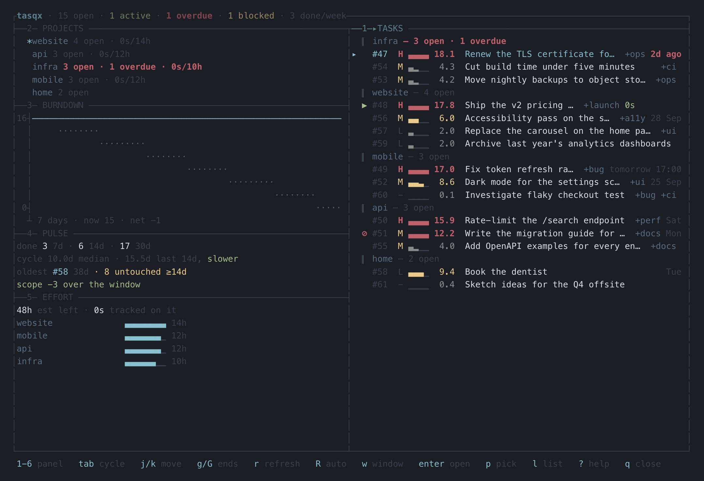
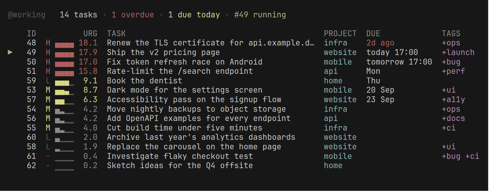
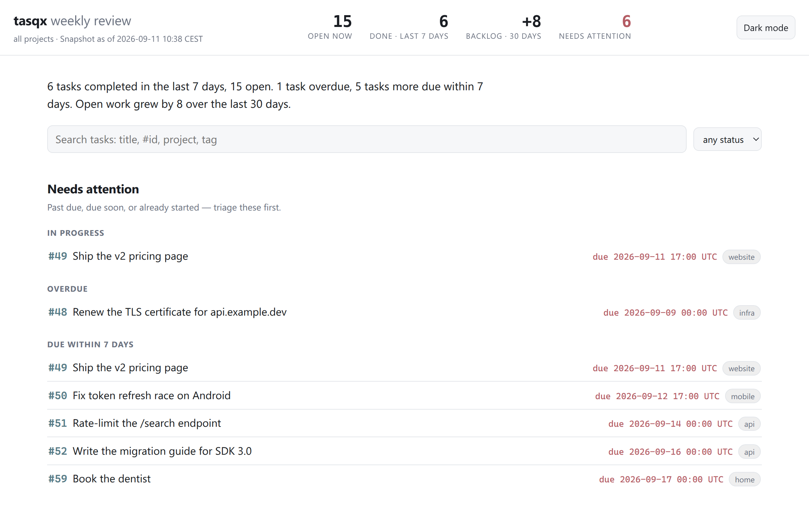

<div align="center">

# tasqx

**Your terminal task manager — and your AI agent's long-term memory.**

One binary. One SQLite file on your disk. No account, no cloud.

[](https://github.com/dimitritholen/tasqx/releases/latest)
[](https://github.com/dimitritholen/tasqx/actions/workflows/ci.yml)
[](LICENSE.md)

[Install](#install) · [Documentation](https://dimitritholen.github.io/tasqx/) · [Guides](#learn-more) · [Wiki](docs/wiki/Home.md)

<!-- Screenshots come from an invented demo store, never a real one:
     scripts/demo-store.py builds it, and its docstring has the render lines. -->


</div>

<table>
<tr>
<th width="50%">For you</th>
<th width="50%">For your agents</th>
</tr>
<tr>
<td valign="top">

- **Capture in one line:** `tasqx add Ship it due:friday +api !high`
- **Ask "what now?"** `tasqx next` picks; `tasqx why` shows the arithmetic.
- **See it all at once:** `tasqx dashboard` is a full-screen overview.
- **Send a report:** terminal charts, or one self-contained HTML page.
- **Own your data:** a file on your disk, and `cancel` and `undo` take changes back.

</td>
<td valign="top">

- **A backlog over MCP**, read-only until you grant write access.
- **One `brief` call** before starting: the task, what its prerequisites concluded, relevant memory.
- **Long-term memory** across sessions, searched over your imported docs and every annotation.
- **"Done" means something:** acceptance checks, and completion returns what it unblocked.
- **Token spend per task**, so you can see what agent work cost.

</td>
</tr>
</table>

## See it

```console
$ tasqx add Ship the release notes due:friday +docs !high --project work
▌ #42  Ship the release notes
▌ added   H ▄▄▄▄ 13.5   work   due Fri   +docs

$ tasqx next
next    #42  Ship the release notes
        H ▄▄▄▄ 13.5   work   due Fri   +docs
        tasqx start 42  ·  tasqx why 42

$ tasqx why 42
#42  Ship the release notes

  priority   H                 6.0
  deadline   due Fri           7.5
  age        created today     0.0
  urgency                     13.5
```

Urgency is recomputed on every read, so the deadline row climbs as Friday
approaches. The scores in any capture are an illustration; the rows are the contract.

<table>
<tr>
<td width="45%" valign="top">

### Your working set, ranked

Every row carries a priority, an urgency gauge and a date. One filter language
(`project:work and (+api or +ui)`) works on every listing command, `report`
and `export` included. Recurrence reads like speech (`every 3 days`,
`monthly on the 2nd tuesday`), and reminders move when the due date moves.

</td>
<td>



</td>
</tr>
<tr>
<td valign="top">

### Reports you can send

Throughput, heatmap and burndown charts drawn from the event log, or a themed
HTML page with zero external requests. Five built-in themes. `--outcomes`
measures whether the work worked: rework, estimate calibration, completions
nobody documented, abandoned work.

</td>
<td>



</td>
</tr>
</table>

## Install

macOS and Linux, with Homebrew:

```console
brew install dimitritholen/tasqx/tasqx
```

Windows, with Scoop:

```console
scoop bucket add tasqx https://github.com/dimitritholen/scoop-tasqx
scoop install tasqx
```

No package manager? Linux and macOS:

```console
curl -fsSL https://raw.githubusercontent.com/dimitritholen/tasqx/main/install.sh | sh
```

Windows (the first statement lets older PowerShell negotiate TLS at all):

```console
[Net.ServicePointManager]::SecurityProtocol=[Net.SecurityProtocolType]::Tls12; irm https://raw.githubusercontent.com/dimitritholen/tasqx/main/install.ps1 | iex
```

Brew switches Tab completion on for you; anywhere else, `tasqx completions --install`
does. Flags, checksums and what the scripts promise are in the
[install fine print](docs/wiki/Getting-Started.md#install-fine-print).

Then create a project, add a task, ask what to do now, and complete it:

```console
tasqx init work
tasqx add Buy milk
tasqx next
tasqx done 1
```

That's the whole loop. `tasqx manual` is the full guide in your terminal, and
every verb answers `-h` with examples you can paste.

Prebuilt binaries are on the [Releases page](https://github.com/dimitritholen/tasqx/releases).
Building from source needs Rust 1.95 or newer:

```console
git clone https://github.com/dimitritholen/tasqx.git
cd tasqx
cargo install --path crates/tasqx-cli --force
```

## Connect your agent

One command registers the MCP server with Claude Code and installs the
`tasqx-workflow` and `retro` skills:

```console
tasqx setup
```

Or wire the server by hand:

```console
claude mcp add --scope user tasqx -- tasqx mcp serve --scope write
```

Any other MCP client takes the same shape:

```json
{
  "mcpServers": {
    "tasqx": { "command": "tasqx", "args": ["mcp", "serve", "--scope", "write"] }
  }
}
```

A bare `tasqx mcp serve` is read-only: the agent can search and read, and never
sees a write tool. `--scope write` is the grant that lets it add, complete and
remember. Every tool, and what makes it more than remote CRUD, is on the
[AI Agents and Automation](docs/wiki/AI-Agents-and-Automation.md) page.

## Built to be trusted

There is one JSON API; the CLI, the MCP server and the HTML report are all
clients of the same dispatch, so where surfaces overlap they behave
identically. CI runs the suite on Linux, Windows and macOS on every push, and
a good chunk of it is drift guards: tests that break the build when docs and
code disagree — every flag must appear in its usage line, every in-binary doc
example must parse, and the safe ones are executed for real. `cargo mutants`
breaks the code on purpose to check the tests notice; it once caught a
one-line deletion that made `(a or b) and c` silently parse as
`a or (b and c)` — a bug that would have returned a perfectly normal-looking
table of exactly the wrong rows.

[`DESIGN.md`](DESIGN.md) is the spec and its decision log;
[`CONTRIBUTING.md`](CONTRIBUTING.md) covers building, the gates and releases;
[`CHANGELOG.md`](CHANGELOG.md) says what changed in each version.

## Learn more

The **[documentation site](https://dimitritholen.github.io/tasqx/)** is the guide `tasqx docs` opens offline, published from `main`.
The **[wiki](docs/wiki/Home.md)** explains every command in plain language, and
says plainly [what tasqx does not do yet](docs/wiki/Home.md#honest-edges).
The worked guides each take five minutes and end with commands you can paste:

- [Feature development](docs/guides/feature-development.md) — a backlog per feature, ordered by dependencies.
- [Driving tasqx from an AI agent](docs/guides/ai-agent-workflow.md) — let an agent work the backlog end to end.
- [A self-improving agent](docs/guides/self-improving-agent.md) — a retrospective skill that records what each task taught.
- [Giving an agent memory in any client](docs/guides/agent-starter-prompt.md) — a paste-anywhere block for clients without a tasqx skill.
- [Personal task management](docs/guides/personal-gtd.md) — frictionless capture and a five-minute weekly review.
- [Standups and reports](docs/guides/standup-reporting.md) — yesterday's output, terminal charts, an HTML review you can send.
- [Token accounting](docs/guides/token-accounting.md) — what agent work costs, and who pays.

## License

[FSL-1.1-MIT](LICENSE.md) — use tasqx for anything except selling a competing
product, and every release automatically becomes plain MIT two years after it
ships. Using it inside your company, scripting it, building on its API: all
fine.
