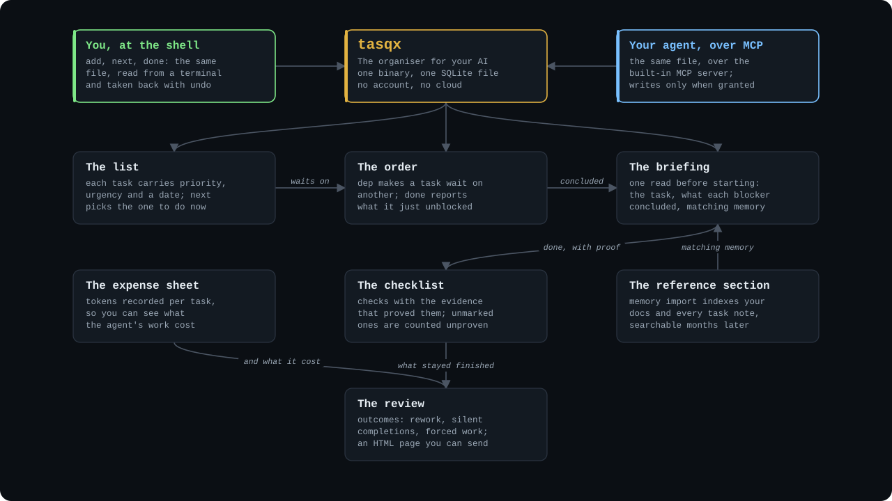
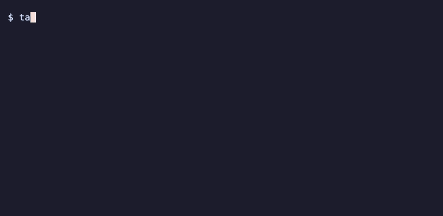
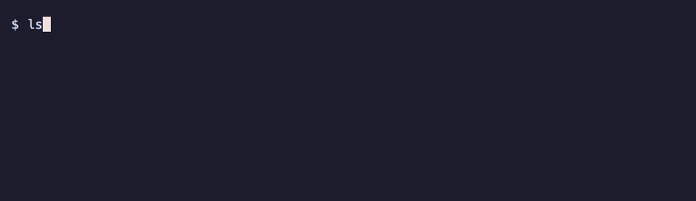
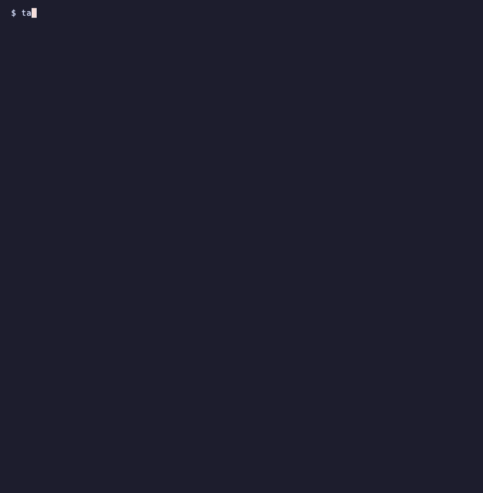

<div align="center">


**The organiser for your AI.**

A backlog, a memory and a brief for your coding agent.
One binary. One SQLite file on your disk. No account, no cloud.

[](https://github.com/dimitritholen/tasqx/releases/latest)
[](https://github.com/dimitritholen/tasqx/actions/workflows/ci.yml)
[](LICENSE.md)

[Quick start](#quick-start) · [Documentation](https://dimitritholen.github.io/tasqx/) · [Guides](#learn-more) · [Wiki](docs/wiki/Home.md)

<!-- docs/img/hero.svg is drawn by hand: a map of what the organiser holds,
     one node per feature, with its own dark background so it reads the same
     on GitHub's light and dark themes. The captures further down come from an
     invented demo store, never a real one: scripts/demo-store.py builds it,
     and its docstring has the render lines. -->


</div>

An agent that starts a task cold redoes work it finished last week, forgets
what the previous session decided, and reports "done" with nothing to show
for it. tasqx gives it what an organiser gives a person: a list in the right
order, a reference section it can search, a briefing before each piece of
work, a checklist that says what done means, and an expense sheet. All of it
is one local file, and the same file is a task manager you use from the
shell.

## Quick start

**1. Install.** macOS and Linux with Homebrew, Windows with Scoop:

```console
brew install dimitritholen/tasqx/tasqx
```

```console
scoop bucket add tasqx https://github.com/dimitritholen/scoop-tasqx
scoop install tasqx
```

No package manager? Linux and macOS:

```console
curl -fsSL https://raw.githubusercontent.com/dimitritholen/tasqx/main/install.sh | sh
```

Windows (the first statement lets older PowerShell negotiate TLS at all):

```console
[Net.ServicePointManager]::SecurityProtocol=[Net.SecurityProtocolType]::Tls12; irm https://raw.githubusercontent.com/dimitritholen/tasqx/main/install.ps1 | iex
```

**2. Connect your agent.** One command registers the MCP server with Claude
Code and installs the `tasqx-workflow` and `retro` skills:

```console
tasqx setup
```

Any other MCP client takes this shape in its config:

```json
{
  "mcpServers": {
    "tasqx": { "command": "tasqx", "args": ["mcp", "serve", "--scope", "write"] }
  }
}
```

A bare `tasqx mcp serve` is read-only: the agent can search and read, and never
sees a write tool. `--scope write` is the grant that lets it add, complete and
remember. Every tool, and what makes it more than remote CRUD, is on the
[AI Agents and Automation](docs/wiki/AI-Agents-and-Automation.md) page.

**3. Run the loop.** Create a project, add a task, ask what to do now, complete it:

```console
tasqx init work
tasqx add Buy milk
tasqx next
tasqx done 1
```

That's the whole loop, for you and for the agent alike. `tasqx manual` is the
full guide in your terminal, and every verb answers `-h` with examples you can
paste.

## What the organiser holds

<table>
<tr>
<td width="45%" valign="top">

### The list, in the right order

Every task carries a priority, an urgency gauge and a date, and `tasqx next`
picks the one to do now. One filter language (`project:work and (+api or +ui)`)
works on every listing command, `report` and `export` included. Over MCP,
`tasqx_list_tasks` with the `@working` filter hides what is blocked or waiting,
so an agent only ever sees work it can start.

</td>
<td>


</td>
</tr>
<tr>
<td valign="top">

### The order, kept for you

`tasqx dep 63 62` makes one task wait on another, and a waiting task stays out
of `next` until its prerequisite is done. Finishing a task reports what it
unblocked: `tasqx_complete_task` names the tasks it released in its answer, so
an agent has its candidates for the next step without re-listing the backlog,
and no board has cards to drag.

</td>
<td>



</td>
</tr>
<tr>
<td valign="top">

### The reference section

`tasqx memory import` reads a folder of markdown (ADRs, notes, guides) into a
local full-text index, and `tasqx memory search` finds a ruling by two words
months later, with the file it came from. Every task note is in the same
index, so what an agent decided last session is there for the next one.
Memory outlives the context window, and it never leaves your disk.

</td>
<td>



</td>
</tr>
<tr>
<td valign="top">

### The briefing

`tasqx brief` is the one read an agent makes before it starts (MCP's
`tasqx_brief_task` is the same call): the task, what each prerequisite
concluded when it was finished, and the memory that matches, under a query
tasqx derives from the task itself. Here #50 is done with a note on the real
rate limit, and the brief for #51, which waited on it, hands that ruling over.

</td>
<td>



</td>
</tr>
<tr>
<td valign="top">

### The checklist and the expense sheet

"Done" means something. A task carries acceptance checks, each of which can
be marked with the evidence that proved it, and completing a task names which
ones passed. A completion that leaves a check unmarked is counted as unproven
rather than refused.
Every completion can carry the tokens it cost. `tasqx report --outcomes` then
asks whether finished work stayed finished: how much came back as rework, how
far tracked time ran over the estimate, which completions nobody documented,
what was forced past a blocker, what was dropped after it was started, and
what the tokens cost. Every rate stands beside the count it rests on.

</td>
<td>


</td>
</tr>
<tr>
<td valign="top">

### The review

Throughput, heatmap and burndown charts drawn from the event log, or a themed
HTML page with zero external requests that you can send to anyone.
Five built-in themes. The same `--outcomes` measures land in the page, so a
weekly review says what the agent did and what it got right.

</td>
<td>


</td>
</tr>
</table>

## For you, at the shell

The organiser is a plain terminal task manager too, and a fast one: capture in
one line, ask "what now?", finish, and every change can be taken back. With the
project from the quick start in place:

```console
tasqx add Ship the release notes due:friday +docs !high
tasqx next
tasqx why <ref>
tasqx done <ref>
```

- **Capture in one line:** project, due date, priority, tags and estimate in the same breath as the title. `add` prints the task's id, and `<ref>` is that id wherever a command wants one.
- **Ask "what now?"** `tasqx next` picks; `tasqx why` shows the arithmetic, and urgency is recomputed on every read.
- **See it all at once:** `tasqx dashboard` is a full-screen overview.
- **Dates that read like speech:** `every 3 days`, `monthly on the 2nd tuesday`, and reminders move when the due date moves.
- **Own your data:** a file on your disk, and `cancel` and `undo` take changes back.

## Install details

Brew switches Tab completion on for you; anywhere else, `tasqx completions --install`
does. Flags, checksums and what the scripts promise are in the
[install fine print](docs/wiki/Getting-Started.md#install-fine-print).

Prebuilt binaries are on the [Releases page](https://github.com/dimitritholen/tasqx/releases).
Building from source needs Rust 1.95 or newer:

```console
git clone https://github.com/dimitritholen/tasqx.git
cd tasqx
cargo install --path crates/tasqx-cli --force
```

To wire the MCP server into Claude Code by hand, without the skills `tasqx setup` adds:

```console
claude mcp add --scope user tasqx -- tasqx mcp serve --scope write
```

## Built to be trusted

There is one JSON API; the CLI, the MCP server and the HTML report are all
clients of the same dispatch, so where surfaces overlap they behave
identically. CI runs the suite on Linux, Windows and macOS on every push, and
a good chunk of it is drift guards: tests that break the build when docs and
code disagree — every flag must appear in its usage line, every in-binary doc
example must parse, and the safe ones are executed for real. `cargo mutants`
breaks the code on purpose to check the tests notice; it once caught a
one-line deletion that made `(a or b) and c` silently parse as
`a or (b and c)` — a bug that would have returned a perfectly normal-looking
table of exactly the wrong rows.

[`DESIGN.md`](DESIGN.md) is the spec and its decision log;
[`CONTRIBUTING.md`](CONTRIBUTING.md) covers building, the gates and releases;
[`CHANGELOG.md`](CHANGELOG.md) says what changed in each version.

## Learn more

The **[documentation site](https://dimitritholen.github.io/tasqx/)** is the guide `tasqx docs` opens offline, published from `main`.
The **[wiki](docs/wiki/Home.md)** explains every command in plain language, and
says plainly [what tasqx does not do yet](docs/wiki/Home.md#honest-edges).
The worked guides each take five minutes and end with commands you can paste:

- [Feature development](docs/guides/feature-development.md) — a backlog per feature, ordered by dependencies.
- [Driving tasqx from an AI agent](docs/guides/ai-agent-workflow.md) — let an agent work the backlog end to end.
- [A self-improving agent](docs/guides/self-improving-agent.md) — a retrospective skill that records what each task taught.
- [Giving an agent memory in any client](docs/guides/agent-starter-prompt.md) — a paste-anywhere block for clients without a tasqx skill.
- [Personal task management](docs/guides/personal-gtd.md) — frictionless capture and a five-minute weekly review.
- [Standups and reports](docs/guides/standup-reporting.md) — yesterday's output, terminal charts, an HTML review you can send.
- [Token accounting](docs/guides/token-accounting.md) — what agent work costs, and who pays.

## License

[FSL-1.1-MIT](LICENSE.md) — use tasqx for anything except selling a competing
product, and every release automatically becomes plain MIT two years after it
ships. Using it inside your company, scripting it, building on its API: all
fine.
