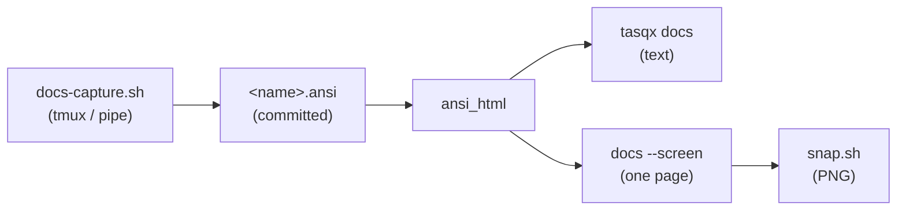

# The terminal house style

How a tasqx screen is laid out, and why. `DESIGN.md` §12 **D117** is the ruling
that settled these; this file is the working reference you read before touching
a screen, so the next one does not re-invent a look.

Every rule below came out of judging a rendered screen as an *image* at 80, 100
and 140 columns. None of them were visible to a fully green test suite, and two
of them — the gauge's resolution and its inverted ranking — could not have been
found any other way. §14 is the loop that makes that cheap.

`list`, `agenda`, the dashboard, the memory browser, `memory search`,
`pick`, `show`, `next`, `why`, `projects`, `report`, `theme list`,
`theme show`, `tasqx manual`, `tasqx about` and the write echoes (`add` and
every verb that changes something, D126) carry the style. `config list` and `tokens recompute`
do not yet.
The manual, the one screen that is mostly prose, adds conventions of its own
(a prose measure, two heading levels, copied code never split); they are
written down in `crates/tasqx-cli/src/manual.rs`'s module doc, and named by
`DESIGN.md` §12 **D123**, which is the ruling that carried the style to it.

---

## 1. One thing per row is the thing being read

The title carries the row. Everything else is context and must recede: dim the
project, the tags and the dates, keep the title at the terminal's own
foreground. A row where six cells print at the same brightness gives the eye no
path, which is what the old table did.

## 2. Spend cells on meaning

A column's width should track how much a reader gets from it. Twenty cells for
`2026-09-11T00:00:00Z` starved the title of the same twenty, on the one column
the row is actually read for. Before widening anything, ask what the column
would say in half the space.

Every table is fitted by one function, `columns::fit` (`DESIGN.md` D120), and
gives way in one order: cells come off the widest column above its floor, then
droppable columns go from the right. A table only decides what each column asks
for, where its floor is, and whether it may go. Three rules come with it:

- **A number never gives way.** Cut, it is a different number; dropped, it may
  be the one the reader asked for by name. The key column shrinks instead, and
  past its floor the row overflows.
- **Data is cut only where the terminal cannot hold it.** A wrapped row breaks
  every column at once, so a name or a value gets an ellipsis first, and the
  column that says where something came from goes before the data does.
- **A record is not a table.** Each record is fitted to itself. Its name
  stays, where it came from goes first, the handle that opens it never goes,
  and the line under it is cut to the width. `memory search` is the record
  (D125): title, source and handle on one line, the handle on the next where
  the two cannot share one, the words that matched under them.

After a drop the survivors get the freed cells back (D125), and `memory
list`'s title floor is what the terminal can give it beside the id, never
below twelve cells, so every other column goes before the title gives way.

## 3. Dates are calendar days — not instants, not elapsed hours

`today 23:59`, `tomorrow`, `yesterday`, `2d ago`, `Sun`, `17 Sep`, `4 Jan 27`.

Weekday alone inside the coming week (there is exactly one Sunday in any
six-day window); the date once the weekday stops being unambiguous; the year
only when it changes. A clock only where "when today" is still a live question
— today and tomorrow — and only when the store holds one, since a date typed
without a time resolves to 00:00 UTC and midnight is the store's spelling of
"no time given".

Calendar days rather than elapsed hours is the point: a deadline at 09:00
tomorrow is "tomorrow" to the person reading it, and `markdown::fmt_instant`'s
"in 14 hours" hands them the arithmetic the cell exists to do.

A clock is for what is still **ahead**. A moment that has already happened —
a completion, a note, an event — is a day and no clock: the reader who just
ran the command knows what time it is, and the clock a deadline carries is
UTC, so on a past moment it reads as the wall clock and is wrong by the
offset for everyone who is not on it (`done today 16:22`, rendered at 18:22
CEST). Where the interesting quantity is a span rather than an instant, print
the span (`for 12m`), which has no timezone to be wrong about.

`render::due_cell` is the implementation for what is ahead and `render::day_ago`
for what is past. Both spell a date through `render::calendar_date` (`13 Sep`,
`4 Jan 27`), and so do `agenda`'s day headings, its horizon and its footer, so
the two views cannot name one day two ways (D133).
`DESIGN.md` §12 **D126 (l)** is the ruling behind the split.

## 4. State lives in a left rail, never in a droppable column

`▶` running, `⊘` blocked, two cells, at the far left where the eye crosses
first. Never dropped by the width fit. Not drawn at all when no row has one.
`pick` sizes it over every candidate rather than the rows a search leaves on
screen, so the rows do not shift sideways as a query crosses the one running
task; there the rail can stand empty (`DESIGN.md` D124(c)).

Without Unicode they are `*` and `B` — and NOT `>`, however natural `>` looks
for "running". `>` is the CURSOR on a terminal that has no better glyph: `pick`
and the dashboard both reserve it for the row the reader is on. A state marker
drawn as the cursor is two meanings on one character, on the exact terminal
that has no colour left to tell them apart.

The glyphs must differ in SHAPE as well as in role. `NO_COLOR` (§8 of
`DESIGN.md`, the degradation table) keeps emphasis and drops every hue, so a
rail that said "red bar or green bar" would say nothing at all to the reader
who most needs the terminal to behave.

This is what the old arrangement cost: the running timer — the single piece of
state a work block depends on — sat to the RIGHT of a title that can run 72
cells, in a column `TaskCols::fit` drops on a narrow terminal.

A table of choices has one state worth a rail: which one is in effect.
`projects` marks the default and `theme list` the active theme with `*`, the
way `git branch` marks the branch that is checked out. It replaced a
seven-cell DEFAULT column holding one `*`, and nine cells of `← active`. The
same glyph is `list`'s running marker without Unicode, which is the
two-meanings case this rule argues against — and the dashboard does draw
both at once: `*` for a running task in TASKS, `*` for the default project
in PROJECTS. `DESIGN.md` D125(d) rules that it stands, and says why: they
are two panels and two columns, never the same column of one row, which is
the collision the rail exists to prevent.

## 5. A modifier belongs in the cell it modifies

Priority went inside the urgency cell rather than keeping a column of its own
plus a gap on either side to describe a number two columns away. The cell reads
`H ▄▄▄▄ 17.9`: letter, gauge, figure.

## 6. A magnitude gets a mark, and the mark must rank the way the number does

`render::urgency_meter` draws urgency as a four-cell bar on a `▁` track. Three
things it had to get right, all found by looking at it rather than by reasoning
about it:

- **Resolution where the ranking happens.** Whole cells drew 17.9 and 15.8
  identically against a top of 17.9, the pair a reader compared hardest. Three
  steps inside each cell fixed it.
- **Visual mass must rise with the value.** Drawing the remainder as a glyph
  TALLER than the bar's own `▄` made a 22 % gauge the heaviest mark in the
  column. Remainders are shorter (`▂`, `▃`), and a test weighs the glyphs across
  the whole scale rather than reading a value off them.
- **The scale belongs to the task, not to the screen** (`DESIGN.md` D119). The
  bar is `render::urgency_scale`: full at the due term's saturation, which is
  "as urgent as an overdue task", and never relative to the other rows. The
  denominator used to be the hottest row on screen, so one outlier flattened a
  hundred rows, and a filtered view painted its top row in `danger` whatever
  that row held. The same task is the same mark on `list`, `agenda` and the
  dashboard. The bar floors rather than rounds, so it is never full before the
  task is as urgent as overdue.

The colour says less than the bar, on purpose. The ramp is read in BANDS, one
per anchor, never blended: quiet grey below H priority alone, `warn` from there,
`danger` from overdue, and bold on top of `danger` so the band survives
`NO_COLOR`. A blend from grey to `warn` passes through a tan that reads more
orange than `warn` itself, which drew M rows warmer than H rows. The bar carries
the magnitude, which leaves the colour to say only which threshold was crossed.
It is the heatmap's rule again: one channel per number.

The price is at the top. Everything at or past overdue draws the same full bar,
and the figure beside it tells them apart. The precise figure always prints. The
mark is for the scan down the column, not for reading a value off. Where no
glyph set degrades honestly, draw nothing and hand the cells back: `caps.unicode`
false drops the gauge.

## 7. No rules. Weight and whitespace separate

The table was bracketed by two full-width rules; both are gone. A dim
`table.label` header over rows that start immediately under it separates them
without drawing anything.

Where a group needs separating, use a blank line — one ahead of every heading
but the first, because flush against the group above a heading reads as one
more of its rows. Prose that follows a table (omission notes, store-health
warnings) gets a blank line too: with no closing rule, a note starting flush
against the last row reads as a row whose columns broke.

## 8. A count is the least useful summary available

The reader can count the rows. Say what they cannot see:

- which question was asked — the filter for `list`, the horizon for `agenda`
- how much is late, due before the day is out, running, blocked

Print only the facts that are non-zero. A line that always says `0 overdue` is
one the reader learns to skip, and then it is not there on the day it matters.
Never `N task(s)`; `1 task` / `N tasks` (`render::plural_tasks`).

## 9. The summary must fit, and drops rather than truncates

It sits above the header, where a wrap would put a line between the labels and
the rows they name. Facts are dropped from the right until the line fits —
which is why they are built in falling order of what a reader loses by not
seeing them. Dropping says less; truncating mid-word says something else.

Every PRINTED line of facts fits by this one rule (`render::keep_ranked`,
D125(e)); the dashboard's status bar fits its own, over ratatui spans.
`next` and `add`'s echo print their facts in reading order but rank them by
what a reader loses (the urgency cell, the deadline, a running timer, then the
project and the tags). The first fact in rank that does not fit ends the line,
so nothing less important survives it.

## 10. Facts counted over the rows on screen say so

When the frame is bounded (`serve::bound_to_viewport`, `--limit`), name both
numbers: `44 tasks · 20 shown`. A fact counted over twenty rows must never read
as a claim about forty-four.

## 11. Never say the same thing twice on one screen

`agenda`'s day heading names the day, so a `WHEN` cell holding a bare `due`
under it says nothing — it is blank. Its `due today` fact is suppressed for the
same reason.

But `sched` still prints bare, because "you meant to start here" is not the
default reading of a row, and the overdue group's cells carry the day in
`list`'s words (`due 2d ago`, `due today 17:00`), because it spans many days and
has no heading to defer to. The rule is *redundant with
what is already on screen*, not *short*.

## 12. A column label is not a title

`table.label` — achromatic in every built-in — carries column headers. The
`header` role is for titles (`TASQX MANUAL`, `tasqx settings`, a task's own
name). One role was painting both, and a column label that competes with its
own rows is structure refusing to recede.

D76's principle, stated for the task card and applying here unchanged:
structure recedes, only what you act on is emphasized.

## 13. Verify by rendering

Structural tests cannot see weight, spacing or contrast. Render the screen and
look at it — at 80 and 140 as well as at the default 100, and in `mono` and
under `NO_COLOR`.

Mock in pixels, not in prose. Both layout decisions behind D117 were made from
rendered images: three candidates were drawn before any Rust moved, and the
gauge that replaced the winner was picked the same way.

## 14. The loop

One capture, one renderer, and a picture only where a picture is the only thing
that will do:



1. **Capture the screen once**, as the ANSI the binary really printed.
   `scripts/docs-capture.sh` renders every row of
   `crates/tasqx-cli/docs-fixtures/manifest.tsv` under a pinned clock against
   the demo store and writes `<name>.ansi` beside the manifest (§15).
2. **Render it.** `crate::ansi_html` turns one fixture into a
   `<pre class="term">`: that is what `tasqx docs` serves, as text rather than
   as a picture (D149(b)), and `tasqx docs --screen <name>` writes the same
   block as a standalone page — the site's terminal styling, a dark background,
   no header, no script, sized to its own content.
3. **Rasterise it** when you need an image. `scripts/snap.sh <name> [scale]`
   writes that page, hands it to headless Chrome at
   `--force-device-scale-factor=2` in a window measured from the page itself,
   and leaves `target/snaps/<name>@2x.png`.

```console
$ cargo build -p tasqx-cli
$ TASQX_DB=$PWD/target/scratch.db TASQX=target/debug/tasqx \
      scripts/docs-capture.sh --no-daemon                 # only if the screen moved
$ TASQX_DB=$PWD/target/scratch.db TASQX=target/debug/tasqx scripts/snap.sh list
$ TASQX_DB=$PWD/target/scratch.db TASQX=target/debug/tasqx scripts/snap.sh dashboard 3
```

Steps 2 and 3 open no store and no daemon: the fixture is compiled into the
binary. The scratch `TASQX_DB` (and, for the capture, `--no-daemon`) is for
`CLAUDE.md`'s dev-build guard, which reads the command line and not the script,
so it has to be spelled on each line — these scripts do not relax the rule,
they simply have nothing to read.

`snap.sh` writes into `target/snaps/`, so pictures do not reach a commit. The
PNGs in `docs/img/` are the exception and the reason this path exists at all:
GitHub's markdown cannot carry a styled span, so the README's screens have to be
raster — and they are rasterised from the same renderer the site uses, not from
a second toolchain. `freeze` was that second toolchain, and it disagreed with
the bytes twice: it ignored SGR 39, so a cell resetting to the terminal's
default kept the colour before it (the dashboard's titles rendered tinted in the
ramp colour of the figure beside them), and it drew SGR 1 at normal weight, so
nothing was ever bold — on a write echo bold means "this write changed it", and
under `NO_COLOR` it is the only emphasis left. `ansi_html` has a unit test for
each; that is what made the second toolchain retirable.

A width the manifest does not carry is a manifest change, not a `snap.sh` flag:
`list-narrow` is `list` at 80 columns, and a width you are judging gets a row
the same way — added while you work on it, kept if the site should show it.

Judging the whole generated site — every page, not one terminal screen — is a
different job, and `scripts/snap-web.mjs` is for that: it reads the page ids
out of the generated HTML itself, so a new page needs no change to the script,
and shoots each one at a desktop and a mobile width in both themes. Headless
Chrome on macOS floors `--window-size` at 500px, so a 390px screenshot taken
that way is a cropped 500px layout wearing the right number — the script
drives Chrome over CDP (the DevTools protocol) instead, which has no such
floor, and switches theme by clicking the site's own header button so the page
runs its own `applyTheme`/`localStorage` code rather than a stand-in for it.

```console
$ cargo build -p tasqx-cli
$ TASQX_DB=$PWD/target/scratch.db target/debug/tasqx --no-daemon \
      docs --stdout > target/site.html
$ node scripts/snap-web.mjs target/site.html target/snaps/site
```

Output lands in `target/snaps/site/` (gitignored): a viewport screenshot and a
full-page one (capped at four viewport heights) per page/width/theme, plus one
`report.json` listing, per page and width, any element overflowing the
viewport and any console error the page threw.

The GIFs are the pictures that do not come through this loop, because they
move: a fixture is one screen, and a GIF is a few commands in sequence. Each is
scripted by a tape for [VHS](https://github.com/charmbracelet/vhs), which types
into a real terminal and encodes what it draws (D163). `hero.gif` is no longer
linked from the README (D176), but its tape is kept, and the others name it for
their requirements:

| GIF | Tape | Re-record after a change to |
|---|---|---|
| `docs/img/hero.gif` | `scripts/hero.tape` | `add`, `dep`, `pick` (search and card), short-id allocation |
| `docs/img/hero-receipt.gif` | `scripts/hero-receipt.tape` | #50/#51 in `scripts/demo-store.py`, the MCP tool surface, `task.get` and `task.brief` output (not deterministic: see below) |
| `docs/img/memory-recall.gif` | `scripts/memory-recall.tape` | #50/#51 and their notes and `MEMORY` in `scripts/demo-store.py`, `memory.search`, the MCP tool surface (not deterministic: see below) |
| `docs/img/deps.gif` | `scripts/deps.tape` | `init`, `add`, `dep`, `list`, `done`, `next`, short-id allocation |
| `docs/img/memory.gif` | `scripts/memory.tape` | `memory import`, `memory search`, `scripts/demo-decisions/` |
| `docs/img/brief.gif` | `scripts/brief.tape` | `annotate`, `done`, `brief --card`, #50/#51 in `scripts/demo-store.py` |
| `docs/img/outcomes.gif` | `scripts/outcomes.tape` | `report --outcomes`, `outcomes()` in `scripts/demo-store.py` |

The column names the commands on screen and the ones the tape's hidden setup
runs; a change to any command a tape types, or to `scripts/demo-store.py`, is
a reason to re-record it.

Every tape starts with `Source scripts/demo-prelude.tape`, which rebuilds the
demo store under the same pin as the capture and wraps `tasqx` in
`--no-daemon`, so the installed binary records the demo and never the real
store. Record from the repo root, with the installed binary built from the tree:

```console
$ cargo install --path crates/tasqx-cli --force
$ vhs scripts/hero.tape                                   # → docs/img/hero.gif
```

Use vhs 0.11.0: 0.12.0 prints "Creating docs/img/hero.gif...", exits 0 and
writes nothing (charmbracelet/vhs#787). Keep a feature-row GIF at 15 seconds or
less and `hero.gif` at about 25, each around 2 MB at most, and look at its last
frame before committing — a GIF loops, and the last frame is the one a reader
sits on.

`docs/img/hero-receipt.gif`, the README's first picture, is not deterministic
(D192), and neither is `memory-recall.gif` below. Its tape types a single prompt into a real Claude Code
session, and the agent's answer is the model's, so two takes differ. What is
scripted is the room: `scripts/hero-stage.sh` rebuilds the demo store as a
scratch copy, an invented repository holding the guide task #51 is about, a
Claude Code config directory with nothing but a login in it, and an MCP config
naming tasqx alone with `--no-daemon`. Recording needs vhs 0.11.0, a Claude
Code login (the stage script copies `~/.claude/.credentials.json`, or
`$CLAUDE_CREDENTIALS`, into `target/hero/cc`, which is gitignored), `ttyd`,
`ffmpeg`, Python with Pillow, and `gifsicle`. The copy is the same OAuth
login, so if Claude Code rotates its refresh token during a take, the original
in `~/.claude` may need a fresh `/login` afterwards:

```console
$ cargo install --path crates/tasqx-cli --force
$ scripts/hero-stage.sh && vhs scripts/hero-receipt.tape && scripts/hero-assemble.sh
```

The tape leaves the raw take in `target/hero/take.mp4`; `hero-assemble.sh`
speeds up only the stretch where the agent works, labels it as sped up, holds
the answer and adds the end card. A retake is fine. The agent's text is never
edited, and a take whose answer does not show what the README says it shows is
retaken, not cut into shape. Re-record after a change to #50 or #51 in
`scripts/demo-store.py`, to the MCP tool surface, or to what `task.get` and
`task.brief` return, and watch the whole take before committing it.

`docs/img/memory-recall.gif`, the first picture in the README's reference
section, is a second take in the same room under the same rules (D194). Its tape
is `hero-receipt.tape` with the prompt changed to "Cut the SDK 3.0 release.",
and `HERO=memory` tells `hero-assemble.sh` which GIF to write, when the prompt
is typed, and what the end card says (the default, `HERO=receipt`, is the hero):

```console
$ scripts/hero-stage.sh && vhs scripts/memory-recall.tape && HERO=memory scripts/hero-assemble.sh
```

A take is only worth keeping if the agent searches memory, finds both the
`release-process` doc and the ruling annotated on #51, and holds the release.
Re-record after a change to #50 or #51 or their notes in
`scripts/demo-store.py`, to its `MEMORY` docs, to what `memory.search` returns
for the agent's query (the take depends on D193's any-word fallback), or to the
MCP tool surface.

## 15. The fixtures the documentation ships

One row of `crates/tasqx-cli/docs-fixtures/manifest.tsv` is one screen: a name,
a kind (`pipe`, `pipe-mut` for a row that writes, `tui` for a full-screen one), a
width, the arguments, and a request envelope for the `api` rows. The script pins
the clock to one Wednesday, rebuilds the demo store under that pin, renders every
row — through a pipe, or in a tmux pane for the full-screen three — and writes
`<name>.ansi` beside the manifest. Those files are committed, `fixtures.rs`
embeds them, and `ansi_html.rs` renders them into the guide as styled text
(DESIGN.md D149).

```console
$ TASQX_DB=$PWD/target/scratch.db TASQX=target/debug/tasqx \
      scripts/docs-capture.sh --no-daemon
$ TASQX_DB=$PWD/target/scratch.db TASQX=target/debug/tasqx \
      scripts/docs-capture.sh --check --no-daemon             # what CI runs
```

Two consequences for anyone changing a screen:

- **A screen change is a fixture change in the same commit.** The `docs-fixtures`
  CI job re-captures and compares byte for byte, so a layout tweak that is not
  regenerated turns the job red. Regenerate; never hand-edit a `.ansi`.
- **A README picture is downstream of a fixture.** When `list` or `dashboard`
  changes, re-capture, then re-run `scripts/snap.sh` for that name and copy the
  PNG over `docs/img/`. To read a whole rendered screen instead of looking at
  one, generate the guide (`tasqx docs --out site.html`) and open it.

Adding a screen: append a row, run the script, commit the `.ansi` with it, and
add the name to `screens![]` in `crates/tasqx-cli/src/fixtures.rs` — a test fails
until the manifest, the directory and that list agree.

Some output cannot be a fixture, and the script refuses it rather than letting
CI find it on somebody else's machine: an absolute path or a build hash (`about`,
`core.capabilities`), a freshly minted id (`api task.add`), and an FTS `rank`
(`task.brief`, `memory.search` as JSON) — bm25 goes through the platform's
`log()`, so the last digits differ between macOS and Linux. The rendered SCREENS
over the same searches are fine: they print snippets, not the number. The
manifest's header lists every exclusion with its reason.

---

## Contract

The strings this document quotes, so a change to one of them reddens
`the_house_style_doc_still_describes_the_screens` in `render.rs` rather than
leaving a guide describing a screen that no longer exists.

| Thing | Value |
|---|---|
| rail, running | `▶` (`*` without Unicode) |
| rail, blocked | `⊘` (`B` without Unicode) |
| rail, the one in effect | `*` (`projects`, `theme list`) |
| gauge, full cell | `▄` |
| gauge, track | `▁` |
| gauge, remainder | `▂` `▃` |
| gauge width | 4 cells |
| gauge full at | urgency 12 (`urgency::DUE_WEIGHT`) |
| ramp bands, built-ins | from 0 · from 6 · from 12 |
| column-header role | `table.label` |

## Where it is not carried yet

- `config list` and `tokens recompute` — not judged as images. `config list`
  fits the width (D120) and takes `table.label`; `tokens recompute` still
  counts `N task(s)`.
- The dashboard carries it. The disagreement its spec had with rule 4 (`⛔` for
  blocked where this file says `⊘`) is settled in favour of `⊘`, which is what
  `list`, `agenda` and TASKS all now draw.
